C10长期筹资

# 1. 长期债务筹资

## 1.1. 比较记忆各种筹资方式的特点:star: :star: :star: 

债务筹资与普通股筹资相比的特点：

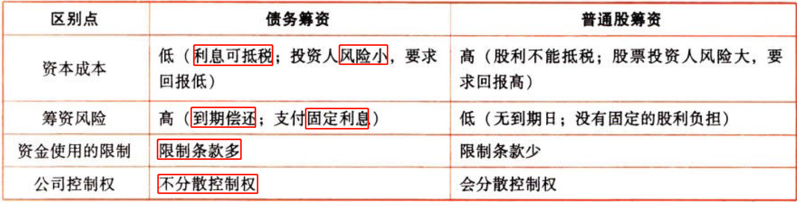

长期债务与短期债务相比的特点：

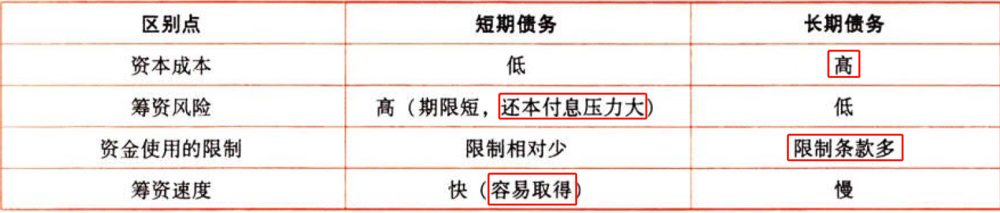

银行借款与债券筹资相比的特点：

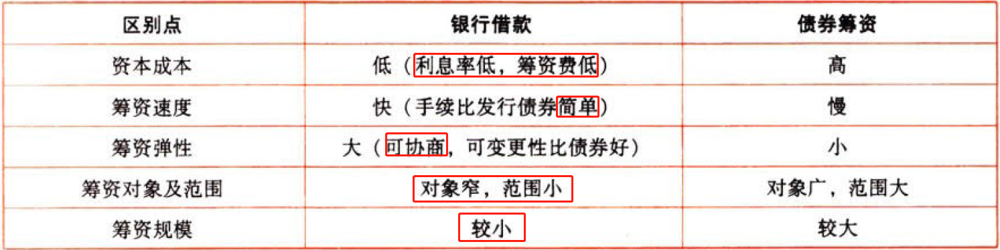

## 1.2. 长期借款的保护性条款:star: :star: 

为了保证贷款按时足额偿还，银行通常在贷款合同中加入保护性条款。归纳起来有两类：

### 1.2.1. 一般性保护条款

一般性保护条款应用于大多数借款合同，但根据具体情况会有不同内容（针对`负债保障`方面的，防止偿债风险加大的一些常见条款）。

### 1.2.2. 特殊性保护条款

特殊性保护条款是针对某些特殊情况而出现在部分借款合同中的（针对`资金用途`的特殊限定、针对高管人员的特殊限定）。

## 1.3. 债券发行价格:star: :star: 

### 1.3.3. 债券发行价格

$$债券.发行价格=未来支付的利息.现值+到期本金.现值$$

折现率按债券发行时的`市场利率`确定。

### 1.3.4. 债券发行价格的三种情况

## 1.4. 四、债券偿还:star: 

### 1.4.5. 债券的偿还时间

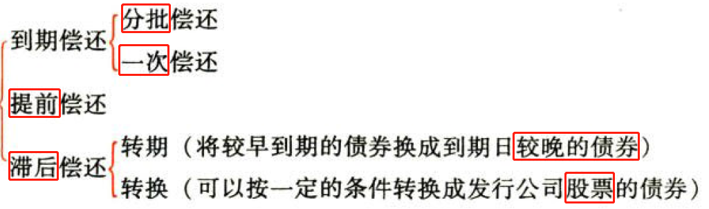

### 1.4.6. 债券的偿还形式

# 2. 普通股筹资

## 2.5. 普通股筹资的特点:star: :star: :star: 

优点：①没有固定利息负担；②没有固定到期日；③财务风险小；④能增加公司的信誉；⑤筹资限制较少；⑥在通货膨胀时普通股筹资容易吸收资金

缺点：①普通股的资本`成本较高`；②可能会分散公司的`控制权`；③信息披露成本大，也增加了公司保护`商业秘密`的难度；④股票上市会增加公司`被收购`的风险

## 2.6. 普通股的发行方式:star: 

### 2.6.7. 以发行对象为标准的分类

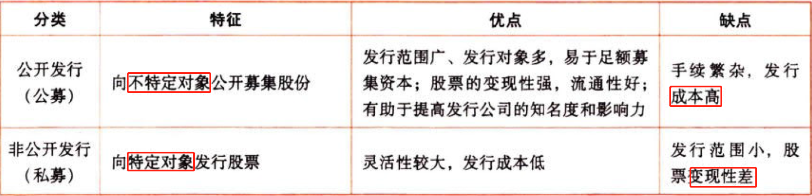

（1）有下列情形之一的，为公开发行：①向不特定对象发行证券；②向特定对象发行证券累计超过200人，但依法实施员工持股计划的员工人数不计算在内；③法律、行政法规规定的其他发行行为

（2）非公开发行股票的特定对象应当符合下列规定：①特定对象符合股东大会决议规定的条件：②发行对象不超过35名。发行对象为境外战略投资者的，应当遵守国家的相关规定

### 2.6.8. 以发行中是否有中介机构（证券承销商）协助为标准的分类

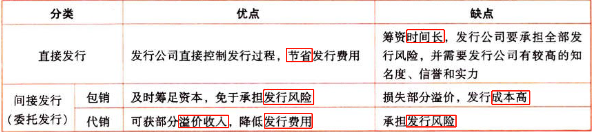

### 2.6.9. 以发行股票能否带来现款为标准的分类

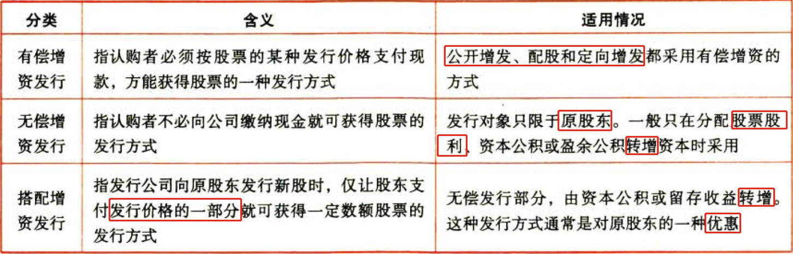

## 2.7. 普通股的发行定价:star: 

### 2.7.10. 定价的基本原则

发行人通常会参考公司经营业绩、净资产、发展潜力、发行数量、行业特点、股市状态等，确定发行价格。我国《公司法》规定，股票发行价格可以按票面金额，也可以超过票面金额，但不得低于票面金额。

### 2.7.11. 定价的方式

#### 2.7.11.1. 首次公开发行股票

可以通过向网下投资者询价的方式确定股票发行价格，也可以通过发行人与主承销商自主协商直接定价等其他合法可行的方式确定发行价格

#### 2.7.11.2. 增发新股

我国《上市公司证券发行管理办法》规定，公开增发股票的发行价格应不低于公告招股意向书前20个交易日公司股票均价或前1个交易日的均价：非公开发行股票的发行价格不低于定价基准日前20个交易日公司股票均价的80%

## 2.8. 股权再融资:star: :star: :star: 

股权再融资（seasoned-equity-offering）的方式包括向原股东配股和增发新股融资。

### 2.8.12. 配股

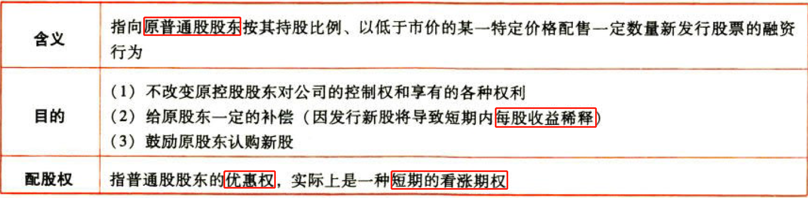

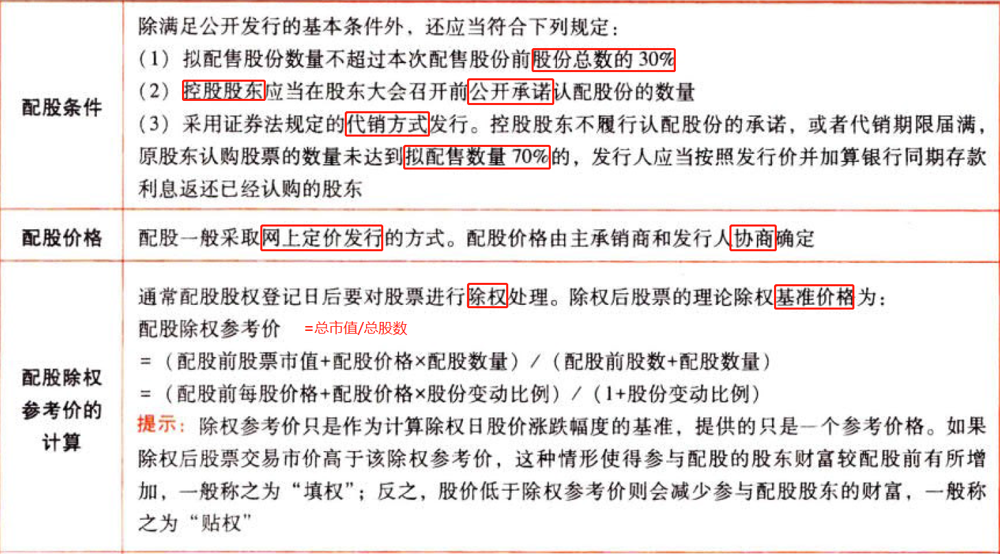

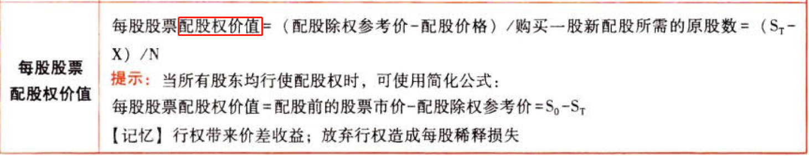

### 2.8.13. 增发新股

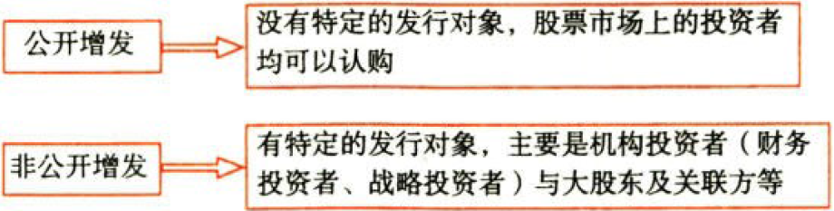

配股和公开增发属于公开发行，非公开增发属于非公开发行

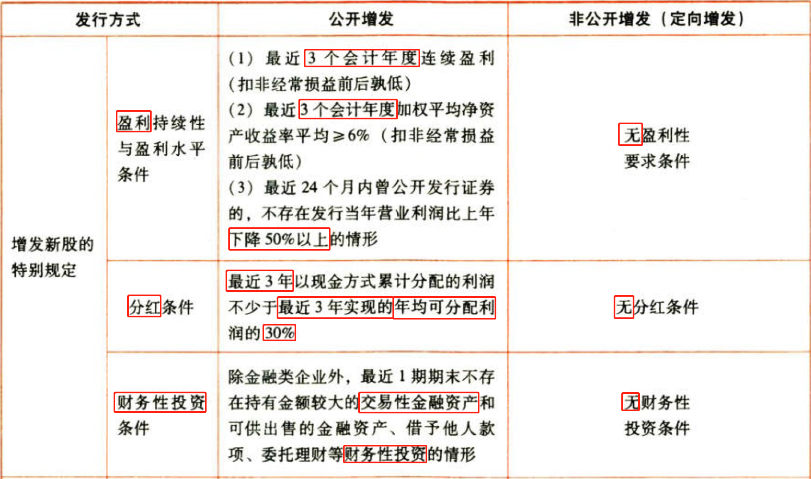

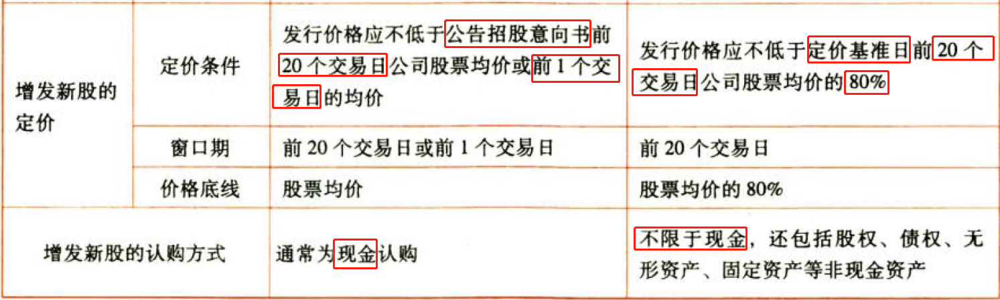

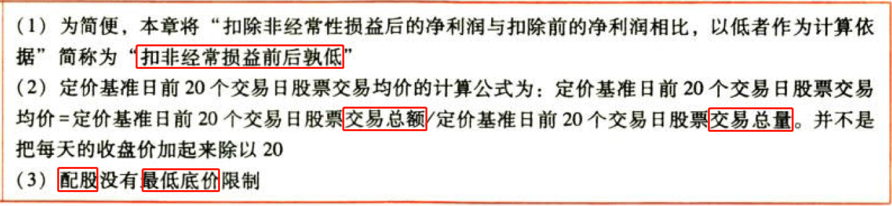

# 3. 混合筹资

## 3.9. 优先股筹资:star: :star: 

### 3.9.14. 《优先股试点管理办法》的相关规定

#### 3.9.14.3. 优先股的发行主体

上市公司可以发行优先股（公开或非公开），非上市公众公司可以非公开发行优先股。

#### 3.9.14.4. 上市公司发行优先股的一般条件

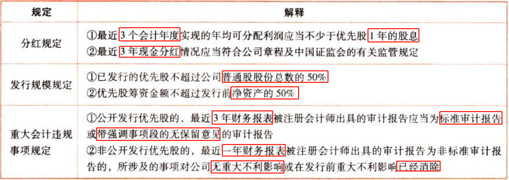

#### 3.9.14.5. 上市公司公开发行优先股的特别规定

（1）上市公司公开发行优先股应符合以下三种情形之一。

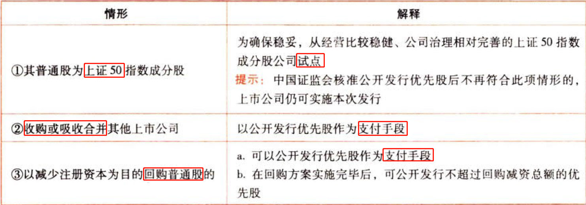

（2）上市公司公开发行优先股的其他特别规定。

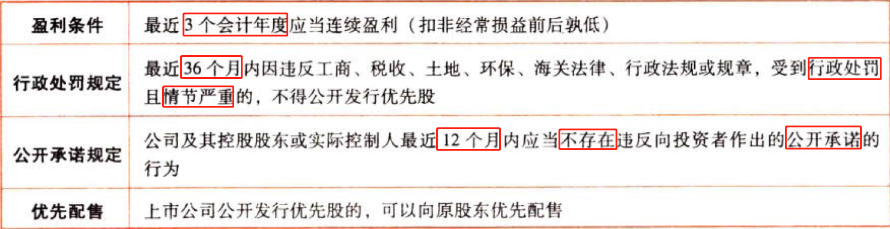

（3）上市公司公开发行优先股应当在公司章程中规定以下事项。

商业银行发行优先股补充资本的，可就强制分红和累积分红事项另行约定。

#### 3.9.14.6. 其他规定

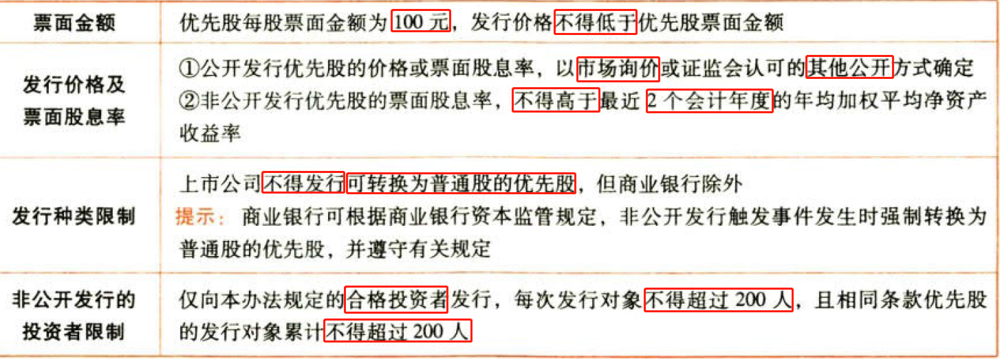

#### 3.9.14.7. 交易转让及登记结算

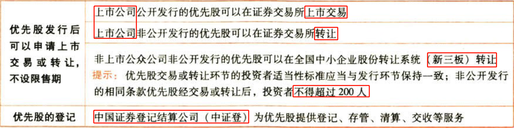

### 3.9.15. 优先股的筹资成本

### 3.9.16. 优先股筹资的优缺点

### 3.9.17. 永续债

永续侦是具有一定权益属性的债务工具，也是一种混合筹资工具。

## 3.10. 附认股极证债券筹资:star: :star: :star: 

### 3.10.18. 认股权证的特征

认股权证是公司向股东发放的一种凭证，授权其持有者在一个特定期间以特定价格购买特定数量的公司股票。

#### 3.10.18.8. 认股权证与看涨期权（以股票为标的物）的相同点

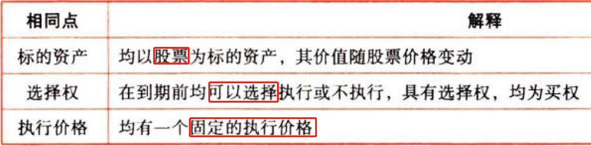

#### 3.10.18.9. 认股权证与股票看涨期权的区别

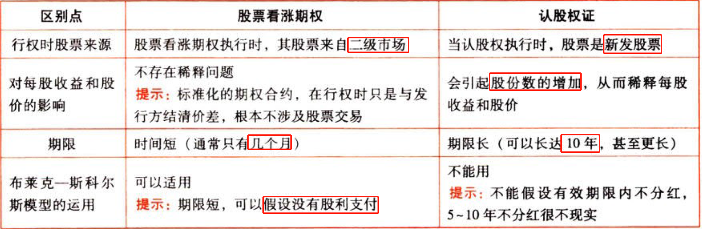

### 3.10.19. 发行认股权证的用途

### 3.10.20. 附认股权证债券的筹资成本

#### 3.10.20.10. 附认股权证债券的含义

附认股权证债券，是指公司债券附认股权证，持有人依法享有在一定期间内按约定价格（执行价格）认购公司股票的权利，是债券加上认股权证的产品组合。

#### 3.10.20.11. 附认股权证债券的种类

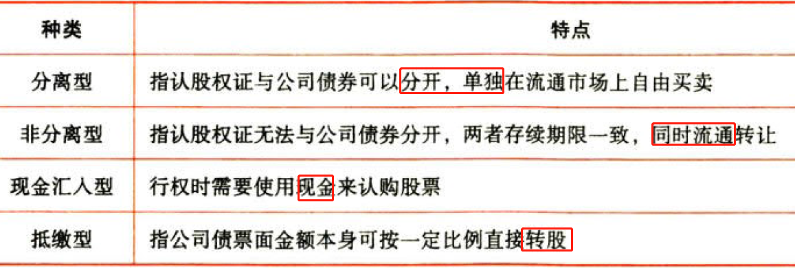

非分离型和抵缴型近似于可转债，考试不符指时附认股权证债券是指分离型和现金汇入型

#### 3.10.20.12. 认股权证的价值

$$债券附带的总认股权证的价值=附带认股权证债券的发行价格-纯债券的价值$$

$$每份认股权证的价值=债券附带的总认股权证的价值/每张债券附带的认股权证数$$

#### 3.10.20.13. 附认股权证债券的成本

计算方法：附认股权证债券的资本成本，可以用投资人的`内含报酬率`来估计。

决策原则：：计算出的内含报酬率必须处在债务的市场利率和（税前）普通股成本之间，才可以被发行人和投资人同时接受。

### 3.10.21. 附认股权证债券筹资的优点和缺点

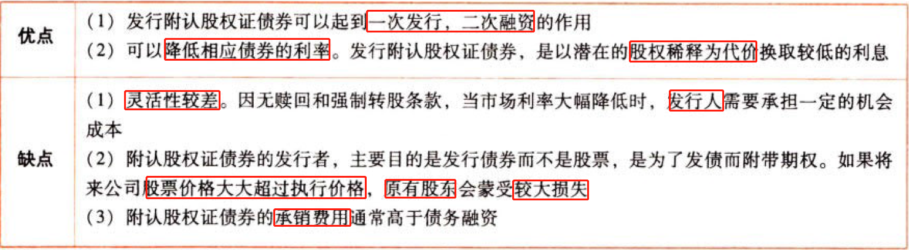

## 3.11. 可转换债券筹资:star: :star: :star: 

### 3.11.22. 含义与特点

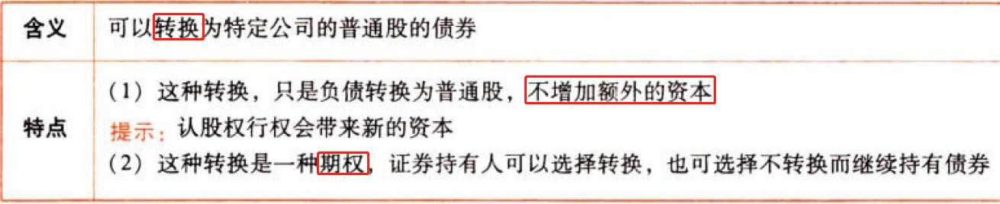

### 3.11.23. 可转换债券的主要条款

#### 3.11.23.14. 转换条款

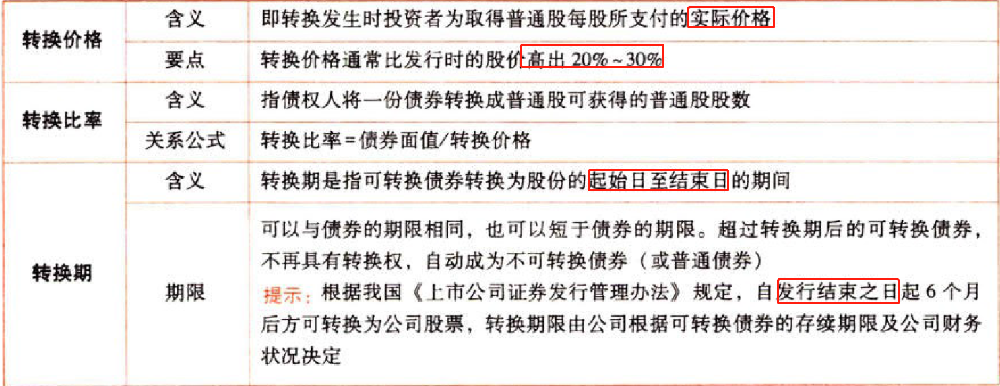

#### 3.11.23.15. 赎回条款

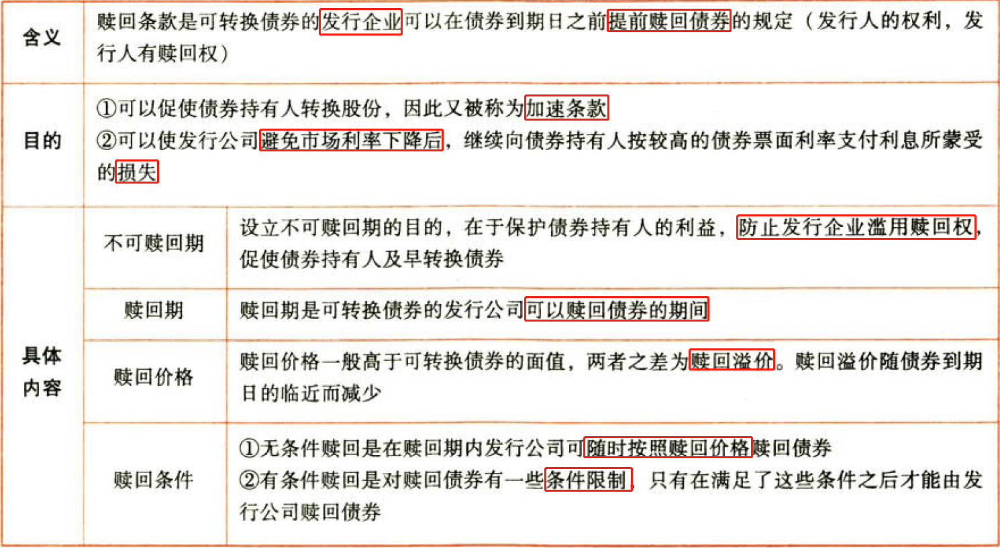

#### 3.11.23.16. 回售条款

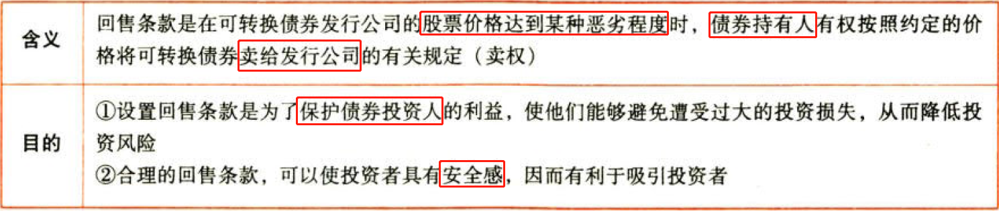

#### 3.11.23.17. 强制性转换条款

### 3.11.24. 可转换债券的筹资成本

#### 3.11.24.18. 可转换债券的最低价值

$$纯债券价值=利息的现值+本金的现值$$

$$转换价值=股价\times转换比例$$

可转换债券的最低价值，应当是纯债券价值和转换价值两者中`较高者`。

#### 3.11.24.19. 可转换债券的税前成本

计算方法：可以用投资人的`内含报酬率`来估计。

决策原则：计算出的内含报酬率必须处在债务的市场利率和（税前）普通股成本之间，才可以被发行人和投资人同时接受。

### 3.11.25. 可转换债券筹资的优点和缺点

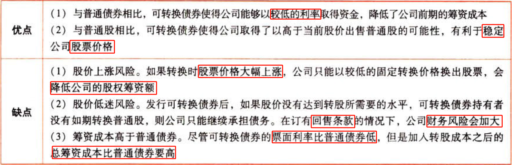

## 3.12. 可转换债券和附认股权证债券的区别

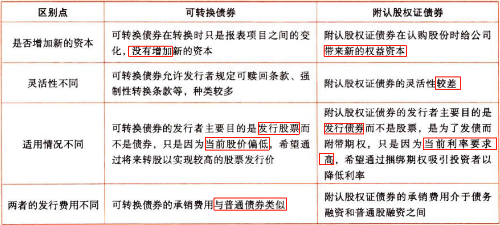

可转换债券的承销费用＜附认股权证债券。因为附认股权证债券的承销费用大于债务融资，而可转换债券的承销费用与债务融资类似。

# 4. 租赁筹资

## 4.13. 租赁的慨念及原因:star: :star: 

### 4.13.26. 租赁的主要概念

#### 4.13.26.20. 租赁的含义

租赁是指在一定的期间内，`出租人`将`资产使用权`让与`承租人`以获取`对价`的合同。

#### 4.13.26.21. 租赁的类型

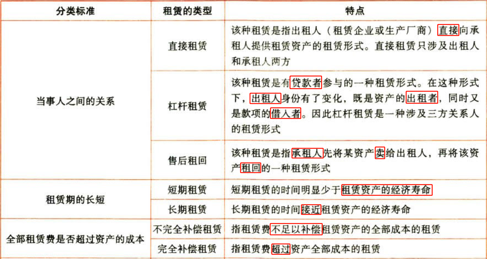

#### 4.13.26.22. 租赁费用

### 4.13.27. 租赁存在的原因

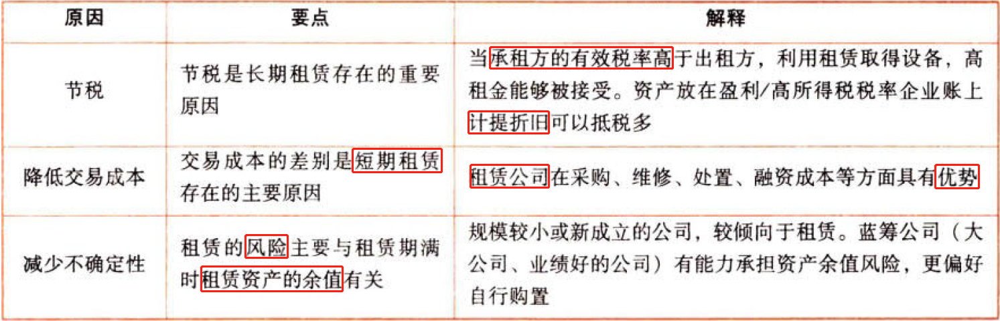

## 4.14. 租赁的会计处理和税务处理:star: 

### 4.14.28. 租赁的会计处理

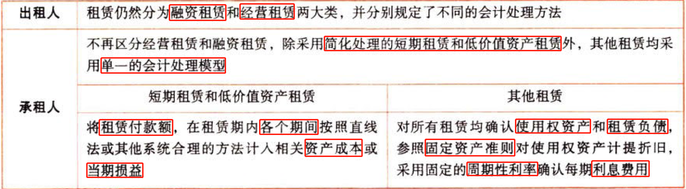

短期租赁，是指在租赁期开始日，租赁期不超过`12个月`的租赁，但包含`购买选择权`的租赁不属于短期租赁；低价值资产租赁，是指单项租赁资产为`全新资产时价值较低`的租赁。低价值资产租赁的标准应该是一个`绝对金额`，即仅与资产金新状态下的绝对价值有关，不受承租人规模、性质等影响，也不考虑该资产对于承租人或相关租赁交易的重要性

### 4.14.29. 租赁的税务处理

税法没有规定租赁的分类标准，可以采用会计准则对租赁的分类和确认标准；税收法规规定了租赁资产的`计税基础`和`扣除时间`，并且与会计准则不一致，应遵循税收法规。

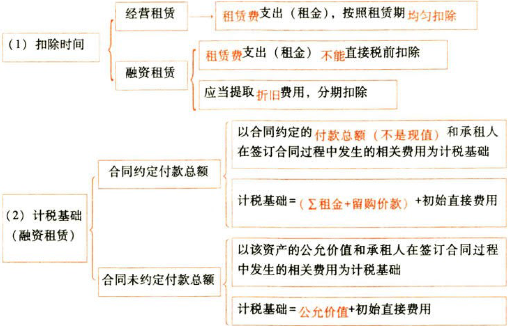

### 4.14.30. 租赁的决策分析

#### 4.14.30.23. 租赁的财务处理

财务管理主要关注估值。由于`税法`的相关规定将影响`税后现金流量`，故财务管理采用税法的角度而不是会计的角度看待租赁问题。

#### 4.14.30.24. 租赁分析的基本方法

$$租赁净现值=租赁的现金流量.总现值-借款购买的现金流量.总现值$$

计算现值使用的折现率通常使用`有担保债券的税后利率`，它比无风险利率稍微高一点。

#### 4.14.30.25. 短期租赁和低价值资产租赁（租赁费可以抵税的租赁）

$$承租人租赁期的现金流量=-税后租金=-租金\times(1-所得税税率)$$

#### 4.14.30.26. 其他租赁（租赁费不可抵税的租赁）

##### 4.14.30.26.1. （1）分期折旧抵扣

税法规定：租赁费不可抵税时，租赁资产可以提取折旧费用，分期扣除。

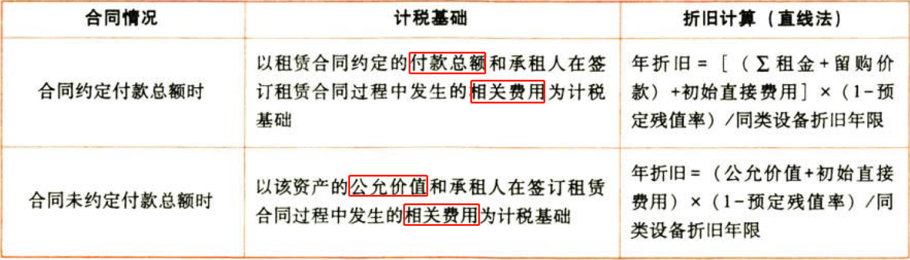

##### 4.14.30.26.2. （2）承租人现金流量确定

①期末所有权不转移：

因为期末所有权不转移，所以变现价值为0，变现损失＝账面净值＝计税基础－己提折旧

②若期末所有权转移：

（3）购买的相关现金流量：

#### 4.14.30.27. 租赁分析的折现率

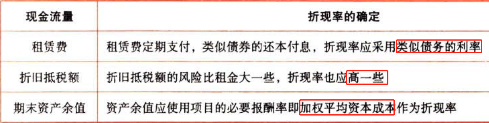

在实务中的惯例是采用简单的办法，就是统一使用`有担保的债券利率`作为折现率。与此间时，对于折旧抵税额和期末资产余值进行比较谨慎的估计，即根据风险大小适当调整预计现金流量

#### 4.14.30.28. 租赁决策对投资决策的影响

若投资项目按常规筹资有负的净现值，但：项目的调整净现值＝项目的常规净现值＋租赁净现值，当调整净现值大于0时，项目可行。

## 4.15. 售后租回:star: 

### 4.15.31. 含义

指卖主（即承租人）将一项自制或外购的资产出售后，又将该项资产从买主（即出租人）租回。在售后租回方式下，卖主同时是承租人，买主同时是出租人。

### 4.15.32. 会计处理

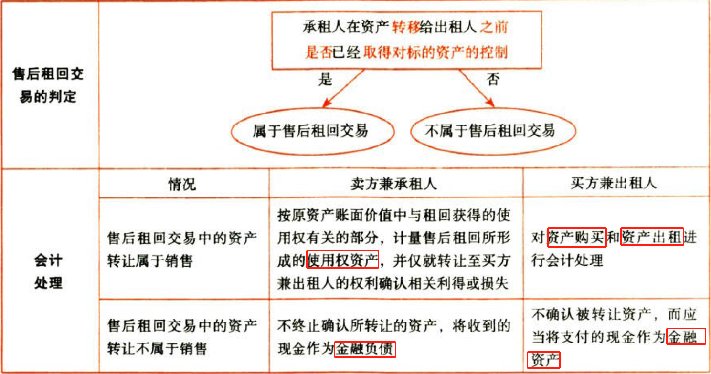

### 4.15.33. 税务处理

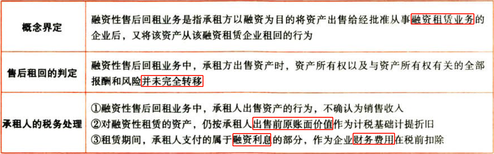

财务管理从估值角度出发，关注的是税后现金流量，故将采用税法的角度而不是会计的角度看待售后租回。其中，税收法律、法规有规定的按税收法律、法规，来规定的按财务、会计处理办法。

# 5. 总结

End。
