C11股利分配、股票分与股票回购

# 1. 股利理论与股利政策

## 1.1. 股利理论:star: :star: :star: 

### 1.1.1. 股利无关论（完全市场理论）

主要观点：

（1）投资者`不关心`公司股利的`分配`

（2）股利的支付率`不影响`公司的`价值`

该理论描述的是－种完美资本市场，又被称为完全市场理论

### 1.1.2. 股利相关论

#### 1.1.2.1. 税差理论

税差：现金股利税和资本利得税有差异。

税差的表现：

（1）税率差：一般出于保护和鼓励资本市场投资的目的，会采用股利收益税率高于资本利得税率的差异税率制度。

（2）股东在支付税金时间上有差异（持续持有股票可以延迟资本利得的纳税时间，可以体现递延纳税的时间价值）

税差理论的主要观点：

（1）如果不考虑股票交易成本，企业应采取`低现金股利支付率`的分配政策

（2）如果存在股票的交易成本，且资本利得税与交易成本之和大于股利收益税时，企业应采用高现金股利支付率政策

#### 1.1.2.2. 客户效应理论

主要观点：

（1）边际税率较高的投资者（如富有的投资者）偏好低现金股利支付息的股票

（2）边际税率较低的投资者（如养老基金）喜欢高现金股利支付率的股票

客户效应理论是对税差理论的进一步扩展，研究处于不同税收等级的投资者对待股利分配态度的差异。

#### 1.1.2.3. “一鸟在手”理论

主要观点：

投资者更偏好于现金股利，随着公司股利支付率的提高，权益价值因此而上升

#### 1.1.2.4. 代理理论

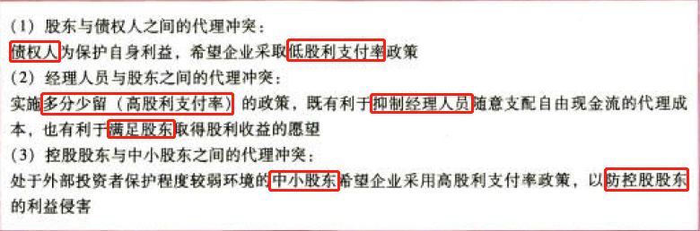

#### 1.1.2.5. 信号理论

主要观点：

在信息不对称的情况下，公司可以通过股利政策向市场传递有关公司未来盈利能力的信息。股利政策所产生的信息效应会影响股票的价格。

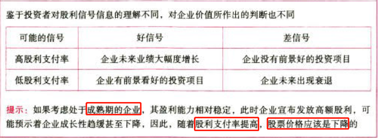

## 1.2. 股利政策的类型:star: :star: :star: 

### 1.2.3. 剩余股利政策

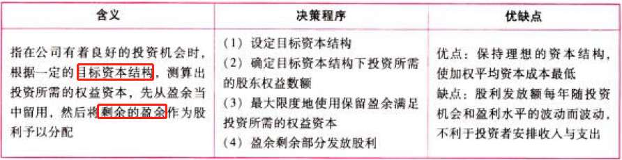

剩余股利策的理论依据是股利无关论

分析剩余股利政策要注意以下儿点：

（1）财务限制：

资本结构是长期有息负债和所有者权益的比率，不是资产负债率。

分配股利的现金问题，是营运资金管理问题，如果现金存最不足，可以通过短期借款解决，与筹集长期资本无直接关系。

（2）法律限制：

法律有关计提法定盈余公积金的规定，实际上只是对本年利润“留存”数额的限制，而不是对股利分配的限制。

（3）在剩余股利政策下，限制动用以前年度未分配利润分配股利。如果动用，企业为保持目标资本结构，还需要按照目标资本结构去增发新股和借款，不符合经济原则。

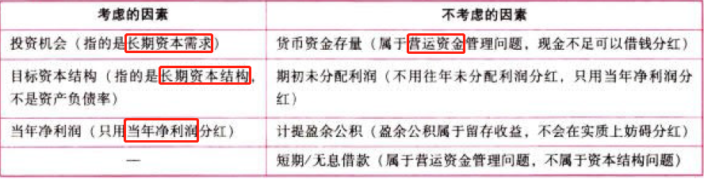

### 1.2.4. 固定股利或稳定增长股利政策

企业将每年派发的股利固定在某一特定水平上或是在此基础上维持某一固定增长率从而逐年稳定增长。

### 1.2.5. 固定股利支付率政策

公司确定一个股利占盈余的比率，并长期按此比率支付股利。

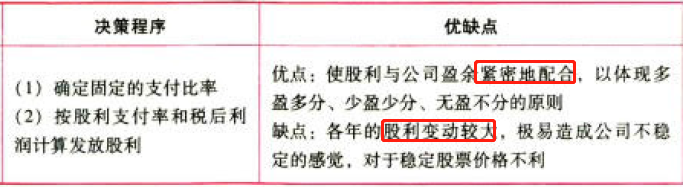

### 1.2.6. 低正常股利加额外股利政策

公司一般情况下每年只支付固定的数额较低的股利，在盈余多的年份，再根据实际情况发放额外股利。

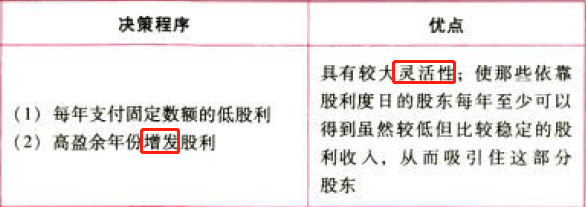

### 1.2.7. 小结

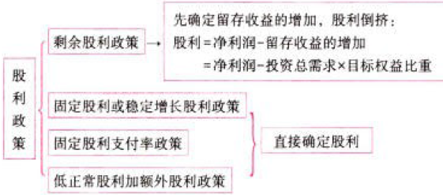

## 1.3. 股利政策的影响因素:star: :star: 

### 1.3.8. 法律限制

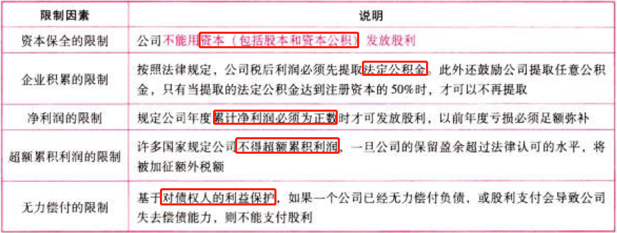

### 1.3.9. 股东因素

### 1.3.10. 公司因素

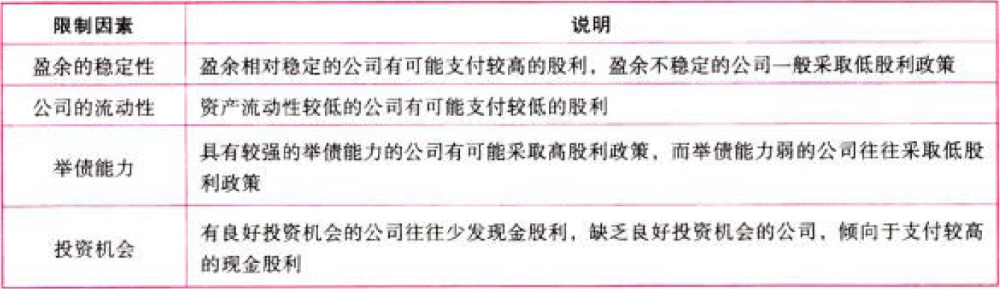

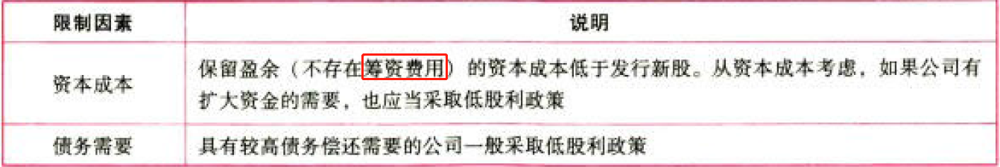

### 1.3.11. 其他限制

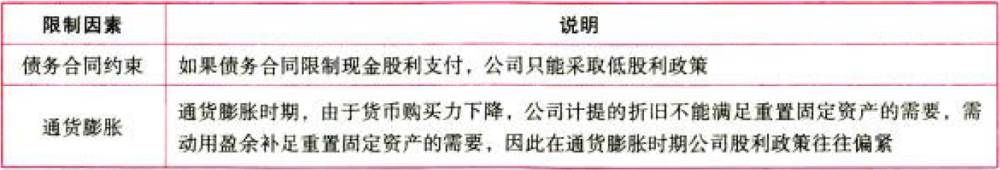

# 2. 股利的种类、支付程序、分配方案

## 2.4. 股利的种类:star: 

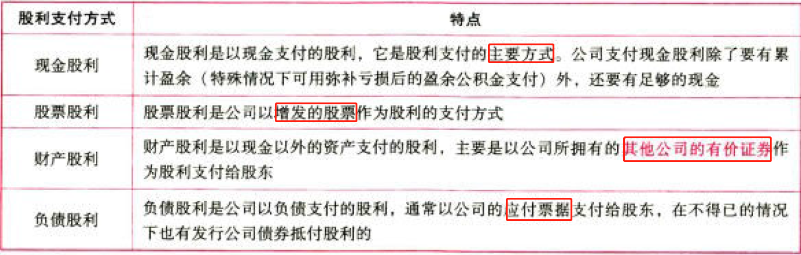

## 2.5. 股利支付程序:star: :star: 

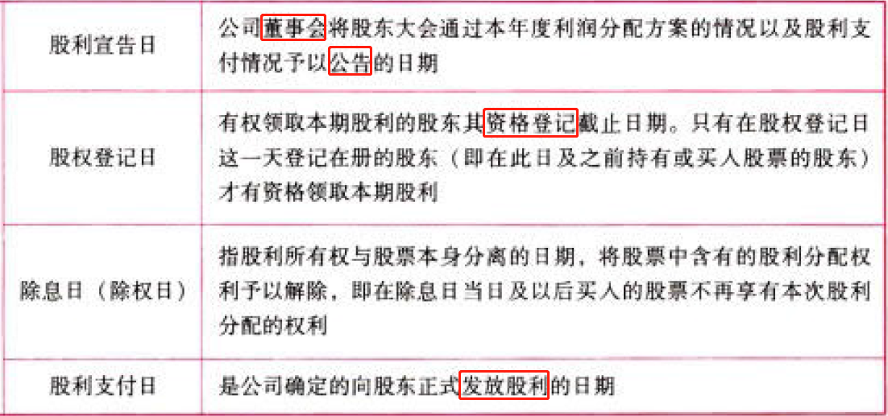

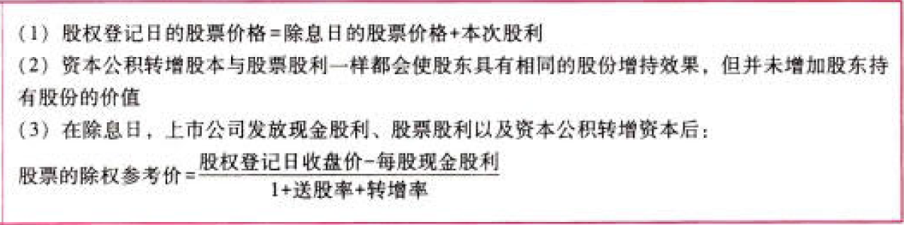

## 2.6. 股票股利:star: :star: 

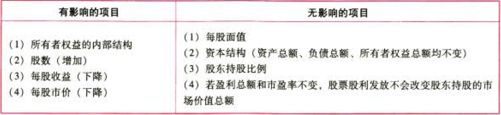

发放股票股利对所有者权益的内部结构的影响：在我国股票股利按面值确定，“未分配利润”按面值减少（Δ股数×每股面值），“股本”按面值增加（Δ股数×每股面值），“资本公积”不变。

# 3. 股票分割、股票回购

## 3.7. 、股票分割:star: :star: :star: 

### 3.7.12. 股票分割的含义与目的

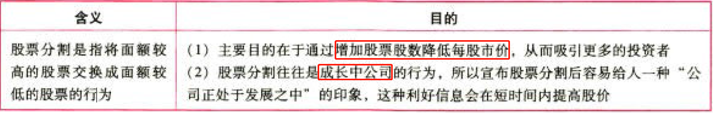

反分割是股票分割的相反行为，即将数股面额较低的股票合并为一股面额较高的股票。

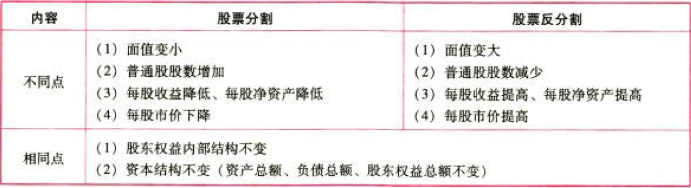

### 3.7.13. 股票分割与股票股利的比较

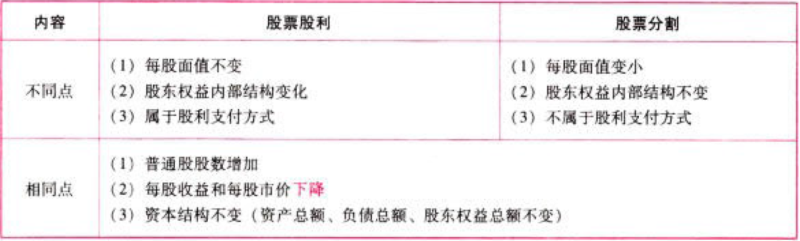

## 3.8. 股票回购:star: :star: :star: 

### 3.8.14. 股票回购的含义

股票回购是指公司出资购回自身发行在外的股票。

### 3.8.15. 股票回购vs股票分割、反分割、股票股利

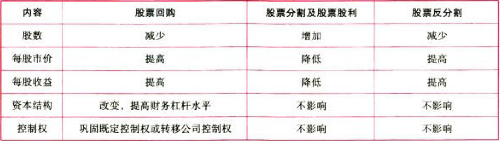

### 3.8.16. 股票回购vs现金股利

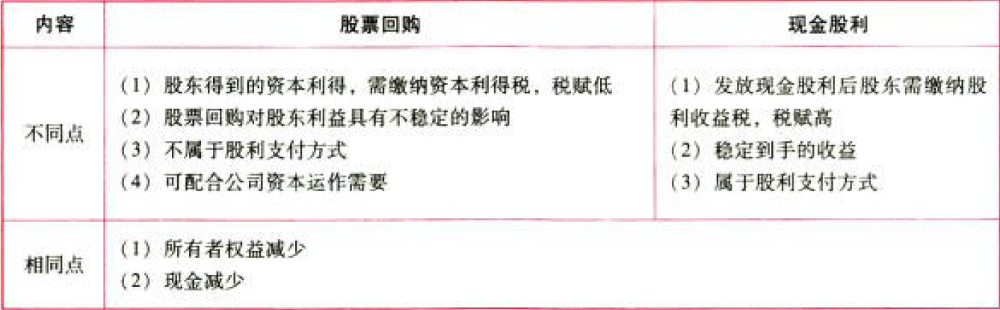

现金股利、股票股利、股票回购、股票分割对报表结构的影响如下图所示：

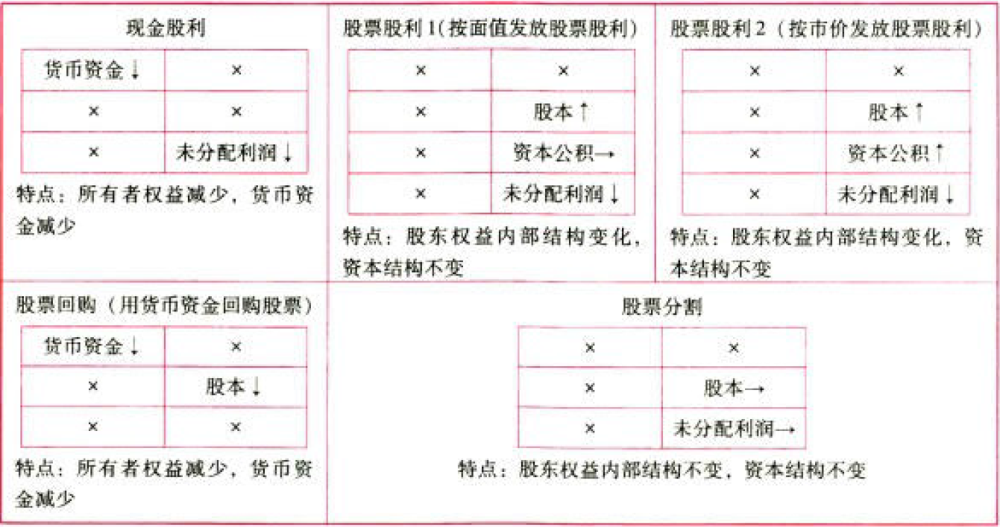

### 3.8.17. 股票回购对公司的作用

（1）向市场传达积极信号（股价被低估），提升股价。

（2）避免股利波动的负面影响，稳定股价。

（3）减少自由现金流，降低管理层代理成本。

（4）反收购策略，减少流通股，抬高股价。

（5）改变资本结构，提高财务杠杆。

（6）调节所有权结构，用于认股权证行权、可转债行权、股权激励、交换被收购或被兼并公司的股票。

### 3.8.18. 股票回购的方式

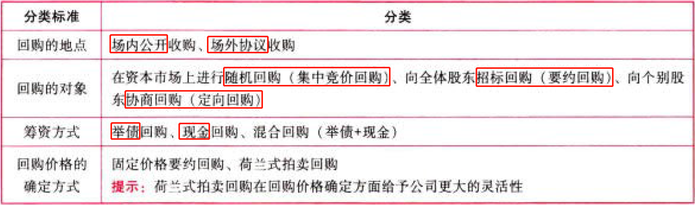

# 4. 总结

End。
