C12营运资本管理

# 1. 营运资本管理策略

## 1.1. 营运资本投资策略:star: :star: 

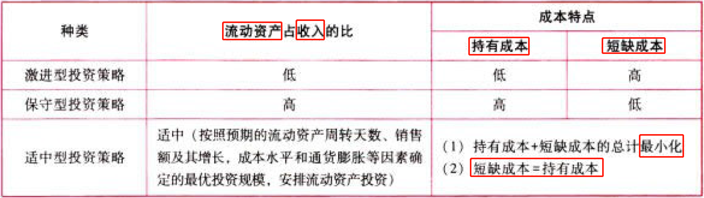

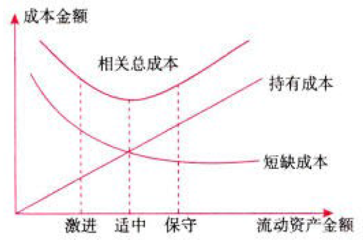

## 1.2. 营运资本筹资策略:star: :star: :star: 

### 1.2.1. 营运资本筹资策略的衡量指标——易变现率

流动资产和流动负债的特殊分类：

易变现率：`经营性流动资产`中`长期资金来源`的比例

注意：$金融资产=金融性流动资产$，$金融负债=金融性流动负债=短期金融负债$

$$易变现率=\frac{长期资金来源-长期资产}{经营性流动资产}=\frac{股东权益+长期负债+经营性流动负债-长期资产}{经营性流动资产}$$

$$=\frac{股东权益+长期负债+经营性流动负债+金融负债-长期资产-金融负债}{经营性流动资产}$$

$$=\frac{总资产-长期资产-金融负债}{经营性流动资产}$$

$$=\frac{经营性流动资产+金融资产-金融负债}{经营性流动资产}$$

$$=\frac{稳定性流动资产+波动性流动资产-金融负债}{经营性流动资产}$$

### 1.2.2. 营运资本筹资策略

#### 1.2.2.1. 适中型筹资策略

尽可能贯彻筹资的匹配原则，即长期投资由长期资金支持，短期投资由短期资金支持。

风险、收益适中。

营业低谷时，易变现率=1；营业高峰时，易变现率＜1，数值越小，风险越大。

$$波动性流动资产=短期金融负债$$

$$长期资产+稳定性流动资产=股东权益+长期负债+经营性流动负债$$

#### 1.2.2.2. 激进型筹资策略

短期金融负债不但融通临时做流动资产的资金需要，还解决部分长期性资产的资金需要。

资本成本低，风险、收益均高。

易变现率较低。

营业低谷时，易变现率＜1；营业高峰时，易变现率＜1，数值越小，风险越大。

$$波动性流动资产＜短期金融负债$$

$$长期资产+稳定性流动资产＞股东权益+长期负债+经营性流动负债$$

#### 1.2.2.3. 保守型筹资策略

短期金融负债只融通部分波动性流动资产的资金需要，另一部分波动性流动资产和全部稳定性流动资产，则由长期资金来源支持。

资本成本高，风险、收益均低。

易变现率较高。

营业低谷时，易变现率＞1；营业高峰时，易变现率＜1，数值越小，风险越大。

$$波动性流动资产＞短期金融负债$$

$$长期资产+稳定性流动资产＜股东权益+长期负债+经营性流动负债$$

#### 1.2.2.4. 提示

临时性负债属于短期负债，筹资风险大，但资本成本低。三种策略中激进型筹资策略的临时性负债所占比重最大，保守型筹资策略的临时性负债所占比重最小。

当净金融流动负债为0时，易变现率=1，企业存在净金融流动负债会使易变现率＜1，存在净金融流动资产会使易变现率＞1。

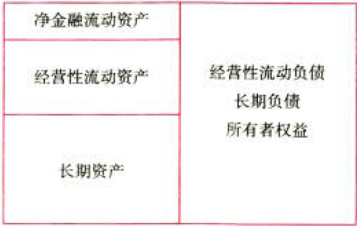

# 2. 现金管理

## 2.3. 现金管理的目标及方法:star: 

### 2.3.3. 企业置存现金的原因

### 2.3.4. 现金管理的方法

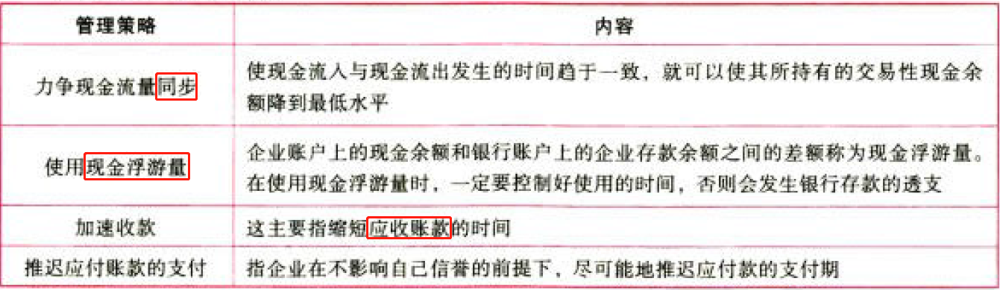

## 2.4. 最佳现金持有量分析:star: :star: :star: 

### 2.4.5. 成本分析模式

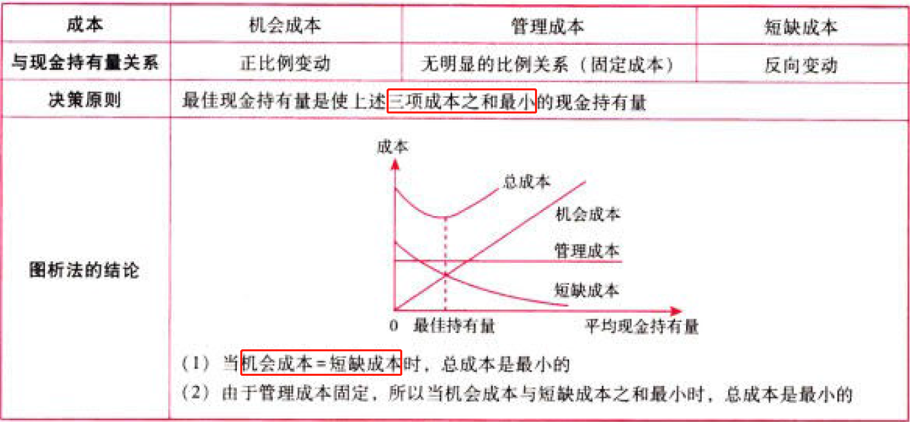

### 2.4.6. 存货模式

现金管理的机会成本与证券变现的交易成本之和最小（现金管理的机会成本与证券变现的交易成本相等）时，现金管理的总成本最低。

$$机会成本=平均现金持有量\times持有现金的机会成本率=\frac{C}{2}\times{K}$$

$$交易成本=交易次数\times每次交易成本=\frac{一定期间内的现金需求量}{现金持有量}\times每次交易成本=\frac{T}{C}\times{F}$$

$$最佳现金持有量C_\ast=\sqrt\frac{2\times{T}\times{F}}{K}$$

$$最小相关总成本TC(C_\ast)=\sqrt{2\times{T}\times{F}\times{K}}$$

### 2.4.7. 随机模式

企业根据历史经验和现实需要，测算出一个现金持有量的控制范围，即制定出现金持有量的`上限和下限`，将现金持有量控制在上下限之内。

适用范围：随机模式建立在企业的现金未来需求总量和收支`不可预测`的前提下。

特点：计算出来的观金持有量比较`保守`。

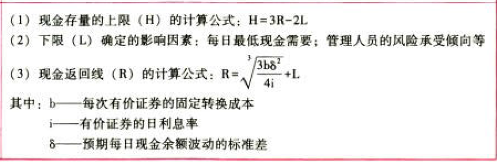

下限$L$确定的影响因素：每日最低现金需要；管理人员的风险承受倾向等。

$$上限H-返回线R =2\times(返回线R-下限L)$$

$$返回线R=\sqrt[3]{\frac{3\times每次有价证券的固定转换成本b\times预期每日现金余额波动的标准差\delta^2}{4\times有价证券的日利息率i}}+L=\sqrt[3]{\frac{3b\delta^2}{4i}}+L$$

控制特点：

# 3. 应收账款管理

## 3.5. 应收账款的功能与成本:star: 

## 3.6. 信用政策分析:star: :star: :star: 

### 3.6.8. 信用政策的构成

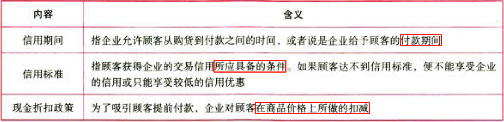

### 3.6.9. 确定信用标准应考虑的因素

企业在设定某一顾客的信用标准时，往往先要评估其赖账的可能性。这可以通过“5C”系统来进行。

### 3.6.10. 改变信用政策的决策

#### 3.6.10.5. 总额分析法

（1）计算各个方案的收益：

$$收益=营业收入-变动成本-固定成本=边际贡献-固定成本=销售量\times单位边际贡献-固定成本$$

（2）计算各个方案实施信用政策的成本费用：

$$应收账款占用资金.应计利息=应收账款占用资金\times资本成本$$

\$\$应收账款占用资金
=应收账款平均余额\\times变动成本率=日赊销额\\times平均收现期\\times变动成本率\$\$

$$存货占用资金.应计利息=存货占用资金\times资本成本=存货平均余额\times资本成本$$

$$应付账款占用资金.抵减应计利息=应付账款占用资金\times资本成本=应付账款平均余额\times资本成本$$

//计算收账费用+坏账损失

$$现金折扣成本=\sum(赊销额\times折扣率\times享受折扣的客户比率)$$

（3）计算各方案税前损益：

$$税前损益=收益-成本费用$$

（4）决策原则

选择税前损益最大的方案。

#### 3.6.10.6. 差量分析法

（1）计算收益的增加：

$$\Delta收益=\Delta营业收入-\Delta变动成本-\Delta固定成本=\Delta边际贡献-\Delta固定成本$$

（2）计算实施信用政策成本费用的增加：

$$\Delta占用资金.应计利息=\cdots$$

$$\Delta收账费用+\Delta坏账损失=\cdots$$

$$\Delta现金折扣成本=\cdots$$

（3）计算改变信用政策增加的税前损益：

$$\Delta税前损益=\Delta收益-\Delta成本费用$$

（4）决策原则

如果改变信用政策后$$\Delta税前损益>0$，则可以改变信用政策。

#### 3.6.10.7. 提示

（1）“应收账款占用资金”应当按“应收账款平均余额×变动成本率”计算确定。因为需要增加的营运资金数额仅仅是变动成本，既不是全部销售额，也不是全部制造成本。

（2）应收账款平均收现期的确定：

①没有折扣期、只有信用期、没有逾期客户：

$$平均收现期=信用期$$

②既有折扣期、又有信用期、没有逾期客户：

$$平均收现期=折扣期\times享受折扣客户比率+信用期\times放弃折扣客户比率$$

③既有折扣期、又有信用期、还有逾期客户：

$$平均收现期=折扣期\times享受折扣客户比率+信用期\times放弃折扣但未逾期客户比率+逾期付款期\times逾期客户比率$$

（3）存货占用资金=存货平均余额

①当已知平均库存量时：

$$存货占用资金=平均库存量\times单位变动成本$$

②当已知存货周转率时：

$$存货占用资金=营业成本/存货周转率$$

或

$$存货占用资金=营业收入/存货周转率$$

# 4. 存货管理

## 4.7. 储备存货的成本:star: :star: 

储存变动成本主要包括存货资金的应计利息、存货的破损和变质损失、存货的保险费用等

## 4.8. 存货经济批量分析:star: :star: :star: 

### 4.8.11. 绞济订货量的基本模型

#### 4.8.11.8. 经济订货量的概念

使`存货总成本最低`的进货批量，叫做最佳采购批量，也叫做经济订货量或经济批量。

#### 4.8.11.9. 需要满足的假设条件

#### 4.8.11.10. 基本公式

$$经济订货量Q_\ast=\sqrt\frac{2\times每次订货的单位变动成本K\times存货年需要量D}{单位储存变动成本K_c}=\sqrt\frac{2KD}{K_c}$$

$$与批量有关的存货总成本TC(Q_\ast)=订货变动成本+储存变动成本=\frac{D}{Q_\ast}K+\frac{Q_\ast}{2}K_c=\sqrt{2KDK_c}$$

$$最佳订货次数N_\ast=D/Q_\ast$$

$$最佳订货周期t_\ast=1/N_\ast$$

$$经济订货量占用资金I_\ast=Q_\ast/2\timesU$$

从价计算的单位存储成本需要将成本率乘以单位购置成本，转换为以元/件/年为单位的形式。例如资金成本率为8%，则$单件存货年占用资金的应计利息=单位购置成本\times资金成本率$

### 4.8.12. 经济订货量基本模型的扩展

#### 4.8.12.11. 存在数量折扣

决策相关总成本：

$$购置成本=年需要量\times单价$$

$$订货变动成本=年订货次数\times每次订货变动成本$$

$$储存变动成本=年平均库存量\times单位存货的年储存变动成本$$

#### 4.8.12.12. 存在订货提前期

①再订货点R指企业再次发出订货单时，尚有存货的库存量

$$R=平均交货时间\times每日平均需求量=L\times{d}$$

②提前订货对经济订货量并无影响，相关公式与进步模型完全一样

#### 4.8.12.13. 存货陆续供应和使用

设每日送货量为P，存货每日消耗量为d

$$经济订货量Q_\ast=\sqrt\{frac{2\times每次订货的单位变动成本K\times存货年需要量D}{单位储存变动成本K_c}\times\frac{每日送货量}{每日送货量-每日消耗量}}=\sqrt\{frac{2KD}{K_c}\times\frac{P}{P-d}}$$

$$与批量有关的存货总成本TC(Q_\ast)=订货变动成本+储存变动成本=\sqrt{2KDK_c(P-d)/P}$$

$$最佳订货次数N_\ast=D/Q_\ast$$

$$最佳订货周期t_\ast=1/N_\ast$$

$$经济订货量占用资金I_\ast=Q_\ast/2\timesU\times(P-d)/P$$

自制情况下，$U$代表的是单位成本

### 4.8.13. 提示

（1）陆续供应和使用的经济订货量公式，还可用于自制决策，自制存货下相关指标确定：

①经济生产批量：

$$Q_\ast=\sqrt\frac{2KD}{K_c(1-d/P)}$$

②相关总成本模型：

\$\$TC(Q_\\ast)
=\\sqrt{2\\times每次生产准备成本K\\times{D}\\times单位存货的年储存成本K_c\\times(1-每日耗用量d/每日产量P)}=\\sqrt{2KDK_c(1-d/P)}\$\$

（2）自制与外购存货的决策

$$外购总成本=经济订货量下的相关总成本+购置成本+其他固定成本$$

$$自制总成本=经济生产批量下的相关总成本+生产成本+其他固定成本$$

哪个小选哪个。

### 4.8.14. 保险储备

按照某一订货批量和再订货点发出订单后，如果需求增大或送货延迟，就会发生缺货或供货中断。为防止由此造成的损失，就需要多储备一些存货以备应急之需，称为保险储备（安全存量）。

（1）考虑保险储备量下的再订货点计算公式：

$$再订货点R=平均交货时间\times平均日需求+保险储备=L\times{d}+B$$

（2）保险储备量的总成本公式：

\$\$TC(S,B)
=单位缺货成本\\times一次订货缺货量\\times年订货次数+保险储备量\\times单位储存变动成本=K_U\\times{S}\\times{N}+B\\times{K_c}\$\$

确定方法：

逐步测试法：首先计算不同保险储备量下的总成本$TC(S,B)$，然后再对比总成本，选定其中最低的。

### 4.8.15. 关于交货期内平均需求量$L\times{d}$的计算

（1）如果给出交货时间、年需求量、年的工作天数，则

$$交货期内平均需求量=平均交货时间\times平均日需求=L\times{d}$$

例如：从发出订单到货物到达需要3天时间，企业年需求量为3600千克，－年的工作天数为300天，则$交货期内平均需求量=3\times(3600/300)=36（千克）$。

（2）如果没有给出交货时间，或无法计算得到平均每天交货量，但是给出交货期内需求量的概率分布，则

$$交货期内平均需求量=\sum(交货期内需求量\times概率)$$

例如：

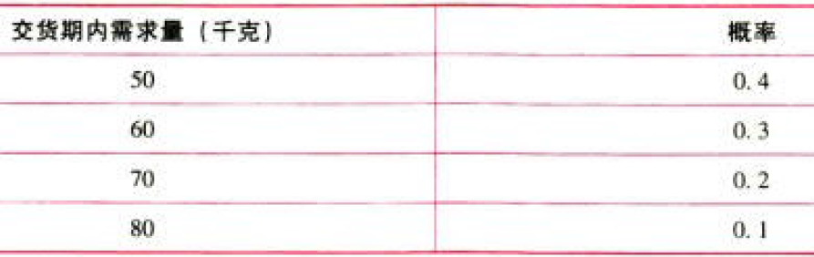

则交货期内配件需求量=50x0.4+60x0.3+70x0.2+80x0.1=60（千克）。

（3）当题中告知延迟交货时间，例如：

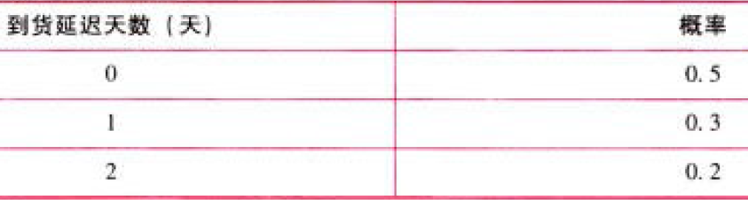

正常情况下从订货至到货需要10天，平均每天耗用量为2吨，则交货期内需求量及出现的概率为：

此时不能用$交货期×日需求量×概率$直接计算交货期内配件需求量，因为到货延迟天数为0包含正常到货或提前到货，相当于提前到货的具体概率未知，所以不能直接加权平均计算，而是应该使用$交货期内需求量＝平均交货时间×平均日需求量$计算。

以上内容在后练练习题中会陆续遇到。

# 5. 短期债务管理

## 5.9. 短期债务筹资的特点:star: :star: 

（1）筹资速度快，容易取得。

（2）筹资富有弹性。

（3）筹资成本较低。

（4）筹资风险高。

## 5.10. 商业信用筹资:star: :star: 

应付账款、应付票据、预收账款等。

在商品交易中由于延期付款或预收货款所形成的企业间的借贷关系。

优点：容易取得：不存在现金折扣或使用不带息票据时.不负担成本。（但如果有现金折扣，放弃现金折扣时所付出的成本较高）

放弃现金折扣成本的计算：

$$放弃现金折扣成本=\frac{折扣百分比}{1-折扣百分比}\times\frac{360}{信用期-折扣期}$$

如果按复利计算，公式为：

$$放弃现金折扣成本=(1+frac{折扣百分比}{1-折扣百分比})^{/frac{360}{信用期-折扣期}}-1$$

决策原则：

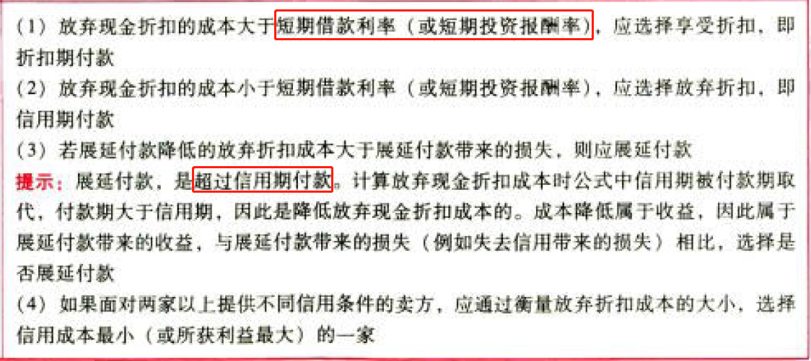

## 5.11. 短期借款筹资:star: :star: :star: 

### 5.11.16. 短期借款的信用条件

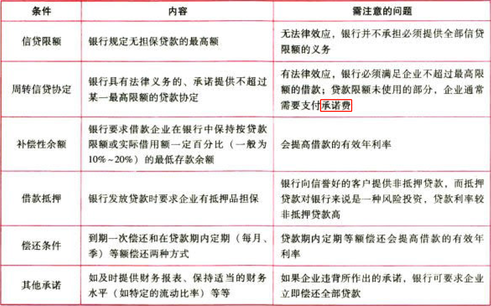

### 5.11.17. 短期借款有效年利率的计算

$$有效年利率=\frac{实际支付的年利息}{实际可用贷款额}$$

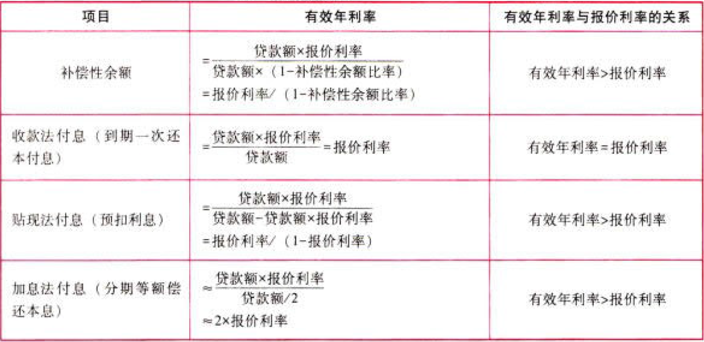

# 6. 总结

End。
