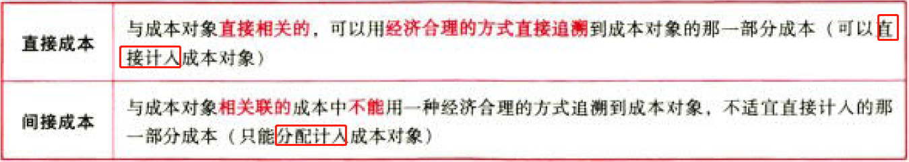
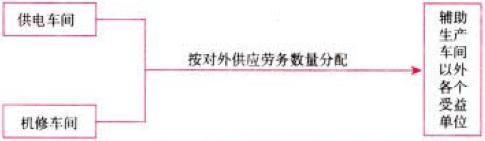
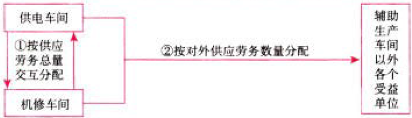
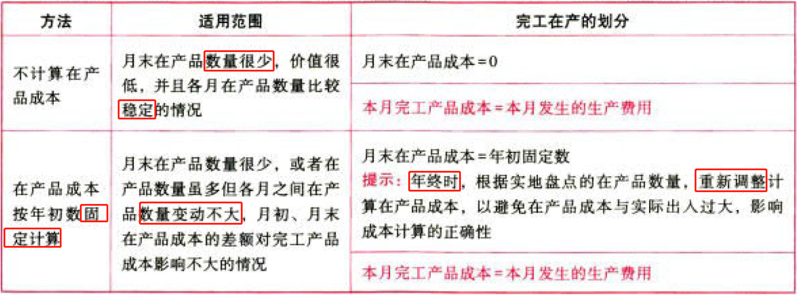
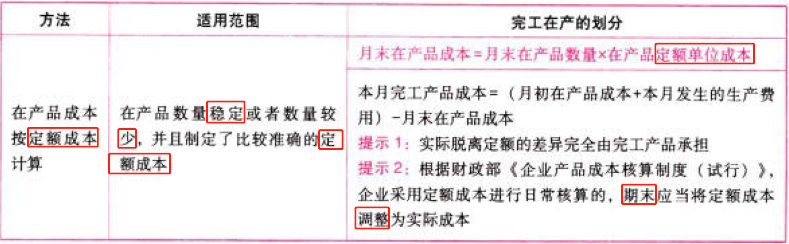
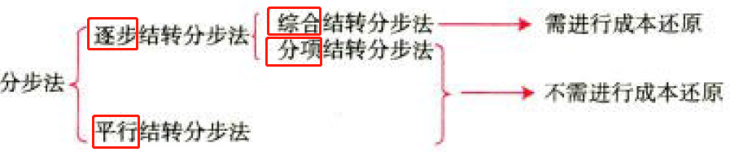
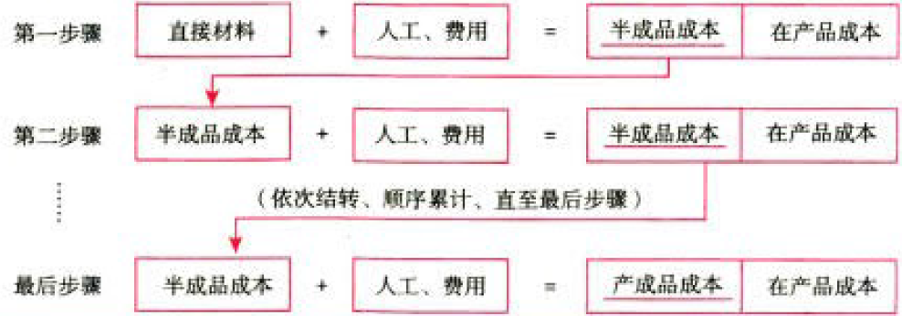
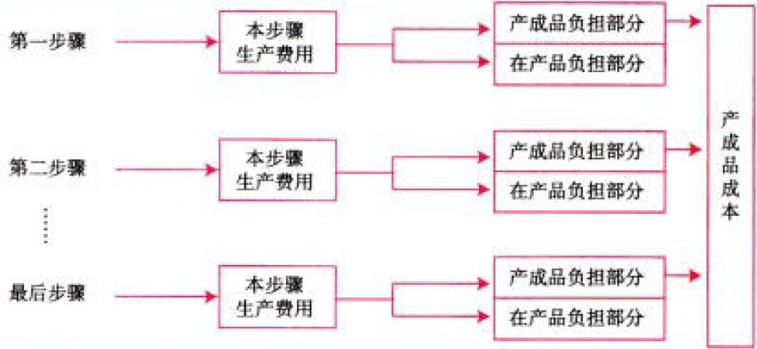
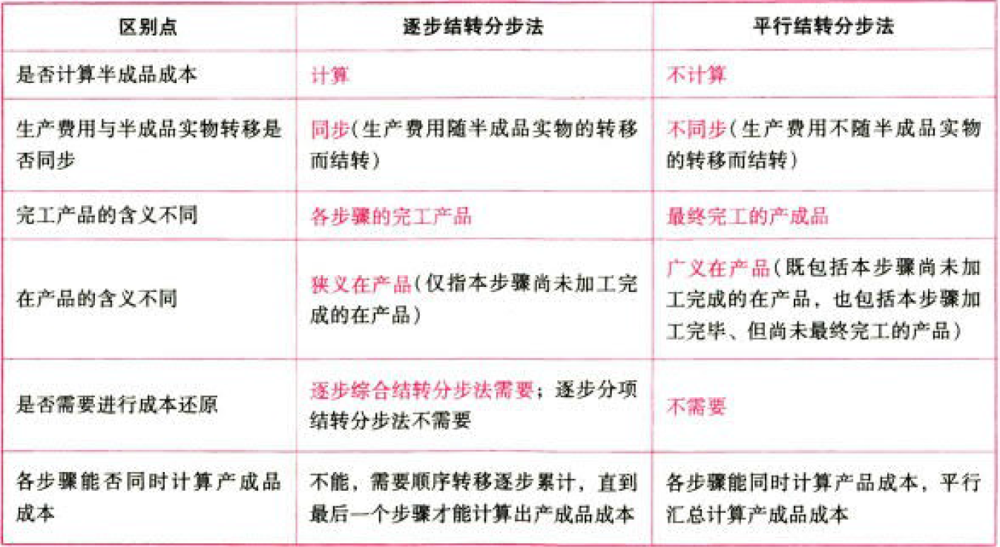

C13产品成本计算

# 1. 产品成本分类

## 1.1. 制造成本vs非制造成本:star: 

## 1.2. 产品成本vs期间成本:star: 

完全成本法下，产品成本与制造成本内容一致。

变动成本法等其他方法下，产品成本与制造成本内容不一致。

## 1.3. 直接成本vs间接成本:star: 

# 2. 产品成本的归集和分配

## 2.4. 间接费用的归集和分配:star: :star: :star: 

通用分配公式：

$$间接费用分配率=\frac{待分配的间接费用}{\sum产品_i.分配标准}$$

$$产品_i.应分配的间接费用=产品_i.分配标准\times间接费用分配率$$

$$产品_i.应分配的间接费用=待分配的间接费用\times\frac{产品_i.分配标准}{\sum产品_i.分配标准}$$

### 2.4.1. 辅助生产费用的归集和分配

辅助生产费用的主要分配方法：直接分配法和交互分配法。

#### 2.4.1.1. 直接分配法【各辅助车间之间互相收付额相同】

不考虑辅助生产内部相互提供的劳务量，直接将各辅助生产车间发生的费用分配给辅助生产车间以外的各个受益单位或产品。

$$辅助生产的单位成本=\frac{辅助生产费用总额}{辅助生产的产品（或劳务）总量-对其他辅助部门提供的产品（或劳务）量}$$

$$某车间、产品、部门应分配的费用=该车间、产品、部门的耗用量\times辅助生产的单位成本$$

优缺点：

由于各辅助生产费用只是对外分配，所以计算简便，当辅助生产车间相互提供产品或劳务量差异较大时，分配结果往往与实际不符。

适用范围：

只适宜在辅助生产内部相互提供产品或劳务不多、不进行费用的交互分配，对辅助生产成本和产品制造成本影响不大的情况下采用。

#### 2.4.1.2. 交互分配法【各辅助车间之间互相收付额不同】

两次分配：

①在各辅助车间之间进行交互分配。【内部分配】

②将各辅助车间交互分配后的费用，对辅助车间以外的各受益单位进行分配。【剩下的分给外部】

$$对内分配率=\frac{辅助生产费用总额}{辅助生产提供的产品或劳务总量}$$

$$对外分配率=\frac{交互分配前的成本费用+交互分配转入的成本费用-交互分配转出的成本费用}{对辅助车间以外的其他部门提供的产品或劳务总量}$$

优缺点：

辅助生产内部相互提供产品或劳务全部进行了交互分配，从而提高了分配结果的准确性。但各辅助生产费用要计算两个单位成本（费用分配率）进行两次分配，因而增加了计算工作量

### 2.4.2. 制造费用的归集和分配

$$制造费用分配率=\frac{制造费用总额}{各种产品生产实用（或定额）人工工时（或机器加工工时）之和}$$

$$某产品应负担的制造费用＝该种产品工时数\times分配率$$

## 2.5. 完工产品和在产品的成本分配:star: :star: :star: 

### 2.5.3. 分配原理

基本公式：

$$月初在产品成本+本月发生生产费用=本月完工产品成本+月末在产品成本$$

公式前两项之和为待分配费用。

待分配费用在完工产品与月末在产品之间分配，有两类方法：

一是“倒挤法”，即`先确定`月末`在产品`成本，再用待分配费用减月末在产品成本得出完工产品成本；

二是“分配法”，即将待分配费用`按一定比例`在完工产品和月末在产品之间分配。

### 2.5.4. 分配方法（六种）

#### 2.5.4.3. 倒挤法

$$本月完工产品成本=月初在产品成本+本月发生生产费用-月末在产品成本$$

#### 2.5.4.4. 分配法

统一公式：

$$分配率=\frac{待分配的费用}{完工产品分配标准+月末在产品分配标准}$$

$$本月完工产品成本=完工产品分配标准\times分配率$$

$$月末在产品成本=月末在产品分配标准\times分配率$$

##### 2.5.4.4.1. 约当产量法

###### 2.5.4.4.1.1. 加权平均法

$$月末在产品约当产量=月末在产品数量\times完工程度$$

$$分配率=\frac{月初在产品成本+本月发生生产费用}{完工产品产量+月末在产品约当产量}$$

$$完工产品成本=分配率\times完工产品产量$$

$$月末在产品成本=分配率\times月末在产品约当产量$$

###### 2.5.4.4.1.2. 先进先出法

$$月初在产品约当产量.直接材料=月初在产品数量\times(1-已投料比例)$$

$$月初在产品约当产量.(转换成本)（即直接人工+制造费用）=月初在产品数量\times(1-月初在产品完工程度)$$

$$本月投入本月完工产品数量=本月全部完工产品数量-月初在产品数量$$

$$月末在产品约当产量.直接材料=月末在产品数量\times本月投料比例$$

$$月末在产品约当产量.转换成本=月末在产品数量\times月末在产品完工程度$$

$$分配率（单位成本）=\frac{本月发生生产费用}{月初在产品约当产量+本月投入本月完工产品数量+月末在产品约当产量}$$

$$完工产品成本=月初在产品成本+月初在产品本月加工成本+本月投入本月完工产品数量\times分配率$$

$$月末在产品成本=月末在产品约当产量\times分配率$$

###### 2.5.4.4.1.3. 完工程度的计算

分配工资、福利费、制造费用完工程度：（累计工时法）

①通常假定处于某工序的在产品只完成本工序的一半，则：

$$某工序完工程度=\frac{\sum前面各工序定额+本工序定额\times{50%}}{产品工时定额}$$

②如果考试特指了在产品所处工序的完工程度，则：

$$某工序完工程度=\frac{\sum前面各工序定额+本工序定额\times{本工序平均完工程度}}{产品工时定额}$$

分配原材料完工程度：

①若原材料在生产开始时一次投入：

在产品无论完工程度如何，都应和完工产品负担同样材料费用，即在产品原材料完工程度为100%

②若原材料陆续投入：

a.分工序投入，但在每一工序开始时一次投入：

$$某工序在产品完工程度=\frac{本工序累计材料消耗定额}{产品材料消耗定额}$$

b.分工序投入，但每一工序随加工进度陆续投入：

$$某工序在产品完工程度=\frac{\sum前面工序材料消耗定额+本工序材料消耗定额\times{50%}}{产品材料消耗定额}$$

##### 2.5.4.4.2. 定额比例法

$$分配率=\frac{月初在产品实际成本+本月发生实际生产费用}{完工产品定额+月末在产品定额}$$

$$完工产品.应分配的成本=完工产品定额\times分配率$$

$$月末在产品.应分配的成本=月末在产品定额\times分配率$$

适用条件：月末在产品数量变动较大，但有比较准确的定额资料。

##### 2.5.4.4.3. 在产品成本按其所耗用的原材料费用计算

分配原理：月末在产品可以只分配原材料费用，其他费用全部由完工产品负担

$$材料费用分配率=\frac{月初在产品.实际成本+本月投入.实际材料成本}{完工产品.产量+月末在产品.产量}$$

$$完工产品.应分配的材料成本=完工产品.产量\times分配率$$

$$月末在产品.应分配的材料成本=月末在产品.产量\times分配率$$

$$完工产品.其他成本=本月发生生产费用$$

$$月末在产品.其他成本=0$$

适用条件：原材料费用在产品成本中所占比例较大，而且原材料是在生产开始时一次全部投入。

## 2.6. 联产品和副产品的成本分配:star: :star: 

### 2.6.5. 联产品加工成本的分配

#### 2.6.5.5. 联产品的含义

联产品是指使用同种原料，经过同一生产过程同时生产出来的两种或两种以上的主要产品。

#### 2.6.5.6. 联产品成本计算过程

第－阶段（分离前）：联合产品明细账

第二阶段（分离后）：各产品分设明细账

#### 2.6.5.7. 联产品加工成本的分配

分配的统一公式：

$$联合成本分配率=\frac{待分配联合成本}{\sum联产品_i.[分配标准]}$$

$$联产品_i.应分配联合成本=联产品_i.[分配标准]\times联合成本分配率$$

具体分配方法——分离点售价法：

$$联合成本分配率=\frac{待分配联合成本}{\sum联产品_i.分离点总售价}$$

$$联产品_i.应分配联合成本=联产品_i.分离点总售价\times联合成本分配率$$

具体分配方法——可变现净值法：

$$联合成本分配率=\frac{待分配联合成本}{\sum联产品_i.可变现净值}$$

$$联产品_i.应分配联合成本=联产品_i.可变现净值\times联合成本分配率$$

具体分配方法——实物数量法：

$$联合成本分配率=\frac{待分配联合成本}{\sum联产品_i.实物数量}$$

$$联产品_i.应分配联合成本=联产品_i.实物数量\times联合成本分配率$$

### 2.6.6. 副产品加工成本的分配

#### 2.6.6.8. 副产品的含义

副产品是指在同一生产过程中，使用同种原料，在生产主要产品的同时附带生产出来的非主要产品。

#### 2.6.6.9. 分配方法

副产品首先采用简化方法确定其成本（如按预先规定的固定单价确定成本〉，然后从总成本中扣除，其余额就是主产品的成本。

$$主产品成本=总成本-副产品成本$$

# 3. 产品成本计算的基本方法

## 3.7. 三种基本方法的特点与适用条件:star: :star: 

## 3.8. 分步法:star: :star: :star: 

### 3.8.7. 分步法的种类

### 3.8.8. 分步法的成本计算程序

逐步综合结转分步法（计算半成品成本分步法）：

平行结转分步法（不计算半成品成本分步法）：

### 3.8.9. 逐步综合结转分步法下的成本还原

一般是按本月所产半成品的成本结构进行还原。即从最后－个步骤起，把各步骤所耗上一步骤半成品的综合成本按照上一步骤所产半成品成本的结构，逐步分解，还原出按原始成本项目反映的产成品成本。成本还原的次数较正常生产步骤少一步。

方法一：

$$成本还原分配率=\frac{产成品耗用上步骤半成品成本合计}{上步骤生产该种半成品成本合计}$$

$$半成品成本还原=本月所产半成品成本项目金额\times成本还原分配率$$

$$还原后产品成本=还原前产品成本+半成品成本还原$$

方法二：

$$各项目比重=\frac{本月所产半成品成本项目金额}{本月所产半成品成本合计金额}$$

$$半成品成本还原=产成品耗用上步骤半成品成本合计\times半成品成本还原$$

$$还原后产品成本=还原前产品成本+半成品成本还原$$

### 3.8.10. 平行结转分步法下的完工产品、在产品划分

采用平行结转分步法，每一生产步骤的生产费用都要在其完工产品与月末在产品之间进行分配。但这里的完工产品是指企业最完工的产成品，这里的某步骤在产品是指该步骤尚未加工完成的在产品和该步骤已完工但尚未最终完成的产品。

### 3.8.11. 逐步结转分步法vs平行结转分步法

# 4. 总结

End。
