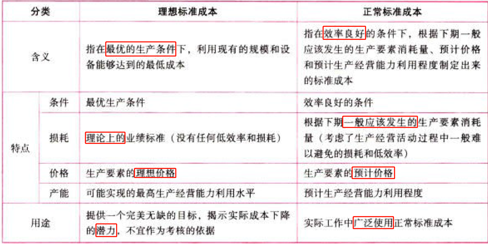
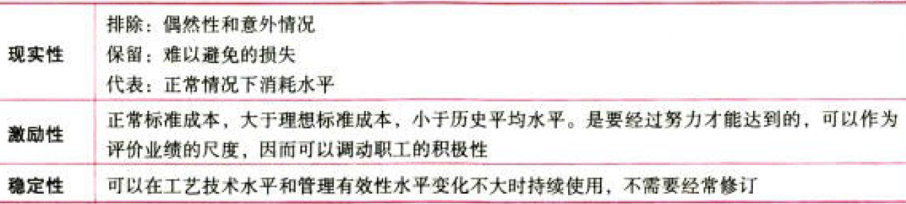
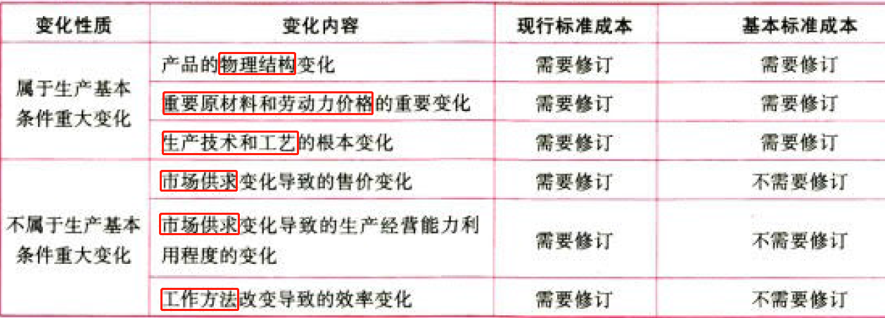
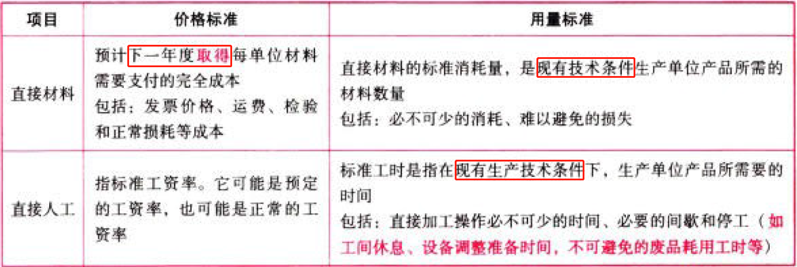
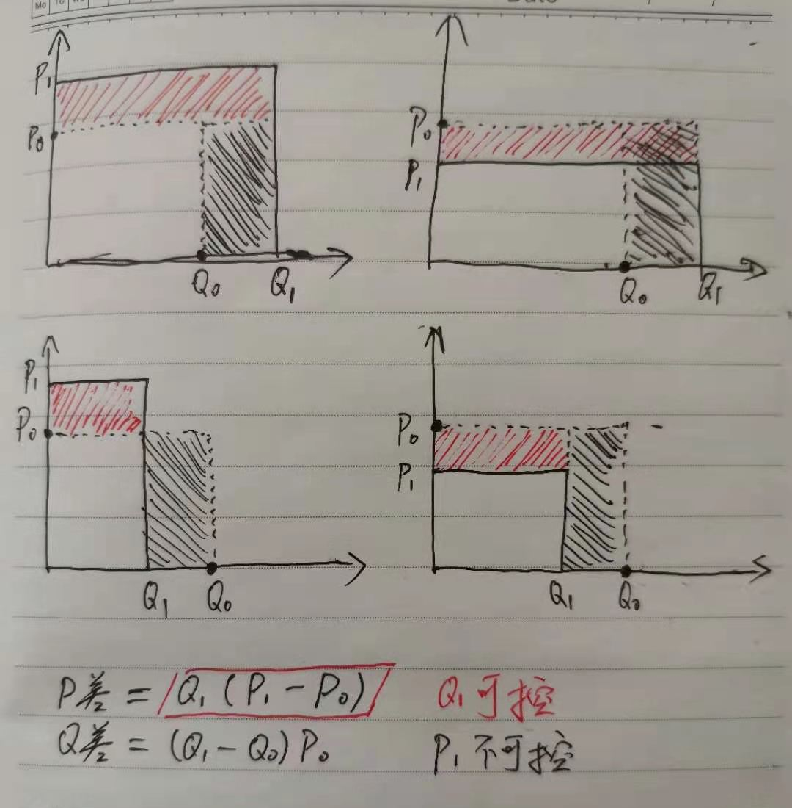
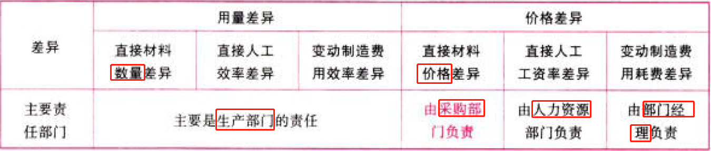
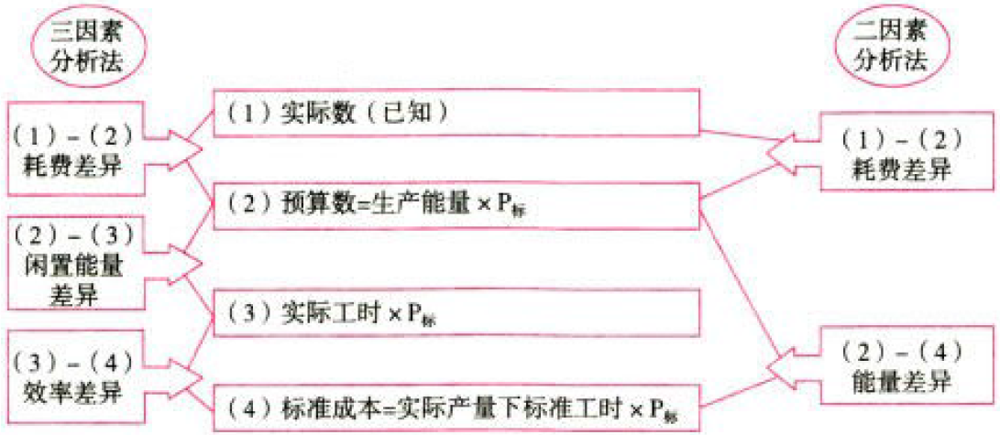

C14标准成本法

# 1. 标准成本及其制定

## 1.1. 标准成本的概念及其分类:star: :star: 

### 1.1.1. 标准成本的概念

标准成本是通过精确的调查、分析与技术测定而制定的，用来评价实际成本、衡量工作效率的一种目标成本。

它有两种含义：

①成本标准

$$成本标准c_0=单位产品.标准成本c_0=单位产品.标准用量q_0\times标准单价p_0$$

②标准成本

$$标准成本（总额）C_0=实际产量Q_1\times单位产品.标准成本c_0$$

讨论标准成本制定时，“标准成本”是指$单位产品.标准成本c_0$。

讨论成本差异计算时，“标准成本”是指实际产量Q_1下的$标准成本C_0$。

### 1.1.2. 标准成本的种类

#### 1.1.2.1. 按其制定所依据的生产技术和经营管理水平分类

正常标准成本的特点：

#### 1.1.2.2. 按适用期分类

因索变化对现行标准成本和基本标准成本的影响：

## 1.2. 标准成本的制定:star: :star: 

制定标准成本，通常首先确定`直接材料和直接人工`的标准成本，其次确定`制造费用`的标准成本，最后`汇总`确定单位产品的标准成本。

在制定时，无论是哪一个成本项目，都需要分别确定其$用量标准q_0$和$价格标准p_0$，两者相乘后得出单位产品的$标准成本c_0$。

考试经常考查正常标准成本的内容：

（1）直接材料与直接人工成本标准的确定

（2）固定制造费用的$用量标准Q_0$与变动制造费用的$用量标准Q_0$相同，包括直接人工工时、机器工时、其他用量标准等，并且两者要保传一致，以便进行差异分析。

（3）关于损耗（或废品）的处理：正常的损耗计入标准成本：非正常的损耗不计入标准成本：

$$标准成本=\frac{不考虑损耗的标准成本}{1-正常损耗率}$$

# 2. 标准成本的差异分析

## 2.3. 变动成本差异的分析:star: :star: :star: 

### 2.3.3. 变动成本差异计算的通用公式

$$价差Diff_P=实际数量Q_1\times(实际价格p_1-标准价格p_0)$$

$$量差Diff_Q=(实际数量Q_1-标准数量Q_0)\times标准价格p_0$$

### 2.3.4. 不同变动成本项目成本差异计算的具体公式

直接材料成本差异：

$$直接材料.价差Diff_P=实际数量Q_1\times(实际价格p_1-标准价格p_0)$$

$$直接材料.量差Diff_Q=(实际数量Q_1-标准数量Q_0)\times标准价格p_0$$

直接人工成本差异：

$$直接人工工资率差异Diff_P=实际工时Q_1\times(实际工资率p_1-标准工资率p_0)$$

$$直接人工效率差异Diff_Q=(实际工时Q_1-标准工时Q_0)\times标准工资率p_0$$

变动制造费用成本差异：

$$变动制造费用耗费差异Diff_P=实际工时Q_1\times(变动制造费用实际分配率p_1-变动制造费用标准分配率p_0)$$

$$变动制造费用效率差异Diff_Q=(实际工时Q_1-标准工时Q_0)\times变动制造费用标准分配率p_0$$

### 2.3.5. 变动成本差异的责任归属

变动制造费用耗费差异由部门经理承担责任，但是这个部门经理是生产部门的，因此也就是由生产部门承担责任。

## 2.4. 固定制造费用差异分析:star: :star: :star: 

### 2.4.6. 二因素分析法

二因素分析法是将`固定制造费用差异`分为`耗费差异`和`能量差异`。

$$耗费差异=固定制造费用实际数-固定制造费用预算数=实际数-生产能量Q_1\times固定制造费用标准分配率p_0$$

$$能量差异=固定制造费用预算数-固定制造费用标准成本=(生产能量Q_1-实际产量下标准工时Q_0)\times固定制造费用标准分配率p_0$$

### 2.4.7. 三因素分析法

耗费差异的计算与二因素分析法相同。

不同的是将二因素分析法中的“能量差异”进一步分为两部分：

一部分是实际工时未达到生产能量而形成的`闲置能量差异`；

一部分是实际工时脱离标准工时而形成的`效率差异`。有关计算公式如下：

$$耗费差异=固定制造费用实际数-固定制造费用预算数=实际数-生产能量Q_1\times固定制造费用标准分配率p_0$$

$$闲置能量差异Diff(Q2)=固定制造费用预算数-实际工时Q_2\times固定制造费用标准分配率p_0=(生产能量Q_1-实际工时Q_2)\times固定制造费用标准分配率p_0$$

$$效率差异Diff(Q)=(实际工时Q_2-实际产量下标准工时Q_0)\times固定制造费用标准分配率p_0$$

# 3. 总结

End。
