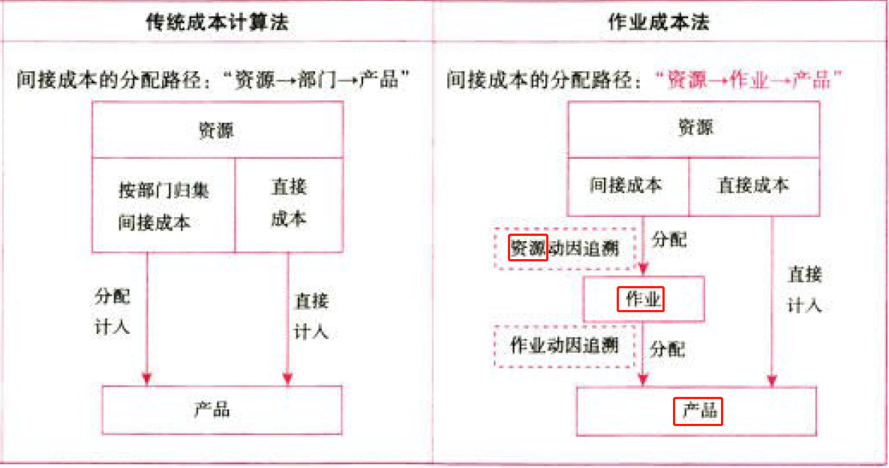
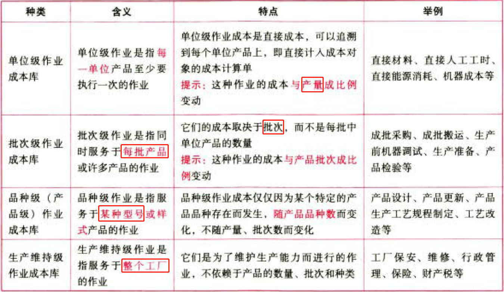
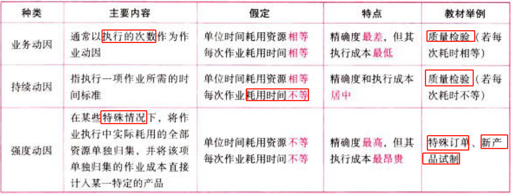
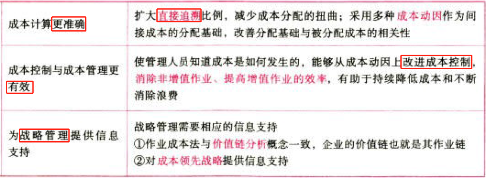
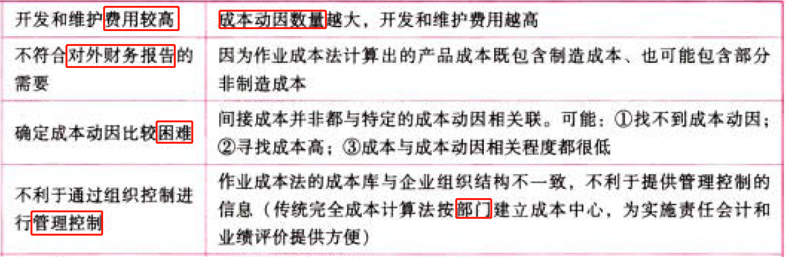

C15作业成本法

# 1. 作业成本法的概念与特点

## 1.1. 作业成本法的含义:star: 

作业成本法是将间接成本和辅助费用更准确地分配到产品和服务的一种成本计算方法。

作业成本法的基本指导思想是“作业消耗资源、产品（服务或顾客）消耗作业”。

使用追溯方式得到的产品成本是最准确的；动因分配不像追溯那样准确，但只要因果关系建立恰当，成本分配的结果同样可以达到较高的准确程度。

## 1.2. 作业成本法的核心概念:star: :star: 

### 1.2.1. 作业

作业是指企业中特定组织（成本中心、部门或产品线）重复执行的任务或活动。

### 1.2.2. 资源

资源是指作业耗费的人工、能源和实物资产（车床和厂房等）。

执行任何一项作业都需要耗费一定的资源。

### 1.2.3. 成本动因

成本动因是指作业成本或产品成本的驱动因素。在作业成本法中，成本动因分为资源成本动因和作业成本动因。

资源成本动因是引起作业成本增加的驱动因素，用来衡量一项作业的资源消耗量。依据资源成本动因可以将资源成本分配给各有关作业。

作业成本动因计量各成本对象耗用作业的情况，并被用来作为作业成本的分配基础。

## 1.3. 作业成本法vs传统成本法:star: :star: 

相同点：

不同点：

# 2. 作业成本计算

## 2.4. 作业成本的计算原理:star: :star: :star: 

### 2.4.4. 作业的认定

作业认定需要对每项消耗资源的作业进行定义.识别每项作业在生产活动中的作用、与其他作业的区别，以及每项作业与耗用资源的联系。

### 2.4.5. 作业成本库的设计

### 2.4.6. 资源成本分配到作业

资源成本借助于资源成本动因分配到各项作业。

### 2.4.7. 作业成本分配到成本对象

$$单位作业成本＝\frac{本期作业成本库归集总成本}{作业量}$$

作业成本动因的种类:

## 2.5. 作业成本的计算方法:star: :star: 

$$实际作业成本分配率=\frac{当期实际发生的作业成本}{当期实际作业产出}$$

$$产品A耗用的作业成本=\sum(产品A耗用的作业量\times实际作业成本分配率)$$

$$产品A当期发生总成本=当期投入产品A的直接成本+\sum_{i=1}^{n}产品A当期耗用的作业成本_i$$

如同传统成本计算一样，作业成本分配时可以采用实际分配率或者预算分配率。

## 2.6. 按预算（正常）作业成本分配率分配作业成本的计算步骤及公式

### 2.6.8. 确定预算（正常）作业成本分配率：

$$预算（正常）作业成本分配率=\frac{预计作业成本}{预计（正常）作业产出}$$

按预算（正常）作业成本分配率分配作业成本：

$$产品A应分配作业成本=\sum[预算（正常）分配率\times产品A实际耗用的作业量]$$

### 2.6.9. 计算当期投入的总成本：

$$产品A当期发生总成本=产品A当期发生的实际直接成本+产品A应分配作业成本$$

### 2.6.10. 计算、结转作业成本差异：

$$作业成本差异=当期实际作业成本-应分配的作业成本$$

### 2.6.11. 会计期末进行作业成本差异调整：

①发生的差异可以直接结转本期营业成本。

②发生的差异也可以计算作业成本差异率并据以分配给有关产品。

# 3. 作业成本管理

## 3.7. 增值作业vs非增值作业:star: :star: 

是站在顾客角度划分的，最终增加顾客价值的作业是增值作业。否则就是非增值作业，如由于订单信息不准确造成没有准确送达需要再次送达的无效率作业就是非增值作业。

区分标准：就是看这个作业的发生是否有利于增加顾客的价值，或者说增加顾客的效用。

## 3.8. 基于作业进行成本管理:star: 

## 3.9. 作业成本法的优点、局限性与适用情景条件:star: :star: :star: 

### 3.9.12. 优点

### 3.9.13. 局限性

### 3.9.14. 适用期间条件

# 4. 总结

End。
