C16本量利分析

如果没有特别说明，本章的利润指的是$息税前利润EBIT$。

# 1. 本量利的一般关系

## 1.1. 成本性态分析:star: :star: :star: 

### 1.1.1. 成本性态（成本习性）

成本总额与业务量（如产品产量、销量等）之间的内在关系。

### 1.1.2. 成本分类

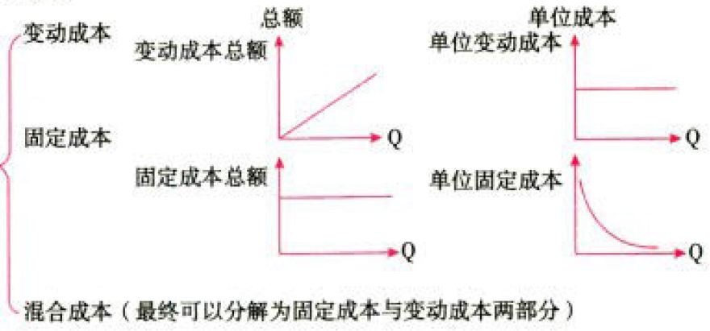

周定成本的特点：特定的相关范围（特定业务量范围、特定期间范朋）内固定成本总额不变，单位固定成本随业务量增加而降低。

变动成本的特点：特定的相关范围（特定业务量范围、特定期间范朋）内变动成本总额随业务量增加而成正比例地加，单位变动成本不变。

混合成本的特点：成本总额随业务量变动而变动，但不成正比例关系。

### 1.1.3. 成本的进一步分类

#### 1.1.3.1. 固定成本的分类

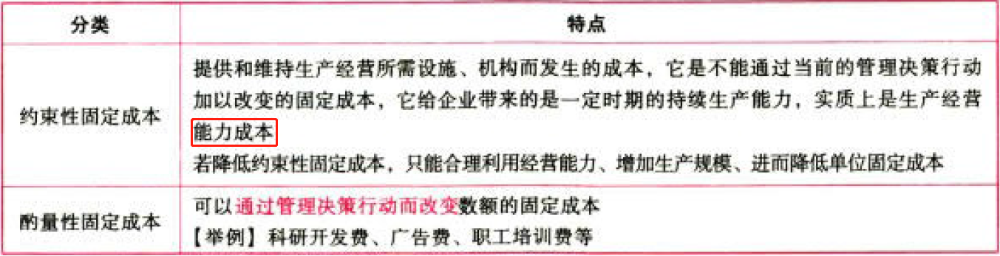

#### 1.1.3.2. 变动成本的分类、

#### 1.1.3.3. 混合成本的分类

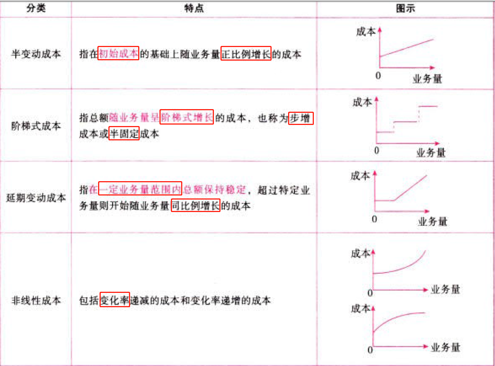

### 1.1.4. 混合成本的分解

#### 1.1.4.4. 回归直线法

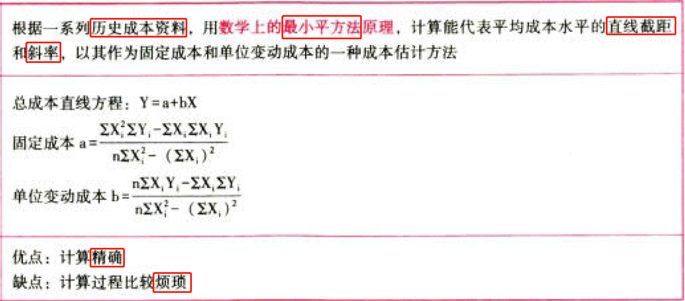

#### 1.1.4.5. 工业工程法

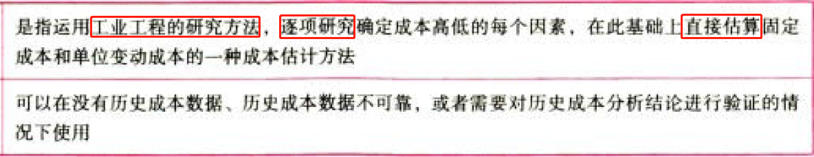

## 1.2. 变动成本法:star: :star: 

含义：产品成本只包括直接材料、直接人工、变动制造费用，即变动生产成本。

固定制造费用和非生产成本全部作为制造边际贡献（销售额与变动生产成本的差额）的扣除项目。

两种方法的核心差别在于固定制造费用处理不同，在完全成本法下，固定制造费用计入了产品成本；而在变动成本法下，固定制造费用不计入产品成本，全部与期间费用－起一次汁人当期损益。

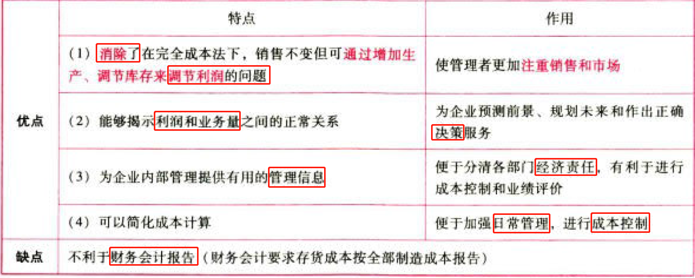

## 1.3. 本量利分析基本模型的相关假设:star: 

下述诸条假设的背后都有一条共同的假设，即企业的全部成本可以合理地或者比较准确地分解为固定成本和变动成本。

### 1.3.5. 相关范围假设

### 1.3.6. 模型线性假设

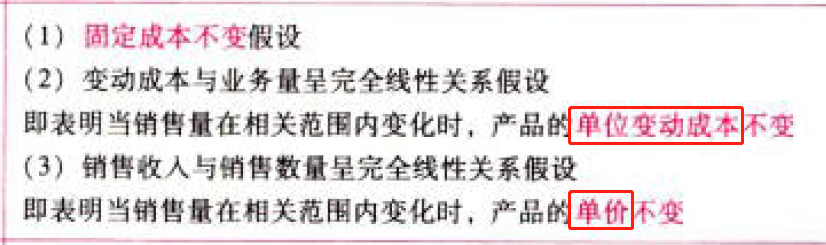

### 1.3.7. 产销平衡假设

### 1.3.8. 品种结构不变假设

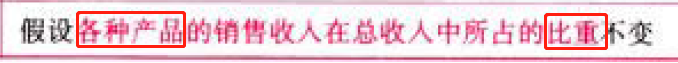

## 1.4. 本量利分析基本模型:star: :star: :star: 

### 1.4.9. 损益方程式

基本损益方程式：

$$利润EBIT=单价P\times销量Q-单位变动成本V\times销量Q-固定成本F=(P-V)\times{Q}-F$$

包含期间成本的损益方程式：

$$利润EBIT=单价P\times销量Q-(单位变动生产成本+单位变动销售和管理费用)V\times销量Q-(固定生产成本+固定销售和管理费用)F=(P-V)\times{Q}-F$$

应注意的问题：

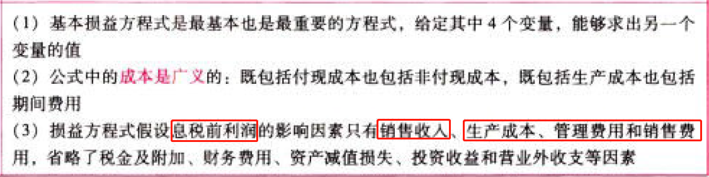

### 1.4.10. 边际贡献方程式

计算公式：

$$制造边际贡献=销售收入S-产品变动成本$$

$$产品边际贡献=制造边际贡献-变动销售和管理费用$$

$$单位边际贡献m=单价P-单位变动成本V$$

$$边际贡献M=销售收入S-变动成本=(P-V)\times{销量Q}$$

通常，在“边际贡献”前未加任何定语时，是指“产品边际贡献”。

$$边际贡献率=\frac{边际贡献M}{销售收入S}$$

$$变动成本率=\frac{变动成本V\times{Q}}{销售收入S}$$

$$利润EBIT=边际贡献M-固定成本F=(P-V)\times{Q}-F$$

$$=边际贡献率\times销售收入S-固定成本F$$

多种产品的边际贡献率要用加权平均数计算，其公式为：

$$加权平均边际贡献率=\frac{\sum产品_i边际贡献M_i}{\sum产品_i销售收入S_i}$$

$$=\sum(产品_i边际贡献率\times产品_i销售收入S_i占总销售收入比重A_i)$$

### 1.4.11. 本量利关系图

基本的本量利关系图vs正方形本量利关系图

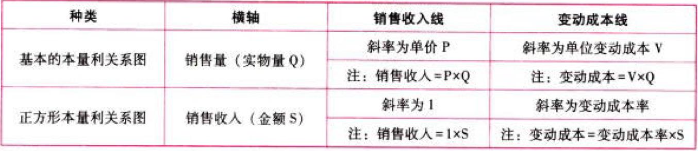

# 2. 保本分析

## 2.5. 保本点的含义:star: :star: 

保本点，亦称盈亏临界点，是企业收入和成本相等的经营状态.即$边际贡献M=固定成本F$时企业所处的既不盈利又不亏损的状态。通常用一定的业务量（保本量或保本额）来表示。

## 2.6. 保本点与安全边际的确定:star: :star: :star: 

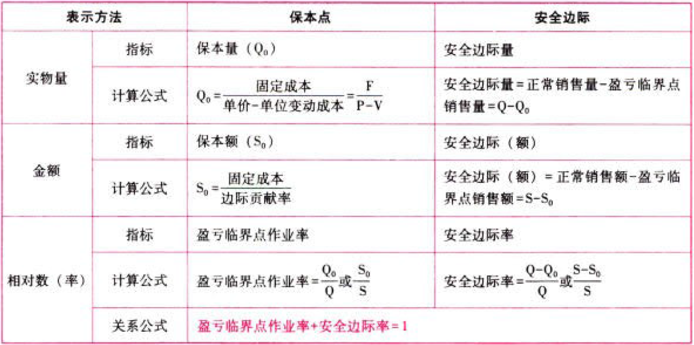

## 2.7. 安全边际与利润EBIT的关系:star: :star: :star: 

$$息税前利润EBIT=安全边际额\times边际贡献率$$

$$息税前利润EBIT=安全边际率\times边际贡献$$

对于单一产品：

$$息税前利润EBIT=安全边际额\times单位边际贡献$$

$$销售息税前利润率=安全边际率\times边际贡献率$$

## 2.8. 多品种情况下的保本分析:star: :star: 

$$加权平均边际贡献率=\frac{\sum产品_i边际贡献M_i}{\sum产品_i销售收入S_i}$$

$$=\sum(产品_i边际贡献率\times产品_i销售收入S_i占总销售收入比重A_i)$$

$$加权平均保本销售额=\frac{固定成本总额}{加权平均边际贡献率}$$

$$产品_i销售百分比=\frac{产品_i销售额}{\sum_{i=1}^{n}产品_i销售额}$$

$$产品_i保本销售额=加权平均保本销售额\times产品_i销售百分比$$

$$产品_i保本销售量=\frac{产品_i保本销售额}{产品_i销售单价}$$

# 3. 保利分析

$$保利量=\frac{固定成本+目标利润}{单价-单位变动成本}$$

$$保利额=\frac{固定成本+目标利润}{边际贡献率}$$

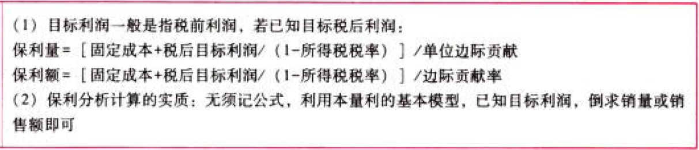

# 4. 利润敏感分析

## 4.9. 利润敏感分析的含义:star: 

## 4.10. 各参数的敏感系数计算:star: :star: :star: 

敏感系数提供了各因素变动百分比和利润变动百分比之间的比例，即当各因素升降1%时，利润将会随之上升或下降百分之几（正号为同向变动，负号为反向变动）

$$敏感系数=\frac{目标值变动百分比}{参量值变动百分比}$$

利润对销售量的敏感系数亦称经营杠杆系数LOD：

$$经营杠杆系数LOD=\frac{\Delta{EBIT}/EBIT}{\Delta{Q}/Q}$$

# 5. 总结

End。
