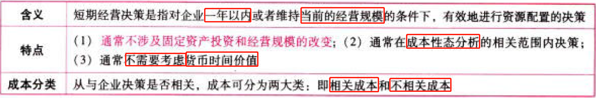
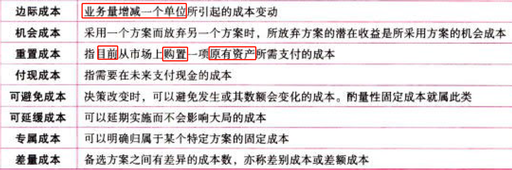
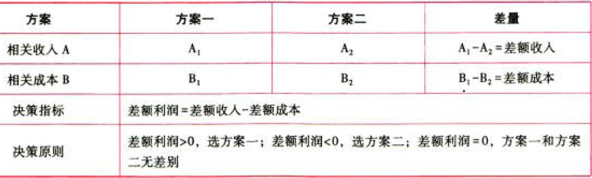
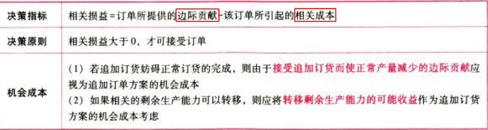
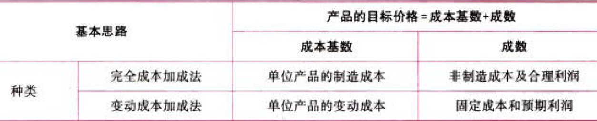
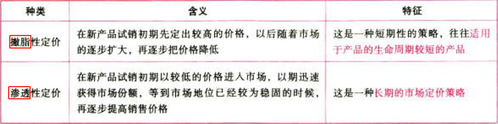

C17短期经营决策

# 1. 短期经营决策概述

## 1.1. 短期经营决策的含义、特点、成本分类:star: 

## 1.2. 相关成本vs不相关成本:star: :star: 

### 1.2.1. 相关信息的特点

第一，相关信息是面向未来的；第二，相关信息在各个备选方案之间应该有所差异。

决策的相关信息应同时具备上述两个特点。

### 1.2.2. 相关成本

是指与决策相关的成本。

### 1.2.3. 不相关成本

相关成本的反义，它是指与决策没有关联的成本。

# 2. 生产决策

## 2.3. 生产决策的主要方法:star: :star: 

### 2.3.4. 差量分析法

### 2.3.5. 边际贡献分析法

### 2.3.6. 本量利分析法

## 2.4. 亏损产品是否停产的决策:star: :star: 

①若题目中特指亏损产品的生产能力可以转移，亏损产品创造的边际贡献＞与生产能力转移有关的机会成本，就不应当停产。

②若题目中亏损产品的生产能力不可以转移且有专属成本，则亏损产品创造的边际贡献＞专属成本，就不应当停产。

## 2.5. 零部件自制与外购的决策:star: :star: :star: 

## 2.6. 特殊订单是否接受的决策:star: :star: :star: 

## 2.7. 约束资源最优利用决策:star: :star: :star: 

## 2.8. 产品是否应进一步深加工的决策:star: :star: :star: 

# 3. 定价决策

## 3.9. 产品销售定价决策原理:star: 

产品定价决策通常是针对后三种市场的产品。

## 3.10. 产品销售定价的方法:star: :star: :star: 

### 3.10.7. 成本加成定价法

### 3.10.8. 市场定价法

### 3.10.9. 新产品的销售定价方法

### 3.10.10. 有闲置能力条件下的定价方法

# 4. 总结

End。
