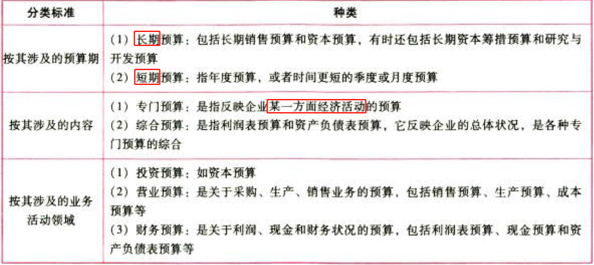
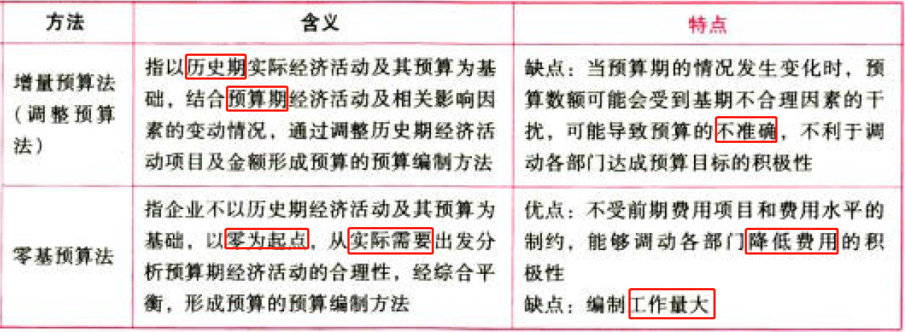
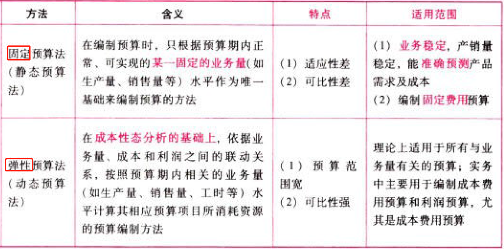
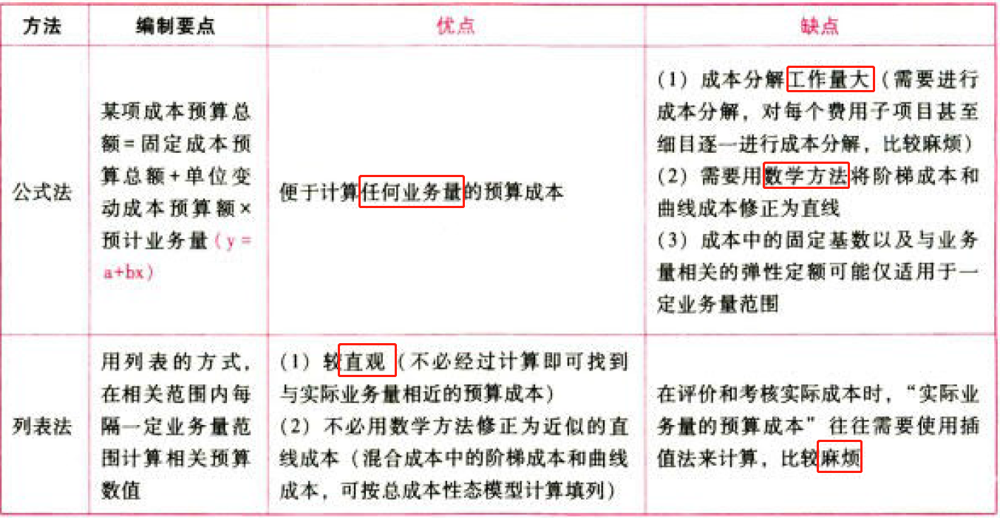
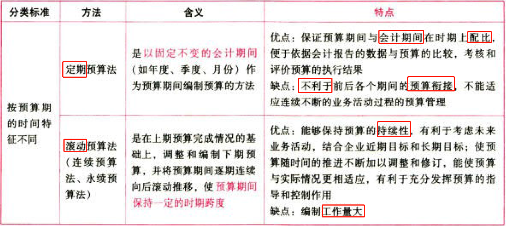
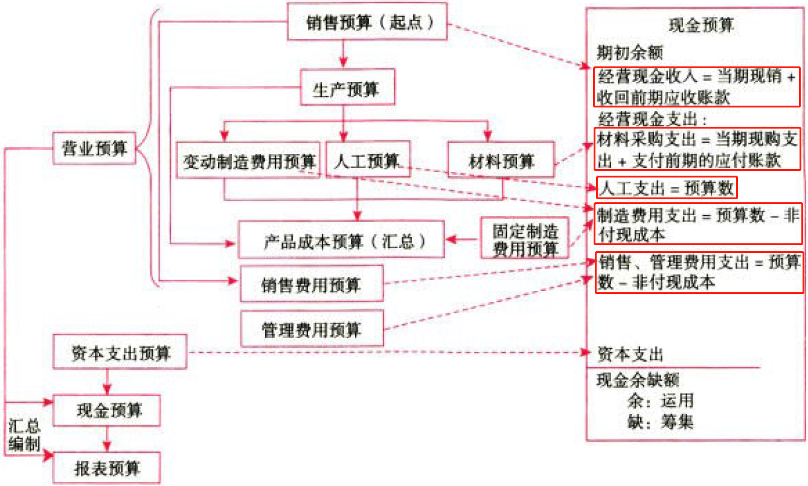
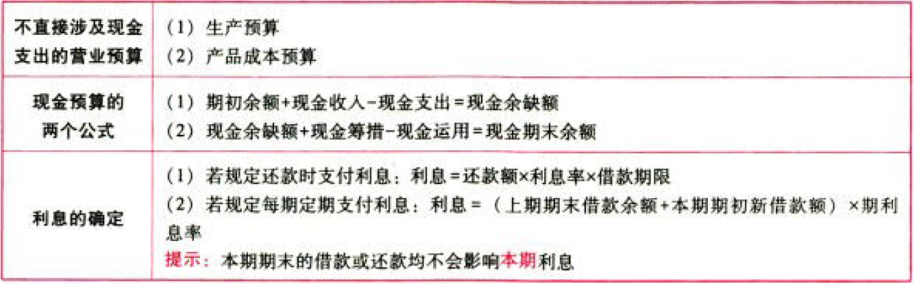

C18全面预算

# 1. 全面预算概述

## 1.1. 全面预算体系的分类:star: :star: 

## 1.2. 全面预算的作用:star: 

企业预算是各级各部门工作的具体奋斗目标、协调工具、控制标准、考核依据。

# 2. 全面预算的编制方法

## 2.3. 增量预算vs零基预算:star: :star: :star: 

### 2.3.1. 含义及特点

### 2.3.2. 增量预算法的假设前提

①现有业务活动是企业所必需的；

②企业现有各项业务的开支水平是合理的，在预算期予以保持。

## 2.4. 固定预算vs弹性预算:star: :star: :star: 

### 2.4.3. 含义、特点、适用范围

按业务量基础的数量特征的不同分类：

弹性预算业务量的选择：

（1）选用一个最能代表生产经营活动水平的业务量计算单位。

（2）务必使实际业务量不至于超出相关的业务量范围。

### 2.4.4. 弹性预算法的编制

## 2.5. 定期预算vs滚动预算:star: :star: :star: 

# 3. 营业预算的编制

## 3.6. 销售预算:star: 

## 3.7. 生产预算:star: :star: :star: 

## 3.8. 直接材料预算:star: :star: 

## 3.9. 直接人工预算:star: 

## 3.10. 制造费用预算:star: :star: 

## 3.11. 产品成本预算:star: 

## 3.12. 销售费用和管理费用预算:star: 

# 4. 财务预算的编制

## 4.13. 现金预算的编制:star: :star: :star: 

## 4.14. 财务报表预算的编制:star: :star: :star: 

### 4.14.5. 利润表预算的编制

### 4.14.6. 资产负债表预算的编制

# 5. 总结

End。
