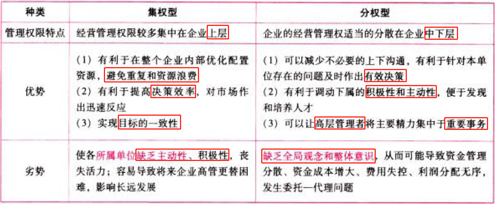
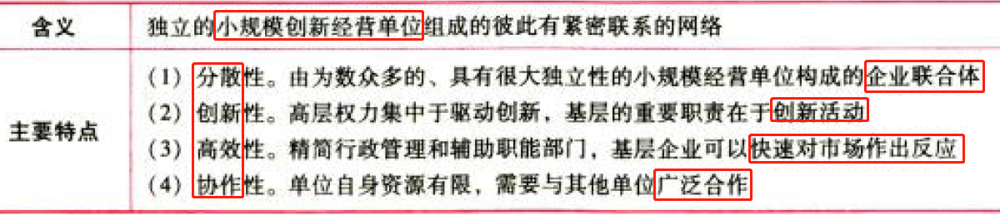
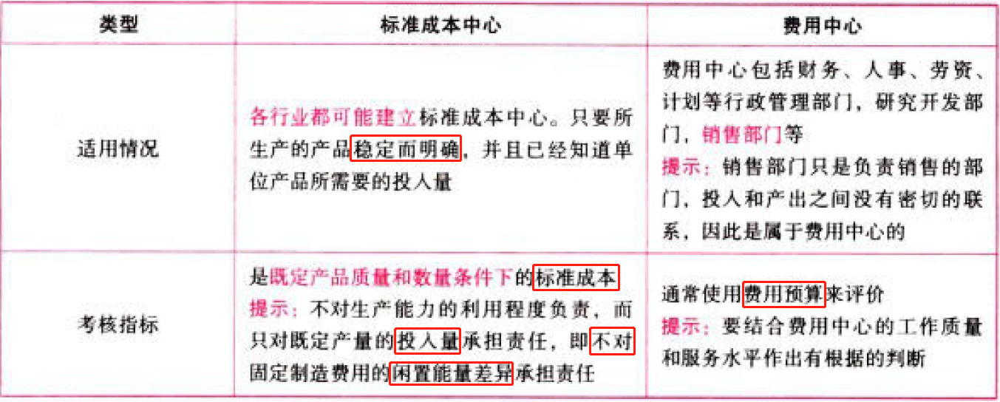
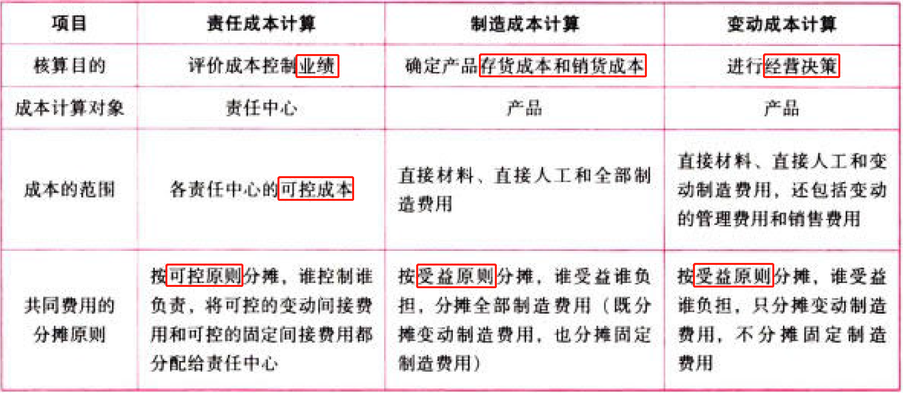
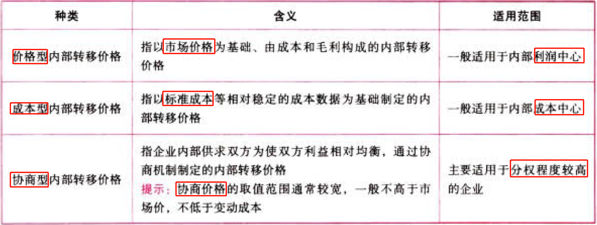
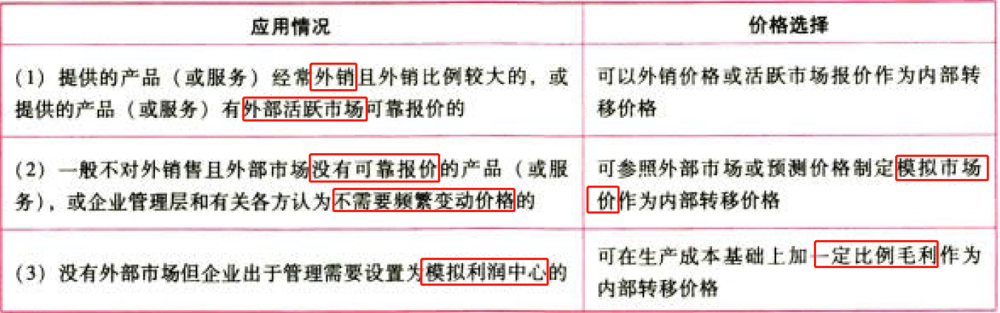
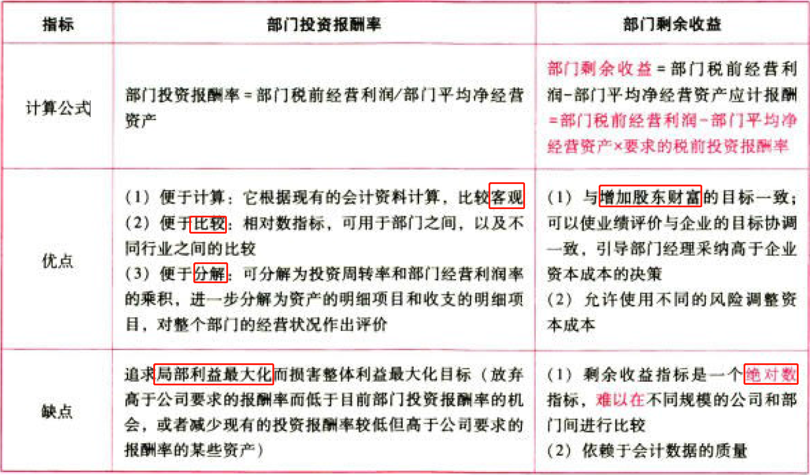
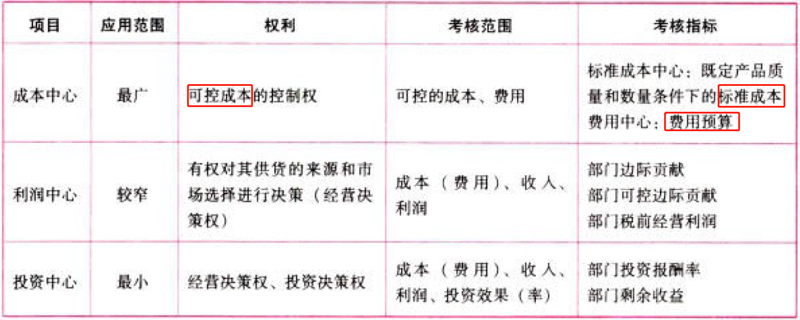

C19责任会计

# 1. 企业组织结构与责任中心划分

责任会计的含义：是指为适应企业内部`经济责任制`的要求，对企业内部各`责任中心`的经济业务进行规则与控制，以实现`业绩考核与评价`的一种内部会计控制制度。

责任中心的划分：根据内部单位职责范围和权限大小，可以将其分为成本中心、收入中心、利利润中心和投资中心。

## 1.1. 企业的集权与分权:star: 

## 1.2. 科层组织结构:star: 

### 1.2.1. 科层组织结构的管理结构

企业生产经营的决策权力主要集中在最高层的直线领导手中。

### 1.2.2. 科层组织结构的优缺点

## 1.3. 事业部制组织结构:star: 

事业部制是一种分权的组织结构。

## 1.4. 网络组织结构:star: 

以减少企业管理层次（扁平化）、强化分权管理为主要内容。

# 2. 成本中心

## 2.5. 成本中心的划分:star: 

## 2.6. 成本中心的类型和考核指标:star: :star: :star: 

## 2.7. 责任成本:star: :star: 

### 2.7.3. 责任成本的定义及特点

定义：特定责任中心的全部可控成本。

### 2.7.4. 可控成本及其确定

### 2.7.5. 确定成本费用支出责任归属的三原则

### 2.7.6. 制造费用的归属和分摊方法

# 3. 利润中心

## 3.8. 利润中心划分和类型:star: 

利润中心是指对利润负责的责任中心，由于利润等于收入减去成本费用，所以利润中心是对收入成本或费用都要承担责任的责任中心。

并不是可以计量利润的组织单位都是真正意义上的利润中心，从根本目的上看，利润中心是指管理人员有权对其供货的来源和市场的选择进行决策的单位。

## 3.9. 利润中心的考核指标:star: :star: :star: 

对利润中心进行考核的指标主要是利润，但仍然需要一些非货币的衡量方法作为补充。

## 3.10. 内部转移价格:star: :star: 

### 3.10.7. 含义

内部转移价格，：是指企业内部分公司、分厂、车间、分部等责任中心之间相互提供产品（或服务）、资金等内部交易时所采用的计价标准。

### 3.10.8. 目的

一是防止成本转移带来的部门间责任转嫁，使每个利润中心都能作为单独的组织单位进行业绩评价；二是作为一种价格机制引导下级部门采取明智的决策。

### 3.10.9. 种类

价格型内部转移价格的具体应用：

# 4. 投资中心

## 4.11. 投资中心的划分:star: 

投资中心是指既能控制成本、收入和利润，又能对投入的资金进行控制的责任中心，如某些分散经营的单位或部门，其经理所拥有的自主权不仅包括制定价格、确定产品和生产方法等经营决策权，而且还包括投资规模和投资类型等投资决策权。投资中心是最高层次的责任中心，它拥有最大的决策权，也承担最大的责任。

## 4.12. 投资中心的考核指标:star: :star: :star: 

三大责任中心特征对比表：

# 5. 总结

End。
