C20业绩评价

# 1. 财务业绩评价vs非财务业绩评价

## 1.1. 财务业绩评价的优点与缺点:star: 

## 1.2. 非财务业绩评价的优点与缺点:star: 

## 1.3. 财务业绩评价vs非财务业绩评价

# 2. 关键绩效指标法

## 2.4. 关键绩效指标法的含义:star: 

指基于企业战略目标，通过建立关键绩效指标体系，将价值创造活动与战略规划目标有效联系，并据此进行绩效管理的方法。

## 2.5. 关键绩效指标法的应用:star: :star: 

### 2.5.1. 关键绩效指标法的应用程序

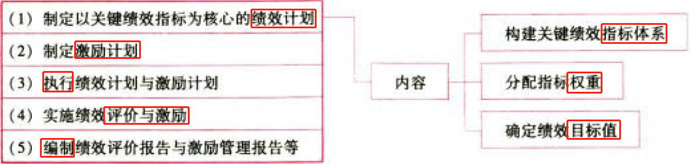

与其他业绩评价方法的关键不同是制定和实施以关键绩效指标为核心的绩效计划。

### 2.5.2. 构建关键绩效指标体系

#### 2.5.2.1. 体系的构成

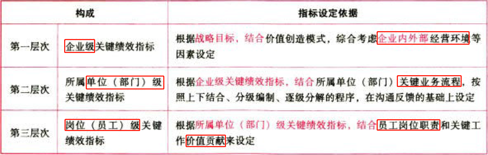

#### 2.5.2.2. 关键绩效指标的分类

#### 2.5.2.3. 键绩效指标设置的要求

### 2.5.3. 设定关键绩效指标权重

### 2.5.4. 设定关键绩效指标目标值

## 2.6. 关键绩效指标法的优点和缺点:star: :star: 

# 3. 经济增加值

## 3.7. 经济增加值概念:star: :star: :star: 

### 3.7.5. 基本公式和特点

$$经济增加值=税后净营业利润-加权平均资本成本\times平均资本占用$$

（1）税后净营业利润衡量的是企业的经营盈利情况.其含义与第2章介绍的管理用财务报表体系中的税后经营净利润相同

（2）平均资本占用反映的是企业持续投入的各种债务资本成本和股权资本

（3）加权平均资本成本反映的是企业各种资本的平均成本率

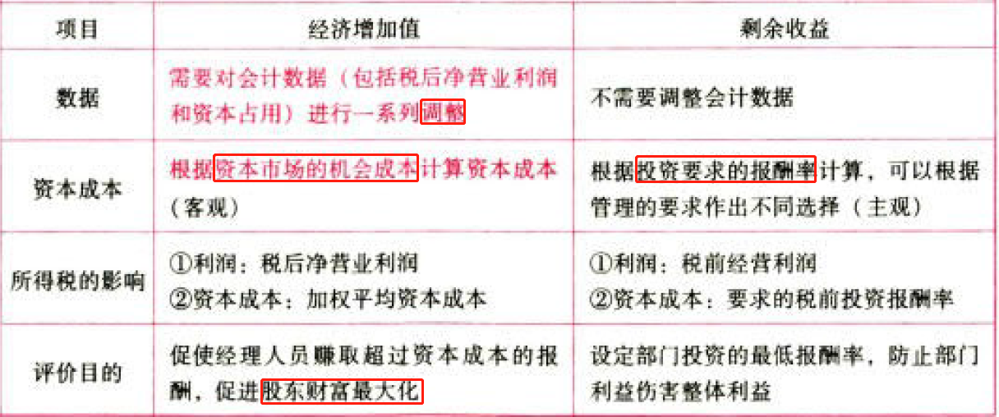

### 3.7.6. 不同含义的经济增加值

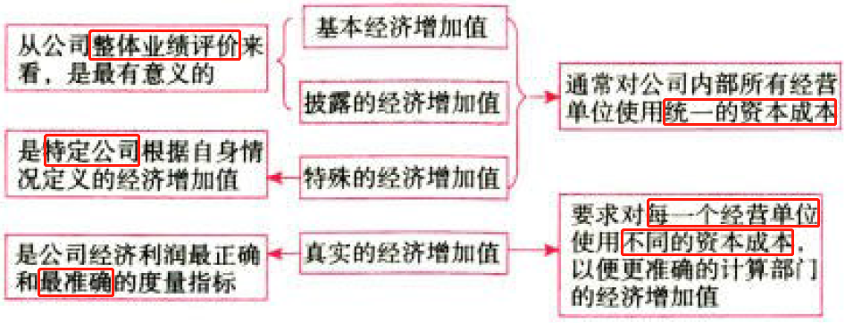

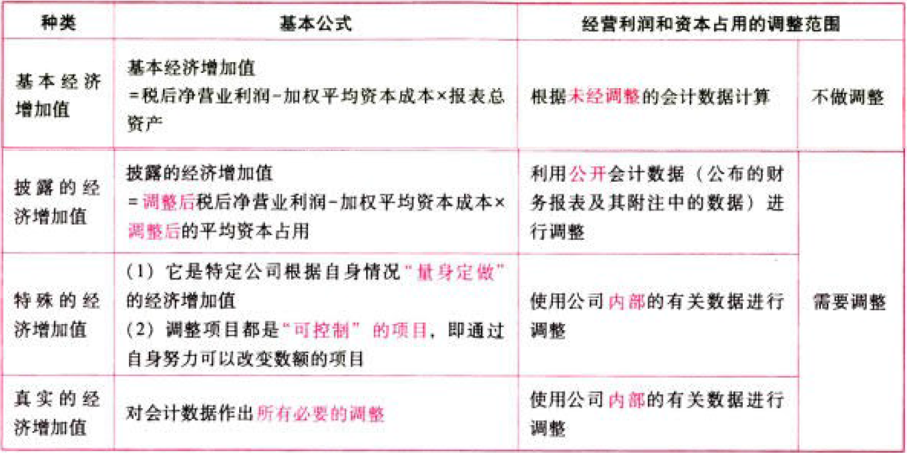

### 3.7.7. 提示

（1）由于基本经济增加值的“经营利润”和“总资产”是按照会计准则计算的，它们歪曲了公司的真实业绩，但相对于会计利润来说是个进步，它承认了股权资金的成本。

（2）披露的经济增加值的调整。

①将会计上费用化、经济增加值认为应该资本化的项目进行调整。

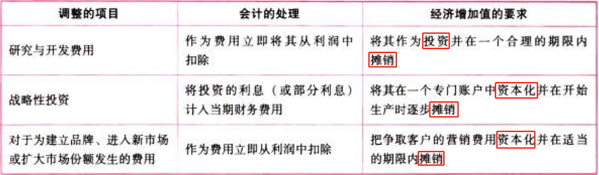

②折旧费用的处理。

③上述调整，不仅涉及利润表而且涉及资产负债表的有关项目，需要按照复式记账原理同时调整。例如，将研发费用从当期费用中扣除，必须相应增加平均资本占用。

（3）公司外部人员无法计算特殊的经济增加值和真实的经济增加值，因为缺少计算所需要的数据。

## 3.8. 简化的经济增加值的衡量:star: :star: :star: 

### 3.8.8. 经济增加值的定义及计算公式

是指企业税后净营业利润减去资本成本后的余额

$$径济增加值=税后净营业利润-资本成本=税后净营业利润-调整后资本\times平均资本成本率$$

$$税后净营业利润＝净利润+(利息支出+研究开发费用调整项-变卖主业优质资产取得的非经常性收益)\times(1-25%)$$

$$调整后资本=平均所有者权益+平均负债合计-平均无息流动负债-平均在建工程$$

### 3.8.9. 会计调整项目说明

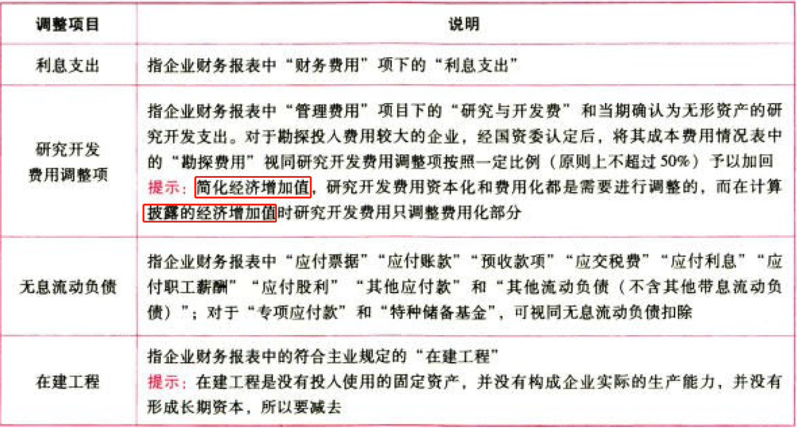

### 3.8.10. 资本成本率的确定

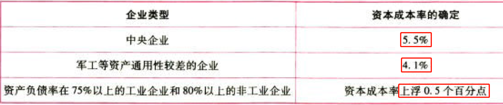

### 3.8.11. 其他重大调整事项

发生下列情形之一，对于企业经济增加值考核产生意大影响的，国资委酌情予以调整：

（1）重大政策变化；

（2）严重自然灾害等不可抗力因素；

（3）企业重组、上市及会计准则调整等不可比因素；

（4）国资委认可的企业结构调整等其他事项。

## 3.9. 经济增加值评价的优点和缺点:star: :star: 

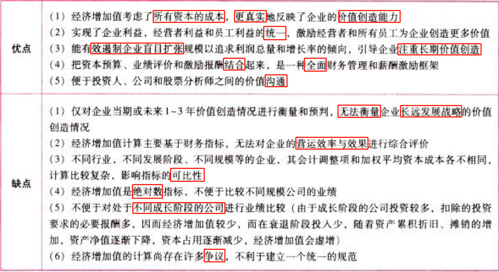

# 4. 平衡计分卡

## 4.10. 平衡计分卡框架:star: :star: 

平衡计分卡是指基于企业战略，从财务、客户、内部业务流程、学习与成长4个维度，将战略目标逐层分解转化为具体的、相互平衡的绩效指标体系，并据此进行绩效管理的方法。

### 4.10.12. 平衡计分卡的四个维度

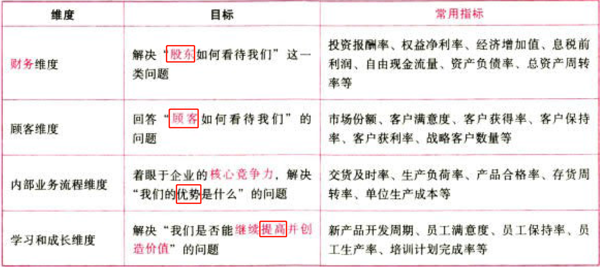

### 4.10.13. 平衡计分卡的四个平衡

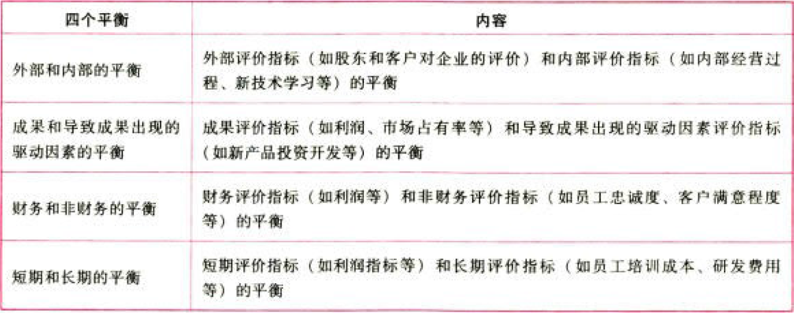

## 4.11. 平衡计分卡与企业战略管理:star: 

### 4.11.14. 平衡计分卡和战略管理的关系

一方面，平衡计分卡考核的基准包括战略规划中所制定的目标；另一方面，平衡计分卡又是一个有效的战略执行系统，它通过引人四个程序，使得管理者能够把长、短期行为联系在一起。

### 4.11.15. 平衡计分卡的要求

（1）平衡计分卡的四个方面应互为因过，最终结果是实现企业的战略。

（2）平衡计分卡中既要有业衡量指标，也要有具体衡量指标的驱动因素。

（3）平衡计分卡应该最终和财务指标联系起来，因为企业的最终目标是实现良好的经济利润。

## 4.12. 战略地图架构:star: 

## 4.13. 平衡计分卡vs传统业绩评价系统:star: 

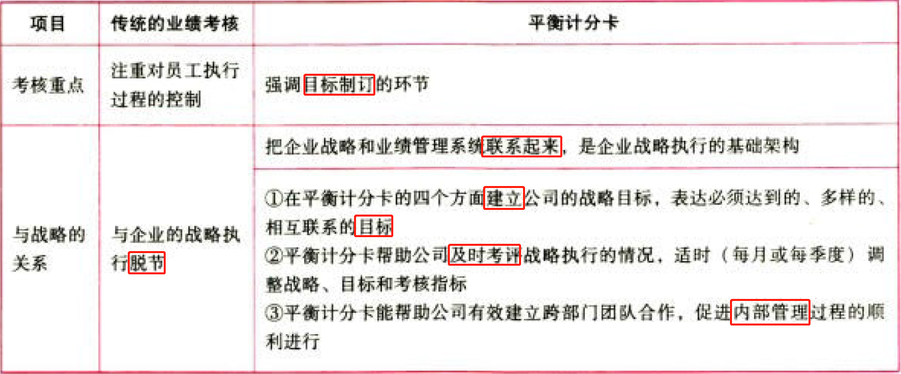

## 4.14. 平衡计分卡的优点和缺点:star: :star: 

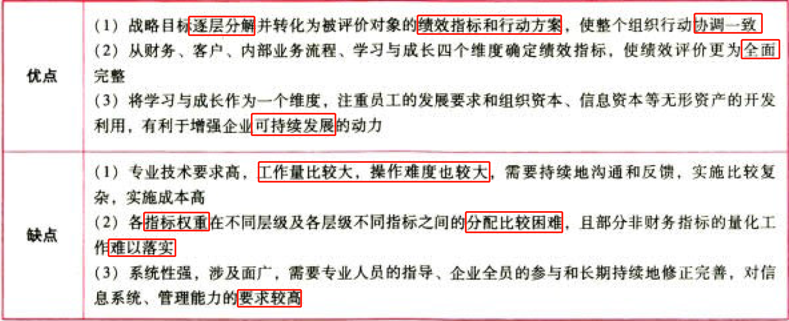

# 5. 总结

End。
