C21管理会计报告

# 1. 内部责任中心业绩报告

## 1.1. 管理会计报告概述:star: 

### 1.1.1. 管理会计报告的含义、特征、对象

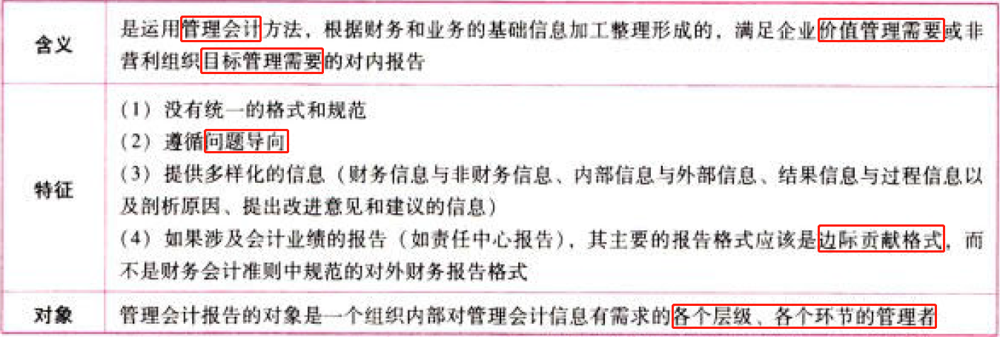

### 1.1.2. 管理会计报告的类型

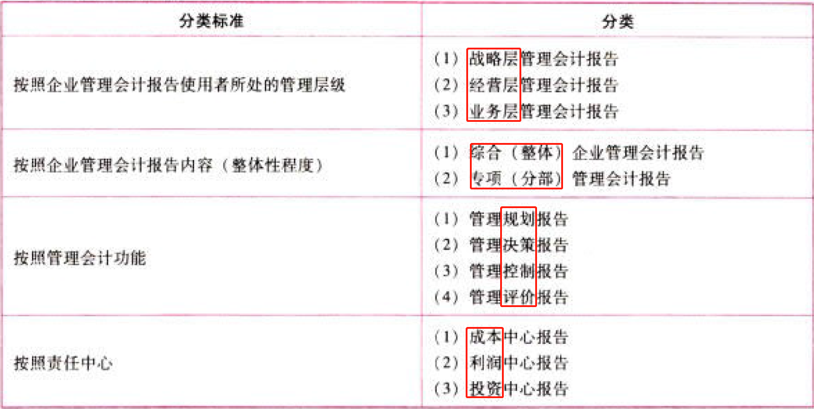

## 1.2. 业绩报告的含义及内容:star: :star: 

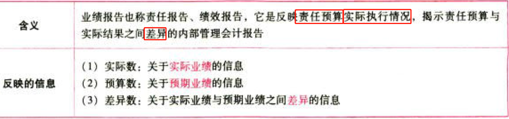

## 1.3. 各责任中心业绩报告:star: :star: 

### 1.3.3. 成本中心业绩报告

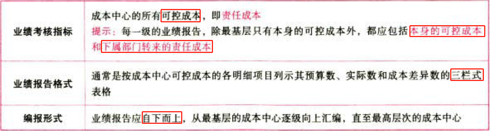

### 1.3.4. 利润中心业绩报告

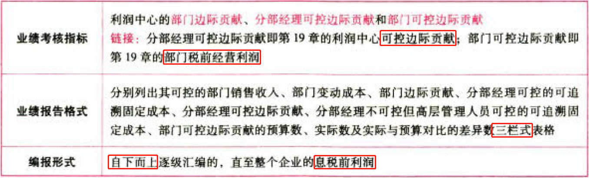

### 1.3.5. 投资中心业绩报告

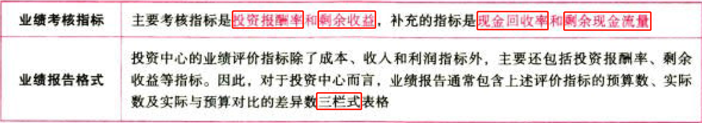

# 2. 质量成本报告

## 2.4. 质量成本及其分类:star: :star: :star: 

### 2.4.6. 质量的含义

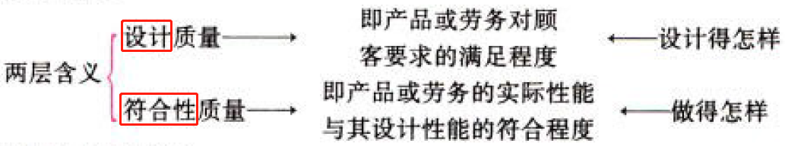

### 2.4.7. 质量成本及其分类

质量成本是指企业为了保证产品达到－定质量标准而发生的成本，这一概念连接了企业管理中的生产技术与经济效益两个层面。

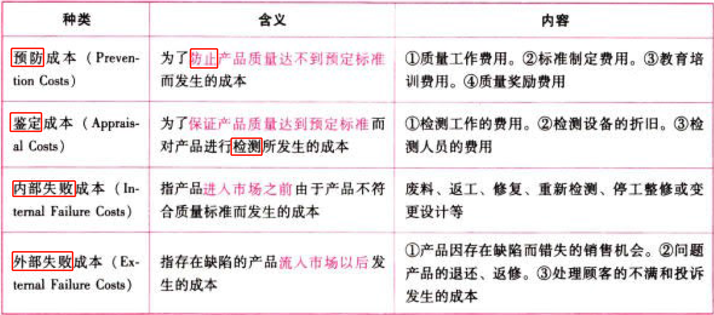

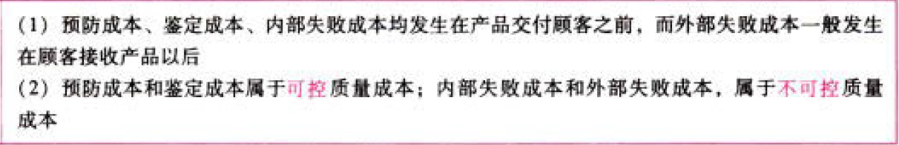

## 2.5. 质量成本报告:star: 

## 2.6. 质量绩效报告:star: 

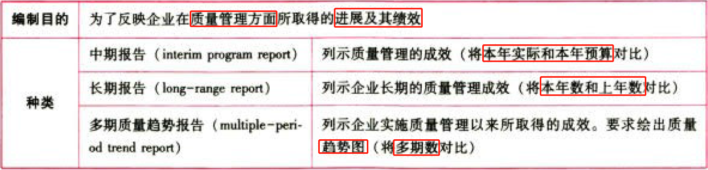

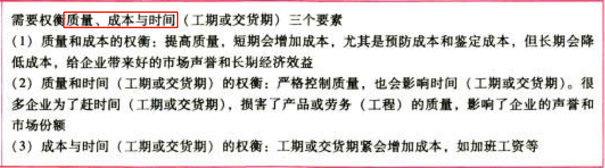

# 3. 总结

End。
