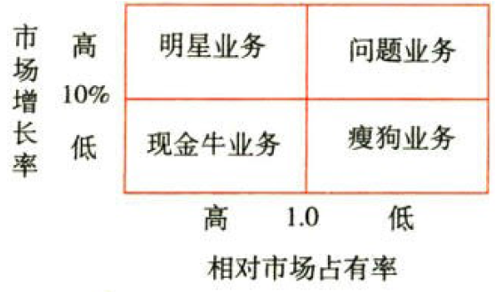
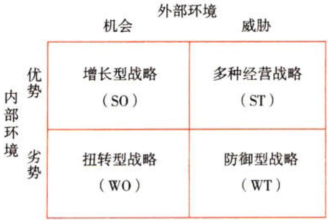

战略分析

# 1. 本章考情分析

本章重点内容：

①`宏观`环境分析中政治和法律因素、经济因素、社会和文化因素、技术因素的具体内容；

②产品`生命周期分析`；

③波特的产业`五种竞争力`分析；

④成功`关键因素分析`；

⑤`竞争环境分析`（竞争`对手`分析和战略`群组`分析）；

⑥`国家`竞争优势（钻石模型）分析；

⑦企业资源与能力分析｛重点是企业`资源`分析和`核心`能力分析）；

⑧波特的`价值链`分析（五种`基本`活动、四种`支持`活动和企业资源能力的`价值链`分析）；

⑨业务组合分析（`波士顿`矩阵与`通用`短阵）；

⑩`SWOT`分析。

# 2. 企业外部环境分析

企业外部环境分析是指公司对制订战略时面临的外部环境进行分析，从而寻求机会，规避威胁。这是制订公司战略的基础和前提。外部环境可以从宏观环境、产业环境、竞争环境和国家竞争优势几个层面展开。

## 2.1. 宏观环境分析:star: 

[PEST分析](../../../../CPA6in1/CPA6in1/6战略/外部环境分析.PEST分析.md)，即宏观环境分析，是指影响`所有`产业和企业的宏观因素分析。

## 2.2. 产业环境分析

### 2.2.1. 产品生命周期:star: :star: 

产品生命周期是指一个`产业`从初生到衰亡，具有阶段性和共同规律性的厂商行为（特别是进入和退出行为）的改变`过程`。

产业生命周期理论是从产品生命周期理论、企业生命周期理论逐步演化而来的，是生命周期理论在产业经济学中的运用和发展。

以`产业销售额增长率曲线`的拐点来划分，产品生命周期分为[导入阶段、成长阶段、成熟阶段和衰退阶段](../../../../CPA6in1/CPA6in1/6战略/产品生命周期.4阶段.md)四个阶段。

产品生命周期理论在运用上有一定的[局限性](../../../../CPA6in1/CPA6in1/6战略/产品生命周期.局限性.md)。

### 2.2.2. 产业五种竞争力:star: :star: :star: 

#### 2.2.2.1. 五力模型

波特认为，决定公司获利能力的首要因素是“产业吸引力”，而产业吸引力是由产业的`市场结构`决定的。公司在拟定竞争战略时，必须要深入了解决定产业吸引力的竞争法则。`竞争法则`可以用五种竞争力来具体分析，这五种竞争力包括[潜在进入者的进入威胁、购买者的议价能力、替代品的替代威胁、供应者的议价能力及产业内现有企业的竞争](../../../../CPA6in1/CPA6in1/6战略/产业环境分析.五力模型.md)。

这五种竞争力能够决定产业的`获利能力`，它们会影响产品的价格、成本与必要的投资，也决定了产业结构。公司如果要想拥有长期的获利能力，就必须先了解其所处的产业结构。

#### 2.2.2.2. 产业中的在位企业对付五种竞争力的战略选择

①公司必须进行自我竞争战略`定位`，通过利用`低成本`优势或`差异化`优势把公司自身与产业五种竞争力相`隔离`，进而超越竞争对手。

②在市场有效`细分`的基础上，聚焦于受五种竞争力影响更少的细分市场作为目标市场，即通过采用`集中化`战略来获取竞争优势。

③公司必须努力去改变这五种竞争力。公司可以通过与供应者或购买者建立长期战略`联盟`，以减少相互之间的讨价还价；还可以寻求进入`阻绝`战略（如限制进入定价）来减少潜在进入者的威胁等。

#### 2.2.2.3. 五力模型的局限性

五力模型更多的是一种`理论`思考工具，而非可以实际操作的战略工具。它有一些[局限性](../../../../CPA6in1/CPA6in1/6战略/产业环境分析.五力模型.局限性.md)。

### 2.2.3. 成功关键因素分析:star: :star: 

成功关键因素是在探讨`产业特性`与`企业战略`之间的关系时，常使用的概念。一个`产业`的成功关键因素是指那些影响产业内企业在市场上最大限度获利的关键因素。企业的经营就如同体育竞技项目，也需要找到自己所在产业的成功关键因素。例如，打篮球需要一定的身高和良好的弹跳能力；踢足球需要速度和团队的配合；棋类项目则需要敏捷的思维和良好的心理素质；企业作为产业的一份子，必须把握所在产业的成功关键因素。总之，成功企业的实践表明：企业要想在竞争中获胜，必须在成功关键因素上比竞争对手做得更好。

成功关键因素是企业取得产业成功的前提条件。[这三个问题](../../../../CPA6in1/CPA6in1/6战略/产业环境分析.成功关键因素.确认的三个问题.md)是确认产业的成功关键因素时必须`考虑`的。

[三点提示](../../../../CPA6in1/CPA6in1/6战略/产业环境分析.成功关键因素.三点提示.md)。

## 2.3. 竞争环境分析

竞争环境分析包括两个方面：一是从`个别`企业视角去观察分析竞争对手的实力（用显微镜观察）；二是从`产业`竞争结构视角观察分析企业所面对的竞争格局（用放大镜观察）。

### 2.3.4. 竞争对手分析:star: :star: 

公司的战略选择必然影响着竞争对手的行为与反应，这是公司进行战略选择时必须要考虑的。公司只有事先考虑到竞争`对手`对公司战略的行为与反应，并做出了相应的应对措施，才能保证战略选择的正确性。有效的竞争对手分析有助于公司了解、解读和预测竞争对手的行为与反应。

对竞争对予的分析有四个方面的主要内容，即竞争对手的[未来目标、假设、现行战略和潜在能力](../../../../CPA6in1/CPA6in1/6战略/产业环境分析.竞争对手分析.4个方面.md)。

### 2.3.5. 产业内的战略群组:star: :star: 

战略群组，也称战略集团，是指某一个产业内执行同样或类似战略，并具有类似战略特征的`一组企业`。

战略群组分析既不同于产业整体分析方法，也不同于单个企业的个别分析方法，而是介于两者之间。它是将产业中的企业分成特征不同的`群组`加以研究，并找出带有`共性`的事物，更准确地把握产业中竞争的方向和实质，避免以大代小或以小代大所造成的缺陷。

#### 2.3.5.4. 战略群组的特征

关于如何确定战略群组，波特提出如下一些变量：产品或服务的`差异`化（多样化）程度、`品牌`的数量、`技术`领先程度、`研究`开发能力、产品或服务的`质量`、纵向`一体化`程度、`价格`水平、组织的`规模`、所使用的分销`渠道`等。

为了识别战略群组，必须选择这些特征的2～3项，并且将该产业的每个战略群组在图上画出来。不过，应该避免选择那些同一产业中所有企业都相同的特征。

#### 2.3.5.5. 战略群组分析

战略群组分析的作用：

①了解战略群组间的竞争`状况`。

②了解战略群组间的`“移动障碍”`。

③了解战略群组内企业竞争的主要`着眼点`。

④`预测`市场变化或发现战略机会。

## 2.4. 国家竞争优势（钻石模型）分析:star: :star: 

如果说波特的价值链是分析企业内部活动的微观分析工具，波特的五种竞争力模型是分析企业所属产业环境的中观分析工具。那么，波特的钻石模型就是分析国家和地区竞争力的宏观分析工具。

钻石模型，也称国家竞争优势模型。波特认为，一国的国内`经济环境`对企业开发其自身的竞争能力有很大影响。其中，影响最大、最直接的是以下四个因素：[生产要素、需求条件、相关与支持性产业以及企业战略、企业结构和同业竞争](../../../../CPA6in1/CPA6in1/6战略/产业环境分析.钻石模型.4因素.md)。在一个国家的许多产业中，最有可能在国际竞争中取胜的是那些国内“4要素”环境对其特别有利的产业。因此，“4要素”环境是产业`国际竞争力`的最重要来源。

# 3. 企业内部环境分析

基于资源的观点认为，公司内部环境同外部环境相比，具有更重要的意义，对企业创造市场优势具有`决定性`的作用。核心能力的形成需要企业不断地积累，战略制定所需的各种资源，需要企业不断地学习、创新和超越。企业内部所拥有的资源和能力是决定一个企业能否取得竞争优势的关键，决定了一个企业在市场中的竞争地位。

## 3.5. 企业资源与能力分析

### 3.5.6. 企业资源分析:star: :star: 

企业资源分析是指企业对其所拥有的资源进行`识别`和`评价`的过程。通过分析企业资源，可以确定企业的`优势`和`劣势`，综合评估企业的战略能力。

#### 3.5.6.6. 企业资源的主要类型

企业资源是指企业在向社会提供产品或服务的过程中所拥有、控制或可以利用的、能够帮助实现企业目标的各种`生产要素`的集合。企业资源主要分为三种：[有形资源、无形资源和人力资源](../../../../CPA6in1/CPA6in1/6战略/企业资源分析.企业资源的主要类型.md)。

#### 3.5.6.7. 决定企业竞争优势的企业资源判断标准

在分析一个企业拥有的资源时，必须知道哪些资源是`有价值`的，可以使企业获得`竞争优势`。其主要的判断标准包括：资源的[稀缺性、不可模仿性、不可替代性、持久性](../../../../CPA6in1/CPA6in1/6战略/企业资源风险.决定企业竞争优势的企业资源的判断标准.md)。

### 3.5.7. 企业能力分析:star: :star: 

#### 3.5.7.8. 企业能力的定义

企业能力，是指企业配置资源，发挥其生产和竞争作用的能力。企业能力来源于企业的有形资源、无形资源和人力资源的`整合`，是企业各种资源有机组合的结果。

#### 3.5.7.9. 企业能力的构成

企业能力主要由[研发能力、生产管理能力、营销能力、财务能力和组织管理能力](../../../../CPA6in1/CPA6in1/6战略/企业能力分析.企业能力的构成.md)等组成。

### 3.5.8. 企业的核心能力:star: :star: :star: 

所谓核心能力，就是企业在具有重要竞争意义的经营活动中能够比其竞争对手`做得更好`的能力。

辨别企业能力是否属于核心能力，有[3个关键性测试](企业核心能力.辨别企业能力.3个关键性测试.md)（企业如何打造自己的核心竞争力）。

企业的核心能力就其本质来讲非常的复杂和微妙，有时很难满足上述3个关键性测试。在这种情况下，还需要运用其他`识别方法`，包括[功能分析、资源分析以及过程系统分析](../../../../CPA6in1/CPA6in1/6战略/企业核心能力.其他识别方法.md)。

核心能力的评价方法：①企业的自我评价；②产业内部比较；[③基准分析（标杆分析）](../../../../CPA6in1/CPA6in1/6战略/企业核心能力.评价方法.基准分析.docx)；[④成本驱动力和作业成本法](../../../../CPA6in1/CPA6in1/6战略/企业核心能力.评价方法.成本驱动力和作业成本法.docx)；[⑤收集竞争对手的信息](../../../../CPA6in1/CPA6in1/6战略/企业核心能力.评价方法.收集竞争对手的信息.md)。

企业核心能力与成功关键因素的[区别点和相同点](../../../../CPA6in1/CPA6in1/6战略/企业核心能力.企业核心能力与成功关键因素的区别点和相同点.md)。

## 3.6. 价值链分析

价值链分析是波特提出来的用于分析企业`竞争优势`的理论。该理论认为，企业的竞争优势归根结底来自企业为顾客所创造的超过其成本的价值，即竞争优势＝`价值`－`成本`。价值是指顾客所认同的利益，成本是指企业为满足顾客利益而付出的各种支出和费用。因此，企业要想提升其竞争优势，必须从创造价值和降低成本两方面入手。

波特认为，每一个企业的价值链都是由以独特方式联结在一起的九种`活动`类别构成的。具体是指内部`后勤`、生产`经营`、外部`后勤`、市场`销售`、`服务`五种基本活动和`采购`管理、`技术`开发、`人力资源`管理、企业`基础设施`四种支持活动。这些活动对企业的相对成本地位都有贡献，同时也是构成差异化的基础。一个企业与其竞争对手的价值链`差异`就代表着竞争优势的一种潜在来源。对此，波特强调指出：“企业正是通过比其竞争对手更`廉价`或更`出色`地开展这些重要的战略活动来赢得竞争优势的。”显而易见，波特的“价值链”理论对于提高企业竞争优势具有现实的启发意义。

### 3.6.9. 价值链的两类活动:star: :star: 

价值链分析将企业的生产经营活动分为[基本活动](../../../../CPA6in1/CPA6in1/6战略/价值链分析.基本活动.docx)和[支持活动](../../../../CPA6in1/CPA6in1/6战略/价值链分析.支持活动.md)两大类。

### 3.6.10. 价值链确定:star: 

在对企业价值活动进行`分解`时需要把握[三个原则](../../../../CPA6in1/CPA6in1/6战略/价值链分析.分解价值活动的三个原则.md)。

### 3.6.11. 企业资源能力的价值链分析:star: :star: 

企业资源能力的`价值链分析`要[明确以下三点](../../../../CPA6in1/CPA6in1/6战略/价值链分析.要明确3点.md)。

## 3.7. 业务组合分析

价值链分析有助于对企业的能力进行考察，这种能力来源于独立的产品、服务或业务单位。但是，对于`多元化`经营的公司来说，还需要将企业的`资源`和`能力`作为一个`整体`来考虑。波士顿矩阵与通用矩阵是公司业务组合分析的主要方法。

### 3.7.12. 波士顿矩阵:star: :star: 

#### 3.7.12.10. 定义及用途

波士顿矩阵（BCG矩阵）是对企业当前的业务组合进行分析、评价的战略管理工具。它把公司经营的全部业务的组合作为一个总体来看待，故也称“统筹分析法”。这种方法假定企业由两个以上的业务组成，每个业务有明显的`差异`并具有不同的`细分市场`。在拟定每个业务的战略时，主要考虑的是它们的相对市场`占有率`（企业实力）和市场`增长率`（市场引力）。

波士顿矩阵以相对市场占有率为横坐标，市场增长率为纵坐标，划分为四个象限。企业各类业务按其相对市场占有率和市场增长率的高低填入相应的位置，形成矩阵。波士顿矩阵的纵坐标表示市场增长率，是指企业所在产业某项业务前后两年市场销售额增长的百分比。通常用10%作为市场增长率高、低的界限，大于10%的增长率为高，小于10%的增长率为低。横坐标表示本企业在产业中的相对市场占有率，是指企业某项业务的市场份额与这个市场上最大竞争对手的市场份额之比，通常用1.0作为相对市场占有率高、低的界限，高于1.0的相对市场占有率为高，低于1.0的相对市场占有率为低。

市场增长率是决定企业业务`结构`是否合理的`外在`因素。相对市场占有率是决定企业业务`结构`是否合理的`内在`因素.

波士顿矩阵主要解决如何使企业的业务组合适应外部市场需求的变化，并将企业有限的`资金`有效地`分配`到合理的业务组合中去，以提高企业的整体竞争力。

#### 3.7.12.11. 业务类型

根据市场增长率和相对市场占有率的不同组合，会出现[4种不同性质的业务类型](../../../../CPA6in1/CPA6in1/6战略/波士顿矩阵.业务类型.md)。

#### 3.7.12.12. 波士顿矩阵的运用

在充分了解了4种业务的特点后还需进一步明确各项业务在公司中的不同地位，从而进一步明确其战略。通常有[4种战略分别适用于不同的业务](../../../../CPA6in1/CPA6in1/6战略/波士顿矩阵.适用的战略.md)。

### 3.7.13. 通用矩阵:star: 

通用矩阵（GE矩阵）是美国通用电气公司在波士顿矩阵的基础上创立的一种业务组合分析工具。

#### 3.7.13.13. 基本原理

说到GE短阵就一定要结合BCG矩阵一起进行比较讨论，因为GE矩阵可以说是为了克服BCG矩阵的缺点所开发出来的。由于基本假设和很多局限性都与BCG矩阵相同，其最大的改善就在于用了`更多的指标`来衡量两个维度。

相比BCG矩阵，GE矩阵也提供了产业吸引力和企业实力之间的类似比较，但不像BCG矩阵用市场增长率来衡量市场吸引力，用相对市场占有率来衡量企业实力，其只是单一指标；而GE矩阵使用数量更多的因素来衡量这两个变量，纵轴用多个指标反映产业`吸引力`，横轴用多个指标反映企业`竞争地位`，同时增加了中间等级。也由于GE矩阵使用多个因素，可以通过增减某些因素或改变它们的重点所在，来很容易地使GE矩阵适应经理的具体意向或某产业特殊性的要求。

GE矩阵比BCG短阵在[三个方面](../../../../CPA6in1/CPA6in1/6战略/通用矩阵.比波士顿矩阵更成熟的3个方面.md)表现得更为`成熟`。

通用矩阵虽然改进了波士顿矩阵过于简化的不足，但是也存在自身的[局限和不足](../../../../CPA6in1/CPA6in1/6战略/通用矩阵.局限和不足.md)。

# 4. SWOT分析

## 4.8. 基本原理:star: :star: 

SWOT分析是对企业的内部条件和外部环境的各方面内容进行`综合`概括，分析企业的`优势`和`劣势`及面临的`机会`和`威胁`，进而帮助企业进行战略选择的一种方法。

企业内部的优势和劣势分析主要是着眼于企业自身的`实力`及其与竞争对手的`比较`，而企业外部的机会和威胁分析则将注意力放在外部环境的`变化`及对企业的可能`影响`上。通过SWOT分析，可以帮助企业把资源和行动聚集在自己的强项和有最多机会的地方，并让企业的战略变得更加明朗。在分析时，应把所有的内部因素（优势和劣势）`集中`在一起，然后用外部的力量来对这些因素进行`评估`。

### 4.8.14. 优势Strength

能给企业带来重要竞争优势的积极因素或独特能力。

表现：产品市场占有率高、拥有充足的资金、熟练的技术工人和较强的产品开发能力。

### 4.8.15. 劣势Weakness

限制企业发展且有待改正的消极方面。

表现：财务状况恶化、产品质量下降、管理效能低。

### 4.8.16. 机会Opportunity

随着企业外部环境的改变而产生的有利于企业的时机。

表现：政府的支持、与购买者和供应者越立良好的关系等。

### 4.8.17. 威胁Threat

随着企业外部环境的改变而产生的不利于企业的时机。

表现：新竞争对手的出现、市场增长缓馒、购买者和供应者讨价还价能力增强等。

## 4.9. SWOT分析的应用:star: :star: :star: 

### 4.9.18. 优势—机会（SO战略）:arrow_up:

增长型战略是一种发展企业内部优势与利用外部机会的战略，是一种理想的战略模式。当企业具有特定方面的`优势`，而外部环境又为发挥这种优势提供有利`机会`时，可以采取该战略。

例如，良好的产品市场前景、供应商规模扩大和竞争对手有财务危机等外部条件，配合企业市场份额高等内在优势可成为企业收购竞争对手、扩大生产规模的有利条件。

### 4.9.19. 优势—威胁（ST战略）:leftwards_arrow_with_hook:

多种经营战略（多元化战略）是指企业利用自身优势，`回避`或减转外部威胁所造成的影响的战略。

例如，竞争对手利用新技术大幅度降低成本，给企业带来很大的成本压力；同时材料供应紧张，其价格可能上涨；消费者要求大幅度提高产品质量等。但若企业拥有充足的资金、熟练的技术工人和较强的产品开发能力，便可利用这些优势开发新工艺、简化生产工艺过程、提高原材料利用率，从而降低材料消耗和生产成本。另外，开发新技术产品也是企业可选择的战略之一。新技术、新材料和新工艺的开发与应用是最具潜力的降低成本措施，同时，它可提高产品质量，从而同避外部威胁的影响。

### 4.9.20. 劣势—机会（WO战略）:angel:

扭转型战略（转向战略）是`利用`外部机会来克服内部劣势，使企业`改变`劣势而获取优势的战略。当存在外部机会，但由于企业存在一些内部劣势而妨碍其利用机会时，可采取措施先克服这些劣势。

### 4.9.21. 劣势—威胁（WT战略）:umbrella:

防御型战略是一种旨在`减少`内部劣势，`规避`外部威胁的收缩战略。当企业存在内忧外患时，往往面临生存危机，企业应主动进行业务重组或者彻底放弃，设法避开威胁和消除劣势。

## 4.10. 小结

通过SWOT分析可以将企业战略分析过程中总结出的企业内部的优势与劣势、外部环境的机会与威胁转换为企业下一步的战略开发方向。SWOT分析成为战略分析与战略选择两个阶段的连接点。

# 5. 总结

End。
