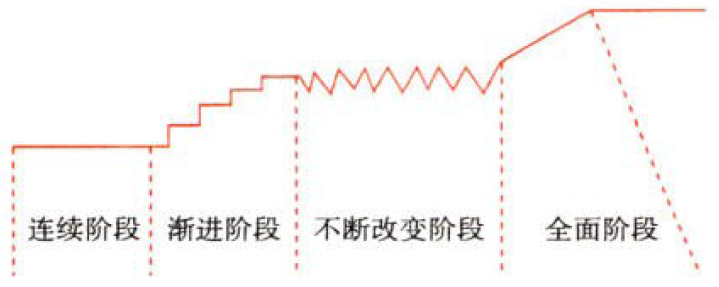

战略与战略管理

# 1. 公司战略管理

## 1.1. 战略变革管理:star: :star: 

### 1.1.1. 战略变革按其范围和程度划分

#### 1.1.1.1. 战略变革的发展阶段

渐进性变革过程可以分为[连续阶段（修正）、渐进阶段（充实）、不断改变阶段（完善）和全面阶段（提高）](../../../../CPA6in1/CPA6in1/6战略/战略变革管理.发展阶段.md)四个阶段。（见下图）

##### 1.1.1.1.1. 连续阶段

在这个阶段中，制定的战略基本上没有发生大的变化，仅有一些`小的修正`。强调利用公司已有的组织资源推进变革，在基本不触动既得利益格局的前提下实行`增量`变革以保持战略的连续性。

##### 1.1.1.1.2. 渐进阶段

在这个阶段中，战略发生缓慢的变化。这种变化可能是`零打碎敲`性的，也可能是`系统性`的。渐进阶段变革通常选择`风险最小`的方面作为变革的切入点，采取先`试点`，后推广的方式推进。

##### 1.1.1.1.3. 不断改变阶段

在这个阶段中，战略变化呈现`无方向`或`无重心`的特点。其典型做法是通过对各个`局部的`击破，进行`全方位`出击，鼓励变革多样、综合。不断改变阶段的关键是整体构建和多元发展，因而强调全方位探索。

##### 1.1.1.1.4. 全面阶段

在这个阶段中，公司战略是在一个较短的时间内，发生`激进性`或`转化性`的变化。这是渐进性变革的“最后惊险一跃”。需要更科学的顶层设计、激励相容的变革措施、清晰明确的实现路径、科学透明的决策机制。随着变革逐渐步入深水区，“摸着石头过河”有溺亡的风险。公司需要朝着对岸一个明确的目标、克服各种阻力、坚定地划水前行。
