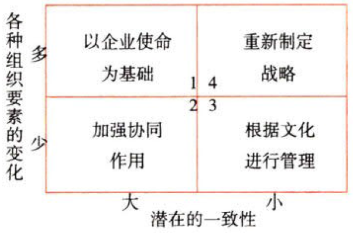

战略实施

# 1. 公司战略与企业文化

## 1.1. 战略稳定性与文化适应性:star: :star: 

在矩阵中，纵轴表示企业战略的`稳定性`状况，横轴表示文化的`适应性`状况。

### 1.1.1. 以企业使命为基础【为革命团结一致】

组织要素变化大（变革属于革命性变革），现有文化支持变革。

措施：{

①企业在进行重大变革时，必须考虑与企业基本`使命`的关系。企业使命是企业文化的正式基础；

②发挥企业`现有人员`在战略变革中的作用。现有人员之间具有共同的价值观念和行为准则，可以保持企业在文化一致的条件下实施变革；

③在调整企业的`奖励系统`时，必须注意与企业组织目前的`奖励行为`保持一致；

④考虑进行与企业组织目前的文化`相适应的`变革，不要破坏企业已有的行为准则。

}

### 1.1.2. 加强协同作用【借刀杀人】

组织要素变化不大（变革属于渐进性变革），现有文化支持变革。

措施：{

①利用目前的`有利条件`，巩固和加强企业文化；

②利用文化相对稳定的这一时机，根据企业文化的要求，解决企业生产经营中的问题。

}

### 1.1.3. 根据文化进行管理【特区】

组织要素变化不大（变革属于渐进性变革），现有文化抵制变革。

措施：当企业准备推行某种新的激励方式时，虽然这种方式与过去的激励方式相比，并没有根本性的变化，但是，某些利益相关者基于对自身利益的考虑，可能会反对实施新的方法。在这种情况下，企业可以根据经营的需要，在不影响企业总体文化一致性的前提下，对某种经营业务实行`不同的文化管理`。

### 1.1.4. 重新制定战略【重生】

组织要素变化大（变革属于革命性变革），现有文化抵制变革。

措施：在外部环境发生重大变化时，企业需要重新制定战略，同时`创建`适应新战略的企业文化。企业需要从四个方面采取管理行动：{

①企业的高层管理人员要`痛下决心`进行变革，并向全体员工讲明变革的意义；

②为了形成新的文化，企业要招聘或从内部提拔一批与新文化相符的`人员`；

③改变`奖励结构`，将奖励的重点放在具有`新文化意识`的事业部或个人的身上，促进企业文化的`转变`；

④设法让管理人员和员工明确新文化所需要的行为，形成一定的`规范`，保证新战略的顺利实施。

}
