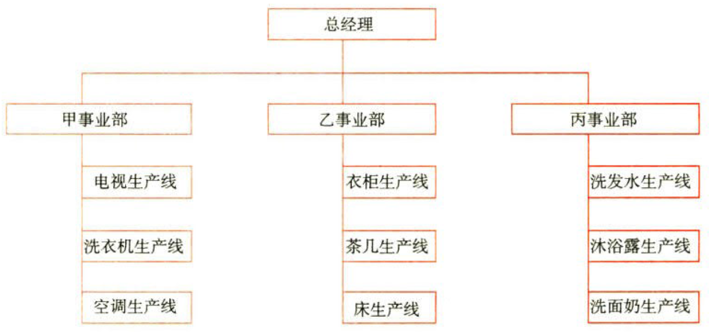
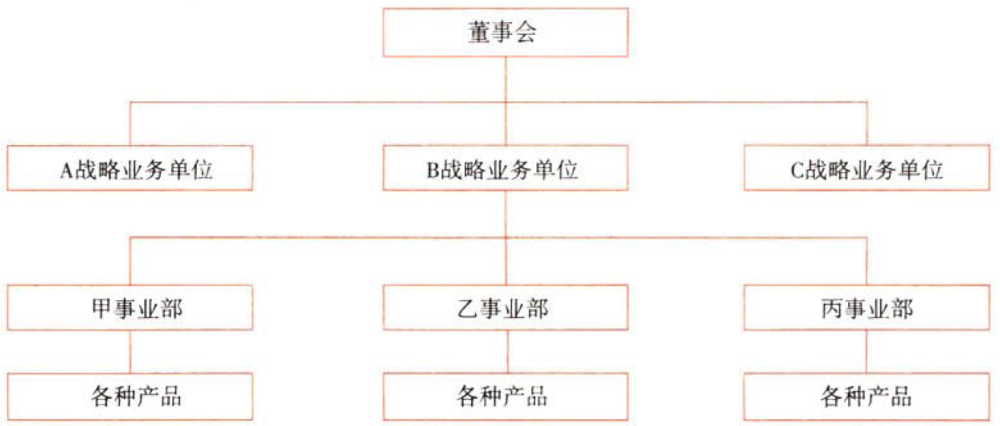

战略实施

# 1. 公司战略与组织结构

## 1.1. 纵横向分工结构:star: :star: 

### 1.1.1. 横向分工结构

#### 1.1.1.1. 横向分工组织结构的基本类型

##### 1.1.1.1.1. M型企业组织结构

将企业划分成`若干`事业部，每个事业部负责一个或多个产品线。

优点：{

①各事业部之间有比较有竞争，可以增强企业`活力`，利于持续成长；

②总部高层可以摆脱日常事务的烦扰，集中精力考虑`全局`问题，总部员工工作量`减轻`；

③职权`分派`到总部下面各个事业部，并在事业部内`再次分配`；

④事业部作为利润中心，便于进行`绩效考评`。

}

缺点：{

①为事业部`分配`企业的管理`成本`比较`困难`，并略带主观性；

②会在事业部之间滋生功能失调性的竞争和`摩擦`；

③确定`内部转移价格`可能会产生`冲突`。

}

适用范围：具有若干生产线的企业or市场环境复杂多变的企业or地理位置分散的企业。

##### 1.1.1.1.2. 战略业务单位组织结构SBU

也称`超事业部制`组织结构，是在事业部制组织结构的基础上，在企业最高管理层和各个事业部之间增加了一级管理机构——`战略业务单位`，负资管辖和协调所属各个事业部的活动，使领导方式在分权的基础上又适当的集中。

优点：{

①降低了企业总部的控制跨度，`减轻`了总部的`工作负荷`；

②`减轻`了总部的`信息过度`情况；

③使得具有类似使命的产品、区域、市场或客户的事业部之间能够更好地`协调`；

④战略业务单位作为一个利润中心和投资中心，便于进行`绩效考评`。

}

缺点：{

①总部与事业部的关系变得更`疏远`；

②战略业务单位管理者为了取得更多的企业资源会引发竞争和`摩擦`，会导致功能性失调并对企业总体绩效产生不利影响。

}

适用范围：从事多元化经营的大型企业和巨型企业。

##### 1.1.1.1.3. 事业部制组织结构vsM型组织结构vs战略业务单位组织结构

教材对此做了过度的细分，从考试角度来讲可以这样理解：`事业部制`组织结构是多部门结构的基本形态，一般一个事业部负责一个产品大类或产品线；随着企业规模的扩大和产品线的增加，在事业部制组织结构的基础上衍生出`M型`组织结构，即每个事业部负责一个或多个产品线（扩大事业部的控制幅度）；随着企业规模的进一步扩张，业务更加多元化，在M型组织结构的基础上又衍生出战略业务单位组织结构，即总部和事业部之间增加了一个`管理层级`，在分权的基础上又适当的集中。产品线较多或地区分布较广泛的企业通常应选择M型组织结构。
