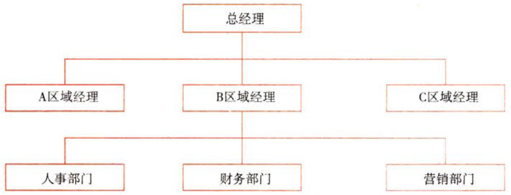
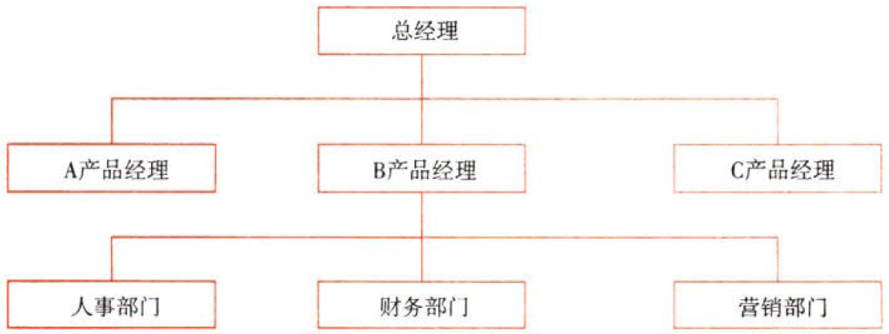

战略实施

# 1. 公司战略与组织结构

## 1.1. 纵横向分工结构:star: :star: 

### 1.1.1. 横向分工结构

#### 1.1.1.1. 横向分工组织结构的基本类型

##### 1.1.1.1.1. 创业型组织结构

也称`直线`制组织结构，是一种最早的、最简单的组织结构。

这种组织结构没有职能机构，从最高管理层到最低层实现直线`垂直领导`。

优点：结构`简单`，命令`统一`。

缺点：它要求管理层`通晓`多种知识和技能，`亲自`处理各种业务。在业务比较复杂、企业规模比较大的情况下，把所有管理职能都集中到最高管理者一人身上，显然是难以胜任的。

适用范围：规模较小、生产技术比较简单的小型企业。

##### 1.1.1.1.2. 职能制组织结构

也称直线`职能`制组织结构，是一种按`职能`划分`部门`的组织结构。企业内部按职能（如生产、营销、研发等）划分成若干部门，各部门独立性很小，均由企业高层领导`直接`进行管理，即企业实行`集中控制`和`统一指挥`。企业高层管理人员由于`专业知识`不足而将部分指挥权授予职能部门，使他们在某一职能范围内行使指挥权。

优点：{

①通过把专业技术和研究方向接近的同类专家`集中`到同一个部门中从事企业所有某一类型的活动，有助于实现`规模经济`；

②由于给每一位员工分配特定的、重复性的工作，有利于培养`职能专家`，同时也有利于提高工作效率；

③为各个职能部门赋予一定的责、权、利，便于董事会监控各个部门的`绩效`。

}

缺点：{

①职能部门`之间`的协作和配合性`较差`；

②难以`确定`各项产品产生的`盈亏`；

③容易导致各职能部门`各自为政`，追求部门利益而损害企业的整体利益；

④等级层次以及集权化的决策制定机制`缺乏`对市场的应变力与`灵活性`。

}

适用范围：中小型的、产品品种单一、生产技术发展较慢、外部环境稳定的企业。

##### 1.1.1.1.3. 事业部制组织结构

事业部制组织结构实行“`集中`决策，`分散`经营”的方式，是一种高度集权下的分权管理体制。事业部制组织结构的战略决策和经营决策相分离。根据业务特点按产品、地区、顾客（市场）等设立半自主性的经营事业部，公司的战略决策和经营决策由不同的部门和人员负责，使高层领导从繁重的日常经营业务中解脱出来，集中精力致力于企业的战略决策，并监督、协调各事业部的活动和评价各部门的绩效。事业部不是独立的法人，但具有较大的经营自主权，实行独立核算、自负盈亏，是一个利润中心。

###### 1.1.1.1.3.1. 区域事业部制结构

以所处的地理区域为基础设立事业部。

优点：{

①能实现更好更快的`地区决策`；

②总部放手让区域人员处理相关事务，可以`削减成本`费用（差旅费交通费）；

③能对该地区环境变化做出`迅速反应`。

}

缺点：{

①管理`成本重复`；

②某区域管理人员只能满足本区域业务，可能支撑不了其他区域的事务，难以处理`跨区域`的大客户的事务。

}

适用范围：有若干产品线的企业or市场环境复杂多变的企业or地理位置分散的企业。

###### 1.1.1.1.3.2. 产品/品牌事业部制结构

以产品的种类为基础设立事业部。

优点：{

①容易`协调`事业部内部的供产销活动；

②有助于实施产品`差异化`；

③易于出售或`关闭`经营不善的事业部。

}

缺点：{

①各事业部为争夺资源产生`摩擦`；

②公司总部与事业部的职能机构`重叠`，造成管理人员浪费；

③若产品事业部数量较多，`难以协调`；

④若产品事业部数量较多，事业部的高级管理层会`缺乏整体观念`（本位主义）。

}

适用范围：有若干产品线的企业or市场环境复杂多变的企业or地理位置分散的企业。
