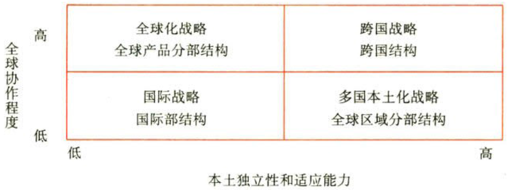

战略实施

# 1. 公司战略与组织结构

## 1.1. 纵横向分工结构:star: :star: 

### 1.1.1. 横向分工结构

#### 1.1.1.1. 横向分工组织结构的基本类型

##### 1.1.1.1.1. 国际化经营企业的组织结构

企业国际化经营的战略有4种基本类型，即`国际`战略、多国`本土化`战略、`全球化`战略与`跨国`战略，而这些战略所依托的组织结构如下图所示：

###### 1.1.1.1.1.1. 与“国际战略”相配套的“国际部结构”

实施国际战略的企业的组织结构往往采用国际事业部结构。其事业部的划分可以按区域划分，也可以按产品划分，甚至还可能按区域和产品的混合划分。

###### 1.1.1.1.1.2. 与“多国本土化战略”相配套的“全球区域分部结构”

实施多国本土化战略的企业的组织结构往往采用全球`区域分部`结构。采用全球区域分部结构的优势是能够使公司获得更高的`当地`反应能力和灵活性，劣势是母公司对其自治的子公司实施支配性的战略时会产生`阻力`和困难。

###### 1.1.1.1.1.3. 与“全球化战略”相配套的全球产品分部结构

实施全球化战略的企业的组织结构往往采用全球`产品分部`结构。这里的产品分部可以是事业部，也可以是战略业务单位。采用全球产品分部结构的优势是获得更高的`全球效率`，劣势是下属公司对母公司的`依赖`程度高，母公司与下属公司的互动缺乏创造力，从而导致子公司对当地市场的反应能力受到限制。

###### 1.1.1.1.1.4. 与“跨国战略”相配套的跨国结构

实施跨国战略的企业的组织结构往往采用跨国结构。跨国结构能够同时获得全球区域分部结构和全球产品分部结构的所有优势。跨国结构强调广泛的`横向联系`、有效的`交流`和高度的`灵活性`，使公司总部及其下属公司均能增强对竞争的反应能力。全球性产品—地区混合结构适用于那些产品`多样化`程度很高、地区`分散化`程度也很大的跨国公司。跨国结构的目的是力求同时最大限度地提高`效率`、地区`适应能力`和组织`学习能力`。下属公司可在某些地区起类似国内产品分部的作用，而在另一些地区承担全球产品的责任。
