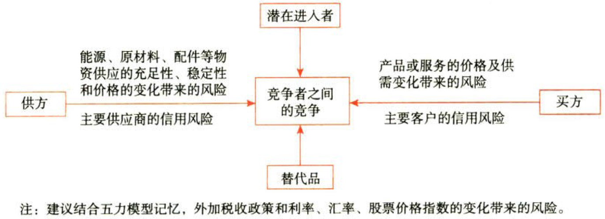

风险与风险管理

# 1. 风险与风险管理概述

## 1.1. 企业面对的风险种类:star: :star: :star: 

### 1.1.1. 外部风险.市场风险

市场风险可以分为利率风险、汇率风险、股票价格风险和商品价恪风险，这些市场因素可能对企业正常经营活动产生`直接`影响，也可能是通过竞争者、供应商或者消费者对企业正常经营活动产生`间接`影响。

也就是说，企业经营活动`能否盈利`是影响企业能否持续成长、永续经营的重要因素。能源、原材料、零配件等物资供应的充足性、稳定性和价格的变化影响企业的`成本`费用，而产品或服务的价格及供需变化会影响企业的营业`收入`，潜在进入者、竞争者、与替代品的竞争也会间接影响企业的收入，这些因素最终都会影响企业的利润。

依据《中央企业全面凤险管理指引）市场风险至少要考虑以下几个方面：{

①产品或服务的`价格`及供需变化带来的风险；

②能源、原材料、配件等物资`供应`的充足性、稳定性和价格的变化带来的风险；

③主要客户、主要供应商的`信用`风险；

④税收`政策`和利率、汇率、股票价格`指数`的变化带来的风险；

⑤潜在进入者、竞争者、与替代品的`竞争`带来的风险。

}

