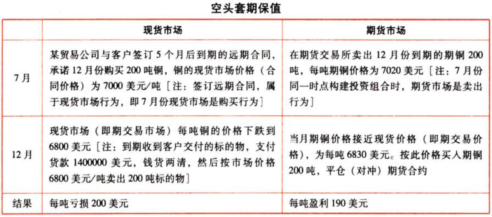
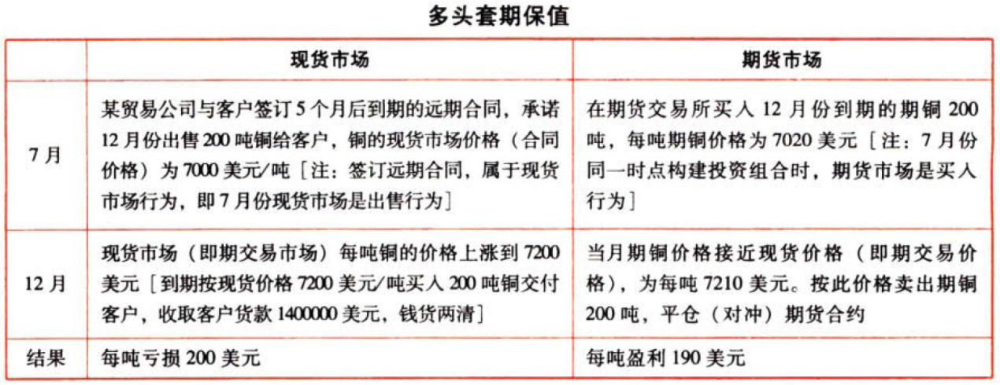

风险与风险管理

# 1. 风险管理体系

## 1.1. 风险理财措施

### 1.1.1. 风险理财.一般概念

风险理财是用`金融手段`管理风险。

风险理财是全面风险管理的重要`组成部分`。

### 1.1.2. 风险理财.特点

风险理财的手段既`不改变`风险事件发生的可能性，也`不改变`风险事件可能引起的直接损失程度。

风险理财需要判断风险的`定价`，因此量化的标准较高，更需要量化风险本身的价值。

风险理财的应用范围一般`不包括`声誉等难以衡量其价值的风险，也难以消除`战略失误`造成的损失。

风险理财手段`技术强`，许多风险理财工具本身有着比较`复杂`的风险特性，使用不当容易造成重大损失。

### 1.1.3. 风险理财.策略+方案

#### 1.1.3.1. 选择风险理财策略.原则+要求

##### 1.1.3.1.1. 与公司整体风险管理策略一致

选择风险理财的策略，要与公司`整体`风险管理策略一起考虑。应根据公司风险管理整体策略确定的风险`偏好`和`承受度`确定风险理财的`目标`，并`量化`风险的特性及其价值。

##### 1.1.3.1.2. 与公司所面对风险的性质相匹配

要采用与公司所面对风险的性质`相匹配`的风险理财手段。

##### 1.1.3.1.3. 选择风险理财工具的要求

企业在选择风险理财工具时，要考虑如下几点：`合规`的要求、`可操作性`、`法律`法规环境、企业的`熟悉`程度、风险理财工具的风险`特征`。不同的风险理财手段可能适用同一风险。

##### 1.1.3.1.4. 成本与收益的平衡

选择风险理财策略时，要考虑风险管理成本与收益的`平衡`原则。

#### 1.1.3.2. 对金融衍生产品的选择

在企业选择风险理财的策略与方案时，涉及对金融`衍生产品`的选择。

##### 1.1.3.2.5. 金融衍生产品.概念+类型

衍生产品是其价值决定于一种或多种基础资产或指数的金融`合约`，常用衍生产品包括远期合约、互换交易、期货、期权等。

###### 1.1.3.2.5.1. 远期合约

指交易双方约定在`未来`的某一确定时间，以`确定的价格`买卖一定数量的某种金融资产的合约。

类型：远期利率合约、远期外汇合约、远期股票合约。

特点：价格可以`预先确定`或在交割时确定。远期合约到期往往会促成标的资产的`交割`。合约条件是由买卖双方协商确定的，通过场外交易（OTC）达成。

###### 1.1.3.2.5.2. 互换交易

指对相同货币的债务和不同货币的债务通过金融中介进行`互换`的一种行为。

类型：利率互换、货币互换、商品互换、其他互换（股权互换、信用互换、期货互换、互换期权等）。

###### 1.1.3.2.5.3. 期货合约

指由期货交易所`统一制定`的、规定在`未来`某一特定的时间和地点交割一定数量和质量商品的`标准化合约`。

类型：外汇期货、利率期货、股指期货、商品期货。

特点：在期货交易中所买卖的标准化合约。期货交易中，期货合约往往会在到期日之前对冲`平仓`。期货价格是在期货交易所以`公开竞价`方式产生的。

###### 1.1.3.2.5.4. 期权合约

是一种`选择权`，期权合约的买方向卖方支付`权利金`后，就获得这种权利，即拥有在一定时间内以一定的价格（执行价格）出售或购买一定数量的`标的物`的权利。

类型：看涨期权、看跌期权、欧式期权、美式期权。

特点：期权的`买方`有执行期权的权利，无执行的义务；期权的`卖方`只有履行期权的义务，而无权利。

##### 1.1.3.2.6. 衍生产品.特点

优点：准确性、时效、使用方便、成本优势、灵活性、对于管理市场风险有`不可替代`的作用。

缺点：衍生产品的`杠杆作用`很大，因而风险很大，如用来投机可能会造成巨大损失。

##### 1.1.3.2.7. 运用衍生产品进行风险管理需满足的条件

①满足`合规`要求；

②与公司的业务和发展`战略`保持`一致`；

③建立完善的`内部控制`措施；

④采用能够准确反映风险状况的`风险计量方法`；

⑤完善的信息`沟通机制`；

⑥合格的`操作人员`。

### 1.1.4. 损失事件管理

损失事件管理是指对可能给企业造成重大损失的风险事件的`事前`、`事后`管理的方法。

#### 1.1.4.3. 损失融资

损失事件融资分为`预期`损失融资和`非预期`损失融资。

预期损失融资一般作为`运营资本`的一部分，而非预期损失融资则属于`风险资本`的范畴。

#### 1.1.4.4. 风险资本

风险资本是描述在一定的`概率`水平上，一定`时间`内（如一年），为了弥补企业的`非预期性`损失所需要的资本。风险资本是使一家公司破产的概率低于某一给定水平所需的资本，因此取决于公司的`风险偏好`。

例如，一家公司每年最低运营资本是5亿元，但是有5%的可能性需要7.5亿元才能维持运营，有1%的可能性需要10亿元才能维持运营。也就是说，如果该公司风险资本为2.5亿元，其生存概率为95%；如果该公司风险资本为5亿元，其生存概率为99%。

#### 1.1.4.5. 应急资本

应急资本是风险资本的表现形式之一。应急资本又称或有资本和承诺资本，是指当企业发生了特定事件陷入财务困境后，可以根据`事先的承诺合同`，以债务或优先股等方式从外部市场获得企业所需要的资本。

应急资本具有如下特点：{

应急资本的`提供方`并不承担特定事件发生的风险，而只是在风险事件发生并造成应急资本受让方损失后`提供`用于弥补损失、确保持续经营的`资本`。

应急资本与保险不同，应急资本`不涉及`风险的`转移`，是企业`风险补偿`策略的一种方式。

应急资本是一个在一定条件下的`融资选择权`，应急资本受让方可以不使用这个权利。

应急资本可以为应急资本受让方提供持续经营的`保证`。

}

#### 1.1.4.6. 保险

保险是风险`转移`的传统手段。可保风险是`纯粹风险`，机会风险不可保。

纯粹风险：只有损失，而无获利可能的风险。这种风险可能造成的结果只有两种：①没有损失；②造成损失。例如，自然灾害、人的生老病死等。与纯粹风险相对应的是机会风险（也称为投机风险）。

机会风险造成的结果有三种：①收益；②没有损失；③损失。例如购买股票。将风险划分为纯梓风险和机会风险是以风险造成的结果为依据对风险的一种分类。纯粹风险具有可保住，机会风险不具有可保性。保险公司承保纯粹风险，不承保机会风险。

#### 1.1.4.7. 专业自保

专业自保公司是那些由其母公司拥有的，主要业务对象即被保险人为其`母公司`的保险公司。专业自保属于`风险补偿`方式。

### 1.1.5. 期货、期权业务

#### 1.1.5.8. 套期保值与投机

以期货业务为例，该业务主要有两类交易：`套期保值`和`投机`。套期保值是指为了配合现货市场的买人（卖出）行为，`冲抵`现货市场价格波动的`风险`，而通过期货市场从事`反向交易`活动，即卖出（买入）相应的期货合约的行为，其目的是为了对冲价格波动的风险；投机是指单纯的买卖期货合约，其目的是为了获得期货合约价格波动的`投机差价`。套期保值的结果是降低了风险；而投机的结果是增加了风险。

#### 1.1.5.9. 期货套期保值

##### 1.1.5.9.8. 期货价格与现货价格

基于现货市场和期货市场两个不同类型的市场，在某个时点标的物的现货价格与期货价格往往会有差异，`“基差”`的概念用来表示标的物的`现货`价格与所用合约的`期货`价格`之差`。基盖在期货合约到期日为零，在此之前`可正可负`。一般而言，离到期日`越近`，基差就`越小`。

##### 1.1.5.9.9. 期货套期保值

期货的套期保值亦称为`期货对冲`，是指为配合现货市场上的交易，而在期贷市场上做与现货市场商品相同或相近但交易部位相反的买卖行为，以便将现货市场上价格波动的风险在期货市场上得到抵销。

期货的套期保值交易之所以有利于回避价格风险，其基本原理就在于某一特定商品的期货价格和现货价格受`相同的`经济因素影响和制约。

利用期货套期保值有两种方式：

①`空头`（卖出）期货套期保值（在构建套期保值时，在期货市场上`卖出`期货合约）：如果某公司要在未来某时间出售资产，则可以现在在期货市场卖出期货合约来对冲风险。如果到期日资产价格下降，现货市场出售资产亏了，但在期货合约到期日前买入期货合约进行对冲平仓而获利，盈亏相抵，损失减少。如果到期日资产价格上升，现货市场出售获利（相对于当初合约约定的价格），但在期货合约到期日前买人期货合约进行对冲平仓而亏损，盈亏相抵，收益减少。

②`多头`（买入）期货套期保值（在构建套期保值时，在期货市场上`买入`期货合约）：如果某公司要在未来某时间买入资产，则可以现在在期货市场买入期货合约来对冲风险。如果到期日资产价格上升，现货市场购买资产亏了，但在期货合约到期日前卖出期货合约进行对冲平仓而获利，盈亏相抵，损失减少。如果到期日资产价格下降，现货市场购买获利（相对于当初合约约定的价格），但在期货合约到期日前卖出期货合约进行对冲平仓而亏损，盈亏相抵，收益减少。

利用期货套期保值一般涉及两个时间的四个交易。空头套期保值和多头套期保值的举例如下表（以商品期货为例）：

#### 1.1.5.10. 期货投机

期货投机是指`基于`对市场价格走势的`预期`，为了`盈利`在期货市场上进行的`买卖`行为。

例如，目前期铜价格为7020美元／吨，某贸易公司判断5个月后锅的价格会大跌，因此该公司现在在期货市场卖出期铜200吨，假设5个月后，期铜的价格果真下跌到每吨6830美元，买入期铜200吨，平仓期货合约，盈利190美元/吨，共计盈利38000则美元。但如果5个月后期铜的价格上涨到每吨7200美元，买人期铜200吨，平仓期货合约，亏损180美元／吨，共计亏损36000美元。

#### 1.1.5.11. 期权套期保值

##### 1.1.5.11.10. 看涨期权

1月1日，标的物是铅，l份铅的看涨期权合约数量为10吨，期权执行价格为1850美元／吨。A买入1份铅的看涨期权，付出500美元；B卖出1份铅的看涨期权，收入500美元。

①2月1日，铅价上涨至1905美元／吨，期权价格上涨至550美元。则A售出权利——A可以按550美元的价格售出看涨期权，A获利50美元（550-500）。

②如果铅价下跌，即铅的市价低于敲定价格1850美方吨，A就会放弃这个权利，只损失500美元权利金，B则净赚500美元。

##### 1.1.5.11.11. 看跌期权

1月1日，标的物是铅，1份铅的看跌期权合约数量为10吨，期权的执行价格为1750美元／吨，A买人1份铅的看跌期权，付出500美元；B卖出1份铅的看跌期权，收入500美元。

①2月1日，铅价下跌至1695美元／吨，期权价格上涨至550美元。则A售出权利——A可以按550美元的价格售出看跌期权，A获利50美元（550-500）。

②如果铅价上涨，A就会放弃这个权利而损失500美元权利金，B则净赚500美元。

##### 1.1.5.11.12. 利用期权进行套期保值

期权作为对冲的工具可以起到`保险`的作用。

例如，某投资者现在持有甲上市公司股票10000股，持股成本为10美元／股，计划6个月后出售。为了降低该股票价格6个月后下跌带来的损失，现在在期权市场上以1000美元的价格购进1份以甲公司股票为标的物的6个月看跌期权，1份看跌期权的数量为10000股，每股执行价格为9.9美元。假设6个月后甲公司股票价格下跌到9.2美元／股，现货市场按此价格出售10000股，每股损失0.8美元，共计损失8000美元；6个月后期权市场上该股票的看跌期权价格为9.15美元／股，投资者行权，期权投资共计盈利6000美元［10000x(9.9-9.2)-1000］，弥补现货投资损失，套期保值的结果是现货市场出售股票仅损失了2000美元。

#### 1.1.5.12. 期权投机

期权也可以作为`投机`的工具，但风险更大。

例如，某贸易公司判断6个月后原油的价格会大涨，因此该公司现在在期权市场以2000美元的价格购进1份6个月到期的原油看涨期权合约，1份原油看涨期权合约的数量为1000桶，每桶执行价格为92美元。假设6个月后原油市场价格为97美元／桶，投资者行权，期权投资共计盈利3000美元[1000x(97-92)-2000］；但如果6个月后原油市场价格为89美元／桶，投资者不会行权，期权投资损失2000美元。
