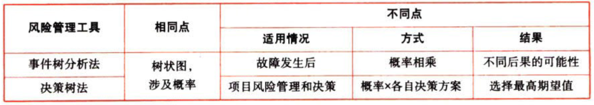

风险与风险管理

# 1. 风险管理技术与方法

## 1.1. 事件树法:star: :star: 

按故事发展的`时间顺序`由初始事件开始`推论`可能的`后果`，从而进行危险源`辨识`的方法。

适用范围：对故障`发生后`，在各种减轻事件严重性的影响下，对`多种可能后果`的定性和定量分析。

优点：{

①以清晰的`图形显示`了经过分析的初始事项之后的潜在情景，以及缓解系统或功能成败产生的影响。

②它能说明`时机`、`依赖性`，以及故障树模型中很繁琐的`多米诺效应`。

③它生动地体现事件的`顺序`，而使用故障树是不可能表现的。

}

局限性：{

①为了将ETA作为综合评估的组成部分，`一切`潜在的初始事项都要进行识别，这可能需要使用其他分析方法，但总是有可能`错过`一些重要的初始事项。

②事件树只分析个某个系统的成功及故障状况、很难将`延迟成功`或恢复事项纳入其中。

③任何路径都取决于路径上以前分支点处可能发生的事项。因此，要分析各可能路径上的`众多从属因素`。然而，人们可能会忽视某些从属因素，如常见组件、应用系统以及操作员等。如果不认真处理这些从属因素，就会导致风险评估`过于乐观`。

}

提示：事件树分析法是由起因推理结果的过程，是`正向`逻辑推理过程。而故障树分析则是由结果分析原因，最终得到影响事故发生的根本事件，是一个`逆向`逻辑推理过程。

## 1.2. 情景分析法:star: :star: 

又称`前景描述法`，是假定某种现象或某种趋势将`持续到未来`的前提下，对预测对象可能出现的情况或引起的后果做出`预测`的方法。通常用来对预测对象的未来发展做出种种`设想`或`预计`，是一种直观的预测方法。

适用范围：通过`模拟`不确定性`情景`，对企业面临的风险进行定性和定量分析。

优点：对未来变化不大的情况能够给出比较`精确`的模拟结果。

局限性：{

①在存在较大不确定性的情况下，有些情景可能`不够现实`。

②主要的难点涉及数据的`有效性`以及分析师和决策者开发现实情景的`能力`，这些难点对结果的分析具有修正作用。

③所用情景可能`缺乏`充分的`基础`，数据可能具有`随机性`，同时可能无法发现那些不切实际的结果。

}

## 1.3. 失效模式影响和危害度分析法:star: :star: 

引起系统整体故障、零部件所发生的故障和系统之间存在一定的因果关系。失效模式影响和危害度分析法（FMECA）正是从这种关系出发，通过对系统各部件的每一种可能潜在的故障模式进行逐一分析，找出所有潜在的`失效模式`，并分析其可能的`后果`，从而预先采取必要的措施以提高`系统可靠性`的一种活动。FMECA是“`事前`的预防措施”。

适用范围：对失效模式、影响及危害进行定性定量分析。

优点：{

①对不适当的设计，`实时`加以`改善`，节省无谓的损失。

②改进产品或系统的`质量`、`可靠性`与`安全性`。

}

局限性：{

①只能识别`单个`失效模式、无法同时识别多个失效模式。

②除非得到充分控制并集中充分精力，否则研究工作既`耗时`又`开支较大`。

}

## 1.4. 统计推论法:star: :star: 

前推：是从`历史`的经验和数据出发，`向前推测`未来事件可能发生的概率及其后果。

后推：是把`未知`的想象事件及后果和某一`已知`事件的`联系`，来推断该未知事件的风险。后推也就是将`未来`事件归算到有数据可查的、造成这一事件的一些`起始`事件上，在时问序列上表现为由前向后推算。

旁推：是利用`类似项目`的数据进行外推，用某一项目的历史记录对新的类似建设项目可能遇到的风险进行评估和分析。

适用范围：定性和定量分析。

优点：{

①在数据充足可靠的情况下`简单易行`。

②结果`准确率高`

}

局限性：{

①由于历史事件的前提和环境发生了`变化`，`不一定适用于`今天或未来。

②没有考虑事件的`因果关系`，使推论的结果可能产生较`大偏差`。

}
