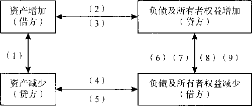
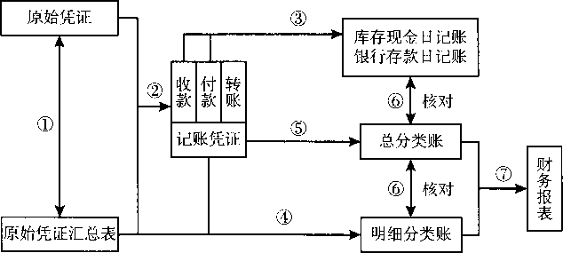
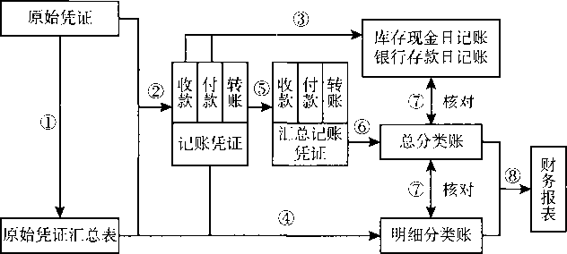
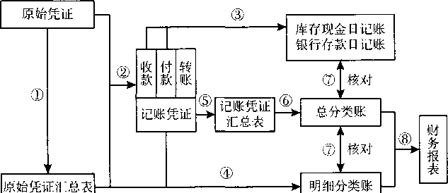
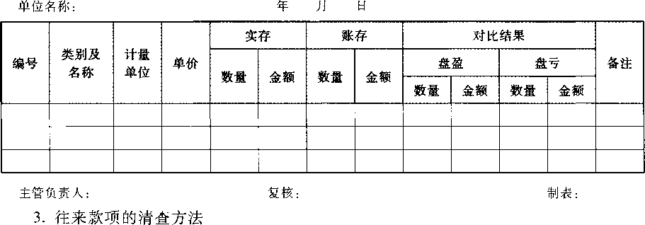

`2021`年度全国会计专业技术资格考试辅导教材

初级会计资格

初级会计实务

财政部会计资格评价中心编著

中国财经出版传媒集团

/经济科学出版社

图书在版编目（C1P）数据

初级会计实务/财政部会计资格评价中心编著.一北京:

经济科学出版社，2020.10

2021年度全国会计专业技术资格考试辅导教材

ISBN978-7-5218-1904-5

1.  ①初…n.①财…m.①会计实务-资格考试-自学参考资料JV.①F233

中国版本图书馆CIP数据核字（2020）第182392号

责任编辑：张若丹

责任校对：刘昕

责任印制：刘军王世伟

2021年度全国会计专业技术资格考试辅导教材  
初级会计资格  
初级会计实务

>   财政部会计资格评价中心编著

经济科学出版社出版、发行新华书店经销

社址：北京市海淀区阜成路甲28号邮编：100142  
总编部电话：010-88191217发行部电话：010-88191522  
网址:http://www.cfeac.com

天猫网店：经济科学出版社旗舰店  
网址：http://jjkxcbs.tmall.com  
河北眺山实业有限责任公司零五印刷分公司印装

787x109216开18印张410000字  
2020年11月第1版2020年11月第1次印刷  
印数：000001—500000册

>   ISBN978-7-5218-1904-5定价：42.00元

>   （图书出现印装问题，本社负责调换。电话：`010-88191510）`

为帮助考生全面理解和掌握全国会计专业技术资格考试领导小组办公室印发的2021年度初、高级会计专业技术资格考试大纲，更好地复习备考，财政部会计资格评价中心组织专家按照考试大纲的要求和最新颁布的法律法规，对《初级会计实务》《经济法基础》《高级会计实务》《高级会计实务案例》辅导教材进行了调整和修订，并对《全国会计专业技术资格考试参考法规汇编》作了相应调整。调整和修订的主要内容将在全国会计资格评价网(http：//kzp.mof.gov.cn/)上公布。调整和修订所参照的法律法规截止到2020年10月。

本考试用书作为指导考生复习备考之用，不作为全国会计专业技术资格考试指定用书。考生在学习过程中如遇到疑难问题，可登录全国会计资格评价网提出问题，并注意查阅有关问题解答。

书中如有疏漏和不当之处，敬请指正，并及时反馈我们。

财政部会计资格评价中心  
二。二。年十一月

I目录

[第一章会计概述	（1）](#bookmark8)

[第一节会计概念、职能和目标	（1）](#bookmark11)

[第二节会计基本假设、会计基础和会计信息质量要求	（2）](#bookmark21)

[第三节会计要素及其确认与计量	（5）](#bookmark41)

[第四节会计科目和借贷记账法	（12）](#bookmark97)

[第五节会计凭证、会计账簿与账务处理程序	（23）](#bookmark128)

[第六节财产清查	（42）](#bookmark223)

[第七节财务报告	（46）](#bookmark245)

[第二章资产	（48）](#bookmark250)

[第一节货币资金	（48）](#bookmark253)

[第二节应收及预付款项	（54）](#bookmark270)

[第三节交易性金融资产	（62）](#bookmark287)

[第四节存货	（68）](#bookmark307)

[第五节固定资产	（97）](#bookmark384)

[第六节无形资产和长期待摊费用	（115）](#bookmark453)

[第三章负债	（122）](#bookmark476)

[第一节短期借款	（122）](#bookmark479)

[第二节应付及预收款项	（123）](#bookmark486)

[第三节应付职工薪酬	（130）](#bookmark514)

[第四节应交税费	（138）](#bookmark544)

[第四章所有者权益	（156）](#bookmark608)

[第一节实收资本或股本	（156）](#bookmark611)

[第二节资本公积	（162）](#bookmark632)

[第三节留存收益	（165）](#bookmark647)

[第五章收入、费用和利润	（168）](#bookmark658)

[第一节收入	（168）](#bookmark661)

[第二节费用	二	（180）](#bookmark705)

[第三节利润	（188）](#bookmark720)

[第六章财务报表	（196）](#bookmark750)

[第一节资产负债表	（196）](#bookmark753)

[第二节利润表	（207）](#bookmark814)

[第三节所有者权益变动表	（214）](#bookmark840)

[第四节附注	（218）](#bookmark859)

[第七章管理会计基础	（220）](#bookmark875)

[第一节管理会计概述	（220）](#bookmark878)

[第二节产品成本核算的要求和一般程序	（228）](#bookmark932)

[第三节产品成本的归集和分配	（232）](#bookmark963)

[第四节产品成本计算	（253）](#bookmark1013)

[第八章政府会计基础	（258）](#bookmark1041)

[第一节政府会计概述	（258）](#bookmark1044)

[第二节政府单位会计核算	（264）](#bookmark1081)

第一章会计概述

第一节会计概念、职能和目标

—、会计概念

会计是以货币为主要计量单位，采用专门方法和程序，对企业和行政、事业单位的经济活动进行完整的、连续的、系统的核算和监督，以提供经济信息和反映受托责任履行情况为主要目的的经济管理活动。本章未特别说明时，均以企业会计为对象进行介绍。

二、会计职能

会计职能，是指会计在经济管理过程中所具有的功能。作为“过程的控制和观念总结”的会计，具有会计核算和会计监督两项基本职能，还具有预测经济前景、参与经济决策、评价经营业绩等拓展职能。

（一）基本职能

1.  核算职能

会计的核算职能，是指会计以货币为主要计量单位，对特定主体的经济活动进行确认、计量、记录和报告。会计核算贯穿于经济活动的全过程，是会计最基本的职能。会计核算的内容主要包括：（1）款项和有价证券的收付；（2）财物的收发、增减和使用；（3）债权、债务的发生和结算；（4）资本、基金的增减；（5）收入、支出、费用、成本的计算；（6）财务成果的计算和处理；（7）需要办理会计手续、进行会计核算的其他事项。

1.  监督职能

会计的监督职能，是指对特定主体经济活动和相关会计核算的真实性、合法性和合理性进行审查。真实性审查，是指检查各项会计核算是否根据实际发生的经济业务进行，是否如实反映经济业务或事项的真实状况。合法性审查，是指检查各项经济业务及其会计核算是否符合国家有关法律法规，遵守财经纪律，执行国家各项方针政策，以杜绝违法乱纪行为。合理性审查，是指检查各项财务收支是否符合客观经济规律及经营管理方面的要求，保证各项财务收支符合特定的财务收支计划，实现预算目标。

会计核算与会计监督是相辅相成、辩证统一的。会计核算是会计监督的基础，没有核算提供的各种信息，监督就失去了依据；会计监督又是会计核算质量的保障，只有核算没有监督，就难以保证核算提供信息的质量。

1.  拓展职能

2.  预测经济前景，是指根据财务报告等提供的信息，定量或者定性地判断和推测经济活动的发展变化规律，以指导和调节经济活动，提高经济效益。

3.  参与经济决策，是指根据财务报告等提供的信息，运用定量分析和定性分析方法，对备选方案进行经济可行性分析，为企业经营管理等提供与决策相关的信息。

4.  评价经营业绩，是指利用财务报告等提供的信息，采用适当的方法，对企业一定经营期间的资产运营、经济效益等经营成果，对照相应的评价标准，进行定量及定性对比分析，作出真实、客观、公正的综合评判。

三、会计目标

会计目标，是要求会计工作完成的任务或达到的标准，即向财务报告使用者提供企业财务状况、经营成果和现金流量等有关的会计信息，反映企业管理层受托责任履行情况，有助于财务报告使用者作出经济决策。

财务报告使用者主要包括投资者、债权人、政府及其有关部门和社会公众等。满足投资者的信息需要是企业财务报告编制的首要出发点，企业编制财务报告、提供会计信息必须与投资者的决策密切相关。因此，财务报告提供的信息应当如实反映企业所拥有或者控制的经济资源、对经济资源的要求权，以及经济资源及其要求权的变化情况；如实反映企业的各项收入、费用和利润的金额及其变动情况；如实反映企业各项经营活动、投资活动和筹资活动等所形成的现金流入和现金流出情况等，从而有助于现在的或者潜在的投资者正确、合理地评价企业的资产质量、偿债能力、盈利能力和营运效率等；有助于投资者根据相关会计信息作出理性的投资决策；有助于投资者评估与投资有关的未来现金流量的金额、时间和风险等。除投资者以外，企业财务报告的使用者还有债权人、政府及其有关部门、社会公众等。由于投资者是企业资本的主要提供者，如果财务报告能够满足这一群体的会计信息需求，通常情况下也可以满足其他使用者的大部分信息需求。

第二节会计基本假设、会计基础和  
会计信息质量要求

一、会计基本假设

会计基本假设是对会计核算时间和空间范围等所作的合理假定，是企业会计确认、计量、记录和报告的前提。会计基本假设包括会计主体、持续经营、会计分期和货币计量。

1.  会计主体

会计主体，是指会计工作服务的特定对象，是企业会计确认、计量和报告的空间范围。会计核算应当集中反映某一特定企业的经济活动，并将其与其他经济实体区别开来。在会计主体假设下，企业应当对其本身发生的交易或事项进行会计确认、计量和报告，

反映企业本身所从事的各项生产经营活动和其他相关活动。

（二） 持续经营

持续经营，是指在可以预见的将来，企业将会按当前的规模和状态继续经营下去，不会停业，也不会大规模削减业务。在持续经营假设下，会计确认、计量和报告应当以企业持续、正常的生产经营活动为前提。

（三） 会计分期

会计分期，是指将一个企业持续经营的生产经营活动划分为一个个连续的、长短相同的期间。会计分期的目的，是将持续经营的生产经营活动划分成连续、相等的期间，据以结算盈亏，按期编报财务报告，从而及时向财务报告使用者提供有关企业财务状况、经营成果和现金流量的信息。

（四） 货币计量

货币计量，是指会计主体在会计确认、计量和报告时以货币计量，来反映会计主体的生产经营活动。货币是商品的一般等价物，是衡量一般商品价值的共同尺度，具有价值尺度、流通手段、贮藏手段和支付手段等特点。选择货币作为共同尺度进行计量，具有全面、综合反映企业的生产经营情况的作用。

二、 会计基础

会计基础，是指会计确认、计量和报告的基础，具体包括权责发生制和收付实现制。

（—）权责发生制

权责发生制，是指以取得收取款项的权利或支付款项的义务为标志来确定本期收入和费用的会计核算基础。

在实务中，企业交易或者事项的发生时间与相关款项收付时间有时并不完全一致。例如，本期款项已经收到，但销售并未实现而不能确认为本期的收入；或者款项已经支付，但与本期的生产经营活动无关而不能确认为本期的费用。为了真实、公允地反映财务状况和经营成果，企业应当以权责发生制为基础进行会计确认、计量和报告。

根据权责发生制，凡是当期已经实现的收入和已经发生或者应当负担的费用，无论款项是否收付，都应当作为当期的收入和费用，计入利润表；凡是不属于当期的收入和费用，即使款项已在当期收付，也不应当作为当期的收入和费用。

（二）收付实现制

收付实现制，是指以现金的实际收付为标志来确定本期收入和支出的会计核算基础。在我国，政府会计由预算会计和财务会计构成。其中，预算会计釆用收付实现制，国务院另有规定的，依照其规定；财务会计采用权责发生制。

三、 会计信息质量要求

会计信息质量要求是对企业财务报告所提供会计信息质量的基本要求，是使财务报告所提供会计信息对投资者等信息使用者决策有用应具备的基本特征，主要包括可靠性、相关性、可理解性、可比性、实质重于形式、重要性、谨慎性、及时性等。

（一） 可靠性

可靠性要求企业应当以实际发生的交易或者事项为依据进行确认、计量和报告，如实反映符合确认和计量要求的会计要素及其他相关信息，保证会计信息真实可靠、内容完整。

可靠性是高质量会计信息的重要基础和关键所在。如果企业以虚假的交易或者事项进行确认、计量和报告，属于违法行为，不仅会严重损害会计信息质量，而且会误导投资者，干扰资本市场，导致会计秩序、财经秩序混乱。

（二） 相关性

相关性要求企业提供的会计信息应当与投资者等财务报告使用者的经济决策需要相关，有助于投资者等财务报告使用者对企业过去、现在或未来的情况作岀评价或者预测。

相关的会计信息应当能够有助于使用者评价企业过去的决策，证实或者修正过去的有关预测，因而具有反馈价值。相关的会计信息还应当具有预测价值，有助于使用者根据财务报告提供的会计信息预测企业未来的财务状况、经营成果和现金流量。

（三） 可理解性

可理解性要求企业提供的会计信息应当清晰明了，便于投资者等财务报告使用者理解和使用。

企业编制财务报告、提供会计信息的目的在于使用，要想让使用者有效使用会计信息，就应当让其了解会计信息的内涵，弄懂会计信息的内容，这就要求财务报告提供的会计信息应当清晰明了，易于理解。只有这样，才能提高会计信息的有用性，实现财务报告的目标，满足向投资者等财务报告使用者提供决策有用信息的要求。

（四） 可比性

可比性要求企业提供的会计信息应当相互可比，主要包括两层含义：

（1）
同一企业不同时期可比。即同一企业不同时期发生的相同或者相似的交易或者事项，应当采用一致的会计政策，不得随意变更。但是，如果按照规定或者在会计政策变更后能够提供更可靠、更相关的会计信息，企业可以变更会计政策。有关会计政策变更的情况，应当在附注中予以说明。

（2）
不同企业相同会计期间可比。即不同企业同一会计期间发生的相同或者相似的交易或者事项，应当采用规定的会计政策，确保会计信息口径一致、相互可比，以使不同企业按照一致的确认、计量和报告要求提供有关会计信息。

（五） 实质重于形式

实质重于形式要求企业应当按照交易或者事项的经济实质进行会计确认、计量和报告，不应仅以交易或者事项的法律形式为依据。

在实际工作中，交易或者事项的外在法律形式并不总能完全反映其实质内容。多数情况下，企业发生交易或者事项的经济实质和法律形式是一致的。但在有些情况下，会出现不一致。例如，企业租入的资产（短期租赁和低值资产租赁除外），虽然从法律形式来讲企业并不拥有其所有权，但是由于租赁合同规定的租赁期相当长，往往接近于该资产的使用寿命，租赁期结束时承租企业有优先购买该资产的选择权，在租赁期内承租企业有权支配资产并从中受益等，从其经济实质来看，企业能够控制租入资产所创造的未来经济利益，在会计确认、计量和报告时就应当将租入的资产视为企业的资产，在企业的资产负债表中进行反映。

（六） 重要性

重要性要求企业提供的会计信息应当反映与企业财务状况、经营成果和现金流量有关的所有重要交易或者事项。

在实务中，如果某项会计信息的省略或者错报会影响投资者等财务报告使用者据此作出决策，该信息就具有重要性。重要性的应用需要依赖职业判断，企业应当根据其所处环境和实际情况，从项目的性质和金额大小两方面加以判断。例如，企业发生的某些支出金额较小，从支出的受益期来看，可能需要在若干会计期间进行分摊，但根据重要性要求，可以一次性计入当期损益。

（七） 谨慎性

谨慎性要求企业对交易或者事项进行会计确认、计量和报告应当保持应有的谨慎，不应高估资产或者收益、低估负债或者费用。

在市场经济环境下，企业的生产经营活动面临着许多风险和不确定性，会计信息质量的谨慎性要求，需要企业在面临不确定性因素的情况下作出职业判断时，应当保持应有的谨慎，充分估计到各种风险和损失，既不高估资产或者收益，也不低估负债或者费用。例如，企业对售出商品很可能发生的保修义务确认预计负债、对很可能承担的环保责任确认预计负债等，就体现了会计信息质量的谨慎性要求。

（A）及时性

及时性要求企业对于已经发生的交易或者事项，应当及时进行确认、计量和报告，不得提前或延后。

在会计确认、计量和报告过程中贯彻及时性要求，一是要求及时收集会计信息，即在交易或者事项发生后，及时收集整理各种原始单据或者凭证；二是要求及时处理会计信息，即按照会计准则的规定，及时对交易或者事项进行确认和计量，并编制财务报告;三是要求及时传递会计信息，即按照国家规定的有关时限，及时地将编制的财务报告传递给财务报告使用者，便于其及时使用和决策。

第三节会计要素及其确认与计量

一、会计要素及其确认条件

会计要素是根据交易或者事项的经济特征所确定的财务会计对象及其基本分类。会计要素按照其性质分为资产、负债、所有者权益、收入、费用和利润，其中，资产、负债和所有者权益要素侧重于反映企业的财务状况，收入、费用和利润要素侧重于反映企业的经营成果。

1.  资产

2.  资产的定义

资产，是指企业过去的交易或者事项形成的，由企业拥有或者控制的，预期会给企业带来经济利益的资源。根据资产的定义，资产具有以下三方面特征：

1.  资产应为企业拥有或者控制的资源。资产作为一项资源，应当由企业拥有或者控制，具体是指企业享有某项资源的所有权，或者虽然不享有某项资源的所有权，但该资源能被企业所控制。

2.  资产预期会给企业带来经济利益。资产预期会给企业带来经济利益，是指资产直接或者间接导致现金和现金等价物流入企业的潜力。这种潜力可以来自企业日常的生产经营活动，也可以是非日常生产经营活动；带来的经济利益可以是现金或者现金等价物，或者是可以转化为现金或者现金等价物的形式，或者是可以减少现金或者现金等价物流出的形式。

3.  资产是由企业过去的交易或者事项形成的。资产应当由企业过去的交易或者事项形成，过去的交易或者事项包括购买、生产、建造行为等。只有过去的交易或者事项才能产生资产，企业预期在未来发生的交易或者事项不形成资产。例如，企业有购买某项商品的意愿或计划，但是购买行为尚未发生，就不符合资产的定义，不能因此而确认存货资产。

4.  资产的确认条件

将一项资源确认为资产，需要符合资产的定义，还应同时满足以下两个条件：

1.  与该资源有关的经济利益很可能流入企业。从资产的定义可以看出，能为企业带来经济利益是资产的一个本质特征，但在现实生活中，由于经济环境瞬息万变，与资源有关的经济利益能否流入企业或者能够流入多少实际上带有不确定性。因此，资产的确认还应与经济利益流入企业的不确定性程度的判断结合起来。

2.  该资源的成本或者价值能够可靠地计量。只有当有关资源的成本或者价值能够可靠地计量时，资产才能予以确认。在实务中，企业取得的许多资产都需要付岀成本。例如，企业购买或者生产的商品、企业购置的厂房或者设备等，对于这些资产，只有实际发生的成本或者生产成本能够可靠计量，才符合了资产确认的可计量性条件。

3.  资产的分类和内容

企业资产分为流动资产和非流动资产两大类。其中，流动资产包括货币资金、交易性金融资产、衍生金融资产、应收票据、应收账款、应收款项融资、预付款项、其他应收款、存货、合同资产、持有待售资产、一年内到期的非流动资产、其他流动资产；非流动资产包括债权投资、其他债权投资、长期应收款、长期股权投资、其他权益工具投资、其他非流动金融资产、投资性房地产、固定资产、在建工程、生产性生物资产、油气资产、使用权资产、无形资产、开发支岀、商誉、长期待摊费用、递延所得税资产、其他非流动资产。

1.  负债

2.  负债的定义

负债，是指企业过去的交易或者事项形成的，预期会导致经济利益流出企业的现时义务。根据负债的定义，负债具有以下三方面特征：

1.  负债是企业承担的现时义务。负债必须是企业承担的现时义务，这里的现时义务是指企业在现行条件下已承担的义务。未来发生的交易或者事项形成的义务，不属于现时义务，不应当确认为负债。

2.  负债预期会导致经济利益流出企业。预期会导致经济利益流出企业是负债的一个本质特征，只有在履行义务时会导致经济利益流出企业的，才符合负债的定义。在履行现时义务清偿负债时，导致经济利益流出企业的形式多种多样，例如，用现金偿还或以实物资产形式偿还；以提供劳务形式偿还；部分转移资产、部分提供劳务形式偿还；将负债转为资本等。

3.  负债是由企业过去的交易或者事项形成的。负债应当由企业过去的交易或者事项所形成。换句话说，只有过去的交易或者事项才形成负债，企业将在未来发生的承诺、签订的合同等交易或者事项，不形成负债。

4.  负债的确认条件

将一项现时义务确认为负债，需要符合负债的定义，还需要同时满足以下两个条件：

1.  与该义务有关的经济利益很可能流出企业。从负债的定义可以看出，预期会导致经济利益流出企业是负债的一个本质特征。在实务中，企业履行义务所需流出的经济利益带有不确定性，尤其是与推定义务相关的经济利益通常需要依赖大量的估计。因此，负债的确认应当与经济利益流出企业的不确定性程度的判断结合起来。

2.  未来流出的经济利益的金额能够可靠地计量。负债的确认在考虑经济利益流岀企业的同时，对于未来流出的经济利益的金额应当能够可靠计量。

3.  负债的分类和内容

企业负债分为流动负债和非流动负债两大类。其中，流动负债包括短期借款、交易性金融负债、衍生金融负债、应付票据、应付账款、预收款项、合同负债、应付职工薪酬、应交税费、其他应付款、持有待售负债、一年内到期的非流动负债、其他流动负债；非流动负债包括长期借款、应付债券、租赁负债、长期应付款、预计负债、递延收益、递延所得税负债、其他非流动负债。

1.  所有者权益

2.  所有者权益的定义

所有者权益，是指企业资产扣除负债后，由所有者享有的剩余权益。公司的所有者权益又称为股东权益。所有者权益是所有者对企业资产的剩余索取权，它是企业的资产扣除债权人权益后应由所有者享有的部分，既可反映所有者投入资本的保值增值情况，又体现了保护债权人权益的理念。

所有者权益的来源包括所有者投入的资本、其他综合收益、留存收益等，通常由股本(或实收资本)、资本公积(含股本溢价或资本溢价、其他资本公积)、其他综合收益、盈余公积和未分配利润等构成。

所有者投入的资本，是指所有者投入企业的资本部分，它既包括构成企业注册资本或者股本的金额，也包括投入资本超过注册资本或股本部分的金额，即资本溢价或股本溢价，这部分投入资本作为资本公积(资本溢价)反映。

其他综合收益，是指企业根据会计准则规定未在当期损益中确认的各项利得和损失。

留存收益，是指企业从历年实现的利润中提取或形成的留存于企业的内部积累，包括盈余公积和未分配利润。

1.  所有者权益的确认条件

所有者权益体现的是所有者在企业中的剩余权益，因此，所有者权益的确认和计量主要依赖于资产和负债的确认和计量。例如，企业接受投资者投入的资产，在该资产符合资产确认条件时，就相应地符合所有者权益的确认条件；当该资产的价值能够可靠计量时，所有者权益的金额也就可以确定。

（四） 收入

1.  收入的定义

收入，是指企业在日常活动中形成的、会导致所有者权益增加的、与所有者投入资本无关的经济利益的总流入。根据收入的定义，收入具有三方面特征：

（1）
收入是企业在日常活动中形成的。日常活动，是指企业为完成其经营目标所从事的经常性活动，以及与之相关的活动。例如，工业企业制造并销售产品，就属于企业的日常活动。日常活动产生的收入通常包括主营业务收入和其他业务收入，即营业收入。

（2）
收入是与所有者投入资本无关的经济利益的总流入。收入应当会导致经济利益的流入，从而导致资产的增加。例如，企业销售商品，应当收到现金或者有权在未来收到现金，才表明该交易符合收入的定义。但是在实务中，经济利益的流入有时是所有者投入资本的增加导致的，所有者投入资本的增加不应当确认为收入，应当将其直接确认为所有者权益。

（3）
收入会导致所有者权益的增加。与收入相关的经济利益的流入应当会导致所有者权益的增加，不会导致所有者权益增加的经济利益的流入不符合收入的定义，不应确认为收入。

1.  收入的确认条件

当企业与客户之间的合同同时满足下列条件时，企业应当在客户取得相关商品控制权时确认收入：（1）合同各方已批准该合同并承诺将履行各自义务；（2）该合同明确了合同各方与所转让商品或提供劳务相关的权利和义务；（3）该合同有明确的与所转让商品或提供劳务相关的支付条款；（4）该合同具有商业实质，即履行该合同将改变企业未来现金流量的风险、时间分布或金额；（5）企业因向客户转让商品或提供劳务而有权取得的对价很可能收回。

（五） 费用

1.  费用的定义

费用，是指企业在日常活动中发生的、会导致所有者权益减少的、与向所有者分配利润无关的经济利益的总流岀。根据费用的定义，费用具有三方面特征：

（1）费用是企业在日常活动中形成的。费用必须是企业在日常活动中形成的，这些日常活动的界定与收入定义中涉及的日常活动的界定相一致。日常活动产生的费用通常包括营业成本（主营业务成本和其他业务成本）、税金及附加、销售费用、管理费用、财务费用等。将费用界定为日常活动形成的，目的是为了将其与损失相区分，企业非日

常活动形成的经济利益的流出不能确认为费用，而应当计入损失。

（2）
费用是与向所有者分配利润无关的经济利益的总流出。费用的发生应当会导致经济利益的流出，从而导致资产的减少或者负债的增加，其表现形式包括现金或者现金等价物的流出或者存货、固定资产和无形资产等的流出或者消耗等。企业向所有者分配利润也会导致经济利益的流出，而该经济利益的流出属于所有者权益的抵减项目，不应确认为费用，应当将其排除在费用的定义之外。

（3）
费用会导致所有者权益的减少。与费用相关的经济利益的流出应当会导致所有者权益的减少，不会导致所有者权益减少的经济利益的流出不符合费用的定义，不应确认为费用。

1.  费用的确认条件

费用的确认除了应当符合其定义外，还至少应当符合以下条件：（1）与费用相关的经济利益应当很可能流出企业；（2）经济利益流出企业的结果会导致资产的减少或者负债的增加；（3）经济利益的流出额能够可靠计量。

（六）利润

1.  利润的定义

利润，是指企业在一定会计期间的经营成果。通常情况下，如果企业实现了利润，表明企业的所有者权益增加；反之，如果企业发生亏损（即利润为负数），表明企业的所有者权益减少。

利润包括收入减去费用后的净额、直接计入当期利润的利得和损失等。其中，收入减去费用后的净额反映的是企业日常活动的业绩。直接计入当期利润的利得和损失，是指应当计入当期损益、会导致所有者权益发生增减变动的、与所有者投入资本或者向所有者分配利润无关的利得或损失。其中，利得，是指由企业非日常活动所形成的、会导致所有者权益增加的、与所有者投入资本无关的经济利益的流入；损失，是指由企业非日常活动所发生的、会导致所有者权益减少的、与向所有者分配利润无关的经济利益的流出。

1.  利润的确认条件

利润反映的是收入减去费用、利得减去损失后净额的概念。因此，利润的确认主要依赖于收入和费用，以及利得和损失的确认，其金额的确定也主要取决于收入、费用、利得和损失金额的计量。

二、会计要素计量属性及其应用原则

会计计量是为了将符合确认条件的会计要素登记入账并列报于财务报表而确定其金额的过程。会计计量属性主要包括历史成本、重置成本、可变现净值、现值和公允价值等。

（一）历史成本

历史成本又称实际成本，是指取得或制造某项财产物资时所实际支付的现金或者现金等价物。采用历史成本计量时，资产按照其购置时支付的现金或现金等价物的金额,或者按照购置时所付出对价的公允价值计量。负债按照其因承担现时义务而实际收到的款项或者资产的金额，或者承担现时义务的合同金额，或者按照日常活动中为偿还负债

预期需要支付的现金或者现金等价物的金额计量。

（二） 重置成本

重置成本又称现行成本，是指按照当前市场条件，重新取得同样一项资产所需支付的现金或现金等价物金额。采用重置成本计量时，资产按照现在购买相同或者相似资产所需支付的现金或者现金等价物的金额计量。负债按照现在偿付该项债务所需支付的现金或者现金等价物的金额计量。

（三） 可变现净值

可变现净值，是指在生产经营过程中，以预计售价减去进一步加工成本和销售所必需的预计税金、费用后的净值。采用可变现净值计量时，资产按照其正常对外销售所能收到现金或者现金等价物的金额，扣减该资产至完工时估计将要发生的成本、估计的销售费用以及相关税费后的金额计量。

（四） 现值

现值，是指对未来现金流量以恰当的折现率进行折现后的价值，是考虑货币时间价值因素等的一种计量属性。采用现值计量时，资产按照预计从其持续使用和最终处置中所产生的未来净现金流入量的折现金额计量。负债按照预计期限内需要偿还的未来净现金流出量的折现金额计量。

（五） 公允价值

公允价值，是指市场参与者在计量日发生的有序交易中，出售一项资产所能收到或者转移一项负债所需支付的价格。

三、会计等式

会计等式，又称会计恒等式、会计方程式或会计平衡公式，是表明会计要素之间基本关系的等式。

（一）会计等式的表现形式

企业要进行经济活动，必须拥有一定数量和质量的能给企业带来经济利益的经济资源，即资产。企业的资产最初来源于两个方面：一是由企业所有者投入；二是由企业向债权人借入。所有者和债权人将其拥有的资产提供给企业使用，就相应地对企业的资产享有一种要求权。前者称为所有者权益，后者则称为债权人权益，即负债。

资产表明企业拥有什么经济资源和拥有多少经济资源，负债和所有者权益表明经济资源的来源渠道，即谁提供了这些经济资源。因此，资产和负债、所有者权益三者之间在数量上存在恒等关系，用公式表示为：

资产二负债+所有者权益

这一等式反映了企业在某一特定时点资产、负债和所有者权益三者之间的平衡关系,因此，该等式被称为财务状况等式、基本会计等式或静态会计等式，它是复式记账法的理论基础，也是编制资产负债表的依据。

企业进行生产经营活动的目的是为了获取收入，实现盈利。企业在取得收入的同时,必然要发生相应的费用。通过收入与费用的比较，才能确定一定期间的盈利水平，确定实现的利润总额。在不考虑利得和损失的情况下，它们之间的关系用公式表示为：

收入-费用二利润

这一等式反映了企业利润的实现过程，称为经营成果等式或动态会计等式。收入、费用和利润之间的上述关系，是编制利润表的依据。

（二）交易或事项对会计等式的影响

企业发生的交易或事项按其对财务状况等式的影响不同，可以分为以下9种基本类型：（1）一项资产增加、另一项资产等额减少的经济业务；（2）一项资产增加、一项负债等额增加的经济业务；（3）一项资产增加、一项所有者权益等额增加的经济业务;

（4）
一项资产减少、一项负债等额减少的经济业务；（5）一项资产减少、一项所有者权益等额减少的经济业务；（6）一项负债增加、另一项负债等额减少的经济业务；（7）一项负债增加、一项所有者权益等额减少的经济业务；（8）一项所有者权益增加、一项负债等额减少的经济业务；（9）一项所有者权益增加、另一项所有者权益等额减少的经济业务。

以财务状况等式为例，上述9类基本经济业务的发生均不影响会计等式的平衡关系，具体分为三种情形：基本经济业务（1）、（6）、（7）、（8）、（9）使会计等式左右两边的金额保持不变；基本经济业务（2）、（3）使会计等式左右两边的金额等额增加；基本经济业务（4）、（5）使会计等式左右两边的金额等额减少。经济业务对会计等式的影响，如［例1所示。

【例`1-1`】2x19年1月，甲公司发生的经济业务资料如下：

1.  从银行提取现金2万元。

该项经济业务发生后，甲公司的一项资产（库存现金）增加2万元，另一项资产（银行存款）同时减少2万元，即会计等式左边资产要素内部的金额有增有减，增减金额相等，其平衡关系保持不变。属于上述第（1）种经济业务类型。

1.  从银行借入期限为3个月的短期借款8000万元，存入银行。

该项经济业务发生后，甲公司的一项资产（银行存款）增加8000万元，一项负债（短期借款）同时增加8000万元，即会计等式左右两边金额等额增加，其平衡关系保持不变。属于上述第（2）种经济业务类型。

1.  收到投资者投入的机器一台，价值5000万元。

该项经济业务发生后，甲公司的一项资产（固定资产）增加5000万元，一项所有者权益（实收资本）同时增加5000万元，即会计等式左右两边金额等额增加，其平衡关系保持不变。属于上述第（3）种经济业务类型。

1.  以银行存款2000万元偿还前欠货款。

该项经济业务发生后，甲公司的一项资产（银行存款）减少2000万元，一项负债（应付账款）同时减少2000万元，即会计等式左右两边金额等额减少，其平衡关系保持不变。属于上述第（4）种经济业务类型。

1.  股东大会决定减少注册资本3000万元，以银行存款向投资者退回其投入的资本。

该项经济业务发生后，甲公司的一项资产（银行存款）减少3000万元，一项所有者权益（实收资本）同时减少3000万元，即会计等式左右两边金额等额减少，其平衡关系保持不变。属于上述第（5）种经济业务类型。

1.  已到期的应付票据2500万元因无力支付转为应付账款。

该项经济业务发生后，甲公司的一项负债（应付账款）增加2500万元，另一项负债（应付票据）同时减少2500万元，即会计等式右边负债要素内部的金额有增有减，增减金额相等，其平衡关系保持不变。属于上述第（6）种经济业务类型。

1.  宣布向投资者分配利润1000万元。

该项经济业务发生后，甲公司的一项负债（应付利润）增加1000万元，一项所有者权益（未分配利润）同时减少1000万元，即会计等式右边一项负债增加而一项所有者权益等额减少，其平衡关系保持不变。属于上述第（7）种经济业务类型。

1.  经批准将已发行的公司债券5000万元转为实收资本。

该项经济业务发生后，甲公司的一项负债（应付债券）减少5000万元，一项所有者权益（实收资本）同时增加5000万元，即会计等式右边一项所有者权益增加而一项负债等额减少，其平衡关系保持不变。属于上述第（8）种经济业务类型。

1.  经批准将资本公积3000万元转为实收资本。

该项经济业务发生后，甲公司的一项所有者权益（实收资本）增加3000万元，另一项所有者权益（资本公积）同时减少3000万元，即会计等式右边所有者权益要素内部的金额有增有减，增减金额相等，其平衡关系保持不变。属于上述第（9）种经济业务类型。

由此可见，每一项经济业务的发生，都必然会引起会计等式的一边或两边有关项目相互联系地发生等额变化，即当涉及会计等式的一边时，有关项目的金额发生相反方向的等额变动；当涉及会计等式的两边时，有关项目的金额发生相同方向的等额变动，但始终不会影响会计等式的平衡关系。

第四节会计科目和借贷记账法

一、会计科目和账户

（一）会计科目

会计科目，简称科目，是对会计要素具体内容进行分类核算的项目，是进行会计核算和提供会计信息的基本单元。会计科目可以按其反映的经济内容（即所属会计要素）、所提供信息的详细程度及其统驭关系分类。

1.  按反映的经济内容分类

会计科目按其反映的经济内容不同，可分为资产类科目、负债类科目、共同类科目、所有者权益类科目、成本类科目和损益类科目。每一类会计科目可按一定标准再分为若干具体科目。

1.  资产类科目，是对资产要素的具体内容进行分类核算的项目，按资产的流动性分为反映流动资产的科目和反映非流动资产的科目。反映流动资产的科目主要有“库存现金”“银行存款”“应收账款”“原材料”“库存商品”等科目；反映非流动资产的科目主要有“长期股权投资”“长期应收款”“固定资产”“在建工程”“无形资产”等科目。

2.  负债类科目，是对负债要素的具体内容进行分类核算的项目，按负债的偿还期限长短分为反映流动负债的科目和反映非流动负债的科目。反映流动负债的科目主要有“短期借款”“应付账款”“应付职工薪酬”“应交税费”等科目；反映非流动负债的科目主要有“长期借款”“应付债券”“长期应付款”等科目。

3.  共同类科目，是既有资产性质又有负债性质的科目，主要有“清算资金往来”“货币兑换”“套期工具”“被套期项目”等科目。

4.  所有者权益类科目，是对所有者权益要素的具体内容进行分类核算的项目，主要有“实收资本(或股本)”“资本公积”“其他综合收益”“盈余公积”“本年利润”“利润分配”“库存股”等科目。

5.  成本类科目，是对可归属于产品生产成本、劳务成本等的具体内容进行分类核算的项目，主要有“生产成本”“制造费用”“合同取得成本”“合同履约成本”“研发支出”等科目。

6.  损益类科目，是对收入、费用等要素的具体内容进行分类核算的项目。其中，反映收入的科目主要有“主营业务收入”“其他业务收入”等科目；反映费用的科目主要有“主营业务成本”“其他业务成本”“销售费用”“管理费用”“财务费用”等科目。

7.  按提供信息的详细程度及其统驭关系分类

    会计科目按其提供信息的详细程度及其统驭关系，可分为总分类科目和明细分类科目。总分类科目，乂称总账科目或一级科目，是对会计要素的具体内容进行总括分类，提供总括信息的会计科目。

    明细分类科目，又称明细科目，是对总分类科目作进一步分类，提供更为详细和具体会计信息的科目。如果某一总分类科目所辖的明细分类科目较多，可在总分类科目下设置二级明细科目，在二级明细科目下设置三级明细科目，以此类推。二级明细科目是对总分类科目进一步分类的科目，三级明细科目是对二级明细科目进一步分类的科目。

8.  账户

    账户是根据会计科目设置的，具有一定格式和结构，用于分类核算会计要素增减变动情况及其结果的载体。

    会计科目仅仅是对会计要素的具体内容进行分类核算的项目，它不能反映交易或事项的发生所引起的会计要素各项目的增减变动情况和结果。各项核算指标的具体数据资料,只有通过账户记录才能取得。因此，在设置会计科目后，还必须根据会计科目开设相应的账户，以便对交易或事项进行系统、连续的记录，向有关各方提供有用的会计信息。

    同会计科目分类相对应，账户可以根据其核算的经济内容、提供信息的详细程度及其统驭关系进行分类。按核算的经济内容，账户分为资产类账户、负债类账户、共同类账户、所有者权益类账户、成本类账户和损益类账户；根据提供信息的详细程度及其统

驭关系，账户分为总分类账户和明细分类账户。

>   账户是用来连续、系统、完整地记录企业经济活动的，因此必须具有一定的结构。由于经济业务发生所引起的各项会计要素的变动，从数量上看不外乎为增加和减少两种情况。因此，账户的结构相应地分为两个基本部分，即左右两方，分别用来记录会计要素的增加和减少。一方登记增加，另一方登记减少。至于账户左右两方的名称，用哪一方登记增加、哪一方登记减少，要取决于所采用的记账方法和各该账户所记录的经济内容。

>   账户的期初余额、期末余额、本期增加发生额、本期减少发生额统称为账户的四个金额要素。四个金额要素之间的关系如下列公式所示：

>   期末余额二期初余额+本期增加发生额-本期减少发生额

>   二、借贷记账法

>   借贷记账法，是以“借”和“贷”作为记账符号的一种复式记账法。复式记账法，是指对于每一笔经济业务，都必须用相等的金额在两个或两个以上相互联系的账户中进行登记，全面、系统地反映会计要素增减变化的一种记账方法。复式记账法分为借贷记账法、增减记账法、收付记账法等。我国会计准则规定，企业、行政单位和事业单位会计核算采用借贷记账法记账。

>   （一）借贷记账法的账户结构

>   借贷记账法下，账户的左方称为借方，右方称为贷方。所有账户的借方和贷方按相反方向记录增加数和减少数，即一方登记增加额，另一方就登记减少额。至于“借”表示增加（或减少），还是“贷”表示增加（或减少），则取决于账户的性质与所记录经济内容的性质。

>   通常情况下，资产类、成本类和费用类账户的增加记“借”方，减少记“贷”方;负债类、所有者权益类和收入类账户的增加记“贷”方，减少记“借”方。

>   1.资产类和成本类账户的结构

>   在借贷记账法下，资产类、成本类账户的借方登记增加额；贷方登记减少额；期末余额一般在借方。其余额计算公式为：

>   期末借方余额二期初借方余额+本期借方发生额-本期贷方发生额

>   资产类和成本类账户结构用T型账户表示，如图1-1所示。

|        | 借方                | 资产类和成本类账户 | 贷方               |         |
|--------|---------------------|--------------------|--------------------|---------|
|        | 期初余额 本期增加额 | XXX XXX XXX        | 本期减少额         | XXX XXX |
|        | 本期借方发生额合计  | XXX                | 本期贷方发生额合计 | XXX     |
| `14` | 期末余额            | XXX                |                    |         |

>   2.负债类和所有者权益类账户的结构

>   在借贷记账法下，负债类、所有者权益类账户的借方登记减少额；贷方登记增加额;期末余额一般在贷方。其余额计算公式为：

>   期末贷方余额二期初贷方余额+本期贷方发生额-本期借方发生额

>   负债类和所有者权益类账户结构用T型账户表示，如图1-2所示。

| 借方               | 负债类和所有者权益类账户     | 贷方 |
|--------------------|------------------------------|------|
|                    | 期初余额                     | XXX  |
| 本期减少额         | XXX本期增加额                | XXX  |
|                    | XXX                          | XXX  |
| 本期借方发生额合计 | XXX本期贷方发生额合计        | XXX  |
|                    | 期末余额                     | XXX  |
| 图`1-2`          | 负债类和所有者权益类账户结构 |      |

1.  损益类账户的结构

    损益类账户主要包括收入类账户和费用类账户。

    在借贷记账法下，收入类账户的借方登记减少额；贷方登记增加额。本期收入净额在期末转入“本年利润”账户，用以计算当期损益，结转后无余额。收入类账户结构用T型账户表示，如图1-3所示。

| 借方                   | 收入类账户              | 贷方       |         |
|------------------------|-------------------------|------------|---------|
| 本期减少额 本期转出额  | XXX XXX                 | 本期增加额 | XXX XXX |
| 本期借方发生额合计 XXX | 本期贷方发生额合计      | XXX        |         |
|                        | 图`1-3`收入类账户结构 |            |         |

>   在借贷记账法下，费用类账户的借方登记增加额；贷方登记减少额。本期费用净额在期末转入“本年利润”账户，用以计算当期损益，结转后无余额。费用类账户结构用T型账户表示，如图1-4所示。

| 借方               | 费用类账户 | 贷方                  |         |
|--------------------|------------|-----------------------|---------|
| 本期增加额         | XXX XXX    | 本期减少额 本期转岀额 | XXX XXX |
| 本期借方发生额合计 | XXX        | 本期贷方发生额合计    | XXX     |

>   图`1-4`费用类账户结构

>   （二）借贷记账法的记账规则

>   记账规则，是指采用某种记账方法登记具体经济业务时应当遵循的规则。如果运用，，借”，，贷”符号表示`R`例1一1』中9种基本类型经济业务所涉及的增减变动情况，可以发现借贷记账法的记账规则为“有借必有贷，借贷必相等”。即：任何经济业务的发生总会涉及两个或两个以上的相关账户，一方（或几方）记入借方，另一方（或几方）必须记入贷方，记入借方的金额等于记入贷方的金额。如果涉及多个账户，记入借方账户金额的合计数等于记入贷方账户金额的合计数。

>   上述9种基本经济业务的资金运动与记账规则的对应关系，如图1-5所示。

图`1-5`资金运动与记账规则的对应关系

>   借贷记账法记账规则的具体运用，如［例1-2】至`R`例1-5』所示。

>   【例`1-2`】甲公司购入原材料一批，价款1000元，用银行存款支付，假定不考虑增值税因素。

>   该项经济业务发生后，甲公司原材料增加1000元，银行存款同时减少1000元，它涉及“原材料”和“银行存款”这两个资产类账户。资产的增加用“借”表示，减少用“贷”表示，因此应在“原材料”账户借方记入1000元，在“银行存款”账户贷方记入1000元。该项经济业务在T型账户中的登记，如图1-6所示。

>   借方 银行存款 贷方 借方 原材料 贷方

>   期初余额：30000 期初余额：30000

>   （1） 1000V A（1）1000

图`1-6`以银行存款购入原材料

>   注：`T`型账户中业务序号来自次页会计分录，下同。

>   【例`1-3］`甲公司已到期的应付票据20000元因无力支付转为应付账款。

>   该项经济业务发生后，甲公司应付账款增加20000元，应付票据同时减少20000元，它涉及“应付账款”和“应付票据”这两个负债类账户。负债的增加用“贷”表示，减少用“借”表示，因此应在“应付票据”账户借方记入20000元，在“应付账款”账户贷方记入20000元。该项经济业务在T型账户中的登记，如图1-7所示。  
>   

图`1-7`已到期的应付票据转为应付账款

【例`1-4`】甲公司收到投资者投入资本50000元，款项存入银行。

该项经济业务发生后，甲公司银行存款增加50000元，所有者对甲公司的投资同时增加50000元，它涉及“银行存款”这个资产类账户和“实收资本”这个所有者权益类账户。资产的增加用“借”表示，所有者权益的增加用“贷”表示，因此应在“银行存款”账户借方记入50000元，在“实收资本”账户贷方记入50000元。该项经济业务在T型账户中的登记，如图1-8所示。

1.  50000V A(3)50000

图`1-8`收到投资者投入的资本金

【例`1-5`】甲公司以银行存款30000元，偿还到期的长期借款。

该项经济业务发生后，甲公司的银行存款减少30000元，长期借款同时减少30000元，它涉及“银行存款”这个资产类账户和“长期借款”这个负债类账户。资产的减少用“贷”表示，负债的减少用“借”表示，因此应在“长期借款”账户的借方记入30000元，在“银行存款”账户的贷方记入30000元。该项经济业务在T型账户中的登记，如图1-9所示。

借方 银行存款 贷方 借方 长期借款 贷方

期初余额：30000 期初余额：30000

1.  30000\< \>(4)30000

图`1-9`以银行存款偿还到期的长期借款

1.  借贷记账法下的账户对应关系与会计分录

账户对应关系，是指采用借贷记账法对每笔交易或事项进行记录时，相关账户之间形成的应借、应贷的相互关系。存在对应关系的账户称为对应账户。

会计分录，简称分录，是对每项经济业务列示出应借、应贷的账户名称(科目)及其金额的一种记录。会计分录由应借应贷方向、相互对应的科目及其金额三个要素构成。在我国，会计分录记载于记账凭证中。［例1-2』至［例1-5】所列示四项经济业务的会计分录分别如下：

| (1) | 借：原材料   | 1000  |
|-----|--------------|-------|
|     | 贷：银行存款 | 1000  |
| (2) | 借：应付票据 | 20000 |
|     | 贷：应付账款 | 20000 |
| (3) | 借：银行存款 | 50000 |
|     | 贷：实收资本 | 50000 |
| (4) | 借：长期借款 | 30000 |
|     | 贷：银行存款 | 30000 |

按照所涉及账户的多少，会计分录分为简单会计分录和复合会计分录。简单会计分录，是指只涉及一个账户借方和另一个账户贷方的会计分录，即一借一贷的会计分录，如上述R例1至R例1-列示的会计分录。复合会计分录，是指由两个以上（不含两个）对应账户组成的会计分录，即一借多贷、多借一贷或多借多贷的会计分录，如R例1中的会计分录。

【例`1-6`】甲公司购入原材料一批，价款60000元，其中40000元用银行存款支付，20000元尚未支付，假定不考虑增值税因素。会计分录如下：

借：原材料 60000

贷：银行存款 40000

应付账款 20000

复合会计分录实际上是由若干简单会计分录复合而成的，但为了保持账户对应关系清晰，一般不应把不同经济业务合并在一起，编制多借多贷的会计分录。一笔复合会计分录可以分解为若干简单的会计分录，而若干笔相关简单的会计分录又可复合为一笔复合会计分录，复合或分解的目的是便于会计工作，更好地反映经济业务发生引起资金运动的来龙去脉。

（四）借贷记账法下的试算平衡

试算平衡，是指根据借贷记账法的记账规则和资产与权益（负债和所有者权益）的恒等关系，通过对所有账户的发生额和余额的汇总计算与比较，来检查账户记录是否正确的一种方法。

1.试算平衡的分类

（1）发生额试算平衡。

发生额试算平衡，是指全部账户本期借方发生额合计与全部账户本期贷方发生额合计保持平衡，即：

全部账户本期借方发生额合计二全部账户本期贷方发生额合计

发生额试算平衡的直接依据是借贷记账法的记账规则，即“有借必有贷，借贷必相等”。

（2）余额试算平衡。

余额试算平衡，是指全部账户借方期末（初）余额合计与全部账户贷方期末（初）

余额合计保持平衡，即：

全部账户借方期末（初）余额合计二全部账户贷方期末（初）余额合计

余额试算平衡的直接依据是财务状况等式，即：

资产二负债+所有者权益

2.试算平衡表的编制

试算平衡是通过编制试算平衡表进行的。试算平衡表通常是在期末结出各账户的本期发生额合计和期末余额后编制的，试算平衡表中一般应设置“期初余额”“本期发生额”“期末余额”三大栏目，其下分设“借方”和“贷方”两个小栏。各大栏中的借方合计与贷方合计应该平衡相等，否则，便存在记账错误。为了简化表格，试算平衡表也可只根据各个账户的本期发生额编制，不填列各账户的期初余额和期末余额。试算平衡表的格式，如表1-2所示。

试算平衡只是通过借贷金额是否平衡来检查账户记录是否正确的一种方法。如果借贷双方发生额或余额相等，表明账户记录基本正确，但有些错误并不影响借贷双方的平衡，因此，试算不平衡，表示记账一定有错误，但试算平衡时，不能表明记账一定正确。

不影响借贷双方平衡关系的错误通常有：（1）漏记某项经济业务，使本期借贷双方的发生额等额减少，借贷仍然平衡；（2）重记某项经济业务，使本期借贷双方的发生额等额虚增，借贷仍然平衡；（3）某项经济业务记录的应借、应贷科目正确，但借贷双方金额同时多记或少记，且金额一致，借贷仍然平衡；（4）某项经济业务记错有关账户，借贷仍然平衡；（5）某项经济业务在账户记录中，颠倒了记账方向，借贷仍然平衡;（6）某借方或贷方发生额中，偶然发生多记和少记并相互抵销，借贷仍然平衡。

由于账户记录可能存在上述不能由试算平衡表发现的错误，所以需要对一切会计记录进行日常或定期的复核，以保证账户记录的正确性。借贷记账法下试算平衡的运用，如R例1-7】所示。

【例`1-7`】2x19年1月初，丙公司各账户的余额，如表1-1所示。

| `账户名称` | `期初借方余额` | `账户名称` | `期初贷方余额` |
|--------------|------------------|--------------|------------------|
| 库存现金     | `10000`        | 短期借款     | `130000`       |
| 银行存款     | `160000`       | 应付票据     | `120000`       |
| 原材料       | `200000`       | 应付账款     | `100000`       |
| 固定资产     | `11000000`     | 实收资本     | `11020000`     |
| 合计         | `11370000`     | 合计         | `11370000`     |

表`1`一`1`

单位：元

期初余额表

`2xl9`年`1`月`1`日

2xl9年1月，丙公司发生的部分经济业务(假定不考虑增值税因素)如下：

1.  收到投资者按投资合同投入资本420000元，已存入银行。

2.  向银行借入期限为三个月的借款600000元存入银行。

3.  从银行提取现金8000元备用。

4.  购买原材料60000元已验收入库，款未付。

5.  签发三个月到期的商业汇票50000元抵付上月所欠货款。

6.  用银行存款100000元偿还短期借款。

7.  用银行存款300000元购买不需安装的机器设备一台，设备已交付使用。

8.  购买原材料40000元，其中用银行存款支付30000元，其余货款未付，材料已验收入库。

9.  以银行存款偿还短期借款100000元，偿还应付账款60000元。根据以上业务，编制会计分录如下：

| (1) | 借：银行存款 | 420000 |
|-----|--------------|--------|
|     | 贷：实收资本 | 420000 |
| (2) | 借：银行存款 | 600000 |
|     | 贷：短期借款 | 600000 |
| (3) | 借：库存现金 | 8000   |
|     | 贷：银行存款 | 8000   |
| (4) | 借：原材料   | 60000  |
|     | 贷：应付账款 | 60000  |
| (5) | 借：应付账款 | 50000  |
|     | 贷：应付票据 | 50000  |
| ⑹   | 借：短期借款 | 100000 |
|     | 贷：银行存款 | 100000 |
| ⑺   | 借：固定资产 | 300000 |
|     | 贷：银行存款 | 300000 |
| (8) | 借：原材料   | 40000  |
|     | 贷：银行存款 | 30000  |
|     | 应付账款     | 10000  |
| (9) | 借：短期借款 | 100000 |
|     | 应付账款     | 60000  |
|     | 贷：银行存款 | 160000 |

根据上述会计分录登记总分类账户，期末在各总分类账户中结算出本期发生额和期末余额，如图1-10至图1-17所示。

| 借方               | 银行存款                      | 贷方               |              |
|--------------------|-------------------------------|--------------------|--------------|
| 期初余额           | `160000`                    |                    |              |
|                    | `(1)420000`                 | `(3)8000`        |              |
|                    | `(2)600000`                 | `(6)100000`      |              |
|                    |                               | `(7)300000`      |              |
|                    |                               | `(8)30000`       |              |
|                    |                               | `(9)160000`      |              |
| 本期借方发生额合计 | `1020000`本期贷方发生额合计 | `598000`         |              |
| 期末余额           | `582000`                    |                    |              |
|                    | 图`1-10`银行存款账户        |                    |              |
| 借方               | 实收资本                      | 贷方               |              |
|                    | 期初余额                      | `11020000`       |              |
|                    |                               | `(1)420000`      |              |
| 本期借方发生额合计 | 本期贷方发生额合计            | `420000`         |              |
|                    | 期末余额                      | `11440000`       |              |
|                    | 图`1-11`实收资本账户        |                    |              |
| 借方               | 短期借款                      | 贷方               |              |
|                    | 期初余额                      | `130000`         |              |
|                    | `(6)100000`                 | `(2)600000`      |              |
|                    | `(9)100000`                 |                    |              |
| 本期借方发生额合计 | `200000`本期贷方发生额合计  | `600000`         |              |
|                    | 期末余额                      | `530000`         |              |
|                    | 图`1-12`短期借款账户        |                    |              |
| 借方               | 库存现金                      | 贷方               |              |
| 期初余额           | `10000`                     |                    |              |
|                    | `(3)8000`                   |                    |              |
| 本期借方发生额合计 | `8000`本期贷方发生额合计    |                    |              |
| 期末余额           | `18000`                     |                    |              |
|                    | 图`1-13`更存现金账户        |                    |              |
| 借方               | 原材料                        | 贷方               |              |
| 期初余额           | `200000`                    |                    |              |
|                    | `(4)60000`                  |                    |              |
|                    | `(8)40000`                  |                    |              |
| 本期借方发生额合计 | `100000`本期贷方发生额合计  |                    |              |
| 期末余额           | `300000`                    |                    |              |
| 借方               | 应付账款                      | 贷方               |              |
|                    |                               | 期初余额           | `100000`   |
|                    | `(5)50000`                  |                    | `(4)60000` |
|                    | `(9)60000`                  |                    | `(8)10000` |
| 本期借方发生额合计 | `110000`                    | 本期贷方发生额合计 | `70000`    |
|                    |                               | 期末余额           | `60000`    |
|                    | 图`1-15`应付账款账户        |                    |              |
| 借方               | 应付票据                      | 贷方               |              |
|                    |                               | 期初余额           | `120000`   |
|                    |                               |                    | `(5)50000` |
| 本期借方发生额合计 | 本期贷方发生额合计            | `50000`          |              |
|                    |                               | 期末余额           | `170000`   |
|                    | 图`1-16`应付票据账户        |                    |              |
| 借方               | 固定资产                      | 贷方               |              |
| 期初余额           | `11000000`                  |                    |              |
|                    | `(7)300000`                 |                    |              |
| 本期借方发生额合计 | `300000`                    | 本期贷方发生额合计 |              |
| 期末余额           | `11300000`                  |                    |              |
|                    | 图固定资产账户                |                    |              |

根据各账户的期初余额、本期发生额和期末余额，编制总分类账户试算平衡表进行

试算平衡，如表1-2所示。

表*1-2* 总分类账户试算平衡表

`2x19`年`1`月`31`日 单位：元

| `账户名称` | `期初余额` | `本期发生额` | `期末余额` |             |              |              |
|--------------|--------------|----------------|--------------|-------------|--------------|--------------|
|              | `借方`     | `贷方`       | `借方`     | `贷方`    | `借方`     | `贷方`     |
| 库存现金     | `10000`    |                | `8000`     |             | `18000`    |              |
| 银行存款     | `160000`   |                | `1020000`  | `598000`  | `582000`   |              |
| 原材料       | `200000`   |                | `100000`   |             | `300000`   |              |
| 固定资产     | `11000000` |                | `300000`   |             | `11300000` |              |
| 短期借款     |              | `130000`     | `200000`   | `600000`  |              | `530000`   |
| 应付票据     |              | `120000`     |              | `50000`   |              | `170000`   |
| 应付账款     |              | `100000`     | `110000`   | `70000`   |              | `60000`    |
| 实收资本     |              | `11020000`   |              | `420000`  |              | `11440000` |
| 合计         | `11370000` | `11370000`   | `1738000`  | `1738000` | `12200000` | `12200000` |

根据表1-2可知，双方的本期发生额借贷方合计、期末余额借贷方合计相等，表明账户记录基本正确。

第五节会计凭证、会计账簿与账务处理程序

一、会计凭证

（一） 会计凭证概述

会计凭证，是指记录经济业务发生或者完成情况的书面证明，是登记账簿的依据，包括纸质会计凭证和电子会计凭证两种形式。每个企业都必须按一定的程序填制和审核会计凭证，根据审核无误的会计凭证进行账簿登记，如实反映企业的经济业务。会计凭证按照填制程序和用途可分为原始凭证和记账凭证。

原始凭证，又称单据，是指在经济业务发生或完成时取得或填制的，用以记录或证明经济业务的发生或完成情况的原始凭据。原始凭证的作用主要是记载经济业务的发生过程和具体内容。常用的原始凭证有现金收据、发货票、增值税专用（或普通）发票、差旅费报销单、产品入库单、领料单等。

记账凭证，又称记账凭单，是指会计人员根据审核无误的原始凭证，按照经济业务的内容加以归类，并据以确定会计分录后填制的会计凭证，作为登记账簿的直接依据。记账凭证的作用主要是确定会计分录，进行账簿登记，反映经济业务的发生或完成情况，监督企业经济活动，明确相关人员的责任。

（二） 原始凭证

1.  原始凭证的种类

原始凭证可以按照取得来源、格式、填制的手续和内容进行分类。

（1）按取得来源分类。

原始凭证按照取得来源，可分为自制原始凭证和外来原始凭证。

自制原始凭证，是指由本单位有关部门和人员，在执行或完成某项经济业务时填制的原始凭证，如领料单、产品入库单、借款单等。单位内部使用的领料单格式，如表1-3所示。

| `材料编号` | `材料名称` | `规格` | `单位` | `请领数量` | `实发数量` | `备注` |
|--------------|--------------|----------|----------|--------------|--------------|----------|
|              |              |          |          |              |              |          |
|              |              |          |          |              |              |          |
|              |              |          |          |              |              |          |

表`1-3` 领料单

领料部门： 发料仓库：

用途： 年月日 编号：

制单:

审核:

领料人:

发料人:

外来原始凭证，是指在经济业务发生或完成时，从其他单位或个人直接取得的原始凭证，如购买原材料取得的增值税专用发票、职工出差报销的飞机票、火车票和餐饮费发票等。增值税专用发票的格式，如表1-4所示。

表1-4

| 购 买 方                       | 名 称 纳税人识别号地址，电话开户行及账号 | U 区 |      |      |      |      |      |
|--------------------------------|------------------------------------------|------|------|------|------|------|------|
| 赁物或应稅劳务，服务名祢 合 计 | 规格型号                                 | 单位 | ＜量 | 单价 | 金额 | 稅率 | \<额 |
| 价税合计（大写）               | （小写）                                 |      |      |      |      |      |      |
| 售方                           | 名 称 纳税人识别号地址、电话开户行及账号 |      | 各   |      |      |      |      |

收款人；

复核：

开票人：

销售方：（章）

第-联：记赎联销售方记B凭证

飮-猝啄〔2014〕Xx.\^XXXX最

（2） 按格式分类。

原始凭证按照格式的不同，可分为通用凭证和专用凭证。

通用凭证，是指由有关部门统一印制、在一定范围内使用的具有统一格式和使用方法的原始凭证。通用凭证的使用范围因制作部门的不同而有所差异，可以是分地区、分行业使用，也可以全国通用，如某省（市）印制的在该省（市）通用的发票、收据等;由中国人民银行制作的在全国通用的银行转账结算凭证、由国家税务总局统一印制的全国通用的增值税专用发票等。

专用凭证，是指由单位自行印制的原始凭证，如领料单、差旅费报销单、折旧计算表、工资费用分配表等。

（3） 按填制的手续和内容分类。

原始凭证按照填制的手续和内容，可分为一次凭证、累计凭证和汇总凭证。

一次凭证，是指一次填制完成，只记录一笔经济业务且仅一次有效的原始凭证，如收据、收料单、发货票、银行结算凭证等。发货票的一般格式，如表1-5所示。

>   表`1-5` 发货票

>   购买单位：

>   结算方式： 年月日 编号:

| `品名规格` | `单位` | `数量` | `单价` | `金额` |
|--------------|----------|----------|----------|----------|
|              |          |          |          |          |
|              |          |          |          |          |
|              |          |          |          |          |

会计：复核：制单：

累计凭证，是指在一定时期内多次记录发生的同类经济业务且多次有效的原始凭证,如限额领料单。累计凭证的特点是在一张凭证内可以连续登记相同性质的经济业务，随时结出累计数和结余数，并按照费用限额进行费用控制，期末按实际发生额记账。限额领料单的一般格式，如表1-6所示。

限额领料单

| `材料编号` | `材料名称` | `规格` | `计量单位` | `计划单价` | `领用限额` | `全月实额` |          |
|--------------|--------------|----------|--------------|--------------|--------------|--------------|----------|
|              |              |          |              |              |              | `数量`     | `金额` |
|              |              |          |              |              |              |              |          |
| 领用日期     | 请领数量     | 实发数量 | 领料人签章   | 发料人签章   | 限额结余数量 |              |          |
|              |              |          |              |              |              |              |          |
|              |              |          |              |              |              |              |          |
|              |              |          |              |              |              |              |          |

仓库负责人:

供应部门负责人:

领料部门负责人:

领料部门:用途：

发料仓库:

编号：

年月日

汇总凭证，是指对一定时期内反映经济业务内容相同的若干张原始凭证，按照一定标准综合填制的原始凭证。汇总原始凭证合并了同类经济业务，简化了凭证编制和记账工作。发料凭证汇总表是一种常用的汇总凭证，格式如表1-7所示。

表`1-7` 发料凭证汇总表

年月

| `方科目 材料` | `生产成本` | `制造费用` | `管理费用` | `销售费用` | `合计` |
|-----------------|--------------|--------------|--------------|--------------|----------|
|                 |              |              |              |              |          |
|                 |              |              |              |              |          |
|                 |              |              |              |              |          |
| 合计            |              |              |              |              |          |

1.  原始凭证的基本内容

原始凭证的格式和内容因经济业务和经营管理的不同而有所差异，但原始凭证应当  
具备以下基本内容（也称为原始凭证要素）：（1）凭证的名称；（2）填制凭证的日期；

（3）填制凭证单位名称和填制人姓名；（4）经办人员的签名或者盖章；（5）接受凭证单位名称；（6）经济业务内容；（7）数量、单价和金额。

1.  原始凭证的填制要求

（1）原始凭证填制的基本要求。

1.  记录真实。原始凭证所填列经济业务的内容和数字，必须真实可靠，符合实际情况。

2.  内容完整。原始凭证所要求填列的项目必须逐项填列齐全，不得遗漏或省略。原始凭证中的年、月、日要按照填制原始凭证的实际日期填写；名称要齐全，不能简化;品名或用途要填写明确"不能含糊不清；有关人员的签章必须齐全。

3.  手续完备。单位自制的原始凭证必须有经办单位相关负责人的签名盖章；对外开出的原始凭证必须加盖本单位公章或者财务专用章；从外部取得的原始凭证，必须盖有填制单位的公章或者财务专用章；从个人取得的原始凭证，必须有填制人员的签名或盖章。

4.  书写清楚、规范。原始凭证要按规定填写，文字要简明，字迹要清楚，易于辨认,不得使用未经国务院公布的简化汉字。大小写金额必须符合填写规范，小写金额用阿拉

伯数字逐个书写，不得写连笔字。在金额前要填写人民币符号“¥”（使用外币时填写相应符号），且与阿拉伯数字之间不得留有空白。金额数字一律填写到角、分，无角无分的，写“00”或符号“-”；有角无分的，分位写“0”，不得用符号“-”。大写金额用汉字壹、贰、冬、肆、伍、陆、梁、捌、玖、拾、佰、仟、万、亿、元、角、分、零、整等，一律用正楷或行书字书写。大写金额前未印有“人民币”字样的，应加写“人民币”三个字且和大写金额之间不得留有空白。大写金额到元或角为止的，后面要写“整”或“正”字；有分的，不写“整”或“正”字，如小写金额为¥1007.00,大写金额应写成“壹仟零梁元整”。

1.  编号连续。

支票等重要凭证，

1.  不得涂改、原始凭证上更正。盖出具单位印章。

2.  填制及时。

（2）自制原始凭证填制的基本要求。

一次凭证，应在经济业务发生或完成时，由相关业务人员一次填制完成。该凭证往往只能反映一项经济业务，或者同时反映若干项同一性质的经济业务。一次凭证有些是自制的原始凭证，如收料单、领料单、工资结算表、制造费用分配表等；有些是外来的原始凭证，如增值税专用发票、税收缴款书、各种银行结算凭证等。

累计凭证，应在每次经济业务完成后，由相关人员在同一张凭证上重复填制完成。该凭证能在一定时期内不断重复地反映同类经济业务的完成情况。典型的累计凭证是限额领料单。

汇总凭证，应由相关人员在汇总一定时期内反映同类经济业务的原始凭证后填制完成。该凭证只能将类型相同的经济业务进行汇总，不能汇总两类或两类以上的经济业务。

1.  原始凭证的审核

为了如实反映经济业务的发生和完成情况，充分发挥会计的监督职能，保证会计信息的真实、完整，会计人员必须对原始凭证进行严格审核。审核的内容主要包括：

1.  审核原始凭证的真实性。真实性的审核包括凭证日期是否真实、业务内容是否真实、数据是否真实等。对外来原始凭证，必须有填制单位公章或财务专用章和填制人员签章；对自制原始凭证，必须有经办部门和经办人员的签名或盖章。此外，对通用原始凭证，还应审核凭证本身的真实性，以防作假。

2.  审核原始凭证的合法性、合理性。审核原始凭证所记录经济业务是否符合国家法律法规，是否履行了规定的凭证传递和审核程序；审核原始凭证所记录经济业务是否符合企业经济活动的需要、是否符合有关的计划和预算等。

3.  审核原始凭证的完整性。审核原始凭证各项基本要素是否齐全，是否有漏项情况，日期是否完整，数字是否清晰，文字是否工整，有关人员签章是否齐全，凭证联次是否正确等。

4.  审核原始凭证的正确性。审核原始凭证记载的各项内容是否正确，包括：①接受原始凭证单位的名称是否正确。②金额的填写和计算是否正确。阿拉伯数字分位填写，不得连写。小写金额前要标明“¥”字样，中间不能留有空位。大写金额前要加“人民币”字样，大写金额与小写金额要相符。③更正是否正确。原始凭证记载的各项内容均不得涂改、刮擦和挖补。

5.  记账凭证

6.  记账凭证的种类

记账凭证按照其反映的经济业务的内容来划分，通常可分为收款凭证、付款凭证和转账凭证。

1.  收款凭证。

收款凭证，是指用于记录库存现金和银行存款收款业务的记账凭证。收款凭证根据有关库存现金和银行存款收款业务的原始凭证填制，是登记库存现金日记账、银行存款日记账以及有关明细分类账和总分类账等账簿的依据，也是出纳人员收讫款项的依据。

1.  付款凭证。

付款凭证，是指用于记录库存现金和银行存款付款业务的记账凭证。付款凭证根据有关库存现金和银行存款支付业务的原始凭证填制，是登记库存现金日记账、银行存款日记账以及有关明细分类账和总分类账等账簿的依据，也是出纳人员支付款项的依据。

1.  转账凭证。

转账凭证，是指用于记录不涉及库存现金和银行存款业务的记账凭证。转账凭证根据有关转账业务的原始凭证填制，是登记有关明细分类账和总分类账等账簿的依据。

1.  记账凭证的基本内容

记账凭证是登记账簿的依据，为了保证账簿记录的正确性，记账凭证必须具备以下基本内容：(1)填制凭证的日期；(2)凭证编号；(3)经济业务摘要；(4)应借应贷会计科目；

1.  金额；(6)所附原始凭证张数；(7)填制凭证人员、稽核人员、记账人员、会计机构负责

人、会计主管人员签名或者盖章。收款和付款记账凭证还应当由出纳人员签名或者盖章。

1.  记账凭证的填制要求

（1）记账凭证填制的基本要求。

记账凭证的填制除了要做到内容完整、书写清楚和规范外，还必须符合下列要求：

1.  除结账和更正错账可以不附原始凭证外，其他记账凭证必须附原始凭证。

2.  记账凭证可以根据每一张原始凭证填制，或根据若干张同类原始凭证汇总填制，也可根据原始凭证汇总表填制；但不得将不同内容和类别的原始凭证汇总填制在一张记账凭证上。

3.  记账凭证应连续编号。凭证应由主管该项业务的会计人员，按业务发生的顺序并按不同种类的记账凭证采用“字号编号法”连续编号，如银收字1号、现收字2号、现付字1号、银付字2号。如果一笔经济业务需要填制两张以上（含两张）记账凭证的，

    1 7 3

可以采用“分数编号法”编号，如转字4；号、转字4号号、转字4\|■号。为便于监督，反映付款业务的会计凭证不得由出纳人员编号。

1.  填制记账凭证时若发生错误，应当重新填制。已经登记入账的记账凭证在当年内发现填写错误时，可以用红字填写一张与原内容相同的记账凭证，在摘要栏注明“注销某月某日某号凭证”字样，同时再用蓝字重新填制一张正确的记账凭证，注明“订正某月某日某号凭证”字样。如果会计科目没有错误，只是金额错误，也可以将正确数字与错误数字之间的差额另编一张调整的记账凭证，调增金额用蓝字，调减金额用红字。发现以前年度记账凭证有错误的，应当用蓝字填制一张更正的记账凭证。

2.  记账凭证填制完成后，如有空行，应当自金额栏最后一笔金额数字下的空行处至合计数上的空行处划线注销。

【例`1-8`】2x19年8月5日，乙公司收到上月向丙公司销售M产品的货款共计11300元（含增值税），存入中国银行，附原始凭证2张，为乙公司8月第11笔业务。记账凭证的填制，如表1-8所示。

| 摘要     | 总账科目 | 明细科目 | V | 借方金额 | V   | 贷方金额 |    |       |       |       |       |       |       |       |   |    |    |    |    |       |       |       |       |       |       |       |
|----------|----------|----------|---|----------|-----|----------|----|-------|-------|-------|-------|-------|-------|-------|---|----|----|----|----|-------|-------|-------|-------|-------|-------|-------|
|          |          |          |   | 亿       | 千  | 百       | 十 | 万    | 千    | 百    | 十    | 元    | 角    | 分    |   | 亿 | 千 | 百 | 十 | 万    | 千    | 百    | 十    | 元    | 角    | 分    |
| 收回货款 | 银行存款 | 中国银行 |   |          |     |          |    | `1` | `1` | `3` | `0` | `0` | `0` | `0` |   |    |    |    |    |       |       |       |       |       |       |       |
| 收回货款 | 应收账款 | 丙公司   |   |          |     |          |    |       |       |       |       | */*   | */*   | /     |   |    |    |    |    | `1` | `1` | `3` | `0` | `0` | `0` | `0` |
|          |          |          |   |          |     |          |    |       |       | */*   | /     |       |       |       |   |    |    |    |    |       |       |       |       |       | */*   | */*   |
|          |          |          |   |          |     |          |    | */*   |       |       |       |       |       |       |   |    |    |    |    |       |       |       |       |       |       |       |
|          |          |          |   |          | */* |          |    |       |       |       |       |       |       |       |   | —  |    |    |    |       |       |       |       |       |       |       |
| 合计     |          |          |   |          |     |          | ¥  | `1` | `1` | `3` | `0` | `0` | `0` | `0` |   |    |    |    | ¥  | `1` | `1` | `3` | `0` | `0` | `0` | `0` |

表`1`一`8`

`2x19`年`8`月`5`日

记字第`11`号

附单据

`2`张

会计主管:

记账:

岀纳:

审核:

制单:

1.  收款凭证的填制要求。

收款凭证左上角的“借方科目”按收款的性质填写“库存现金”或“银行存款”;日期填写的是填制本凭证的日期；右上角填写填制收款凭证的顺序号；“摘要”填写所记录经济业务的简要说明；“贷方科目”填写与收入“库存现金”或“银行存款”相对应的会计科目；“记账”是指该凭证已登记账簿的标记，防止经济业务重记或漏记；“金额”是指该项经济业务的发生额；该凭证右边“附单据x张”是指该记账凭证所附原始凭证的张数；最下边分别由有关人员签章，以明确账证经管责任。

\*【例`1-9`】2X19年8月8日，乙公司销售甲产品一批，取得销售收入20000元存入中国银行，并开具增值税专用发票，附原始凭证3张，为乙公司8月第3笔银行存款收款业务。收款凭证的填制，如表1-9所示。

| 摘要               | 贷方科目     | 明细科目             | V | 金额 |    |    |       |       |       |       |       |       |       |       |
|--------------------|--------------|----------------------|---|------|----|----|-------|-------|-------|-------|-------|-------|-------|-------|
|                    |              |                      |   | 亿   | 千 | 百 | 十    | 万    | 千    | 百    | 十    | 元    | 角    | 分    |
| 销售甲产品         | 主营业务收入 | 甲产品               |   |      |    |    |       | `2` | `0` | `0` | `0` | `0` | `0` | `0` |
| 开具增值税专用发票 | 应交税费     | 应交增值税(销项税额) |   |      |    |    |       |       | `2` | `6` | `0` | `0` | `0` | `0` |
|                    |              |                      |   |      |    |    |       |       |       |       |       |       |       |       |
|                    |              |                      |   |      |    |    |       |       |       |       |       |       |       |       |
|                    |              |                      |   |      |    |    |       |       |       |       |       |       |       |       |
| 合计               |              |                      |   |      |    |    | `¥` | `2` | `2` | `6` | `0` | `0` | `0` | `0` |

会计主管： 记账： 岀纳： 审核： 制单：

表`1-9`

借方科目：银行存款

收款凭证

`2x19`年`8`月`8`日

银收字第`3`号

附单据`3`张

(3)付款凭证的填制要求。

付款凭证是根据审核无误的库存现金和银行存款的付款业务的原始凭证填制的。付款凭证的填制方法与收款凭证基本相同，不同的是在付款凭证的左上角应填列贷方科目，即“库存现金”或“银行存款”科目，“借方科目”栏应填写与“库存现金”或“银行存款”相对应的一级科目和明细科目。

对于涉及“库存现金”和“银行存款”之间的相互划转业务，如将现金存入银行或从银行提取现金，为了避免重复记账，一般只填制付款凭证，不再填制收款凭证。

岀纳人员在办理收款或付款业务后，应在原始凭证上加盖“收讫”或“付讫”的戳记，以免重收重付。

`1-10]`2X19年8月15日，乙公司行政部门购买办公用品支付现金500元；附原始凭证3张，为乙公司8月第7张现金付款业务。付款凭证的填制，如表1-10所示。

| 表`1-10`         | 付款凭证                  |                 |   |      |     |    |    |    |    |       |       |       |       |       |
|--------------------|---------------------------|-----------------|---|------|-----|----|----|----|----|-------|-------|-------|-------|-------|
| 贷方科目：库存现金 | `2X19`年`8`月`15`日 | 现付字第`7`号 |   |      |     |    |    |    |    |       |       |       |       |       |
| 摘要               | 借方科目                  | 明细科目        | V | 金额 |     |    |    |    |    |       |       |       |       |       |
|                    |                           |                 |   | 亿   | 千  | 百 | 十 | 万 | 千 | 百    | 十    | 元    | 角    | 分    |
| 购入办公用品       | 管理费用                  | 办公费          |   |      |     |    |    |    |    | `5` | `0` | `0` | `0` | `0` |
|                    |                           |                 |   |      |     |    |    |    |    |       |       | *—*   | */*   |       |
|                    |                           |                 |   |      |     |    |    |    |    |       | */*   |       |       |       |
|                    |                           |                 |   |      |     |    |    |    |    |       |       |       |       |       |
|                    |                           |                 |   |      | *—* |    |    |    |    |       |       |       |       |       |
| 合计               |                           |                 |   |      |     |    |    |    | ¥  | `5` | `0` | `0` | `0` | `0` |

会计主管： 记账： 出纳： 审核： 制单：

(4)转账凭证的填制要求。

转账凭证通常是根据有关转账业务的原始凭证填制的。转账凭证中“总账科目”和“明细科目”栏应填写应借、应贷的总账科目和明细科目，借方科目应记金额应在同一行的“借方金额”栏填列，贷方科目应记金额应在同一行的“贷方金额”栏填列，“借方金额”栏合计数与“贷方金额”栏合计数应相等。

【例`1-11`】2x19年8月28日，甲公司生产车间计提固定资产折旧1000元；附原始凭证1张，为甲公司8月第37笔转账业务。转账凭证的填制，如表1-11所示。

表转账凭证

2x19年8月28日 转字第37号

| 摘要             | 总账科目 | 明细科目 | V | 借方金额 | V  | 贷方金额 |     |       |       |       |       |       |       |       |   |    |    |    |    |       |       |       |       |       |       |       |
|------------------|----------|----------|---|----------|----|----------|-----|-------|-------|-------|-------|-------|-------|-------|---|----|----|----|----|-------|-------|-------|-------|-------|-------|-------|
|                  |          |          |   | 亿       | 千 | 百       | 十  | 万    | 千    | 百    | 十    | 元    | 角    | 分    |   | 亿 | 千 | 百 | 十 | 万    | 千    | 百    | 十    | 元    | 角    | 分    |
| 生产车间计提折旧 | 制造费用 | 折旧费   |   |          |    |          |     |       | `1` | `0` | `0` | `0` | `0` | `0` |   |    |    |    |    |       |       |       |       |       |       |       |
| 生产车间计提折旧 | 累计折旧 |          |   |          |    |          |     |       |       |       | */*   | */*   |       | */*   |   |    |    |    |    |       | `1` | `0` | `0` | `0` | `0` | `0` |
|                  |          |          |   |          |    |          |     |       | /     | `/` |       |       |       |       |   |    |    |    |    |       |       |       |       | */*   | /     | —     |
|                  |          |          |   |          |    |          | */* |       |       |       |       |       |       |       |   |    |    |    |    |       |       | /     |       |       |       |       |
|                  |          |          |   | */*      |    |          |     |       |       |       |       |       |       |       |   |    |    |    |    |       |       |       |       |       |       |       |
| 合计             |          |          |   |          |    |          |     | `¥` | `1` | `0` | `0` | `0` | `0` | `0` |   |    |    |    |    | `¥` | `1` | `0` | `0` | `0` | `0` | `0` |

附单据`1`张

会计主管:

记账:

审核:

制单:

1.  记账凭证的审核

为了保证会计信息的质量，在记账之前应由有关稽核人员对记账凭证进行严格的审核,审核的内容主要包括：记账凭证是否有原始凭证为依据，所附原始凭证或原始凭证汇总表的内容与记账凭证的内容是否一致；记账凭证各项目的填写是否齐全，如日期、凭证编号、摘要、会计科目、金额、所附原始凭证张数及有关人员签章等；记账凭证的应借、应贷科目以及对应关系是否正确；记账凭证所记录的金额与原始凭证的有关金额是否一致，计算是否正确；记账凭证中的记录是否文字工整、数字清晰，是否按规定进行更正等；出纳人员在办理收款或付款业务后，是否已在原始凭证上加盖“收讫”或“付讫”的戳记。

(四)会计凭证的保管

会计凭证的保管，是指会计凭证记账后的整理、装订、归档和存查工作。会计凭证作为记账的依据，是重要的会计档案和经济资料。任何单位在完成经济业务手续和记账后，必须将会计凭证按规定的立卷归档制度形成会计档案，妥善保管，防止丢失，不得任意销毁，以便日后随时查阅。

二、会计账簿

1.  会计账簿概述

会计账簿，简称账簿，是指由一定格式的账页组成的，以经过审核的会计凭证为依据，全面、系统、连续地记录各项经济业务和会计事项的簿籍。

1.  会计账簿的基本内容

在实际工作中，由于各种会计账簿所记录的经济业务不同，账簿的格式也多种多样，但各种账簿都应具备以下基本内容：

1.  封面，主要用来标明账簿的名称，如总分类账、各种明细分类账、库存现金日记账、银行存款日记账等。

2.  扉页，主要用来列明会计账簿的使用信息，如科目索引、账簿启用和经管人员一览表等。“账簿启用登记和经管人员一览表”格式，如表1-12所示。

账簿启用登记和经管人员一览表

账簿名称：

账簿编号：

>   账簿页数： 启用日期：

>   会计主管： 记账人员：

| `移交日期` | `移交人` | `接管日期` | `接管人` | `会计主管` |        |    |        |          |          |          |          |
|--------------|------------|--------------|------------|--------------|--------|----|--------|----------|----------|----------|----------|
| `年`       | 月         | `日`       | `签名`   | `签章`     | `年` | 月 | `日` | `签名` | `签章` | `签名` | `签章` |
|              |            |              |            |              |        |    |        |          |          |          |          |
|              |            |              |            |              |        |    |        |          |          |          |          |
|              |            |              |            |              |        |    |        |          |          |          |          |

（3）账页，是账簿用来记录经济业务的主要载体，包括账户的名称、日期栏、凭证种类和编号栏、摘要栏、金额栏，以及总页次和分户页次等基本内容。

1.  会计账簿的种类

会计账簿可以按照用途、账页格式、外形特征等进行分类。

（1）按用途分类。

会计账簿按照用途，可以分为序时账簿、分类账簿和备查账簿。

序时账簿，又称日记账，是按照经济业务发生时间的先后顺序逐日、逐笔登记的账簿。在我国企业、行政事业单位中，库存现金日记账和银行存款日记账是应用比较广泛的日记账。其格式如表1-13和表1-14所示。

| `2X19年` | `记账凭证` | `对方科目` | `摘要` | `收入`     | `支出`       | `结余` |         |          |
|------------|--------------|--------------|----------|--------------|----------------|----------|---------|----------|
| 月         | 日           | 字           | 号       |              |                |          |         |          |
| `4`      | `1`        |              |          |              | 月初余额       |          |         | `1500` |
| `4`      | `2`        | 银付         | （略）   | 银行存款     | 从银行提现     | `500`  |         | `2000` |
| `4`      | `2`        | 现付         | （略）   | 其他应收款   | 预支差旅费     |          | `300` | `1700` |
| `4`      | `2`        | 现付         | （略）   | 管理费用     | 购买办公用品   |          | `50`  | `1650` |
| `4`      | `2`        | 现收         | （略）   | 其他应收款   | 交回差旅费余额 | `18`   |         | `1668` |
| `4`      | `2`        | 现收         | （略）   | 其他业务收入 | 岀售废旧物资   | `20`   |         | `1688` |
| `4`      | `2`        |              |          |              | 本日合计       | `538`  | `350` | `1688` |

表`1-13`

第页

表`1T4` 银行存款日记账 第页

| `2X19年` | `记账凭证` | `对方科目` | `摘要` | `收入` | `支岀`     | `结余`  |           |           |
|------------|--------------|--------------|----------|----------|--------------|-----------|-----------|-----------|
| 月         | `0`        | 字           | 号       |          |              |           |           |           |
| `6`      | `1`        |              |          |          | 期初余额     |           |           | `38000` |
| `6`      | `2`        | 现付         | （略）   | 库存现金 | 存入销货款   | `2500`  |           | `40500` |
| `6`      | `2`        | 银付         | （略）   | 材料采购 | 材料采购款   |           | `23000` | `17500` |
| `6`      | `2`        | 银付         | （略）   | 应交税费 | 支付进项税额 |           | `3910`  | `13590` |
|            |              |              |          |          | 本日合计     | `2500`  | `26910` | `13590` |
| `6`      | `3`        | 银收         | （略）   | 应收账款 | 收回应收款   | `10000` |           | `23590` |
| `6`      | `4`        | 银付         | （略）   | 应付账款 | 偿还欠款     |           | `5000`  | `18590` |

分类账簿，是指按照分类账户设置登记的账簿。分类账簿是会计账簿的主体，也是编制财务报表的主要依据。分类账簿按其反映经济业务的详略程度，可分为总分类账簿和明细分类账簿。其中，总分类账簿，简称总账，是根据总分类账户设置的，总括地反映某类经济活动。总分类账簿主要为编制财务报表提供直接数据资料，通常釆用三栏式,

其格式如表1-15所示。明细分类账簿，简称明细账，是根据明细分类账户设置的，用来提供明细的核算资料。明细分类账簿可采用的格式主要有三栏式明细账（格式与三栏式总分类账相同，如表1-15所示）、多栏式明细账（如表1-17所示）、数量金额式明细账（如表1-18所示）等。

>   表`1T5` 总分类账 第页

| `年` | `凭证` | `摘要` | `借方` | `贷方` | `借或贷` | `余额` |   |   |
|--------|----------|----------|----------|----------|------------|----------|---|---|
| 月     | `日`   | `种类` | `编号` |          |            |          |   |   |
|        |          |          |          |          |            |          |   |   |
|        |          |          |          |          |            |          |   |   |
|        |          |          |          |          |            |          |   |   |

备查账簿，又称辅助登记簿或补充登记簿，是对某些在序时账簿和分类账簿中未能记载或记载不全的经济业务进行补充登记的账簿。例如，反映企业租入固定资产的“租入固定资产登记簿”、反映为其他企业代管商品的“代管商品物资登记簿”等。备查账簿只是对其他账簿记录的一种补充，与其他账簿之间不存在严密的依存和勾稽关系。备查账簿根据企业的实际需要设置，没有固定的格式要求。

（2） 按账页格式分类。

会计账簿按照账页格式，主要分为三栏式账簿、多栏式账簿、数量金额式账簿。

三栏式账簿，是设有借方、贷方和余额三个金额栏目的账簿。各种日记账、总账以及资本、债权、债务明细账都可采用三栏式账簿。三栏式账簿又分为设对方科目和不设对方科目两种。区别是在摘要栏和借方科目栏之间是否有一栏“对方科目”。设有“对方科目”栏的，称为设对方科目的三栏式账簿；不设有“对方科目”栏的，称为不设对方科目的三栏式账簿。其格式与总账的格式基本相同。

多栏式账簿，是在账簿的两个金额栏目（借方和贷方）按需要分设若干专栏的账簿。这种账簿可以按“借方”和“贷方”分设专栏，也可以只设“借方”或“贷方”专栏，设多少栏则根据需要确定。收入、成本、费用明细账一般采用多栏式账簿（如表1-17所示）。

数量金额式账簿，是在账簿的借方、贷方和余额三个栏目内，每个栏目再分设数量、单价和金额三小栏，借以反映财产物资的实物数量和价值量的账簿。原材料、库存商品等明细账一般采用数量金额式账簿（如表18所示）。

（3） 按外形特征分类。

会计账簿按照外形特征，可以分为订本式账簿、活页式账簿、卡片式账簿。

订本式账簿，简称订本账，是在启用前将编有顺序页码的一定数量账页装订成册的账簿。订本账的优点是能避免账页散失和防止抽换账页；缺点是不能准确为各账户预留账页。订本式账簿一般适用于重要的和具有统驭性的总分类账、库存现金日记账和银行存款日记账。

活页式账簿，简称活页账，是将一定数量的账页置于活页夹内，可根据记账内容的变化随时增加或减少部分账页的账簿。活页式账簿的优点是记账时可以根据实际需要，随时将空白账页装入账簿，或抽去不需要的账页，便于分工记账；缺点是如果管理不善，可能会造成账页散失或故意抽换账页。活页式账簿一般适用于明细分类账。

卡片式账簿，简称卡片账，是将一定数量的卡片式账页存放于专设的卡片箱中，可以根据需要随时增添账页的账簿。在我国，企业一般只对固定资产的核算采用卡片账形式，也有少数企业在材料核算中使用材料卡片。

1.  会计账簿的启用与登记要求

启用会计账簿时，应当在账簿封面上写明单位名称和账簿名称，并在账簿扉页上附启用表。启用订本式账簿应当从第一页到最后一页顺序编定页数，不得跳页、缺号。使用活页式账簿应当按账户顺序编号，并须定期装订成册，装订后再按实际使用的账页顺序编定页码，另加目录以便于记明每个账户的名称和页次。

为了保证账簿记录的正确性，必须根据审核无误的会计凭证登记会计账簿，并符合有关法律、行政法规和国家统一的会计制度的规定。

1.  登记会计账簿时，应当将会计凭证日期、编号、业务内容摘要、金额和其他有关资料逐项记入账内。账簿记录中的日期，应该填写记账凭证上的日期；以自制原始凭证(如收料单、领料单等)作为记账依据的，账簿记录中的日期应按有关自制凭证上的日期填列。

2.  为了保持账簿记录的持久性，防止涂改，登记账簿必须使用蓝黑墨水或碳素墨水书写，不得使用圆珠笔(银行的复写账簿除外)或者铅笔书写。以下情况可以使用红墨水记账：①按照红字冲账的记账凭证，冲销错误记录；②在不设借贷等栏的多栏式账页中，登记减少数；③在三栏式账户的余额栏前，如未印明余额方向的，在余额栏内登记负数余额；④根据国家规定可以用红字登记的其他会计记录。除上述情况外，不得使用红色墨水登记账簿。

3.  会计账簿应当按照连续编号的页码顺序登记。记账时发生错误或者隔页、缺号、跳行的，应在空页、空行处用红色墨水划对角线注销，或者注明“此页空白”或“此行空白”字样，并由记账人员和会计机构负责人(会计主管人员)在更正处签章。

4.  凡需要结出余额的账户，结出余额后，应当在“借或贷”栏目内注明“借”或“贷”字样，以示余额的方向；对于没有余额的账户，应在“借或贷”栏内写“平”字，并在“余额”栏“元”位处用“伊’表示。库存现金日记账和银行存款日记账必须逐日结出余额。

5.  每一账页登记完毕时，应当结出本页发生额合计及余额，在该账页最末一行“摘要”栏注明“转次页”或“过次页”，并将这一金额记入下一页第一行有关金额栏内，在该行“摘要”栏注明“承前页”，以保持账簿记录的连续性，便于对账和结账。

6.  账簿记录发生错误时，不得刮擦、挖补或用褪色药水更改字迹，而应采用规定的方法更正。

（三）会计账簿的格式与登记方法

1.  日记账的格式与登记方法

日记账，是按照经济业务发生或完成的时间先后顺序逐日逐笔进行登记的账簿。设置日记账的目的，是为了使经济业务的时间顺序清晰地反映在账簿记录中。在我国，大多数企业一般只设库存现金日记账和银行存款日记账。

（1） 库存现金日记账的格式与登记方法。

库存现金日记账，是用来核算和监督库存现金日常收、付和结存情况的序时账簿。库存现金日记账的格式主要为三栏式，其格式如表1-13所示。库存现金日记账必须使用订本账。

三栏式库存现金日记账，是用来登记库存现金的增减变动及其结果的日记账。设有借方、贷方和余额三个金额栏目，一般将其分别称为收入、支出和结余三个基本栏目。三栏式库存现金日记账由出纳人员根据库存现金收款凭证、库存现金付款凭证和银行存款付款凭证，按照库存现金收、付款业务和银行存款付款业务发生时间的先后顺序逐日逐笔登记。

三栏式库存现金日记账的登记方法如下：①日期栏，是记账凭证的日期，应与库存现金实际收付日期一致。②凭证栏，是登记入账的收付款凭证的种类和编号，如“库存现金收（付）款凭证”，简写为“现收（付）”；“银行存款收（付）款凭证”，简写为“银收（付）”。凭证栏还应登记凭证的编号数，以便于查账和核对。③摘要栏，摘要说明登记入账的经济业务的内容。④对方科目栏，是库存现金收入的来源科目或支出的用途科目。如银行提取现金，其来源科目（即对方科目）为“银行存款”。⑤收入、支出栏（或借方、贷方），是库存现金实际收付的金额。每日终了，应分别计算库存现金收入和付出的合计数，并结出余额，同时将余额与出纳人员的库存现金核对。如账款不符应查明原因，记录备案。月终同样要计算库存现金收、付和结存的合计数。

（2） 银行存款日记账的格式与登记方法。

银行存款日记账，是用来核算和监督银行存款每日的收入、支出和结余情况的账簿。银行存款日记账应按企业在银行开立的账户和币种分别设置，每个银行账户设置一本日记账。由出纳人员根据与银行存款收付业务有关的记账凭证，按时间先后顺序逐日逐笔进行登记。根据银行存款收款凭证和有关的库存现金付款凭证（如现金存入银行的业务）登记银行存款收入栏，根据银行存款付款凭证登记其支出栏，每日结出存款余额。

银行存款日记账的格式与库存现金日记账相同，可以采用三栏式，也可以采用多栏式。多栏式可以将收入和支岀的核算在一本账上进行，也可以分设“银行存款收入日记账”和“银行存款支出日记账”两本账。其格式和登记方法与“库存现金收入日记账”和“库存现金支出日记账”基本相同。三栏式银行存款日记账的格式，如表1-14所示。

银行存款日记账的登记方法与库存现金日记账的登记方法基本相同。

1.  总分类账的格式与登记方法

总分类账是按照总分类账户分类登记以提供总括会计信息的账簿。总分类账最常用的格式为三栏式，设有借方、贷方和余额三个金额栏目，其格式如表1-16所示。

| 表`1-16`       | 总分类账     |          |              |           |            |          |           |
|------------------|--------------|----------|--------------|-----------|------------|----------|-----------|
| 会计科目：原材料 |              | 第页     |              |           |            |          |           |
| `2x19年`       | `凭证号码` | `摘要` | `借方`     | `贷方`  | `借或贷` | `余额` |           |
| 月               | 日           |          |              |           |            |          |           |
| `4`            | `1`        |          | 月初余额     |           |            | 借       | `50000` |
| `4`            | `2`        | 转`1`  | 材料验收入库 | `25000` |            | 借       | `75000` |
| `4`            | `2`        | 转`2`  | 领用材料     |           | `30000`  | 借       | `45000` |

总分类账的登记方法因登记的依据不同而有所不同。经济业务少的小型单位的总分类账，可以根据记账凭证逐笔登记；经济业务多的大中型单位的总分类账，可以根据记账凭证汇总表（又称科目汇总表）或汇总记账凭证等定期登记。

1.  明细分类账的格式与登记方法

明细分类账是根据有关明细分类账户设置并登记的账簿。它能提供交易或事项比较详细、具体的核算资料，以弥补总账所提供核算资料的不足。因此，各单位在设置总账的同时，还应设置必要的明细账。明细分类账一般釆用活页式账簿、卡片式账簿。明细分类账一般根据记账凭证和相应的原始凭证进行登记。

根据各种明细分类账所记录经济业务的特点，明细分类账的格式常用的主要有：

（1） 三栏式。

三栏式账页是设有借方、贷方和余额三个栏目，用以分类核算各项经济业务，提供详细核算资料的账簿，其格式与三栏式总账格式相同。

（2） 多栏式。

多栏式账页将属于同一个总账科目的各个明细科目合并在一张账页上进行登记，即在这种格式账页的借方或贷方金额栏内按照明细项目设若干专栏。这种格式适用于收入、成本、费用类科目的明细核算，其格式如表1-17所示。

| `2X19年` | `凭证号码` | `摘要` | `借方`     | `贷方`     | `余额`   |                |            |            |          |          |
|------------|--------------|----------|--------------|--------------|------------|----------------|------------|------------|----------|----------|
| 月         | `日`       |          |              | `职工薪酬` | `折旧费` | `机物料消耗` | `办公费` | `水电费` |          |          |
| `4`      | `5`        | （略）   | 分配工资     | `3500`     |            |                |            |            |          | `3500` |
| `4`      | `8`        | （略）   | 领用材料     |              |            | `500`        |            |            |          | `4000` |
| `4`      | `10`       | （略）   | 支付办公费   |              |            |                | `350`    |            |          | `4350` |
| `4`      | `15`       | （略）   | 支付水电费   |              |            |                |            | `400`    |          | `4750` |
| `4`      | `30`       | （略）   | 计提折旧     |              | `2000`   |                |            |            |          | `6750` |
| `4`      | `30`       | （略）   | 转入生产成本 |              |            |                |            |            | `6750` | `0`    |

表`1-17`

明细科目：一车间

第页

1.  数量金额式。

数量金额式账页适用于既要进行金额核算又要进行数量核算的账户，如原材料、库存商品等存货账户，其借方(收入)、贷方(发出)和余额(结存)都分别设有数量、单价和金额三个专栏。数量金额式账页提供了企业有关财产物资数量和金额收、发、存的详细资料，有助于加强财产物资的实物管理和使用监督，保证财产物资的安全完整。数量金额式账页的格式，如表1-18所示。

| `2x19`年 | 凭证号码 | 摘要 | 收入     | 发出     | 结存     |            |          |          |           |          |          |            |
|------------|----------|------|----------|----------|----------|------------|----------|----------|-----------|----------|----------|------------|
| 月         | `日`   |      |          | `数量` | `单价` | `金额`   | `数量` | `单价` | `金额`  | `数量` | `单价` | `金额`   |
| `4`      | `1`    |      | 月初结存 |          |          |            |          |          |           | `1000` | `100`  | `100000` |
| `4`      | `2`    | (略) | 购入     | `2000` | `100`  | `200000` |          |          |           | `3000` | `100`  | `300000` |
| `4`      | `3`    | (略) | 领用     |          |          |            | `500`  | `100`  | `50000` | `2500` | `100`  | `250000` |

计量单位：千克

第页

存放地点：`2`号库

表`1-18`

会计科目：原材料

类别：钢材 品名及规格：普通圆钢

1.  总分类账与明细分类账的平行登记

平行登记，是指对所发生的每项经济业务都要以会计凭证为依据，一方面记入有关总分类账户，另一方面记入所辖明细分类账户的方法。总分类账户与明细分类账户平行登记的要点如下：

1.  方向相同。在总分类账户及其所辖的明细分类账户中登记同一项经济业务时，方向应当相同。即在总分类账户中记入借方，在其所辖的明细分类账户中也应记入借方;在总分类账户中记入贷方，在其所辖的明细分类账户中也应记入贷方。

2.  期间一致。发生的经济业务，记入总分类账户和所辖明细分类账户的具体时间可以有先后，但应在同一个会计期间记入总分类账户和所辖明细分类账户。

3.  金额相等。记入总分类账户的金额必须与记入其所辖的一个或几个明细分类账户的金额合计数相等。

4.  对账与结账

5.  对账

对账，是对账簿记录所进行的核对，也就是核对账目。对账工作一般在记账之后结账之前，即在月末进行。对账一般分为账证核对、账账核对、账实核对。

1.  账证核对。

账证核对是指将账簿记录与会计凭证核对，核对账簿记录与原始凭证、记账凭证的时间、凭证字号、内容、金额等是否一致，记账方向是否相符，做到账证相符。

1.  账账核对。

账账核对的内容主要包括：

1.  总分类账簿之间的核对。按照“资产二负债+所有者权益”这一会计等式和“有

借必有贷、借贷必相等”的记账规则，总分类账簿各账户的期初余额、本期发生额和期末余额之间存在对应的平衡关系，各账户的期末借方余额合计和贷方余额合计也存在平衡关系。通过这种等式和平衡关系，可以检查总账记录是否正确、完整。

1.  总分类账簿与所辖明细分类账簿之间的核对。总分类账各账户的期末余额应与其所辖各明细分类账的期末余额之和核对相符。

2.  总分类账簿与序时账簿之间的核对。主要是指库存现金总账和银行存款总账的期末余额，与库存现金日记账和银行存款日记账的期末余额之间的核对。

3.  明细分类账簿之间的核对。例如，会计机构有关实物资产的明细账与财产物资保管部门或使用部门的明细账定期核对，以检查余额是否相符。核对方法一般是由财产物资保管部门或使用部门定期编制收发结存汇总表报会计机构核对。

4.  账实核对。

账实核对，是指各项财产物资、债权债务等账面余额与实有数额之间的核对。主要包括：①库存现金日记账账面余额与现金实际库存数逐日核对是否相符。②银行存款日记账账面余额与银行对账单余额定期核对是否相符。③各项财产物资明细账账面余额与财产物资实有数额定期核对是否相符。④有关债权债务明细账账面余额与对方单位债权债务账面记录核对是否相符。

1.  结账

结账是将账簿记录定期结算清楚的会计工作。在一定时期结束时(如月末、季末或年末)，为编制财务报表，需要进行结账，具体包括月结、季结和年结。结账的内容通常包括两个方面：一是结清各种损益类账户，据以计算确定本期利润；二是结出各资产、负债和所有者权益账户的本期发生额合计和期末余额。结账的要点主要有：

1.  对不需按月结计本期发生额的账户，如各项应收、应付款明细账和各项财产物资明细账等，每次记账以后，都要随时结出余额，每月最后一笔余额是月末余额。月末结账时，只需要在最后一笔经济业务记录下面通栏划单红线，不需要再次结计余额。

2.  库存现金、银行存款日记账和需要按月结计发生额的收入、费用等明细账，每月结账时，要在最后一笔经济业务记录下面通栏划单红线，结岀本月发生额和余额，在摘要栏内注明“本月合计”字样，并在下面通栏划单红线。

3.  对于需要结计本年累计发生额的明细账户，每月结账时，应在“本月合计”行下结出自年初起至本月末止的累计发生额，登记在月份发生额下面，在摘要栏内注明“本年累计”字样，并在下面通栏划单红线。12月末的“本年累计”就是全年累计发生额，全年累计发生额下面通栏划双红线。

4.  总账账户平时只需结出月末余额。年终结账时，为总括反映全年各项资金运动情况的全貌，核对账目，要将所有总账账户结出全年发生额和年末余额，在摘要栏内注明“本年合计”字样，并在合计数下面通栏划双红线。

5.  年度终了结账时，有余额的账户，应将其余额结转下年，并在摘要栏注明“结转下年”字样；在下一会计年度新建有关账户的第一行余额栏内填写上年结转的余额,并在摘要栏注明“上年结转”字样，使年末有余额账户的余额如实地在账户中加以反

映，以免混淆有余额的账户和无余额的账户。

（五）错账更正的方法

在记账过程中，可能由于种种原因会使账簿记录发生错误。账簿记录发生错误，应当采用正确、规范的方法予以更正，不得涂改、挖补、刮擦或者用药水消除字迹，不得重新抄写。错账更正的方法一般有划线更正法、红字更正法和补充登记法三种。

1.  划线更正法

在结账前发现账簿记录有文字或数字错误，而记账凭证没有错误，应当采用划线更正法。更正时，可在错误的文字或数字上划一条红线，在红线的上方填写正确的文字或数字，并由记账人员和会计机构负责人（会计主管人员）在更正处盖章，以明确责任。需要注意的是，对于数字错误更正时不得只划销错误数字，应将全部数字划销，并保持原有数字清晰可辨，以便审查。例如，把“3457”元误记为“8457”元时，应将错误数字“8457”全部用红线划销后，再写上正确的数字“3457”，而不是只删改一个“8”字。如记账凭证中的文字或数字发生错误，在尚未过账前，也可用划线更正法更正。

1.  红字更正法

红字更正法，适用于两种情形：①记账后发现记账凭证中应借、应贷会计科目有错误所引起的记账错误。更正方法是：用红字填写一张与原记账凭证完全相同的记账凭证，在摘要栏内写明“注销某月某日某号凭证”，并据以用红字登记入账，以示注销原记账凭证，然后用蓝字填写一张正确的记账凭证，并据以用蓝字登记入账。②记账后发现记账凭证和账簿记录中应借、应贷会计科目无误，只是所记金额大于应记金额所引起的记账错误。更正方法是：按多记的金额用红字编制一张与原记账凭证应借、应贷科目完全相同的记账凭证，在摘要栏内写明“冲销某月某日第x号记账凭证多记金额”，以冲销多记的金额，并据以用红字登记入账。

1.  补充登记法

记账后发现记账凭证和账簿记录中应借、应贷会计科目无误，只是所记金额小于应记金额时，应当采用补充登记法。更正方法是：按少记的金额用蓝字填制一张与原记账凭证应借、应贷科目完全相同的记账凭证，在摘要栏内写明“补记某月某日第x号记账凭证少记金额”，以补充少记的金额，并据以用蓝字登记入账。

三、账务处理程序

企业常用的账务处理程序，主要有记账凭证账务处理程序、汇总记账凭证账务处理程序和科目汇总表账务处理程序，它们之间的主要区别是登记总分类账的依据和方法不同。

（一）记账凭证账务处理程序

记账凭证账务处理程序，是指对发生的经济业务，先根据原始凭证或汇总原始凭证填制记账凭证，再根据记账凭证登记总分类账的一种账务处理程序。记账凭证账务处理程序，适用于规模较小、经济业务量较少的单位。

记账凭证账务处理程序的一般步骤有：（1）根据原始凭证填制汇总原始凭证;

（2）根据原始凭证或汇总原始凭证，填制收款凭证、付款凭证和转账凭证，也可以填制通用记账凭证；（3）根据收款凭证和付款凭证逐笔登记库存现金日记账和银行存款日记账；（4）根据原始凭证、汇总原始凭证和记账凭证，登记各种明细分类账；（5）根据记账凭证逐笔登记总分类账；（6）期末，将库存现金日记账、银行存款日记账和明细分类账的余额与有关总分类账的余额核对相符；（7）期末，根据总分类账和明细分类账的记录，编制财务报表。

记账凭证账务处理程序，如图1-18所示。

图`1-18`记账凭证账务处理程序示意图

记账凭证账务处理程序的主要特点是直接根据记账凭证逐笔登记总分类账。其优点是简单明了，易于理解，总分类账可以反映经济业务的详细情况，缺点是登记总分类账的工作量较大。

（二）汇总记账凭证账务处理程序

汇总记账凭证账务处理程序，是指先根据原始凭证或汇总原始凭证填制记账凭证,定期根据记账凭证分类编制汇总收款凭证、汇总付款凭证和汇总转账凭证，再根据汇总记账凭证登记总分类账的一种账务处理程序。汇总记账凭证，是指对一段时间内同类记账凭证进行定期汇总而编制的记账凭证。汇总记账凭证账务处理程序，适合于规模较大、经济业务较多的单位。

汇总记账凭证账务处理程序的一般步骤有：（1）根据原始凭证填制汇总原始凭证;（2）根据原始凭证或汇总原始凭证，填制收款凭证、付款凭证和转账凭证，也可以填制通用记账凭证；（3）根据收款凭证、付款凭证逐笔登记库存现金日记账和银行存款日记账；（4）根据原始凭证、汇总原始凭证和记账凭证，登记各种明细分类账；（5）根据各种记账凭证编制有关汇总记账凭证；（6）根据各种汇总记账凭证登记总分类账；（7）期末，将库存现金日记账、银行存款日记账和明细分类账的余额与有关总分类账的余额核对相符；（8）期末，根据总分类账和明细分类账的记录，编制财务报表。

汇总记账凭证账务处理程序，如图1-19所示。

图`1-19`汇总记账凭证账务处理程序示意图

汇总记账凭证账务处理程序的主要特点是先根据记账凭证编制汇总记账凭证，再根据汇总记账凭证登记总分类账。其优点是减轻了登记总分类账的工作量，缺点是当转账凭证较多时，编制汇总转账凭证的工作量较大，并且按每一贷方账户编制汇总转账凭证，不利于会计核算的日常分工。

（三）科目汇总表账务处理程序

科目汇总表账务处理程序，又称记账凭证汇总表账务处理程序，是指根据记账凭证定期编制科目汇总表，再根据科目汇总表登记总分类账的一种账务处理程序。科目汇总表，又称记账凭证汇总表，是企业定期对全部记账凭证进行汇总后，按照不同的会计科目分别列示各账户借方发生额和贷方发生额的一种汇总凭证。科目汇总表账务处理程序，适用于经济业务较多的单位。

科目汇总表账务处理程序的一般步骤有：（1）根据原始凭证填制汇总原始凭证；（2）根据原始凭证或汇总原始凭证填制记账凭证；（3）根据收款凭证、付款凭证逐笔登记库存现金日记账和银行存款日记账；（4）根据原始凭证、汇总原始凭证和记账凭证，登记各种明细分类账；（5）根据各种记账凭证编制科目汇总表；（6）根据科目汇总表登记总分类账；（7）期末，将库存现金日记账、银行存款日记账和明细分类账的余额同有关总分类账的余额核对相符；（8）期末，根据总分类账和明细分类账的记录，编制财务报表。

科目汇总表账务处理程序，如图1-20所示。

>   图`1-20`科目汇总表账务处理程序示意图

科目汇总表账务处理程序的主要特点是先将所有记账凭证汇总编制成科目汇总表,然后根据科目汇总表登记总分类账。其优点是减轻了登记总分类账的工作量，并且科目汇总表可以起到试算平衡的作用，缺点是科目汇总表不能反映各个账户之间的对应关系,不利于对账目进行检查。

第六节财产清查

一、财产清查概述

财产清查，是指通过对货币资金、实物资产和往来款项等财产物资进行盘点或核对，确定其实存数，查明账存数与实存数是否相符的一种专门方法。

（一）财产清查的种类

财产清查按照清查范围，分为全面清查和局部清查；按照清查的时间，分为定期清查和不定期清查；按照清查的执行系统，分为内部清查和外部清查。

1.  按照清查范围分类

全面清查，是指对所有的财产进行全面的盘点和核对。需要进行全面清查的情况通常有：（1）年终决算前；（2）在合并、撤销或改变隶属关系前；（3）中外合资、国内合资前；（4）股份制改造前；（5）开展全面的资产评估、清产核资前；（6）单位主要领导调离工作前等。

局部清查，是指根据需要只对部分财产进行盘点和核对。局部清查的范围和对象，应根据业务需要和相关具体情况而定。一般而言，对于流动性较大的财产物资，如原材料、在产品、产成品，应根据需要随时轮流盘点或重点抽查；对于贵重财产物资，每月都要进行清查盘点；对于库存现金，每日终了，应由出纳人员进行清点核对；对于银行存款，企业至少每月同银行核对一次；对债权、债务，企业应每年至少同债权人、债务人核对一至两次。

1.  按照清查的时间分类

定期清查，是指按照预先计划安排的时间对财产进行的盘点和核对。定期清查一般在年末、季末、月末进行。

不定期清查，是指事前不规定清查日期，而是根据特殊需要临时进行的盘点和核对。

不定期清查主要在以下情况下进行：（1）财产物资、库存现金保管人员更换时，要对有关人员保管的财产物资、库存现金进行清查，以分清经济责任，便于办理交接手续。

（2） 发生自然灾害和意外损失时，要对受损失的财产物资进行清查，以查明损失情况。

（3）
上级主管、财政、审计和银行等部门，对本单位进行会计检查，应按检查的要求和范围对财产物资进行清查，以验证会计资料的可靠性。（4）开展临时性清产核资时，要对本单位的财产物资进行清查，以便摸清家底。

1.  按照清查的执行系统分类

内部清查，是指由本单位内部自行组织清查工作小组所进行的财产清查工作。大多

数财产清查都是内部清查。

>   外部清查，是指由上级主管部门、审计机关、司法部门、注册会计师等根据国家有关规定或情况需要对本单位进行的财产清查。一般来讲，进行外部清查时应有本单位相关人员参加。

>   (二)财产清查的一般程序

>   财产清查既是会计核算的一种专门方法，又是财产物资管理的一项重要制度。企业必须有计划、有组织地进行财产清查。

>   财产清查的一般程序为：(1)建立财产清查组织；(2)组织清查人员学习有关政策规定，掌握有关法律、法规和相关业务知识，以提高财产清查工作的质量；(3)确定清查对象、范围，明确清查任务；(4)制定清查方案，具体安排清查内容、时间、步骤、方法，以及必要的清查前准备；(5)清查时本着先清查数量、核对有关账簿记录等，后认定质量的原则进行；(6)填制盘存清单；(7)根据盘存清单，填制实物、往来账项清查结果报告表。

>   二、财产清查的方法与处理

1.  财产清查的方法

2.  货币资金的清查方法

3.  库存现金的清查。

    库存现金的清查是采用实地盘点法确定库存现金的实存数，然后与库存现金日记账的账面余额相核对，确定账实是否相符。库存现金清查一般由主管会计或财务负责人和出纳人员共同清点出各种纸币的张数和硬币的个数，并填制库存现金盘点报告表。

    对库存现金进行盘点时，出纳人员必须在场，有关业务必须在库存现金日记账中全部登记完毕。盘点时，一方面要注意账实是否相符，另一方面还要检查现金管理制度的遵守情况，如库存现金有无超过其限额，有无白条抵库、挪用舞弊等情况。盘点结束后，应填制“库存现金盘点报告表”，作为重要原始凭证。

4.  银行存款的清查。

    银行存款的清查是采用与开户银行核对账目的方法进行的，即将本单位银行存款日记账的账簿记录与开户银行转来的对账单逐笔进行核对，查明银行存款的实有数额。银行存款的清查一般在月末进行。将截止到清查日所有银行存款的收付业务都登记入账后，对发生的错账、漏账应及时查清更正，再与银行的对账单逐笔核对。如果二者余额相符,通常说明没有错误；如果二者余额不相符，则可能是企业或银行一方或双方记账过程有错误或者存在未达账项。

    所谓未达账项，是指企业与银行之间，一方收到凭证并已入账，另一方未收到凭证因而未能入账的账项。未达账项一般分为以下四种情况：①企业已收款记账，银行未收款未记账的款项。例如，企业已将收到的购货单位开出的转账支票送存银行并且入账,但是，因银行尚未办妥转账收款手续而没有入账。②企业已付款记账，银行未付款未记账的款项。例如，企业开出的转账支票已经入账，但是，因收款单位尚未到银行办理转

    账手续或银行尚未办妥转账付款手续而没有入账。③银行已收款记账，企业未收款未记账的款项。例如，企业委托银行代收的款项，银行已经办妥收款手续并且入账，但是，因收款通知尚未到达企业而使企业没有入账。④银行已付款记账，企业未付款未记账的款项。例如，企业应付给银行的借款利息，银行已经办妥付款手续并且入账，但是，因付款通知尚未到达企业而使企业没有入账。

    上述任何一种未达账项的存在，都会使企业银行存款日记账的余额与银行开出的对账单的余额不符。所以，在与银行对账时首先应查明是否存在未达账项，如果存在未达账项，就应当编制“银行存款余额调节表”，据以确定企业银行存款实有数。

    银行存款的清查按以下步骤进行：①根据经济业务、结算凭证的种类、号码和金额等资料，逐日逐笔核对银行存款日记账和银行对账单，凡双方都有记录的，用铅笔在金额旁打上记号“V”。②找出未达账项(即银行存款日记账和银行对账单中没有打“V”的款项)。③将日记账和对账单的月末余额及找出的未达账项填入“银行存款余额调节表”，并计算出调整后的余额。④将调整平衡的“银行存款余额调节表”，经主管会计签章后，送达开户银行。

    银行存款余额调节表的编制，是以企业银行存款日记账余额和银行对账单余额为基础，各自分别加上对方已收款入账而己方尚未入账的数额，减去对方已付款入账而己方尚未入账的数额。其计算公式如下：

    企业银行存款银行已收 银行已付—银行对账单 企业已收 企业已付

    \+—二+—

    日记账余额企业未收款企业未付款存款余额银行未收款银行未付款

    【例`1-12］`甲公司2X19年12月31日银行存款日记账的余额为5400000元，银行转来对账单的余额为8300000元。经逐笔核对，发现以下未达账项：

5.  企业送存转账支票6000000元，并已登记银行存款增加，但银行尚未记账。

6.  企业开出转账支票4500000元，并已登记银行存款减少，但持票单位尚未到银行办理转账，银行尚未记账。

7.  企业委托银行代收某公司购货款4800000元，银行已收妥并登记入账，但企业未收到收款通知，尚未记账。

8.  银行代企业支付电话费400000元，银行已登记减少企业银行存款，但企业未收到银行付款通知，尚未记账。

    编制银行存款余额调节表，如表1-19所示。

|        | 表`1-19`                 | 银行存款余额调节表 `2X19`年`12`月`31`日 | 单位：元         |            |             |
|--------|----------------------------|-----------------------------------------------|------------------|------------|-------------|
|        | 项目                       | 金额                                          | 项               | 0          | 金额        |
|        | 企业银行存款日记账余额     | `5400000`                                   | 银行对账单余额   |            | `8300000` |
| `44` | 力口：银行已收、企业未收款 | `4800000`                                   | 力口：企业已收、 | 银行未收款 | `6000000` |

>   续表

| `项目`                 | `金额`    | `项目`                 | `金额`    |
|--------------------------|-------------|--------------------------|-------------|
| 减：银行已付、企业未付款 | `400000`  | 减：企业已付、银行未付款 | `4500000` |
| 调节后的存款余额         | `9800000` | 调节后的存款余额         | `9800000` |

>   需要注意的是，“银行存款余额调节表”只是为了核对账目，不能作为调整企业银行存款账面记录的记账依据。

1.  实物资产的清查方法

    实物资产主要包括固定资产、存货等。实物资产的清查就是对实物资产数量和质量进行的清查。通常采用以下两种清查方法：

2.  实地盘点法。通过点数、过磅、量尺等方法来确定实物资产的实有数量。实地盘点法适用范围较广，在多数财产物资清查中都可以采用。

3.  技术推算法。利用一定的技术方法对财产物资的实存数进行推算，故又称估推法。采用这种方法，对于财产物资不是逐一清点计数，而是通过量方、计尺等技术推算财产物资的结存数量。技术推算法只适用于成堆量大而价值不高，逐一清点的工作量和难度较大的财产物资的清查。例如，露天堆放的煤炭等。

    对于实物的质量，应根据不同实物的性质或特征，采用物理或化学方法，来检查实物的质量。

    在实物清查过程中，实物保管人员和盘点人员必须同时在场。对于盘点结果，应如实登记盘存单，并由盘点人和实物保管人签字或盖章，以明确经济责任。盘存单既是记录盘点结果的书面证明，也是反映财产物资实存数的原始凭证。盘存单的一般格式，如表1-20所示o

    表`1-20` 盘存单

    单位名称： 盘点时间： 编号:

    财产类别： 存放地点：

| `编号` | `名称` | `计量单位` | `数量` | `单价` | `金额` | `备注` |
|----------|----------|--------------|----------|----------|----------|----------|
|          |          |              |          |          |          |          |
|          |          |              |          |          |          |          |
|          |          |              |          |          |          |          |

>   盘点人： 保管人：

>   为了查明实存数与账存数是否一致，确定盘盈或盘亏情况，应根据盘存单和有关账簿记

>   录，编制实存账存对比表。实存账存对比表是用以调整账簿记录的重要原始凭证，也是分析产生差异的原因、明确经济责任的依据。实存账存对比表的一般格式，如表1-21所示。

>   往来款项主要包括应收、应付款项和预收、预付款项等。往来款项的清查一般采用发函询证的方法进行核对。清查单位应在其各种往来款项记录准确的基础上，按每一个经济往来单位填制“往来款项对账单”一式两联，其中一联送交对方单位核对账目，另一联作为回单联。对方单位经过核对相符后，在回单联上加盖公章退回，表示已核对。如有数字不符，对方单位应在对账单中注明情况退回本单位，本单位进一步查明原因，再行核对C

>   往来款项清查以后，将清查结果编制“往来款项清查报告单”，填列各项债权、债务的余额。对于有争执的款项以及无法收回的款项，应在报告单上详细列明情况，并及时采取措施，避免或减少坏账损失。

>   （二）财产清查结果的处理

>   对于财产清查中发现的问题，如财产物资的盘盈、盘亏、毁损或其他各种损失，应核实情况，调查分析产生的原因，根据“清查结果报告表”“盘点报告表”等，填制记账凭证，记入有关账簿，使账簿记录与实际盘存数相符，同时根据管理权限，将处理建议报股东大会或董事会，或经理（厂长）会议或类似机构批准。

>   财产清查产生的损溢，企业应于期末前查明原因，并根据企业的管理权限，经股东大会或董事会，或经理（厂长）会议或类似机构批准后，在期末结账前处理完毕。如果在期末结账前尚未经批准，在对外提供财务报表时，先按相关规定进行相应账务处理,并在附注中作出说明，其后如果批准处理的金额与已处理金额不一致的，调整财务报表相关项目的期初数。

第七节财务报告

>   一、财务报告及其目标

>   财务报告，是指企业定期编制的综合反映企业某一特定日期的财务状况和某一会计期间的经营成果、现金流量等会计信息的文件。财务报告包括财务报表和其他应当在财

务报告中披露的相关信息和资料。

>   财务报告的目标，是向财务报告使用者提供与企业财务状况、经营成果和现金流量等有关的会计信息，反映企业管理层受托责任履行情况，有助于财务报告使用者作出经济决策。财务报告使用者通常包括投资者、债权人、政府及其有关部门、社会公众等。

>   二、财务报表的组成

>   财务报表，是对企业财务状况、经营成果和现金流量的结构性表述。一套完整的财务报表至少应当包括资产负债表、利润表、现金流量表、所有者权益（或股东权益）变动表以及附注。

>   资产负债表、利润表和现金流量表分别从不同角度反映企业的财务状况、经营成果和现金流量。资产负债表，是反映企业在某一特定日期的财务状况的会计报表。利润表,是反映企业在一定会计期间的经营成果的会计报表。现金流量表，是反映企业在一定会计期间的现金及现金等价物流入和流出的会计报表。所有者权益变动表，是反映构成所有者权益各组成部分当期增减变动情况的会计报表。

>   附注是财务报表不可或缺的组成部分，是对在资产负债表、利润表、现金流量表和所有者权益变动表等报表中列示项目的文字描述或明细资料的补充，以及对未能在这些报表中列示项目的说明等
