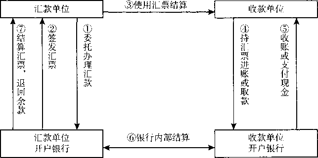

第二章资 产

>   本章重点以财政部2006年发布的企业会计准则和2017年修订发布的《企业会计准
>   则第22号——金融工具确认和计量》为基础介绍企业的货币资金、应收及预付款项、交
>   易性金融资产、存货、固定资产、无形资产和长期待摊费用的有关内容。

第一节货币资金

>   货币资金是指企业生产经营过程中处于货币形态的资产，包括库存现金、银行存款
>   和其他货币资金。

>   一、库存现金

>   库存现金是指存放于企业财会部门、由出纳人员经管的货币。库存现金是企业流动
>   性最强的资产，企业应当严格遵守国家和企业有关现金管理制度，正确进行现金收支的
>   核算，监督现金使用的合法性与合理性。

>   （一）现金管理制度

>   根据国务院发布的《现金管理暂行条例》的规定，企业现金管理制度主要包括以下
>   内容：

1.  现金的使用范围

    企业可用现金支付的款项有：（1）职工工资、津贴；（2）个人劳务报酬；（3）根据
    国家规定颁发给个人的科学技术、文化艺术、体育比赛等各种奖金；（4）各种劳保、福
    利费用以及国家规定的对个人的其他支出；（5）向个人收购农副产品和其他物资的价
    款；（6）出差人员必须随身携带的差旅费；（7）结算起点（1
    000元）以下的零星支出； （8）中国人民银行确定需要支付现金的其他支出。

    除企业可以现金支付的款项中的第（5）、第（6）项外，开户单位支付给个人的款
    项，超过使用现金限额的部分，应当以支票或者银行本票等方式支付；确需全额支付现
    金的，经开户银行审核后，予以支付现金。

2.  现金的限额

    现金的限额是指为了保证单位日常零星开支的需要，允许单位留存现金的最高数额。
    这一限额由开户银行根据单位的实际需要核定，一般按照单位3〜5天日常零星开支所需
    确定。边远地区和交通不便地区的开户单位的库存现金限额，可按多于5天，但不得超
    过15天的日常零星开支的需要确定。经核定的库存现金限额，开户单位必须严格遵守,
    超过部分应于当日终了前存入银行。需要增加或者减少库存现金限额的，应当向开户银
    行提出申请，由开户银行核定。

3.  现金收支的规定

    开户单位现金收支应当依照下列规定办理：（1）开户单位现金收入应当于当日送存
    开户银行，当日送存确有困难的，由开户银行确定送存时间。（2）开户单位支付现金，
    可以从本单位库存现金限额中支付或从开户银行提取，不得从本单位的现金收入中直接
    支付（即坐支）。因特殊情况需要坐支现金的，应当事先报经开户银行审查批准，由开
    户银行核定坐支范围和限额。坐支单位应当定期向开户银行报送坐支金额和使用情况。

    （3）开户单位从开户银行提取现金时，应当写明用途，由本单位财会部门负责人签字盖
    章，经开户银行审核后，予以支付。（4）因采购地点不确定，交通不便，生产或市场急
    需，抢险救灾以及其他特殊情况必须使用现金的，开户单位应向开户银行提出申请，由
    本单位财会部门负责人签字盖章，经开户银行审核后，予以支付现金。

    （二） 现金的账务处理

    为了反映和监督企业库存现金的收入、支出和结存情况，企业应当设置“库存现
    金”科目，借方登记企业库存现金的增加，贷方登记企业库存现金的减少，期末借方余
    额反映期末企业实际持有的库存现金的金额。企业内部各部门周转使用的备用金，可以
    单独设置“备用金”科目进行核算。为了全面、连续地反映和监督库存现金的收支和结
    存情况，企业应当设置库存现金总账和库存现金日记账，分别进行库存现金的总分类核
    算和明细分类核算。

    库存现金日记账由出纳人员根据收付款凭证，按照业务发生顺序逐日逐笔登记。每
    日终了，应当在库存现金日记账上计算出当日的现金收入合计额、现金支出合计额和余
    额，并将库存现金日记账的余额与实际库存现金金额相核对，保证账款相符。月度终了，
    库存现金日记账的余额应当与库存现金总账的余额核对，做到账账相符。

    （三） 现金的清查

    为了保证现金的安全完整，企业应当按规定对库存现金进行定期和不定期的清查，
    一般采用实地盘点法，对于清查的结果应当编制现金盘点报告单。如果有挪用现金、白
    条顶库的情况，应及时予以纠正；对于超限额留存的现金应及时送存银行。如果账款不
    符，发现有待查明原因的现金短缺或溢余，应先通过“待处理财产损溢”科目核算，按
    管理权限经批准后，分别两种情况处理：如为现金短缺，属于应由责任方赔偿的部分,
    计入其他应收款；属于无法查明原因的，计入管理费用。如为现金溢余，属于应支付给
    有关人员或单位的，计入其他应付款；属于无法查明原因的，计入营业外收入。

    二、银行存款

    银行存款是企业存放在银行或其他金融机构的货币资金。企业应当根据业务需要,
    按照规定在其所在地银行开设账户，运用所开设的账户，进行存款、取款以及各种收支
    转账业务的结算。银行存款的收付应严格执行银行结算制度的规定。

    （一） 银行存款的账务处理

    为了反映和监督企业银行存款的收入、支岀和结存情况，企业应当设置“银行存
    款”科目，借方登记企业银行存款的增加，贷方登记企业银行存款的减少，期末借方余
    额反映期末企业实际持有的银行存款的金额。

    企业应当设置银行存款总账和银行存款日记账，分别进行银行存款的总分类核算和
    序时、明细分类核算。企业可按开户银行和其他金融机构、存款种类等设置银行存款日
    记账，根据收付款凭证，按照业务的发生顺序逐笔登记。每日终了，应结出余额。

    企业将款项存入银行和其他金融机构时，应借记“银行存款”科目，贷记“库存现
    金”等科目；提取或支付已存入银行和其他金融机构存款时，借记“库存现金”等科
    目，贷记“银行存款”科目。

    （二） 银行存款的核对

    银行存款日记账应定期与银行对账单核对，至少每月核对一次。企业银行存款账面
    余额与银行对账单余额之间如有差额，应编制“银行存款余额调节表”对此予以调节，
    如没有记账错误，调节后的双方余额应相等。

    三、其他货币资金

    其他货币资金是指企业除库存现金、银行存款以外的其他各种货币资金，主要包括
    银行汇票存款、银行本票存款、信用卡存款、信用证保证金存款、存出投资款和外埠存
    款等。这些货币资金的存放地点和用途与库存现金、银行存款不同。它们在管理与核算
    上应与库存现金和银行存款有所不同。

    为了反映和监督其他货币资金的收支和结存情况，企业应当设置“其他货币资金”
    科目，借方登记其他货币资金的增加，贷方登记其他货币资金的减少，期末余额在借方，
    反映企业实际持有的其他货币资金的金额。“其他货币资金”科目应当按照其他货币资
    金的种类设置明细科目进行核算。

    （一）银行汇票存款

    银行汇票存款是指企业为取得银行汇票按照规定存入银行的款项。

    银行汇票是指由出票银行签发的，由其在见票时按照实际结算金额无条件支付给收
    款人或者持票人的票据。银行汇票的出票银行为银行汇票的付款人。单位和个人各种款
    项的结算，均可使用银行汇票。银行汇票可以用于转账，填明“现金”字样的银行汇票
    也可以用于支取现金。

    汇款单位（即申请人）使用银行汇票，应向出票银行填写“银行汇票申请书”，填
    明收款人名称、汇票金额、申请人名称、申请日期等事项并签章，签章是其预留银行的
    签章。出票银行受理银行汇票申请书，收妥款项后签发银行汇票，并用压数机压印出票
    金额，将银行汇票和解讫通知一并交给申请人。申请人应将银行汇票和解讫通知一并交
    付给汇票上记明的收款人。收款人受理申请人交付的银行汇票时，应在出票金额以内，
    根据实际需要的款项办理结算，并将实际结算的金额和多余金额准确、清晰地填入银行
    汇票和解讫通知的有关栏内，到银行办理款项入账手续。收款人可以将银行汇票背书转

    让给被背书人。银行汇票的背书转让以不超过出票金额的实际结算金额为准。未填写实
    际结算金额或实际结算金额超过岀票金额的银行汇票，不得背书转让。银行汇票的提示付
    款期限为自出票日起一个月，持票人超过付款期限提示付款的，银行将不予受理。持票人向
    银行提示付款时，必须同时提交银行汇票和解讫通知，缺少任何一联，银行不予受理。

    银行汇票丧失，失票人可以凭人民法院岀具的其享有票据权利的证明，向出票银行
    请求付款或退款。

    银行汇票流程如图2-1所示。

图*2-1*银行汇票流程

>   企业填写“银行汇票申请书”、将款项交存银行时，借记“其他货币资金——银行
>   汇票”科目，贷记“银行存款”科目；企业持银行汇票购货、收到有关发票账单时，借
>   记“材料采购”“原材料”“库存商品”“应交税费一一应交增值税（进项税额）”等科
>   目，贷记“其他货币资金一银行汇票”科目；采购完毕收回剩余款项时，借记“银行
>   存款”科目，贷记“其他货币资金——银行汇票”科目。

>   销货企业收到银行汇票、填制进账单到开户银行办理款项入账手续时，根据进账单
>   及销货发票等，借记“银行存款”科目，贷记“主营业务收入”“应交税费一一应交增
>   值税（销项税额）”等科目。

>   【例`2-1］`甲公司为增值税一般纳税人，2x19年8月5日向银行申请办理银行汇票
>   用以购买原材料，将款项250 00。元交存银行转作银行汇票存款。根据银行盖章退回的
>   申请书存根联，甲公司应编制如下会计分录：

>   借：其他货币资金——银行汇票 250 000

>   贷：银行存款 250 000

>   2 X19年8月10日，甲公司购入原材料一批已验收入库，取得的增值税专用发票上
>   注明的价款为200 000元，增值税税额为26 00。元，已用银行汇票办理结算，多余款项
>   24 000元退回开户银行，公司已收到开户银行转来的银行汇票第四联（多余款收账通

知）。甲公司应编制如下会计分录：

>   （1）用银行汇票结算材料价款和增值税税款时:

>   借：原材料 200 000

>   应吏税费 应交增值税（进项税额） 26 000

>   贷：其他货币资金——银行汇票 226 000

>   （2）收到退回的银行汇票多余款项时：

>   借：银行存款 24 000

>   贷：其他货币资金——银行汇票 24 000

>   （二）银行本票存款
>   银行本票存款是指企业为了取得银行本票按规定存入银行的款项。

>   银行本票是指银行签发的，承诺自己在见票时无条件支付确定的金额给收款人或持
>   票人的票据。单位和个人在同一票据交换区域需要支付的各种款项，均可使用银行本票。
>   银行本票可以用于转账，注明“现金”字样的银行本票可以用于支取现金。

>   银行本票分为不定额本票和定额本票两种。定额本票面额为1 000元、5 000元、 10
>   000元和50 000元。银行本票的提示付款期限自出票日起最长不得超过两个月。在有
>   效付款期内，银行见票付款。持票人超过提示付款期限付款的，银行不予受理。

>   申请人使用银行本票，应向银行填写“银行本票申请书”。申请人或收款人为单位
>   的，不得申请签发现金银行本票。出票银行受理银行本票申请书，收妥款项后签发银行
>   本票，在本票上签章后交给申请人。申请人应将银行本票交付给本票上记明的收款人。
>   收款人可以将银行本票背书转让给被背书人。

>   申请人因银行本票超过提示付款期限或其他原因要求退款时，应将银行本票提交到
>   出票银行并出具单位证明。根据银行盖章退回的进账单第一联，借记“银行存款”科
>   目，贷记“其他货币资金一一银行本票”科目。出票银行对于在本行开立存款账户的申
>   请人，只能将款项转入原申请人账户；对于现金银行本票和未到本行开立存款账户的申
>   请人，才能退付现金。

>   银行本票丧失，失票人可以凭人民法院出具的其享有票据权利的证明，向出票银行
>   请求付款或退款。

>   企业填写“银行本票申请书”、将款项交存银行时，借记“其他货币资金——银行
>   本票”科目，贷记“银行存款”科目；企业持银行本票购货、收到有关发票账单时，借
>   记“材料采购”“原材料”“库存商品”“应交税费一一应交增值税（进项税额）”等科
>   目，贷记“其他货币资金一一银行本票”科目。

>   销货企业收到银行本票、填制进账单到开户银行办理款项入账手续时，根据进账单
>   及销货发票等，借记“银行存款”科目，贷记“主营业务收入”“应交税费——应交增
>   值税（销项税额）”等科目。

>   【例`2-2`】甲公司为增值税一般纳税人，为取得银行本票，向银行填交“银行本票
>   申请书”，并将11 300元银行存款转作银行本票存款。公司取得银行本票后，应根据银
>   行盖章退回的银行本票申请书存根联填制银行付款凭证。甲公司应编制如下会计分录：

>   借：其他货币资金——银行本票 11 300

贷：银行存款 11 300

>   甲公司用银行本票购买办公用品10 000元，增值税专用发票上注明的增值税税额为 1
>   300元。甲公司应编制如下会计分录：

>   借：管理费用 10 000

>   应交税费——应交增值税（进项税额） 1300

>   贷：其他货币资金——银行本票 11 300

>   （三）信用卡存款

>   信用卡存款是指企业为取得信用卡而存入银行信用卡专户的款项。信用卡是银行卡
>   的一种。

>   凡在中国境内金融机构开立基本存款账户的单位可申领单位卡。单位卡可申领若干
>   张，持卡人资格由申领单位法定代表人或其委托的代理人书面指定和注销。单位卡账户
>   的资金一律从其基本存款账户转账存入，不得交存现金，不得将销货收入的款项存入其
>   账户。持卡人可持信用卡在特约单位购物、消费，但单位卡不得用于10万元以上的商品
>   交易、劳务供应款项的结算，不得支取现金。特约单位在每日营业终了，应将当日受理
>   的信用卡签购单汇总，计算手续费和净额，并填写汇（总）计单和进账单，连同签购单
>   一并送交收单银行办理进账。

>   企业申领信用卡应填制“信用卡申请表”，连同支票和有关资料一并送存发卡银行,
>   根据银行盖章退回的进账单第一联，借记“其他货币资金——信用卡”科目，贷记“银
>   行存款”科目；企业用信用卡购物或支付有关费用，收到开户银行转来的信用卡存款的
>   付款凭证及所附发票账单，借记“管理费用”等科目，贷记“其他货币资金——信用
>   卡”科目；企业信用卡在使用过程中，需要向其账户续存资金的，应借记“其他货币资
>   金——信用卡”科目，贷记“银行存款”科目；企业的持卡人如不需要继续使用信用卡
>   时，应持信用卡主动到发卡银行办理销户，销卡时，信用卡余额转入企业基本存款户，
>   不得提取现金，借记“银行存款”科目，贷记“其他货币资金——信用卡”科目。

>   【例`2-3`】甲公司于2x19年8月24日向银行申领信用卡，向银行交存50 000元。
>   2x19年9月10日，该公司用信用卡支付购书款3 000元，增值税专用发票上注明的增
>   值税税额为270元。甲公司应编制如下会计分录：

>   借：其他货币资金——信用卡 50 000

>   贷：银行存款 50 000

>   借：管理费用 3 000

>   应交税费——应交增值税（进项税额） 270

>   贷：其他货币资金——信用卡 3 270

>   （四）信用证保证金存款

>   信用证有国际信用证、国内信用证之分，以下内容专指国内信用证（以下简称“信
>   用证”）。

>   信用证是指银行（包括政策性银行、商业银行、农村合作银行、村镇银行和农村信
>   用社）依照申请人的申请开立的、对相符交单予以付款的承诺。它是以人民币计价、不
>   可撤销的跟单信用证。信用证的开立和转让，应当具有真实的贸易背景，适用于银行为

>   国内企事业单位之间货物和服务贸易提供的信用证服务。信用证只限于转账结算，不得
>   支取现金。

>   信用证保证金存款是指采用信用证结算方式的企业为开具信用证而存入银行信用证
>   保证金专户的款项。企业向银行申请开立信用证，应按规定向银行提交开证申请书、信
>   用证申请人承诺书和购销合同。

>   企业填写“信用证申请书”，将信用证保证金交存银行时，应根据银行盖章退回的
>   “信用证申请书”回单，借记“其他货币资金一一信用证保证金”科目，贷记“银行存
>   款”科目；企业接到开证行通知，根据供货单位信用证结算凭证及所附发票账单，借记
>   “材料采购”“原材料”“库存商品”“应交税费——应交增值税（进项税额）”等科目，
>   贷记“其他货币资金——信用证保证金”科目；将未用完的信用证保证金存款余额转回
>   开户银行时，借记“银行存款”科目，贷记“其他货币资金——信用证保证金”科目。

>   （五） 存出投资款

>   存出投资款是指企业为购买股票、债券、基金等根据有关规定存入在证券公司指定
>   银行开立的投资款专户的款项。

>   企业向证券公司划出资金时，应按实际划出的金额，借记“其他货币资金——存出
>   投资款”科目，贷记“银行存款”科目；购买股票、债券、基金等时，借记“交易性金
>   融资产”等科目，贷记“其他货币资金——存出投资款”科目。

>   （六） 外埠存款

>   外埠存款是指企业为了到外地进行临时或零星采购，而汇往采购地银行开立采购专
>   户的款项。

>   企业将款项汇往外地时，应填写汇款委托书，委托开户银行办理汇款。汇入地银行
>   以汇款单位名义开立临时采购账户，该账户的存款不计利息、只付不收、付完清户，除
>   了采购人员可从中提取少量现金外，一律采用转账结算。

>   企业将款项汇往外地开立采购专用账户，根据汇出款项凭证编制付款凭证时，借记
>   “其他货币资金——外埠存款”科目，贷记“银行存款”科目；收到采购人员转来供应
>   单位发票账单等报销凭证时，借记“材料采购”“原材料”“库存商品”“应交税费——
>   应交增值税（进项税额）”等科目，贷记“其他货币资金一一外埠存款”科目；采购完
>   毕收回剩余款项时，根据银行的收账通知，借记“银行存款”科目，贷记“其他货币资
>   金——外埠存款”科目。

第二节应收及预付款项

>   应收及预付款项是指企业在日常生产经营过程中发生的各项债权，包括应收款项和

>   预付款项。其中，应收款项包括应收票据、应收账款、应收股利、应收利息和其他应收
>   款等；预付款项是指企业按照合同规定预付的款项，如预付账款等。

>   一、应收票据

>   （一） 应收票据概述

>   应收票据是指企业因销售商品、提供服务等而收到的商业汇票。商业汇票是一种由
>   出票人签发的，委托付款人在指定日期无条件支付确定金额给收款人或者持票人的票据。

>   商业汇票的付款期限，最长不得超过6个月。定日付款的汇票付款期限自岀票日起
>   计算，并在汇票上记载具体到期日；出票后定期付款的汇票付款期限自出票日起按月计
>   算，并在汇票上记载；见票后定期付款的汇票付款期限自承兑或拒绝承兑日起按月计算，
>   并在汇票上记载。商业汇票的提示付款期限，自汇票到期日起10日。符合条件的商业汇
>   票的持票人，可以持未到期的商业汇票连同贴现凭证向银行申请贴现。

>   根据承兑人不同，商业汇票分为商业承兑汇票和银行承兑汇票。商业承兑汇票是指
>   由付款人签发并承兑，或由收款人签发交由付款人承兑的汇票。商业承兑汇票的付款人
>   收到开户银行的付款通知，应在当日通知银行付款。付款人在接到通知日的次日起3日
>   内（遇法定休假日顺延）未通知银行付款的，视同付款人承诺付款。银行将于付款人接
>   到通知日的次日起第4日（遇法定休假日顺延），将票款划给持票人。付款人提前收到
>   由其承兑的商业汇票，应通知银行于汇票到期日付款。银行在办理划款时，付款人存款
>   账户不足支付的，银行应填制付款人未付票款通知书，连同商业承兑汇票邮寄持票人开
>   户银行转交持票人。

>   银行承兑汇票是指由在承兑银行开立存款账户的存款人（即出票人）签发，由承兑
>   银行承兑的票据。企业申请使用银行承兑汇票时，应向其承兑银行按票面金额的万分之
>   五交纳手续费。银行承兑汇票的出票人应于汇票到期前将票款足额交存其开户银行，承
>   兑银行应在汇票到期日或到期日后的见票当日支付票款。银行承兑汇票的出票人于汇票
>   到期前未能足额交存票款时，承兑银行除凭票向持票人无条件付款外，对出票人尚未支
>   付的汇票金额按每天万分之五计收利息。

>   （二） 应收票据的账务处理

>   为了反映和监督应收票据取得、票款收回等情况，企业应当设置“应收票据”科目，
>   借方登记取得的应收票据的面值，贷方登记到期收回票款或到期前向银行贴现的应收票
>   据的票面金额，期末余额在借方，反映企业持有的商业汇票的票面金额。“应收票据”
>   科目可按照开出、承兑商业汇票的单位进行明细核算，并设置“应收票据备查簿”，逐
>   笔登记商业汇票的种类、号数和出票日、票面金额、交易合同号和付款人、承兑人、背
>   书人的姓名或单位名称、到期日、背书转让日、贴现日、贴现率和贴现净额以及收款
>   日和收回金额、退票情况等资料。商业汇票到期结清票款或退票后，在备查簿中应予
>   注销。

1.  取得应收票据和收回到期票款

    应收票据取得的原因不同，其账务处理亦有所区别。因债务人抵偿前欠货款而取得
    的应收票据，借记“应收票据”科目，贷记“应收账款”科目；因企业销售商品、提供
    劳务等而收到开出、承兑的商业汇票，借记“应收票据”科目，贷记“主营业务收入”
    “应交税费——应交增值税（销项税额）”等科目。商业汇票到期收回款项时，应按实际
    收到的金额，借记“银行存款”科目，贷记“应收票据”科目。

    【例`2-4`】甲公司为增值税一般纳税人，2x19年9月1日向乙公司（为增值税一般
    纳税人）销售一批产品，价款为1 500
    000元，尚未收到，已办妥托收手续，适用的增值
    税税率为13%。甲公司应编制如下会计分录：

    借：应收账款 1 695 000

    贷：主营业务收入 1 500 000

    应交税费——应交增值税（销项税额） 195 000

    2 X19年9月15日，甲公司收到乙公司寄来的一张期限为3个月的银行承兑汇票，
    面值为1 695 000元，抵付产品的价款和增值税款。甲公司应编制如下会计分录：

    借：应收票据 1 695 000

    贷：应收账款 1 695 000

    2 X19年12月15日，甲公司持有的上述票据到期，收回票面金额1 695 000元存入
    银行。甲公司应编制如下会计分录：

    借：银行存款 1 695 000

    贷：应收票据 1 695 000

2.  转让应收票据

    实务中，企业可以将自己持有的商业汇票背书转让。背书是指在票据背面或者粘单
    上记载有关事项并签章的票据行为。背书转让的，背书人应当承担票据责任。通常情况
    下，企业将持有的商业汇票背书转让以取得所需物资时，按应计入取得物资成本的金额,
    借记“在途物资”“材料采购”“原材料” “库存商品”等科目，按照增值税专用发票上注
    明的可抵扣的增值税税额，借记“应交税费——应交增值税（进项税额）”科目，按商业
    汇票的票面金额，贷记“应收票据”科目，如有差额，借记或贷记“银行存款”等科目。

    ,【例`2-5`】承R例2-4］，假定甲公司于2x19年10月15日将上述应收票据背书转
    让，以取得生产经营所需的A种材料，该材料价款为1 500 000元，适用的增值税税率为
    13%。甲公司应编制如下会计分录：

    借：原材料 1 500 000

    应交税费——应交增值税（进项税额） 195 000

    贷：应收票据 1 695 000

    对于票据贴现，企业通常应按实际收到的金额，借记“银行存款”科目，按应收票
    据的票面金额，贷记“应收票据”科目，按其差额，借记或贷记“财务费用”科目。

    二、应收账款

    应收账款是指企业因销售商品、提供服务等经营活动，应向购货单位或接受服务单
    位收取的款项，主要包括企业销售商品或提供服务等应向有关债务人收取的价款、增值
    税及代购货单位垫付的包装费、运杂费等。

    为了反映和监督应收账款的增减变动及其结存情况，企业应设置“应收账款”科
    目，不单独设置“预收账款”科目的企业，预收的账款也在“应收账款”科目核算。
    “应收账款”科目的借方登记应收账款的增加，贷方登记应收账款的收回及确认的坏账
    损失，期末余额一般在借方，反映企业尚未收回的应收账款；如果期末余额在贷方，一
    般为企业预收的账款。

    【例`2-6］`甲公司为增值税一般纳税人，采用托收承付结算方式向乙公司（为增值
    税一般纳税人）销售商品一批，取得的增值税专用发票上注明的价款为300 000元，增
    值税税额为39 000元，已办理托收手续。甲公司应编制如下会计分录：

    借：应收账款 339 000

    贷：主营业务收入 300 000

应交税费——应交增值税（销项税额） 39 000

>   甲公司实际收到款项时，应编制如下会计分录：

>   借：银行存款 339 000

>   贷：应收账款 339 000

>   企业应收账款改用应收票据结算，在收到承兑的商业汇票时，借记“应收票据”科
>   目，贷记“应收账款”科目。

>   【例2-7］承［例2-6］,如果甲公司委托银行收取乙公司的款项改用应收票据结
>   算，收到乙公司交来的商业承兑汇票一张，面值339 000元，用以偿还其前欠价款。甲
>   公司应编制如下会计分录：

>   借：应收票据 339 000

>   贷：应收账款 339 000

>   三、预付账款

>   预付账款是指企业按照合同规定预付的款项。如预付的材料、商品采购款、在建工
>   程价款等。

>   为了反映和监督预付账款的增减变动及其结存情况，企业应当设置“预付账款”科
>   目。“预付账款”科目的借方登记预付的款项及补付的款项，贷方登记收到所购物资时
>   根据有关发票账单记入“原材料”等科目的金额及收回多付款项的金额，期末余额在借
>   方，反映企业实际预付的款项；如果期末余额在贷方，则反映企业应付或应补付的款项。
>   预付款项情况不多的企业，可以不设置“预付账款”科目，而将预付的款项通过“应付
>   账款”科目核算。

>   企业根据购货合同的规定向供应单位预付款项时，借记“预付账款”科目，贷记
>   “银行存款”科目；企业收到所购物资，按应计入购入物资成本的金额，借记“材料采
>   购”“原材料”“库存商品”等科目，按可抵扣的增值税进项税额，借记“应交税费一一
>   应交增值税（进项税额）”等科目，贷记“预付账款”科目；当预付价款小于采购货物
>   所需支付的款项时，应将不足部分补付，借记“预付账款”科目，贷记“银行存款”等
>   科目；当预付价款大于采购货物所需支付的款项时，对收回的多余款项，应借记“银行  
>   

四、应收股利和应收利息

（一）应收股利的账务处理

应收股利是指企业应收取的现金股利或应收取其他单位分配的利润。为了反映和监
督应收股利的增减变动及其结存情况，企业应设置“应收股利”科目。“应收股利”科
目的借方登记应收现金股利或利润的增加，贷方登记收到的现金股利或利润，期末余额
一般在借方，反映企业尚未收到的现金股利或利润。“应收股利”科目应当按照被投资
单位设置明细科目进行核算。

企业在持有以公允价值计量且其变动计入当期损益的金融资产（交易性金融资产）
期间，被投资单位宣告发放现金股利，按应享有的份额，确认为当期投资收益，借记
“应收股利”科目，贷记“投资收益”科目。

【例`2-9］`甲公司持有丙上市公司股票，且作为以公允价值计量且其变动计入当期
损益的金融资产（交易性金融资产）进行管理和核算°2xl9年5月10日，丙上市公司
发放2x18年现金股利，甲公司按其持有该上市公司股份计算确定的应分得的现金股利 为200
000元。假定不考虑相关税费。甲公司应编制如下会计分录：

借：应收股利——丙上市公司 200 000

贷：投资收益——丙上市公司

【例`2-10］`承［例2-9』，2x19年5月30日，甲公司收到丙上市公司发放的现金 股利200
000元，款项已存入银行。假定不考虑相关税费。甲公司应编制如下会计分录：

借：其他货币资金——存出投资款 200 000

贷:应收股利——丙上市公司

需要说明的是，企业收到被投资单位分配的现金股利或利润，应贷记“应收股利”
科目，但对于应借记的会计科目，应区别两种情况分别进行处理：对于企业通过证券公
司购入上市公司股票所形成的股权投资取得的现金股利，应借记“其他货币资金——存
出投资款”科目；对于企业持有的其他股权投资取得的现金股利或利润，应借记“银行
存款”科目。

（二）应收利息的账务处理

应收利息是指企业根据合同或协议规定应向债务人收取的利息。为了反映和监督
应收利息的增减变动及其结存情况，企业应设置“应收利息”科目。“应收利息”科
目的借方登记应收利息的增加，贷方登记收到的利息，期末余额一般在借方，反映企
业尚未收到的利息。“应收利息”科目应当按照借款人或被投资单位设置明细科目进
行核算。

【例`2-11］`甲公司持有庚公司债券投资，2x19年1月11日，甲公司收到庚公司通
知，拟向其支付2 X18年利息1 000 000元，款项尚未支付。假定不考虑相关税费。甲公
司应编制如下会计分录：

借：应收利息——庚公司 1 000 000

贷：投资收益——庚公司 1 000 000

五、其他应收款

其他应收款是指企业除应收票据、应收账款、预付账款、应收股利和应收利息以外
的其他各种应收及暂付款项。其主要内容包括：应收的各种赔款、罚款，如因企业财产
等遭受意外损失而应向有关保险公司收取的赔款等；应收的出租包装物租金；应向职工
收取的各种垫付款项，如为职工垫付的水电费、应由职工负担的医药费、房租费等；存
出保证金，如租入包装物支付的押金；其他各种应收、暂付款项。

为了反映和监督其他应收账款的增减变动及其结存情况，企业应当设置“其他应收
款”科目进行核算。“其他应收款”科目的借方登记其他应收款的增加，贷方登记其他
应收款的收回，期末余额一般在借方，反映企业尚未收回的其他应收款项。“其他应收
款”科目应当按照对方单位（或个人）设置明细科目进行核算。

企业发生各种其他应收款项时，应借记“其他应收款”科目，贷记“库存现金”
“银行存款”“固定资产清理”等科目。收回其他各种应收款项时，借记“库存现金”
“银行存款”“应付职工薪酬”等科目，贷记“其他应收款”科目。

【例2-12］甲公司在采购过程中发生材料毁损，按保险合同规定，应由M保险公司
赔偿损失30 000元，赔款尚未收到。假定甲公司对原材料采用计划成本进行日常核算，
甲公司应编制如下会计分录：

借：其他应收款——M保险公司 30 000

贷：材料采购 30 000

当甲公司如数收到上述M保险公司的赔款时，甲公司应编制如下会计分录：

借：银行存款 30 000

贷：其他应收款——M保险公司 30 000

【例`2 -13`】甲公司以银行存款替职工王某垫付应由其个人负担的医疗费5 000元,
拟从其工资中扣回。甲公司应编制如下会计分录：

1.  垫付款时：

借：其他应收款——王某 5 000

贷：银行存款 5 000

1.  扣款时：

借：应付职工薪酬 5 000

贷：其他应收款——王某 5 000

【例`2-14`】甲公司向丁公司租入包装物一批，以银行存款向丁公司支付押金10 000

元。甲公司应编制如下会计分录：

借：其他应收款——丁公司 10 000

贷：银行存款 10 000

甲公司按期如数向丁公司退回所租包装物，并收到丁公司退还的押金10 000元，已
存入银行。甲公司应编制如下会计分录：

借：银行存款 10 000

贷：其他应收款——丁公司 10 000

六、应收款项减值

企业的各项应收款项，可能会因购货人拒付、破产、死亡等原因而无法收回。这类无
法收回的应收款项就是坏账。企业因坏账而遭受的损失为坏账损失或减值损失。企业应当
在资产负债表日对应收款项的账面价值进行评估，应收款项发生减值的，应当将减记的金
额确认为减值损失，计提坏账准备。应收款项减值有两种核算方法，即直接转销法和备抵
法，我国企业会计准则规定，应收款项减值的核算应采用备抵法，不得采用直接转销法。

1.  直接转销法

采用直接转销法时，日常核算中应收款项可能发生的坏账损失不予考虑，只有在实
际发生坏账时，才作为坏账损失计入当期损益，同时直接冲销应收款项，即借记“信用
减值损失”科目，贷记“应收账款”等科目。

【例`2-15］`某企业2 X15年发生的一笔20 000元的应收账款，长期无法收回，于 2
X19年末确认为坏账。该企业在2 X19年末应编制如下会计分录：

借：信用减值损失——坏账损失 20 000

贷：应收账款 20 000

这种方法的优点是账务处理简单，其缺点是不符合权责发生制会计基础，也与资
产定义相冲突。在这种方法下，只有坏账实际发生时，才将其确认为当期费用，导致
资产和各期损益不实；另外，在资产负债表上，应收账款是按账面余额而不是按账面
价值反映，这在一定程度上歪曲了期末的财务状况。所以，企业会计准则不允许采用
直接转销法。

（二）备抵法

备抵法是采用一定的方法按期估计坏账损失，计入当期损益，同时建立坏账准备，
待坏账实际发生时，冲销已计提的坏账准备和相应的应收款项。采用这种方法，在财务
报表上列示应收款项的净额，使财务报表使用者能了解企业应收款项预期可收回的金额
或真实的财务情况。

企业应当设置“坏账准备”科目，核算应收款项的坏账准备计提、转销等事项。
“坏账准备”科目的贷方登记当期计提的坏账准备、收回已转销的应收账款而恢复的坏
账准备，借方登记实际发生的坏账损失金额和冲减的坏账准备金额，期末贷方余额，反
映企业已计提但尚未转销的坏账准备。

坏账准备可按以下公式计算：

当期应计提的二当期按应收款项计算或）“坏账准备”科目的

坏账准备 ■ 的坏账准备金额 ;贷方（或借方）余额

1.  计提坏账准备

企业计提坏账准备时，按照应收款项应减记的金额，借记“信用减值损失——计提
的坏账准备”科目，贷记“坏账准备”科目。冲减多计提的坏账准备时，借记“坏账准
备”科目，贷记“信用减值损失——计提的坏账准备”科目。

【例`2-16`】2xl8年12月31日，甲公司应收丙公司的账款余额为1000 000元，甲
公司根据企业会计准则确定应计提坏账准备的金额为100 000元。甲公司应编制如下会
计分录：

借：信用减值损失——计提的坏账准备 100 000

贷：坏账准备 100 000

1.  转销坏账

企业确实无法收回的应收款项按管理权限报经批准后作为坏账转销时，应当冲减已
计提的坏账准备。企业实际发生坏账损失时，借记“坏账准备”科目，贷记“应收账
款”“其他应收款”等科目。

【例`2-17`】承［例2 -16』，2 X19年6月，甲公司应收丙公司的销货款实际发生坏
账损失30 000元。甲公司应编制如下会计分录：

借：坏账准备 30 000

贷：应收账款 30 000

【例`2 -18`】承R例2 -16』和（例2 -17』，假定甲公司2x19年12月31日应收丙
公司的账款余额为1 200 000元，甲公司对该应收账款应计提120 000元坏账准备。即
2x19年12月31日甲公司“坏账准备”科目应保持的贷方余额为120 000元。计提坏账
准备前，“坏账准备”科目的实际余额为贷方70000元（100 000 -30 000）,因此，本年
末应计提的坏账准备金额为50 000元（120 000 -70 000）o甲公司应编制如下会计分录：

借：信用减值损失——计提的坏账准备 50 000

贷：坏账准备 50 000

1.  收回已确认坏账并转销应收款项

已确认并转销的应收款项以后又收回的，应当按照实际收到的金额增加坏账准备的
账面余额。已确认并转销的应收款项以后又收回时，借记“应收账款” “其他应收款”
等科目，贷记“坏账准备”科目；同时，借记“银行存款”科目，贷记“应收账款”
“其他应收款”等科目。

【例`2 -19`】2 x 20年1月20日，甲公司收回2 x 19年已作坏账转销的应收账款

| 20 000元，已存入银行。甲公司应编制如下会计分录： |        |
|--------------------------------------------------|--------|
| 借：应收账款                                     | 20 000 |
| 贷：坏账准备                                     | 20 000 |
| 借：银行存款                                     | 20 000 |
| 贷：应收账款                                     | 20 000 |

第三节交易性金融资产

一、交易性金融资产的内容

在企业全部资产中，库存现金、银行存款、应收账款、应收票据、贷款、其他应收
款、应收利息、债券投资、股票投资、基金投资及衍生金融资产等统称为金融资产。根
据企业管理金融资产的业务模式和金融资产的合同现金流量特征，《企业会计准则第22
号——金融工具确认和计量》（2018）将金融资产划分为：（1）以摊余成本计量的金融
资产；（2）以公允价值计量且其变动计入其他综合收益的金融资产；（3）以公允价值计
量且其变动计入当期损益的金融资产。

以公允价值计量且其变动计入当期损益的金融资产称为“交易性金融资产”。它是
企业为了近期内出售而持有的金融资产，如企业以赚取差价为目的从二级市场购入的股
票、债券、基金等；或者是在初始确认时属于集中管理的可辨认金融工具组合的一部分,
且有客观证据表明近期实际存在短期获利模式的金融资产等，如企业管理的以公允价值
进行业绩考核的某项投资组合。

从企业管理金融资产的业务模式（即企业如何管理其金融资产以产生现金流量）
看，企业关键管理人员决定对交易性金融资产进行管理的业务目标是以“交易”为目
的，而非为收取合同现金流量（即与基本借贷安排相一致，如本金加利息）而持有，也
不是为既以收取合同现金流量为目标又以岀售该金融资产为目标而持有，仅仅是通过
“交易性”活动，即频繁地购买和出售，从市场价格的短期波动中，赚取买卖差价，使
企业闲置的资金能获得较高的投资回报。

交易性金融资产预期能在短期内变现以满足日常经营的需要，因此，在资产负债表
中作为流动资产列示。

需要说明的是，从金融资产的合同现金流量特征看，尽管交易性金融资产仍将收取
合同现金流量，但只是偶尔为之，并非为了实现业务模式目标（收取合同现金流量）而
不可或缺。

二、交易性金融资产的账务处理

（一） 交易性金融资产核算应设置的会计科目

为了反映和监督交易性金融资产的取得、收取现金股利或利息、出售等情况，企业
应当设置“交易性金融资产”“公允价值变动损益” “投资收益”等科目进行核算。

“交易性金融资产”科目核算企业分类为以公允价值计量且其变动计入当期损益的
金融资产。“交易性金融资产”科目的借方登记交易性金融资产的取得成本、资产负债
表日其公允价值高于账面余额的差额，以及出售交易性金融资产时结转公允价值低于账
面余额的变动金额；贷方登记资产负债表日其公允价值低于账面余额的差额，以及企业
出售交易性金融资产时结转的成本和公允价值高于账面余额的变动金额。企业应当按照交
易性金融资产的类别和品种，分别设置“成本”“公允价值变动”等明细科目进行核算。

“公允价值变动损益”科目核算企业交易性金融资产等的公允价值变动而形成的应
计入当期损益的利得或损失。“公允价值变动损益”科目的借方登记资产负债表日企业
持有的交易性金融资产等的公允价值低于账面余额的差额；贷方登记资产负债表日企业
持有的交易性金融资产等的公允价值高于账面余额的差额。

“投资收益”科目核算企业持有交易性金融资产等的期间内取得的投资收益以及出
售交易性金融资产等实现的投资收益或投资损失，借方登记企业取得交易性金融资产时
支付的交易费用、出售交易性金融资产等发生的投资损失，贷方登记企业持有交易性金
融资产等的期间内取得的投资收益以及出售交易性金融资产等实现的投资收益。“投资收
益”科目应当按照投资项目设置明细科目进行核算。

（二） 取得交易性金融资产

企业取得交易性金融资产时，应当按照该金融资产取得时的公允价值作为其初始入
账金额。金融资产的公允价值，应当以市场交易价格为基础确定。

企业取得交易性金融资产所支付价款中包含的已宣告但尚未发放的现金股利或已到
付息期但尚未领取的债券利息，应当单独确认为应收项目。

企业取得交易性金融资产所发生的相关交易费用应当在发生时计入当期损益，冲减
投资收益，发生交易费用取得增值税专用发票的，进项税额经认证后可从当月销项税额
中扣除。交易费用是指可直接归属于购买、发行或处置金融工具的增量费用。增量费用
是指企业没有发生购买、发行或处置相关金融工具的情形就不会发生的费用，包括支付
给代理机构、咨询公司、券商、证券交易所、政府有关部门等的手续费、佣金、相关税
费以及其他必要支出，不包括债券溢价、折价、融资费用、内部管理成本和持有成本等
与交易不直接相关的费用。

企业取得交易性金融资产，应当按照该金融资产取得时的公允价值，借记“交易性
金融资产一一成本”科目，按照发生的交易费用，借记“投资收益”科目，发生交易费

用取得增值税专用发票的，按其注明的增值税进项税额，借记“应交税费——应交增值
税(进项税额)”科目，按照实际支付的金额，贷记“其他货币资金”等科目。

【例`2-20`】甲公司为增值税一般纳税人，2x19年6月1日，甲公司从上海证券交易所
购入入上市公司股票1 000 000股，该笔股票投资在购买日的公允价值为10000000元，另
支付相关交易费用25 000元，取得的增值税专用发票上注明的增值税税额为1 500元。
甲公司将其划分为交易性金融资产进行管理和核算。甲公司应编制如下会计分录：

1.  2x19年6月1日，购买A上市公司股票时：

借：交易性金融资产——A上市公司股票——成本 10 000 000

贷：其他货币资金——存出投资款 10 000 000

1.  2x19年6月1日，支付相关交易费用时：

借：投资收益——A上市公司股票 25 000

应交税费——应交增值税(进项税额) 1500

贷：其他货币资金——存出投资款 26 500

在本例中，取得交易性金融资产所发生的相关交易费用25 000元，应当在发生时记
入“投资收益”科目，而不记入“交易性金融资产一一成本”科目。

【例`2-21］`甲公司为增值税一般纳税人，假定2 X19年6月1日，甲公司从上海证
券交易所购入A上市公司股票1 000 000股，支付价款10 000 000元(其中包含已宣告
但尚未发放的现金股利600 000元)，另支付相关交易费用25 000元，取得的增值税专用
发票上注明的增值税税额为1 500元。甲公司将其划分为交易性金融资产进行管理和核
算。甲公司应编制如下会计分录：

1.  2x19年6月1日，购买A上市公司股票时：

借：交易性金融资产——A上市公司股票——成本 9 400 000

应收股利——A上市公司股票 600 000

贷：其他货币资金——存出投资款 10 000 000

1.  2x19年6月1日，支付相关交易费用时：

借：投资收益——A上市公司股票 25 000

应交税费——应交增值税(进项税额) 1500

贷：其他货币资金——存出投资款 26 500

在本例中，取得交易性金融资产所发生的相关交易费用25 000元，应当在发生时记
入“投资收益”科目，而不记入“交易性金融资产——成本”科目。取得交易性金融资
产支付价款10 000 000元中所包含的已宣告但尚未发放的现金股利600 000元，应当记
入“应收股利”科目。

1.  持有交易性金融资产

2.  企业持有交易性金融资产期间对于被投资单位宣告发放的现金股利或已到付息
    期但尚未领取的债券利息，应当确认为应收项目，并计入投资收益，即借记“应收股
    利”或“应收利息”科目，贷记“投资收益”科目；实际收到款项时作为冲减应收项目

处理，即借记“其他货币资金”等科目，贷记“应收股利”或“应收利息”科目。

>   需要强调的是，企业只有在同时满足三个条件时，才能确认交易性金融资产所取得
>   的股利或利息收入并计入当期损益：一是企业收取股利或利息的权利已经确立（例如被
>   投资单位已宣告）；二是与股利或利息相关的经济利益很可能流入企业；三是股利或利息
>   的金额能够可靠计量。

>   【例`2-22]`承R例2 -21],假定*2x19*年6月20日，甲公司收到`A`上市公司向其
>   发放的现金股利600 000元，并存入银行。假定不考虑相关税费。甲公司应编制如下会
>   计分录：

>   借：其他货币资金——存出投资款 600 000

>   贷：应收股利——A上市公司股票 600 000

>   【例`2-23`】承[例*2-21],*假定*2x20*年3月2 0日，A上市公司宣告发放2x19
>   年现金股利，甲公司按其持有该上市公司股份计算确定的应分得的现金股利为800 000
>   元。假定不考虑相关税费。甲公司应编制如下会计分录：

>   借：应收股利——A上市公司股票 800 000

>   贷：投资收益——A上市公司股票 800 000

>   在本例中，甲公司取得A上市公司宣告发放的现金股利同时满足了前述确认股利收
>   入并计入当期损益的三个条件。

>   【例`2-24`】乙公司为增值税一般纳税人，2x19年6月1日，乙公司购入B公司发行的
>   公司债券，支付价款26 000 000元（其中包含已到付息期但尚未领取的债券利息500
>   000 元），另支付交易费用300
>   000元，取得的增值税专用发票上注明的增值税税额为18 000
>   元。该笔B公司债券面值为25 000 000元。乙公司将其划分为交易性金融资产进行管理
>   和核算。*2x19*年6月10日，乙公司收到该笔债券利息500 000元。假定不考虑其他相
>   关税费和因素。乙公司应编制如下会计分录：

>   ①2x19年6月1日，购入B公司的公司债券时：

>   借：交易性金融资产——B公司债券——成本 25 500 000

>   应收利息——B公司债券 500 000

>   投资收益——B公司债券 300 000

>   应交税费——应交增值税（进项税额） 18 000

>   贷：其他货币资金——存出投资款 26 318 000

>   ②2x19年6月10日，收到购买价款中包含的已到付息期但尚未领取的债券利息时:
>   借：其他货币资金——存出投资款 500 000

>   贷：应收利息——B公司债券 500 000

>   在本例中，乙公司取得交易性金融资产所支付的交易费用300 000元，应当记入
>   “投资收益”科目。乙公司取得交易性金融资产所支付价款26 000 000元中包含的已到
>   付息期但尚未领取的债券利息500 000元，应当记入“应收利息”科目。

>   （2）资产负债表日，交易性金融资产应当按照公允价值计量，公允价值与账面余额

之间的差额计入当期损益。

>   企业应当在资产负债表日按照交易性金融资产公允价值高于其账面余额的差额，借
>   记“交易性金融资产——公允价值变动”科目，贷记“公允价值变动损益”科目；公允
>   价值低于其账面余额的差额作相反的会计分录，借记“公允价值变动损益”科目，贷记
>   “交易性金融资产——公允价值变动”科目。

>   【例`2
>   -25`】承［例2-21］和［例2-22］,假定*2x19*年`6`月30日，甲公司持有`A`
>   上市公司股票的公允价值为8 600 000元；2x19年12月31日，甲公司持有A上市公司股
>   票的公允价值为12 400
>   000元。不考虑相关税费和其他因素。甲公司应编制如下会计分录：

1.  2x19年6月30日，确认A上市公司股票的公允价值变动损益时：

    借：公允价值变动损益——A上市公司股票 800 000

    贷：交易性金融资产——A上市公司股票——公允价值变动 800 000

2.  *2x19*年12月31日，确认A上市公司股票的公允价值变动损益时：

    借：交易性金融资产——A上市公司股票——公允价值变动 3 800 000

    贷：公允价值变动损益——A上市公司股票 3 800 000

    在本例中，2x19年6月30日为资产负债表日，甲公司持有A上市公司股票在该日公
    允价值8 600 000元，账面余额9 400 000元（艮卩2 x 19年6月1日的公允价值9 400
    000 元），公允价值小于账面余额800
    000元，应记入“公允价值变动损益”科目的借方；
    2x19年12月31日，甲公司持有A上市公司股票在该日公允价值12 400 000元，账面
    余额8 600 000元（即2x19年6月30日的公允价值8 600 000元）,公允价值大于账面
    余额3 800 000元，应记入“公允价值变动损益”科目的贷方。

    1【例`2-26`】承［例2-24L
    假定2x19年`6`月30日，乙公司持有`B`公司债券的公 允价值为26 700 000元；2 x
    19年12月31日，乙公司持有B公司债券的公允价值为

3.  800 000元。不考虑相关税费和其他因素。乙公司应编制如下会计分录：

4.  2 X19年6月30日，确认B公司债券的公允价值变动损益时：

    借：交易性金融资产——B公司债券——公允价值变动 1

    贷：公允价值变动损益 B公司债券

5.  2x19年12月31日，确认B公司债券的公允价值变动损益时：

    借：公允价值变动损益——B公司债券

    贷：交易性金融资产——B公司债券——公允价值变动 900 000

    在本例中，2x19年6月30 0 , B公司债券的公允价值为26 700 000元，账面余额 为25
    500 000元，公允价值大于账面余额1 200 000元，应记入“公允价值变动损益”科
    目的贷方；2x19年12月31日，B公司债券的公允价值为25 800 000元，账面余额为

6.  700 000元，公允价值小于账面余额900 000元，应记入“公允价值变动损益”科目
    的借方。

66 （四）岀售交易性金融资产

>   企业出售交易性金融资产时，应当将该金融资产出售时的公允价值与其账面余额之

我是可爱的脆啤熊哦

间的差额作为投资损益进行会计处理。

>   企业出售交易性金融资产，应当按照实际收到的金额，借记“其他货币资金”等科
>   目，按照该金融资产的账面余额的成本部分，贷记“交易性金融资产一一成本”科目，
>   按照该金融资产的账面余额的公允价值变动部分，贷记或借记“交易性金融资产——公
>   允价值变动”科目，按照其差额，贷记或借记“投资收益”科目。

>   【例 `2-27］`承 R 例 2-21L ［例 2-22』、R 例 2 -231 和*［例 2-25］,*假定
>   2x20 年5月31日，甲公司出售所持有的全部A上市公司股票，价款为12 100
>   000元。不考虑 相关税费和其他因素。甲公司应编制如下会计分录：

>   借：其他货币资金——存出投资款 12 100 000

>   投资收益——A上市公司股票 300 000

>   贷：交易性金融资产——A上市公司股票——成本 9 400 000

——公允价值变动 3 000 000

>   在本例中，2x20年5月31日，甲公司出售持有A上市公司全部股票的价款12 100 000
>   元与账面余额12 400 000元（即*2x19*年12月31日的公允价值12 400 000元）之间的
>   差额-300 000元应当作为投资损失，记入“投资收益”科目的借方。

>   【例`2 - 28`】承 H列2-24』和［例2 -26』，假定2 乂20年3月15日，乙公司出售
>   了所持有的全部B公司债券，售价为35 500 000元。不考虑相关税费和其他因素。乙公
>   司应编制如下会计分录：

>   借：其他货币资金——存出投资款 35 500 000

>   贷：交易性金融资产——B公司债券——成本 25 500 000

——公允价值变动 300 000

投资收益——B公司债券 9 700 000

>   在本例中，乙公司出售交易性金融资产的售价35 500 000元与其账面余额25 800 000
>   元（即2x19年12月31日B公司债券的公允价值25 800 000元）之间的差额9 700 000
>   元应当作为投资收益，记入“投资收益”科目的贷方。

>   （五）转让金融商品应交增值税

>   金融商品转让按照卖出价扣除买入价（不需要扣除已宣告未发放现金股利和已到付
>   息期未领取的利息）后的余额作为销售额计算增值税，即转让金融商品按盈亏相抵后的
>   余额为销售额。若相抵后岀现负差，可结转下一纳税期与下期转让金融商品销售额互抵,
>   但年末时仍出现负差的，不得转入下一会计年度。

>   转让金融资产当月月末，如产生转让收益，则按应纳税额，借记“投资收益”等科
>   目，贷记“应交税费——转让金融商品应交增值税”科目；如产生转让损失，则按可结
>   转下月抵扣税额，借记“应交税费一一转让金融商品应交增值税”科目，贷记“投资收
>   益”等科目。

>   年末，如果“应交税费一一转让金融商品应交增值税”科目有借方余额，说明本年
>   度的金融商品转让损失无法弥补，且本年度的金融资产转让损失不可转入下年度继续抵

>   减转让金融资产的收益，应将“应交税费——转让金融商品应交增值税”科目的借方余
>   额转出。因此，应借记“投资收益”等科目，贷记“应交税费——转让金融商品应交增
>   值税”科目。

>   【例`2 - 29`】承R例2-27』、3列2-28』，计算该项业务转让金融商品应交增值税。
>   甲公司转让金融商品应交增值税=(12 100 000 - 10 000 000) (1 + 6% ) X6% =

118 867. 92 (元)

>   甲公司应编制如下会计分录：

>   借：投资收益 118 867. 92

>   贷：应交税费——转让金融商品应交增值税 118 867.92

>   乙公司转让金融商品应交增值税=(35 500 000 - 26 000 000 ) : (1 + 6% ) x6%二
>   537 735. 85 (元)

>   乙公司应编制如下会计分录：

>   借：投资收益 537 735. 85

>   贷：应交税费——转让金融商品应交增值税 537 735. 85

第四节存 货

>   一、存货概述

1.  存货的内容

    存货是指企业在日常活动中持有以备出售的产品或商品、处在生产过程中的在产品、
    在生产过程或提供劳务过程中储备的材料或物料等，包括各类材料、在产品、半成品、
    产成品、商品以及包装物、低值易耗品、委托代销商品等。

2.  原材料。原材料是指企业在生产过程中经加工将改变其形态或性质并构成产品
    主要实体的各种原料及主要材料、辅助材料、外购半成品(外购件)、修理用备件(备
    品备件)、包装材料、燃料等。

3.  在产品。在产品是指企业正在制造尚未完工的生产物，包括正在各个生产工序
    加工的产品和已加工完毕但尚未检验或已检验但尚未办理入库手续的产品。

4.  半成品。半成品是指经过一定生产过程并已检验合格交付半成品仓库保管，但
    尚未制造完工，仍需进一步加工的中间产品。

5.  产成品。产成品是指企业已经完成全部生产过程并已验收入库，可以按照合同规
    定的条件送交订货单位，或者可以作为商品对外销售的产品。企业接受来料加工制造的代
    制品和为外单位加工修理的代修品，制造和修理完成验收入库后，应视同企业的产成品。

6.  商品。商品是指商品流通企业外购或委托加工完成验收入库用于销售的各种商品。

7.  包装物。包装物是指为了包装本企业的商品而储备的各种包装容器，如桶、
    箱、瓶、坛、袋等。其主要作用是盛装、装潢产品或商品。

8.  低值易耗品。低值易耗品是指不能作为固定资产核算的各种用具物品，如工
    具、管理用具、玻璃器皿、劳动保护用品以及在经营过程中周转使用的容器等。其特点
    是单位价值较低，或使用期限相对于固定资产较短，在使用过程中保持其原有实物形态
    基本不变。

9.  委托代销商品。委托代销商品是指企业委托其他单位代销的商品。

10. 存货成本的确定

11. 存货应当按照成本进行初始计量

    存货成本包括采购成本、加工成本和其他成本。

12. 存货的采购成本。

    存货的采购成本，包括购买价款、相关税费、运输费、装卸费、保险费以及其他可
    归属于存货釆购成本的费用。

    其中，存货的购买价款是指企业购入的材料或商品的发票账单上列明的价款，但不
    包括按照规定可以抵扣的增值税进项税额。存货的相关税费是指企业购买存货发生的进
    口关税、消费税、资源税和不能抵扣的增值税进项税额以及相应的教育费附加等应计入
    存货采购成本的税费。其他可归属于存货采购成本的费用是指采购成本中除上述各项以
    外的可归属于存货采购的费用，如在存货采购过程中发生的仓储费、包装费、运输途中
    的合理损耗、入库前的挑选整理费用等。运输途中的合理损耗，是指商品在运输过程中，
    因商品性质、自然条件及技术设备等因素，所发生的自然的或不可避免的损耗。例如，汽
    车在运输煤炭、化肥等的过程中自然散落以及易挥发产品在运输过程中的自然挥发。

    商品流通企业在采购商品过程中发生的运输费、装卸费、保险费以及其他可归属于
    存货采购成本的费用等进货费用，应当计入存货采购成本，也可以先进行归集，期末根
    据所购商品的存销情况进行分摊。对于已售商品的进货费用，计入当期损益；对于未售
    商品的进货费用，计入期末存货成本。企业采购商品的进货费用金额较小的，可以在发
    生时直接计入当期损益。

13. 存货的加工成本。

    存货的加工成本是指在存货的加工过程中发生的追加费用，包括直接人工以及按照
    一定方法分配的制造费用。直接人工是指企业在生产产品过程中发生的直接从事产品生
    产人员的职工薪酬。制造费用是指企业为生产产品而发生的各项间接费用。

14. 存货的其他成本。

    存货的其他成本是指除釆购成本、加工成本以外的，使存货达到目前场所和状态所
    发生的其他支出。为特定客户设计产品所发生的、可直接确定的设计费用应计入存货的
    成本，但是企业设计产品发生的设计费用通常应计入当期损益。

15. 存货的来源不同，其成本的构成内容也不同

    原材料、商品、低值易耗品等通过购买而取得的存货的成本主要由采购成本构成;
    产成品、在产品、半成品等自制或需委托外单位加工完成的存货的成本由采购成本、加
    工成本以及使存货达到目前场所和状态所发生的其他支出构成。

    实务中具体按以下原则确定:

16. 购入的存货，其成本包括：买价、运杂费(包括运输费、装卸费、保险费、包
    装费、仓储费等)、运输途中的合理损耗、入库前的挑选整理费用(包括挑选整理中发
    生的工、费支岀和挑选整理过程中所发生的数量损耗，并扣除回收的下脚废料价值)以
    及按规定应计入存货成本的税费和其他费用。

17. 自制的存货，包括自制原材料、自制包装物、自制低值易耗品、自制半成品及
    库存商品等，其成本包括直接材料、直接人工和制造费用等的各项实际支岀。

18. 委托外单位加工完成的存货，包括加工后的原材料、包装物、低值易耗品、半
    成品、产成品等，其成本包括实际耗用的原材料或者半成品、加工费、装卸费、保险费、
    委托加工的往返运输费等费用以及按规定应计入存货成本的税费。

19. 下列费用不应计入存货成本，而应在其发生时计入当期损益

20. 非正常消耗的直接材料、直接人工和制造费用，应在发生时计人当期损益，不
    应计入存货成本。比如，由于自然灾害而发生的直接材料、直接人工和制造费用，由于
    这些费用的发生无助于使该存货达到目前场所和状态，不应计入存货成本，而应确认为
    当期损益。

21. 仓储费用指企业在存货采购入库后发生的储存费用，应在发生时计入当期损
    益。但是，在生产过程中为达到下一个生产阶段所必需的仓储费用应计入存货成本。比
    如，某种酒类产品生产企业为使生产的酒达到规定的产品质量标准而必须发生的仓储费
    用，应计入酒的成本，而不应计入当期损益。

22. 不能归属于使存货达到目前场所和状态的其他支岀，应在发生时计入当期损
    益，不得计入存货成本。

23. 发岀存货的计价方法

    企业应当根据各类存货的实物流转方式、企业管理的要求、存货的性质等实际情况，
    合理地确定发岀存货成本的计算方法，以及当期发岀存货的成本。对于性质和用途相同
    的存货，应当采用相同的成本计算方法确定发岀存货的成本。

    实务中，企业发岀的存货可以按实际成本核算，也可以按计划成本核算。如采用计
    划成本核算，会计期末应调整为实际成本。在实际成本核算方式下，企业可以采用的发
    岀存货成本的计价方法包括个别计价法、先进先岀法、月末一次加权平均法和移动加权
    平均法等。

24. 个别计价法

    个别计价法是假设存货具体项目的实物流转与成本流转相一致，按照各种存货逐一
    辨认各批发岀存货和期末存货所属的购进批别或生产批别，分别按其购入或生产时所确
    定的单位成本计算各批发岀存货和期末存货成本的方法。在这种方法下，把每一种存货
    的实际成本作为计算发岀存货成本和期末存货成本的基础。

    个别计价法的成本计算准确，符合实际情况，但在存货收发频繁的情况下，其发岀
    成本分辨的工作量较大。因此，这种方法通常适用于一般不能替代使用的存货、为特定
    项目专门购入或制造的存货以及提供的劳务，如珠宝、名画等贵重物品。

节【例2-30】甲公司2x19年5月D商品的收入、发出及购进单位成本如表2-1所示。

| 表`2-1` | `D`商品购销明细账 |          |             |             |             |             |             |             |             |             |             |
|-----------|---------------------|----------|-------------|-------------|-------------|-------------|-------------|-------------|-------------|-------------|-------------|
| 日期      | 摘要                | 收入     | 发出        | 结存        |             |             |             |             |             |             |             |
| 月        | 日                  |          | 数量 （件） | 单价 （元） | 金额 （元） | 数量 （件） | 单价 （元） | 金额 （元） | 数量 （件） | 单价 （元） | 金额 （元） |
| `5`     | `1`               | 期初余额 |             |             |             |             |             |             | `150`     | `10`      | `1 500`   |
|           | `5`               | 购入     | `100`     | `12`      | `1 200`   |             |             |             | `250`     |             |             |
|           | `11`              | 销售     |             |             |             | `200`     |             |             | `50`      |             |             |
|           | `16`              | 购入     | `200`     | `14`      | `2 800`   |             |             |             | `250`     |             |             |
|           | `20`              | 销售     |             |             |             | `100`     |             |             | `150`     |             |             |
|           | `23`              | 购入     | `100`     | `15`      | `1 500`   |             |             |             | `250`     |             |             |
|           | `27`              | 销售     |             |             |             | `100`     |             |             | `150`     |             |             |
|           | `31`              | 本期合计 | `400`     | 一          | `5 500`   | `400`     | 一          |             | `150`     |             |             |

假设经过具体辨认，本期发出存货的单位成本如下：5月11日发出的200件存货中，
100件系期初结存存货，单位成本为10元，另外100件为5月5日购入存货，单位成本
为12元；5月20日发出的100件存货系5月16日购入，单位成本为14元；5月27日发
出的100件存货中，50件为期初结存，单位成本为10元，50件为5月23日购入，单位成
本为15元。则按照个别计价法，甲公司5月D商品收入、发出与结存情况如表2-2所示。

表`2-2 D`商品购销明细账（个别计价法）

| 日期  | 摘要   | 收入     | 发出        | 结存        | `71`      |             |             |                 |                |              |                     |   |
|-------|--------|----------|-------------|-------------|-------------|-------------|-------------|-----------------|----------------|--------------|---------------------|---|
| 月    | 日     |          | 数量 （件） | 单价 （元） | 金额 （元） | 数量 （件） | 单价 （元） | 金额 （元）     | 数量 （件）    | 单价 （无）  | 金额 （元）         |   |
| `5` | `1`  | 期初余额 |             |             |             |             |             |                 | `150`        | `10`       | `1 500`           |   |
|       | `5`  | 购入     | `100`     | `12`      | `1 200`   |             |             |                 | `150 100`    | `10 12`    | `1 500 1 200`     |   |
|       | `11` | 销售     |             |             |             | `100 100` | `10 12`   | `1 000 1 200` | `50`         | `10`       | `500`             |   |
|       | `16` | 购入     | `200`     | `14`      | `2 800`   |             |             |                 | `50 200`     | `10 14`    | `500 2 800`       |   |
|       | `20` | 销售     |             |             |             | `100`     | `14`      | `1 400`       | `50 100`     | `10 14`    | `500 1 400`       |   |
|       | `23` | 购入     | `100`     | `15`      | `1 500`   |             |             |                 | `50 100 100` | `10 14 15` | `500 1 400 1 500` |   |
|       | `27` | 销售     |             |             |             | `50 50`   | `10 15`   | `500 750`     | `100 50`     | `14 15`    | `1 400 750`       |   |
|       | `31` | 本期合计 | `400`     | 一          | `5 500`   | `400`     | 一          | `4 850`       | `100 50`     | `14 15`    | `1 400 750`       |   |

>   从表2-2中可知，甲公司本期发出存货成本及期末结存存货成本如下：

>   本期发出存货成本= （100x10 + 100x12） +（100x14） +（50x10 + 50x15） *=4*
>   850 （元）

>   期末结存存货成本= 100 x 14 +50 x 15 =2 150 （元）

或：

>   期末结存存货成本二期初结存存货成本+本期收入存货成本-本期发出存货成本二

150 x 10 + （100 x 12 +200 x 14 + 100 xl5） -4 850 - 1 500 +5 500 -4 850 = 2 150
（元）

1.  先进先出法

    先进先出法是指以先购入的存货应先发出（用于销售或耗用）这样一种存货实物流
    动假设为前提，对发出存货进行计价的一种方法。釆用这种方法，先购入的存货成本在
    后购入存货成本之前转出，据此确定发出存货和期末存货的成本。具体方法是：收入存
    货时，逐笔登记收入存货的数量、单价和金额；发出存货时，按照先进先出的原则逐笔
    登记存货的发出成本和结存金额。

    先进先出法可以随时结转存货发出成本，但较烦琐。如果存货收发业务较多，且存货
    单价不稳定时，其工作量较大。在物价持续上升时，期末存货成本接近于市价，而发出成
    本偏低，会高估企业当期利润和库存存货价值；反之，会低估企业存货价值和当期利润。

    【例`2-31`】承［例2-30』，假设甲公司D商品本期收入、发出和结存情况如表2-3
    所示。从该表可以看出存货成本的计价顺序，如5月11日发出的200件存货，按先进先
    出法的流转顺序，应先发出期初库存存货1 500元（150x10）,然后再发出5月5日购
    入的50件，即600元（50x12）,其他依次类推。从表2-3中看出，使用先进先出法得
    出的发出存货成本和期末存货成本分别为4 800元和2 200元。

表`2-3 D`商品购销明细账（先进先出法）

| `72` | 日期  | 摘要   | 收人     | 发出        | 结存        |             |             |             |               |             |             |                 |
|--------|-------|--------|----------|-------------|-------------|-------------|-------------|-------------|---------------|-------------|-------------|-----------------|
|        | 月    | 日     |          | 数量 （件） | 单价 （元） | 金额 （元） | 数量 （件） | 单价 （元） | 金额 （元）   | 数量 （件） | 单价 （元） | 金额 （元）     |
|        | `5` | `1`  | 期初余额 |             |             |             |             |             |               | `150`     | `10`      | `1 500`       |
|        |       | `5`  | 购入     | `100`     | `12`      | `1 200`   |             |             |               | `150 100` | `10 12`   | `1 500 1 200` |
|        |       | `11` | 销售     |             |             |             | `150 50`  | `10 12`   | `1 500 600` | `50`      | `12`      | `600`         |
|        |       | `16` | 购入     | `200`     | `14`      | `2 800`   |             |             |               | `50 200`  | `12 14`   | `600 2 800`   |
|        |       | `20` | 销售     |             |             |             | `50 50`   | `12 14`   | `600 700`   | `150`     | `14`      | `2 100`       |
|        |       | `23` | 购入     | `100`     | `15`      | `1 500`   |             |             |               | `150 100` | `14 15`   | `2 100 1 500` |
|        |       | `27` | 销售     |             |             |             | `100`     | `14`      | `1 400`     | `50 100`  | `14 15`   | `700 1 500`   |
|        |       | `31` | 本期合计 | `400`     | ——          | `5 500`   | `400`     | ——          | `4 800`     | `50 100`  | `14 15`   | `700 1 500`   |

>   甲公司日常账面记录显示，D商品期初结存存货为1 500元（150x10）,本期购入
>   存货三批，按先后顺序分别为：1 200元（100 x 12）, 2 800元（200 x 14）、1
>   500元 （100 xl5）o假设经过盘点，发现期末库存150件，则本期发出存货为400件。

>   本期发出存货成本为：

>   本期发出存货成本=（150 x 10 +50 x 12） + （50 x 12 +50 x 14） + （100 x 14）
>   *=4* 800 （元）

>   期末结存存货成本为：

>   期末结存存货成本=50 x 14 + 100 x 15 =2 200 （元）

或：

>   期末结存存货成本=期初结存存货成本+本期收入存货成本-本期发出存货成本= 150 X
>   10 + （100 x 12 +200 x 14 + 100 x 15） -4 800 = 1 500 +5 500 -4 800 =2 200
>   （元）

1.  月末一次加权平均法

    月末一次加权平均法是指以本月全部进货数量加上月初存货数量作为权数，去除本
    月全部进货成本加上月初存货成本，计算出存货的加权平均单位成本，以此为基础计算
    本月发出存货的成本和期末结存存货的成本的一种方法。计算公式如下：

    存货单二[月初结存+ y /本月各批进货的 本月各批\\1 /月初结存 本月各批进）
    位成本 [存货成本 'I实际单位成本\*进货的数量丿」•（存货的数量\*货数量之和丿

    本月发出存货的成本=本月发出存货的数量X存货单位成本

    本月月末结存存货成本二月末结存存货的数量X存货单位成本

或.

>   本月月末结存_月初结存 本月收入 本月发出

>   = + —

>   存货成本 存货成本存货成本存货成本

>   采用月末一次加权平均法只在月末一次计算加权平均单价，可以简化成本计算工作。
>   但由于月末一次计算加权平均单价和发出存货成本，不便于存货成本的日常管理与控制。

>   【例`2-32]`承 3列2-30],假设甲公司采用月末一次加权平均法核算存货，根据
>   表2-1, 5月D商品的平均单位成本计算如下：

>   5月D商品的平均单位成本=（月初结存存货成本+本月收入存货成本之和）•？（月初结
>   存存货数量+本月收入存货数量之和）=（150 x10 + 100 X12 + 200 x 14 + 100 x
>   15） - （150 + 100 +200 + 100） «12. 727 （元）

>   贝L 5月D商品的发出成本与期末结存成本分别为：

>   5月D商品的发出成本=400 x 12. 727 =5 090. 80 （元）

>   5月D商品的期末结存成本二月初结存存货成本+本月收入存货成本-本月发出存
>   货成本=[150 x 10 + （100 x 12 +200 x 14 + 100 x 15） ] -5 090. 80 = 7 000 -
>   5 090. 80 二 1 909. 20 （元）

>   则5月D商品本期收入、发出和结存情况如表2 -4所示。

>   从表2-4中可以看出，采用月末一次加权平均法，D商品的平均单位成本从期初的

10元变为期末的12.727元；采用月末一次加权平均法得出的本期发出存货成本和期末

结存存货成本分别为5 090. 80元和1 909. 20元。

| 表`2-4 D`商品购销明细账（月末一次加权平均法） 金额单位：元 |        |          |         |        |           |         |             |               |         |                  |                  |
|--------------------------------------------------------------|--------|----------|---------|--------|-----------|---------|-------------|---------------|---------|------------------|------------------|
| 日期                                                         | 摘要   | 收入     | 发出    | 结存   |           |         |             |               |         |                  |                  |
| 月                                                           | 日     |          | 数量    | 单价   | 金额      | 数量    | 单价        | 金额          | 数挝    | 单价             | 金额             |
| `5`                                                        | `1`  | 期初余额 |         |        |           |         |             |               | `150` | `10`           | `1 500`        |
|                                                              | `5`  | 购入     | `100` | `12` | `1 200` |         |             |               | `250` | 一               | 一               |
|                                                              | `11` | 销售     |         |        |           | `200` | 一          |               | `50`  | 一               | 一               |
|                                                              | `16` | 购入     | `200` | `14` | `2 800` |         |             |               | `250` | 一               | 一               |
|                                                              | `20` | 销售     |         |        |           | `100` | 一          |               | `150` | 一               | 一               |
|                                                              | `23` | 购入     | `100` | `15` | `1 500` |         |             |               | `250` | 一               | 一               |
|                                                              | `27` | 销售     |         |        |           | `100` | 一          |               | `150` | 一               | 一               |
|                                                              | `31` | 本期合计 | `400` | 一     | `5 500` | `400` | `12. 727` | `5 090. 80` | `150` | `12. 728 \*\`* | `1 909. 20 \`* |

注：`\* 1 909.
20`系釆用“月末结存存货成本二月初结存存货成本+本月收入存货成本-本月发出存货成
本”计算确定的金额。

`\*\* 12.728 =1 909.20
:150,`与月末一次加权平均法计算的平均单位成本理论上应完全一致，实务中有时
岀现不一致，系四舍五入所致。

1.  移动加权平均法

    移动加权平均法是指以每次进货的成本加上原有结存存货的成本的合计额，除以每
    次进货数量加上原有结存存货的数量的合计数，据以计算加权平均单位成本，作为在下
    次进货前计算各次发出存货成本依据的一种方法。计算公式如下：

    存货单位原有结存 本次进货*\\_（*原有结存 本次进）

    成本 一（存货成本+的成本丿；（存货数量+货数量丿

    本次发出存货成本二本次发出存货数量x本次发货前存货的单位成本

    本月月末结存存货成本二月末结存存货的数量x本月月末存货单位成本

或.

>   本月月末结存 月初结存 本月收入 本月发出

>   = + —

>   存货成本 存货成本存货成本存货成本

>   采用移动加权平均法能够使企业管理层及时了解存货的结存情况，计算的平均单位
>   成本以及发出和结存的存货成本比较客观。但由于每次收货都要计算一次平均单位成本,
>   计算工作量较大，对收发货较频繁的企业不太适用。

>   【例`2-33]`承R例2-30],假设甲公司采用移动加权平均法核算存货，根据表2-1,
>   5月D商品各平均单位成本计算如下：

>   5月5日购入存货后的平均单位成本=（150 x 10 + 100 x 12） : （150 + 100）=10.
>   80

(元)

>   5月16日购入存货后的平均单位成本=(50 x 10. 80 + 200 x 14) : (50 +200)=13. 36
>   (元)

>   5月23日购入存货后的平均单位成本=(150 x 13. 36 + 100 x 15) 4- ( 150 + 100)二
>   14. 016 (元)

>   本次发出存货成本二本次发出存货数量x本次发货前存货的单位成本

>   5月11日销售存货的成本=200 x 10. 80 =2 160 (元)

>   5月20日销售存货的成本= 100 x 13.36 = 1 336 (元)

>   5月27日销售存货的成本= 100 x 14. 016 = 1 401. 60 (元)

>   本月月末库存存货成本二月末库存存货的数量x本月月末存货单位成本二150 x 14. 016
>   =2 102. 40 (元)

或：

>   本月月末结存存货成本二月初结存存货成本+本月收入存货成本-本月发出存货成
>   本=150 x 10 + [ ( 100 x 12) + (200 x 14) + ( 100 x 15 ) ] - [ (200 x 10. 80)
>   + ( 100 x 13.36) +(100 x 14.016)] = 1 500 + (1 200 + 2 800 + 1 500) - (2 160
>   + 1 336 + 1 401.6)二 1 500 + 5 500 -4 897. *60 =2* 102. 40 (元)

>   则5月D商品本期收入、发出和结存情况如表2 -5所示。

| 表`2-5` | `D`商品购销明细账(移动加权平均法) | 金额单位：元 |         |        |           |         |            |              |         |             |               |
|-----------|-------------------------------------|--------------|---------|--------|-----------|---------|------------|--------------|---------|-------------|---------------|
| 日期      | 摘要                                | 收入         | 发岀    | 结存   |           |         |            |              |         |             |               |
| 月        | 日                                  |              | 数量    | 单价   | 金额      | 数量    | 单价       | 金额         | 数員    | 单价        | 金额          |
| `5`     | `1`                               | 期初余额     |         |        |           |         |            |              | `150` | `10`      | `1 500`     |
|           | `5`                               | 购入         | `100` | `12` | `1 200` |         |            |              | `250` | `10. 80`  | `2 700`     |
|           | `11`                              | 销售         |         |        |           | `200` | `10. 80` | `2 160`    | `50`  | `10. 80`  | `540`       |
|           | `16`                              | 购入         | `200` | `14` | `2 800` |         |            |              | `250` | `13. 36`  | `3 340`     |
|           | `20`                              | 销售         |         |        |           | `100` | `13. 36` | `1 336`    | `150` | `13. 36`  | `2 004`     |
|           | `23`                              | 购入         | `100` | `15` | `1 500` |         |            |              | `250` | `14. 016` | `3 504`     |
|           | `27`                              | 销售         |         |        |           | `100` | `14.016` | `1 401.60` | `150` | `14.016`  | `2 102. 40` |
|           | `31`                              | 本期合计     | `400` | 一     | `5 500` | `400` | 一         | `4 897.60` | `150` | `14. 016` | `2 102.40`  |

>   从表2-5中可以看出，采用移动加权平均法，D商品的平均单位成本从期初的10
>   元变为期中的10. 80元、13.36元，再变成期末的14.016元；采用移动加权平均法得出
>   的本期发出存货成本和期末结存存货成本分别为4 897. 60元和2 102.40元。

>   二、原材料

>   原材料是指企业在生产过程中经过加工改变其形态或性质并构成产品主要实体的各
>   种原料、主要材料和外购半成品，以及不构成产品实体但有助于产品形成的辅助材料。

>   原材料具体包括原料及主要材料、辅助材料、外购半成品（外购件）、修理用备件（备
>   品备件）、包装材料、燃料等。

>   原材料的日常收入、发岀及结存可以采用实际成本核算，也可以采用计划成本核算。

>   （一）采用实际成本核算

1.  原材料核算应设置的会计科目

    材料采用实际成本核算时，材料的收入、发出及结存，无论总分类核算还是明细分
    类核算，均按照实际成本计价。使用的会计科目有“原材料” “在途物资”等，“原材
    料”科目的借方、贷方及余额均以实际成本计价，不存在成本差异的计算与结转问题。
    但采用实际成本核算，日常反映不岀材料成本是节约还是超支，从而不便于反映和考核
    物资采购业务对经营成果的影响。因此，这种方法通常适用于材料收发业务较少的企业。
    在实务工作中，对于材料收发业务较多并且计划成本资料较为健全、准确的企业，一般
    可以采用计划成本进行材料收入、发岀的核算。

    “原材料”科目用于核算企业库存各种材料的收入、发出与结存情况。在原材料按
    实际成本核算时，“原材料”科目的借方登记入库材料的实际成本，贷方登记发出材料
    的实际成本，期末余额在借方，反映企业库存材料的实际成本。“原材料”科目应按照
    材料的保管地点（仓库）、材料的类别、品种和规格等设置明细账进行明细核算。

    “在途物资”科目用于核算企业采用实际成本（进价）进行材料、商品等物资的日常
    核算、价款已付尚未验收入库的各种物资（即在途物资）的采购成本，本科目应当按照供
    应单位和物资品种进行明细核算。“在途物资”科目的借方登记企业购入的在途物资的实际
    成本，贷方登记验收入库的在途物资的实际成本，期末余额在借方，反映企业在途物资的
    采购成本。“在途物资”科目应按照供应单位和物资品种设置明细账进行明细核算。

    “应付账款”科目用于核算企业因购买材料、商品和接受劳务等经营活动应支付的
    款项。“应付账款”科目的贷方登记企业因购入材料、商品和接受劳务等尚未支付的款
    项，借方登记支付的应付账款，期末余额一般在贷方，反映企业尚未支付的应付账款。
    “应付账款”科目应按照债权人设置明细科目进行明细核算。

2.  原材料的账务处理

    （1）购入材料。

3.  材料已验收入库，货款已经支付或开出、承兑商业汇票。

    【例`2 -34］`甲公司购入C材料一批，增值税专用发票上注明的价款为500 000元，
    增值税税额为65 000元，款项已用转账支票付讫，材料已验收入库。甲公司为增值税一
    般纳税人，采用实际成本进行材料日常核算，应编制如下会计分录：

    借：原材料——C材料 500 000

    应交税费——应交增值税（进项税额） 65 000

    贷：银行存款 565 000

    本例属于发票账单与材料同时到达的釆购业务，企业材料已验收入库，因此，应通
    过“原材料”科目核算，对于增值税专用发票上注明的可抵扣的进项税额，应借记“应
    交税费——应交增值税（进项税额）”科目。  
    

【例`2-40`】甲公司购入H材料一批，材料已验收入库，月末发票账单尚未收到也无

贷：应付账款——暂估应付账款

在这种情况下，发票账单未到难以确定实际成本，期末应按照暂估价值先入账，在
下月初，用红字冲销原暂估入账金额，待收到发票账单后再按照实际金额记账。即对于
材料已到达并已验收入库，但发票账单等结算凭证未到，货款尚未支付的采购业务，应
于期末按材料的暂估价值，借记“原材料”科目，贷记“应付账款——暂估应付账款”
科目。下月初，用红字冲销原暂估入账金额，以便下月付款或开出、承兑商业汇票后，
按正常程序，借记“原材料”“应交税费——应交增值税（进项税额）”科目，贷记“银
行存款”或“应付票据”等科目。

【例`2-41］`承败例2 -40］,上述购入的`H`材料于次月收到发票账单，增值税专用
发票上注明的价款为31 000元，增值税税额为4 030元，已用银行存款付讫。甲公司应
编制如下会计分录：

借：•原材料——H材料 31 000

应交税费——应交增值税（进项税额） 4 030

贷：银行存款 35 030

④货款已经预付，材料尚未验收入库。

【例`2-42］`甲公司为增值税一般纳税人，根据与某钢厂（为增值税一般纳税人）的
购销合同规定，为购买J材料向该钢厂预付100 000元价款的80% ,计80 000元，已通
过汇兑方式汇出。甲公司采用实际成本进行材料日常核算，应编制如下会计分录：

借：预付账款——x x钢厂 80 000

贷：银行存款 80 000

,【例`2-43］`承1例2-42］,甲公司收到该钢厂发运来的J材料，已验收入库。取得
的增值税专用发票上注明的价款为100 000元，增值税税额为13 000元，所欠款项以银
行存款付讫。甲公司应编制如下会计分录：

1.  材料入库时：

借：原材料——J材料 100 000

应交税费——应交增值税（进项税额） 13 000

贷：预付账款 113 000

1.  补付货款时：

借：预付账款

贷：银行存款

（2）发出材料。

企业发出材料主要有以下几种情形：①生产经营领用材料，企业按照领用材料的用
途，借记“生产成本”“制造费用”“销售费用”“管理费用”等科目，贷记“原材料”
科目。②出售材料结转成本，借记“其他业务成本”科目，贷记“原材料”科目。③发
出委托外单位加工的材料，借记“委托加工物资”科目，贷记“原材料”科目。

企业采用实际成本进行材料日常核算的，发出材料的实际成本，可以采用先进先出
法、月末一次加权平均法、移动加权平均法或个别计价法计算确定。

【例`2-44]`甲公司库存材料采用实际成本法核算，按先进先出法计算发出材料成 本。2
X19年3月1日结存B材料3 000千克，每千克实际成本为10元；3月5日和3月
20日分别购入该材料9 000千克和6 000千克，每千克实际成本分别为11元和12元；3
月10日和3月25日分别发出B材料10 500千克和6 000千克，全部用于生产车间生产

产品。3月份，B材料发出和结存成本计算结果如下：

3 月 10 日发出 B 材料成本二 3 000 x 10 +7 500 xll = 112 500 （元）

3 月 25 日发出 B 材料成本二（9 000 -7 500） xll +4 500 x 12 =70 500 （元）

3月份发出B材料成本合计= 112 500 +70 500 = 183 000 （元）

3月份结存B材料成本合计二（6 000 -4 500） xl2 = 18 000 （元）

甲公司根据计算结果应编制如下会计分录：

①3月10日发出B材料时：

| 借：生产成本          | \-基本生产成本 | 112 500 |
|-----------------------|----------------|---------|
| 贷：原材料-           | ——B材料        | 112 500 |
| ②3月25日发出B材料时： |                |         |
| 借：生产成本——        | \-基本生产成本 | 70 500  |
| 贷：原材料-           | ——B材料        | 70 500  |

\*【例`2 - 45`】承（例2 -44』，假设采用月末一次加权平均法，计算B材料的成本
如下：

B 材料平均单位成本= （30 000 + 171 000） - （3 000 + 15 000） = 11. 17 （元）

本月发出B材料的成本-16 500 x 11. 17 = 184 305 （元）

月末结存B材料的成本=30 000 + 171 000 - 184 305 =16 695 （元）

甲公司2x19年3月发出B材料用于生产产品，采用实际成本进行材料日常核算，3
月31日结转3月发出B材料成本应编制如下会计分录：

借：生产成本一基本生产成本 184 305

贷：原材料一一B材料 184 305

>   【例`2-46`】承E例2 -44],假设采用移动加权平均法，计算B材料的成本如下：
>   第一批收货后B材料的平均单位成本= （30 000+99 000） 4-（3 000+9 000） = 10.
>   75 （元） 第一批发出B材料的成本=10 500 x 10. 75 =112 875 （元）

当时结存的存货成本=1 500 x 10. 75 =16 125 （元）

>   第二批收货后B材料的平均单位成本= （16 125 + 72 000） \^（1 500+6 000）
>   =11.75 （元） 第二批发出B材料的成本*=6* 000 xl 1.75 =70 500 （元）

当时结存的存货成本=1 500 xl 1.75 *= 11* 625 （元）

B材料月末结存1 500千克，月末库存存货成本为17 625元；本月发出存货成本合 计为 183
375 元（112 875 +70 500） o

甲公司2 X19年3月发出B材料用于生产车间生产产品，采用实际成本进行材料日
常核算，应编制如下会计分录：

①3月10日发出B材料时：

| 借：生产成本          | \-基本生产成本 | 112 875 |
|-----------------------|----------------|---------|
| 贷：原材料-           | ——B材料        | 112 875 |
| ②3月25日发出B材料时： |                |         |
| 借：生产成本          | 基本生产成本   | 70 500  |
| 贷：原材料-           | ——B材料        | 70 500  |

企业各生产单位及有关部门领用的材料具有种类多、业务频繁等特点。为了简化核
算，企业可以在月末根据“领料单”或“限额领料单”中有关领料的单位、部门等加以
归类，编制“发料凭证汇总表”，据以编制记账凭证、登记入账。发岀材料实际成本的
确定，可以由企业从上述个别计价法、先进先出法、月末一次加权平均法、移动加权平均
法等方法中选择。计价方法一经确定，不得随意变更。如需变更，应在附注中予以说明。

【例`2-47］`甲公司为增值税一般纳税人，根据“发料凭证汇总表”的记录，1月份基
本生产车间领用K材料500 000元，辅助生产车间领用K材料40 000元，车间管理部门领
用K材料5 000元，销售机构领用K材料1 000元，企业行政管理部门领用K材料4 000
元，计550 000元。甲公司采用实际成本进行材料日常核算，应编制如下会计分录：

| 借：生产成本—— | \-基本生产成本 | 500 000 |
|----------------|----------------|---------|
| —              | \-辅助生产成本 | 40 000  |
| 制造费用       |                | 5 000   |
| 销售费用       |                | 1 000   |
| 管理费用       |                | 4 000   |
| 贷：原材料-    | ——K材料        | 550 000 |

（二）采用计划成本核算

1.原材料核算应设置的会计科目

材料采用计划成本核算时，材料的收入、发出及结存，无论总分类核算还是明细分
类核算，均按照计划成本计价。使用的会计科目有“原材料”“材料采购”“材料成本差
异”等。材料实际成本与计划成本的差异，通过“材料成本差异”科目核算。月末，计
算本月发出材料应负担的成本差异并进行分摊，根据领用材料的用途计入相关资产的成
本或者当期损益，从而将发出材料的计划成本调整为实际成本。

原材料按计划成本核算，设置的主要会计科目及对应关系如图2-2所示。

`(1 )`采购材料支付进项税额

>   `(3)`结转入库材料节约差异

图`2-2`原材料按计划成本核算会计科目的对应关系

“原材料”科目用于核算库存各种材料的收入、发出与结存情况。在采用计划成本
核算材料时，“原材料”科目的借方登记入库材料的计划成本，贷方登记发出材料的计
划成本，期末余额在借方，反映企业库存材料的计划成本。

“材料采购”科目借方登记采购材料的实际成本，贷方登记入库材料的计划成本。
借方金额大于贷方金额表示超支，从“材料采购”科目贷方转入“材料成本差异”科目
的借方；贷方金额大于借方金额表示节约，从“材料采购”科目借方转入“材料成本差
异”科目的贷方；期末为借方余额，反映企业在途材料的实际采购成本。

“材料成本差异”科目反映企业已入库各种材料的实际成本与计划成本的差异，借方登
记超支差异及发出材料应负担的节约差异，贷方登记节约差异及发出材料应负担的超支差
异。期末如为借方余额，反映企业库存材料的实际成本大于计划成本的差异(即超支差
异)；如为贷方余额，反映企业库存材料实际成本小于计划成本的差异(即节约差异)。

2.原材料的账务处理

1.  购入材料。

①货款已经支付，同时材料验收入库。

【例`2-48`】乙公司为增值税一般纳税人，购入L材料一批，增值税专用发票上注明
的价款为3 000 000元，增值税税额为390 000元，发票账单已收到，计划成本为3 200 000
元，材料已验收入库，全部款项以银行存款支付。乙公司采用计划成本进行材料日常核
算，应编制如下会计分录：

借：材料采购——L材料 3 000 000

应交税费——应交增值税(进项税额) 390 000

贷：银行存款 3 390 000

同时：

借：原材料一一L材料

贷：材料采购——L材料

结转材料成本差异：

借：材料采购 L材料

贷：材料成本差异一一L材料

在本例中，L材料的实际成本为3 000 00。元，计划成本为3 200 000元，实际成本
小于计划成本200 000元（为节约差异），应记入“材料成本差异”科目的贷方。需要说
明的是，实务中“材料成本差异”科目既可以逐笔结转，也可月末一次结转。

在计划成本法下，购入的材料无论是否验收入库，都要先通过“材料采购”科目进
行核算，以反映企业所购材料的实际成本，从而与“原材料”科目相比较，计算确定材
料成本差异。

1.  货款已经支付，材料尚未验收入库。

【例`2-49`】乙公司为增值税一般纳税人，采用汇兑结算方式购入Ml材料一批，增
值税专用发票上注明的价款为200 00。元，增值税税额为26 000元，发票账单已收到，
计划成本为180 000元，材料尚未入库，款项已用银行存款支付。乙公司采用计划成本
进行材料日常核算，应编制如下会计分录：

借：材料采购——Ml材料 200 000

应交税费——应交增值税（进项税额） 26 000

贷：银行存款 226 000

1.  货款尚未支付，材料已经验收入库。

【例`2-50］`乙公司为增值税一般纳税人，采用商业承兑汇票支付方式购入M2材料
一批，增值税专用发票上注明的价款为500 000元，增值税税额为65 000元，发票账单
已收到，计划成本490 000元，材料已验收入库。乙公司采用计划成本进行材料日常核
算，应编制如下会计分录：

借：材料采购——M2材料 500 000

应交税费——应交增值税（进项税额） 65 000

贷：应付票据 565 000

同时:

借：原材料——M2材料

贷：材料采购——M2材料

借：材料成本差异——M2材料

贷：材料采购——M2材料

在本例中，M2材料的实际成本为500 000元，计划成本为490 000元，实际成本大
于计划成本10 000元（为超支差异），应记入“材料成本差异”科目的借方。

【例`2-51］`乙公司为增值税一般纳税人，购入M3材料一批，材料已验收入库，发
票账单未到，月末应按照计划成本600 000元估价入账。乙公司采用计划成本进行材料
日常核算，应编制如下会计分录：  

| 借：原材料                         | 600 000 600 000 |         |         |   |
|------------------------------------|-----------------|---------|---------|---|
| 贷：应付账款                       | 一暂估应付账款  |         |         |   |
| 下月初，用红字冲销原暂估入账金额： |                 |         |         |   |
| 借：原材料                         |                 | 600 000 |         |   |
|                                    |                 |         |         |   |
| 贷：应付账款                       | 暂估应付账款    |         | 600 000 |   |

在这种情况下，对于尚未收到发票账单的收料凭证，月末应按计划成本暂估入账，借
记“原材料”等科目，贷记“应付账款——暂估应付账款”科目，下月初，用红字予以冲
回，借记“原材料”科目(红字)，贷记“应付账款——暂估应付账款”科目(红字)。

企业购入验收入库的材料，按计划成本，借记“原材料”科目，贷记“材料采购”
科目，按实际成本大于计划成本的差异，借记“材料成本差异”科目，贷记“材料采
购”科目；实际成本小于计划成本的差异，借记“材料采购”科目，贷记“材料成本差
异”科目。在实务中，企业也可以集中在月末一次性对本月已付款或已开出并承兑商业
汇票的入库材料汇总核算，记入“原材料”科目，同时结转材料成本差异。

【例`2-52］`承［例2-48］和［例2 -50］,假设月末，乙公司汇总本月已付款或已
开出并承兑商业汇票的入库材料的计划成本3 690 000元(3 200 000 +490 000)o乙公司
应编制如下会计分录：

| ①结转原材料成本时：   |           |
|-----------------------|-----------|
| 借：原材料 L材料      | 3 200 000 |
| ——M2材料              | 490 000   |
| 贷:材料采购——L材料    | 3 200 000 |
| ——M2材料              | 490 000   |
| ②结转材料成本差异时： |           |

上述入库材料的实际成本为3 500 000元(3 000 000 +500 000),入库材料的成本差
异为节约 190 000 元(3 500 000 -3 690 000) o

| 借：材料采购——L材料     | 200 000 |
|-------------------------|---------|
| 材料成本差异——M2材料    | 10 000  |
| 贷：材料成本差异——L材料 | 200 000 |
| 材料采购——M2材料        | 10 000  |

>   或将上述会计分录①和②由两个会计分录合并为一个会计分录:

| 借：原材料——L材料     | 3 200 000 |        |
|-----------------------|-----------|--------|
| ——M2材料              | 490 000   |        |
| 材料成本差异——M2材料  | 10 000    |        |
| 贷：材料采购一一L材料 | 3 000 000 |        |
| ——M2材料              | 500 000   |        |
| 材料成本差异一一L材料 | 200 000   | `83` |

（2）发出材料。

在企业采用计划成本对材料进行日常核算的情况下，企业发出材料同样也主要有以
下几种情形：①生产经营领用材料，企业按照领用材料的用途和计划成本，借记“生产
成本”“制造费用”“销售费用”“管理费用”等科目，贷记“原材料”科目。②出售材
料结转成本，按出售材料计划成本，借记“其他业务成本”科目，贷记“原材料”科
目。③发出委托外单位加工的材料，按发出委托加工材料计划成本，借记“委托加工物
资”科目，贷记“原材料”科目。

在实务中，为了简化核算，企业平时发出原材料不编制会计分录，通常在月末，根
据领料单等编制“发料凭证汇总表”结转发出材料的计划成本，按计划成本分别记入
“生产成本”“制造费用”“销售费用”“管理费用”“其他业务成本”“委托加工物资”
等科目，贷记“原材料”科目，同时结转材料成本差异。

【例`2-53`】乙公司为增值税一般纳税人，根据“发料凭证汇总表”的记录，某月L
材料的消耗（计划成本）为：基本生产车间领用2 000 000元，辅助生产车间领用600 000
元，车间管理部门领用250 000元，企业行政管理部门领用50 000元。乙公司采用计划
成本进行材料日常核算，应编制如下会计分录：

借：生产成本——基本生产成本 2 000 000

>   辅助生产成本

根据《企业会计准则第1号——存货》的规定，企业日常采用计划成本核算的，发
出的材料成本应由计划成本调整为实际成本，通过“材料成本差异”科目进行结转，按
照所发出材料的用途，分别记入“生产成本”“制造费用”“销售费用”“管理费用”
“其他业务成本”“委托加工物资”等科目。发出材料应负担的成本差异应当按期（月）
分摊，不得在季末或年末一次计算。

本期材料二/期初结存材料 本期验收入库\\ \_ /期初结存材料 本期验收入库\\
成本差异率一（的成本差异+材料的成本差异丿；］的计划成本+材料的计划成本丿

发出材料应负担的成本差异=发出材料的计划成本x本期材料成本差异率

如果企业的材料成本差异率各期之间是比较均衡的，也可以采用期初材料成本差异
率分摊本期的材料成本差异。年度终了，应对材料成本差异率进行核实调整。

>   期初材料成本差异率二期初结存材料的成本差异：期初结存材料的计划成本X 100%
>   发出材料应负担的成本差异二发出材料的计划成本x期初材料成本差异率

【例`2-54`】承R例2-48］和 3列2-53』，乙公司为增值税一般纳税人，某月月初
结存L材料的计划成本为1 000000元，成本差异为超支30 740元；当月入库L材料的计
划成本3 200 000元，成本差异为节约200 000元。贝"：

材料成本差异率二(30 740 -200 000) 4- (1 000 000 +3 200 000) x 100% 二-4. 03%

>   结转发出材料的成本差异，乙公司应编制如下会计分录:

| 借：材料成本差异一                                                   | —L材料         | 116 870 |
|----------------------------------------------------------------------|----------------|---------|
| 贷：生产成本一                                                       | 一基本生产成本 | 80 600  |
|                                                                      | 辅助生产成本   | 24 180  |
| 制造费用                                                             |                | 10 075  |
| 管理费用                                                             |                | 2 015   |
| 本例中，基本生产成本应分摊的材料成本差异节约额为80 600元(2 000 000 x |                |         |

4.03%),辅助生产成本应分摊的材料成本差异节约额为24 18。元(600 000 x4.03% ),
制造费用应分摊的材料成本差异节约额为10 075元(250 000 x4.03%),管理费用应分
摊的材料成本差异节约额为2 015元(50 000 x4. 03% )*。*

三、周转材料

周转材料，是指企业能够多次使用，不符合固定资产定义，逐渐转移其价值但仍保
持原有形态的材料物品。企业的周转材料包括包装物和低值易耗品等。

(一)包装物

1.  包装物的内容

包装物，是指为了包装商品而储备的各种包装容器，如桶、箱、瓶、坛、袋等。具
体包括：

1.  生产过程中用于包装产品作为产品组成部分的包装物。

2.  随同商品出售而不单独计价的包装物。

3.  随同商品出售单独计价的包装物。

4.  出租或出借给购买单位使用的包装物。

5.  包装物的账务处理

为了反映和监督包装物的增减变动及其价值损耗、结存等情况，企业应当设置“周
转材料——包装物”科目进行核算，借方登记包装物的增加，贷方登记包装物的减少，
期末余额在借方，反映企业期末结存包装物的金额。

对于生产领用包装物，应根据领用包装物的实际成本或计划成本，借记“生产成
本”科目，贷记“周转材料——包装物”“材料成本差异”(采用计划成本核算时使用
该科目)等科目。随同商品出售而不单独计价的包装物，应于包装物发出时，按其实
际成本计入销售费用，借记“销售费用”科目，贷记“周转材料——包装物”等科
目。随同商品出售而单独计价的包装物，一方面应反映其销售收入，记入“其他业务
收入”科目的贷方；另一方面应反映其实际销售成本，记入“其他业务成本”科目的
借方。多次使用的包装物应当根据使用次数分次进行摊销，有关分次摊销法的举例参
见］例2-58』。

1.  生产领用包装物。

生产领用包装物，应按照领用包装物的实际成本，借记“生产成本”科目，按照领
用包装物的计划成本，贷记“周转材料一一包装物”科目，按照其差额，借记或贷记

“材料成本差异”科目

【例`2-55`】甲公司为增值税一般纳税人，对包装物采用计划成本核算，某月生产产
品领用包装物的计划成本为100 000元，材料成本差异率为-3%。甲公司应编制如下会
计分录：

| 借：生产成本   |          | 97 000  |
|----------------|----------|---------|
| 材料成本差异   |          | 3 000   |
| 贷：周转材料一 | 一包装物 | 100 000 |

在本例中，借记“生产成本”科目反映生产产品领用包装物而增加的生产成本，其
金额为生产产品领用包装物的实际成本；由于采用计划成本核算包装物，贷记“周转材
料”科目反映由于生产产品领用而减少的包装物的计划成本，生产产品领用包装物的实
际成本与计划成本之间的差异即材料成本差异，通过“材料成本差异”科目进行反映，
本例中，由于是节约差异，因此，借记“材料成本差异”科目。如果采用实际成本核算
包装物，则“生产成本”科目和“周转材料”科目均反映包装物的实际成本。

1.  随同商品出售包装物。

随同商品出售包装物具体包括两种情形，其账务处理不尽相同。

1.  随同商品出售不单独计价的包装物，应按其实际成本计入销售费用，借记“销售
    费用”科目，按其计划成本，贷记“周转材料——包装物”科目，按其差额，借记或贷
    记“材料成本差异”科目。

【例`2-56`】甲公司为增值税一般纳税人，对包装物采用计划成本核算，某月销售商
品领用不单独计价包装物的计划成本为50 00。元，材料成本差异率为3%。甲公司应编
制如下会计分录：

| 借：销售费用         | 51 500 |
|----------------------|--------|
| 贷：周转材料——包装物 | 50 000 |
| 材料成本差异         | 1 500  |

在本例中，借记“销售费用”科目反映由于销售商品领用不单独计价包装物而增加的
销售费用，其金额为所领用包装物的实际成本；由于采用计划成本核算包装物，贷记“周
转材料”科目反映由于销售商品领用而减少的包装物的计划成本，销售商品领用不单独计
价包装物的实际成本与计划成本之间的差异即材料成本差异，通过“材料成本差异”科目
进行反映，本例中，由于是超支差异，因此，贷记“材料成本差异”科目。如果采用实际
成本核算包装物，则“销售费用”科目和“周转材料”科目均反映包装物的实际成本。

1.  随同商品出售而单独计价的包装物，按照实际取得的金额，借记“银行存款”等
    科目，按照其销售收入，贷记“其他业务收入”科目，按照增值税专用发票上注明的增
    值税销项税额，贷记“应交税费——应交增值税(销项税额)”科目；同时，结转所销
    售包装物的成本，应按其实际成本计入其他业务成本，借记“其他业务成本”科目，按
    其计划成本，贷记“周转材料——包装物”科目，按其差额，借记或贷记“材料成本差
    异”科目。  
    

【例`2-57］`甲公司为增值税一般纳税人，对包装物采用计划成本核算，某月销售商
品领用单独计价包装物的计划成本为80 000元，销售收入为100 000元，取得的增值税
专用发票上注明的增值税税额为13 000元，款项已存入银行。该包装物的材料成本差异
率为-3%。甲公司应编制如下会计分录：

①出售单独计价包装物时：

借：银行存款 113 000

贷：其他业务收入 100 000

>   ②结转所售单独计价包装物的成本:

>   借：其他业务成本

>   材料成本差异

>   贷：周转材料一一包装物

>   在本例中，借记“其他业务成本”科目反映由于销售商品领用单独计价包装物而增
>   加的其他业务成本，其金额为所领用包装物的实际成本；由于采用计划成本核算包装物，
>   贷记“周转材料”科目反映由于销售商品领用而减少的包装物的计划成本，销售商品领
>   用单独计价包装物的实际成本与计划成本之间的差异即材料成本差异，通过“材料成本
>   差异”科目进行反映，本例中，由于是节约差异，因此，借记“材料成本差异”科目。
>   如果采用实际成本核算包装物，则“其他业务成本”科目和“周转材料”科目均反映包
>   装物的实际成本，由于不存在成本差异，因此不需要设置“材料成本差异”科目，也不
>   需要结转材料成本差异。

>   （3）出租或出借包装物。

>   有时企业因销售产品或商品，将包装物以出租或出借的形式，租给或借给客户暂时
>   使用，并与客户约定一定时间内收回包装物。

1.  出租或出借包装物的发出。

    企业出租、出借包装物时，应根据包装物出库等凭证列明的金额，借记“周转材料——
    包装物——出租包装物（或出借包装物）”科目，贷记“周转材料——包装物——库存
    包装物”科目。包装物如按计划成本计价，还应同时结转材料成本差异。

2.  出租或出借包装物的押金和租金。

    为了保证及时返还和承担妥善保管包装物的经管责任，企业出租或出借包装物时，
    一般要向客户收取一定数额的押金，即存入保证金，归还包装物时将押金退还给客户。
    收取包装物押金时，借记“库存现金” “银行存款”等科目，贷记“其他应付款一一存
    入保证金”科目；退还押金时，编制相反的会计分录。

    出租包装物是企业（专门经营包装物租赁除外）的一项其他业务活动。出租期间，
    企业按约定收取的包装物租金，应计入其他业务收入，借记“库存现金” “银行存款”
    “其他应收款”等科目，贷记“其他业务收入”科目。

3.  出租或出借包装物发生的相关费用。

    出租或出借包装物发生的相关费用包括两个方面：一是包装物的摊销费用；二是包

装物的维修费用。

>   企业按照规定的摊销方法，对包装物进行摊销时，借记“其他业务成本”（出租包
>   装物）、“销售费用”（出借包装物）科目，贷记“周转材料——包装物一一包装物摊销”
>   科目。

>   企业确认应由其负担的包装物修理费用等支岀时，借记“其他业务成本”（出租包
>   装物）、“销售费用”（出借包装物）科目，贷记“库存现金”“银行存款”“原材料”
>   “应付职工薪酬”等科目。

>   （二）低值易耗品

1.  低值易耗品的内容

    作为存货核算和管理的低值易耗品，一般划分为一般工具、专用工具、替换设备、
    管理用具、劳动保护用品和其他用具等。

2.  低值易耗品的账务处理

    为了反映和监督低值易耗品的增减变动及其结存情况，企业应当设置“周转材料——
    低值易耗品”科目，借方登记低值易耗品的增加，贷方登记低值易耗品的减少，期末余
    额在借方，通常反映企业期末结存低值易耗品的金额。

    低值易耗品等企业的周转材料符合存货定义和条件的，按照使用次数分次计入成本
    费用。金额较小的，可在领用时一次计入成本费用，但为加强实物管理，应当在备查簿
    中进行登记。

    采用分次摊销法摊销低值易耗品，低值易耗品在领用时摊销其账面价值的单次平均
    摊销额。分次摊销法适用于可供多次反复使用的低值易耗品。在采用分次摊销法的情况
    下，需要单独设置“周转材料——低值易耗品——在用”“周转材料——低值易耗品一一
    在库”“周转材料——低值易耗品一一摊销”明细科目。

    ，【例`2-58`】甲公司为增值税一般纳税人，对低值易耗品采用实际成本核算，某月基
    本生产车间领用专用工具一批，实际成本为100 000元，不符合固定资产定义，采用分

次摊销法进行摊销。该专用工具的估计使用次数为2次。甲公司应编制如下会计分录:

>   （1）领用专用工具时：

|        | 借：   | 周转材料——低值易耗品——在用     |        | 100 000 |
|--------|--------|--------------------------------|--------|---------|
|        |        | 贷：周转材料——低值易耗品——     | \-在库 | 100 000 |
|        | (2)    | 第一次领用时摊销其价值的一半： |        |         |
|        | 借：   | 制造费用                       |        | 50 000  |
|        |        | 贷：周转材料——低值易耗品——     | \-摊销 | 50 000  |
|        | (3)    | 第二次领用时摊销其价值的一半： |        |         |
|        | 借：   | 制造费用                       |        | 50 000  |
|        |        | 贷：周转材料一一低值易耗品——   | \-摊销 | 50 000  |
| `88` | 同时： |                                |        |         |
|        | 借：   | 周转材料——低值易耗品——摊销     |        | 100 000 |
|        |        | 贷：周转材料——低值易耗品——     | \-在用 | 100 000 |

\-一一一一一一一一一一一一一一一一一一一一一一一一一一一一一-V 第二章资 产

>   在本例中，由于采用实际成本核算，需要说明的，一是在领用低值易耗品时，应在
>   “周转材料一一低值易耗品”明细科目中进行明细结转，由“在库”转为“在用”；二是
>   在第二次摊销低值易耗品时，由于已经全部摊销完毕，因此，需要将“周转材料一一低
>   值易耗品”明细科目中的“摊销”明细科目的贷方余额与“在用”明细科目的借方余额
>   进行相互抵销，从而结平“周转材料——低值易耗品”明细科目的余额，使其余额为0。

>   【例`2-59]`承 3列2-58],假设甲公司对低值易耗品采用计划成本核算，某月基
>   本生产车间领用专用工具一批，实际成本为101 000元，计划成本为100 000元，不符合
>   固定资产定义，采用分次摊销法进行摊销。该专用工具的估计使用次数为2次，该专用
>   工具的材料成本差异率为1%。甲公司应编制如下会计分录：

1.  领用专用工具时：

    借：周转材料——低值易耗品——在用 100 000

    贷：周转材料——低值易耗品——在库 100 000

2.  第一次领用时摊销其价值的一半：

    借：制造费用 50 000

    贷：周转材料——低值易耗品——摊销 50 000

    同时：

    借：制造费用 500

    贷：材料成本差异——低值易耗品 500

3.  第二次领用时摊销其价值的一半：

    借：制造费用 50 000

    贷：周转材料——低值易耗品——摊销 50 000

    同时：

    借：制造费用 500

    贷：材料成本差异——低值易耗品 500

    借：周转材料——低值易耗品——摊销 100 000

    贷：周转材料——低值易耗品——在用 100 000

    在本例中，由于采用计划成本核算，需要说明的，一是在领用低值易耗品时，应在
    “周转材料——低值易耗品”明细科目中进行明细结转，由“在库”转入“在用”；二是
    在每次领用低值易耗品按照计划成本摊销的同时，也还应结转材料成本差异，从而将领
    用低值易耗品的计划成本调整为实际成本；三是在第二次摊销低值易耗品时，由于已经
    全部摊销完毕，因此，需要将“周转材料——低值易耗品”明细科目中的“摊销”明细
    科目的贷方余额与“在用”明细科目的借方余额进行相互抵销，从而结平“周转材料——
    低值易耗品”明细科目的余额，使其余额为0。

    四、委托加工物资

    委托加工物资是指企业委托外单位加工的各种材料、商品等物资。与材料或商品销
    售不同，委托加工材料发出后，虽然其保管地点发生位移，但材料或商品仍属于企业存

    .货范畴。经过加工，材料或商品不仅实物形态、性能和使用价值可能发生变化，加工过
    程中也要消耗其他材料，发生加工费、税费，导致被加工材料或商品的成本增加。

    企业委托外单位加工物资的成本包括加工中实际耗用物资的成本、支付的加工费用
    及应负担的运杂费、支付的税费等°委托加工物资核算内容主要包括拨付加工物资、支
    付加工费用和税金、收回加工物资和剩余物资等。

    为了反映和监督委托加工物资增减变动及其结存情况，企业应当设置“委托加工物
    资”科目，借方登记委托加工物资的实际成本，贷方登记加工完成验收入库的物资的实
    际成本和剩余物资的实际成本，期末余额在借方，反映企业尚未完工的委托加工物资的
    实际成本等。委托加工物资也可以采用计划成本或售价进行核算，其方法与库存商品相
    关业务会计处理基本相同。

    （一） 发出物资

    【例`2-60］`甲公司对材料和委托加工物资采用计划成本核算，某月委托某量具厂加
    工一批量具，发出材料的计划成本为70 00。元，材料成本差异率为4%。甲公司应编制
    如下会计分录：

    借：委托加工物资

    贷：原材料

材料成本差异——x x材料 2 800

>   需要说明的是，企业向外单位发出加工物资时，如果采用计划成本或售价核算的，
>   还应同时结转材料成本差异或商品进销差价，贷记或借记“材料成本差异”科目，或借
>   记“商品进销差价”科目。

>   （二） 支付加工费、运费等

>   【例`2-61］`承 3列2-60］,甲公司以银行存款支付相关运费1 000元，增值税专用
>   发票上注明的增值税税额为90元。甲公司应编制如下会计分录：

>   借：委托加工物资

>   应交税费——应交增值税（进项税额）

>   贷：银行存款 1 090

>   需要说明的是，企业向外单位发出加工物资支付的运费，一是计入委托加工物资的
>   成本，借记“委托加工物资”科目；二是将支付的、可抵扣的增值税进项税额，记入
>   “应交税费——应交增值税（进项税额）”科目单独核算。

>   【例`2-62］`承［例2-60］和［例2-61］,甲公司以银行存款支付上述量具的加工
>   费用20 000元，增值税专用发票上注明的增值税税额为2 600元。甲公司应编制如下会
>   计分录：

>   借：委托加工物资

>   应交税费 应交增值税（进项税额）

>   贷：银行存款  
>   

本例中，加工完成的委托加工物资的实际成本为96 800元[（72 800 + 1 000） + 20 000
+3 000],计划成本为98 000元，成本差异为- 1 200元（96 800 -98 000）为节
约差异，记入“材料成本差异”科目的贷方。

需要注意的是，需要交纳消费税的委托加工物资，由受托方代收代缴的消费税，收
回后用于直接销售的，记入“委托加工物资”科目；收回后用于继续加工的，记入“应
交税费——应交消费税”科目。

五、库存商品

（一） 库存商品的内容

库存商品是指企业完成全部生产过程并已验收入库、合乎标准规格和技术条件，可
以按照合同规定的条件送交订货单位，或可以作为商品对外销售的产品以及外购或委托
加工完成验收入库用于销售的各种商品。

库存商品具体包括库存产成品、外购商品、存放在门市部准备出售的商品、发出展
览的商品、寄存在外的商品、接受来料加工制造的代制品和为外单位加工修理的代修品
等。已完成销售手续但购买单位在月末未提取的产品，不应作为企业的库存商品，而应
作为代管商品处理，单独设置“代管商品”备查簿进行登记。

为了反映和监督库存商品的增减变动及其结存情况，企业应当设置“库存商品”科
目，借方登记验收入库的库存商品成本，贷方登记发出的库存商品成本，期末余额在借
方，反映各种库存商品的实际成本。“库存商品”科目应按库存商品的种类、品种和规
格设置明细科目进行核算。

（二） 库存商品的账务处理

1.验收入库商品

对于库存商品采用实际成本核算的企业，当产品完成生产并验收入库时，应按实际 91
成本，借记“库存商品”科目，贷记“生产成本——基本生产成本”科目。

【例`2-64`】甲公司商品入库汇总表记载，某月已验收入库Y产品1 000台，实际单
位成本5 000元，共计5 000 000元；Z产品2 000台，实际单位成本1 000元，共计 2 000
000元。甲公司应编制如下会计分录：

借：库存商品——Y产品

2 000 000

2.发出商品

企业销售产成品按规定确认收入的同时，应计算、结转与收入相关的产成品成本。
产成品销售成本的计算与结转，通常是在期（月）末进行。采用实际成本进行产成品日
常核算的，应根据本期（月）销售产品数量及其相应的单位生产成本（按先进先出法、
加权平均法或个别计价法计算）计算确定本期产品销售成本总额，借记“主营业务成
本”科目，贷记“库存商品”科目。

【例`2-65］`甲公司月末汇总的发出商品中，当月已实现销售的Y产品500台，Z产 品1
500台。该月采用加权平均法计算的Y产品实际单位成本5 000元，Z产品实际单位 成本1
000元。结转销售成本应编制如下会计分录：

借：主营业务成本 4 000 000

贷：库存商品——Y产品 2 500 000

1 500 000

商品流通企业发出商品的核算，除釆用上述方法外，还可以采用以下方法：

（1）毛利率法。

毛利率法是指根据本期销售净额乘以上期实际（或本期计划）毛利率匡算本期销售
毛利，并据以计算发出存货和期末存货成本的一种方法。其计算公式如下：

毛利率=销售毛利：销售额X100%

销售净额二商品销售收入-销售退回与折让

销售毛利=销售净额x毛利率

销售成本二销售净额一销售毛利

期末存货成本=期初存货成本+本期购货成本-本期销售成本

这一方法是商品流通企业，尤其是商业批发企业常用的计算本期商品销售成本和期
末库存商品成本的方法。商品流通企业由于经营商品的品种繁多，如果分品种计算商品
成本，工作量将大大增加，而且一般来讲，商品流通企业同类商品的毛利率大致相同，
采用这种存货计价方法既能减轻工作量，也能满足对存货管理的需要。

【例`2-66］`某商场采用毛利率法进行核算，2x19年4月1日针织品库存余额18 000 000
元，本月购进30 000 000元，本月销售收入34 000 000元，上季度该类商品毛利率为
25%。本月已销商品和月末库存商品的成本计算如下：

销售毛利=34 000 000 x25% = 8 500 000 （元）

本月销售成本=34 000 000 -8 500 000 =25 500 000 （元）

月末库存商品成本=18 000 000 + 30 000 000 -25 500 000 = 22 500 000 （元）

（2）售价金额核算法。

售价金额核算法是指平时商品的购入、加工收回、销售均按售价记账，售价与进价
的差额通过“商品进销差价”科目核算，期末计算进销差价率和本期已销售商品应分摊
的进销差价，并据以调整本期销售成本的一种方法。计算公式如下：

商品进销二/期初库存商品 本期购入商品\\ 期初库存 本期购入）

差价率」进销差价+进销差价广（商品售价+商品售价丿

本期销售商品应分摊的商品进销差价=本期商品销售收入x商品进销差价率

本期销售商品的成本二本期商品销售收入-本期销售商品应分摊的商品进销差价

期末结存_期初库存商品 本期购进商品_本期销售

商品的成本一的进价成本+的进价成本 商品的成本

如果企业的商品进销差价率各期之间比较均衡，也可以采用上期商品进销差价率分
摊本期的商品进销差价。年度终了，应对商品进销差价进行核实调整。

企业购入商品采用售价金额核算，按验收入库商品的售价，借记“库存商品”科目，
按商品进价，贷记“银行存款”“在途物资”“委托加工物资”等科目，按商品售价与进
价之间的差额，贷记“商品进销差价”等科目。

对外销售发出商品时，按售价结转销售成本，借记“主营业务成本”科目，贷记
“库存商品”科目。期（月）末分摊已销商品的进销差价，借记“商品进销差价”科目，
贷记“主营业务成本”科目。

对于从事商业零售业务的企业（如百货公司、超市等），由于经营的商品种类、品
种、规格等繁多，而且要求按商品零售价格标价，采用其他成本计算结转方法均较困难,
因此广泛采用这一方法。

【例`2-67］`某商场采用售价金额核算法进行核算，2 X19年7月期初库存商品的进
价成本总额为1 000 000元，售价总额为1 100 000元；本月购进商品的进价成本总额为 750
000元，售价总额为900 000元；本月销售收入共计为1 200 000元。有关计算如下：

>   商品进销差价率二（100 000 + 150 000） : （1 100 000 + 900 000） x 100%
>   =12.5% 已销商品应分摊的商品进销差价=1 200 000 x 12.5% = 150 000 （元）

本期销售商品的实际成本=1 200 000 - 150 000 = 1 050 000 （元）

期末结存商品的实际成本二1 000 000 + 750 000 - 1 050 000 = 700 000 （元）

六、存货清查

存货清查是指通过对存货的实地盘点，确定存货的实有数量，并与账面结存数核对,
从而确定存货实存数与账面结存数是否相符的一种专门方法。

由于存货种类繁多、收发频繁，在日常收发过程中可能发生计量错误、计算错误、
自然损耗，还可能发生损坏变质等情况，造成账实不符，形成存货的盘盈、盘亏。对于

存货的盘盈、盘亏，应填写存货盘点报告(如实存账存对比表)，及时查明原因，按照
规定程序报批处理。

为了反映和监督企业在财产清查中查明的各种存货的盘盈、盘亏和毁损情况，企业
应当设置“待处理财产损溢”科目，借方登记存货的盘亏、毁损金额及盘盈的转销金
额，贷方登记存货的盘盈金额及盘亏的转销金额。企业清查的各种存货损溢，应在期末
结账前处理完毕，期末处理后，“待处理财产损溢”科目应无余额。

1.  存货盘盈的账务处理

企业发生存货盘盈时，借记“原材料” “库存商品”等科目，贷记“待处理财产损溢”
科目；按管理权限报经批准后，借记“待处理财产损溢”科目，贷记“管理费用”科目。

【例`2-68］`甲公司在财产清查中盘盈J材料1 000千克，实际单位成本60元，经查
属于材料收发计量方面的错误。甲公司应编制如下会计分录：

1.  批准处理前：

借：原材料 60 000

贷：待处理财产损溢 60 000

1.  批准处理后：

借：待处理财产损溢 60 000

贷：管理费用 60 000

1.  存货盘亏及毁损的账务处理

企业发生存货盘亏及毁损时，借记“待处理财产损溢”科目，贷记“原材料”“库
存商品”等科目。在按管理权限报经批准后应作如下账务处理：对于入库的残料价值,
记入“原材料”等科目；对于应由保险公司和过失人的赔款，记入“其他应收款”科
目；扣除残料价值和应由保险公司、过失人赔款后的净损失，属于一般经营损失的部分,
记入“管理费用”科目，属于非常损失的部分，记入“营业外支出”等科目。

\|【例`2-69`】甲公司在财产清查中发现毁损L材料300千克，实际成本为30 000元，
相关增值税专用发票上注明的增值税税额为3 900元。经查属于材料保管员的过失造成
的，按规定由其个人赔偿20 000元。甲公司应编制如下会计分录：

(1)批准处理前：

借：待处理财产损溢 33 900

贷：原材料 30 000

>   应交税费——应交增值税(进项税额转出)

(2)批准处理后：

>   ①由过失人赔款部分: 借：其他应收款

贷：待处理财产损溢

②材料毁损净损失：

借：管理费用

贷：待处理财产损溢 13 900

【例`2-70］`甲公司为增值税一般纳税人，因台风造成一批库存材料毁损，实际成本
为70 000元，相关增值税专用发票上注明的增值税税额为9 100元。根据保险合同约定，
应由保险公司赔偿50 000元。甲公司应编制如下会计分录：

1.  批准处理前：

借：待处理财产损溢 70 000

贷：原材料 70 000

1.  批准处理后：

借：其他应收款 50 000

营业外支出——非常损失 20 000

贷：待处理财产损溢 70 000

七、存货减值

在会计期末，存货应当按照成本与可变现净值孰低进行计量。

1.  存货跌价准备的计提和转回

资产负债表日，存货应当按照成本与可变现净值孰低计量。其中，成本是指期末
存货的实际成本，如企业在存货成本的日常核算中采用计划成本法、售价金额核算法
等简化核算方法，则成本为经调整后的实际成本。可变现净值是指在日常活动中，存
货的估计售价减去至完工时估计将要发生的成本、估计的销售费用以及估计的相关税
费后的金额。可变现净值的特征表现为存货的预计未来净现金流量，而不是存货的售
价或合同价。

当存货成本低于可变现净值时，存货按成本计价；当存货成本高于可变现净值时,
存货按可变现净值计价。当存货成本高于其可变现净值时，表明存货可能发生损失，应
在存货销售之前确认这一损失，计入当期损益，并相应减少存货的账面价值。以前减记
存货价值的影响因素已经消失的，减记的金额应当予以恢复，并在原已计提的存货跌价
准备金额内转回，转回的金额计入当期损益。

1.  存货跌价准备的账务处理

为了反映和监督存货跌价准备的计提、转回和转销情况，企业应当设置“存货跌价
准备”科目，贷方登记计提的存货跌价准备金额；借方登记实际发生的存货跌价损失金
额和转回的存货跌价准备金额，期末余额一般在贷方，反映企业已计提但尚未转销的存
货跌价准备。

当存货成本高于其可变现净值时，企业应当按照存货可变现净值低于账面价值的差
额，借记“资产减值损失——计提的存货跌价准备”科目，贷记“存货跌价准备”科
`io`转回已计提的存货跌价准备金额时，按企业会计准则允许恢复增加的金额，借记
“存货跌价准备”科目，贷记“资产减值损失一一计提的存货跌价准备”科目。

企业结转存货销售成本时，对于已计提存货跌价准备的，应当一并结转，同时调整
销售成本，借记“存货跌价准备”科目，贷记“主营业务成本” “其他业务成本”等

科目。

【例`2-71`】2 X18年12月31日，甲公司A商品的账面余额(成本)为100 000元。
由于市场价格下跌，预计可变现净值为80 000元，由此应计提的存货跌价准备为20 000
元(100 000 -80 000)o假定A商品以前未计提存货跌价准备，甲公司应编制如下会计 分录：

借：资产减值损失——计提的存货跌价准备 20 000

贷：存货跌价准备 20 000

2 X19年6月30日，A商品的账面余额(成本)为100 000元，已计提存货跌价准 备金额20
000元。由于市场价格有所上升，使得A商品的预计可变现净值为95 000元，
应转回的存货跌价准备为15 000元［(100 000 -95 000)-20 000］。甲公司应编制如下
会计分录：

借：存货跌价准备 15 000

贷：资产减值损失——计提的存货跌价准备 15 000

在本例中，2x19年6月30 0, A商品的账面余额(成本)为100000元，A商品的预
计可变现净值为95 000元，则计提存货跌价准备金额为5 000元(100 000 -95 000),即
“存货跌价准备”科目的贷方余额应为5 000元，而此时A商品之前已计提存货跌价准备
金额20 000元，因此应转回15 000元(5 000 -20 000),从而使“存货跌价准备”科目
的贷记余额保持为5 000元。

【例`2-72］`承\|［例2-71L 假设2 X19年12月31日，A商品的账面余额(成本) 为100
000元，已计提存货跌价准备金额5 000元。由于市场价格持续上升，使得A商
品的预计可变现净值为120 00。元，则应转回的存货跌价准备为5 000元［(120 000 - 95
000) -5 000 = 20 000 \>5 000］。甲公司应编制如下会计分录：

借：存货跌价准备 5 000

贷：资产减值损失——计提的存货跌价准备 5 000

在本例中，2 X19年12月31日，A商品的账面余额(成本)为100 000元，A
商品的预计可变现净值为120 000元，则应转回的存货跌价准备金额为5 000元 ［(120 000
- 100 000) \>5 000］,即“存货跌价准备”科目的贷方余额应为0,而此时
A商品之前已计提存货跌价准备金额5 000元，因此应转回5 000元(5 000 -0),从
而使“存货跌价准备”科目的贷方余额为0。需要说明的是，尽管在2x19年12月31
日，A商品的账面余额(成本)为100 000元，A商品的预计可变现净值为120 000
元，高于成本20 000元，但由于之前(即在2 X19年6月30日)已计提的存货跌价 准备为5
000元，因此，应在原已计提的存货跌价准备金额范围内转回，而不得超出 该金额。

需要强调的是，根据《企业会计准则第1号——存货》规定，在资产负债表日，为
生产而持有的材料等，用其生产的产成品的可变现净值高于成本的，该材料仍然应当按
照成本计量；材料价格的下降表明产成品的可变现净值低于成本的，该材料应当按照可
变现净值计量。也就是说，材料存货在期末通常按照成本计量，除非企业用其生产的产
成品发生了跌价，并且该跌价是由材料本身的价格下跌所引发的，才需要考虑计算材料
存货的可变现净值，然后将该材料的可变现净值与成本进行比较，从而确定材料存货是
否发生了跌价问题。

第五节固定资产

一、固定资产概述

1.  固定资产的概念和特征

固定资产是指同时具有以下特征的有形资产：

1.  为生产商品、提供劳务、出租或经营管理而持有；

2.  使用寿命超过一个会计年度。

从这一定义可以看出，作为企业的固定资产应具备以下两个特征：

第一，企业持有固定资产的目的，是为了生产商品、提供劳务、出租或经营管理的需
要，而不像存货是为了对外岀售。这一特征是固定资产区别于存货等流动资产的重要标志。

第二，企业使用固定资产的期限较长，使用寿命一般超过一个会计年度。这一特征
表明企业固定资产属于非流动资产，其给企业带来的收益期超过一年，能在一年以上的
时间里为企业创造经济利益。

1.  固定资产的分类

根据不同的管理需要和核算要求以及不同的分类标准，可以对固定资产进行不同的
分类，主要有以下几种分类方法：

1.  按经济用途分类

按固定资产的经济用途分类，可分为生产经营用固定资产和非生产经营用固定资产。

生产经营用固定资产，是指直接服务于企业生产、经营过程的各种固定资产，如生
产经营用的房屋、建筑物、机器、设备、器具、工具等。

非生产经营用固定资产，是指不直接服务于生产、经营过程的各种固定资产，如职
工宿舍等使用的房屋、设备和其他固定资产等。

按照固定资产的经济用途分类，可以归类反映和监督企业生产经营用固定资产和非
生产经营用固定资产之间，以及生产经营用各类固定资产之间的组成和变化情况，借以
考核和分析企业固定资产的利用情况，促使企业合理地配置固定资产，充分发挥其效用。

1.  综合分类

按固定资产的经济用途和使用情况等综合分类，可把企业的固定资产划分为七大类：

1.  生产经营用固定资产；

2.  非生产经营用固定资产；

3.  租出固定资产(指企业在经营租赁方式下出租给外单位使用的固定资产)；

4.  不需用固定资产；

5.  未使用固定资产；

6.  土地(指过去已经估价单独入账的土地。因征地而支付的补偿费，应计入与土
    地有关的房屋、建筑物的价值内，不单独作为土地价值入账。企业取得的土地使用权，
    应作为无形资产管理和核算，不作为固定资产管理和核算)；

7.  租入固定资产(指企业除短期租赁和低价值资产租赁租入的固定资产，该资产
    在租赁期内，应作为使用权资产进行核算与管理)。

由于企业的经营性质不同，经营规模各异，对固定资产的分类不可能完全一致。但
实际工作中，企业大多采用综合分类的方法作为编制固定资产目录、进行固定资产核算
的依据。

1.  固定资产核算应设置的会计科目

为了反映和监督固定资产的取得、计提折旧和处置等情况，企业一般需要设置“固
定资产”“累计折旧”“在建工程”“工程物资”“固定资产清理”等科目。

“固定资产”科目核算企业固定资产的原价，借方登记企业增加的固定资产原价，
贷方登记企业减少的固定资产原价，期末借方余额，反映企业期末固定资产的账面原价。
企业应当设置“固定资产登记簿”和“固定资产卡片”，按固定资产类别、使用部门和
每项固定资产进行明细核算。

“累计折旧”科目属于“固定资产”的调整科目，核算企业固定资产的累计折旧，
贷方登记企业计提的固定资产折旧，借方登记处置固定资产转出的累计折旧，期末贷方
余额，反映企业固定资产的累计折旧额。

“在建工程”科目核算企业基建、更新改造等在建工程发生的支出，借方登记企业
各项在建工程的实际支岀，贷方登记完工工程转出的成本，期末借方余额，反映企业尚
未达到预定可使用状态的在建工程的成本。

“工程物资”科目核算企业为在建工程而准备的各种物资的实际成本，借方登记企
业购入工程物资的成本，贷方登记领用工程物资的成本，期末借方余额，反映企业为在
建工程准备的各种物资的成本。

“固定资产清理”科目核算企业因出售、报废、毁损、对外投资、非货币性资产交
换、债务重组等原因转入清理的固定资产价值以及在清理过程中发生的清理费用和清理
收益。该科目借方登记转出的固定资产账面价值、清理过程中应支付的相关税费及其他
费用，贷方登记出售固定资产取得的价款、残料价值和变价收入。期末借方余额，反映
企业尚未清理完毕的固定资产清理净损失，期末如为贷方余额，则反映企业尚未清理完
毕的固定资产清理净收益。固定资产清理完成，其借方登记转出的清理净收益，贷方登
记转出的清理净损失，清理净损益结转后，“固定资产清理”科目无余额。企业应当按
照被清理的固定资产项目设置明细账，进行明细核算。

此外，企业固定资产、在建工程、工程物资发生减值的，还应当设置“固定资产减 值准备”
“在建工程减值准备”“工程物资减值准备”等科目进行核算。

二、取得固定资产

（一）外购固定资产

企业外购的固定资产，应按实际支付的购买价款、相关税费、使固定资产达到预定
可使用状态前所发生的可归属于该项资产的运输费、装卸费、安装费和专业人员服务费
等，作为固定资产的取得成本。其中，相关税费不包括按照现行增值税制度规定，可以
从销项税额中抵扣的增值税进项税额。

企业作为一般纳税人，购入不需要安装的固定资产时，应按支付的购买价款、使固
定资产达到预定可使用状态前所发生的可归属于该项资产的运输费、装卸费和专业人员
服务费等，作为固定资产成本，借记“固定资产”科目，取得增值税专用发票、海关完
税证明或公路发票等增值税扣税凭证，并经税务机关认证可以抵扣的，应按专用发票上
注明的增值税进项税额，借记“应交税费一一应交增值税（进项税额）”科目，贷记
“银行存款” “应付账款”等科目。

企业作为一般纳税人，购入需要安装的固定资产时，应在购入的固定资产取得成本的
基础上加上安装调试成本作为入账成本。按照购入需安装的固定资产的取得成本，借记
“在建工程”科目，按购入固定资产时可抵扣的增值税进项税额，借记“应交税费——应
交增值税（进项税额）”科目，贷记“银行存款” “应付账款”等科目；按照发生的安装调
试成本，借记“在建工程”科目，按取得的外部单位提供的增值税专用发票上注明的增值
税进项税额，借记“应交税费——应交增值税（进项税额）”科目，贷记“银行存款”等
科目；耗用了本单位的材料或人工的，按应承担的成本金额，借记“在建工程”科目，贷
记“原材料”“应付职工薪酬”等科目。安装完成达到预定可使用状态时，由“在建工程”
科目转入“固定资产”科目，借记“固定资产”科目，贷记“在建工程”科目。

企业作为小规模纳税人，购入固定资产发生的增值税进项税额应计入固定资产成本，
借记“固定资产”或“在建工程”科目，不通过“应交税费——应交增值税”科目核算。

企业以一笔款项购入多项没有单独标价的固定资产，应将各项资产单独确认为固定资
产，并按各项固定资产公允价值的比例对总成本进行分配，分别确定各项固定资产的成本。

【例`2-73`】2 X19年5月10日，甲公司购入一台不需要安装即可投入使用的设备，
取得的增值税专用发票上注明的价款为30 000元，增值税税额为3 900元，另支付包装
费并取得增值税专用发票，注明包装费700元，税率6% ,增值税税额42元，款项以银
行存款支付。甲公司为增值税一般纳税人，应编制如下会计分录：

（1） 计算固定资产成本：

固定资产买价 30 000

加：包装费 700

30 700

（2） 编制购入固定资产的会计分录：

借：固定资产 30 700

应交税费——应交增值税（进项税额） 3 942

我是可爱的脆啤熊哦

贷：银行存款 34 642

在本例中，购入固定资产发生的包装费700元，应计入固定资产成本，记入“固定
资产”科目的借方。

【例`2-74`】 *2x19*年5月15日，甲公司用银行存款购入一台需要安装的设备，取得
的增值税专用发票上注明的价款为200 000元，增值税税额为26 00。元，支付安装费并
取得增值税专用发票，注明安装费40 000元，税率9% ,增值税税额3 600元。甲公司为
增值税一般纳税人，应编制如下会计分录：

| (1)                                          | 购入进行安装时：                 |         |
|----------------------------------------------|----------------------------------|---------|
| 借：                                         | 在建工程                         | 200 000 |
|                                              | 应交税费——应交增值税（进项税额） | 26 000  |
|                                              | 贷：银行存款                     | 226 000 |
| (2)                                          | 支付安装费时：                   |         |
| 借：                                         | 在建工程                         | 40 000  |
|                                              | 应交税费——应交增值税（进项税额） | 3 600   |
|                                              | 贷：银行存款                     | 43 600  |
| (3)                                          | 设备安装完毕交付使用时：         |         |
| 该设备的成本=200 000 + 40 000 = 240 000 (元) |                                  |         |
| 借：                                         | 固定资产                         | 240 000 |
|                                              | 贷：在建工程                     | 240 000 |

在本例中，购入固定资产发生的安装费40 000元，应计入固定资产成本，记入“在
建工程”科目的借方。

【例`2-75`】2x19年6月1日，甲公司购入一幢商业大楼作为生产车间并交付使用，
取得的增值税专用发票上注明的价款为200 000 000元，增值税税额为18 000 000元，款
项以银行存款支付。甲公司应编制如下会计分录：

借：固定资产 200 000 000

应交税费——应交增值税（进项税额） 18 000 000

贷：银行存款 218 000 000

【例`2-76]` 2x19年7月1日，甲公司向乙公司（为增值税一般纳税人）一次购进了三
台不同型号且具有不同生产能力的设备A、B、C,取得的增值税专用发票上注明的价款为 100
000 000元，增值税税额为13 000 000元，另支付包装费750 000元，增值税税额 45
000元，全部以银行存款转账支付。假设设备A、B、C的公允价值分别为45 000 000元、 38
500 000元和16 500 000元。甲公司为增值税一般纳税人，应编制如下会计分录：

（1） 确定应计入固定资产成本的金额，包括购买价款、包装费：

应计入固定资产的成本= 100 000 000 +750 000 = 100 750 000 （元）

（2） 确定设备A、B、C的价值分配比例：

A设备应分配的固定资产价值比例=45 000 000 4- （45 000 000 + 38 500 000 + 16 500
000） x  

100% =45%

B设备应分配的固定资产价值比例=38 500 000 4- (45 000 000 + 38 500 000 +16 500
000) x 100% =38. 5%

C设备应分配的固定资产价值比例=16 500 000 (45 000 000 + 38 500 000 + 16 500 000)
x 100% =16.5%

（3） 确定A、B、C设备各自的成本：

A 设备的成本= 100 750 000 x45% =45 337 500 （元）

B 设备的成本= 100 750 000 x 38. 5% =38 788 750 （元）

C 设备的成本= 100 750 000 x 16. 5% =16 623 750 （元）

（4） 甲公司应编制如下会计分录：

借：固定资产——A设备

>   ——B设备 ——C设备

应交税费 应交增值税（进项税额）

贷：银行存款

【例`2-77］`甲公司为增值税小规模纳税人，2x19年5月10日用银行存款购入一台
需要安装的设备，增值税专用发票上注明的价款为100 000元，增值税税额为13 000元,
支付安装费20 000元，增值税税额为1 800元。甲公司应编制如下会计分录：

（1）

借：

113 000

21 800

21 800

（3）

该设备的成本= 113 000 +21 800 = 134 800 （元）

借：固定资产

贷：在建工程

在本例中，由于甲公司为小规模纳税人，按照现行增值税制度规定，其购入固定资
产发生的增值税进项税额合计14 800元，不得从销项税额中抵扣，而应计入固定资产成
本，记入“在建工程”科目的借方。

（二）建造固定资产

企业自行建造固定资产，应当按照建造该项资产达到预定可使用状态前所发生的必
要支出，作为固定资产的成本。

企业自行建造固定资产，应先通过“在建工程”科目核算，工程达到预定可使用状
态时，再从“在建工程”科目转入“固定资产”科目。企业自行建造固定资产，主要有 101
自营和出包两种方式，由于采用的建设方式不同，其会计处理也不同。

1.  自营工程

自营工程是指企业自行组织工程物资采购、自行组织施工人员施工的建筑工程和安
装工程。购入工程物资时，按已认证的增值税专用发票上注明的价款，借记“工程物
资”科目；按增值税专用发票上注明的增值税进项税额，借记“应交税费——应交增值
税(进项税额)”科目，按应实际支付或应付的金额，贷记“银行存款” “应付账款”
等科目。领用工程物资时，借记“在建工程”科目，贷记“工程物资”科目。在建工程
领用本企业原材料时，借记“在建工程”科目，贷记“原材料”等科目。在建工程领用
本企业生产的商品时，借记“在建工程”科目，贷记“库存商品”科目。自营工程发生
的其他费用(如分配工程人员薪酬等)，借记“在建工程”科目，贷记“银行存款”
“应付职工薪酬”等科目。自营工程达到预定可使用状态时，按其成本，借记“固定资
产”科目，贷记“在建工程”科目。

【例`2-78］`甲公司为增值税一般纳税人，2x19年6月1日，自行建造厂房一幢，

购入为工程准备的各种物资500 000元，增值税专用发票上注明的增值税税额为65 000
元，全部用于工程建设。领用本企业生产的水泥一批，实际成本为400 000元，应计工程人
员工资100 000元。支付的其他费用并取得增值税专用发票，注明安装费30 000元，税率
9%,增值税税额2 700元。工程完工并达到预定可使用状态，甲公司应编制如下会计分录：

1.  购入工程物资时：

借：工程物资 500 000

应交税费——应交增值税(进项税额) 65 000

贷：银行存款 565 000

1.  工程领用全部工程物资时：

借：在建工程 500 000

贷：工程物资 500 000

1.  工程领用本企业生产的水泥时：

借：在建工程 400 000

贷：库存商品 400 000

1.  分配工程人员薪酬时：

借：在建工程 100 000

贷：应付职工薪酬 100 000

1.  支付工程发生的其他费用时：

借：在建工程 30 000

应交税费——应交增值税(进项税额) 2 700

贷：银行存款 32 700

1.  工程完工转入固定资产的成本=500 000 +400 000 + 100 000 + 30 000二1 030 000

(元)。

借：固定资产

贷：在建工程

1.  出包工程

出包工程是指企业通过招标方式将工程项目发包给建造承包商，由建造承包商组织
施工的建筑工程和安装工程。企业采用出包方式进行的固定资产工程，其工程的具体支
出主要由建造承包商核算，在这种方式下，“在建工程”科目主要是反映企业与建造承
包商办理工程价款结算的情况，企业支付给建造承包商的工程价款作为工程成本，通过
“在建工程”科目核算。

企业按合理估计的发包工程进度和合同规定向建造承包商结算进度款，并由对方开
具增值税专用发票，按增值税专用发票上注明的价款，借记“在建工程”科目，按增值
税专用发票上注明的增值税进项税额，借记“应交税费——应交增值税（进项税额）”
科目，按应实际支付的金额，贷记“银行存款”科目。工程达到预定可使用状态时，按
其成本，借记“固定资产”科目，贷记“在建工程”科目。

【例`2-79］`甲公司为增值税一般纳税人，2 X19年7月1日，将一幢厂房的建造工
程出包给丙公司（为增值税一般纳税人）承建，按合理估计的发包工程进度和合同规定
向丙公司结算进度款并取得丙公司开具的增值税专用发票，注明工程款600 000元，税
率9%,增值税税额54 000元。2x20年7月1日，工程完工后，收到丙公司有关工程结
算单据和增值税专用发票，补付工程款并取得丙公司开具的增值税专用发票，注明工程
款400 00。元，税率9% ,增值税税额36 000元。工程完工并达到预定可使用状态，甲公
司应编制如下会计分录：

>   （1）按合理估计的发包工程进度和合同规定向丙公司结算进度款时:

| 借： | 在建工程                         | 600 000   |
|------|----------------------------------|-----------|
|      | 应交税费——应交增值税（进项税额） | 54 000    |
|      | 贷：银行存款                     | 654 000   |
| (2)  | 补付工程款时：                   |           |
| 借： | 在建工程                         | 400 000   |
|      | 应交税费——应交增值税（进项税额） | 36 000    |
|      | 贷：银行存款                     | 436 000   |
| (3)  | 工程完工并达到预定可使用状态时： |           |
| 借： | 固定资产                         | 1 000 000 |
|      | 贷：在建工程                     | 1 000 000 |

>   三、对固定资产计提折旧

（一）固定资产折旧概述

企业应当在固定资产的使用寿命内，按照确定的方法对应计折旧额进行系统分摊。
所谓应计折旧额，是指应当计提折旧的固定资产原价扣除其预计净残值后的金额，已计
提减值准备的固定资产，还应当扣除已计提的固定资产减值准备累计金额。企业应当根
据固定资产的性质和使用情况，合理确定固定资产的使用寿命和预计净残值。固定资
产的使用寿命、预计净残值一经确定，不得随意变更，但是符合《企业会计准则第4

号——固定资产》第十九条规定的除外。上述事项在报经股东大会或董事会、经理(厂
长)会议或类似机构批准后，作为计提折旧的依据，并按照法律、行政法规等的规定报
送有关各方备案。

1.  影响固定资产折旧的主要因素

2.  固定资产原价，是指固定资产的成本。

3.  预计净残值，是指假定固定资产预计使用寿命已满并处于使用寿命终了时的预
    期状态，企业目前从该项资产处置中获得的扣除预计处置费用后的金额。

4.  固定资产减值准备，是指固定资产已计提的固定资产减值准备累计金额。

5.  固定资产的使用寿命，是指企业使用固定资产的预计期间，或者该固定资产所
    能生产产品或提供劳务的数量。企业确定固定资产使用寿命时，应当考虑下列因素：该
    项资产预计生产能力或实物产量；该项资产预计有形损耗，如设备使用中发生磨损、房
    屋建筑物受到自然侵蚀等；该项资产预计无形损耗，如因新技术的出现而使现有的资产
    技术水平相对陈旧、市场需求变化使产品过时等；法律或者类似规定对该项资产使用的
    限制。

6.  固定资产的折旧范围

除以下情况外，企业应当对所有固定资产计提折旧：

1.  已提足折旧仍继续使用的固定资产。

2.  单独计价入账的土地。

在确定计提折旧的范围时，还应注意以下几点：

1.  固定资产应当按月计提折旧，当月增加的固定资产，当月不计提折旧，从下月
    起计提折旧；当月减少的固定资产，当月仍计提折旧，从下月起不计提折旧。

2.  固定资产提足折旧后，不论能否继续使用，均不再计提折旧；提前报废的固定
    资产，也不再补提折旧。所谓提足折旧，是指已经提足该项固定资产的应计折旧额。

3.  已达到预定可使用状态但尚未办理竣工决算的固定资产，应当按照估计价值确
    定其成本，并计提折旧；待办理竣工决算后，再按实际成本调整原来的暂估价值，但不
    需要调整原已计提的折旧额。

4.  固定资产使用寿命、预计净残值和折旧方法的复核

企业至少应当于每年年度终了，对固定资产的使用寿命、预计净残值和折旧方法进
行复核。使用寿命预计数与原先估计数有差异的，应当调整固定资产使用寿命。预计净
残值预计数与原先估计数有差异的，应当调整预计净残值。与固定资产有关的经济利益
预期实现方式有重大改变的，应当改变固定资产折旧方法。

固定资产使用寿命、预计净残值和折旧方法的改变应当作为会计估计变更进行会计 处理。

1.  固定资产的折旧方法

企业应当根据与固定资产有关的经济利益的预期实现方式，合理选择固定资产折旧
方法。可选用的折旧方法包括年限平均法(又称直线法)、工作量法、双倍余额递减法
和年数总和法等。

.一一一一一一一一一一一一一一一一一一一一一一一一一一…一V 第二章 资 产

1.  年限平均法

采用年限平均法计提固定资产折旧，其特点是将固定资产的应计折旧额均衡地分摊
到固定资产预计使用寿命内，采用这种方法计算的每期折旧额是相等的。

年限平均法的计算公式如下：

年折旧率=（1 -预计净残值率）：预计使用寿命（年）X100%

月折旧率二年折旧率：12

月折旧额二固定资产原价x月折旧率

【例`2-80］`甲公司有一幢厂房，原价为5 000 000元，预计可使用20年，预计报废
时的净残值率为2%。该厂房的折旧率和折旧额的计算如下：

年折旧率=（1 -2% ） \^20 x 100% *=4.* 9%

月折旧率=4. 9% :12=0.41%

月折旧额=5 000 000 xO.41% =20 500 （元）

1.  工作量法

工作量法是指根据实际工作量计算固定资产每期应计提折旧额的一种方法。

工作量法的基本计算公式如下：

>   单位工作量折旧额=［固定资产原价x（l -预计净残值率）］:预计总工作量
>   某项固定资产月折旧额二该项固定资产当月工作量x单位工作量折旧额

【例`2-81］`某企业的一辆运货卡车的原价为600 000元，预计总行驶里程为500 000千
米，预计报废时的净残值率为5%,本月行驶4 000千米。该辆汽车的月折旧额计算如下：

单位里程折旧额=600 000 x （1 -5% ） 4-500 000 = 1. 14 （元/千米）

本月折旧额=4 000 xl. 14 *=4* 560 （元）

1.  双倍余额递减法

双倍余额递减法是指在不考虑固定资产预计净残值的情况下，根据每期期初固定资
产原价减去累计折旧后的余额和双倍的直线法折旧率计算固定资产折旧的一种方法。采
用双倍余额递减法计提固定资产折旧，一般应在固定资产使用寿命到期前两年内，将固
定资产账面净值扣除预计净残值后的余额平均摊销。

双倍余额递减法的计算公式如下：

>   *2*

年折旧率=预计使用寿命停"I。。％

年折旧额=每个折旧年度年初固定资产账面净值X年折旧率

月折旧额=年折旧额：12

需要注意的是，这里的折旧年度是指“以固定资产开始计提折旧的月份为始计算的
1个年度期间”，如某公司3月取得某项固定资产，其折旧年度为“从4月至第二年3月
的期间”。

「【例`2-82`】某企业一项固定资产的原价为1 000 00。元，预计使用年限为5年，预计

净残值为4 000元。按双倍余额递减法计提折旧，每年的折旧额计算如下：

年折旧率=2:5 x 100% =40%

第1年应计提的折旧额=1 000 000 x40% =400 000 （元）

第 2 年应计提的折旧额二（1 000 000 -400 000） x40% =240 000 （元）

第 3 年应计提的折旧额=（1 000 000 -400 000 -240 000） x40% =144 000 （元）

从第4年起改用年限平均法（直线法）计提折旧：

第 4 年、第 5 年的年折旧额=[（1 000 000 -400 000 -240 000 - 144 000） -4 000]
4-2 二

106 000 （元）

计算的各年折旧额如表2-6所示。

| 表`2-6` | 固定资产折旧计算表                    |                              |              |              |                                      |                                          |
|-----------|---------------------------------------|------------------------------|--------------|--------------|--------------------------------------|------------------------------------------|
|           | `（双倍余额递减法）`                | `金额单位：元`             |              |              |                                      |                                          |
| `年数`  | `账面净值=原价- 上期期末累计折旧额` | `账面净值- 预计净残值`     | `年折旧率` | `年摊销率` | `年折旧额=年初 账面净值x 年折旧率` | `累计折旧=年初 累计折旧额+ 本年折旧额` |
| `1`     | `1 000 000`                         | 一                           | `40%`      |              | `400 000`                          | `400 000`                              |
| `2`     | `1 000 000 -400 000 = 600 000`      | 一                           | `40%`      |              | `240 000`                          | `640 000`                              |
| `3`     | `1 000 000 -640 000 = 360 000`      | 一                           | `40%`      |              | `144 000`                          | `784 000`                              |
| `4`     | `1 000 000 -784 000 = 216 000`      | `216 000 -4 000 = 212 000` | 一           | `50%`      | `106 000`                          | `890 000`                              |
| `5`     | `1 000 000 -784 000 = 216 000`      | `216 000 -4 000 = 212 000` | —            | `50%`      | `106 000`                          | `996 000`                              |

各月折旧额应根据年折旧额除以12计算。

本例中，在固定资产预计使用寿命到期前两年内，将固定资产账面净值216 000元
扣除预计净残值4 000元后的余额212 000元在两年内进行平均摊销，每年106 000
元。从表2-6中可以看出，采用这种方法，在固定资产使用到期前的最后两年之前，固
定资产的年折旧率保持不变，但随着时间的延长，固定资产的账面净值由于累计折旧不
断增加，而呈现下降趋势。

1.  年数总和法

年数总和法是指将固定资产的原价减去预计净残值后的余额，乘以一个逐年递减的
分数计算每年的折旧额，这个分数的分子代表固定资产尚可使用寿命，分母代表固定资
产预计使用寿命逐年数字总和。

年数总和法的计算公式如下:

预计使用寿命-已使用年限  
预计使用寿命x （预计使用寿命+ 1）/2  

年折旧额=（固定资产原价-预计净残值）x年折旧率

【例`2-83]`承 3列2-82],如果采用年数总和法，计算的各年折旧额如表2-7所示。

| 表`2-7` | 固定资产折旧计算表 （年数总和法） | 金额单位：元        |                |              |              |
|-----------|-----------------------------------|---------------------|----------------|--------------|--------------|
| `年数`  | `尚可使用年限`                  | `原价-预计净残值` | `变动折旧率` | `年折旧额` | `累计折旧` |
| `1`     | `5`                             | `996 000`         | `5/15`       | `332 000`  | `332 000`  |
| `2`     | `4`                             | `996 000`         | `4/15`       | `265 600`  | `597 600`  |
| `3`     | `3`                             | `996 000`         | `3/15`       | `199 200`  | `796 800`  |
| `4`     | `2`                             | `996 000`         | `2/15`       | `132 800`  | `929 600`  |
| `5`     | `1`                             | `996 000`         | `1/15`       | `66 400`   | `996 000`  |

本例采用了年数总和法计提固定资产折旧，从表2-7可以看出，在这种方法下，各
年中固定资产的原价减去预计净残值的余额始终保持不变，一直在改变的是年折旧率,
并且随着时间的延长，年折旧率呈现出下降的趋势。

（三）固定资产折旧的账务处理

固定资产应当按月计提折旧，计提的折旧应当记入“累计折旧”科目，并根据固定
资产的用途计入相关资产的成本或者当期损益。

企业自行建造固定资产过程中使用的固定资产，其计提的折旧应计入在建工程成本;
基本生产车间所使用的固定资产，其计提的折旧应计入制造费用；管理部门所使用的固
定资产，其计提的折旧应计入管理费用；销售部门所使用的固定资产，其计提的折旧应
计入销售费用；经营租出的固定资产，其计提的折旧应计入其他业务成本。

企业计提固定资产折旧时，借记“在建工程” “制造费用” “管理费用” “销售费
用”“其他业务成本”等科目，贷记“累计折旧”科目。

【例`2-84`】某企业2x19年1月份各生产车间应分配的固定资产折旧额为：一车间 1 500
00。元，二车间2 400 000元，三车间3 600 000元。该企业应编制如下会计分录：

| 借：制造费用 车间 | 1 500 000 |
|-------------------|-----------|
| ——二车间          | 2 400 000 |
| ——三车间          | 3 600 000 |
| 贷：累计折旧      | 7 500 000 |

，【例`2-85`】乙公司为増值税一般纳税人，2x19年3月份，管理部门、销售部门应分配
的固定资产折旧额为：管理部门房屋建筑物计提折旧14 800 000元，运输工具计提折旧 2
400 000元；销售部门房屋建筑物计提折旧3 200 000元，运输工具计提折旧2 630 000
元。当月新购置管理用机器设备一台，成本为5 400 000元，预计使用寿命为10年，预
计净残值为4 000元，该企业同类设备计提折旧采用年限平均法。乙公司应编制如下会
计分录：

| 借：管理费用 | 17 200 000 |
|--------------|------------|
| 销售费用     | 5 830 000  |
| 贷：累计折旧 | 23 030 000 |

本例中，新购置的机器设备本月不计提折旧，下月开始计提折旧。本月计提的折旧
费用中，对管理部门使用的固定资产计提的折旧额，记入“管理费用”科目的借方，对
销售部门使用的固定资产计提的折旧额，记入“销售费用”科目的借方。

四、固定资产发生的后续支出

固定资产的后续支出，是指固定资产在使用过程中发生的更新改造支出、修理费 用等。

固定资产的更新改造、修理等后续支出，满足固定资产确认条件的，应当计入固定
资产成本，如有被替换的部分，应同时将被替换部分的账面价值从该固定资产原账面价
值中扣除；不满足固定资产确认条件的后续支出，应当在发生时计入当期损益。

固定资产发生可资本化后续支出时，应当通过“在建工程”科目核算。固定资产发
生可资本化的后续支出时，企业应将该固定资产的原价、已计提的累计折旧和减值准备
转销，将固定资产的账面价值转入在建工程，借记“在建工程”“累计折旧”“固定资产
减值准备”等科目，贷记“固定资产”科目。发生可资本化后续支出时，借记“在建工
程”科目，发生后续支出取得增值税专用发票的，按增值税专用发票上注明的增值税进
项税额，借记“应交税费——应交增值税（进项税额）”科目，按实际支付的金额，贷
记“银行存款”等科目。发生后续支出的固定资产达到预定可使用状态时，借记“固定
资产”科目，贷记“在建工程”科目。

企业生产车间（部门）和行政管理部门的固定资产发生不可资本化后续支出，比如，固
定资产日常修理费用及其可抵扣的增值税进项税额，应借记“管理费用”“应交税费——应
交增值税（进项税额）”科目，贷记“银行存款”等科目；企业专设销售机构的固定资
产发生不可资本化的后续支出，比如，固定资产日常修理费用及其可抵扣的增值税进项
税额，应借记“销售费用”“应交税费——应交增值税（进项税额）”科目，贷记“银行
存款”等科目。

「【例`2-86］`甲航空公司为增值税一般纳税人，2x10年12月份，购入一架飞机总计
花费80 000 000元（含发动机），发动机当时的购价为5 000 000元。甲航空公司未将发
动机单独作为一项固定资产进行核算。2 X19年6月末，甲航空公司开辟新航线，航程
增加。为延长飞机的空中飞行时间，公司决定更换一部性能更为先进的发动机。公司以
银行存款购入新发动机一台，增值税专用发票上注明的购买价为7 000 000元，增值税税
额为910 000元；另支付安装费用并取得增值税专用发票，注明安装费100 000元，税率 9%
,增值税税额9 000元。假定飞机的年折旧率为3%,不考虑预计净残值的影响，替  

>   换下的老发动机报废且无残值收入。甲航空公司应编制如下会计分录：

>   （1） 2 X19年6月末飞机的累计折旧金额=80 000 000 x 3% x 8. 5 = 20 400 000
>   （元），

| 将固定资产转入在建工程：                                                 |                                                                            |            |
|--------------------------------------------------------------------------|----------------------------------------------------------------------------|------------|
| 借：                                                                     | 在建工程                                                                   | 59 600 000 |
|                                                                          | 累计折旧                                                                   | 20 400 000 |
|                                                                          | 贷：固定资产                                                               | 80 000 000 |
| (2)                                                                      | 购入并安装新发动机：                                                       |            |
| 借：                                                                     | 工程物资                                                                   | 7 000 000  |
|                                                                          | 应交税费——应交增值税（进项税额）                                           | 910 000    |
|                                                                          | 贷：银行存款                                                               | 7 910 000  |
| 借：                                                                     | 在建工程                                                                   | 7 000 000  |
|                                                                          | 贷：工程物资                                                               | 7 000 000  |
| (3)                                                                      | 支付安装费用：                                                             |            |
| 借：                                                                     | 在建工程                                                                   | 100 000    |
|                                                                          | 应交税费——应交增值税（进项税额）                                           | 9 000      |
|                                                                          | 贷：银行存款                                                               | 109 000    |
| (4)                                                                      | 2 x 19年6月末老发动机的账面价值二5 000 000 -5 000 000 x3% x8. 5 =3 725 000 |            |
| （元），终止确认老发动机的账面价值：                                     |                                                                            |            |
| 借：                                                                     | 宫业外支出 非流动资产处置损失                                              | 3 725 000  |
|                                                                          | 贷：在建工程                                                               | 3 725 000  |
| (5)                                                                      | 新发动机安装完毕，投入使用，固定资产的入账价值=59 600 000 +7 000 000 +     |            |
| 100 000 •                                                                | \-3 725 000 = 62 975 000 (元):                                             |            |
| 借：                                                                     | 固定资产                                                                   | 62 975 000 |
|                                                                          | 贷：在建工程                                                               | 62 975 000 |
| 【例2-87］甲公司为增值税一般纳税人，2x19年6月1日                         | ,对生产车间使用的设                                                        |            |
| 备进行日常修理，发生维修费并取得增值税专用发票，注明修理费20 000元，税率 |                                                                            |            |
| 13% ,增值税税额2 600元。甲公司应编制如下会计分录：                       |                                                                            |            |
| 借：                                                                     | 管理费用                                                                   | 20 000     |
|                                                                          | 应交税费 应交增值税（进项税额）                                            | 2 600      |
|                                                                          | 贷：银行存款                                                               | 22 600     |
| 在本例中，甲公司对生产车间的机器设备进行日常修理发生的修理费不符合固定资 |                                                                            |            |
| 产后续支出资本化的条件，应将其在发生时计入当期损益，记入                 | “管理费用”科目的借                                                         |            |

>   方，而不是“制造费用”科目。

\|【例`2-88`】甲公司为增值税一般纳税人，2x19年8月1日，自行对管理部门使用
的设备进行日常修理，发生修理费并取得增值税专用发票，注明修理费5 000元，税率
13%,增值税税额650元。甲公司应编制如下会计分录：

借：管理费用 5 000

应交税费——应交增值税（进项税额） 650

贷：银行存款 5 650

在本例中，甲公司对管理部门使用的设备进行日常修理发生的修理费不符合固定资
产后续资本化的条件，应将其在发生时计入当期损益，记入“管理费用”科目。

五、处置固定资产

固定资产处置，即固定资产的终止确认，包括固定资产的出售、报废、毁损、对外
投资、非货币性资产交换、债务重组等。

企业在生产经营过程中，可能将不适用或不需用的固定资产对外出售转让，或因磨
损、技术进步等原因对固定资产进行报废，或因遭受自然灾害而对毁损的固定资产进行
处理。对于上述事项在进行会计处理时，应当按照规定程序办理有关手续，结转固定资
产的账面价值，计算有关的清理收入、清理费用及残料价值等，清理完毕，结转固定资
产清理损益。

企业处置固定资产应通过“固定资产清理”科目核算。通常包括以下环节：

（一） 固定资产转入清理

企业因出售、报废、毁损、对外投资、非货币性资产交换、债务重组等转出的固定
资产，按该项固定资产的账面价值，借记“固定资产清理”科目，按已计提的累计折
旧，借记“累计折旧”科目，按已计提的减值准备，借记“固定资产减值准备”科目，
按其账面原价，贷记“固定资产”科目。

（二） 结算清理费用等

固定资产清理过程中，应支付的清理费用及其可抵扣的增值税进项税额，借记“固定资
产清理”“应交税费——应交增值税（进项税额）”科目，贷记“银行存款”等科目。

（三） 收回出售固定资产的价款、残料价值和变价收入等

收回出售固定资产的价款和税款，借记“银行存款”科目，按增值税专用发票上注
明的价款，贷记“固定资产清理”科目，按增值税专用发票上注明的增值税销项税额，
贷记“应交税费——应交增值税（销项税额）”科目。残料入库，按残料价值，借记
“原材料”等科目，贷记“固定资产清理”科目。

（四） 确认应收责任单位（或个人）赔偿损失

应由保险公司或过失人赔偿的损失，借记“其他应收款”等科目，贷记“固定资产
清理”科目。

（五） 结转清理净损益

固定资产清理完成后，对清理净损益，应区分不同情况进行账务处理：

（1）因固定资产已丧失使用功能或因自然灾害发生毁损等原因而报废清理产生的利
得或损失应计入营业外收支。属于生产经营期间报废清理产生的处理净损失，借记“营
业外支岀——非流动资产处置损失”（正常原因）或“营业外支出——非常损失”（非正
常原因）科目，贷记“固定资产清理”科目；如为净收益，借记“固定资产清理”科
目，贷记“营业外收入一一非流动资产处置利得”科目。

（2）因出售、转让等原因产生的固定资产处置利得或损失应计入资产处置收益。确
认处置净损失，借记“资产处置损益”科目，贷记“固定资产清理”科目；如为净收
益，借记“固定资产清理”科目，贷记“资产处置损益”科目。

【例`2-89］`甲公司为增值税一般纳税人，2x20年12月30日，出售一座建筑物 （系2 x
16年6月1日自建完工），原价（成本）为2 000 000元，已计提折旧1 500 000
元，未计提减值准备。实际出售价格为1 200 000元，增值税税率为9% ,增值税税额为 108
000元，款项已存入银行。甲公司应编制如下会计分录：

1.  将出售固定资产转入清理时：

借：固定资产清理 500 000

累计折旧 1 500 000

贷：固定资产 2 000 000

1.  收到出售固定资产的价款和税款时：

借：银行存款 1 308 000

贷：固定资产清理 1 200 000

应交税费——应交增值税（销项税额） 108 000

1.  结转出售固定资产实现的利得时：

借：固定资产清理 700 000

贷：资产处置损益 700 000

在本例中，固定资产清理完毕时，“固定资产清理”科目为贷方余额700 000元 （1 200 000
-500 000）,属于处置净收益，应结转至“资产处置损益”科目的贷方，结
转后“固定资产清理”科目无余额。

\*【例`2-90］`乙公司为增值税一般纳税人，现有一台设备由于性能等原因决定提前报废,
原价为500 000元，已计提折旧450 000元，未计提减值准备。取得报废残值变价收入20 000
元，增值税税额为2600元。报废清理过程中发生自行清理费用3 500元。有关收入、支出均
通过银行办理结算。乙公司应编制如下会计分录：

1.  将报废固定资产转入清理时：

借：固定资产清理 50 000

累计折旧 450 000

贷：固定资产 500 000

1.  收回残料变价收入时：

借：银行存款 22 600

贷：固定资产清理 20 000

应交税费——应交增值税（销项税额） 2 600

1.  支付清理费用时： 111

借：固定资产清理 3 500  

| 贷：银行存款                       | 3 500  |
|------------------------------------|--------|
| ④结转报废固定资产发生的净损失时：  |        |
| 借：营业外支出——非流动资产处置损失 | 33 500 |
| 贷：固定资产清理                   | 33 500 |

在本例中，固定资产清理完毕时，“固定资产清理”科目为借方余额33 500元 (50 000 -20
000 +3 500),由于属于生产经营期间正常的处置净损失，应结转至“营业
外支出——非流动资产处置损失”科目的借方，结转后“固定资产清理”科目无余额。

【例`2-91］`丙公司为增值税一般纳税人，因遭受台风袭击毁损一座仓库，该仓库原 价4
000 000元，已计提折旧1 000 000元，未计提减值准备。其残料估计价值50 000元
残料已办理入库。发生清理费用并取得增值税专用发票，注明的装卸费为20 000元，增值
*税税额为*1 200元，全部款项以银行存款支付。收到保险公司理赔款1 500 000元，存入银
行。假定不考虑其他相关税费。丙公司应编制如下会计分录：

| ①将毁损的仓库转入清理时：       |           |
|---------------------------------|-----------|
| 借：固定资产清理                | 3 000 000 |
| 累计折旧                        | 1 000 000 |
| 贷：固定资产                    | 4 000 000 |
| ②残料入库时：                   |           |
| 借：原材料                      | 50 000    |
| 贷：固定资产清理                | 50 000    |
| ③支付清理费用时：               |           |
| 借：固定资产清理                | 20 000    |
| 应交税费 应交增值税(进项税额)   | 1 200     |
| 贷：银行存款                    | 21 200    |
| ④确认并收到保险公司理赔款项时： |           |
| 借：其他应收款                  | 1 500 000 |
| 贷：固定资产清理                | 1 500 000 |
| 借：银行存款                    | 1 500 000 |
| 贷：其他应收款                  | 1 500 000 |
| ⑤结转毁损固定资产损失时：       |           |
| 借：营业外支出——非常损失        | 1 470 000 |
| 贷：固定资产清理                | 1 470 000 |

在本例中，固定资产清理完毕时，“固定资产清理”科目为借方余额1 470 000元 (3 000 000
-50 000 +20 000 -1 500 000),由于属于自然灾害等非正常原因造成的清理
净损失，应结转至“营业外支出——非常损失”科目的借方，结转后“固定资产清理”
科目无余额。

六、固定资产清查

为保证固定资产核算的真实性，充分挖掘企业现有固定资产的潜力，企业应当定期
或者至少于每年年末对固定资产进行清查盘点。在固定资产清查过程中，如果发现盘盈、
盘亏的固定资产，应当填制固定资产盘盈盘亏报告表。清查固定资产的损溢，应当及时
查明原因，并按照规定程序报批处理。

1.  固定资产的盘盈

企业在财产清查中盘盈的固定资产，根据《企业会计准则第28号——会计政策、会
计估计变更和差错更正》的规定，应当作为重要的前期差错进行会计处理。企业在财产
清查中盘盈的固定资产，在按管理权限报经批准处理前，应先通过“以前年度损益调
整”科目核算。

盘盈的固定资产，应按重置成本确定其入账价值，借记“固定资产”科目，贷记
“以前年度损益调整”科目；由于以前年度损益调整而增加的所得税费用，借记“以前
年度损益调整”科目，贷记“应交税费一一应交所得税”科目；将以前年度损益调整科
目余额转入留存收益时，借记“以前年度损益调整”科目，贷记“盈余公积”“利润分
配一一未分配利润”科目。

【例`2-92]` 丁公司为增值税一般纳税人，2x19年1月5日在财产清查过程中发现， 2
X17年12月购入的一台设备尚未入账，重置成本为30 000元。假定丁公司按净利润的
10%提取法定盈余公积，不考虑相关税费及其他因素的影响。丁公司应编制如下会计分录：

1.  盘盈固定资产时：

借：固定资产 30 000

贷：以前年度损益调整 30 000

1.  结转为留存收益时：

借：以前年度损益调整 30 000

贷：盈余公积——法定盈余公积 3 000

利润分配——未分配利润 27 000

本例中，盘盈固定资产应作为重要的前期差错进行会计处理，应通过“以前年度损
益调整”科目进行核算。

1.  固定资产的盘亏

企业在财产清查中盘亏的固定资产，按照盘亏固定资产的账面价值，借记“待处理财
产损溢”科目，按照已计提的累计折旧，借记“累计折旧”科目，按照已计提的减值准备,
借记“固定资产减值准备”科目，按照固定资产的原价，贷记“固定资产”科目。

企业按照管理权限报经批准后处理时，按照可收回的保险赔偿或过失人赔偿，借记
“其他应收款”科目，按照应计入营业外支出的金额，借记“营业外支出一一盘亏损失”
科目，贷记“待处理财产损溢”科目。

【例`2-93`】乙公司为增值税一般纳税人，2 x20年12月31日进行财产清查时，发
现短缺一台笔记本电脑，原价为10 000元，已计提折旧7 000元，购入时增值税税额为

1 300元。乙公司应编制如下会计分录：

| （1）盘亏固定资产时： |                                          |        |
|-----------------------|------------------------------------------|--------|
| 借：                  | 待处理财产损溢                           | 3 000  |
|                       | 累计折旧                                 | 7 000  |
|                       | 贷：固定资产                             | 10 000 |
| (2)                   | 转出不可抵扣的进项税额时：               |        |
| 借：                  | 待处理财产损溢                           | 390    |
|                       | 贷：应交税费——应交增值税（进项税额转出） | 390    |
| (3)                   | 报经批准转销时：                         |        |
| 借：                  | 营业外支出——盘亏损失                     | 3 390  |
|                       | 贷：待处理财产损溢                       | 3 390  |

根据现行增值税制度规定，购进货物及不动产发生非正常损失，其负担的进项税额
不得抵扣，其中购进货物包括被确认为固定资产的货物。但是，如果盘亏的是固定资产,
应按其账面净值（即固定资产原价-已计提折旧）乘以适用税率计算不可以抵扣的进项
税额。据此，在本例中，该笔记本电脑因盘亏，其购入时的增值税进项税额中不可从销
项税额中抵扣的金额为：（10 000 -7 000） x 13% =390 （元），应借记“待处理财产损
溢”科目，贷记“应交税费——应交增值税（进项税额转出）”科目。

七、固定资产减值

固定资产的初始入账价值为历史成本，由于固定资产使用年限较长，市场条件和经
营环境的变化、科学技术的进步以及企业经营管理不善等原因，都可能导致固定资产创
造未来经济利益的能力大大下降。因此，固定资产的真实价值有可能低于账面价值，在
期末必须对固定资产减值损失进行确认。

固定资产在资产负债表日存在可能发生减值的迹象时，其可收回金额低于账面价值
的，企业应当将该固定资产的账面价值减记至可收回金额，减记的金额确认为减值损失，
计入当期损益，借记“资产减值损失一一固定资产减值损失”科目，同时，计提相应的
资产减值准备，贷记“固定资产减值准备”科目。

需要强调的是，根据《企业会计准则第8号——资产减值》的规定，企业固定资产
减值损失一经确认，在以后会计期间不得转回。

【例`2-94]` 2x19年12月31日，丁公司的某生产线存在可能发生减值的迹象。经
计算，该机器的可收回金额合计为1 230 000元，账面价值为1 400 000元，以前年度未
对该生产线计提过减值准备。由于该生产线的可收回金额为1 230 000元，账面价值为 1
400 00。元，可收回金额低于账面价值，应按两者之间的差额170 000元（1 400 000 - 1
230 000）计提固定资产减值准备。丁公司应编制如下会计分录：

借：资产减值损失——固定资产减值损失 170 000

贷：固定资产减值准备 170 000

第六节无形资产和长期待摊费用

一、无形资产

(一)无形资产概述

1.  无形资产的概念和特征

无形资产是指企业拥有或者控制的没有实物形态的可辨认非货币性资产。其主要包
括专利权、非专利技术、商标权、著作权、土地使用权、特许权等。

无形资产具有三个主要特征：

一是不具有实物形态。无形资产是不具有实物形态的非货币性资产，它不像固定资
产、存货等资产，具有实物形态。

二是具有可辨认性。资产满足下列条件之一的，符合无形资产定义中的可辨认性标准：

1.  能够从企业中分离或者划分出来，并能单独或者与相关合同、资产或负债一
    起，用于出售、转让、授予许可、租赁或者交换。

2.  源自合同性权利或其他法定权利，无论这些权利是否可以从企业或其他权利和
    义务中转移或者分离。

商誉由于无法与企业自身分离而存在，不具有可辨认性，不在本节讲述。

三是属于非货币性长期资产。无形资产属于非货币性资产，且能够在多个会计期间
为企业带来经济利益。无形资产的使用年限在一年以上，其价值将在各个受益期间逐渐
摊销。

1.  无形资产的内容

2.  专利权。专利权是指国家专利主管机关依法授予发明创造专利申请人对其发明
    创造在法定期限内所享有的专有权利，包括发明专利权、实用新型专利权和外观设计专
    利权。企业持有专利可以降低成本，或者提高产品质量，或者将其转让出去能获得转让
    收入。

企业从外单位购入的专利权，应按实际支付的价款作为专利权的成本。企业自行开
发并按法律程序申请取得的专利权，应按照《企业会计准则第6号——无形资产》确定
的金额作为成本。

1.  非专利技术。非专利技术即专有技术，是指先进的、未公开的、未申请专利、
    可以带来经济效益的技术及诀窍。主要内容包括：

一是工业专有技术，即在生产上已经采用，仅限于少数人知道，不享有专利权或发
明权的生产、装配、修理、工艺或加工方法的技术知识；

二是商业(贸易)专有技术，即具有保密性质的市场情报、原材料价格情报以及用
户、竞争对象的情况和有关知识；

三是管理专有技术，即生产组织的经营方式、管理方式、培训职工方法等保密知识

非专利技术并不是专利法的保护对象，专有技术所有人依靠自我保密的方式来维持其独
占权，可以用于转让和投资。

企业的非专利技术，有些是自己开发研究的，有些是根据合同规定从外部购入的。
如果是企业自己开发研究的，应将符合《企业会计准则第6号一一无形资产》规定的开
发支出资本化条件的，确认为无形资产。对于从外部购入的非专利技术，应将实际发生
的支出予以资本化，作为无形资产入账。

1.  商标权。商标是用来辨认特定的商品或劳务的标记。商标权是指专门在某类指
    定的商品或产品上使用特定的名称或图案的权利。《中华人民共和国商标法》明确规定，
    经商标局核准注册的商标为注册商标，商标注册人享有商标专用权，受法律的保护。

企业为宣传自创并已注册登记的商标而发生的相关费用，应在发生时直接计入当期 损益。

企业如果购买他人的商标，一次性支出费用较大，可以将购入商标的价款、支付的
手续费及有关费用确认为商标权的成本。

1.  著作权。著作权又称版权，指作者对其创作的文学、科学和艺术作品依法享有
    的某些特殊权利。著作权包括两方面的权利，即精神权利(人身权利)和经济权利(财
    产权利)。前者指作品署名、发表作品、确认作者身份、保护作品的完整性、修改已经发
    表的作品等各项权利，包括作品署名权、发表权、修改权和保护作品完整权；后者指以
    出版、表演、广播、展览、录制唱片、摄制影片等方式使用作品以及因授权他人使用作
    品而获得经济利益的权利。

2.  土地使用权。土地使用权是指国家准许某一企业或单位在一定期间内对国有土
    地享有开发、利用、经营的权利。根据《中华人民共和国土地管理法》的规定，我国实
    行土地的社会主义公有制，即全民所有制和劳动群众集体所有制。任何单位和个人不得
    侵占、买卖或者以其他形式非法转让土地。土地使用权可以依法转让。企业取得土地使
    用权，应将取得时发生的支出资本化，作为土地使用权的成本，计入无形资产成本。

3.  特许权。特许权又称经营特许权、专营权，指企业在某一地区经营或销售某种
    特定商品的权利或是一家企业接受另一家企业使用其商标、商号、技术秘密等的权利。
    前者一般是由政府机构授权，准许企业使用或在一定地区享有经营某种业务的特权，如
    水、电、邮电通信等专营权、烟草专卖权等；后者指企业间依照签订的合同，有限期或
    无限期使用另一家企业的某些权利，如连锁店分店使用总店的名称等。

(二)无形资产的账务处理

为了反映和监督无形资产的取得、摊销和处置等情况，企业应当设置“无形资产”
“累计摊销”等科目进行核算。

“无形资产”科目核算企业持有的无形资产成本，借方登记取得无形资产的成本,
贷方登记处置无形资产转出无形资产的账面余额，期末借方余额，反映企业无形资产的
成本。“无形资产”科目应当按照无形资产的项目设置明细科目进行核算。

“累计摊销”科目核算企业对使用寿命有限的无形资产计提的累计摊销，该科目属
于“无形资产”的调整科目。“累计摊销”科目的贷方登记企业计提的无形资产摊销,

借方登记处置无形资产转出无形资产的累计摊销，期末贷方余额，反映企业无形资产的
累计摊销额。

此外，企业无形资产发生减值的，还应当设置“无形资产减值准备”科目进行核算。

1.  取得无形资产

取得的无形资产应当按照成本进行初始计量。企业取得无形资产的主要方式有外购、
自行研究开发等。取得的方式不同，其会计处理也有所差别。

（1）外购无形资产。

外购无形资产的成本包括购买价款、相关税费以及直接归属于使该项资产达到预定
用途所发生的其他支出。其中，相关税费不包括按照现行增值税制度规定，可以从销项
税额中抵扣的增值税进项税额。外购无形资产，取得增值税专用发票的，按注明的增值
税进项税额，借记“应交税费一一应交增值税（进项税额）”科目；取得增值税普通发
票的，按照注明的价税合计金额作为无形资产的成本，其进项税额不可抵扣。

【例`2-95］`甲公司为增值税一般纳税人，购入一项非专利技术，取得的增值税专用

发票上注明的价款为900 000元，税率6% ,增值税税额54 000元，以银行存款支付。甲
公司应编制如下会计分录：

借：无形资产——非专利技术 900 000

应交税费——应交增值税（进项税额） 54 000

贷：银行存款 954 000

（2）自行研究开发无形资产。

企业内部研究开发项目所发生的支岀应区分研究阶段支出和开发阶段支出。

企业自行开发无形资产发生的研发支出，不满足资本化条件的，借记“研发支出——
费用化支出”科目，满足资本化条件的，借记“研发支出——资本化支出”科目，贷记
“原材料”“银行存款”“应付职工薪酬”等科目。自行研究开发无形资产发生的支出取得
增值税专用发票可抵扣的进项税额，借记“应交税费一一应交增值税（进项税额）”科目。

研究开发项目达到预定用途形成无形资产的，应当按照“研发支出——资本化支出”
科目的余额，借记“无形资产”科目，贷记“研发支出一一资本化支出”科目。期
（月）末，应将“研发支出——费用化支出”科目归集的金额转入“管理费用”科目，
借记“管理费用”科目，贷记“研发支出——费用化支出”科目。

企业如果无法可靠区分研究阶段的支出和开发阶段的支出，应将发生的研发支出全
部费用化，计入当期损益，记入“管理费用”科目的借方。

【例`2-96］`甲公司自行研究、开发一项技术，截至2 X18年12月31日，发生研发

支出合计2 000 000元，经测试，该项研发活动完成了研究阶段，从2x19年1月1日进
入开发阶段。2 x 19年4〜9月共发生开发支出300 000元，假定符合《企业会计准则第6
号——无形资产》规定的开发支出资本化的条件，取得的增值税专用发票上注明的增值
税税额为39 000元。2x19年9月30日，该项研发活动结束，最终开发出一项非专利技
术。甲公司应编制如下会计分录：

1.  2 xl8年发生的研发支出：

借：研发支出——费用化支出 2 000 000

贷：银行存款等 2 000 000

1.  2 X18年12月31日，结转研究阶段的支出：

借：管理费用 2 000 000

贷：研发支出——费用化支出 2 000 000

1.  2x19年，确认符合资本化条件的开发支出：

借：研发支出——资本化支出 300 000

应交税费——应交增值税（进项税额） 39 000

贷：银行存款等 339 000

1.  2x19年9月30日，该技术研发完成并形成无形资产：

借：无形资产 300 000

贷：研发支出——资本化支出 300 000

本例中，2x18年12月31日，应将“研发支岀——费用化支出”科目归集的金额 2 000
000元转入“管理费用”科目，借记“管理费用”科目，贷记“研发支出——费

用化支出”科目。

1.  摊销无形资产成本

企业应当于取得无形资产时分析判断其使用寿命。使用寿命有限的无形资产应进行
摊销。使用寿命不确定的无形资产不应摊销。

使用寿命有限的无形资产，其残值通常视为零。对于使用寿命有限的无形资产，企
业应当按月进行摊销。自可供使用（即其达到预定用途）当月起开始摊销，处置当月不
再摊销。无形资产摊销方法有年限平均法（即直线法）、生产总量法等。企业选择的无
形资产摊销方法，应当反映与该项无形资产有关的经济利益的预期实现方式。无法可靠
确定预期实现方式的，应当采用年限平均法（直线法）摊销。

无形资产的摊销额一般应当计入当期损益。企业管理用的无形资产，其摊销金额计
入管理费用；出租的无形资产，其摊销金额计入其他业务成本；某项无形资产包含的经
济利益通过所生产的产品或其他资产实现的，其摊销金额应当计入相关资产成本。

企业对无形资产进行摊销时，借记“管理费用”“其他业务成本”“生产成本”“制
造费用”等科目，贷记“累计摊销”科目。

【例`2-97］`甲公司购买的一项管理用特许权，成本为4 800 000元，合同规定受益
年限为10年，甲公司采用年限平均法按月进行摊销。每月摊销时，甲公司应作如下账务
处理：

（1） 计算每月应摊销的金额=4 800 000 :10:12 =40 000 （元）。

（2） 编制会计分录：

借：管理费用 40 000

贷：累计摊销 40 000

本例中，该无形资产属于企业管理用无形资产，其摊销金额应记入“管理费用”科  

本例中，该无形资产属于出租的无形资产，其摊销金额应记入“其他业务成本”科
目的借方。

1.  出售和报废无形资产

企业出售无形资产，应当将取得的价款扣除该无形资产账面价值以及出售相关税费
后的差额作为资产处置损益进行会计处理。

企业出售无形资产，应当按照实际收到或应收的金额等，借记“银行存款” “其他
应收款”等科目，按照已计提的累计摊销，借记“累计摊销”科目，按照实际支付相关
费用的可抵扣进项税额，借记“应交税费——应交增值税(进项税额)”科目，按照实
际支付的相关费用，贷记“银行存款”等科目，按无形资产账面余额，贷记“无形资
产”科目，按照开具的增值税专用发票上注明的增值税销项税额，贷记“应交税费——
应交增值税(销项税额)”科目，按照其差额，贷记或借记“资产处置损益”科目。已
计提减值准备的，还应同时结转减值准备，借记“无形资产减值准备”科目。

【例`2-99]`甲公司为增值税一般纳税人，将其购买的一项专利权转让给乙公司，开具
增值税专用发票，注明价款500 000元，*税率6%* ,增值税税额30 000元，全部款项 530
000元已存入银行。该专利权的成本为600 000元，已摊销220 000元。甲公司应编制
如下会计分录：

>   借：银行存款 累计摊销 贷：无形资产 应交税费——应交增值税(销项税额)

资产处置损益 120 000

本例中，在出售时，企业该项专利权的账面价值为380 000元(600 000 -220 000),
取得的出售价款为500 000元，企业出售该项专利权实现净损益为120 000元(500 000 - 380
000)。

如果无形资产预期不能为企业带来未来经济利益，例如，某项无形资产已被其他新
技术所替代或超过法律保护期，该资产不再符合无形资产的定义，企业应将其报废并予

11Q

以转销，其账面价值转入当期损益。

企业报废并转销无形资产时，应按已计提的累计摊销，借记“累计摊销”科目，按
其账面余额，贷记“无形资产”科目，如果已计提减值准备的，还应同时结转减值准
备，借记“无形资产减值准备”科目，按其差额，借记“营业外支出——处置非流动资
产损失”科目。

【例`2-100`】 *2x19*年12月初，甲企业经批准将内部研发成功的M非专利技术替代
现有的N专利技术，并将其予以转销。转销时，N专利技术的成本为2 000 000元，已累
计摊销1 600 000元，未计提减值准备，该专利技术的残值为0。假定不考虑其他相关因
素。甲企业应编制如下会计分录：

| 借：累计摊销  |                    | 1 600 000 |
|---------------|--------------------|-----------|
| 宫业外支出    | 非流动资产处置损失 | 400 000   |
| 贷：无形资产- | ——N专利技术        | 2 000 000 |

1.  无形资产的减值

如果无形资产将来为企业创造的经济利益还不足以补偿无形资产成本（摊余成本），
则说明无形资产发生了减值，具体表现为无形资产的账面价值超过了其可收回金额。

在资产负债表日，无形资产存在可能发生减值迹象，且其可收回金额低于账面价值
的，企业应当将该无形资产的账面价值减记至可收回金额，减记的金额确认为减值损失，
并计提相应的资产减值准备。企业按照应减记的金额，借记“资产减值损失一一无形资
产减值损失”科目，贷记“无形资产减值准备”科目。

需要强调的是，根据《企业会计准则第8号一一资产减值》的规定，企业无形资产
减值损失一经确认，在以后会计期间不得转回。

【例`2-101]` 2x19年12月31日，甲公司拥有某专利技术的账面价值为800 000元，
剩余摊销年限为4年，经减值测试，该专利技术的可收回金额为750 000元。由于该专利
技术可收回金额低于其账面价值，应按其差额50 000元（800 000 -750 000）计提减值
准备。甲公司应编制如下会计分录：

借：资产减值损失——无形资产减值损失 50 000

贷：无形资产减值准备 50 000

二、长期待摊费用

长期待摊费用是指企业已经发生但应由本期和以后各期负担的分摊期限在一年以上
的各项费用，如以租赁方式租入的使用权资产发生的改良支出等。

为了反映长期待摊费用的发生、摊销情况，企业应设置“长期待摊费用”科目。该科
目借方登记发生的长期待摊费用，贷方登记摊销的长期待摊费用，期末借方余额，反映企
业尚未摊销完毕的长期待摊费用。“长期待摊费用”科目可按待摊费用项目进行明细核算。

企业发生的长期待摊费用，借记“长期待摊费用”科目，确认当期可抵扣的增值税
进项税额，借记“应交税费——应交增值税（进项税额）”科目，贷记“原材料” “银行
存款”等科目。摊销长期待摊费用，借记“管理费用” “销售费用”等科目，贷记“长
期待摊费用”科目。

【例`2-102]` 2 X19年6月1日，甲公司对以租赁方式新租入的办公楼进行装修，发

生有关支出：领用生产用材料800 000元；发生有关人员工资等职工薪酬400 000元。

2x19年11月30日，该办公楼装修完工，达到预定可使用状态并交付使用，按租赁

期10年进行摊销。假定不考虑其他因素。甲公司应编制如下会计分录:

(1)装修办公楼领用原材料时：

| 借： | 长期待摊费用                | 800 000 |
|------|-----------------------------|---------|
|      | 贷：原材料                  | 800 000 |
| (2)  | 确认工程人员职工薪酬时：    |         |
| 借： | 长期待摊费用                | 400 000 |
|      | 贷：应付职工薪酬            | 400 000 |
| (3)  | 2 X19年12月摊销装修支出时： |         |
| 借： | 管理费用                    | 10 000  |
|      | 贷：长期待摊费用            | 10 000  |

在本例中，甲公司发生的办公楼装修支出合计为1 200 000元(800 000 +400 000),

2 x 19年12月份应分摊的装修支出为10 000元(1 200 000 : 10于12)。
