第三章支付结算法律制度

# 1. 第一节支付结算概述

## 1.1. 一、支付结算的概念

支付结算是指单位、个人在社会经济活动中使用票据、银行卡和汇兑、托收承付、委托收款等结算方式进行货币给付及其资金清算的行为。支付结算作为社会经济金融活动的重要组成部分，其主要功能是完成`资金`从一方当事人向另一方当事人的`转移`。

银行（指银行业金融机构，下同）以及单位（含个体工商户，下同）和个人是办理支付结算的主体。其中，`银行`是支付结算和资金清算的`中介机构`。未经中国人民银行批准的非银行金融机构和其他单位不得作为中介机构办理支付结算业务。

为规范支付结算工作，国家陆续颁布了一系列相关法律、法规和规章，如1995年5月10日第八届全国人民代表大会常务委员会第十三次会议通过、2004年8月28日第十届全国人民代表大会常务委员会第十一次会议修正的《中华人民共和国票据法》（以下简称《票据法》），1997年8月21日中国人民银行发布的《票据管理实施办法》，1997年9月19日中国人民银行发布的《支付结算办法》。此外，中国人民银行及有关部门还先后发布了《人民币银行结算账户管理办法》及其实施细则、《企业银行结算账户管理办法》《银行卡业务管理办法》《国内信用证结算办法》等。这些构成了我国支付结算法律制度的主要内容。

## 1.2. 二、支付结算的工具

传统的人民币非现金支付工具主要包括“三票一卡”和结算方式。“三票一卡”是指汇票、本票、支票和银行卡；结算方式是指汇兑、托收承付和委托收款。票据和汇兑是我国经济活动中不可或缺的重要支付工具，被广大单位和个人广泛使用，并在大额支付中占据主导地位；银行卡、第三方支付，在小额支付中占据主导地位；托收承付使用量越来越少，本书不再讲述。近年来，随着互联网技术的发展，网上银行、第三方支付等电子化支付方式得到快速发展。我国已形成了以票据和银行卡为主体、以电子支付为发展方向的非现金支付工具体系。

## 1.3. 三、支付结算的原则

支付结算原则，是指参与银行支付结算活动的各方当事人，如银行、单位和个人都应遵守的准则。经过多年的实践与总结，我国形成了以下与经济活动相适应的支付结算原则：

### 1.3.1. （一）恪守信用、履约付款原则

这是办理支付结算应遵守的基本原则。诚实守信，是各国经济活动和社会交往普遍推崇的原则。“条约必须遵守，合同必须履行”是国际法的原则之一，我国《民法典》要求，民事主体从事民事活动，应当遵循诚信原则，秉持诚实，恪守承诺。在办理支付结算业务时，诚实守信就是要做到按照合同规定及时付款，不得无故拖延或者拒绝支付。

### 1.3.2. （二）谁的钱进谁的账、由谁支配原则

他人支付给存款人的资金，应当收入存款人的银行账户；存款人在银行账户里的资金，其所有权归存款人所有，由其自主支配，其他任何一方都无权擅自动用、处理和任意转移，否则就是侵犯了存款人的合法权益，应当承担相应的法律责任。银行作为办理支付结算业务的中介机构，不仅有义务为客户款项保密，而且还应严格按客户的委托依法合规办理款项收付。除法律法规另有规定外，银行无权在未经存款人授权或委托的情况下，擅自动用存款人在银行账户里的资金。

### 1.3.3. （三）银行不垫款原则

银行是办理支付结算业务的中介机构，应按照付款人的委托，将资金支付给付款人指定的收款人，或者按照收款人的委托，将归收款人所有的资金转账收入到收款人的账户中。这是银行应承担的责任。因此，在实际工作中，要将银行资金与存款人资金严格区分开来，二者不能混淆。付款人账户内没有资金或资金不足，或者收款人应收的款项由于付款人的原因不能收回时，银行的中介职责可以不履行，因为银行没有为存款人垫付资金的义务。银行与存款人另有约定的除外。

## 1.4. 四、支付结算的基本要求

1.单位、个人和银行办理支付结算，必须使用按中国人民银行统一规定印制的票据凭证和结算凭证。

2.单位、个人和银行应当按照《人民币银行结算账户管理办法》和《企业银行结算账户管理办法》的规定开立、使用账户。在银行开立存款账户的单位和个人办理支付结算，账户内须有足够的资金保证支付。银行依法为单位、个人在银行开立的存款账户内的存款保密，维护其资金的自主支配权。除国家法律、行政法规另有规定外，银行不得为任何单位或者个人查询账户情况，不得为任何单位或者个人冻结、扣划款项，不得停止单位、个人存款的正常支付。

3.票据和结算凭证上的签章和其他记载事项应当`真实`，不得伪造、变造。所谓“伪造”，是指无权限人假冒他人或者虚构他人名义签章的行为，例如伪造出票签章、背书签章、承兑签章和保证签章等。所谓“变造”，是指无权更改票据内容的人，对票据上签章以外的记载事项加以改变的行为。变造票据的方法多是在合法票据的基础上，对票据加以剪接、挖补、覆盖、涂改，从而非法改变票据的记载事项。伪造、变造票据属于欺诈行为，构成犯罪的应追究其刑事责任。出票金额、出票日期、收款人名称不得更改，更改的票据无效；更改的结算凭证，银行不予受理。对票据和结算凭证上的其他记载事项，原记载人可以更改，更改时应当由原记载人在更改处签章证明。票据和结算凭证上的签章，为签名、盖章或者签名加盖章。单位、银行在票据上的签章和单位在结算凭证上的签章，为该单位、银行的盖章加其法定代表人或其授权的代理人的签名或盖章。个人在票据和结算凭证上的签章，应为该个人本人的签名或盖章。

4.填写各种票据和结算凭证应当规范。填写票据和结算凭证，必须做到要素齐全、数字正确、字迹清晰、不错漏、不潦草，防止涂改。规范填写票据和结算凭证时应注意以下事项：

（1）关于收款人名称。单位和银行的名称应当记载全称或者规范化简称。规范化简称应当具有排他性，与全称在实质上具有同一性，例如“中国银行保险监督管理委员会”的规范化简称为“银保监会”。

（2）关于出票日期。票据的出票日期必须使用`中文大写`。为防止变造票据的出票日期，在填写月、日时，月为“壹”“贰”和“壹拾”的，日为“壹”至“玖”和“壹拾”“贰拾”“堂拾”的，应在其前加“零”；日为“拾壹”至“拾玖”的，应在其前加“壹”。如1月15日，应写成“零壹月壹拾伍日”；再如10月20日，应写成“零壹拾月零贰拾日”。

（3）关于金额。票据和结算凭证金额以中文大写和阿拉伯数码同时记载，二者必须一致，二者不一致的票据无效；二者不一致的结算凭证银行不予受理。

【例3-1】下列各项中，属于办理支付结算应遵循的原则有（）。

A.恪守信用，履约付款B.谁的钱进谁的账，由谁支配

C.银行不垫款D.文明服务

【解析】答案为ABC。文明服务也是银行办理支付结算的要求之一，但不属于原则。

# 2. 第二节银行结算账户

## 2.5. 一、银行结算账户的概念和种类

银行结算账户是指银行为存款人开立的办理资金收付结算的活期存款账户。其中，“银行”是指在中国境内经批准经营支付结算业务的银行业金融机构；“存款人”是指在中国境内开立银行结算账户的机关、团体、部队、企业、事业单位、其他组织（以下统称单位）、个体工商户和自然人。

银行结算账户按存款人不同分为`单位`银行结算账户和`个人`银行结算账户。存款人以单位名称开立的银行结算账户为单位银行结算账户。单位银行结算账户按用途分为`基本`存款账户、`一般`存款账户、`专用`存款账户、`临时`存款账户。个体工商户凭营业执照以字号或经营者姓名开立的银行结算账户纳入单位银行结算账户管理。存款人凭个人身份证件以自然人名称开立的银行结算账户为个人银行结算账户。

财政部门为实行财政国库集中支付的预算单位在商业银行开设的`零余额账户`按基本存款账户或专用存款账户管理。预算单位未开立基本存款账户，或者原基本存款账户在国库集中支付改革后已按照财政部门的要求撤销的，经同级财政部门批准，预算单位零余额账户作为基本存款账户管理。除上述情况外，预算单位零余额账户作为专用存款账户管理。

## 2.6. 二、银行结算账户的开立、变更和撤销

### 2.6.4. （一）银行结算账户的开立

存款人应在注册地或住所地开立银行结算账户。符合异地（跨省、市、县）开户条件的，也可以在异地开立银行结算账户。开立银行结算账户应遵循存款人自主原则，除国家法律、行政法规和国务院规定外，任何单位和个人不得强令存款人到指定银行开立银行结算账户。

存款人申请开立银行结算账户时，应填制开立银行结算账户申请书。开立单位银行结算账户时，应填写“开立单位银行结算账户申请书”，并加盖单位公章和法定代表人（单位负责人）或其授权代理人的签名或者盖章。存款人有组织机构代码、上级法人或主管单位的，应在“开立单位银行结算账户申请书”上如实填写相关信息。存款人有关联企业的，应填写“关联企业登记表”。申请开立个人银行结算账户时，存款人应填写“开立个人银行结算账户申请书”，并加盖其个人签章。

银行应对存款人的开户申请书填写的事项和相关证明文件的真实性、完整性、合规性进行认真审查。开户申请书填写的事项齐全，符合开立核准类账户条件的，银行应将存款人的开户申请书、相关的证明文件和银行审核意见等开户资料报送中国人民银行当地分支行，经其核准并核发开户许可证后办理开户手续。需要中国人民银行核准的账户包括`基本`存款账户、`临时`存款账户（因注册验资和增资验资开立的除外）、预算单位专用存款账户和合格境外机构投资者在境内从事证券投资开立的人民币特殊账户和人民币结算资金账户。2019年2月2日，中国人民银行发布《企业银行结算账户管理办法》，自2019年年底前，完成取消企业银行账户许可，企业（在境内设立的企业法人、非法人企业和个体工商户，下同）开立基本存款账户、临时存款账户取消核准制，实行`备案制`，不再颁发开户许可证。

符合开立一般存款账户、其他专用存款账户和个人银行结算账户条件的，银行应办理开户手续，并向中国人民银行当地分支行备案。上述结算账户统称备案类结算账户。银行完成企业基本存款账户信息备案后，账户管理系统生成基本存款账户编号，代替原基本存款账户核准号使用。银行应打印《基本存款账户信息》和存款人查询密码，并交付企业。持有基本存款账户编号的企业申请开立一般存款账户、专用存款账户、临时存款账户时，应当向银行提供基本存款账户编号。备案类结算账户的变更和撤销也应通过账户管理系统向中国人民银行当地分支行报备。

中国人民银行当地分支行应于`2个工作日`内对开户银行报送的核准类账户的开户资料的合规性予以审核。符合开户条件的，予以核准，颁发基本（或临时或专用）存款账户开户许可证；不符合开户条件的，应在开户申请书上签署意见，连同有关证明文件一并退回报送银行，由报送银行转送存款人。

开户许可证是中国人民银行依法准予申请人在银行开立核准类银行结算账户的行政许可证件，是核准类银行结算账户合法性的有效证明。开户许可证有正本和副本之分，正本由申请人保管；副本由申请人开户银行留存。

开立银行结算账户时，银行应与存款人签订银行结算账户管理协议，明确双方的权利与义务。企业申请开立基本存款账户的，银行应当向企业法定代表人或单位负责人核实企业开户意愿，并留存相关工作记录。核实开户意愿，可采取面对面、视频等方式，具体方式由银行根据客户风险程度选择。银行与企业签订的银行结算账户管理协议内容包括但不限于：银行与开户申请人办理银行结算账户业务应当遵守法律、行政法规以及人民银行的有关规定，不得利用银行结算账户从事各类违法犯罪活动；企业银行结算账户信息变更及撤销的情形、方式、时限；银行控制账户交易措施的情形和处理方式；其他需要约定的内容。对存在法定代表人或者单位负责人对单位经营规模及业务背景等情况不清楚、注册地和经营地均在异地等情况的单位，银行应当与其法定代表人或者单位负责人面签银行结算账户管理协议，并留存视频、音频资料等，开户初期原则上不开通非柜面业务，待后续了解后再审慎开通。银行为存款人开通非柜面转账业务时，双方应签订协议，约定非柜面渠道向非同名银行账户和支付账户转账的日累计限额、笔数和年累计限额等，超出限额和笔数的，应到银行柜面办理。银行应建立存款人预留签章卡片，并将签章式样和有关证明文件的原件或复印件留存归档。存款人为单位的，其预留签章为该单位的公章或财务专用章加其法定代表人（单位负责人）或其授权的代理人的签名或者盖章。存款人为个人的，其预留签章为该个人的签名或者盖章。

存款人在申请开立单位银行结算账户时，其申请开立的银行结算账户的账户名称、出具的开户证明文件上记载的存款人名称以及预留银行签章中公章或财务专用章的名称应保持一致，但下列情况除外：（1）因注册验资开立的临时存款账户，其账户名称为市场监督管理机构核发的“企业名称预先核准通知书”或政府有关部门批文中注明的名称，其预留银行签章中公章或财务专用章的名称应是存款人与银行在银行结算账户管理协议中约定的出资人名称；（2）预留银行签章中公章或财务专用章的名称依法可使用简称的，账户名称应与其保持一致；（3）没有字号的个体工商户开立的银行结算账户，其预留签章中公章或财务专用章应是“个体户”字样加营业执照上载明的经营者的签字或盖章。

存款人开立单位银行结算账户，自正式开立之日起`3个工作日`后，方可使用该账户办理付款业务。但注册验资的临时存款账户转为基本存款账户和因借款转存开立的一般存款账户除外。企业银行结算账户自开立之日即可办理收付款业务。对于核准类银行结算账户，“正式开立之日”为中国人民银行当地分支行的`核准`日期；对于非核准类银行结算账户，“正式开立之日”是开户银行为存款人办理开户`手续`的日期。

### 2.6.5. （二）银行结算账户的变更

变更是指存款人的账户信息资料发生变化或改变。根据账户管理的要求，存款人变更账户名称、单位的法定代表人或主要负责人、地址等其他开户证明文件后，应及时向开户银行办理变更手续，填写变更银行结算账户申请书。银行发现企业名称、法定代表人或者单位负责人发生变更的，应当及时通知企业办理变更手续；企业自通知送达之日起在合理期限内仍未办理变更手续，且未提出合理理由的，银行有权采取措施适当控制账户交易。企业营业执照、法定代表人或者单位负责人有效身份证件列明有效期限的，银行应当于到期日前提示企业及时更新，有效期到期后，在合理期限内企业仍未更新，且未提出合理理由的，银行应当按规定中止其办理业务。属于申请变更单位银行结算账户的，应加盖单位公章和法定代表人（单位负责人）或其授权代理人的签名或者盖章；属于申请变更个人银行结算账户的，应加盖其个人签章。

存款人更改名称，但不改变开户银行及账号的，应于5个工作日内向开户银行提出银行结算账户的变更申请，并出具有关部门的证明文件。

单位的法定代表人或主要负责人、住址以及其他开户资料发生变更时，应于5个工作日内书面通知开户银行并提供有关证明。

属于变更开户许可证记载事项的，存款人办理变更手续时，应交回开户许可证，由中国人民银行当地分支行换发新的开户许可证。对因办理变更手续收回的企业开户许可证原件，不再换发新的开户许可证。对企业名称、法定代表人或者单位负责人变更的，账户管理系统重新生成新的基本存款账户编号，银行应当打印《基本存款账户信息》并交付企业。企业遗失或损毁取消许可前基本存款账户开户许可证的，企业可出具相关说明，人民银行分支机构不再补发。企业可向基本存款账户开户银行申请打印《基本存款账户信息》。

### 2.6.6. （三）银行结算账户的撤销

撤销是指存款人因开户资格或其他原因终止银行结算账户使用的行为。存款人申请撤销银行结算账户时，应填写撤销银行结算账户申请书。属于申请撤销单位银行结算账户的，应加盖单位公章和法定代表人（单位负责人）或其授权代理人的签名或者盖章；属于申请撤销个人银行结算账户的，应加其个人签章。银行在收到存款人撤销银行结算账户的申请后，对于符合销户条件的，应在2个工作日内办理撤销手续。

存款人撤销银行结算账户，必须与开户银行核对银行结算账户存款余额，交回各种重要空白票据及结算凭证和开户许可证，银行核对无误后方可办理销户手续。企业因转户原因撤销基本存款账户的，银行还应打印“已开立银行结算账户清单”并交付企业。

有下列情形之一的，存款人应向开户银行提出撤销银行结算账户的申请：（1）被撤并、解散、宣告破产或关闭的；（2）注销、被吊销营业执照的；（3）因迁址需要变更开户银行的；（4）其他原因需要撤销银行结算账户的。

存款人有以上第（1）项、第（2）项情形的，应于5个工作日内向开户银行提出撤销银行结算账户的申请。撤销银行结算账户时，应先撤销一般存款账户、专用存款账户、临时存款账户，将账户资金转入基本存款账户后，方可办理基本存款账户的撤销。银行得知存款人有第（1）项、第（2）项情形的，存款人超过规定期限未主动办理撤销银行结算账户手续的，银行有权停止其银行结算账户的对外支付。存款人因以上第（3）项、第（4）项情形撤销基本存款账户后，需要重新开立基本存款账户的，应在撤销其原基本存款账户后10日内申请重新开立基本存款账户。

存款人尚未清偿其开户银行债务的，不得申请撤销该银行结算账户。对于按照账户管理规定应撤销而未办理销户手续的单位银行结算账户，银行通知该单位银行结算账户的存款人自发出通知之日起30日内办理销户手续，逾期视同自愿销户，未划转款项列入久悬未取专户管理。存款人撤销核准类银行结算账户时，应交回开户许可证。

## 2.7. 三、各类银行结算账户的开立和使用

### 2.7.7. （一）基本存款账户

#### 2.7.7.1. 1.基本存款账户的概念。

基本存款账户是存款人因办理日常转账结算和现金收付需要开立的银行结算账户。

下列存款人，可以申请开立基本存款账户：企业法人；非法人企业；机关、事业单位；团级（含）以上军队、武警部队及分散执勤的支（分）队；社会团体；民办非企业组织；异地常设机构；外国驻华机构；个体工商户；居民委员会、村民委员会、社区委员会；单位设立的独立核算的附属机构，包括食堂、招待所、幼儿园；其他组织，即按照现行的法律、行政法规规定可以成立的组织，如业主委员会、村民小组等组织。

#### 2.7.7.2. 2.开户证明文件。

（1）企业法人，应出具企业法人营业执照。

（2）非法人企业，应出具企业营业执照。

（3）机关和实行预算管理的事业单位，应出具政府人事部门或编制委员会的批文或登记证书和财政部门同意其开户的证明，因年代久远、批文丢失等原因无法提供政府人事部门或编制委员会的批文或登记证书的，凭上级单位或主管部门出具的证明及财政部门同意其开户的证明开立基本存款账户。机关和实行预算管理的事业单位出具的政府人事部门或编制委员会的批文或登记证书上，有两个或两个以上的名称的，可以分别开立基本存款账户。非预算管理的事业单位，应岀具政府人事部门或编制委员会的批文或登记证书。

（4）军队、武警团级（含）以上单位以及有关边防、分散执勤的支（分）队，应出具军队军级以上单位财务部门、武警总队财务部门的开户证明。

（5）社会团体，应出具社会团体登记证书，宗教组织还应出具宗教事务管理部门的批文或证明。

（6）民办非企业组织，应出具民办非企业登记证书。

（7）外地常设机构，应出具其驻在地政府主管部门的批文。对于已经取消对外地常设机构审批的省（市），应出具派出地政府部门的证明文件。

（8）外国驻华机构，应出具国家有关主管部门的批文或证明；外资企业驻华代表处、办事处，应出具国家登记机关颁发的登记证。

（9）个体工商户，应出具个体工商户营业执照。

（10）居民委员会、村民委员会、社区委员会，应岀具其主管部门的批文或证明。

（11）单位附属独立核算的食堂、招待所、幼儿园，应出具其主管部门的基本存款账户开户许可证和批文。

（12）按照现行法律法规规定可以成立的业主委员会、村民小组等组织，应出具政府主管部门的批文或证明。

开户时，应出具法定代表人或单位负责人有效身份证件。法定代表人或单位负责人授权他人办理的，还应出具法定代表人或单位负责人的授权书以及被授权人的有效身份证件。

#### 2.7.7.3. 3.基本存款账户的使用。

基本存款账户是存款人的主办账户，一个单位只能开立`一个`基本存款账户。存款人日常经营活动的资金收付及其工资、奖金和现金的支取，应通过基本存款账户办理。

【例3-2】某公司刚成立，主营农用化肥生产。受公司法定代表人张某的授权，公司财务人员王某携带相关开户证明文件到P银行办理基本存款账户开户手续。请问王某的开户证明文件应包括哪些？应办理哪些开户手续？

【解析】根据账户管理规定，该公司开立基本存款账户，至少需要提供以下开户证明文件：行政审批（市场监督管理）部门颁发的营业执照、法定代表人张某的授权书、法定代表人张某和财务人员王某各自的身份证件。

王某需要办理以下手续：填写“开立单位银行结算账户申请书”，同时附上述证明文件提交P银行。P银行对王某提供的账户资料的真实性、完整性和合规性审查无误后，向企业法定代表人张某核实企业开户意愿并留存相关工作记录，与该公司签订账户管理协议，明确双方的权利和义务。根据P银行的要求，王某还需要提供公司的预留印鉴式样。P银行据此建立该公司的预留印鉴卡片，同时留存上述开户证明文件的复印件，建立该公司的账户资料档案。

### 2.7.8. （二）一般存款账户

#### 2.7.8.4. 1.一般存款账户的概念。

一般存款账户是存款人因借款或其他结算需要，在基本存款账户开户银行`以外`的银行营业机构开立的银行结算账户。

#### 2.7.8.5. 2.开户证明文件。

存款人申请开立一般存款账户，应向银行出具其开立基本存款账户规定的证明文件、基本存款账户开户`许可证`或企业基本存款账户编号和下列证明文件：

（1）存款人因向银行借款需要，应出具借款`合同`；

（2）存款人因其他结算需要，应出具有关`证明`。

#### 2.7.8.6. 3.一般存款账户的使用。

一般存款账户用于办理存款人借款转存、借款归还和其他结算的资金收付。一般存款账户可以办理现金缴存，但`不得`办理现金`支取`。

【例3-3】某房地产开发公司在X开户银行开有基本存款账户。2018年3月2日，该公司因贷款需要又在Y银行开立了一般存款账户（账号：998123668989）。同日，该公司财务人员签发了一张现金支票（支票上的出票人账号为998123668989）,并向Y银行提示付款，要求提取现金3万元。Y银行工作人员对支票审查后，拒绝为该公司办理现金支取业务。请分析Y银行工作人员的做法是否正确。

【解析】一般存款账户是因借款转存、借款归还和其他结算需要开立的银行结算账户。本例中，该公司在Y银行开立了一个一般存款账户。按照我国现行账户管理规定，该一般存款账户可以办理现金缴存，但不得办理现金支取。Y银行工作人员严格执行账户管理规定，不予办理现金支取的做法是正确的。

### 2.7.9. （三）专用存款账户

#### 2.7.9.7. 1.专用存款账户的概念。

专用存款账户是存款人按照法律、行政法规和规章，对其`特定用途`资金进行专项管理和使用而开立的银行结算账户。

#### 2.7.9.8. 2.适用范围。

专用存款账户适用于对下列资金的管理和使用：（1）基本建设资金；（2）更新改造资金；（3）粮、棉、油收购资金；（4）证券交易结算资金；（5）期货交易保证金；（6）信托基金；（7）政策性房地产开发资金；（8）单位银行卡备用金；（9）住房基金；（10）社会保障基金；（11）收入汇缴资金和业务支出资金；（12）党、团、工会设在单位的组织机构经费；（13）其他需要专项管理和使用的资金。

#### 2.7.9.9. 3.开户证明文件。

存款人申请开立专用存款账户，应向银行出具其开立基本存款账户规定的`证明文件`、基本存款账户开户`许可证`或企业基本存款账户编号和下列证明文件：

（1）基本建设资金、更新改造资金、政策性房地产开发资金、住房基金、社会保障基金，应出具主管部门`批文`。

（2）粮、棉、油收购资金，应岀具主管部门`批文`。

（3）单位银行卡备用金，应按照中国人民银行批准的银行卡章程的规定出具有关`证明`和资料。

（4）证券交易结算资金，应出具证券公司或证券管理部门的`证明`。

（5）期货交易保证金，应出具期货公司或期货管理部门的`证明`。

（6）收入汇缴资金和业务支出资金，应出具基本存款账户存款人有关的`证明`。

（7）党、团、工会设在单位的组织机构经费，应出具该单位或有关部门的批文或`证明`。

（8）其他按规定需要专项管理和使用的资金，应出具有关法规、规章或政府部门的有关文件。

对于合格境外机构投资者在境内从事证券投资开立的人民币特殊账户和人民币结算资金账户，均纳入`专用`存款账户管理。其开立人民币特殊账户时应岀具国家外汇管理部门的批复`文件`；开立人民币结算资金账户时，应出具证券管理部门的证券投资业务`许可证`。

#### 2.7.9.10. 4.专用存款账户的使用。

（1）单位银行卡账户的资金（备用金）必须由其基本存款账户转账存入。该账户`不得`办理`现金`收付业务。

（2）证券交易结算资金、期货交易保证金和信托基金专用存款账户`不得`支取`现金`。

（3）基本建设资金、更新改造资金、政策性房地产开发资金账户需要支取`现金`的，应在开户时报中国人民银行当地分支行`批准`。

（4）粮、棉、油收购资金，社会保障基金，住房基金和党、团、工会经费等专用存款账户支取现金应按照国家现金管理的`规定`办理。银行应按照国家对粮、棉、油收购资金使用管理的规定加强`监督`，不得办理不符合规定的资金收付和现金支取。

（5）收入汇缴资金和业务支出资金，是指基本存款账户存款人附属的非独立核算单位或派出机构发生的收入和支出的资金。收入汇缴账户除向其基本存款账户或预算外资金财政专用存款户划缴款项外，只收不付，`不得`支取现金。业务支出账户除从其基本存款账户拨入款项外，只付不收，其现金支取必须按照国家现金管理的`规定`办理。

### 2.7.10. （四）预算单位零余额账户

1.预算单位使用财政性资金，应当按照规定的程序和要求，向财政部门提出设立`零余额账户`的申请，财政部门同意预算单位开设零余额账户后通知代理银行。

2.代理银行根据《人民币银行结算账户管理办法》的规定，具体办理开设预算单位零余额账户业务，并将所开账户的开户银行名称、账号等详细情况书面报告财政部门和中国人民银行，并由财政部门`通知`一级预算单位。

3.预算单位根据财政部门的开户通知，具体办理预留印鉴`手续`。印鉴卡内容如有变动，预算单位应及时通过一级预算单位向财政部门提出变更申请，办理印鉴卡更换手续。

4.一个基层预算单位开设`一个`零余额账户。

5.预算单位零余额账户用于财政`授权`支付，可以办理转账、提取现金等结算业务,可以向本单位按账户管理规定保留的相应账户划拨工会经费、住房公积金及提租补贴,以及财政部门批准的特殊款项，不得违反规定向本单位其他账户和上级主管单位及所属下级单位账户划拨资金。

### 2.7.11. （五）临时存款账户

#### 2.7.11.11. 1.临时存款账户的概念。

临时存款账户是指存款人因`临时需要`并在规定`期限`内使用而开立的银行结算账户。

#### 2.7.11.12. 2.适用范围。

（1）设立`临时`机构，例如工程指挥部、筹备领导小组、摄制组等；

（2）异地`临时`经营活动，例如建筑施工及安装单位等在异地的临时经营活动；

（3）`注册`验资、增资；

（4）军队、武警单位承担基本建设或者异地执行作战、演习、抢险救灾、应对突发事件等`临时`任务。

#### 2.7.11.13. 3.开户证明文件。

（1）临时机构，应出具其驻在地主管部门同意设立临时机构的`批文`。

（2）异地建筑施工及安装单位，应出具其`营业执照`正本或其隶属单位的营业执照正本，以及施工及安装地建设主管部门核发的`许可证`或建筑施工及安装`合同`。外国及我国港、澳、台地区建筑施工及安装单位，应出具行业主管部门核发的资质准入`证明`。

（3）异地从事临时经营活动的单位，应出具其营业执照以及临时经营地市场监督管理部门的`批文`。

（4）境内单位在异地从事临时活动的，应出具政府有关部门批准其从事该项活动的`证明文件`。

（5）境外（含港、澳、台地区）机构在境内从事经营活动的，应出具政府有关部门批准其从事该项活动的证明文件。

（6）军队、武警单位因执行作战、演习、抢险救灾、应对突发事件等任务需要开立银行账户时，开户银行应当凭军队、武警`团级以上`单位后勤（联勤）部门出具的`批件`或证明，先予开户并同时启用，后`补办`相关手续。

（7）注册验资资金，应出具市场监督管理部门核发的企业名称预先核准`通知书`或有关部门的批文。

（8）增资验资资金，应岀具股东会或董事会决议等`证明文件`。

上述第（2）、（3）、（4）、（8）项还应出具基本存款账户开户`许可证`，外国及我国港、澳、台地区建筑施工及安装单位除外。

#### 2.7.11.14. 4.临时存款账户的使用。

临时存款账户用于办理临时机构以及存款人临时经营活动发生的资金收付。临时存款账户应根据有关开户证明文件确定的期限或存款人的需要确定其有效期限，最长不得超过`2年`。临时存款账户支取现金，应按照国家现金管理的规定办理。注册验资的临时存款账户在验资期间只收不付。

### 2.7.12. （六）个人银行结算账户

#### 2.7.12.15. 1.个人银行结算账户的概念。

个人银行结算账户是指存款人因投资、消费、结算等需要而凭个人`身份证件`以自然人名称开立的银行结算账户。个人银行账户分为Ⅰ类银行账户、Ⅱ类银行账户和Ⅲ类银行账户（以下分别简称Ⅰ类户、Ⅱ类户和Ⅲ类户）。

银行可通过Ⅰ类户为存款人提供存款、购买投资理财产品等金融产品、转账、消费和缴费支付、支取现金等服务。

Ⅱ类户可以办理存款、购买投资理财产品等金融产品、限额消费和缴费、限额向非绑定账户转出资金业务，可以配发银行卡实体卡片。经银行柜面、自助设备加以银行工作人员现场面对面确认身份的，Ⅱ类户还可以办理存取现金、非绑定账户资金转入业务，非绑定账户转入资金、存入现金日累计限额合计为1万元、年累计限额合计为20万元；消费和缴费、向非绑定账户转出资金、取出现金日累计限额合计为1万元、年累计限额合计为20万元。银行可以向Ⅱ类户发放本银行贷款资金并通过Ⅱ类户还款，发放贷款和贷款资金归还，不受转账限额规定。

Ⅲ类户可以办理限额消费和缴费、限额向非绑定账户转出资金业务。经银行柜面、自助设备加以银行工作人员现场面对面确认身份的，Ⅲ类户还可以办理非绑定账户资金转入业务。Ⅲ类账户任一时点账户余额不得超过`2000元`。

#### 2.7.12.16. 2.开户方式。

（1）`柜面`开户。通过柜面受理银行账户开户申请的，银行可为开户申请人开立Ⅰ类户、Ⅱ类户或Ⅲ类户。个人开立Ⅱ、Ⅲ类户，可以绑定Ⅰ类户或者信用卡账户进行身份验证，不得绑定非银行支付机构开立的支付账户进行身份验证。在银行柜面开立的，则无须绑定Ⅰ类账户或者信用卡账户进行身份验证。

（2）`自助机具`开户。通过远程视频柜员机和智能柜员机等自助机具受理银行账户开户申请，银行工作人员现场核验开户申请人身份信息的，银行可为其开立Ⅰ类户；银行工作人员未现场核验开户申请人身份信息的，银行可为其开立Ⅱ类户或Ⅲ类户。

（3）`电子`渠道开户。通过网上银行和手机银行等电子渠道受理银行账户开户申请的，银行可为开户申请人开立Ⅱ类户或Ⅲ类户。银行通过电子渠道非面对面为个人开立Ⅱ类户或Ⅲ类户时，应当向绑定账户开户行验证Ⅱ类户或Ⅲ类户与绑定账户为同一人开立，且绑定账户为本人Ⅰ类户或者信用卡账户。开户时，银行应当要求开户申请人登记验证的手机号码与绑定账户使用的手机号码保持一致。

开户申请人开立个人银行账户或者办理其他个人银行账户业务，原则上应当由开户申请人本人亲自办理；符合条件的，可以由他人代理办理。他人代理开立个人银行账户的，代理人应出具代理人、被代理人的有效身份证件以及合法的委托书等。银行认为有必要的，应要求代理人出具证明代理关系的公证书。存款人开立代发工资、教育、社会保障（如社保、医保、军保）、公共管理（如公共事业、拆迁、捐助、助农扶农）等特殊用途个人银行账户时，可由所在单位代理办理。单位代理个人开立银行账户的，应提供单位证明材料、被代理人有效身份证件的复印件或影印件。单位代理开立的个人银行账户，在被代理人持本人有效身份证件到开户银行办理身份确认、密码设（重）置等激活手续前，该银行账户只收不付。无民事行为能力或限制民事行为能力的开户申请人，由法定代理人或者人民法院、有关部门依法指定的人员代理办理。因身患重病、行动不便、无自理能力等无法自行前往银行的存款人办理挂失、密码重置、销户等业务时，银行可采取上门服务方式办理，也可由配偶、父母或成年子女凭合法的委托书、代理人与被代理人的关系证明文件、被代理人所在社区居委会（村民委员会）及以上组织或县级以上医院出具的特殊情况证明代理办理。

#### 2.7.12.17. 3.开户证明文件。

根据个人银行账户`实名制`的要求，存款人申请开立个人银行账户时，应向银行出具本人有效身份证件，银行通过有效身份证件仍无法准确判断开户申请人身份的，应要求其出具辅助身份证明材料。

有效身份证件包括：（1）在中华人民共和国境内已登记常住户口的中国公民为`居民身份证`；不满16周岁的，可以使用居民身份证或户口簿。（2）香港、澳门特别行政区居民为港澳居民来往内地通行证、港澳居民居住证。（3）台湾地区居民为台湾居民来往大陆通行证、台湾居民居住证。（4）国外的中国公民为中国`护照`。（5）外国公民为护照或者外国人永久居留证（外国边民，按照边贸结算的有关规定办理）。（6）法律、行政法规规定的其他身份证明文件。

辅助身份证明材料包括但不限于：

（1）中国公民为户口簿、护照、机动车驾驶证、居住证、社会保障卡、军人和武装警察身份证件、公安机关出具的户籍证明、工作证。

（2）香港、澳门特别行政区居民为香港、澳门特别行政区居民身份证。

（3）台湾地区居民为在台湾居住的有效身份证明。

（4）定居国外的中国公民为定居国外的证明文件。

（5）外国公民为外国居民身份证、使领馆人员身份证件或者机动车驾驶证等其他带有照片的身份证件。

（6）完税证明、水电煤缴费单等税费凭证。

军人、武装警察尚未领取居民身份证的，除出具军人和武装警察身份证件外，还应出具军人保障卡或所在单位开具的尚未领取居民身份证的证明材料。

#### 2.7.12.18. 4.个人银行结算账户的使用。

个人银行结算账户用于办理个人转账收付和现金存取。下列款项可以转入个人银行结算账户：（1）工资、奖金收入；（2）稿费、演出费等劳务收入；（3）债券、期货、信托等投资的本金和收益；（4）个人债权或产权转让收益；（5）个人贷款转存；（6）证券交易结算资金和期货交易保证金；（7）继承、赠与款项；（8）保险理赔、保费退还等款项；（9）纳税退还；（10）农、副、矿产品销售收入；（11）其他合法款项。

单位从其银行结算账户支付给个人银行结算账户的款项，每笔超过`5万元`（不包含5万元）的，应向其开户银行提供下列付款依据：（1）代发工资协议和收款人清单；（2）奖励证明；（3）新闻出版、演出主办等单位与收款人签订的劳务合同或支付给个人款项的证明；（4）证券公司、期货公司、信托投资公司、奖券发行或承销部门支付或退还给自然人款项的证明；（5）债权或产权转让协议；（6）借款合同；（7）保险公司的证明；（8）税收征管部门的证明；（9）农、副、矿产品购销合同；（10）其他合法款项的证明。

从单位银行结算账户支付给个人银行结算账户的款项应纳税的，税收代扣单位付款时应向其开户银行提供完税证明。

当个人持出票人为单位的支票向开户银行委托收款，将款项转入其个人银行结算账户的，或个人持申请人为单位的银行汇票和银行本票向开户银行提示付款，将款项转入其个人银行结算账户的，个人应出具上述第（1）至（10）项中规定的有关收款依据。存款人应对其提供的收款依据或付款依据的真实性、合法性负责。

从单位银行结算账户向个人银行结算账户支付款项单笔超过`5万元`人民币时，付款单位若在付款用途栏或备注栏注明事由，可不再另行出具付款依据，但付款单位应对支付款项事由的真实性、合法性负责。

### 2.7.13. （七）异地银行结算账户

#### 2.7.13.19. 1.异地银行结算账户的概念。

异地银行结算账户，是存款人在其注册地或住所地行政区域之外（跨省、市、县）开立的银行结算账户。

#### 2.7.13.20. 2.适用范围。

（1）营业执照注册地与经营地不在同一行政区域（跨省、市、县）需要开立`基本`存款账户的；

（2）办理异地借款和其他结算需要开立`一般`存款账户的；

（3）存款人因附属的非独立核算单位或派出机构发生的收入汇缴或业务支出需要开立`专用`存款账户的；

（4）异地临时经营活动需要开立`临时`存款账户的；

（5）自然人根据需要在异地开立`个人`银行结算账户的。

#### 2.7.13.21. 3.开户证明文件。

存款人需要在异地开立单位银行结算账户，除出具开立基本存款账户、一般存款账户、专用存款账户和临时存款账户规定的有关证明文件和基本存款账户开户许可证或企业基本存款账户编号外，还应出具下列相应的证明文件：

（1）异地借款的存款人在异地开立一般存款账户的，应出具在异地取得贷款的借款`合同`；

（2）因经营需要在异地办理收入汇缴和业务支出的存款人在异地开立专用存款账户的，应出具隶属单位的`证明`。

存款人需要在异地开立个人银行结算账户，应出具在住所地开立账户所需的`证明`文件。

## 2.8. 四、银行结算账户的管理

### 2.8.14. （一）银行结算账户的实名制管理

1.存款人应以`实名`开立银行结算账户，并对其出具的开户（变更、撤销）申请资料实质内容的真实性负责，法律、行政法规另有规定的除外。

2.存款人应按照账户管理规定使用银行结算账户办理结算业务，不得出租、出借银行结算账户，不得利用银行结算账户套取银行信用或进行`洗钱`活动。

### 2.8.15. （二）银行结算账户变更事项的管理

存款人申请临时存款账户展期，变更、撤销单位银行结算账户以及补（换）发开户许可证时，可由法定代表人或单位负责人直接办理，也可授权他人办理。由法定代表人或单位负责人直接办理的，除出具相应的证明文件外，还应出具法定代表人或单位负责人的`身份证件`；授权他人办理的，除出具相应的证明文件外，还应出具法定代表人或单位负责人的身份证件及其出具的`授权书`，以及被授权人的身份证件。

### 2.8.16. （三）存款人预留银行签章的管理

1.单位`遗失`预留公章或财务专用章的，应向开户银行出具书面申请、开户许可证、营业执照等相关证明文件；更换预留公章或财务专用章时，应向开户银行出具书面申请、原预留公章或财务专用章等相关证明文件。单位存款人申请`更换`预留公章或财务专用章但无法提供原预留公章或财务专用章的，应向开户银行出具原印鉴卡片、开户许可证、营业执照正本、司法部门的证明等相关证明文件。单位存款人申请变更预留公章或财务专用章，可由法定代表人或单位负责人直接办理，也可授权他人办理。由法定代表人或单位负责人直接办理的，除出具相应的证明文件外，还应出具法定代表人或单位负责人的身份证件；授权他人办理的，除出具相应的证明文件外，还应出具法定代表人或单位负责人的身份证件及其出具的`授权书`，以及被授权人的身份证件。

2.个人`遗失`或更换预留个人印章或更换签字人时，应向开户银行出具经签名确认的书面申请，以及原预留印章或签字人的个人身份证件。银行应留存相应的复印件，并凭此办理预留银行签章的变更。单位存款人申请`更换`预留个人签章，可由法定代表人或单位负责人直接办理，也可授权他人办理。由法定代表人或单位负责人直接办理的，应出具加盖该单位公章的书面申请以及法定代表人或单位负责人的身份证件。授权他人办理的，应出具加盖该单位公章的书面申请、法定代表人或单位负责人的身份证件及其出具的授权书、被授权人的身份证件。无法出具法定代表人或单位负责人的身份证件的，应出具加盖该单位公章的书面申请、该单位出具的授权书以及被授权人的身份证件。

### 2.8.17. （四）银行结算账户的对账管理

银行结算账户的存款人应与银行按规定`核对`账务。存款人收到对账单或对账信息后，应及时核对账务并在规定期限内向银行发出对账回单或确认信息。

# 3. 第三节票据

## 3.9. 一、票据的概念与特征

### 3.9.18. （一）票据的含义和种类

票据的概念有广义和狭义之分。广义上的票据包括各种有价证券和凭证，如股票、企业债券、发票、提单等；狭义上的票据，即我国《票据法》中规定的“票据”，包括汇票、本票和支票，是指由`出票人`签发的、约定自己或者委托`付款人`在见票时或指定的日期向`收款人`或`持票人`无条件支付一定金额的有价证券。如图3-1所示。

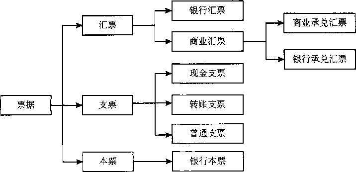

图3-1我国的票据分类

### 3.9.19. （二）票据当事人

票据当事人是指在票据法律关系中，享有票据权利、承担票据义务的主体。票据当事人分为`基本`当事人和`非基本`当事人。票据基本当事人是指在票据作成和交付时就已经存在的当事人，包括出票人、付款人和收款人。汇票和支票的基本当事人有出票人、收款人与付款人；`本票`的基本当事人有出票人与收款人。

#### 3.9.19.22. 1.基本当事人。

（1）出票人，是指依法定方式签发票据并将票据交付给收款人的人。银行汇票的出票人为银行；商业汇票的出票人为银行以外的企业和其他组织；银行本票的出票人为出票银行；支票的出票人，为在银行开立`支票存款账户`的企业、其他组织和个人。

（2）付款人，是指由出票人委托付款或自行承担付款责任的人。商业承兑汇票的付款人是合同中应给付款项的一方当事人，也是该汇票的承兑人；银行承兑汇票的付款人是承兑银行；支票的付款人是出票人的开户银行。

（3）收款人，是指票据正面记载的到期后有权收取票据所载金额的人。

#### 3.9.19.23. 2.非基本当事人。

非基本当事人是指在票据作成并交付后，通过一定的`票据行为`加入票据关系而享有一定权利、承担一定义务的当事人，包括承兑人、背书人、被背书人、保证人等。

（1）承兑人，是指接受汇票出票人的付款委托，同意承担支付票款义务的人，是汇票主债务人。

（2）背书人与被背书人。背书人是指在转让票据时，在票据背面或粘单上签字或盖章，并将该票据交付给受让人的票据收款人或持有人。被背书人是指被记名受让票据或接受票据转让的人。背书后，被背书人成为票据新的持有人，享有票据的所有权利。

（3）保证人，是指为票据债务提供`担保`的人，由票据债务人以外的第三人担当。保证人在被保证人不能履行票据责任时，以`自己的`资金履行票据责任，然后取得持票人的权利，向票据债务人`追索`。

### 3.9.20. （三）票据的特征和功能

#### 3.9.20.24. 1.票据的特征。

（1）票据是“完全有价证券”，即票据权利完全证券化，票据权利与票据本身融为一体、不可分离，也就是说，票据权利的产生、行使、转让和消灭都离不开票据。完全有价证券这一特征可以通过票据的“设权证券”“提示证券”“交付证券”和“缴回证券”等特征来体现：

首先，票据权利的产生必须通过作成票据，即必须通过票据行为——`岀票`来创设,从这一意义上说，票据又是“设权证券”。

其次，票据权利的享有必须以`占有`票据为前提，为了证明占有的事实以行使票据权利，必须提示票据，从这一意义上说，票据又是“提示证券”。

再次，票据权利的转让必须`交付`票据，从这一意义上说，票据又是“交付证券”。

最后，票据权利实现之后，应将票据`缴回`付款人，以消灭票据权利义务关系或者付款人再行使追索权，从这一意义上说，票据又是“缴回证券”，被追索人清偿债务时，持票人应当交出票据和有关拒绝证明。

（2）票据是“文义证券”，即票据上的一切票据权利义务必须严格依照票据记载的文义而定，文义之外的任何理由、事项均不得作为根据，即使文义记载有错，也不得用票据之外的其他证明方法变更或补充。

（3）票据是“无因证券”，即票据如果符合《票据法》规定的条件，票据权利就成立，持票人不必证明取得票据的原因，仅以票据`文义`请求履行票据权利。但当票据债务人根据《票据法》第十二条的规定，认为持票人是以欺诈、偷盗或者胁迫等手段取得票据，或者明知有上述情形出于恶意取得票据，或者因为重大过失取得票据，`持票人`应当对自己持票的合法性负责`举证`。

（4）票据是“金钱债权证券”，即票据上体现的权利性质是`财产权`而不是其他权利，财产权的内容是请求支付一定的`金钱`而不是物品。

（5）票据是“要式证券”，即票据的制作、形式、文义都有规定的`格式`和要求，必须符合《票据法》的规定。

（6）票据是“流通证券”，即票据可以`流通`转让，只有流通转让，票据的功能才能充分发挥，衔接企业的产供销活动，畅通经济金融运行，因此，票据贵在流通。与一般财产权相比，票据权利的转让灵活简便，无须通知债务人，通过`背书行为`直接转让。

#### 3.9.20.25. 2.票据的功能。

（1）`支付`功能，即票据可以充当支付工具，代替`现金`使用。对于当事人来讲，用票据支付可以消除现金携带的不便，克服点钞的麻烦，节省计算现金的时间。

（2）`汇兑`功能，即票据可以代替货币在不同地方之间运送，方便异地之间的支付。如果异地之间使用货币，需要运送或携带，不仅费时费力，而且也不安全。大额货币的运送更是如此。如果只拿着一张票据到异地支付，相对而言既安全又方便。

（3）`信用`功能，即票据当事人可以凭借自己的信誉，将未来才能获得的金钱作为现在的金钱来使用。例如，甲企业购买乙企业货物，甲企业暂时款项不足，便凭借自己的信誉签发了一张以“乙企业”为收款人、以自己的开户银行为付款人，约定3个月后付款的票据给乙企业。此时，甲企业实际上是将3个月后才能筹足的款项用于现在使用。

（4）`结算`功能，即债务`抵销`功能。简单的结算是互有债务的双方当事人各签发一张本票，待两张本票都到到期日可以相互抵销债务。若有差额，由一方以现金支付。

（5）`融资`功能，即融通资金或调度资金。票据的融资功能是通过票据的`贴现`、转贴现和再贴现实现的。

## 3.10. 二、票据权利与责任

### 3.10.21. （一）票据权利的概念和分类

票据权利是指票据`持票人`向票据`债务人`请求支付票据金额的权利，包括付款请求权和追索权。

`付款请求权`是指持票人向汇票的承兑人、本票的出票人、支票的付款人出示票据要求付款的权利，是`第一`顺序权利。行使付款请求权的持票人可以是票据记载的收款人或最后的被背书人；担负付款义务的主要是主债务人。

票据`追索权`是指票据当事人行使付款请求权遭到`拒绝`或有其他法定原因存在时，向其`前手`请求偿还票据金额及其他法定费用的权利，是`第二`顺序权利。行使追索权的当事人除票据记载的收款人和最后被背书人外，还可能是代为清偿票据债务的保证人、背书人。

持票人可以`不`按照票据债务人的先后顺序，对其中任何一人、数人或者全体行使追索权。持票人对票据债务人中的一人或者数人已经进行追索的，对其他票据债务人`仍`可以行使追索权。被追索人清偿债务后，与持票人享有同一权利。

### 3.10.22. （二）票据权利的取得

1.基本规定。签发、取得和转让票据，应当遵守`诚实信用`的原则，具有真实的交易关系和债权债务关系。票据的取得，必须给付`对价`，即应当给付票据双方当事人认可的相对应的代价。但也有例外的情形，即如果是因为税收、继承、赠与可以依法无偿取得票据的，则不受给付对价的限制，但是所享有的票据权利不得优于其前手的权利。

2.取得票据享有票据权利的情形：（1）依法`接受`出票人签发的票据；（2）依法接受`背书`转让的票据；（3）因税收、继承、赠与可以依法`无偿`取得票据。

取得票据不享有票据权利的情形：（1）以`欺诈`、偷盗或者胁迫等手段取得票据的，或者明知有上述情形，出于`恶意`取得票据的；（2）持票人因`重大过失`取得不符合《票据法》规定的票据的。

### 3.10.23. （三）票据权利的行使与保全

票据权利的行使是指持票人请求票据的付款人`支付`票据金额的行为，例如行使付款请求权以获得票款，行使追索权以请求清偿法定的金额和费用等。票据权利的`保全`是指持票人为了防止票据权利的丧失而釆取的措施，例如依据《票据法》的规定，按照规定期限提示承兑、要求承兑人或付款人提供拒绝承兑或拒绝付款的证明以保全追索权等。

票据权利的保全行为大都又是票据权利的行使行为，所以《票据法》通常都将二者一并进行规定。票据权利行使和保全的方法通常包括`“按期提示”`和`“依法证明”`两种。“按期提示”是指要按照规定的期限向票据债务人提示票据，包括提示承兑或提示付款，以及时保全或行使追索权。例如《票据法》第四十条规定，“`汇票`未按照规定期限提示承兑的，持票人丧失对其`前手`的追索权”；第七十九条规定，“`本票`的持票人未按照规定期限提示见票的，丧失对出票人以外的`前手`的追索权”。“依法证明”是指持票人为了证明自己曾经依法行使票据权利而遭拒绝或者根本无法行使票据权利而以法律规定的时间和方式取得相关的证据，例如《票据法》第六十五条规定：“持票人不能出示拒绝证明、退票理由书或者未按照规定期限提供其他合法证明的，丧失对其`前手`的追索权。”

对于票据权利行使和保全的地点和时间，《票据法》统一规定为：“持票人对票据债务人行使票据权利，或者保全票据权利，应当在票据当事人的`营业场所`和营业时间内进行，票据当事人无营业场所的，应当在其`住所`进行。”

### 3.10.24. （四）票据权利丧失补救

票据丧失是指票据因灭失（如不慎被烧毁）、遗失（如不慎丢失）、被盗等原因而使票据权利人脱离其对票据的占有。票据一旦丧失，票据的债权人不采取措施补救就不能阻止债务人向拾获者履行义务，从而造成正当票据权利人经济上的损失。因此，需要进行票据丧失的`补救`。票据丧失后，可以采取挂失止付、公示催告和普通诉讼三种形式进行补救。

#### 3.10.24.26. 1.挂失止付。

挂失止付是指失票人将丧失票据的情况通知付款人或代理付款人，由接受通知的付款人或代理付款人审查后`暂停`支付的一种方式。只有确定付款人或代理付款人的票据丧失时才可进行挂失止付，具体包括已承兑的商业汇票、支票、填明“现金”字样和代理付款人的银行汇票以及填明“现金”字样的银行本票四种。挂失止付并不是票据丧失后采取的必经措施，而只是一种暂时的预防措施，最终要通过申请公示催告或提起普通诉讼来补救票据权利。具体程序为：

（1）`申请`。失票人需要挂失止付的，应填写挂失止付通知书并签章。挂失止付通知书应当记载下列事项：①票据丧失的时间、地点、原因；②票据的种类、号码、金额、出票日期、付款日期、付款人名称、收款人名称；③挂失止付人的姓名、营业场所或者住所以及联系方法。欠缺上述记载事项之一的，银行不予受理。

（2）`受理`。付款人或者代理付款人收到挂失止付通知书后，查明挂失票据确未付款时，应`立即暂停`支付。付款人或者代理付款人自收到挂失止付通知书之日起`12日内`没有收到人民法院的止付通知书的，自第13日起，不再承担止付责任，持票人提示付款即依法向持票人付款。付款人或者代理付款人在收到挂失止付通知书之前，已经向持票人付款的，不再承担责任。但是，付款人或者代理付款人以`恶意`或者`重大过失`付款的除外。承兑人或者承兑人开户行收到挂失止付通知或者公示催告等司法文书并确认相关票据未付款的，应当于当日依法`暂停支付`并在中国人民银行指定的票据市场基础设施（上海票据交易所）`登记`或者委托开户行在票据市场基础设施登记相关信息。

#### 3.10.24.27. 2.公示催告。

公示催告是指在票据丧失后由`失票人`向人民法院提出申请，请求人民法院以`公告`方式通知不确定的利害关系人限期`申报权利`，逾期未申报者，则权利失效，而由法院通过除权判决宣告所丧失的票据无效的制度或程序。根据《票据法》的规定，失票人应当在通知挂失止付后的`3日内`，也可以在票据丧失后，依法向票据支付地人民法院申请公示催告。申请公示催告的主体必须是可以背书转让的票据的最后持票人。具体程序为：

（1）`申请`。失票人申请公示催告的，应填写公示催告申请书，申请书应当载明下列内容：①票面金额；②出票人、持票人、背书人；③申请的理由、事实；④通知票据付款人或者代理付款人挂失止付的时间；⑤付款人或者代理付款人的名称、通信地址、电话号码等。

（2）`受理`。人民法院决定受理公示催告申请，应当同时通知付款人及代理付款人停止支付，并自立案之日起`3日内`发出公告，催促利害关系人申报权利。付款人或者代理付款人收到人民法院发出的止付通知，应当立即停止支付，直至公示催告程序终结。非经发出止付通知的人民法院许可，擅自解付的，不得免除票据责任。例如，某基层法院在《人民法院报》上刊登一则公示催告，公告甲银行网点承兑的一张300万元的银行承兑汇票丢失，公告期间为2018年3月1日至5月1日；4月3日，该网点突然收到异地乙银行网点发来的该银行承兑汇票的委托收款，此时由于恰好在公示催告期间，甲银行网点不能对委托收款发来的银行承兑汇票付款，只能根据人民法院的止付通知要求拒绝付款。

（3）`公告`。人民法院决定受理公示催告申请后发布的公告应当在`全国性`的报刊上登载。公示催告的期间，国内票据自公告发布之日起`60日`，涉外票据可根据具体情况适当延长，但最长不得超过`90日`。在公示催告期间，转让票据权利的行为`无效`，以公示催告的票据质押、贴现，因质押、贴现而接受该票据的持票人主张票据权利的，人民法院不予支持，但公示催告期间届满以后人民法院作出除权判决以前`取得`该票据的除外。

（4）`判决`。利害关系人应当在公示催告期间向人民法院申报。人民法院收到利害关系人的申报后，应当裁定`终结`公示催告程序，并通知申请人和支付人。申请人或者申报人可以向人民法院起诉，以主张自己的权利。没有人申报的，人民法院应当根据申请人的申请，作出除权判决，宣告票据`无效`。判决应当公告，并通知支付人。自判决`公告`之日起，申请人有权向支付人请求支付。利害关系人因正当理由不能在判决前向人民法院申报的，自知道或者应当知道判决公告之日起`1年内`，可以向作出判决的人民法院起诉。

#### 3.10.24.28. 3.普通诉讼。

普通诉讼是指以丧失票据的人为原告，以承兑人或岀票人为被告，请求人民法院判决其向失票人`付款`的诉讼活动。如果与票据上的权利有利害关系的人是明确的，无须公示催告，可按一般的票据纠纷向人民法院提起诉讼。

【例3-4】下列表述中，正确的是（）。

A.申请公示催告必须先申请挂失止付

B.办理挂失止付应有确定的“付款人”，因此未填明代理付款人的银行汇票不得挂失止付

C.银行网点营业时间终止后，因为紧急情况可以到该银行网点负责人的家中提示付款

D.公示催告可以在当地晚报上刊发

【解析】答案为B。挂失止付不是公示催告的必经程序，因此选项A说法错误；行使和保全票据权利，应当在票据当事人的营业场所和营业时间内进行，故选项C不正确；公示催告应在全国性的报刊上刊登，故选项D不正确。

### 3.10.25. （五）票据权利时效

票据权利`时效`是指票据权利在时效期间内不行使，即引起票据权利丧失（见表3-1）。《票据法》根据不同情况，将票据权利时效划分为`2年`、`6个月`、`3个月`。《票据法》规定，票据权利在下列期限内不行使而`消灭`：

1.持票人对票据的出票人和承兑人的权利自票据`到期日`起2年。见票即付的汇票、本票自`出票日`起2年。

2.持票人对`支票`出票人的权利，自`出票日`起6个月。

之所以规定支票的权利时效短于其他票据，是因为支票主要是一种`短期`支付工具,其权利的行使以迅速为宜，规定较短的时效，可以`督促`权利人及时行使票据权利。

3.持票人对前手的追索权，自被`拒绝`承兑或者被拒绝付款之日起6个月。

4.持票人对前手的再追索权，自`清偿日`或者被提起`诉讼之日`起3个月。

表`3-1`持票人票据权利时效对照

| 票据种类 | 对出票人的权利    | 对承兑人的权利    | 对前手的追索权                   | 对前手的再追索权     |
|----------|-------------------|-------------------|----------------------------------|----------------------|
| 支票     | 自出票日起6个月   | \*                | 被拒绝付款日起6个月              |                      |
| 银行汇票 | 自出票日起2年     | \*                | 被拒绝付款日起6个月              | 自清偿日或被提起诉讼 |
| 银行本票 | 自出票日起2年     | \*                | 被拒绝付款日起6个月              | 之日起3个月          |
| 商业汇票 | 自票据到期日起2年 | 自票据到期日起2年 | 被拒绝承兑或被拒 绝付款日起6个月 |                      |

追索权的行使以获得拒绝付款`证明`或退票理由书等有关证明为前提。为了督促持票人及时获得这些证明，尽可能地在短期内结清因拒绝承兑或拒绝付款而产生的债务关系，从速实现持票人的票据权利，加快债权债务关系的清偿速度，促进社会经济关系的稳定，追索权的行使应当迅速及时。因此，《票据法》对于追索权规定了较短的时效。

如果持票人因超过票据权利时效或者因票据记载事项欠缺而丧失票据权利的，《票据法》为了保护持票人的合法权益，规定其仍享有`民事权利`，可以请求出票人或者承兑人返还其与未支付的票据款金额相当的利益。

【例3-5】下列说法中，正确的是（）。

A.票据权利时效期间是指提示付款期间

B.持票人对支票出票人的权利，自出票日起3个月

C.持票人对前手的再追索权，自清偿日或者被提起诉讼之日起3个月

D.持票人对前手的追索权，自被拒绝承兑或者被拒绝付款之日起3个月

【解析】答案为C。票据权利时效期间和提示付款期间是两个概念，应仔细辨别，故选项A错误；选项B和选项D分别应为6个月。

### 3.10.26. （六）票据责任

票据责任是指票据债务人向持票人`支付`票据金额的义务。实务中，票据债务人承担票据义务一般有四种情况：一是汇票承兑人因`承兑`而应承担付款义务；二是本票出票人因`出票`而承担自己付款的义务；三是支票付款人在与出票人有资金关系时承担付款义务；四是汇票、本票、支票的背书人，汇票、支票的出票人、保证人，在票据不获承兑或不获付款时的付款清偿义务。

1.提示付款。持票人应按规定期限提示付款（见表3-2）：持票人未按照规定期限提示付款的，在作出说明后，承兑人或者付款人仍应当继续对持票人承担付款责任。通过委托收款银行或者通过票据交换系统向付款人提示付款的，`视同`持票人提示付款。本票持票人未按照规定提示付款的，丧失对出票人以外的`前手`的追索权；支票持票人超过提示付款期限提示付款的，`付款人`可以不予付款，付款人不予付款的，出票人仍应对持票人承担票据责任。

表3-2 票据的提示付款期限

| 票据种类 | 提示付款期限              |
|----------|---------------------------|
| 支票     | 自出票日起10日            |
| 商业汇票 | 自票据到期日起10日        |
| 银行汇票 | 自出票日起1个月           |
| 银行本票 | 自出票日起最长不超过2个月 |

2.付款人付款。持票人依照规定提示付款的，付款人必须在`当日`足额付款。付款人及其代理付款人付款时，应当`审查`票据背书的连续，并审查提示付款人合法身份证明或者有效证件。票据金额为外币的，按照付款日的市场汇价，以`人民币`支付。票据当事人对票据支付的货币种类另有约定的，从其约定。

3.拒绝付款。如果存在背书不连续等合理事由，票据债务人可以对票据债权人拒绝履行义务，这就是所谓的票据“抗辩”。票据债务人可以对不履行约定义务的与自己有`直接`债权债务关系的持票人进行抗辩。但不得以自己与出票人或者与持票人的前手之间的抗辩事由，对抗持票人。当然，若持票人`明知`存在抗辩事由而取得票据的除外。

4.获得付款。持票人获得付款的，应当在票据上`签收`，并将票据交给付款人。持票人委托银行收款的，受委托的银行将代收的票据金额转账收入持票人账户，视同签收。电子商业汇票的持票人可委托接入机构即银行代为发出提示付款、逾期提示付款行为申请。

5.相关银行的责任。持票人委托的收款银行的责任，限于按照票据上记载事项将票据金额转入持票人账户。付款人委托的付款银行的责任，限于按照票据上记载事项从付款人账户支付票据金额。付款人及其代理付款人以恶意或者有重大过失付款的，应当自行承担责任。对定日付款、出票后定期付款或者见票后定期付款的票据，付款人在到期日前付款的，由付款人自行承担所产生的责任。

6.票据责任解除。付款人依法足额付款后，`全体`票据债务人的责任解除。

【例3-6】下列说法中，正确的是（）。

A.票据债务人可以以自己与出票人或者与持票人的前手之间的抗辩事由，对抗持票人

B.持票人未按照规定期限提示付款的，付款人的票据责任解除

C.持票人委托的收款银行的责任，限于按照票据上记载事项将票据金额转入持票人账户

D.付款人委托的付款银行的责任，限于按照票据上记载事项从付款人账户支付票据金额，不必审查背书连续

【解析】答案为C。票据债务人不得以自己与出票人或者与持票人的前手之间的抗辩事由，对抗持票人，故选项A错误；持票人未按照规定期限提示付款的，在作出相关说明后，付款人仍应当承担付款责任，而不能因此解除付款责任，故选项B错误；付款银行付款，应按照规定审查背书是否连续，背书不连续，持票人不享有票据权利，因此不应予以付款，因此选项D错误。

## 3.11. 三、票据行为

票据行为是指票据当事人以发生`票据债务`为目的的、以在票据上`签名`或盖章为权利义务成立要件的法律行为。票据行为包括`出票`、`背书`、`承兑`和`保证`。

### 3.11.27. （一）出票

1.出票的概念。出票是指出票人`签发`票据并将其`交付`给收款人的票据行为。出票包括两个行为：一是出票人依照《票据法》的规定作成票据，即在原始票据上记载法定事项并签章；二是交付票据，即将作成的票据交付给他人占有。这两者缺一不可。

2.出票的基本要求。出票人必须与付款人具有真实的委托付款关系，并且具有支付票据金额的可靠资金来源，不得签发无对价的票据用以骗取银行或者其他票据当事人的资金。

3.票据的记载事项。出票人和其他票据行为当事人在票据上的记载事项必须符合《票据法》等的规定。所谓票据记载事项是指依法在票据上记载的票据相关内容。票据记载事项一般分为`必须`记载事项、`相对`记载事项、`任意`记载事项和记载不产生票据法上效力的事项等。必须记载事项，也称必要记载事项，是指《票据法》明文规定必须记载的，如不记载，票据行为即为无效的事项。

相对记载事项是指除了必须记载事项外，《票据法》规定的其他应记载的事项，这些事项如果未记载，由法律另作相应规定予以明确，并不影响票据的效力。例如，《票据法》规定背书由背书人签章并记载背书日期。背书未记载日期的，视为在票据`到期日前`背书。这里的“背书日期”就属于相对记载事项；未记载背书日期的，《票据法》视同背书日期为“到期日前”。

任意记载事项是指《票据法》不强制当事人必须记载而允许当事人自行选择，不记载时不影响票据效力，记载时则产生票据效力的事项。如岀票人在汇票记载`“不得转让”`字样的，汇票不得转让，其中的“不得转让”事项即为任意记载事项。

记载不产生《票据法》上的效力的事项是指除了必须记载事项、相对记载事项、任意记载事项外，票据上还可以记载其他一些事项，但这些事项不具有票据效力，银行不负审查责任。如《票据法》第二十四条规定：“汇票上可以记载本法规定事项以外的其他岀票事项，但是该记载事项不具有汇票上的效力。”

4.岀票的`效力`。票据出票人制作票据，应当按照法定条件在票据上签章，并按照所记载的事项承担票据责任。出票人签发票据后，即承担该票据承兑或付款的责任。出票人在票据得不到承兑或者付款时，应当向持票人清偿《票据法》第七十条、第七十一条规定的金额和费用（具体见后文票据追索的内容）。

【例3-7】下列票据记载事项中，属于相对记载事项的有（）。

A.背书日期B.承兑日期

C.保证日期D.出票日期

【解析】答案为ABC。以上选项A、选项B、选项C在没有记载时，《票据法》均作出了推定，而选项D是《票据法》明文规定必须记载的事项。

### 3.11.28. （二）背书

#### 3.11.28.29. 1.概念和种类。

背书是在票据背面或者粘单上记载有关事项并签章的行为。以背书的目的为标准，将背书分为`转让`背书和`非转让`背书。转让背书是指以转让票据权利为目的的背书；非转让背书是指以授予他人行使一定的票据权利为目的的背书。非转让背书包括委托收款背书和质押背书。

委托收款背书是背书人委托被背书人行使票据权利的背书。委托收款背书的被背书人有权代背书人行使被委托的票据权利。但是，被背书人不得再以背书转让票据权利。质押背书是以担保债务而在票据上设定质权为目的的背书。被背书人依法实现其`质权`时，可以行使票据权利。

#### 3.11.28.30. 2.背书记载事项。

背书由背书人签章并记载背书日期。背书未记载日期的，视为在票据`到期日前`背书。以背书转让或者以背书将一定的票据权利授予他人行使时，必须记载`被背书人`名称。背书人未记载被背书人名称即将票据交付他人的，持票人在票据被背书人栏内记载自己的名称与背书人记载具有`同等`法律效力。

委托收款背书应记载`“委托收款”`字样、被背书人和背书人`签章`。质押背书应记载`“质押”`字样、质权人和出质人`签章`。

票据凭证不能满足背书人记载事项的需要，可以加附`粘单`，粘附于票据凭证上。粘单上的第一记载人，应当在票据和粘单的粘接处`签章`。

#### 3.11.28.31. 3.背书效力。

背书人以背书转让票据后，即承担保证其后手所持票据承兑和付款的责任。

以背书转让的票据，背书应当`连续`。持票人以背书的连续，证明其票据权利；非经背书转让，而以其他合法方式取得票据的，依法举证，证明其票据权利。

背书连续，是指在票据转让中，转让票据的背书人与受让票据的被背书人在票据上的签章依次`前后衔接`。具体来说，第一背书人为票据`收款人`，最后持票人为最后背书的被背书人，中间的背书人为前手背书的被背书人。

#### 3.11.28.32. 4.背书特别规定。

包括条件背书、部分背书、限制背书和期后背书。条件背书是指背书附有条件，背书时附有条件的，所附条件不具有票据上的效力。部分背书是指将票据金额的一部分转让的背书或者将票据金额分别转让给两人以上的背书，部分背书属于`无效`背书。限制背书是指记载了“不得转让”，此时票据不得转让，例如出票人记载“不得转让”的，票据不得背书转让；背书人在票据上记载`“不得转让”`字样，其后手再背书转让的，原背书人对后手的被背书人不承担保证责任。`期后`背书是指票据被拒绝承兑、被拒绝付款或者超过付款提示`期限`的，不得背书转让；背书转让的，`背书人`应当承担票据责任。

### 3.11.29. （三）承兑

1.承兑的概念。承兑是指汇票付款人`承诺`在汇票到期日支付汇票金额并签章的行为，仅适用于商业汇票。

2.承兑程序包括`提示`承兑、`受理`承兑、`记载`承兑事项等。

（1）提示承兑。持票人向付款人`出示`汇票，并要求付款人承诺付款的行为。定日付款或者出票后定期付款的汇票，持票人应当在汇票`到期日前`向付款人提示承兑。`见票后`定期付款的汇票，持票人应当自出票日起`1个月内`向付款人提示承兑。汇票未按照规定期限提示承兑的，持票人丧失对其前手的`追索权`。

（2）受理承兑。付款人收到持票人提示承兑的汇票时，应当向持票人签发收到汇票的`回单`。回单上应当记明汇票提示承兑日期并签章。付款人对向其提示承兑的汇票，应当自收到提示承兑的汇票之日起`3日内`承兑或者拒绝承兑。

（3）记载承兑事项。付款人承兑汇票的，应当在汇票正面记载`“承兑”`字样和承兑日期并签章；见票后定期付款的汇票，应当在承兑时记载`付款日期`。汇票上未记载承兑日期的，应当以收到提示承兑的汇票之日起`3日内`的最后一日为承兑日期。

承兑效力。付款人承兑汇票，不得附有条件；承兑附有条件的，视为`拒绝`承兑。付款人承兑汇票后，应当承担到期付款的责任。

### 3.11.30. （四）保证

#### 3.11.30.33. 1.保证的概念。

保证是指票据债务人以外的人，为担保特定债务人履行票据债务而在票据上记载有关事项并签章的行为。

`国家机关`、以`公益`为目的的事业单位、社会`团体`、企业法人的`分支机构`和职能部门作为票据保证人的，票据保证`无效`，但经国务院批准为使用外国政府或者国际经济组织贷款进行转贷，国家机关提供票据保证的，以及企业法人的分支机构在法人`书面授权`范围内提供票据保证的除外。

#### 3.11.30.34. 2.保证的记载事项。

保证人必须在票据或者粘单上记载下列事项：表明`“保证”`的字样；保证人名称和住所；被保证人的名称；保证日期；保证人签章。

保证人在票据或者粘单上未记载“被保证人名称”的，已承兑的票据，承兑人为被保证人；未承兑的票据，出票人为被保证人。保证人在票据或者粘单上未记载“保证日期”的，出票日期为保证日期（见表3-3）。

#### 3.11.30.35. 3.保证责任的承担。

被保证的票据，保证人应当与被保证人对持票人承担`连带责任`。票据到期后得不到付款的，持票人有权向保证人请求付款，保证人应当足额付款。保证人为两人以上的，保证人之间承担`连带责任`。

#### 3.11.30.36. 4.保证效力。

保证人对合法取得票据的持票人所享有的票据权利，承担保证责任。但是，被保证人的债务因票据记载事项欠缺而`无效`的除外。保证不得附有条件，附有条件的，不影响对票据的保证责任。保证人清偿票据债务后，可以行使持票人对被保证人及其前手的`追索权`。

表3-3 票据行为未记载日期的法律后果对照表

| 票据行为 | 法律后果                                           |
|----------|----------------------------------------------------|
| 岀票     | 票据无效                                           |
| 背书     | 视为票据到期前背书                                 |
| 保证     | 出票日期为保证日期                                 |
| 承兑     | 以收到提示承兑的汇票之日起3日内的最后1日为承兑日期 |

## 3.12. 四、票据追索

### 3.12.31. （一）票据追索适用的情形

票据追索适用于两种情形，分别为到期后追索和到期前追索。

`到期后`追索，是指票据到期被`拒绝`付款的，`持票人`对背书人、出票人以及票据的其他债务人行使的追索。

`到期前`追索，是指票据到期日前，持票人对下列情形之一行使的追索：（1）汇票被`拒绝`承兑的；（2）承兑人或者付款人`死亡`、逃匿的；（3）承兑人或者付款人被依法宣告`破产`的或者因违法被责令终止业务活动的。

### 3.12.32. （二）被追索人的确定

票据的出票人、背书人、承兑人和保证人对持票人承担连带责任。持票人行使追索权，可以不按照票据债务人的先后顺序，对其中任何一人、数人或者全体行使追索权。持票人对票据债务人中的一人或者数人已经进行追索的，对其他票据债务人仍可以行使追索权。

### 3.12.33. （三）追索的内容

1.持票人行使追索权，可以请求被追索人支付下列金额和费用：（1）被拒绝付款的`票据金额`；（2）票据金额自到期日或者提示付款日起至清偿日止，按照中国人民银行规定的利率计算的`利息`；（3）取得有关拒绝证明和发出通知书的`费用`。被追索人清偿债务时，持票人应当交出票据和有关拒绝证明，并出具所收到利息和费用的收据。

2.被追索人依照前述规定清偿后，可以向其他票据债务人行使`再追索权`，请求其他票据债务人支付下列金额和费用：（1）已清偿的全部`金额`；（2）前项金额自清偿日起至再追索清偿日止，按照中国人民银行规定的利率计算的`利息`；（3）发出通知书的`费用`。行使再追索权的被追索人获得清偿时，应当交出票据和有关拒绝证明，并出具所收到利息和费用的收据。

### 3.12.34. （四）追索权的行使

1.获得有关`证明`。持票人行使追索权时，应当提供被拒绝承兑或者拒绝付款的有关证明。持票人提示承兑或者提示付款被拒绝的，承兑人或者付款人必须出具拒绝证明，或者出具退票理由书。未出具拒绝证明或者退票理由书的，应当承担由此产生的民事责任。其中“拒绝证明”应当包括下列事项：（1）被拒绝承兑、付款的票据的种类及其主要记载事项；（2）拒绝承兑、付款的事实依据和法律依据；（3）拒绝承兑、付款的时间；（4）拒绝承兑人、拒绝付款人的签章。“退票理由书”应当包括下列事项：（1）所退票据的种类；（2）退票的事实依据和法律依据；（3）退票时间；（4）退票人签章。

持票人因承兑人或者付款人死亡、逃匿或者其他原因，不能取得拒绝证明的，可以依法取得其他有关证明，包括医院或者有关单位出具的承兑人、付款人死亡的证明；司法机关出具的承兑人、付款人逃匿的证明；公证机关出具的具有拒绝证明效力的文书。

承兑人或者付款人被人民法院依法宣告破产的，人民法院的有关`司法文书`具有拒绝证明的效力。承兑人或者付款人因违法被责令终止业务活动的，有关行政主管部门的`处罚决定`具有拒绝证明的效力。

持票人不能出示拒绝证明、退票理由书或者未按照规定期限提供其他合法证明的，`丧失`对其前手的`追索权`。但是，承兑人或者付款人仍应当对持票人承担责任。

2.行使追索。持票人应当自收到被拒绝承兑或者被拒绝付款的有关证明之日起`3日内`，将被拒绝事由书面通知其`前手`；其前手应当自收到通知之日起`3日内`书面通知其`再前手`。持票人也可以`同时`向各票据债务人发出书面通知，该书面通知应当记明汇票的主要记载事项，并说明该汇票已被退票。

未按照规定期限通知的，持票人仍可以行使追索权。因延期通知给其前手或者出票人造成损失的，由没有按照规定期限通知的票据当事人，承担对该损失的赔偿责任，但是所赔偿的金额以`汇票金额`为限。在规定期限内将通知按照法定地址或者约定的地址邮寄的，`视为`已经发出通知。

### 3.12.35. （五）追索的效力

`被追索人`依照规定清偿债务后，其责任解除，与持票人享有同一权利。

## 3.13. 五、银行汇票

### 3.13.36. （一）银行汇票的概念和适用范围

银行汇票是出票`银行`签发的，由其在见票时按照实际结算金额无条件支付给收款人或者持票人的票据。出票银行为银行汇票的付款人。银行汇票可以用于`转账`，填明“现金”字样的银行汇票也可以用于支取现金。单位和个人各种款项结算，均可使用银行汇票，如图3-2和图3-3所示。

### 3.13.37. （二）银行汇票的出票

1.`申请`。申请人使用银行汇票，应向出票银行填写“银行汇票申请书”，填明`收款人`名称、汇票`金额`、申请人名称、申请日期等事项并`签章`，签章为其预留银行的签章。申请人和收款人均为个人，需要使用银行汇票向代理付款人支取现金的，申请人须在“银行汇票申请书”上填明代理付款人名称，在“出票金额”栏先填写`“现金”`字样,后填写汇票金额。申请人或者收款人为单位的，不得在“银行汇票申请书”上填明“现金”字样。

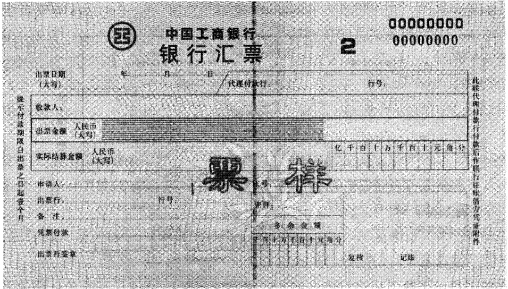

图3-2银行汇票（票样）

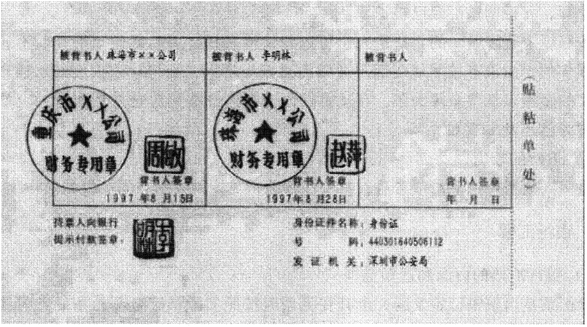

图3-3银行汇票背书

2.`签发`并交付。出票银行受理银行汇票申请书，收妥款项后签发银行汇票，并将银行汇票和解讫通知一并交给申请人。签发银行汇票必须记载下列事项：表明`“银行汇票”`的字样；无条件支付的`承诺`；出票`金额`；付款人`名称`；收款人`名称`；岀票`日期`；出票人`签章`。欠缺记载上列事项之一的，银行汇票无效。

签发`现金`银行汇票，申请人和收款人必须均为`个人`，收妥申请人交存的现金后，在银行汇票“出票金额”栏先填写`“现金”`字样，后填写出票金额，并填写代理付款人名称。申请人或者收款人为单位的，银行不得为其签发现金银行汇票。

申请人应将银行汇票和解讫通知一并交付给汇票上记明的收款人。收款人受理银行汇票时，应审查下列事项：（1）银行汇票和解讫通知是否`齐全`、汇票号码和记载的内容是否`一致`；（2）收款人是否确为`本单位`或本人；（3）银行汇票是否在`提示`付款期限内；

（4）必须记载的事项是否`齐全`；（5）出票人签章是否符合规定，大小写岀票金额是否`一致`；（6）出票金额、出票日期、收款人名称是否`更改`，更改的其他记载事项是否由原记载人签章`证明`。

### 3.13.38. （三）填写实际结算金额

收款人受理申请人交付的银行汇票时，应在出票金额以内，根据实际需要的款项办理结算，并将实际结算金额和多余金额准确、清晰地填入银行汇票和解讫通知的有关栏内。银行汇票的实际结算金额低于出票金额的，其多余金额由出票银行`退交`申请人。未填明实际结算金额和多余金额或实际结算金额超过出票金额的，银行不予受理。银行汇票的实际结算金额一经填写不得更改，更改实际结算金额的银行汇票无效。

### 3.13.39. （四）银行汇票背书

被背书人受理银行汇票时，除按照收款人接受银行汇票进行相应的审查外，还应审查下列事项：（1）银行汇票是否记载实际结算金额，有无更改，其金额是否超过出票金额；（2）背书是否连续，背书人签章是否符合规定，背书使用粘单的是否按规定签章；（3）背书人为个人的身份证件。

银行汇票的背书转让以不超过出票金额的`实际结算金额`为准。未填写实际结算金额或实际结算金额超过出票金额的银行汇票不得背书转让。

### 3.13.40. （五）银行汇票提示付款

银行汇票的提示付款期限自岀票日起`1个月`。持票人超过付款期限提示付款的，代理付款人不予受理。持票人向银行提示付款时，须同时提交银行汇票和解讫通知，缺少任何一联，银行不予受理。持票人超过期限向代理付款银行提示付款却不获付款的，须在票据权利时效内向出票银行作出说明，并提供本人身份证件或单位证明，持银行汇票和解讫通知向出票银行请求付款。

在银行开立存款账户的持票人向开户银行提示付款时，应在汇票背面“持票人向银行提示付款签章”处签章，签章须与预留银行签章相同，并将银行汇票和解讫通知、进账单送交开户银行。未在银行开立存款账户的个人持票人，可以向任何一家银行机构提示付款。提示付款时，应在汇票背面“持票人向银行提示付款签章”处签章，并填明本人身份证件名称、号码及发证机关，由其本人向银行提交身份证件及其复印件。

### 3.13.41. （六）银行汇票退款和丧失

申请人因银行汇票超过付款提示期限或其他原因要求退款时，应将银行汇票和解讫通知同时提交到出票银行。申请人为单位的，应出具该单位的证明；申请人为个人的，应岀具本人的身份证件。对于代理付款银行查询的要求退款的银行汇票，应在汇票提示付款期满后方能办理退款。出票银行对于转账银行汇票的退款，只能转入原申请人账户；对于符合规定填明“现金”字样银行汇票的退款，才能退付现金。申请人缺少解讫通知要求退款的，出票银行应于银行汇票提示付款期满`1个月`后办理。

银行汇票丧失，失票人可以凭人民法院出具的其享有票据权利的`证明`，向出票银行请求付款或退款。

## 3.14. 六、商业汇票

### 3.14.42. （一）商业汇票的概念、种类和适用范围

商业汇票是出票人签发的，委托付款人在指定日期无条件支付确定的金额给收款人或者持票人的票据。商业汇票按照承兑人的不同分为`商业承兑汇票`和`银行承兑汇票`，如图3-4、图3-5、图3-6所示。银行承兑汇票由银行承兑，商业承兑汇票由银行以外的付款人承兑。电子商业汇票是指出票人依托`上海票据交易所`电子商业汇票系统（以下简称“电子商业汇票系统”），以数据电文形式制作的，委托付款人在指定日期无条件支付确定的金额给收款人或者持票人的票据。电子银行承兑汇票由银行业金融机构、财务公司承兑；电子商业承兑汇票由金融机构以外的法人或其他组织承兑。商业汇票的付款人为承兑人。在银行开立`存款账户`的法人及其他组织之间的结算，才能使用商业汇票。

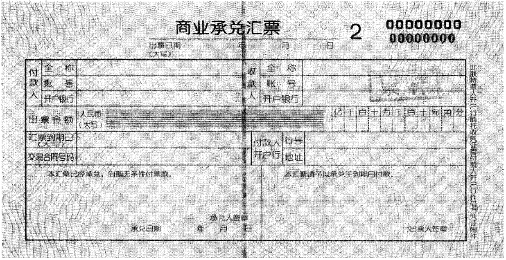

图3-4商业承兑汇票（票样）

### 3.14.43. （二）商业汇票的出票

#### 3.14.43.37. 1.出票人的资格条件。

商业承兑汇票的出票人，为在银行开立存款账户的法人以及其他组织，并与付款人具有真实的委托付款关系，具有支付汇票金额的可靠资金来源。银行承兑汇票的出票人必须是在承兑银行开立存款账户的法人以及其他组织，并与承兑银行具有真实的委托付款关系，资信状况良好，具有支付汇票金额的可靠资金来源。出票人办理电子商业汇票业务，还应同时具备签约开办对公业务的企业网银等电子服务渠道、与银行签订《电子商业汇票业务服务协议》。单张出票金额在`100万元`以上的商业汇票原则上应全部通过`电子商业汇票`办理；单张出票金额在`300万元`以上的商业汇票应全部通过`电子商业汇票`办理。

#### 3.14.43.38. 2.出票人的确定。

商业承兑汇票可以由`付款人`签发并承兑，也可以由`收款人`签发交由付款人承兑。银行承兑汇票应由在承兑银行开立存款账户的存款人签发。

#### 3.14.43.39. 3.出票的记载事项。

签发商业汇票必须记载下列事项：表明“商业承兑汇票”或“银行承兑汇票”的`字样`；无条件支付的`委托`；确定的`金额`；付款人`名称`；收款人`名称`；出票`日期`；出票人`签章`。欠缺记载上述事项之一的，商业汇票无效。其中，“出票人签章”为该单位的财务专用章或者公章加其法定代表人或其授权的代理人的签名或者盖章。电子商业汇票信息以电子商业汇票系统的`记录`为准。电子商业汇票出票必须记载下列事项：表明“电子银行承兑汇票”或“电子商业承兑汇票”的字样；无条件支付的委托；确定的金额；出票人名称；付款人名称；收款人名称；出票日期；票据到期日；出票人签章。

商业汇票的付款期限记载有三种形式：定日付款的汇票付款期限自出票日起计算，并在汇票上记载具体的到期日。出票后定期付款的汇票付款期限自出票日起按`月`计算，并在汇票上记载。见票后定期付款的汇票付款期限自承兑或拒绝承兑日起按`月`计算，并在汇票上记载。电子商业汇票的出票日是指出票人记载在电子商业汇票上的出票日期。

纸质商业汇票的付款期限，最长不得超过`6个月`。电子承兑汇票期限自出票日至到期日不超过`1年`。

### 3.14.44. （三）商业汇票的承兑

商业汇票可以在出票时向付款人提示承兑后使用，也可以在出票后先使用再向付款人提示承兑。付款人拒绝承兑的，必须出具拒绝承兑的证明。付款人承兑汇票后，应当承担到期付款的责任。

银行承兑汇票的岀票人或持票人向银行提示承兑时，银行的信贷部门负责按照有关规定和审批程序，对出票人的资格、资信、购销合同和汇票记载的内容进行认真审查，必要时可由出票人提供担保。对资信良好的企业申请电子商业汇票承兑的，金融机构可通过审查合同、发票等材料的影印件，企业电子签名的方式，对电子商业汇票的真实交易关系和债权债务关系进行在线审核。对电子商务企业申请电子商业汇票承兑的，金融机构可通过审查电子订单或电子发票的方式，对电子商业汇票的真实交易关系和债权债务关系进行在线审核。符合规定和承兑条件的，与岀票人签订承兑协议。银行承兑汇票的承兑银行，应按票面金额的一定比例向出票人收取手续费，银行承兑汇票手续费为市场调节价。

### 3.14.45. （四）票据信息登记与电子化

纸质票据`贴现`前，金融机构办理承兑、质押、保证等业务，应当不晚于业务办理的次一工作日在票据市场基础设施（即上海票据交易所，是中国人民银行指定的提供票据交易、登记托管、清算结算和信息服务的机构）完成相关信息`登记`工作。纸质商业承兑汇票完成承兑后，承兑人开户行应当根据承兑人委托代其进行承兑信息登记。承兑信息未能及时登记的，持票人有权要求承兑人补充登记承兑信息。纸质票据票面信息与登记信息不一致的，以纸质票据票面信息为准。电子商业汇票签发、承兑、质押、保证、贴现等信息应当通过电子商业汇票系统同步传送至票据市场基础设施。

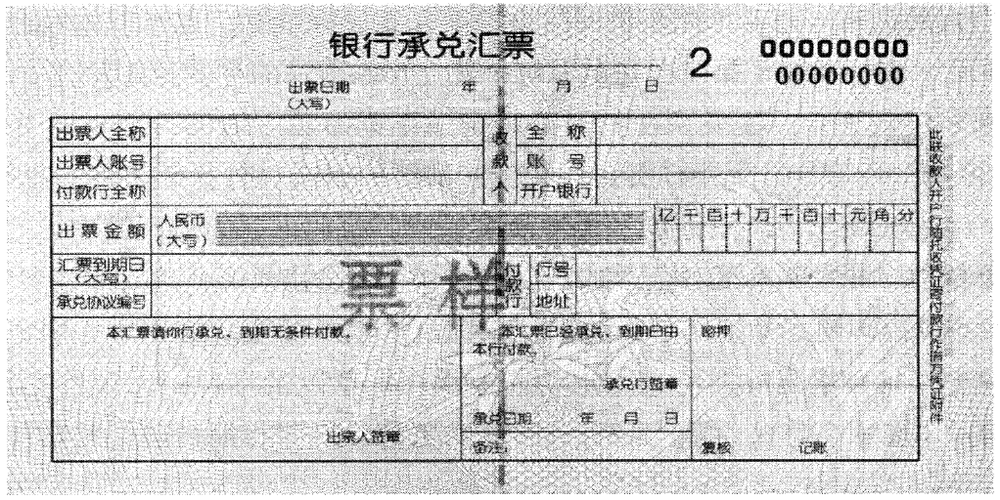

图3-5银行承兑汇票（票样）

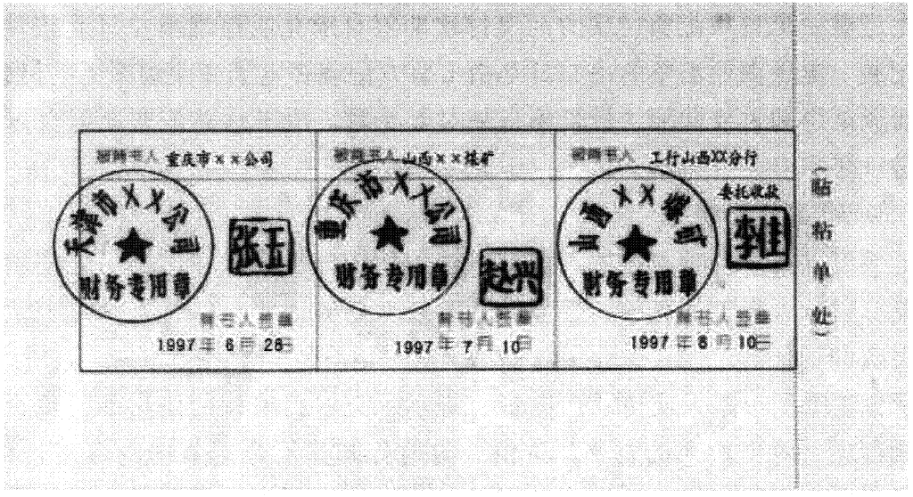

图3-6银行承兑汇票背书转让（票样）

### 3.14.46. （五）商业汇票的贴现

#### 3.14.46.40. 1.贴现的概念。

贴现是指票据持票人在票据`未到期前`为获得现金向银行贴付一定利息而发生的票据转让行为。贴现按照交易方式，分为`买断`式和`回购`式。

#### 3.14.46.41. 2.贴现的基本规定。

（1）贴现条件。商业汇票的持票人向银行办理贴现必须具备下列条件：票据未到期；票据未记载`“不得转让”`事项；在银行开立存款账户的企业法人以及其他组织；与出票人或者直接前手之间具有真实的商品交易关系。电子商业汇票贴现必须记载：贴出人名称；贴入人名称；贴现日期；贴现类型；贴现利率；实付金额；贴出人签章。

电子商业汇票回购式贴现赎回应作成`背书`，并记载原贴出人名称、原贴入人名称、赎回日期、赎回利率、赎回金额、原贴入人签章。

贴现人办理纸质票据贴现时，应当通过票据市场基础设施查询票据承兑信息，并在确认纸质票据必须记载事项与已登记承兑信息一致后，为贴现申请人办理贴现，贴现申请人无需提供合同、发票等资料；信息不存在或者纸质票据必须记载事项与已登记承兑信息不一致的，不得办理贴现。贴现人办理纸质票据贴现后，应当在票据上记载“已电子登记权属”字样，该票据不再以纸质形式进行背书转让、设立质押或者其他交易行为。贴现人应当对纸质票据妥善保管。已贴现票据应当通过票据市场基础设施办理背书转让、质押、保证、提示付款等票据业务。

贴现人可以按市场化原则选择商业银行对纸质票据进行保证增信。保证增信行对纸质票据进行保管并为贴现人的偿付责任进行先行偿付。

纸质票据贴现后，其保管人可以向承兑人发起付款确认。付款确认可以采用实物确认或者影像确认，两者具有同等效力。实物确认是指票据保管人将票据实物送达承兑人或者承兑人开户行，由承兑人在对票据真实性和背书连续性审查的基础上对到期付款责任进行确认。影像确认是指票据保管人将票据影像信息发送至承兑人或者承兑人开户行，由承兑人在对承兑信息和背书连续性审查的基础上对到期付款责任进行确认。承兑人要求实物确认的，银行承兑汇票保管人应当将票据送达承兑人，实物确认后，纸质票据由其`承兑人`代票据权利人妥善保管；商业承兑汇票保管人应当将票据通过承兑人开户行送达承兑人进行实物确认，实物确认后，纸质票据由商业承兑汇票`开户行`代票据权利人妥善保管。承兑人收到票据影像确认请求或者票据实物后，应当在`3个工作日`内作出或者委托其开户行作出同意或者拒绝到期付款的应答。拒绝到期付款的，应当说明理由。电子商业汇票一经`承兑`即视同承兑人已进行付款确认。

承兑人或者承兑人开户行进行付款确认后，除挂失止付、公示催告等合法抗辩情形外，应当在持票人提示付款后付款。

（2）贴现利息的计算。贴现的期限从其贴现之日起至汇票到期日止。实付贴现金额按票面金额扣除贴现日至汇票到期前1日的利息计算。承兑人在异地的纸质商业汇票，贴现的期限以及贴现利息的计算应另加3日的划款日期。

（3）贴现的收款。贴现到期，贴现银行应向付款人收取票款。不获付款的，贴现银行应向其前手追索票款。贴现银行追索票款时可从`申请人`的存款账户直接收取票款。办理电子商业汇票贴现以及提示付款业务，可选择票款对付方式或同城票据交换、通存通兑、汇兑等方式清算票据资金。

电子商业汇票当事人在办理回购式贴现业务时，应明确赎回开放日、赎回截止日。

### 3.14.47. （六）票据交易

票据交易包括转贴现、质押式回购和买断式回购等。

转贴现是指卖出方将未到期的已贴现票据向买入方转让的交易行为。

质押式回购是指正回购方在将票据`出质`给逆回购方融入资金的同时，双方约定在未来某一日期，由正回购方按约定金额向逆回购方返还资金、逆回购方向正回购方返还原出质票据的交易行为。

买断式回购是指正回购方将票据`卖给`逆回购方的同时，双方约定在未来某一日期，正回购方再以约定价格从逆回购方买回票据的交易行为。

票据贴现、转贴现的计息期限，从贴现、转贴现之日起至票据到期日止，到期日遇法定节假日的顺延至`下一`工作日。

### 3.14.48. （七）商业汇票的到期处理

#### 3.14.48.42. 1.票据到期后偿付顺序。

票据到期后偿付顺序如下：

（1）票据未经承兑人付款确认和保证增信即交易的，若承兑人未付款，应当由贴现人先行偿付。该票据在交易后又经承兑人付款确认的，应当由承兑人付款；若承兑人未付款，应当由贴现人先行偿付。

（2）票据经承兑人付款确认且未保证增信即交易的，应当由承兑人付款；若承兑人未付款，应当由贴现人先行偿付。

（3）票据保证增信后即交易且未经承兑人付款确认的，若承兑人未付款，应当由保证增信行先行偿付；保证增信行未偿付的，应当由贴现人先行偿付。

（4）票据保证增信后且经承兑人付款确认的，应当由承兑人付款；若承兑人未付款，应当由保证增信行先行偿付；保证增信行未偿付的，应当由贴现人先行偿付。

#### 3.14.48.43. 2.提示付款。

商业汇票的提示付款期限，自汇票到期日起`10日`，持票人应在提示付款期内向付款人提示付款。

（1）持票人在提示付款期内通过票据市场基础设施提示付款的，承兑人应当在提示付款`当日`进行应答或者委托其开户行进行应答。承兑人存在合法抗辩事由拒绝付款的，应当在提示付款`当日`出具或者委托其开户行出具拒绝付款证明，并通过票据市场基础设施通知持票人。承兑人或者承兑人开户行在提示付款当日未作出应答的，视为拒绝付款,票据市场基础设施提供拒绝付款证明并通知持票人。

商业承兑汇票承兑人在提示付款当日同意付款的，承兑人账户余额足够支付票款的，承兑人开户行应当代承兑人作出同意付款应答，并于提示付款日向持票人付款。承兑人账户余额不足以支付票款的，则视同承兑人拒绝付款。承兑人开户行应当于提示付款日代承兑人作出拒付应答并说明理由，同时通过票据市场基础设施通知持票人。

银行承兑汇票的承兑人已于到期前进行付款确认的，票据市场基础设施应当根据承兑人的委托于提示付款日代承兑人发送指令`划付`资金至持票人资金账户。

（2）纸质商业汇票的持票人在提示付款期内通过开户银行委托收款或直接向付款人提示付款的，对异地委托收款的，持票人可匡算邮程，提前通过开户银行委托收款。超过提示付款期限提示付款的，持票人开户银行不予受理，但在作出说明后，承兑人或者付款人仍应当继续对持票人承担付款责任。商业承兑汇票的`付款人`开户银行收到通过委托收款寄来的汇票，将汇票留存并通知付款人。付款人收到开户银行的付款通知，应在`当日`通知银行付款。付款人在接到通知日的次日起`3日内`（遇法定休假日顺延，下同）未通知银行付款的，视同付款人承诺付款。付款人提前收到由其承兑的商业汇票，应通知银行于汇票`到期日`付款。银行应于汇票到期日将票款划给持票人。付款人存在合法抗辩事由拒绝付款的，应自接到通知的`次日起3日内`，作成拒绝付款`证明`送交开户银行，银行将拒绝付款证明和商业承兑汇票邮寄持票人开户银行转交`持票人`。纸质银行承兑汇票的承兑银行应于汇票到期日或到期日后的见票当日支付票款。承兑银行存在合法抗辩事由拒绝支付的，应自接到商业汇票的`次日起3日内`作出拒绝付款证明，连同银行承兑汇票邮寄持票人开户银行转交`持票人`。

（3）银行承兑汇票的出票人应于汇票到期前将票款足额`交存`其开户银行，银行承兑汇票的出票人于汇票到期日未能足额交存票款时，承兑银行付款后，对出票人尚未支付的汇票金额按照每天`万分之五`计收利息。

保证增信行或者贴现人承担偿付责任时，应当委托票据市场基础设施代其发送指令`划付`资金至持票人资金账户。

## 3.15. 七、银行本票

### 3.15.49. （一）本票的概念和适用范围

本票是指`岀票人`签发的，承诺`自己`在见票时无条件支付确定的金额给收款人或者持票人的票据。如图3-7所示。在我国，本票仅限于银行本票，即银行出票、银行付款。银行本票可以用于`转账`，注明`“现金”`字样的银行本票可以用于`支取现金`。单位和个人在同一票据交换区域需要支付各种款项，均可以使用银行本票。

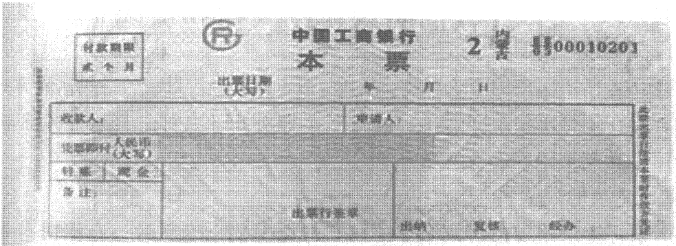

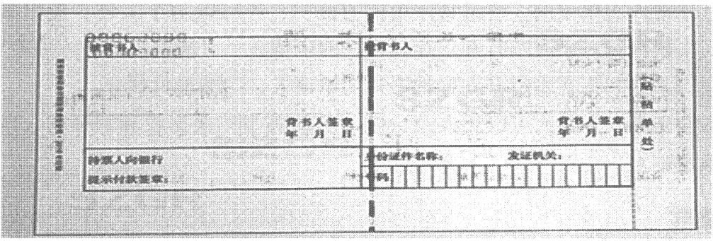

图3-7银行本票（票样）

### 3.15.50. （二）银行本票的岀票

1.`申请`。申请人使用银行本票，应向银行填写“银行本票申请书”，填明收款人名称、申请人名称、支付金额、申请日期等事项并签章。申请人和收款人均为个人需要支取现金的，应在“金额”栏先填写“现金”字样，后填写支付金额。

2.`受理`。出票银行受理“银行本票申请书”，收妥款项，签发银行本票交给申请人。签发银行本票必须记载下列事项：表明“银行本票”的字样；无条件支付的承诺；确定的金额；收款人名称；出票日期；出票人签章。欠缺记载上列事项之一的，银行本票无效。

申请人或收款人为单位的，银行不得为其签发现金银行本票。

出票银行必须具有支付本票金额的可靠资金来源，并保证支付。

3.`交付`。申请人应将银行本票交付给本票上记明的收款人。收款人受理银行本票时，应审查下列事项：（1）收款人是否确为本单位或本人；（2）银行本票是否在提示付款期限内；（3）必须记载的事项是否齐全；（4）出票人签章是否符合规定，大小写出票金额是否一致；（5）出票金额、出票日期、收款人名称是否更改，更改的其他记载事项是否由原记载人签章证明。

### 3.15.51. （三）银行本票的付款

`提示付款`。银行本票见票即付。银行本票的提示付款期限自出票日起最长不得超过`2个月`。本票的岀票人在持票人提示见票时，必须承担付款的责任。持票人超过提示付款期限不获付款的，在票据权利时效内向出票银行作出说明，并提供本人身份证件或单位证明，可持银行本票向岀票银行请求付款。

在银行开立存款账户的持票人向开户银行提示付款时，应在银行本票背面`“持票人向银行提示付款签章”`处签章，签章须与预留银行签章相同，并将银行本票、进账单送交开户银行。银行审查无误后办理`转账`。

未在银行开立存款账户的个人持票人，凭注明`“现金”`字样的银行本票向出票银行支取现金的，应在银行本票背面`签章`，记载本人身份证件名称、号码及发证机关，并交验本人身份证件及其复印件。

### 3.15.52. （四）银行本票的退款和丧失

申请人因银行本票超过提示付款期限或其他原因要求退款时，应将银行本票提交到出票银行。申请人为单位的，应出具该单位的`证明`；申请人为个人的，应出具该本人的`身份证件`。岀票银行对于在本行开立存款账户的申请人，只能将款项转入原申请人账户；对于现金银行本票和未在本行开立存款账户的申请人，才能退付现金。

银行本票丧失，失票人可以凭人民法院出具的其享有票据权利的`证明`，向出票银行请求付款或退款。

## 3.16. 八、支票

### 3.16.53. （一）支票的概念、种类和适用范围

1.概念。支票是指出票人签发的、委托办理支票存款业务的银行在见票时无条件支付确定的金额给收款人或者持票人的票据。支票的基本当事人包括出票人、付款人和收款人。出票人即存款人，是在批准办理支票业务的银行机构开立可以使用支票的存款账户的单位和个人；付款人是出票人的开户银行；持票人是票面上填明的收款人，也可以是经背书转让的被背书人。

2.种类。支票分为`现金支票`、`转账支票`和`普通支票`三种。支票上印有`“现金”`字样的为现金支票，如图3-8所示，现金支票只能用于支取现金。支票上印有“转账”字样的为转账支票，转账支票只能用于转账，如图3-9所示。支票上未印有“现金”或“转账”字样的为普通支票，普通支票可以用于支取现金，也可以用于转账。在普通支票左上角划两条平行线的，为`划线`支票，划线支票只能用于`转账`，不得支取现金（见表3-4）。

3.适用范围。单位和个人在同一票据交换区域的各种款项结算，均可以使用支票。全国支票影像系统支持全国使用。

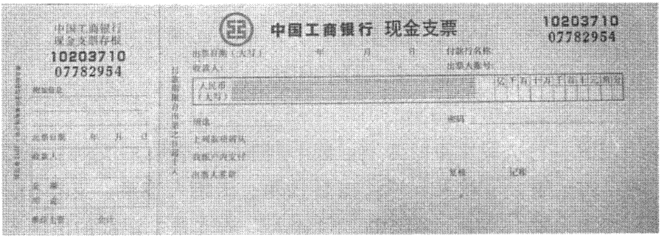

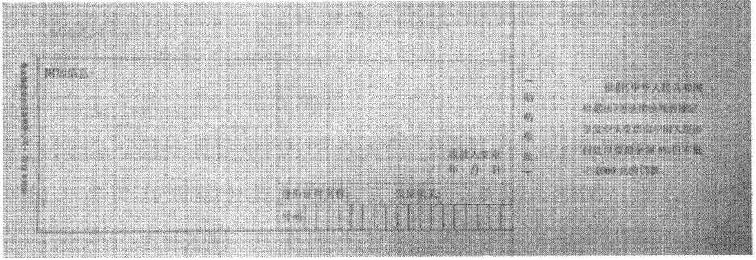

图3-8现金支票（票样）

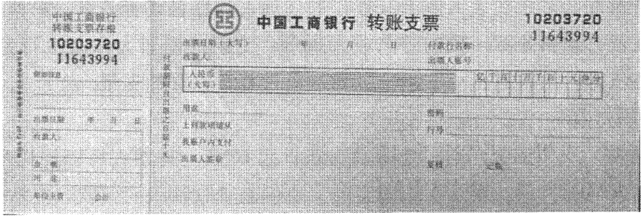

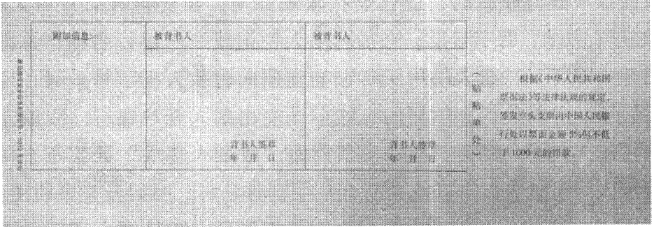

图3-9转账支票（票样）

| 表`3-4` | 支票种类与特点比较                                     |                                                                      |
|-----------|--------------------------------------------------------|----------------------------------------------------------------------|
| 种类      | 特点                                                   | 备注                                                                 |
| 现金支票  | 印有“现金”字样，只能用于支取现金                       |                                                                      |
| 转账支票  | 印有“转账”字样，只能用于转账                           |                                                                      |
| 普通支票  | 未印有“现金”“转账”字样，既可用于支取现金，也可用于转账 | 左上角划两条平行线的，为划线支票，划线支票只能用于转账，不能支取现金 |

### 3.16.54. （二）支票的出票

#### 3.16.54.44. 1.开立支票存款账户。

开立支票存款账户，申请人必须使用本名，提交证明其身份的合法证件，并应当预留其本名的签名式样和印鉴。

#### 3.16.54.45. 2.出票。

（1）支票的记载事项。签发支票必须记载下列事项：表明`“支票”`的字样；无条件支付的`委托`；确定的`金额`；付款人`名称`；出票`日期`；出票人`签章`。支票上未记载前款规定事项之一的，支票无效。其中，支票的“付款人”为支票上记载的出票人开户银行。

支票的金额、收款人名称，可以由岀票人`授权补记`，未补记前不得背书转让和提示付款。支票上未记载付款地的，付款人的营业场所为付款地。支票上未记载岀票地的，出票人的营业场所、住所或者经常居住地为出票地。出票人可以在支票上记载自己为收款人。

（2）签发支票的注意事项。支票的出票人所签发的支票金额不得超过其付款时在付款人处实有的存款金额。岀票人签发的支票金额超过其付款时在付款人处实有的存款金额的，为`空头支票`。禁止签发空头支票。支票的岀票人不得签发与其预留本名的签名式样或者印鉴不符的支票。

支票上的出票人的签章，出票人为单位的，为与该单位在银行预留签章一致的财务专用章或者公章加其法定代表人或者其授权的代理人的签名或者盖章；出票人为个人的，为与该个人在银行预留签章一致的签名或者盖章。支票的出票人预留银行签章是银行审核支票付款的依据。出票人不得签发与其预留银行签章不符的支票。

### 3.16.55. （三）支票付款

1.`提示`付款。支票的提示付款期限自出票日起`10日`。持票人可以委托开户银行收款或直接向付款人提示付款。用于支取现金的支票仅限于收款人向付款人提示付款。

持票人委托开户银行收款时，应作委托收款`背书`，在支票背面背书人签章栏签章、记载`“委托收款”`字样、背书日期，在被背书人栏记载开户银行名称，并将支票和填制的进账单送交开户银行。持票人持用于转账的支票向付款人提示付款时，应在支票背面背书人签章栏签章，并将支票和填制的进账单送交出票人开户银行。收款人持用于支取现金的支票向付款人提示付款时，应在支票背面“收款人签章”处签章，持票人为个人的，还需交验本人身份证件，并在支票背面注明证件名称、号码及发证机关。

2.`付款`。出票人必须按照签发的支票金额承担保证向该持票人付款的责任。出票人在付款人处的存款足以支付支票金额时，付款人应当在见票`当日`足额付款。

付款人依法支付支票金额的，对出票人不再承担受委托付款的责任，对持票人不再承担付款的责任。但付款人以`恶意`或者有`重大过失`付款的除外。

# 4. 第四节银行卡

## 4.17. 一、银行卡的概念和分类

### 4.17.56. （一）银行卡的概念

银行卡是指经批准由商业银行向社会发行的具有`消费`信用、`转账`结算、存取`现金`等全部或部分功能的信用支付工具。

### 4.17.57. （二）银行卡的分类

按不同标准，可以对银行卡做不同的分类。

1.按是否具有`透支`功能分为信用卡和借记卡，前者可以透支，后者不具备透支功能。信用卡按是否向发卡银行交存备用金分为贷记卡、准贷记卡两类。贷记卡是指发卡银行给予持卡人一定的信用额度，持卡人可在信用额度内先消费、后还款的信用卡。准贷记卡是指持卡人须先按发卡银行要求交存一定金额的备用金，当备用金账户余额不足支付时，可在发卡银行规定的信用额度内透支的信用卡。借记卡的主要功能包括消费、存取款、转账、代收付、外汇买卖、投资理财、网上支付等，按功能不同分为转账卡（含储蓄卡）、专用卡和储值卡。转账卡是实时扣账的借记卡，具有转账结算、存取现金和消费功能。专用卡是具有专门用途、在特定区域使用的借记卡，具有转账结算、存取现金功能。“专门用途”是指在百货、餐饮、饭店、娱乐行业以外的用途。储值卡是发卡银行根据持卡人要求将其资金转至卡内储存，交易时直接从卡内扣款的预付钱包式借记卡。

联名（认同）卡是商业银行与营利性机构/非营利性机构合作发行的银行卡附属产品，其所依附的银行卡品种必须是经批准的品种，并应当遵守相应品种的业务章程或管理办法。发卡银行和联名单位应当为联名卡持卡人在联名单位用卡提供一定比例的折扣优惠或特殊服务。

2.按币种不同分为人民币卡、外币卡。外币卡是持卡人与发卡银行以除人民币以外的货币作为清算货币的银行卡。目前国内商户可受理维萨（VISA）、万事达（Master¬Card）、美国运通（AmericanExpress）、大来（DinersClub）等外币卡。

3.按发行对象不同分为单位卡（商务卡）、个人卡。

4.按信息载体不同分为磁条卡、芯片（IC）卡。芯片（IC）卡既可应用于单一的银行卡品种，又可应用于组合的银行卡品种。

## 4.18. 二、银行卡账户和交易

### 4.18.58. （一）银行卡申领、注销和丧失

单位或个人申领信用卡，应按规定填制申请表，连同有关资料一并送交发卡银行。

发卡银行可根据申请人的资信程度，要求其提供担保。担保的方式可采用保证、抵押或质押。凡在中国境内金融机构开立基本存款账户的单位，应当凭中国人民银行核发的开户`许可证`或企业基本存款账户编号申领`单位卡`；个人申领银行卡（储值卡除外），应当向发卡银行提供公安部门规定的本人有效`身份证件`，经发卡银行审查合格后，为其开立记名账户。银行卡及其账户只限经发卡银行批准的持卡人本人使用，不得出租和转借。

个人贷记卡申请的基本条件：（1）年满18周岁，有固定职业和稳定收入，工作单位和户口在常住地的城乡居民；（2）填写申请表，并在持卡人处亲笔签字；（3）向发卡银行提供本人及附属卡持卡人、担保人的身份证复印件；外地、境外人员及现役军官以个人名义领卡应出具当地公安部门签发的临时户口或有关部门开具的证明，并须提供具备担保条件的担保单位或有当地户口、在当地工作的担保人。

单位人民币卡账户的资金一律从其`基本`存款账户转账存入，不得存取现金，不得将销货收入存入单位卡账户。单位外币卡账户的资金应从其单位的外汇账户转账存入，不得在境内存取外币现钞。个人人民币卡账户的资金以其持有的现金存入或以其工资性款项、属于个人的合法的劳务报酬、投资回报等收入转账存入。个人外币卡账户的资金以其个人持有的外币现钞存入或从其外汇账户（含外钞账户）转账存入，该外汇账户及存款应符合国家外汇管理局的有关规定。严禁将单位的款项转入个人卡账户存储。

持卡人在还清全部交易款项、透支本息和有关费用后，可申请办理销户。销户时,单位人民币卡账户的资金应当转入其基本存款账户，单位外币卡账户的资金应当转回相应的外汇账户，不得提取`现金`。对于持卡人因死亡等原因而需办理的注销和清户，应按照我国的《继承法》和《公证法》等法规办理。发卡行受理注销申请之日起`45日后`，被注销信用卡账户方能清户。

持卡人丧失银行卡，应立即持本人身份证件或其他有效证明，并按规定提供有关情况，向发卡银行或代办银行申请挂失，发卡银行或代办银行审核后办理挂失手续。

【例3-8】甲公司会计人员于2018年11月6日在其开户银行P银行为单位开立了一个单位人民币借记卡账户，并从基本账户转入款项60万元。2018年12月3日，异地乙公司业务人员随身携带现金4万元与甲公司洽谈生意。洽谈结束后，乙公司按照洽谈意见，需要预付货款5万元。乙公司业务人员交付携带的4万元现金后，甲公司授意其将剩余的1万元从乙公司的异地账户直接汇入甲公司银行卡账户。2018年12月10日，甲公司银行卡账户中收到乙公司的1万元预付货款，同日甲公司会计人员到开户银行P银行将银行卡账户中的2万元转入该公司总经理在Q银行开立的个人银行卡账户。请分析甲公司会计人员的以上做法中哪些违反了银行卡业务管理的有关规定。

【解析】（1）单位的销货收入不得转入单位银行卡账户。《银行卡业务管理办法》第二十九条规定，单位人民币卡账户的资金一律从其基本存款账户转账存入，不得存取现金，不得将销货收入存入单位卡账户。本例中，预付款是乙公司总货款的一部分，是甲公司尚未实现的销售收入，销售收入实现后这1万元将成为其中的一部分。乙公司将1万元预付货款从其账户中汇入甲公司银行卡中，违背了上述规定。

（2）单位的银行卡资金不得转入个人银行账户。《银行卡业务管理办法》第三十一条规定，个人人民币卡账户的资金以其持有的现金存入或以其工资性款项、属于个人的合法的劳务报酬、投资回报等收入转账存入。《支付结算办法》第一百三十七条规定，严禁将单位的款项存入个人卡账户。本例中，甲公司会计人员将其银行卡账户中的2万元转入该公司总经理在Q银行开立的个人银行卡账户，属于公款私存，应按规定追究其责任；P银行工作人员对明知的公款私存行为没有认真审查，属于失职行为，也应追究有关责任。

### 4.18.59. （二）银行卡交易的基本规定

1.单位人民币卡可办理商品交易和劳务供应款项的结算，但不得透支。单位卡不得支取现金。

2.信用卡预借现金业务。包括现金提取、现金转账和现金充值。现金提取是指持卡人通过柜面和自动柜员机等自助机具，以现钞形式获得信用卡预借现金额度内资金；现金转账是指持卡人将信用卡预借现金额度内资金划转到本人银行结算账户；现金充值是指持卡人将信用卡预借现金额度内资金划转到本人在非银行支付机构开立的支付账户。信用卡持卡人通过`ATM`机等自助机具办理现金提取业务，每卡每日累计不得超过人民币`1万元`；持卡人通过柜面办理现金提取业务，通过各类渠道办理现金转账业务的每卡每日限额，由发卡机构与持卡人通过协议约定；发卡机构可自主确定是否提供现金充值服务，并与持卡人协议约定每卡每日限额。发卡机构不得将持卡人信用卡预借现金额度内资金划转至其他信用卡，以及非持卡人的银行结算账户或支付账户。发卡银行应当对借记卡持卡人在ATM机等自助机具取款设定交易上限，每卡每日累计提款不得超过`2万元`人民币。储值卡的面值或卡内币值不得超过`1000元人民币`。

3.贷记卡持卡人非现金交易可享受免息还款期和最低还款额待遇，银行记账日到发卡银行规定的到期还款日之间为免息还款期，持卡人在到期还款日前偿还所使用全部银行款项有困难的，可按照发卡银行规定的最低还款额还款。持卡人透支消费享受免息还款期和最低还款额待遇的条件和标准等，由发卡机构自主确定。

4.发卡银行通过下列途径追偿透支款项和诈骗款项：扣减持卡人保证金、依法处理抵押物和质物；向保证人追索透支款项；通过司法机关的诉讼程序进行追偿。

## 4.19. 三、银行卡计息与收费

发卡银行对准贷记卡及借记卡（不含储值卡）账户内的存款，按照中国人民银行规定的同期同档次`存款利率`及计息办法计付利息。对信用卡透支利率实行`上限`和`下限`管理，透支利率上限为日利率`万分之五`，下限为日利率万分之五的`0.7倍`。信用卡透支的计结息方式，以及对信用卡溢缴款是否计付利息及其利率标准，由发卡机构自主确定。

发卡机构应在信用卡协议中以显著方式提示信用卡利率标准和计结息方式、免息还款期和最低还款额待遇的条件和标准，以及向持卡人收取违约金的详细情形和收取标准等与持卡人有重大利害关系的事项，确保持卡人充分知悉并确认接受。其中，对于信用卡利率标准，应注明日利率和年利率。发卡机构调整信用卡利率的，应至少提前`45个自然日`按照约定方式通知持卡人。持卡人有权在新利率标准生效之日前选择销户，并按照已签订的协议偿还相关款项。

取消信用卡`滞纳金`，对于持卡人违约逾期未还款的行为，发卡机构应与持卡人通过协议约定是否收取违约金，以及相关收取方式和标准。发卡机构向持卡人提供超过授信额度用卡的，不得收取超限费。

发卡机构对向持卡人收取的违约金和年费、取现手续费、货币兑换费等服务费用不得计收利息。

## 4.20. 四、银行卡清算市场

自2015年6月1日起，我国放开银行卡清算市场，符合条件的内外资企业，均可申请在中国境内设立银行卡清算机构。在中国境内从事银行卡清算业务，境外支付机构、第三方支付机构、银行等符合条件的机构应当向中国人民银行提出申请，经中国人民银行征求中国银行保险监督管理委员会同意后予以批准，依法取得“银行卡清算业务`许可证`”，申请成为银行卡清算机构的，注册资本不低于`10亿元`人民币。

目前，中国银联股份有限公司是唯一经国务院同意，由中国人民银行批准设立的银行卡清算机构。随着银行卡清算市场的放开，我国银行卡组织将迎来国际卡组织、本土第三方支付机构，甚至国内商业银行的多个参与方。

## 4.21. 五、银行卡收单

### 4.21.60. （一）银行卡收单业务概念

银行卡收单业务，是指收单机构与特约商户签订银行卡受理协议，在特约商户按约定受理银行卡并与持卡人达成交易后，为特约商户提供交易资金结算服务的行为。通俗地讲就是持卡人在银行签约商户那里刷卡消费，银行将持卡人刷卡消费的资金在规定周期内结算给商户，并从中扣取一定比例的手续费。

银行卡收单机构，包括从事银行卡收单业务的银行业金融机构，获得银行卡收单业务许可、为实体特约商户提供银行卡受理并完成资金结算服务的支付机构，以及获得网络支付业务许可、为网络特约商户提供银行卡受理并完成资金结算服务的支付机构。

特约商户，是指与收单机构签订银行卡受理协议、按约定受理银行卡并委托收单机构为其完成交易资金结算的企事业单位、个体工商户或其他组织，以及按照国家市场监督管理机构有关规定，开展网络商品交易等经营活动的自然人。实体特约商户，是指通过实体经营场所提供商品或服务的特约商户。网络特约商户，是指基于公共网络信息系统提供商品或服务的特约商户。

### 4.21.61. （二）银行卡收单业务管理规定

#### 4.21.61.46. 1.特约商户管理。

收单机构拓展特约商户，应遵循“了解你的客户”原则，对特约商户实行`实名制`管理。收单机构应严格审核特约商户的营业执照等证明文件，以及法定代表人或负责人有效身份证件等申请材料。特约商户为自然人的，收单机构应当审核其有效身份证件。特约商户使用单位银行结算账户作为收单银行结算账户的，收单机构还应当审核其合法拥有该账户的证明文件。

收单机构应当与特约商户签订银行卡受理协议，就可受理的银行卡种类、开通的交易类型、收单银行结算账户的设置和变更、资金结算周期、结算手续费标准、差错和纠纷处置等事项，明确双方的权利、义务和违约责任。特约商户的收单银行结算账户应当为其同名单位银行结算账户，或其指定的、与其存在合法资金管理关系的单位银行结算账户。特约商户为个体工商户或自然人的，可使用其同名个人银行结算账户作为收单银行结算账户。

收单机构应当对实体特约商户收单业务进行本地化经营和管理，通过在特约商户及其分支机构所在省（自治区、直辖市）域内的收单机构或其分支机构提供收单服务，不得跨省（自治区、直辖市）域开展收单业务。对于连锁式经营或集团化管理的特约商户，收单机构或经其授权的特约商户所在地的分支机构可与特约商户签订总对总银行卡受理协议，并严格落实本地化服务和管理责任。

#### 4.21.61.47. 2.业务与风险管理。

收单机构应当强化业务和风险管理措施，建立特约商户检查制度、资金结算风险管理制度、收单交易风险监测系统以及特约商户收单银行结算账户设置和变更审核制度等。建立对实体特约商户、网络特约商户分别进行风险评级制度，对于风险等级较高的特约商户，收单机构应当对其开通的受理卡种和交易类型进行限制，并采取强化交易监测、设置交易限额、延迟结算、增加检查频率、建立特约商户风险准备金等措施。

收单机构应按协议约定及时将交易资金结算到特约商户的收单银行结算账户，资金结算时限最迟不得超过持卡人确认可直接向特约商户付款的支付指令生效日后`30个自然日`，因涉嫌违法违规等风险交易需延迟结算的除外。收单机构应当根据交易发生时的原交易信息发起银行卡交易差错处理、退货交易，将资金退至持卡人原银行卡账户。若持卡人原银行卡账户已撤销的，应当退至持卡人指定的本人其他银行账户。

收单机构发现特约商户发生疑似银行卡套现、洗钱、欺诈、移机、留存或泄露持卡人账户信息等风险事件的，应当对特约商户采取延迟资金结算、暂停银行卡交易或收回受理终端（关闭网络支付接口）等措施，并承担因未采取措施导致的风险损失责任；涉嫌违法犯罪活动的，应当及时向公安机关报案。

### 4.21.62. （三）银行卡POS收单业务交易及结算流程

多功能终端（point of
sale，POS）是安装在特约商户内，为持卡人提供授权、消费、结算等服务的专用电子支付设备，也是能够保证银行交易处理信息安全的实体支付终端。目前国内银行卡POS交易的转接和资金清算由中国银联负责。境外银行卡POS交易的转接和转接清算由国际发卡组织负责（如维萨国际组织、万事达国际组织等）。银行卡收单业务交易及结算流程如图3-10所示。

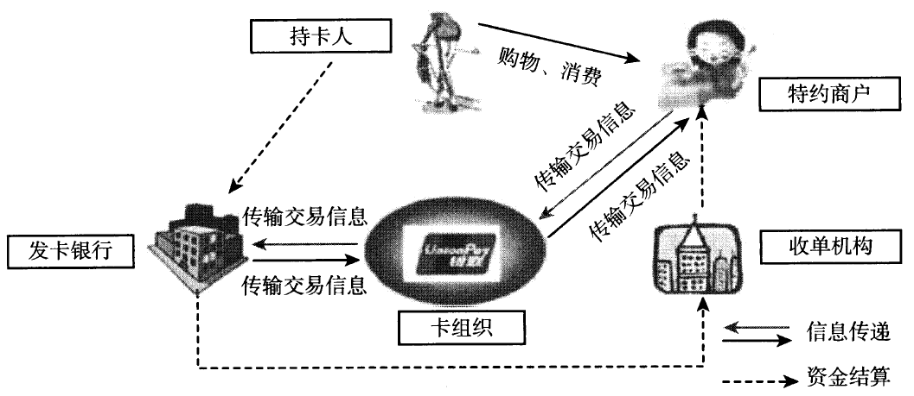

图3-10银行卡收单业务交易及结算流程

收单业务交易及结算流程为：

1.收银员审查银行卡，刷卡输入交易金额。

2.持卡人确认消费金额并输入交易密码。

3.交易信息通过中国银联输送至发卡机构。

4.发卡机构系统检查卡片有效性、验证密码和账户余额，并发送交易处理结果信息（通过检查和验证后扣减持卡人账户资金并发送成功信息，未通过发送失败信息）。

5.中国银联把交易处理结果信息返回给受理机具。

6.若交易成功，受理机具打印单据。

7.持卡人在消费单据上签名，收银员保管好交易单据。

8.中国银联每日23：00进行日终处理，按成员机构代号进行轧差清算，次日通过现代化支付系统直接拨收成员机构清算资金。

9.成员机构次日从中国银联下载商户交易明细，对商户进行资金入账（已扣减交易手续费）并向特约商户提供交易明细。

### 4.21.63. （四）结算收费

收单机构向商户收取的收单服务费由收单机构与商户协商确定具体费率。发卡机构收取的发卡行服务费不区分商户类别，实行政府指导价、上限管理，费率为：借记卡交易不超过交易金额的0.35%,单笔收费金额不超过13元，贷记卡交易不超过0.45%。对非营利性的医疗机构、教育机构、社会福利机构、养老机构、慈善机构刷卡交易，实行发卡行服务费、网络服务费全额减免。

# 5. 第五节网上支付

网上支付是电子支付的一种形式，它是指电子交易的当事人，包括消费者、厂商和金融机构，使用电子支付手段通过网络进行的货币或资金流转。网上支付的主要方式有网上银行和第三方支付。

## 5.22. 一、网上银行

### 5.22.64. （一）网上银行的概念

网上银行（Internetbank or
E-bank）,包含两个层次的含义：一个是机构概念，指通过信息网络开办业务的银行；另一个是业务概念，指银行通过信息网络提供的金融服务，包括传统银行业务和因信息技术应用带来的新兴业务。在日常生活和工作中，我们提及网上银行，更多是第二层次的概念，即网上银行服务的概念。

简单地说，网上银行就是银行在互联网上设立虚拟银行柜台，使传统的银行服务不再通过物理的银行分支机构来实现，而是借助于网络与信息技术手段在互联网上实现，因此网上银行也称网络银行。网上银行又被称为“3A银行”，因为它不受时间、空间限制，能够在任何时间（Anytime）、任何地点（Anywhere）、以任何方式（Anyway）为客户提供金融服务。

### 5.22.65. （二）网上银行的分类

按照不同的标准，网上银行可以分为不同的类型。

1.按主要服务对象分为企业网上银行和个人网上银行。企业网上银行主要适用于企事业单位，企事业单位可以通过企业网络银行适时了解财务运作情况，及时调度资金，轻松处理大批量的网络支付和工资发放业务。个人网上银行主要适用于个人与家庭，个人可以通过个人网络银行实现实时查询、转账、网络支付和汇款功能。

2.按经营组织分为分支型网上银行和纯网上银行。分支型网上银行是指现有的传统银行利用互联网作为新的服务手段，建立银行站点，提供在线服务而设立的网上银行。纯网上银行的本身就是一家银行，是专门为提供在线银行服务而成立的，因而也被称为只有一个站点的银行。

### 5.22.66. （三）网上银行的主要功能

目前，网上银行利用Internet和HTML技术，能够为客户提供综合、统一、安全、实时的银行服务，包括提供对私、对公的全方位银行业务，还可以为客户提供跨国的支付与清算等其他贸易和非贸易的银行业务服务。

1.企业网上银行子系统。企业网上银行子系统目前能够支持所有的对公企业客户，能够为客户提供网上账务信息服务、资金划拨、网上B2B支付和批量支付等服务，使集团公司总部能对其分支机构的财务活动进行实时监控，随时获得其账户的动态情况，同时还能为客户提供B2B网上支付。其主要业务功能包括：

（1）账户信息查询。能够为企业客户提供账户信息的网上在线查询、网上下载和电子邮件发送账务信息等服务，包括账户的昨日余额、当前余额、当日明细和历史明细等。

（2）支付指令。支付指令业务能够为客户提供集团、企业内部各分支机构之间的账务往来，同时也能提供集团、企业之间的账务往来，并且支持集团、企业向他行账户进行付款。

（3）B2B（Business to
Business）网上支付。B2B,商业机构之间的商业往来活动，指的是企业与企业之间进行的电子商务活动。B2B网上支付能够为客户提供网上B2B支付平台。

（4）批量支付。能够为企业客户提供批量付款（包括同城、异地及跨行转账业务）、代发工资、一付多收等批量支付功能。企业客户负责按银行要求的格式生成数据文件，通过安全通道传送给银行，银行负责系统安全及业务处理，并将处理结果反馈给客户。

2.个人网上银行子系统。个人网上银行子系统主要提供银行卡、本外币活期一本通客户账务管理、信息管理、网上支付等功能，是网上银行对个人客户服务的窗口。其具体业务功能包括：

（1）账户信息查询。系统为客户提供信息查询功能，能够查询银行卡的人民币余额和活期一本通的不同币种的钞、汇余额；提供银行卡在一定时间段内的历史明细数据查询；下载包含银行卡、活期一本通一定时间段内的历史明细数据的文本文件；查询使用银行卡进行网上支付后的支付记录。

（2）人民币转账业务。系统能够提供个人客户本人的或与他人的银行卡之间的卡卡转账服务。系统在转账功能上严格控制了单笔转账最大限额和当日转账最大限额，使客户的资金安全有一定的保障。

（3）银证转账业务。银行卡客户在网上能够进行银证转账，可以实现银转证、证转银、查询证券资金余额等功能。

（4）外汇买卖业务。客户通过网上银行系统能够进行外汇买卖，主要可以实现外汇即时买卖、外汇委托买卖、查询委托明细、查询外汇买卖历史明细、撤销委托等功能。

（5）账户管理业务。系统提供客户对本人网上银行各种权限功能、客户信息的管理以及账户的挂失。

（6）B2C（Business to
Customer）网上支付。B2C,商业机构对消费者的电子商务，指的是企业与消费者之间进行的在线式零售商业活动（包括网上购物和网上拍卖等）。个人客户在申请开通网上支付功能后，能够使用本人的银行卡进行网上购物后的电子支付。通过账户管理功能，客户还能够随时选择使用哪一张银行卡来进行网上支付。

### 5.22.67. （四）网上银行主要业务流程

#### 5.22.67.48. 1.客户开户流程。

客户开通网上银行有两种方式：一是客户前往银行柜台办理；二是客户先在网上自助申请，后到柜台签约。

使用网上交易的用户申请证书的流程如下：

（1）客户使用浏览器通过Internet登录到网银中心的“申请服务器”（数据库）上，填写开户申请表，提交申请。

（2）网银中心将开户申请信息通过内部网以邮件形式发送到签约柜台。

（3）客户持有效身份证件和账户凭证到签约柜台办理签约手续，签约柜台核实客户有效证件及账户凭证的真实性，同时参照网银中心传来的客户开户申请，核实客户的签约账户申请信息。之后，将核实的客户信息通过电子邮件/传真等方式返回给网银中心。

（4）网银中心根据签约柜台核实后的邮件（传真件），进行申请的初审和复审。并录入复审后的申请客户信息，为其生成证书申请，通过内部网以邮件方式发送到CA中心。

（5）CA（Certificate
Authority）中心为客户申请签发证书，并将证书放置到客户从Internet网上可以访问的目录服务器上。然后通知网银中心，网银中心通过邮件通知客户从指定地址下载CA证书。

（6）客户下载并安装证书后，即可进入网上银行系统，进行网上交易。

#### 5.22.67.49. 2.网上银行的交易流程。

网上银行的具体交易流程如下：

（1）网上银行客户使用浏览器通过Internet网连接到网银中心，并发出网上交易请求。

（2）网银中心接收、审核客户的交易请求，经过通信格式转换，然后将交易请求转发给相应成员行的业务主机。

（3）成员行业务主机完成交易处理，并返回处理结果给网银中心。

（4）网银中心对交易结果进行再处理后，返回相应信息给客户。

## 5.23. 二、第三方支付

### 5.23.68. （一）第三方支付的概念

从狭义上讲，第三方支付是指具备一定实力和信誉保障的非银行机构，通过与网联对接而促成交易双方进行交易的网络支付模式。在手机端进行的互联网支付，又称为移动支付。通过这个平台实现资金在不同支付机构账户或银行账户间的划拨和转移。第三方支付的特点是独立于商户和银行，为客户提供支付结算服务，具有方便快捷、安全可靠、开放创新的优势。

从广义上讲，第三方支付在中国人民银行《非金融机构支付服务管理办法》中是指非金融机构作为收、付款人的支付中介所提供的网络支付、预付卡发行与受理、银行卡收单以及中国人民银行确定的其他支付服务。这一定义让第三方支付不仅仅是互联网支付，而是成为一个集线上、线下于一体，提供移动支付、电话支付、预付卡支付于一体的综合支付服务工具。

### 5.23.69. （二）第三方支付的开户要求

非银行支付机构（以下简称支付机构）为个人开立支付账户的，同一个人在同一家支付机构只能开立一个皿类账户。支付机构为单位开立支付账户，应当参照《人民币银行结算账户管理办法》（中国人民银行令〔2003〕第5号）第十七条、第二十四条、第二十六条等相关规定，要求单位提供相关证明文件，并自主或者委托合作机构以面对面的方式核实客户身份，或者以非面对面方式通过至少3个合法安全的外部渠道对单位基本信息进行多重交叉验证。支付机构在为单位和个人开立支付账户时，应当与单位和个人签订协议，约定支付账户与支付账户、支付账户与银行账户之间的日累计转账限额和笔数，超出限额和笔数的，不得再办理转账业务。

### 5.23.70. （三）第三方支付的种类

#### 5.23.70.50. 1.线上支付方式。

线上支付是指通过互联网实现的用户和商户、商户和商户之间在线货币支付、资金清算、查询统计等过程。网上支付完成了使用者信息传递和资金转移的过程。广义的线上支付包括直接使用网上银行进行的支付和通过第三方支付平台进行的支付。狭义的线上支付仅指通过第三方支付平台实现的互联网在线支付，包括网上支付和移动支付中的远程支付。

#### 5.23.70.51. 2.线下支付方式。

线下支付区别于网上银行等线上支付，是指通过非互联网线上的方式对购买商品或服务所产生的费用进行的资金支付行为。其中，订单的产生可能通过互联网线上完成。新兴线下支付的具体表现形式，包括P。S机刷卡支付、拉卡拉等自助终端支付、电话支付、手机近端支付、电视支付等。

### 5.23.71. （四）第三方支付的行业分类及主流品牌

第三方支付机构是最近几年出现的新的支付清算组织，它是为银行业金融机构或其他机构及个人提供电子支付指令交换和计算的法人组织，须获得由中国人民银行颁发的支付业务许可证。

目前第三方支付机构主要有两类模式：

（1）金融型支付企业。金融型支付企业是以银联商务、快钱、易宝支付、汇付天下、拉卡拉等为典型代表的独立第三方支付模式，其不负有担保功能，仅仅为用户提供支付产品和支付系统解决方案，侧重行业需求和开拓行业应用，是立足于企业端的金融型支付企业。

（2）互联网支付企业。互联网支付企业是以支付宝、财付通等为典型代表的依托于自有的电子商务网站并提供担保功能的第三方支付模式，以在线支付为主，是立足于个人消费者端的互联网型支付企业。

### 5.23.72. （五）第三方支付交易流程

在第三方支付模式下，支付者必须在第三方支付机构平台上开立账户，向第三方支付机构平台提供银行卡信息或账户信息，在账户中“充值”，通过支付平台将该账户中的虚拟资金划转到收款人的账户，完成支付行为。收款人可以在需要时将账户中的资金兑成实体的银行存款。第三方平台结算支付模式的资金划拨是在平台内部进行的，此时划拨的是虚拟的资金。真正的实体资金还需要通过实际支付层来完成。

以B2C（商业机构对消费者的电子商务）交易为例：

第一步，客户在电子商务网站上选购商品，决定购买后，买卖双方在网上达成交易意向；

第二步，客户选择利用第三方作为交易中介，客户用银行卡将货款划到第三方账户；

第三步，第三方支付平台将客户已经付款的消息通知商家，并要求商家在规定时间内发货；

第四步，商家收到通知后按照订单发货；

第五步，客户收到货物并验证后通知第三方；

第六步，第三方将其账户上的货款划入商家账户中，交易完成。

【例3-9】个人网上银行具体业务功能包括（）。

A.账户信息查询B.人民币转账业务

C.外汇买卖业务D.B2B网上支付

【解析】答案为ABC。B2B指的是企业与企业之间进行的电子商务活动，B2B网上支付是企业网上银行的具体业务功能，故选项D不属于个人网上银行具体业务功能。

# 6. 第六节结算方式和其他支付工具

## 6.24. —、汇兑

### 6.24.73. （一）汇兑的概念和种类

汇兑是汇款人委托银行将其款项支付给收款人的结算方式。汇兑分为信汇、电汇两种，单位和个人的各种款项的结算，均可使用汇兑结算方式。

### 6.24.74. （二）办理汇兑的程序

1.签发汇兑凭证。签发汇兑凭证必须记载下列事项：表明“信汇”或“电汇”的字样；无条件支付的委托；确定的金额；收款人名称；汇款人名称；汇入地点、汇入行名称；汇出地点、汇出行名称；委托日期；汇款人签章。汇兑凭证记载的汇款人、收款人在银行开立存款账户的，必须记载其账号。

2.银行受理。汇出银行受理汇款人签发的汇兑凭证，经审查无误后，应及时向汇入银行办理汇款，并向汇款人签发汇款回单。汇款回单只能作为汇出银行受理汇款的依据，不能作为该笔汇款已转入收款人账户的证明。

3.汇入处理。汇入银行对开立存款账户的收款人，应将汇入的款项直接转入收款人账户，并向其发出收账通知。收账通知是银行将款项确已收入收款人账户的凭据。

### 6.24.75. （三）汇兑的撤销

汇款人对汇出银行尚未汇岀的款项可以申请撤销。申请撤销时，应岀具正式函件或本人身份证件及原信、电汇回单。

## 6.25. 二、委托收款

### 6.25.76. （一）委托收款的概念和适用范围

委托收款是收款人委托银行向付款人收取款项的结算方式。单位和个人凭已承兑的商业汇票、债券、存单等付款人债务证明办理款项的结算，均可以使用委托收款结算方式。委托收款在同城、异地均可以使用。

### 6.25.77. （二）办理委托收款的程序

1.签发委托收款凭证。签发委托收款凭证必须记载下列事项：表明“委托收款”的字样；确定的金额；付款人名称；收款人名称；委托收款凭据名称及附寄单证张数；委托日期；收款人签章。欠缺记载上列事项之一的，银行不予受理。

委托收款以银行以外的单位为付款人的，委托收款凭证必须记载付款人开户银行名称；以银行以外的单位或在银行开立存款账户的个人为收款人的，委托收款凭证必须记载收款人开户银行名称；未在银行开立存款账户的个人为收款人的，委托收款凭证必须记载被委托银行名称。欠缺记载的，银行不予受理。

2.委托。收款人办理委托收款应向银行提交委托收款凭证和有关的债务证明。

3.付款。银行接到寄来的委托收款凭证及债务证明，审查无误后办理付款。

（1）以银行为付款人的，银行应当在当日将款项主动支付给收款人。

（2）以单位为付款人的，银行应及时通知付款人，需要将有关债务证明交给付款人的应交给付款人。付款人应于接到通知的当日书面通知银行付款。付款人未在接到通知日的次日起3日内通知银行付款的，视同付款人同意付款，银行应于付款人接到通知日的次日起第4日上午开始营业时，将款项划给收款人。银行在办理划款时，付款人存款账户不足支付的，应通过被委托银行向收款人发出未付款项通知书。

（3）拒绝付款。付款人审查有关债务证明后，对收款人委托收取的款项需要拒绝付款的，可以办理拒绝付款。以银行为付款人的，应自收到委托收款及债务证明的次日起3日内出具拒绝证明，连同有关债务证明、凭证寄给被委托银行，转交收款人；以单位为付款人的，应在付款人接到通知日的次日起3日内出具拒绝证明，持有债务证明的，应将其送交开户银行。银行将拒绝证明、债务证明和有关凭证一并寄给被委托银行，转交收款人。

## 6.26. 三、国内信用证

### 6.26.78. （一）国内信用证的概念

国内信用证（以下简称信用证），是指银行依照申请人的申请开立的、对相符交单予以付款的承诺。我国信用证为以人民币计价、不可撤销的跟单信用证。信用证结算适用于银行为国内企事业单位之间货物和服务贸易提供的结算服务。服务贸易包括但不限于运输、旅游、咨询、通讯、建筑、保险、金融、计算机和信息、专有权利使用和特许、广告宣传、电影音像等服务项目。信用证只限于转账结算，不得支取现金。信用证按付款期限分为即期信用证和远期信用证。即期信用证，开证行应在收到相符单据次日起5个营业日内付款。远期信用证，开证行应在收到相符单据次日起5个营业日内确认到期付款，并在到期日付款。远期的表示方式包括：单据日后定期付款、见单后定期付款、固定日付款等可确定到期日的方式。信用证付款期限最长不超过1年。

### 6.26.79. （二）信用证业务当事人

1.申请人，指申请开立信用证的当事人，一般为货物购买方或服务接受方。

2.受益人，指接受信用证并享有信用证权益的当事人，一般为货物销售方或服务提供方。

3.开证行，指应申请人申请开立信用证的银行。

4.通知行，指应开证行的要求向受益人通知信用证的银行。

5.交单行，指向信用证有效地点提交信用证项下单据的银行。

6.转让行，指开证行指定的办理信用证转让的银行。

7.保兑行，指根据开证行的授权或要求对信用证加具保兑的银行。

8.议付行，指开证行指定的为受益人办理议付的银行，开证行应指定一家或任意银行作为议付信用证的议付行。

### 6.26.80. （三）办理国内信用证的基本程序

#### 6.26.80.52. 1.开证。

（1）申请开立信用证。开证申请人申请办理开证业务时，应当填具开证申请书，申请人须提交其与受益人签订的贸易合同。

（2）受理开证。银行与申请人在开证前应签订明确双方权利义务的协议。开证行可要求申请人交存一定数额的保证金，并可根据申请人资信情况要求其提供抵押、质押、保证等合法有效的担保。

（3）开证。开立信用证可以采用信开和电开方式。信开信用证，由开证行加盖业务用章寄送通知行，同时应视情况需要以双方认可的方式证实信用证的真实有效性；电开信用证，由开证行以数据电文发送通知行。信用证应使用中文开立，信用证应记载的基本条款包括：表明“国内信用证”的字样；开证申请人名称及地址；开证行名称及地址；受益人名称及地址；通知行名称；开证日期；信用证编号；不可撤销信用证；信用证有效期及有效地点；是否可转让；是否可保兑；是否可议付；信用证金额；付款期限；货物或服务描述；溢短装条款（如有）；货物贸易项下的运输交货或服务贸易项下的服务提供条款；单据条款；交单期；信用证项下相关费用承担方；开证行保证文句；其他条款。

#### 6.26.80.53. 2.保兑。

保兑是指保兑行根据开证行的授权或要求，在开证行承诺之外作出的对相符交单付款、确认到期付款或议付的确定承诺。

#### 6.26.80.54. 3.修改。

开证申请人需对已开立的信用证内容修改的，应向开证行提出修改申请，明确修改的内容。信用证受益人同意或拒绝接受修改的，应提供接受或拒绝修改的通知。

#### 6.26.80.55. 4.通知。

通知行可由开证申请人指定，如开证申请人没有指定，开证行有权指定通知行。通知行可自行决定是否通知。通知行同意通知的，应于收到信用证次日起3个营业日内通知受益人。

#### 6.26.80.56. 5.转让。

转让是指由转让行应第一受益人的要求，将可转让信用证的部分或者全部转为可由第二受益人兑用。可转让信用证只能转让一次。

#### 6.26.80.57. 6.议付。

议付是指可议付信用证项下单证相符或在开证行或保兑行已确认到期付款的情况下，议付行在收到开证行或保兑行付款前购买单据、取得信用证项下索款权利，向受益人预付或同意预付资金的行为。信用证未明示可议付，任何银行不得办理议付；信用证明示可议付，如开证行仅指定一家议付行，未被指定为议付行的银行不得办理议付，被指定的议付行可自行决定是否办理议付。受益人可对议付信用证在信用证交单期和有效期内向议付行提示单据、信用证正本、信用证通知书、信用证修改书正本及信用证修改通知书（如有），并填制交单委托书和议付申请书，请求议付。议付行在受理议付申请的次日起5个营业日内审核信用证规定的单据并决定议付的，办理议付。决定拒绝议付的，应及时告知受益人。

#### 6.26.80.58. 7.索偿。

议付行将注明付款提示的交单面函（寄单通知书）及单据寄开证行或保兑行索偿资金。议付行议付时，必须与受益人书面约定是否有追索权。若约定有追索权，到期不获付款，议付行可向受益人追索。若约定无追索权，到期不获付款，议付行不得向受益人追索，议付行与受益人约定的例外情况或受益人存在信用证欺诈的情形除外。

#### 6.26.80.59. 8.寄单索款。

受益人委托交单行交单，应在信用证交单期和有效期内填制信用证交单委托书，并提交单据和信用证正本及信用证通知书、信用证修改书正本及信用证修改通知书（如有）。交单行应在收单次日起5个营业日内对其审核相符的单据寄单并附寄一份交单面函（寄单通知书）。

受益人直接交单时，应提交信用证正本及信用证通知书、信用证修改书正本及信用证修改通知书（如有）、开证行（保兑行、转让行、议付行）认可的身份证明文件。

#### 6.26.80.60. 9.付款。

开证行或保兑行在收到交单行寄交的单据及交单面函（寄单通知书）或受益人直接递交的单据的次日起5个营业日内，及时核对是否为相符交单。单证相符或单证不符但开证行或保兑行接受不符点的，对即期信用证，应于收到单据次日起5个营业日内支付相应款项给交单行或受益人（受益人直接交单时，下同）；对远期信用证，应于收到单据次日起5个营业日内发岀到期付款确认书，并于到期日支付款项给交单行或受益人。若受益人提交了相符单据或开证行已发出付款承诺，即使申请人交存的保证金及其存款账户余额不足支付，开证行仍应在规定的时间内付款。开证行或保兑行审核单据发现不符并决定拒付的，应在收到单据的次日起5个营业日内一次性将全部不符点以电子方式或其他快捷方式通知交单行或受益人。

#### 6.26.80.61. 10.注销。

注销是指开证行对信用证未支用的金额解除付款责任的行为。开证行、保兑行、议付行未在信用证有效期内收到单据的，开证行可在信用证逾有效期1个月后予以注销。其他情况下，须经开证行、已办理过保兑的保兑行、已办理过议付的议付行、已办理过转让的转让行与受益人协商同意，或受益人、上述保兑行（议付行、转让行）声明同意注销信用证，并与开证行就全套正本信用证收回达成一致后，信用证方可注销。

## 6.27. 四、预付卡

### 6.27.81. （一）预付卡的概念和分类

预付卡是指发卡机构以特定载体和形式发行的、可在发卡机构之外购买商品或服务的预付价值。

目前市场上预付卡有两类：一类是专营发卡机构发行，可跨地区、跨行业、跨法人使用的多用途预付卡；另一类是商业企业发行，只在本企业或同一品牌连锁商业企业购买商品、服务的单用途预付卡。本章讲述的是多用途预付卡。预付卡按是否记载持卡人身份信息分为记名预付卡和不记名预付卡。

### 6.27.82. （二）预付卡的相关规定

#### 6.27.82.62. 1.预付卡的限额。

预付卡以人民币计价，不具有透支功能。单张记名预付卡资金限额不得超过5000元，单张不记名预付卡资金限额不得超过1000元。

#### 6.27.82.63. 2.预付卡的期限。

预付卡卡面记载有效期限或有效期截止日。记名预付卡可挂失，可赎回，不得设置有效期；不记名预付卡不挂失，不赎回，另有规定的除外。不记名预付款有效期不得低于3年。超过有效期尚有资金余额的预付卡，可通过延期、激活、换卡等方式继续使用。

#### 6.27.82.64. 3.预付卡的办理。

个人或单位购买记名预付卡或一次性购买不记名预付卡1万元以上的，应当使用实名并向发卡机构提供有效身份证件。发卡机构应当识别购卡人、单位经办人的身份，核对有效身份证件，登记身份基本信息，并留存有效身份证件的复印件或影印件。代理他人购买预付卡的，发卡机构应当采取合理方式确认代理关系，核对代理人和被代理人的有效身份证件，登记代理人和被代理人的身份基本信息，并留存代理人和被代理人的有效身份证件的复印件或影印件。使用实名购买预付卡的，发卡机构应当登记购卡人姓名或单位名称、单位经办人姓名、有效身份证件名称和号码、联系方式、购卡数量、购卡日期、购卡总金额、预付卡卡号及金额等信息。单位一次性购买预付卡5000元以上，个人一次性购买预付卡5万元以上的，应当通过银行转账等非现金结算方式购买，不得使用现金。购卡人不得使用信用卡购买预付卡。

#### 6.27.82.65. 4.预付卡的充值。

预付卡只能通过现金或银行转账方式进行充值，不得使用信用卡为预付卡充值。一次性充值金额5000元以上的，不得使用现金。单张预付卡充值后的资金余额不得超过规定限额。预付卡现金充值通过发卡机构网点进行，但单张预付卡同日累计现金充值在200元以下的，可通过自助充值终端、销售合作机构代理等方式充值。

#### 6.27.82.66. 5.预付卡的使用。

预付卡在发卡机构拓展、签约的特约商户中使用，不得用于或变相用于提取现金，不得用于购买、交换非本发卡机构发行的预付卡、单一行业卡及其他商业预付卡或向其充值，卡内资金不得向银行账户或向非本发卡机构开立的网络支付账户转移。

#### 6.27.82.67. 6.预付卡的赎回。

记名预付卡可在购卡3个月后办理赎回。赎回时，持卡人应当出示预付卡及持卡人和购卡人的有效身份证件。由他人代理赎回的，应当同时出示代理人和被代理人的有效身份证件。单位购买的记名预付卡，只能由单位办理赎回。

#### 6.27.82.68. 7.预付卡的发卡机构。

预付卡发卡机构必须是经中国人民银行核准，取得《支付业务许可证》的支付机构。支付机构要严格按照核准的业务类型和业务覆盖范围从事预付卡业务。发卡机构要采取有效措施加强对购卡人和持卡人信息的保护，确保信息安全，防止信息泄露和滥用，未经购卡人和持卡人同意，不得用于与购卡人和持卡人的预付卡业务无关的目的。发卡机构要严格发票管理，按照《中华人民共和国发票管理办法》有关规定开具发票。发卡人要加强预付卡资金管理，维护持卡人合法权益，发卡机构接受的、客户用于未来支付需要的预付卡资金，不属于发卡机构的自有财产，发卡机构不得挪用、挤占。发卡机构对客户备付金需100%集中交存中国人民银行。

【例3-10】小张到某支付机构购买1万元预付卡，支付机构要求小张提供身份证件。请分析支付机构的做法是否正确。小张一次性支付现金1万元，为单位购买了1。张预付卡，每张面额1000元，随后小张又通过信用卡支付2000元，以个人名义购买了一张面额为2000元的预付卡。请分析支付机构的做法是否正确。

【解析】支付机构要求小张提供身份证件的做法是正确的。根据《支付机构预付卡业务管理办法》第十条规定，个人或单位购买记名预付卡或一次性购买不记名预付卡1万元以上的，应当使用实名并提供有效身份证件。支付机构允许小张使用现金和信用卡购买预付卡的做法是错误的。根据《支付机构预付卡业务管理办法》第十二条规定，单位一次性购买预付卡5000元以上，应当通过银行转账等非现金结算方式购买，不得使用现金。购卡人不得使用信用卡购买预付卡。

# 7. 第七节结算纪律与法律责任

## 7.28. 一、结算纪律

结算纪律是银行、单位和个人办理支付结算业务所应遵守的基本规定。《支付结算办法》规定，单位和个人办理支付结算，不准签发没有资金保证的票据或远期支票，套取银行信用；不准签发、取得和转让没有真实交易和债权债务的票据，套取银行和他人资金；不准无理拒绝付款，任意占用他人资金；不准违反规定开立和使用账户。

银行办理支付结算，不准以任何理由压票、任意退票、截留挪用客户和他行资金；不准无理拒绝支付应由银行支付的票据款项；不准受理无理拒付、不扣少扣滞纳金；不准违章签发、承兑、贴现票据，套取银行资金；不准签发空头银行汇票、银行本票和办理空头汇款；不准在支付结算制度之外规定附加条件，影响汇路畅通；不准违反规定为单位和个人开立账户；不准拒绝受理、代理他行正常结算业务。

## 7.29. 二、违反支付结算法律制度的法律责任

银行、单位和个人违反结算纪律，要分别承担相应的法律责任。根据目前的法律、法规和规章的规定，对于下列行为，应依法分别承担民事、行政和刑事责任：

### 7.29.83. （一）签发空头支票、印章与预留印鉴不符支票，未构成犯罪行为的法律责任

单位或个人签发空头支票或者签发与其预留的签章不符、使用支付密码但支付密码错误的支票，不以骗取财物为目的的，由中国人民银行处以票面金额5%但不低于1000元的罚款；持票人有权要求出票人赔偿支票金额2%的赔偿金。屡次签发空头支票的，银行有权停止为其办理支票或全部支付结算业务。根据《行政处罚法》和《票据管理实施办法》的规定，中国人民银行是空头支票的处罚主体，银行机构发现空头支票行为的，应向中国人民银行分支机构举报，并协助送达相应的行政处罚法律文书。

### 7.29.84. （二）无理拒付，占用他人资金行为的法律责任

票据的付款人对见票即付或者到期的票据，故意压票、拖延支付的，银行机构违反票据承兑等结算业务规定，不予兑现，不予收付入账，压单、压票或者违反规定退票的，由国务院银行保险监督管理机构责令其改正，有违法所得的，没收违法所得。违法所得5万元以上的，并处违法所得1倍以上5倍以下罚款；没有违法所得或者违法所得不足5万元的，处5万元以上50万元以下罚款。

### 7.29.85. （三）违反账户规定行为的法律责任

1.存款人开立、撤销银行结算账户违反规定：（1）违反规定开立银行结算账户；

（2）伪造、变造证明文件欺骗银行开立银行结算账户；（3）违反规定不及时撤销银行结算账户。属于非经营性存款人的，给予警告并处以1000元的罚款；属于经营性存款人的，给予警告并处以1万元以上3万元以下的罚款；构成犯罪的，移交司法机关依法追究刑事责任。

2.存款人使用银行结算账户违反规定：（1）违反规定将单位款项转入个人银行结算账户；（2）违反规定支取现金；（3）利用开立银行结算账户逃废银行债务；（4）出租、出借银行结算账户；（5）从基本存款账户之外的银行结算账户转账存入、将销货收入存入或现金存入单位信用卡账户；（6）法定代表人或主要负责人、存款人地址以及其他开户资料的变更事项未在规定期限内通知银行。非经营性的存款人有上述第（1）至（5）项行为的，给予警告并处以1000元罚款；经营性的存款人有上述第（1）至（5）项行为的，给予警告并处以5'000元以上3万元以下的罚款；存款人有上述所列第（6）项行为的，给予警告并处以1000元的罚款。

3.伪造、变造、私自印制开户许可证的存款人，属非经营性的处以1000元罚款；属经营性的处以1万元以上3万元以下的罚款；构成犯罪的，移交司法机关依法追究刑事责任。

### 7.29.86. （四）票据欺诈等行为的法律责任

伪造、变造票据、托收凭证、汇款凭证、信用证，伪造信用卡等；故意使用伪造、变造的票据的；签发空头支票或者故意签发与其预留的本名签名式样或者印鉴不符的支票，骗取财物的；签发无可靠资金来源的汇票、本票，骗取资金的；汇票、本票的出票人在出票时作虚假记载，骗取财物的；冒用他人的票据，或者故意使用过期或者作废的票据，骗取财物的；付款人同出票人、持票人恶意串通，实施前六项行为之一的，依法追究刑事责任。有上述行为之一，情节轻微，不构成犯罪的，依照国家有关规定给予行政处罚。

其中，伪造、变造票据、托收凭证、汇款凭证、信用证，伪造信用卡的，处5年以下有期徒刑或者拘役，并处或者单处2万元以上20万元以下罚金；情节严重的，处5年以上10年以下有期徒刑，并处5万元以上50万元以下罚金；情节特别严重的，处10年以上有期徒刑或者无期徒刑，并处5万元以上50万元以下罚金或者没收财产。单位犯上述罪行的，对单位判处罚金，并对其直接负责的主管人员和其他责任人员，依照上述规定处罚。

有下列情形之一，妨害信用卡管理的，处3年以下有期徒刑或者拘役，并处或者单处1万元以上10万元以下罚金；数量巨大或者有其他严重情节的，处3年以上10年以下有期徒刑，并处2万元以上20万元以下罚金：明知是伪造的信用卡而持有、运输的，或者明知是伪造的空白信用卡而持有、运输，数量较大的；非法持有他人信用卡，数量较大的；使用虚假的身份证明骗领信用卡的；出售、购买、为他人提供伪造的信用卡或者以虚假的身份证明骗领信用卡的；窃取、收买或者非法提供他人信用卡信息资料的。

有下列情形之一，进行信用卡诈骗活动，数额较大的，处5年以下有期徒刑或者拘役，并处2万元以上20万元以下罚金；数额巨大或者有其他严重情节的，处5年以上10年以下有期徒刑，并处5万元以上50万元以下罚金；数额特别巨大或者有其他特别严重情节的，处10年以上有期徒刑或者无期徒刑，并处5万元以上50万元以下罚金或者没收财产：使用伪造的信用卡，或者使用以虚假的身份证明骗领的信用卡的；使用作废的信用卡的；冒用他人信用卡的；恶意透支的。

【例3-11】空头支票罚款的标准是（）

A.票面金额5%但不高于1000元

C.票面金额3%但不低于1000元

【解析】答案为B。空头支票罚款的标准为票面金额5%但不低于1000元，故选择选项B。
