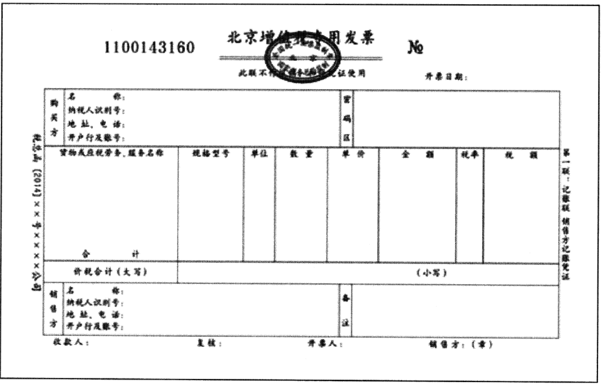

第四章增值税、消费税法律制度

# 1. 第一节税收法律制度概述

## 1.1. 一、税收与税收法律关系

### 1.1.1. （一）税收与税法

1.税收是指以`国家`为主体，为实现国家职能，凭借政治权力，按照法定标准，无偿取得财政收入的一种特定分配形式。它体现了国家与纳税人在征税、纳税的利益分配上的一种特定分配关系。税收是政府收入的最重要来源，是人类社会经济发展到一定历史阶段的产物。社会剩余产品和国家的存在是税收产生的基本前提。在社会主义市场经济运行中，税收主要具有资源配置、收入再分配、稳定经济和维护国家政权的作用。

税收与其他财政收入形式相比，具有`强制性`、`无偿性`和`固定性`的特征。

2.税法即税收法律制度，是调整税收关系的法律规范的总称，是国家法律的重要组成部分。它是以宪法为依据，调整国家与社会成员在征纳税上的权利与义务关系，维护社会经济秩序和纳税秩序，保障国家利益和纳税人合法权益的法律规范，是国家税务机关及一切纳税单位和个人依法征税、依法纳税的行为规则。

### 1.1.2. （二）税收法律关系

税收法律关系体现为国家征税与纳税人纳税的利益分配关系。在总体上税收法律关系与其他法律关系一样也是由主体、客体和内容三个方面构成。

1.主体，是指税收法律关系中享有权利和承担义务的当事人。在我国税收法律关系中，主体一方是代表国家行使征税职责的国家税务机关，包括国家各级税务机关和海关；另一方是履行纳税义务的人，包括法人、自然人和其他组织。对这种权利主体的确定，我国采取`属地兼属人`原则，即在华的外国企业、组织、外籍人、无国籍人等凡在中国境内有所得来源的，都是我国税收法律关系的主体。

2.客体，是指主体的权利、义务所共同指向的对象，也就是征税对象。如企业所得税法律关系客体就是生产经营所得和其他所得。

3.内容，是指主体所享受的权利和所应承担的义务，这是税收法律关系中最实质的东西，也是税法的灵魂。

## 1.2. 二、税法要素

税法要素是指各单行税法共同具有的基本要素。在税法体系里，既包括实体法，也包括程序法。税法要素一般包括`纳税人`、征税`对象`、税目、`税率`、计税`依据`、纳税`环节`、纳税`期限`、纳税`地点`、税收`优惠`、`法律责任`等。

1.纳税人，是指依法直接负有纳税义务的法人、自然人和其他组织。

与纳税人相联系的另一个概念是扣缴义务人。扣缴义务人是税法规定的，在其经营活动中负有代扣税款并向国库缴纳义务的单位。扣缴义务人必须按照税法规定代扣税款，并在规定期限缴入国库。

2.征税对象，又称课税对象，是纳税的客体。它是指税收法律关系中权利义务所指的对象，即对什么征税。不同的征税对象又是区别不同税种的重要标志。

3.税目，是税法中具体规定应当征税的项目，是征税对象的具体化。规定税目的目的有二：一是为了明确征税的具体范围；二是为了对不同的征税项目加以区分，从而制定高低不同的税率。

4.税率，是指应征税额与计税金额（或数量单位）之间的比例，是计算税额的尺度。税率的高低直接体现国家的政策要求，直接关系到国家财政收入和纳税人的负担程度，是税收法律制度中的核心要素。税率主要有：

（1）`比例`税率，是指对同一征税对象，不论其数额大小，均按同一个比例征税的税率。税率本身是应征税额与计税金额之间的比例。这里所说的比例税率是相对累进税率、定额税率而言。在比例税率中根据不同的情况又可划分为不同的征税比例，有行业比例税率、产品比例税率、地区差别比例税率、有免征额的比例税率、分档比例税率和幅度比例税率等。

（2）`累进`税率，是根据征税对象数额的逐渐增大，按不同等级逐步提高的税率。即征税对象数额越大，税率越高。累进税率又分为全额累进税率、超额累进税率和超率累进税率三种。

全额累进税率是按征税对象数额的逐步递增划分若干等级，并按等级规定逐步提高的税率。征税对象的金额达到哪一个等级，全部按相应的税率征税。目前，我国的税收法律制度中已不采用这种税率。

超额累进税率是将征税对象数额的逐步递增划分为若干等级，按等级规定相应的递增税率，对每个等级分别计算税额。

超率累进税率是按征税对象的某种递增比例划分若干等级，按等级规定相应的递增税率，对每个等级分别计算税额。我国的土地增值税采用这种税率。

（3）`定额`税率，又称固定税额，是指按征税对象的一定单位直接规定固定的税额，而不采取百分比的形式。

5.计税依据，是指计算`应纳税额`的依据或标准，即根据什么来计算纳税人应缴纳的税额。一般有两种：一是从价计征；二是从量计征。从价计征，是以计税金额为计税依据，计税金额是指征税对象的数量乘以计税价格的数额。从量计征，是以征税对象的重量、体积、数量等为计税依据。

6.纳税环节，主要是指税法规定的征税对象在从生产到消费的流转过程中应当缴纳税款的环节。

7.纳税期限，是指纳税人的纳税义务发生后应依法缴纳税款的期限。包括纳税义务发生时间、纳税期限和缴库期限。规定纳税期限是为了及时保证国家财政收入的实现，也是税收强制性和固定性的体现。税法中，根据不同的情况规定不同的纳税期限，纳税人必须在规定的纳税期限内缴纳税款。

8.纳税地点，是指根据各税种的纳税环节和有利于对税款的源泉控制而规定的纳税人（包括代征、代扣、代缴义务人）的具体申报缴纳税收的地方。

9.税收优惠，是指国家对某些纳税人和征税对象给予鼓励和照顾的一种特殊规定。制定这种特殊规定，一方面是为了鼓励和支持某些行业或项目的发展，另一方面是为了照顾某些纳税人的特殊困难。主要包括以下内容：

（1）减税和免税，减税是指对应征税款减少征收部分税款。免税是对按规定应征收的税款给予免除。减税和免税具体又分两种情况，一种是税法直接规定的长期减免税项目，另一种是依法给予的一定期限内的减免税措施，期满之后仍依规定纳税。

（2）起征点，也称“征税起点”，是指对征税对象开始征税的数额界限。征税对象的数额没有达到规定起征点的不征税；达到或超过起征点的，就其全部数额征税。

（3）免征额，是指对征税对象总额中免予征税的数额。即对纳税对象中的一部分给予减免，只就减除后的剩余部分计征税款。

10.法律责任，是指对违反国家税法规定的行为人采取的处罚措施。一般包括违法行为和因违法而应承担的法律责任两部分内容。这里讲的违法行为是指违反税法规定的行为，包括作为和不作为。税法中的法律责任包括行政责任和刑事责任。纳税人和税务人员违反税法规定，都将依法承担法律责任。

【例4-1】下列各项中，属于我国税法规定的税率形式有（）。

A.全额累进税率B.定额税率

C.比例税率D.超率累进税率

【解析】答案为BCD。我国现行税收法律制度中，已不采用全额累进税率。

## 1.3. 三、现行税种与征收机关

现阶段，我国税收征收管理机关有`税务机关`和`海关`。

税务机关主要负责下列税收的征收和管理：（1）国内增值税；（2）国内消费税；（3）企业所得税；（4）个人所得税；（5）资源税；（6）城镇土地使用税；（7）城市维护建设税；（8）印花税；（9）土地增值税；（10）房产税；（11）车船税；（12）车辆购置税；（13）烟叶税；（14）耕地占用税；（15）契税；（16）环境保护税。出口产品退税（增值税、消费税）由税务机关负责办理，非税收入和社会保险费的征收也由税务机关负责。

海关主要负责下列税收的征收和管理：（1）`关税`；（2）`船舶吨税`。`进口环节`的增值税、消费税由海关代征

# 2. 第二节增值税法律制度

增值税是对销售商品或者劳务过程中实现的`增值额`征收的一种税。增值税是我国现阶段税收收入规模最大的税种。1993年12月13日国务院令第134号发布、2008年11月10日国务院令第538号修订、2016年2月6日国务院令第666号第一次修订、2017年11月19日国务院令第691号第二次修订`《中华人民共和国增值税暂行条例》`（以下简称《增值税暂行条例》），2008年12月15日财政部、国家税务总局令第50号发布，2011年10月28日财政部、国家税务总局令第65号修正`《中华人民共和国增值税暂行条例实施细则》`（以下简称《增值税暂行条例实施细则》）。为进一步完善增值税制，消除重复征税，促进经济结构优化，经国务院常务会议决定，自2012年1月1日起，在上海市开展交通运输业和部分现代服务业营业税改征增值税试点。2016年3月24日，财政部、国家税务总局印发`《营业税改征增值税试点实施办法》`，自`2016年5月1日`起，在全国范围内全面推开“营改增”试点，建筑业、房地产业、金融业、生活服务业等全部营业税纳税人，纳入试点范围，由缴纳营业税改为缴纳增值税。这些构成我国增值税法律制度的主要内容。

## 2.4. 一、增值税纳税人和扣缴义务人

### 2.4.3. （一）纳税人

根据《增值税暂行条例》的规定，在中华人民共和国境内`销售`货物或者加工、修理修配劳务（以下简称劳务），销售服务、无形资产、不动产以及`进口货物`的单位和个人，为增值税的纳税人。单位，是指企业、行政单位、事业单位、军事单位、社会团体及其他单位。个人，是指个体工商户和其他个人。

单位以承包、承租、挂靠方式经营的，承包人、承租人、挂靠人（以下统称承包人）以发包人、出租人、被挂靠人（以下统称发包人）`名义`对外经营并由发包人承担相关法律责任的，以该发包人为纳税人。否则，以承包人为纳税人。

资管产品运营过程中发生的增值税应税行为，以资管产品`管理人`为增值税纳税人。

### 2.4.4. （二）纳税人的分类

根据纳税人的经营规模以及会计核算健全程度的不同，增值税的纳税人可划分为`小`规模纳税人和`一般`纳税人。

#### 2.4.4.1. 1.小规模纳税人。

（1）增值税小规模纳税人标准为年应征增值税`销售额500万元`及以下。年应税销售额，是指纳税人在连续不超过`12个月`或四个季度的经营期内累计应征增值税销售额，包括纳税`申报`销售额、稽查`查补`销售额、纳税评估`调整`销售额。

（2）已登记为增值税一般纳税人的单位和个人，转登记日前连续12个月或者连续4个季度累计销售额未超过500万元的，在2020年12月31日前，可选择`转登记`为小规模纳税人，其未抵扣的进项税额作转出处理。

小规模纳税人会计核算健全，能够提供准确税务资料的，可以向税务机关申请`登记`为`一般`纳税人，不再作为小规模纳税人。会计核算健全，是指能够按照国家统一的会计制度规定设置账簿，根据合法、有效凭证核算。

小规模纳税人实行`简易征税`办法，并且一般不使用增值税专用发票，但基于增值税征收管理中一般纳税人与小规模纳税人之间客观存在的经济往来的实情，小规模纳税人可以到税务机关`代开`增值税专用发票。

为持续推进放管服（即简政放权、放管结合、优化服务的简称）改革，全面推行小规模纳税人`自行`开具增值税专用发票。小规模纳税人（其他个人除外）发生增值税应税行为，需要开具增值税专用发票的，可以自愿使用增值税发票管理系统自行开具。

#### 2.4.4.2. 2.一般纳税人。

一般纳税人，是指年应税销售额超过财政部、国家税务总局规定的小规模纳税人标准的企业和企业性单位。

一般纳税人实行`登记制`，除另有规定外，应当向税务机关办理登记手续。

下列纳税人不办理一般纳税人登记：

（1）按照政策规定，`选择`按照小规模纳税人纳税的；

（2）年应税销售额超过规定标准的`其他个人`。

纳税人自一般纳税人生效之日起，按照增值税一般计税方法计算应纳税额，并可以按照规定`领用`增值税专用发票，财政部、国家税务总局另有规定的除外。

纳税人登记为一般纳税人后，不得转为小规模纳税人，国家税务总局另有规定的除外。

### 2.4.5. （三）扣缴义务人

中华人民共和国`境外的`单位或者个人在境内销售劳务，在境内未设有经营机构的，以其境内`代理人`为扣缴义务人；在境内没有代理人的，以`购买方`为扣缴义务人。

## 2.5. 二、增值税征税范围

增值税的征税范围包括在中华人民共和国境内`销售`货物或者劳务，销售服务、无形资产、不动产以及`进口货物`。

### 2.5.6. （一）销售货物13%

在中国境内销售货物，是指销售货物的`起运地`或者`所在地`在境内。

销售货物是`有偿转让`货物的`所有权`。货物，是指有形动产，包括电力、热力、气体在内。有偿，是指从购买方取得货币、货物或者其他经济利益。

### 2.5.7. （二）销售劳务13%

在中国境内销售劳务，是指提供的劳务`发生地`在境内。

销售劳务，是指有偿提供加工、修理修配劳务。单位或者个体工商户聘用的员工为本单位或者雇主提供加工、修理修配劳务不包括在内。

加工，是指受托加工货物，即委托方提供原料及主要材料，受托方按照委托方的要求，制造货物并收取`加工费`的业务；修理修配，是指受托对损伤和丧失功能的货物进行使其`恢复`原状和功能的业务。

【例4-2】下列各项中，属于增值税征税范围的有（）。

A.汽车维修B.手机修配

C.金银首饰加工D.电力销售

【解析】答案为ABCD。根据增值税法律制度的规定，销售劳务、电力均属于增值税征税范围。

### 2.5.8. （三）销售服务9%

销售服务，是指提供交通运输服务、邮政服务、电信服务、建筑服务、金融服务、现代服务、生活服务。

#### 2.5.8.3. 1.交通运输服务。9%

交通运输服务，是指利用`运输工具`将货物或者旅客送达目的地，使其空间位置得到转移的业务活动。包括陆路运输服务、水路运输服务、航空运输服务和管道运输服务。

（1）`陆路运输`服务，是指通过陆路（地上或者地下）运送货物或者旅客的运输业务活动，包括铁路运输服务和其他陆路运输服务。

出租车公司向使用本公司自有出租车的出租车司机收取的管理费用，按照陆路运输服务缴纳增值税。

（2）`水路运输`服务，是指通过江、河、湖、川等天然、人工水道或者海洋航道运送货物或者旅客的运输业务活动。

水路运输的`程租`、`期租`业务，属于水路运输服务。

（3）`航空运输`服务，是指通过空中航线运送货物或者旅客的运输业务活动。航空运输的`湿租`业务，属于航空运输服务。

航天运输服务，按照航空运输服务缴纳增值税。

航天运输服务，是指利用火箭等载体将卫星、空间探测器等空间飞行器发射到空间轨道的业务活动。

（4）`管道运输`服务，是指通过管道设施输送气体、液体、固体物质的运输业务活动。

无运输工具承运业务，按照交通运输服务缴纳增值税。

无运输工具承运业务，是指经营者以承运人身份与托运人签订运输服务合同，收取运费并承担承运人责任，然后委托实际承运人完成运输服务的经营活动。

#### 2.5.8.4. 2.邮政服务。9%

邮政服务，是指中国邮政集团公司及其所属邮政企业提供邮件寄递、邮政汇兑和机要通信等邮政基本服务的业务活动。包括邮政普遍服务、邮政特殊服务和其他邮政服务。

（1）邮政`普遍`服务，是指函件、包裹等邮件寄递，以及邮票发行、报刊发行和邮政汇兑等业务活动。

（2）邮政`特殊`服务，是指义务兵平常信函、机要通信、盲人读物和革命烈士遗物的寄递等业务活动。

（3）`其他`邮政服务，是指邮册等邮品销售、邮政代理等业务活动。

#### 2.5.8.5. 3.电信服务。

电信服务，是指利用有线、无线的电磁系统或者光电系统等各种通信网络资源，提供语音通话服务，传送、发射、接收或者应用图像、短信等电子数据和信息的业务活动。包括基础电信服务和增值电信服务。

（1）`基础`电信服务，是指利用固网、移动网、卫星、互联网，提供语音通话服务的业务活动，以及岀租或者出售带宽、波长等网络元素的业务活动。9%

（2）`增值`电信服务，是指利用固网、移动网、卫星、互联网、有线电视网络，提供短信和彩信服务、电子数据和信息的传输及应用服务、互联网接入服务等业务活动。6%

卫星电视信号落地转接服务，按照增值电信服务缴纳增值税。

#### 2.5.8.6. 4.建筑服务。9%

建筑服务，是指各类建筑物、构筑物及其附属设施的建造、修缮、装饰，线路、管道、设备、设施等的安装以及其他工程作业的业务活动。包括工程服务、安装服务、修缮服务、装饰服务和其他建筑服务。

（1）`工程`服务，是指新建、改建各种建筑物、构筑物的工程作业，包括与建筑物相连的各种设备或者支柱、操作平台的安装或者装设工程作业，以及各种窑炉和金属结构工程作业。

（2）`安装`服务，是指生产设备、动力设备、起重设备、运输设备、传动设备、医疗实验设备以及其他各种设备、设施的装配、安置工程作业，包括与被安装设备相连的工作台、梯子、栏杆的装设工程作业，以及被安装设备的绝缘、防腐、保温、油漆等工程作业。

固定电话、有线电视、宽带、水、电、燃气、暖气等经营者向用户收取的安装费、初装费、开户费、扩容费以及类似收费，按照安装服务缴纳增值税。

（3）`修缮`服务，是指对建筑物、构筑物进行修补、加固、养护、改善，使之`恢复`原来的使用价值或者`延长`其使用期限的工程作业。

（4）`装饰`服务，是指对建筑物、构筑物进行修饰装修，使之`美观`或者具有`特定用途`的工程作业。

（5）`其他`建筑服务，是指上列工程作业之外的各种工程作业服务，如钻并（打并）、拆除建筑物或者构筑物、平整土地、园林绿化、疏浚（不包括航道疏浚）、建筑物平移、搭脚手架、爆破、矿山穿孔、表面附着物（包括岩层、土层、沙层等）剥离和清理等工程作业。

#### 2.5.8.7. 5.金融服务。6%

金融服务，是指经营金融保险的业务活动。包括贷款服务、直接收费金融服务、保险服务和金融商品转让。

（1）`贷款`服务。贷款，是指将资金贷与他人使用而取得`利息收入`的业务活动。

各种占用、拆借资金取得的收入，包括金融商品持有期间（含到期）利息（保本收益、报酬、资金占用费、补偿金等）收入、信用卡透支利息收入、买入返售金融商品利息收入、融资融券收取的利息收入，以及融资性售后回租、押汇、罚息、票据贴现、转贷等业务取得的利息及利息性质的收入，按照贷款服务缴纳增值税。

融资性售后回租，是指承租方以融资为目的，将资产出售给从事融资性售后回租业务的企业后，从事融资性售后回租业务的企业将该资产出租给承租方的业务活动。

以货币资金投资收取的固定利润或者保底利润，按照贷款服务缴纳增值税。

（2）`直接收费`金融服务，是指为货币资金融通及其他金融业务提供相关服务并且收取费用的业务活动。包括提供货币兑换、账户管理、电子银行、信用卡、信用证、财务担保、资产管理、信托管理、基金管理、金融交易场所（平台）管理、资金结算、资金清算、金融支付等服务。

（3）`保险`服务，是指投保人根据合同约定，向保险人支付保险费，保险人对于合同约定的可能发生的事故因其发生所造成的财产损失承担赔偿保险金责任，或者当被保险人死亡、伤残、疾病或者达到合同约定的年龄、期限等条件时承担给付保险金责任的商业保险行为。包括人身保险服务和财产保险服务。

（4）金融商品`转让`，是指转让外汇、有价证券、非货物期货和其他金融商品所有权的业务活动。

其他金融商品转让包括基金、信托、理财产品等各类资产管理产品和各种金融衍生品的转让。

#### 2.5.8.8. 6.现代服务。6%

现代服务，是指围绕`制造业`、`文化`产业、现代`物流`产业等提供`技术性`、`知识性`服务的业务活动。包括研发和技术服务、信息技术服务、文化创意服务、物流辅助服务、租赁服务、鉴证咨询服务、广播影视服务、商务辅助服务和其他现代服务。

（1）`研发和技术服务`，包括研发服务、合同能源管理服务、工程勘察勘探服务、专业技术服务。

（2）`信息技术`服务，是指利用计算机、通信网络等技术对信息进行生产、收集、处理、加工、存储、运输、检索和利用，并提供信息服务的业务活动。包括软件服务、电路设计及测试服务、信息系统服务、业务流程管理服务和信息系统增值服务。

（3）`文化创意`服务，包括设计服务、知识产权服务、广告服务和会议展览服务。

（4）`物流辅助`服务，包括航空服务、港口码头服务、货运客运场站服务、打捞救助服务、装卸搬运服务、仓储服务和收派服务。

（5）`租赁`服务，包括融资租赁服务和经营租赁服务。

融资性售后回租不按照本税目缴纳增值税。

将建筑物、构筑物等不动产或者飞机、车辆等有形动产的广告位出租给其他单位或者个人用于发布广告，按照经营租赁服务缴纳增值税。

车辆停放服务、道路通行服务（包括过路费、过桥费、过闸费等）等按照不动产经营租赁服务缴纳增值税。

（6）`鉴证咨询`服务，包括认证服务、鉴证服务和咨询服务。翻译服务和市场调查服务按照咨询服务缴纳增值税。

（7）`广播影视`服务，包括广播影视节目（作品）的制作服务、发行服务和播映（含放映）服务。

（8）`商务辅助`服务，包括企业管理服务、经纪代理服务、人力资源服务、安全保护服务。

（9）`其他`现代服务，是指除研发和技术服务、信息技术服务、文化创意服务、物流辅助服务、租赁服务、鉴证咨询服务、广播影视服务和商务辅助服务以外的现代服务。

#### 2.5.8.9. 7.生活服务。6%

生活服务，是指为满足城乡居民`日常生活`需求提供的各类服务活动。包括文化体育服务、教育医疗服务、旅游娱乐服务、餐饮住宿服务、居民日常服务和其他生活服务。

（1）`文化体育`服务，包括文化服务和体育服务。

（2）`教育医疗`服务，包括教育服务和医疗服务。

（3）`旅游娱乐`服务，包括旅游服务和娱乐服务。

（4）`餐饮住宿`服务，包括餐饮服务和住宿服务。

（5）`居民日常`服务，是指主要为满足居民个人及其家庭日常生活需求提供的服务，包括市容市政管理、家政、婚庆、养老、殡葬、照料和护理、救助救济、美容美发、按摩、桑拿、氧吧、足疗、沐浴、洗染、摄影扩印等服务。

（6）`其他`生活服务，是指除文化体育服务、教育医疗服务、旅游娱乐服务、餐饮住宿服务和居民日常服务之外的生活服务。

### 2.5.9. （五）销售不动产9%

销售不动产，是指转让不动产所有权的业务活动。不动产，是指不能移动或者移动后会引起性质、形状改变的财产，包括建筑物、构筑物等。

建筑物，包括住宅、商业营业用房、办公楼等可供居住、工作或者进行其他活动的建造物。

构筑物，包括道路、桥梁、隧道、水坝等建造物。

转让建筑物有限产权或者永久使用权的，转让在建的建筑物或者构筑物所有权的，以及在转让建筑物或者构筑物时一并转让其所占土地的使用权的，按照销售不动产缴纳增值税。

### 2.5.10. （四）销售无形资产6%

销售无形资产，是指转让无形资产所有权或者使用权的业务活动。无形资产，是指不具有实物形态，但能带来经济利益的资产，包括技术、商标、著作权、商誉、自然资源使用权和其他权益性无形资产。

技术，包括专利技术和非专利技术。

自然资源使用权，包括土地使用权、海域使用权、探矿权、采矿权、取水权和其他自然资源使用权。

其他权益性无形资产，包括基础设施资产经营权、公共事业特许权、配额、经营权（包括特许经营权、连锁经营权、其他经营权）、经销权、分销权、代理权、会员权、席位权、网络游戏虚拟道具、域名、名称权、肖像权、冠名权、转会费等。

【例4-3】下列无形资产中，属于自然资源使用权的有（）。

A.土地使用权B.海域使用权C.采矿权D.经营权

【解析】答案为ABC。根据《营业税改征增值税试点实施办法》及相关的规定，土地使用权、海域使用权和采矿权属于自然资源使用权。经营权属于其他权益性无形资产。

### 2.5.11. （六）进口货物13%

进口货物，是指申报进入中国海关境内的货物。根据《增值税暂行条例》的规定，只要是报关进口的应税货物，均属于增值税的征税范围，除享受免税政策外，在进口环节缴纳增值税。

### 2.5.12. （七）非经营活动的界定

销售服务、无形资产或者不动产，是指有偿提供服务、有偿转让无形资产或者不动产，但属于下列非经营活动的情形除外：

1.`行政单位`收取的同时满足以下条件的政府性基金或者行政事业性收费。

（1）由国务院或者财政部批准设立的`政府性基金`，由国务院或者省级人民政府及其财政、价格主管部门批准设立的`行政事业性收费`；

（2）收取时开具`省`级以上（含省级）财政部门监（印）制的`财政票据`；

（3）所收款项全额`上缴财政`。

2.单位或者个体工商户`聘用`的员工为本单位或者雇主提供取得工资的服务。

3.单位或者个体工商户为`聘用`的员工提供服务。

4.财政部和国家税务总局规定的`其他`情形。

### 2.5.13. （八）境内销售服务、无形资产或者不动产的界定

1.在境内销售服务、无形资产或者不动产，是指：

（1）服务（租赁不动产除外）或者无形资产（自然资源使用权除外）的`销售方`或者`购买方`在境内；

（2）所销售或者租赁的`不动产`在境内；

（3）所销售自然资源使用权的`自然资源`在境内；

（4）财政部和国家税务总局规定的`其他`情形。

2.下列情形不属于在境内销售服务或者无形资产：

（1）境外单位或者个人向境内单位或者个人销售完全在境外发生的服务；

（2）境外单位或者个人向境内单位或者个人销售完全在境外使用的无形资产；

（3）境外单位或者个人向境内单位或者个人出租完全在境外使用的有形动产；

（4）财政部和国家税务总局规定的其他情形。

### 2.5.14. （九）视同销售货物行为

1.单位或者个体工商户的下列行为，`视同`销售货物，征收增值税：

（1）将货物交付其他单位或者个人`代销`；

（2）销售`代销`货物；

（3）设有两个以上机构并实行`统一核算`的纳税人，将货物从一个机构移送至其他机构用于销售，但相关机构设在同一县（市）的除外；

（4）将自产或者委托加工的货物用于`非`增值税应税项目；

（5）将自产、委托加工的货物用于`集体福利`或者`个人消费`；

（6）将自产、委托加工或者购进的货物作为`投资`，提供给其他单位或者个体工商户；

（7）将自产、委托加工或者购进的货物`分配`给股东或者投资者；

（8）将自产、委托加工或者购进的货物`无偿赠送`其他单位或者个人。

【例4-4】下列行为中，应视同销售货物征收增值税的有（）。

A.将外购货物分配给股东B.将`外购`货物用于个人消费

C.将自产货物无偿赠送他人D.将自产货物用于集体福利

【解析】答案为ACD。根据增值税法律制度的规定，将外购货物用于个人消费，其购进货物的进项税额不允许抵扣，不属于增值税视同销售货物的情形，而选项A、选项C、选项D三种情形属于增值税视同销售货物的情形。

2.单位或者个人的下列情形`视同`销售服务、无形资产或者不动产，征收增值税：

（1）单位或者个体工商户向其他单位或者个人`无偿提供`服务，但用于公益事业或者以社会公众为对象的除外；

（2）单位或者个人向其他单位或者个人`无偿转让`无形资产或者不动产，但用于公益事业或者以社会公众为对象的除外；

（3）财政部和国家税务总局规定的`其他`情形。

### 2.5.15. （十）混合销售

一项销售行为如果既涉及`货物`又涉及`服务`，为混合销售。从事货物的生产、批发或者零售的单位和个体工商户的混合销售行为，按照销售`货物`缴纳增值税；其他单位和个体工商户的混合销售行为，按照销售`服务`缴纳增值税。

上述从事货物的生产、批发或者零售的单位和个体工商户，包括以从事货物的生产、批发或者零售为主，并兼营销售服务的单位和个体工商户在内。

自2017年5月起，纳税人销售`活动板房`、`机器设备`、`钢结构件`等自产货物的同时提供`建筑`、`安装`服务，不属于混合销售，应`分别核算`货物和建筑服务的销售额，分别适用不同的税率或者征收率。

•f【例4-5】下列各项中，属于增值税混合销售行为的有（）。

A.百货商店在销售商品的同时又提供送货服务

B.餐饮公司提供餐饮服务的同时又销售烟酒

C.建材商店在销售木质地板的同时提供安装服务

D.歌舞厅在提供娱乐服务的同时销售食品

【解析】答案为ABCD。根据增值税法律制度的规定，选项A、选项B、选项C、选项D均属于增值税混合销售行为。

### 2.5.16. （十一）兼营

兼营，是指纳税人的经营中包括销售货物、劳务以及销售服务、无形资产和不动产的行为。

纳税人发生兼营行为，应当`分别核算`适用不同税率或征收率的销售额，未分别核算销售额的，按照以下办法适用税率或征收率：

1.兼有不同税率的销售货物、劳务、服务、无形资产或者不动产，`从高`适用税率。

2.兼有不同征收率的销售货物、劳务、服务、无形资产或者不动产，`从高`适用征收率。

3.兼有不同税率和征收率的销售货物、劳务、服务、无形资产或者不动产，`从高`适用税率。

### 2.5.17. （十二）不征收增值税项目

1.根据`国家指令`无偿提供的铁路运输服务、航空运输服务，属于《营业税改征增值税试点实施办法》规定的用于`公益事业`的服务。

2.`存款利息`。

3.被保险人获得的`保险赔付`。

4.房地产主管部门或者其指定机构、公积金管理中心、开发企业以及物业管理单位代收的住宅专项`维修资金`。

5.在资产重组过程中，通过合并、分立、岀售、置换等方式，将全部或者部分实物资产以及与其相关联的债权、负债和`劳动力`一并转让给其他单位和个人，其中涉及的不动产、土地使用权转让行为。

6.纳税人在资产重组过程中，通过合并、分立、出售、置换等方式，将全部或者部分实物资产以及与其相关联的债权、负债和`劳动力`一并转让给其他单位和个人，不属于增值税的征税范围，其中涉及的货物转让，不征收增值税。

## 2.6. 三、增值税税率和征收率

### 2.6.18. （一）增值税税率

1.纳税人销售货物、劳务、有形动产租赁服务或者进口货物，除《增值税暂行条例》第二条第2项、第4项、第5项（即下列第2、4、5项）另有规定外，税率为13%。

2.纳税人销售交通运输、邮政、基础电信、建筑、不动产租赁服务，销售不动产，转让土地使用权，销售或者进口下列货物，税率为9%：

（1）粮食等农产品、食用植物油、食用盐；

（2）自来水、暖气、冷气、热水、煤气、石油液化气、天然气、二甲醍、沼气、居民用煤炭制品；

（3）图书、报纸、杂志、音像制品、电子出版物；

（4）饲料、化肥、农药、农机、农膜；

（5）国务院规定的其他货物。

3.纳税人销售服务、无形资产，除《增值税暂行条例》第二条第1项、第2项、第5项（即上述第1、2项和下列第5项）另有规定外，税率为6%。

4.纳税人出口货物，税率为零；但是，国务院另有规定的除外。

5.境内单位和个人跨境销售国务院规定范围内的服务、无形资产，税率为零。包括：

（1）国际运输服务。

（2）航天运输服务。

（3）向境外单位提供的完全在境外消费的下列服务：①研发服务。②合同能源管理服务。③设计服务。④广播影视节目（作品）的制作和发行服务。⑤软件服务。⑥电路设计及测试服务。⑦信息系统服务。⑧业务流程管理服务。⑨离岸服务外包业务。⑩转让技术。

（4）国务院规定的其他服务。

### 2.6.19. （二）增值税征收率

#### 2.6.19.10. 1.征收率的一般规定。

小规模纳税人以及一般纳税人选择`简易`办法计税的，征收率为3%。另有规定除外。具体为：

（1）一般纳税人销售自己`使用过的`属于《增值税暂行条例》第十条规定，不得抵扣且未抵扣进项税额的固定资产，按简易办法依3%征收率`减按2%`征收增值税。

（2）一般纳税人销售自己`使用过的`其他固定资产（以下简称“已使用过的固定资产”）应区分不同情形征收增值税：

①销售自己使用过的2009年1月1日以后购进或者自制的固定资产，按照适用`税率`征收增值税。

②2008年12月31日以前未纳入扩大增值税抵扣范围试点的纳税人，销售自己使用过的2008年12月31日以前购进或者自制的固定资产，按照简易办法依照3%征收率`减按2%`征收增值税。

③2008年12月31日以前已纳入扩大增值税抵扣范围试点的纳税人，销售自己使用过的在本地区扩大增值税抵扣范围试点以前购进或者自制的固定资产，按照简易办法依照3%征收率`减按2%`征收增值税；销售自己使用过的在本地区扩大增值税抵扣范围试点以后购进或者自制的固定资产，按照适用`税率`征收增值税。

（3）一般纳税人销售自己使用过的除固定资产以外的物品，应当按照适用税率征收增值税。

（4）小规模纳税人（除其他个人外，下同）销售自己使用过的固定资产，`减按2%`征收率征收增值税。

小规模纳税人销售自己使用过的除固定资产以外的物品，应按3%的征收率征收增值税。

（5）纳税人销售`旧货`，按照简易办法依照3%征收率`减按2%`征收增值税。

旧货，是指进入二次流通的具有部分使用价值的货物（含旧汽车、旧摩托车和旧游艇），但不包括自己使用过的物品。

（6）一般纳税人销售`自产的`下列货物，可`选择`按照简易办法依照`3%征收率`计算缴纳增值税，选择简易办法计算缴纳增值税后，`36个月`内不得变更，具体适用范围为：

①`县`级及县级以下小型`水力发电`单位生产的电力。小型水力发电单位，是指各类投资主体建设的装机容量为5万千瓦以下（含5万千瓦）的小型水力发电单位。

②建筑用和生产建筑材料所用的砂、土、石料。

③以自己采掘的砂、土、石料或其他矿物连续生产的砖、瓦、石灰（不含黏土实心砖、瓦）。

④用微生物、微生物代谢产物、动物毒素、人或动物的血液或组织制成的生物制品。

⑤自来水（对属于一般纳税人的自来水公司销售自来水按简易办法依照3%的征收率征收增值税，不得抵扣其购进自来水取得增值税扣税凭证上注明的增值税税款）。

⑥商品混凝土（仅限于以水泥为原料生产的水泥混凝土）。

（7）一般纳税人销售货物属于下列情形之一的，暂按简易办法依照`3%的征收率`计算缴纳增值税：

①寄售商店`代销`寄售物品（包括居民个人寄售的物品在内）；

②典当业销售`死当`物品。

（8）建筑企业一般纳税人提供建筑服务属于`老项目`的，可以选择简易办法依照`3%的征收率`征收增值税。

自2020年3月1日至12月31日，对湖北省增值税小规模纳税人，适用3%征收率的应税销售收入，免征增值税。除湖北省外，其他省、自治区、直辖市的增值税小规模纳税人，适用3%征收率的应税销售收入，减按1%征收率征收增值税。

#### 2.6.19.11. 2.征收率的特殊规定。

（1）小规模纳税人转让其取得的`不动产`，按照`5%的征收率`征收增值税。

（2）一般纳税人转让其2016年4月30日前取得的`不动产`，`选择`简易计税方法计税的，按照`5%的征收率`征收增值税。

（3）小规模纳税人`出租`其取得的不动产（不含个人出租住房），按照`5%的征收率`征收增值税。

（4）一般纳税人`出租`其2016年4月30日前取得的不动产，选择简易计税方法计税的，按照`5%的征收率`征收增值税。

（5）房地产开发企业（一般纳税人）销售自行开发的房地产`老项目`，选择简易计税方法计税的，按照`5%的征收率`征收增值税。

（6）房地产开发企业（小规模纳税人）销售自行开发的房地产项目，按照`5%的征收率`征收增值税。

（7）纳税人提供劳务派遣服务，选择差额纳税的，按照`5%的征收率`征收增值税。

## 2.7. 四、增值税应纳税额的计算

### 2.7.20. （一）一般计税方法应纳税额的计算

一般纳税人`销售`货物、劳务、服务、无形资产、不动产（以下简称应税销售行为），釆取一般计税方法计算应纳增值税额。其计算公式为：

应纳税额＝当期`销项`税额—当期`进项`税额

当期销项税额小于当期进项税额不足抵扣时，其不足部分可以`结转下期`继续抵扣。

销项税额是指纳税人发生应税销售行为，按照销售额和适用税率计算并向购买方收取的增值税税款，其计算公式为：

销项税额＝销售额×适用税率

可见，一般计税方法计算增值税应纳税额时，主要有两个因素：一是销售额；二是进项税额。

#### 2.7.20.12. 1.销售额的确定。

##### 2.7.20.12.1. （1）销售额的概念。

销售额是指纳税人发生应税销售行为向购买方收取的全部`价款`和价外`费用`，但是不包括收取的销项税额。价外费用，包括价外向购买方收取的手续费、补贴、基金、集资费、返还利润、奖励费、违约金、滞纳金、延期付款利息、赔偿金、代收款项、代垫款项、包装费、包装物租金、储备费、优质费、运输装卸费以及其他各种性质的价外收费。上述价外费用无论其会计制度如何核算，均应并入销售额计算销项税额。但下列项目不包括在销售额内：

①受托加工应征消费税的消费品所`代收代缴的消费税`。

②同时符合以下条件代为收取的`政府`性基金或者`行政`事业性收费：由国务院或者财政部批准设立的政府性基金，由国务院或者省级人民政府及其财政、价格主管部门批准设立的行政事业性收费；收取时开具省级以上财政部门印制的财政票据；所收款项全额上缴财政。

③销售货物的同时代办保险等而向购买方收取的`保险费`，以及向购买方收取的代购买方缴纳的车辆购置税、车辆牌照费。

④以委托方名义开具发票代委托方收取的款项。

##### 2.7.20.12.2. （2）含税销售额的换算。

增值税实行价外税，计算销项税额时，销售额中不应含有增值税款。如果销售额中包含了增值税款即销项税额，则应将含税销售额换算成不含税销售额。其计算公式为：

不含税销售额＝含税销售额／（1＋增值税税率）

##### 2.7.20.12.3. （3）视同销售货物的销售额的确定。

《增值税暂行条例实施细则》规定了8种视同销售货物行为，这8种视同销售行为一般不以资金的形式反映出来，因而会出现无销售额的情况。在此情况下，税务机关有权按照下列顺序`核定`其销售额：

①按纳税人最近时期`同类`货物的`平均`销售价格确定；

②按`其他`纳税人最近时期同类货物的平均销售价格确定；

③按`组成`计税价格确定。其计算公式为：

组成计税价格＝成本×（1+成本`利润率`）

征收增值税的货物，同时又征收消费税的，其组成计税价格中应包含消费税税额。其计算公式为：

组成计税价格＝成本×（1＋成本利润率）＋消费税税额

组成计税价格＝成本×（1＋成本利润率）／（1－消费税税率）

公式中的成本分两种情况：一是销售自产货物的为实际生产成本；二是销售外购货物的为实际釆购成本。公式中的成本利润率为`10%`。但属于应从价定率征收消费税的货物，其组成计税价格公式中的成本利润率，为《消费税若干具体问题的规定》中规定的成本利润率（详见本章第三节消费税法律制度）。

纳税人销售货物或者劳务的价格明显偏低并无正当理由的，由税务机关按照上述方法`核定`其销售额。

《营业税改征增值税试点实施办法》规定，纳税人销售服务、无形资产或者不动产价格明显偏低或者偏高且不具有合理商业目的的，或者发生无销售额的，税务机关有权按照下列顺序确定销售额：

第一，按照纳税人`最近`时期销售同类服务、无形资产或者不动产的`平均`价格确定。

第二，按照`其他`纳税人最近时期销售同类服务、无形资产或者不动产的平均价格确定。

第三，按照`组成`计税价格确定。组成计税价格的公式为：

组成计税价格＝成本×（1＋成本`利润率`）

成本利润率由国家税务总局确定。

不具有合理商业目的，是指以谋取税收利益为主要目的，通过人为安排，减少、免除、推迟缴纳增值税税款，或者增加退还增值税税款。

##### 2.7.20.12.4. （4）混合销售的销售额的确定。

依照《营业税改征增值税试点实施办法》及相关规定，混合销售的销售额为货物的销售额与服务销售额的`合计`。

##### 2.7.20.12.5. （5）兼营的销售额的确定。

依照《营业税改征增值税试点实施办法》及相关规定，纳税人兼营不同税率的货物、劳务、服务、无形资产或者不动产，应当`分别核算`不同税率或者征收率的销售额；未分别核算销售额的，`从高`适用税率。

##### 2.7.20.12.6. （6）特殊销售方式下销售额的确定。

①折扣方式销售。折扣销售是指销货方在销售货物时，因购货方购货数量较大等原因而给予购货方的价格优惠。纳税人釆取折扣方式销售货物，如果销售额和折扣额在`同一张发票`上分别注明，可以按折扣后的销售额征收增值税；如果将折扣额另开发票，不论其在财务上如何处理，均不得从销售额中减除折扣额。

②以旧换新方式销售。以旧换新销售是指纳税人在销售货物时，折价收回同类旧货物，并以折价款部分冲减新货物价款的一种销售方式。纳税人釆取以旧换新方式销售货物的，应按`新货物`的同期销售价格确定销售额，`不得扣减`旧货物的收购价格。

但是对`金银首饰`以旧换新业务，可以按销售方`实际收取的`不含增值税的全部`价款`征收增值税。

③还本销售方式销售。还本销售是指纳税人在销售货物后，到一定期限将货款一次或分次退还给购货方全部或部分价款的一种销售方式。这种方式实际上是一种`筹资`，是以货物换取资金的使用价值，到期还本不付息的方法。纳税人采取还本销售方式销售货物，其销售额就是`货物`的销售价格，`不得`从销售额中`减除`还本支出。

④以物易物方式销售。以物易物是指购销双方不是以货币结算，而是以同等价款的货物相互结算，实现货物购销的一种方式。以物易物双方都应作`购销`处理，以各自发出的货物核算销售额并计算销项税额，以各自收到的货物按规定核算购货额并计算进项税额。在以物易物活动中，应分别开具合法的票据，如收到的货物不能取得相应的增值税专用发票或其他合法票据的，不能抵扣进项税额。

⑤直销方式销售。直销企业先将货物销售给直销员，直销员再将货物销售给消费者的，直销企业的销售额为其向`直销员`收取的全部价款和价外费用。直销员将货物销售给消费者时，应按照现行规定缴纳增值税。

直销企业通过直销员向消费者销售货物，`直接`向消费者收取货款，直销企业的销售额为其向`消费者`收取的全部价款和价外费用。

##### 2.7.20.12.7. （7）包装物押金。

包装物是指纳税人包装本单位货物的各种物品。一般情况下，销货方向购货方收取包装物押金，购货方在规定时间内返还包装物，销货方再将收取的包装物押金返还。纳税人为销售货物而出租、出借包装物收取的押金，`单独`记账核算的，且时间在`1年以内`，又未过期的，不并入销售额征税；但对因逾期未收回包装物不再退还的押金，应按所包装货物的适用税率计算增值税款。实践中，应注意以下具体规定：

①“逾期”是指按合同约定实际逾期或以1年为期限，对收取1年以上的押金，无论是否退还均并入销售额征税。

②包装物押金是`含税收入`，在并入销售额征税时，需要先将该押金换算为不含税收入，再计算应纳增值税款。

③包装物押金不同于包装物租金，包装物租金属于价外费用，在销售货物时随同货款一并计算增值税款。

④从1995年6月1日起，对销售除啤酒、黄酒外的其他酒类产品而收取的包装物押金，无论是否返还以及会计上如何核算，均应并入当期销售额征收增值税。

##### 2.7.20.12.8. （8）“营改增”行业销售额的规定。

①贷款服务，以提供贷款服务取得的全部`利息`及利息性质的收入为销售额。

②直接收费金融服务，以提供直接收费金融服务收取的手续费、佣金、酬金、管理费、服务费、经手费、开户费、过户费、结算费、转托管费等`各类费用`为销售额。

③金融商品转让，按照卖出价扣除买入价后的`余额`为销售额。

转让金融商品出现的正负差，按盈亏相抵后的余额为销售额。若相抵后出现负差，可结转下一纳税期与下期转让金融商品销售额相抵，但年末时仍岀现负差的，`不得`转入下一个会计年度。

金融商品的买入价，可以选择按照加权平均法或者移动加权平均法进行核算，选择后`36个月`内不得变更。

金融商品转让，不得开具增值税专用发票。

④经纪代理服务，以取得的全部价款和价外费用，扣除向委托方收取并代为支付的政府性基金或者行政事业性收费后的`余额`为销售额。向委托方收取的政府性基金或者行政事业性收费，不得开具增值税专用发票。

⑤航空运输企业的销售额，`不包括`代收的机场建设费和代售其他航空运输企业客票而代收转付的价款。

⑥试点纳税人中的一般纳税人提供客运场站服务，以其取得的全部价款和价外费用，扣除支付给承运方运费后的`余额`为销售额。

⑦试点纳税人提供旅游服务，可以选择以取得的全部价款和价外费用，扣除向旅游服务购买方收取并支付给其他单位或者个人的住宿费、餐饮费、交通费、签证费、门票费和支付给其他接团旅游企业的旅游费用后的`余额`为销售额。

选择上述办法计算销售额的试点纳税人，向旅游服务购买方收取并支付的上述费用，不得开具增值税专用发票，可以开具普通发票。

⑧试点纳税人提供建筑服务适用简易计税方法的，以取得的全部价款和价外费用扣除支付的分包款后的`余额`为销售额。

⑨房地产开发企业中的一般纳税人销售其开发的房地产项目（选择简易计税方法的房地产老项目除外），以取得的全部价款和价外费用，扣除受让土地时向政府部门支付的土地价款后的`余额`为销售额。

房地产老项目，是指《建筑工程施工许可证》注明的合同开工日期在2016年4月30日前的房地产项目。

##### 2.7.20.12.9. （9）销售额确定的特殊规定。

①纳税人兼营免税、减税项目的，应当`分别核算`免税、减税项目的销售额；未分别核算的，不得免税、减税。

②纳税人发生应税销售行为，开具增值税专用发票后，发生开票有误或者销售折让、中止、退回等情形的，应当按照国家税务总局的规定开具`红字`增值税专用发票；未按照规定开具红字增值税专用发票的，不得扣减销项税额或者销售额。

##### 2.7.20.12.10. （10）外币销售额的折算。

纳税人按人民币以外的货币结算销售额的，其销售额的人民币折合率可以选择销售额发生的`当天`或者`当月1日`的人民币外汇中间价。纳税人应在事先确定采用何种折合率，确定后在`1年内`不得变更。

【例4-6】关于计税销售额的下列表述中，正确的有（）。

A.金融企业转让金融商品，按照卖出价扣除买入价后的余额为销售额

B.银行提供贷款服务，以提供贷款服务取得的全部利息及利息性质的收入为销售额

C.建筑企业提供建筑服务适用一般计税方法的，以取得的全部价款和价外费用扣除支付的分包款后的余额为销售额

D.房地产开发企业销售其开发的房地产项目适用一般计税方法的，以取得的全部价款和价外费用，扣除受让土地时向政府部门支付的土地价款后的余额为销售额

【解析】答案为ABD。根据《营业税改征增值税试点实施办法》及相关规定，试点纳税人提供建筑服务适用简易计税方法的，以取得的全部价款和价外费用扣除支付的分包款后的余额为销售额。

#### 2.7.20.13. 2.进项税额的确定。

进项税额，是指纳税人购进货物、劳务、服务、无形资产或者不动产，支付或者负担的增值税额。

（1）准予从销项税额中抵扣的进项税额。

①从销售方取得的增值税`专用`发票（含税控机动车销售统一发票，下同）上注明的增值税额。

②从海关取得的`海关`进口增值税`专用`缴款书上注明的增值税额。

③购进农产品，取得一般纳税人开具的增值税专用发票或者海关进口增值税专用缴款书的，以增值税专用发票或海关进口增值税专用缴款书上注明的增值税额为进项税额；从按照简易计税方法依照`3%征收率`计算缴纳增值税的小规模纳税人取得增值税专用发票的，以增值税专用发票上注明的`金额`和`9%的扣除率`计算进项税额；取得（开具）农产品销售发票或收购发票的，以农产品收购发票或销售发票上注明的农产品`买价`和`9%的扣除率`计算进项税额；纳税人购进用于生产或者委托加工`13%税率`货物的农产品，按照`10%的扣除率`计算进项税额。进项税额计算公式为：

进项税额＝买价×扣除率

购进农产品，按照《农产品增值税进项税额核定扣除试点实施办法》抵扣进项税额的除外。

④纳税人购进国内旅客运输服务未取得增值税专用发票的，暂按照以下规定确定进项税额：

取得增值税电子普通发票的，为`发票`上注明的税额；

取得注明旅客身份信息的航空运输电子客票行程单的，按照下列公式计算进项税额：

航空旅客运输进项税额＝（票价＋燃油附加费）／（1＋9%）×9%

取得注明旅客身份信息的铁路车票的，按照下列公式计算进项税额：

铁路旅客运输进项税额＝票面金额／（1＋9%）×9%

取得注明旅客身份信息的公路、水路等其他客票的，按照下列公式计算进项税额：

公路、水路等其他旅客运输进项税额＝票面金额／（1＋3%）×3%

⑤自境外单位或者个人购进劳务、服务、无形资产或者境内的不动产，从税务机关或者扣缴义务人取得的代扣代缴税款的`完税凭证`上注明的增值税额。

⑥原增值税一般纳税人购进货物或者接受劳务，用于《销售服务、无形资产或者不动产注释》所列项目的，不属于《增值税暂行条例》第十条规定不得抵扣进项税额的项目，其进项税额准予从销项税额中抵扣。

⑦原增值税一般纳税人购进服务、无形资产或者不动产，取得的增值税专用发票上注明的增值税额为进项税额，准予从销项税额中抵扣。

⑧原增值税一般纳税人自用的应征消费税的摩托车、汽车、游艇，其进项税额准予从销项税额中抵扣。

纳税人购进货物、劳务、服务、无形资产、不动产，取得的增值税扣税凭证不符合法律、行政法规或者国务院税务主管部门有关规定的，其进项税额`不得`从销项税额中抵扣。

增值税扣税凭证，是指增值税专用发票、海关进口增值税专用缴款书、农产品收购发票、农产品销售发票、完税凭证和符合规定的国内旅客运输发票。

纳税人凭完税凭证抵扣进项税额的，应当具备书面合同、付款证明和境外单位的对账单或者发票。资料不全的，其进项税额不得从销项税额中抵扣。

【例4-7】甲公司为增值税一般纳税人，2019年9月购进国内旅客运输服务，取得的下列票据中，可以作为进项税额抵扣依据的有（）。

A.增值税电子普通发票

B.注明员工身份信息的航空运输电子客票行程单

C.注明员工身份信息的铁路车票

D.注明员工身份信息的公路、水路客票

【解析】答案为ABCD。为推进增值税实质性减税，自2019年4月1日起，增值税一般纳税人购进国内旅客运输服务，取得增值税专用发票，电子普通发票，注明旅客身份信息的航空运输电子客票行程单、铁路车票和公路、水路等其他客票，可以作为进项税额的抵扣依据。

（2）不得从销项税额中抵扣的进项税额。

①用于`简易`计税方法计税项目、免征增值税项目、集体福利或者个人消费的购进货物、劳务、服务、无形资产和不动产。其中涉及的固定资产、无形资产、不动产，仅指专用于上述项目的固定资产、无形资产（不包括其他权益性无形资产）、不动产。

如果是既用于上述不允许抵扣项目又用于抵扣项目的，该进项税额`准予`全部抵扣。自2018年1月1日起，纳税人租入固定资产、不动产，既用于一般计税方法计税项目，又用于简易计税方法计税项目、免征增值税项目、集体福利或者个人消费的，其进项税额准予从销项税额中全额抵扣。

纳税人的交际应酬消费属于个人消费。

②非正常损失的购进货物，以及相关的劳务和交通运输服务。

③非正常损失的在产品、产成品所耗用的购进货物（不包括固定资产）、劳务和交通运输服务。

④非正常损失的不动产，以及该不动产所耗用的购进货物、设计服务和建筑服务。

⑤非正常损失的不动产在建工程所耗用的购进货物、设计服务和建筑服务。

纳税人新建、改建、扩建、修缮、装饰不动产，均属于不动产在建工程。

⑥购进的贷款服务、餐饮服务、居民日常服务和娱乐服务。

⑦纳税人接受贷款服务向贷款方支付的与该笔贷款直接相关的投融资顾问费、手续费、咨询费等费用，其进项税额不得从销项税额中抵扣。

⑧财政部和国家税务总局规定的其他情形。

上述第④项、第⑤项所称货物，是指构成不动产实体的材料和设备，包括建筑装饰材料和给排水、采暖、卫生、通风、照明、通讯、煤气、消防、中央空调、电梯、电气、智能化楼宇设备及配套设施。

不动产、无形资产的具体范围，按照《销售服务、无形资产或者不动产注释》执行。固定资产，是指使用期限超过12个月的机器、机械、运输工具以及其他与生产经营有关的设备、工具、器具等有形动产。

非正常损失，是指因`管理不善`造成货物被盗、丢失、霉烂变质，以及因`违反`法律法规造成货物或者不动产被依法没收、销毁、拆除的情形。

【例4-8】下列各项中，不得从销项税额中抵扣进项税额的是（）。

A.购进生产用燃料所支付的增值税款

B.不合格产品耗用材料所支付的增值税款

C.因管理不善被盗材料所支付的增值税款

D.购进不动产耗用装修材料所支付的增值税款

【解析】答案为C。根据增值税法律制度的规定，因管理不善造成被盗、丢失、霉烂变质的损失以及被执法部门依法没收或者强令自行销毁的货物的增值税款不允许从销项税额中抵扣。

（3）适用一般计税方法的纳税人，`兼营`简易计税方法计税项目、免征增值税项目而无法划分不得抵扣的进项税额，按照下列公式计算不得抵扣的进项税额：

不得抵扣的进项税额＝当期无法划分的全部进项税额×（当期简易计税方法计税项目销售额＋免征增值税项目销售额）／当期全部销售额

税务机关可以按照上述公式依据年度数据对不得抵扣的进项税额进行`清算`。

（4）根据《增值税暂行条例实施细则》的规定，一般纳税人当期购进的货物或劳务用于生产经营，其进项税额在当期销项税额中予以抵扣。但已抵扣进项税额的购进货物或劳务如果事后改变用途，用于集体福利或者个人消费、购进货物发生非正常损失、在产品或产成品发生非正常损失等，应当将该项购进货物或者劳务的进项税额从当期的进项税额中扣减；无法确定该项进项税额的，按当期外购项目的实际成本计算应扣减的进项税额。

（5）已抵扣进项税额的固定资产，发生《增值税暂行条例》规定的不得从销项税额中抵扣情形的，应在当月按下列公式计算不得抵扣的进项税额：

不得抵扣的进项税额＝固定资产`净值`×适用税率

固定资产净值，是指纳税人按照财务会计制度计提折旧后计算的固定资产净值。

（6）已抵扣进项税额的购进服务，发生《营业税改征增值税试点实施办法》规定的不得从销项税额中抵扣情形（简易计税方法计税项目、免征增值税项目除外）的，应当将该进项税额从当期进项税额中扣减；无法确定该进项税额的，按照当期实际成本计算应扣减的进项税额。

（7）已抵扣进项税额的无形资产，发生《营业税改征增值税试点实施办法》规定的不得从销项税额中抵扣情形的，按照下列公式计算不得抵扣的进项税额：

不得抵扣的进项税额＝无形资产`净值`×适用税率

无形资产净值，是指纳税人根据财务会计制度摊销后的余额。

（8）已抵扣进项税额的不动产，发生非正常损失，或者改变用途，专用于简易计税方法计税项目、免征增值税项目、集体福利或者个人消费的，按照下列公式计算不得抵扣的进项税额，并从当期进项税额中扣减：

不得抵扣的进项税额＝已抵扣进项税额×不动产净值率

不动产净值率＝（不动产净值／不动产原值）×100%

（9）纳税人适用一般计税方法计税的，因销售折让、中止或者退回而退还给购买方的增值税额，应当从当期的销项税额中`扣减`；因销售折让、中止或者退回而收回的增值税额，应当从当期的进项税额中`扣减`。

（10）有下列情形之一者，应当按照销售额和增值税税率计算应纳税额，`不得抵扣`进项税额，也`不得`使用增值税`专用`发票：

①一般纳税人会计核算`不健全`，或者不能够提供准确税务资料的。

②应当办理一般纳税人资格登记而`未办理`的。

（11）自2019年4月1日起，增值税一般纳税人取得不动产或者不动产在建工程的进项税额不再分2年抵扣。此前按照规定尚未抵扣完毕的待抵扣进项税额，可自2019年4月税款所属期起从销项税额中抵扣。

取得不动产，包括以直接购买、接受捐赠、接受投资入股、自建以及抵债等各种形式取得不动产。

（12）根据《营业税改征增值税试点实施办法》及相关规定，不得抵扣且未抵扣进项税额的固定资产、无形资产，发生用途改变，用于允许抵扣进项税额的应税项目，可在用途改变的次月按照下列公式，计算可以抵扣的进项税额：

可以抵扣的进项税额＝固定资产、无形资产`净值`／（1＋适用税率）×适用税率

上述可以抵扣的进项税额应取得合法有效的增值税扣税凭证。

（13）按照规定不得抵扣进项税额的不动产，发生改变用途，用于允许抵扣进项税额项目的，按照下列公式在改变用途的次月计算可抵扣进项税额：

可抵扣进项税额＝增值税扣税凭证注明或计算的进项税额×不动产`净值率`

（14）一般纳税人发生下列应税行为可以选择适用`简易`计税方法计税，`不允许抵扣`进项税额。

①`公共交通`运输服务，包括轮客渡、公交客运、地铁、城市轻轨、出租车、长途客运、班车。

②经认定的`动漫企业`为开发动漫产品提供的动漫脚本编撰、形象设计、背景设计、动画设计、分镜、动画制作、摄制、描线、上色、画面合成、配音、配乐、音效合成、剪辑、字幕制作、压缩转码（面向网络动漫、手机动漫格式适配）服务，以及在境内转让动漫版权（包括动漫品牌、形象或者内容的授权及再授权）。

③电影放映服务、仓储服务、装卸搬运服务、收派服务和文化体育服务。

④以纳入“营改增”试点之日前取得的`有形动产`为标的物提供的`经营租赁`服务。

⑤在纳入“营改增”试点之日前签订的尚未执行完毕的有形动产租赁合同。

【例4-9】“营改增”试点一般纳税人发生的下列应税行为中，可以选择简易计税方法计税的有（）。

A.公交客运服务B.动画设计服务

C.仓储服务D.装卸搬运服务

【解析】答案为ABCD。根据《营业税改征增值税试点实施办法》及相关规定，“营改增”试点一般纳税人提供公交客运服务、动画设计服务、仓储服务和装卸搬运服务，可以选择适用简易计税方法计税。

【例4-10】某银行为增值税`一般`纳税人，2019年第三季度发生的有关经济业务如下：

（1）`购进`5台自助存取款机，取得增值税专用发票注明的金额为`40`万元，增值税为`5.2`万元；

（2）`租入`一处底商作为营业部，租金总额为`105`万元，取得增值税专用发票注明的金额为`100`万元，增值税为`5`万元；

（3）办理公司业务，`收取`结算手续费（含税）`31.8`万元；`收取`账户管理费（含税）`26.5`万元；

（4）办理贷款业务，`取得`利息收入（含税）`1.06亿`元；

（5）吸收存款8亿元。

已知：该银行取得增值税专用发票均符合抵扣规定；提供金融服务适用的增值税税率为6%。计算该银行第三季度应纳增值税税额。

【解析】根据《营业税改征增值税试点实施办法》及相关规定：（1）购进自助存取款机的进项税额允许抵扣；（2）租入办公用房的进项税额允许抵扣；（3）办理公司业务，收取的手续费和账户管理费属于直接收费金融服务，应缴纳增值税；（4）办理贷款业务收取利息收入，属于贷款服务，应缴纳增值税；（5）吸收存款不属于增值税征税范围。

计算过程：

进项税额=5.2+5=10.2（万元）

销项税额=(31.8+26.5+1.06\*10000)/1.06\*0.06=603.3（万元）

应纳税额=603.3-10.2=593.1（万元）

【例4-11】某小五金制造企业为增值税`一般`纳税人，2019年10月发生经济业务如下：

（1）`购进`一批原材料，取得增值税专用发票注明的金额为50万元，增值税为`6.5`万元。支付运费，取得增值税`普通`发票注明的金额为2万元，增值税为`0.18`万元；

（2）`接受`其他企业投资转入材料一批，取得增值税专用发票注明的金额为100万元，增值税为`13`万元；

（3）`购进`低值易耗品，取得增值税专用发票注明的金额6万元，增值税为`0.78`万元；

（4）`销售`产品一批，取得不含税销售额`200`万元，另外收取包装物租金`1.13`万元；

（5）采取以旧换新方式`销售`产品，新产品含税售价为`7.91`万元，旧产品作价2万元；

（6）因仓库`管理不善`，上月购进的一批工具被盗，该批工具的买价为`8`万元（购进工具的进项税额已抵扣）。

已知：该企业取得增值税专用发票均符合抵扣规定；购进和销售产品适用的增值税税率为13%。计算该企业当月应纳增值税税额。

【解析】根据增值税法律制度的规定：（1）购进材料的进项税额允许抵扣，支付运费未取得增值税专用发票，进项税额不允许抵扣；（2）接受投资的材料的进项税额和购进低值易耗品的进项税额均可以抵扣；（3）包装物租金属于价外费用，应当按照含税价换算为不含税价计算增值税销项税额；（4）以旧换新应当按照新产品的价格计算增值税销项税额；（5）购进工具因管理不善被盗，按照规定应将进项税额转出。

计算过程：

（1）进项税额＝6.5+13+0.78＝20.28（万元）

（2）销项税额＝200×13%+1.13/（1+13%）×13%+7.91/（1+13%）×13%＝26+0.13+0.91＝27.04（万元）

（3）进项税额转出＝8×13%＝1.04（万元）

（4）应纳增值税税额＝27.04-20.28+1.04＝7.8（万元）

进项税额=6.5`+0.18`+13+0.78-8\*0.13=19.42（万元）

销项税额=200\*0.13+1.13/1.13\*0.13+7.91/1.13\*0.13=27.04（万元）

应纳税额=27.04-19.42=7.62（万元）

### 2.7.21. （二）简易计税方法应纳税额的计算

小规模纳税人发生应税销售行为采用`简易`计税方法计税，应按照`销售额`和`征收率`计算应纳增值税税额，不得抵扣进项税额。其计算公式为：

应纳税额＝销售额×征收率

简易计税方法的销售额不包括其应纳税额，纳税人采用销售额和应纳税额合并定价方法的，按照下列公式计算销售额：

销售额＝含税销售额/（1+征收率）

纳税人适用简易计税方法计税的，因销售折让、中止或者退回而退还给购买方的销售额，应当从当期销售额中扣减。扣减当期销售额后仍有余额造成多缴的税款，可以从以后的应纳税额中扣减。

一般纳税人发生财政部和国家税务总局规定的特定应税行为，可以选择适用简易计税方法计税，但一经选择，`36个月`内不得变更。

【例4-12】某企业为增值税`小`规模纳税人，专门从事商业咨询服务。2019年10月发生以下业务：

（1）15日，向某一般纳税人企业`提供`资讯信息服务，取得含增值税销售额`3.09`万元；

（2）20日，向某小规模纳税人`提供`注册信息服务，取得含增值税销售额`1.03`万元；

（3）25日，`购进`办公用品，支付价款`2.06`万元，并取得增值税普通发票。

已知增值税征收率为3%。计算该企业当月应纳增值税税额。

【解析】根据《营业税改征增值税试点实施办法》及相关规定，小规模纳税人提供应税服务，采用简易办法征税，销售额中含有增值税款的，应换算为不含税销售额，计算应纳税额，购进货物支付的增值税款不允许抵扣。

销售额＝（3.09+1.03）/（1+3%）＝4（万元）

应纳增值税税额＝4×3%＝0.12（万元）

应纳税额=(3.09+1.03`+2.06`)/1.03\*0.03=0.18（万元）

### 2.7.22. （三）进口货物应纳税额的计算

纳税人进口货物，无论是一般纳税人还是小规模纳税人，均应按照`组成`计税价格和规定的税率计算应纳税额，不允许抵扣发生在境外的任何税金。其计算公式为：

应纳税额＝`组成`计税价格×`税率`

组成计税价格的构成分两种情况：

1.如果进口货物不征收消费税，则上述公式中组成计税价格的计算公式为：

组成计税价格＝关税完税价格+关税

2.如果进口货物征收消费税，则上述公式中组成计税价格的计算公式为：

组成计税价格＝关税完税价格+关税+消费税

根据《海关法》和《进出口关税条例》的规定，一般贸易下进口货物的关税完税价格以海关审定的成交价格为基础的`到岸价格`作为完税价格。所谓成交价格是一般贸易项下进口货物的买方为购买该项货物向卖方实际支付或应当支付的价格；到岸价格，包括货价，加上货物运抵我国关境内输入地点`起卸前`的包装费、运费、保险费和其他劳务费等费用构成的一种价格。

特殊贸易下进口的货物，由于进口时没有“成交价格”可作依据，为此，《进出口关税条例》对这些进口货物制定了确定其完税价格的具体办法。

关于消费税和关税的计算方法详见本章第三节`消费税`法律制度和第六章第八节`关税`法律制度有关内容。

【例4-13】某外贸公司为增值税一般纳税人，2019年9月从国外进口一批普通商品，海关核定的关税完税价格为200万元。已知进口关税税率为10%，增值税税率为13%。计算该公司进口环节应纳增值税税额。

【解析】根据增值税法律制度的规定，进口货物应纳增值税额，按照组成计税价格和规定税率计算。

（1）进口环节应纳关税税额＝200×10%＝20（万元）

（2）进口环节应纳增值税税额＝（200+20）×13%＝28.6（万元）

应纳税额=200\*1.1\*0.13=28.6（万元）

【例4-14】某公司为增值税一般纳税人，2019年10月从国外进口一批高档化妆品，海关核定的关税完税价格为300万元，已纳关税40万元。已知消费税税率为15%，增值税税率为13%。计算该公司进口环节应纳增值税税额。

【解析】根据增值税法律制度的规定，进口货物如果缴纳消费税，则计算增值税应纳税额时，组成的计税价格中含有消费税税款。

（1）进口环节应纳消费税税额＝（300+40）/（1-15%）×15%＝400×15%＝60（万元）

（2）组成计税价格＝300+40+60＝400（万元）

（3）进口环节应纳增值税税额＝400×13%＝52（万元）

应纳税额=(300+40)/0.85\*0.13=52（万元）

### 2.7.23. （四）扣缴计税方法

境外单位或者个人在境内发生应税销售行为，在境内未设有经营机构的，扣缴义务人按照下列公式计算应扣缴税额：

应扣缴税额＝购买方支付的`价款`/（1+税率）×税率

## 2.8. 五、增值税税收优惠

### 2.8.24. （一）《增值税暂行条例》及其实施细则规定的免税项目

1.农业生产者销售的自产`农产品`。

2.`避孕`药品和用具。

3.`古旧图书`。古旧图书，是指向社会收购的古书和旧书。

4.直接用于`科学研究`、科学试验和教学的进口仪器、设备。

5.外国政府、国际组织`无偿援助`的进口物资和设备。

6.由残疾人的组织直接进口供`残疾人专用`的物品。

7.销售自己使用过的物品。自己使用过的物品，是指`其他个人`自己使用过的物品。

### 2.8.25. （二）“营改增”试点过渡政策的规定

#### 2.8.25.14. 1.下列项目免征增值税。

（1）托儿所、`幼儿园`提供的保育和教育服务。

托儿所、幼儿园，是指经`县`级以上教育部门审批成立、取得办园`许可证`的实施0〜6岁学前教育的机构，包括公办和民办的托儿所、幼儿园、学前班、幼儿班、保育院、幼儿院。

公办托儿所、幼儿园免征增值税的收入是指，在`省`级财政部门和价格主管部门审核报省级人民政府批准的收费标准以内收取的教育费、保育费。

民办托儿所、幼儿园免征增值税的收入是指，在报经当地有关部门`备案`并公示的收费标准范围内收取的教育费、保育费。

超过规定收费标准的收费，以开办实验班、特色班和兴趣班等为由另外收取的费用以及与幼儿入园挂钩的赞助费、支教费等超过规定范围的收入，不属于免征增值税的收入。

（2）养老机构提供的`养老`服务。

养老机构，是指依照民政部《养老机构设立许可办法》（民政部令第48号）设立并依法办理`登记`的为老年人提供集中居住和照料服务的各类养老机构；养老服务，是指上述养老机构按照民政部《养老机构管理办法》（民政部令第49号）的规定，为收住的老年人提供的生活照料、康复护理、精神慰藉、文化娱乐等服务。

（3）`残疾人`福利机构提供的育养服务。

（4）`婚姻`介绍服务。

（5）`殡葬`服务。

（6）`残疾人员`本人为社会提供的服务。

（7）医疗机构提供的`医疗服务`。

医疗机构，是指依据国务院《医疗机构管理条例》（国务院令第149号）及卫生部《医疗机构管理条例实施细则》（卫生部令第35号）的规定，经`登记`取得《医疗机构执业许可证》的机构，以及军队、武警部队各级各类医疗机构。具体包括：各级各类医院、门诊部（所）、社区卫生服务中心（站）、急救中心（站）、城乡卫生院、护理院（所）、疗养院、临床检验中心，各级政府及有关部门举办的卫生防疫站（疾病控制中心）、各种专科疾病防治站（所），各级政府举办的妇幼保健所（站）、母婴保健机构、儿童保健机构，各级政府举办的血站（血液中心）等医疗机构。

本项所称的医疗服务，是指医疗机构按照不高于地（市）级以上价格主管部门会同同级卫生主管部门及其他相关部门制定的医疗服务`指导价格`（包括政府指导价和按照规定由供需双方协商确定的价格等）为就医者提供《全国医疗服务价格项目规范》所列的各项服务，以及医疗机构向社会提供卫生防疫、卫生检疫的服务。

（8）从事`学历教育`的学校提供的教育服务。

①学历教育，是指受教育者经过国家教育考试或者国家规定的其他入学方式，进入国家有关部门批准的学校或者其他教育机构学习，获得国家承认的学历证书的教育形式。具体包括：

初等教育：普通小学、成人小学。

初级中等教育：普通初中、职业初中、成人初中。

高级中等教育：普通高中、成人高中和中等职业学校（包括普通中专、成人中专、职业高中、技工学校）。

高等教育：普通本专科、成人本专科、网络本专科、研究生（博士、硕士）、高等教育自学考试、高等教育学历文凭考试。

②从事学历教育的学校，是指：

`普通`学校。

经地（市）级以上人民政府或者同级政府的教育行政部门批准成立、国家承认其学员学历的`各类`学校。

经`省`级及以上人力资源社会保障行政部门批准成立的技工学校、高级技工学校。

经`省`级人民政府批准成立的技师学院。

上述学校均包括符合规定的从事学历教育的民办学校，但不包括职业培训机构等国家不承认学历的教育机构。

③提供教育服务免征增值税的收入，是指对列入规定招生计划的在籍学生提供学历教育服务取得的收入，具体包括：经有关部门审核批准并按规定`标准`收取的学费、住宿费、课本费、作业本费、考试报名费收入，以及学校食堂提供餐饮服务取得的伙食费收入。除此之外的收入，包括学校以各种名义收取的赞助费、择校费等，不属于免征增值税的范围。

学校食堂是指依照《学校食堂与学生集体用餐卫生管理规定》（教育部令第14号）管理的学校食堂。

（9）学生`勤工俭学`提供的服务。

（10）`农业`机耕、排灌、病虫害防治、植物保护、农牧保险以及相关技术培训业务，家禽、牲畜、水生动物的配种和疾病防治。

农业机耕，是指在农业、林业、牧业中使用农业机械进行耕作（包括耕耘、种植、收割、脱粒、植物保护等）的业务；排灌，是指对农田进行灌溉或者排涝的业务；病虫害防治，是指从事农业、林业、牧业、渔业的病虫害测报和防治的业务；农牧保险，是指为种植业、养殖业、牧业种植和饲养的动植物提供保险的业务；相关技术培训，是指与农业机耕、排灌、病虫害防治、植物保护业务相关以及为使农民获得农牧保险知识的技术培训业务；家禽、牲畜、水生动物的配种和疾病防治业务的免税范围，包括与该项服务有关的提供药品和医疗用具的业务。

（11）纪念馆、博物馆、文化馆、文物保护单位管理机构、美术馆、展览馆、书画院、图书馆在自己的场所提供`文化`体育服务取得的`第一道门票`收入。

（12）寺院、宫观、清真寺和教堂举办文化、宗教活动的`门票`收入。

（13）行政单位之外的其他单位收取的符合《营业税改征增值税试点实施办法》第十条规定条件的政府性基金和行政事业性收费。

（14）个人转让`著作权`。

（15）个人销售自建自用`住房`。

（16）2020年12月31日前，公共租赁住房经营管理单位岀租`公共租赁住房`。

（17）`台湾航运公司`、航空公司从事海峡两岸海上直航、空中直航业务在大陆取得的运输收入。

（18）纳税人提供的直接或者间接`国际`货物运输代理服务。

（19）符合规定条件的贷款、债券`利息收入`。

（20）被撤销金融机构以货物、不动产、无形资产、有价证券、票据等财产`清偿债务`。

（21）保险公司开办的一年期以上人身保险产品取得的`保费`收入。

（22）符合规定条件的`金融商品`转让收入。

（23）金融同业往来`利息收入`。

（24）同时符合规定条件的担保机构从事中小企业信用担保或者再担保业务取得的收入（不含信用评级、咨询、培训等收入）`3年内`免征增值税。

（25）国家商品储备管理单位及其直属企业承担商品储备任务，从中央或者地方财政取得的利息补贴收入和价差补贴收入。

（26）纳税人提供`技术`转让、技术开发和与之相关的技术咨询、技术服务。

（27）同时符合规定条件的合同`能源管理`服务。

（28）2020年12月31日前，`科普`单位的`门票`收入，以及`县`级及以上党政部门和科协开展科普活动的门票收入。

（29）`政府`举办的从事学历教育的高等、中等和初等学校（不含下属单位），举办进修班、培训班取得的全部归该学校所有的收入。

（30）`政府`举办的职业学校设立的主要为在校学生提供实习场所并由学校出资自办、由学校负责经营管理、经营收入归学校所有的企业，从事《销售服务、无形资产或者不动产注释》中“现代服务”（不含融资租赁服务、广告服务和其他现代服务）、“生活服务”（不含文化体育服务、其他生活服务和桑拿、氧吧）业务活动取得的收入。

（31）家政服务企业由`员工制`家政服务员提供家政服务取得的收入。

（32）福利`彩票`、体育彩票的发行收入。

（33）`军队`空余房产租赁收入。

（34）为了配合国家`住房制度`改革，企业、行政事业单位按房改成本价、标准价出售住房取得的收入。

（35）将`土地使用权`转让给`农业生产者`用于农业生产。

（36）涉及`家庭财产分割`的个人无偿转让不动产、土地使用权。

（37）土地所有者`出让`土地使用权和土地使用者将土地使用权`归还`给土地所有者。

（38）`县`级以上地方人民政府或自然资源行政主管部门出让、转让或收回`自然资源`使用权（不含土地使用权）。

（39）随`军`家属就业。

（40）`军队`转业干部就业。

（41）提供`社区`养老、托育、家政等服务取得的收入。

#### 2.8.25.15. 2.增值税即征即退。

（1）一般纳税人提供`管道`运输服务，对其增值税实际税负`超过3%`的部分实行增值税即征即退政策。

（2）经人民银行、银监会或者商务部批准从事融资租赁业务的试点纳税人中的一般纳税人，提供有形动产融资租赁服务和有形动产融资性售后回租服务，对其增值税实际税负`超过3%`的部分实行增值税即征即退政策。商务部授权的`省`级商务主管部门和国家经济技术开发区批准的从事融资租赁业务和融资性售后回租业务的试点纳税人中的一般纳税人，2016年5月1日后实收资本达到1.7亿元的，从达到标准的`当月`起按照上述规定执行；2016年5月1日后实收资本未达到1.7亿元但注册资本达到1.7亿元的，在2016年7月31日前仍可按照上述规定执行，2016年8月1日后开展的有形动产融资租赁业务和有形动产融资性售后回租业务不得按照上述规定执行。

（3）本规定所称增值税实际税负，是指纳税人当期提供应税服务实际缴纳的增值税额占纳税人当期提供应税服务取得的全部价款和价外费用的比例。

#### 2.8.25.16. 3.扣减增值税规定。

（1）`退役士兵`创业就业。

（2）`重点群体`创业就业。

#### 2.8.25.17. 4.

金融企业发放贷款后，自结息日起`90日内`发生的应收未收利息按现行规定缴纳增值税，自结息日起`90日后`发生的应收未收利息暂不缴纳增值税，待实际收到利息时按规定缴纳增值税。

#### 2.8.25.18. 5.

个人将购买不足`2年`的住房对外销售的，按照5%的征收率`全额`缴纳增值税；个人将购买`2年以上`（含2年）的住房对外销售的，`免征`增值税。上述政策适用于北京市、上海市、广州市和深圳市之外的地区。

个人将购买不足2年的住房对外销售的，按照5%的征收率全额缴纳增值税；个人将购买2年以上（含2年）的`非普通住房`对外销售的，以销售收入减去购买住房价款后的`差额`按照5%的征收率缴纳增值税；个人将购买2年以上（含2年）的普通住房对外销售的，免征增值税。上述政策仅适用于北京市、上海市、广州市和深圳市。

上述增值税优惠政策除已规定期限的项目和第5项政策外，其他均在“营改增”试点期间执行。如果试点纳税人在纳入“营改增”试点之日前已经按照有关政策规定享受了营业税税收优惠，在剩余税收优惠政策期限内，按照规定享受有关增值税优惠。

### 2.8.26. （三）跨境行为免征增值税的政策规定

境内的单位和个人销售的下列服务和无形资产`免征`增值税，但财政部和国家税务总局规定适用增值税零税率的除外：

1.下列服务：

（1）工程项目在境外的`建筑`服务。

（2）工程项目在境外的`工程监理`服务。

（3）工程、矿产资源在境外的工程`勘察`勘探服务。

（4）会议展览地点在境外的会议`展览`服务。

（5）存储地点在境外的`仓储`服务。

（6）标的物在境外使用的有形动产`租赁`服务。

（7）在境外提供的广播影视节目（作品）的`播映`服务。

（8）在境外提供的`文化`体育服务、`教育`医疗服务、`旅游`服务。

2.为`出口`货物提供的`邮政`服务、`收派`服务、`保险`服务。

为出口货物提供的保险服务，包括出口货物保险和出口信用保险。

3.向境外单位提供的完全在`境外消费`的下列服务和无形资产：

（1）`电信`服务。

（2）`知识产权`服务。

（3）`物流辅助`服务（仓储服务、收派服务除外）。

（4）`鉴证`咨询服务。

（5）专业`技术服务`。

（6）`商务辅助`服务。

（7）广告投放地在境外的`广告`服务。

（8）`无形资产`。

4.以无运输工具承运方式提供的`国际运输`服务。

5.为境外单位之间的货币资金融通及其他金融业务提供的`直接收费`金融服务，且该服务与境内的货物、无形资产和不动产无关。

6.财政部和国家税务总局规定的`其他`服务。

### 2.8.27. （四）起征点

纳税人发生应税销售行为的销售额未达到增值税`起征点`的，免征增值税；达到起征点的，全额计算缴纳增值税。

增值税起征点的适用范围限于`个人`，且不适用于登记为一般纳税人的个体工商户。起征点的幅度规定如下：

1.按期纳税的，为月销售额5000\~20000元（含本数）。

2.按次纳税的，为每次（日）销售额300-500元（含本数）。

起征点的调整由财政部和国家税务总局规定。省、自治区、直辖市财政厅（局）和税务局应当在规定的幅度内，根据实际情况确定本地区适用的起征点，并报财政部和国家税务总局备案。

### 2.8.28. （五）小微企业免税规定

1.自2019年1月1日至2021年12月31日，增值税`小`规模纳税人发生增值税应税销售行为，合计月销售额未超过`10万元`的，免征增值税。其中，以1个季度为纳税期限的增值税小规模纳税人，季度销售额未超过30万元的，免征增值税。

小规模纳税人发生增值税应税销售行为，合计月销售额超过10万元，但扣除本期发生的销售`不动产`的销售额后未超过10万元的，其销售货物、劳务、服务、无形资产取得的销售额免征增值税。

2.增值税小规模纳税人月销售额未超过10万元的，当期因开具增值税专用发票已经缴纳的税款，在专用发票全部联次`追回`或者按规定开具`红字`专用发票后，可以向税务机关申请`退还`。

3.其他个人釆取一次性收取租金形式出租不动产，取得的租金收入，可在租金对应的租赁期内平均分摊，分摊后的月租金收入不超过`10万元`的，可享受小微企业免征增值税的优惠政策。

### 2.8.29. （六）其他减免税规定

1.纳税人兼营免税、减税项目的，应当`分别核算`免税、减税项目的销售额；未分别核算销售额的，不得免税、减税。

2.纳税人发生应税销售行为适用免税规定的，可以放弃免税，依照《增值税暂行条例》或者《营业税改征增值税试点实施办法》的规定缴纳增值税。放弃免税后，`36个月内`不得再申请免税。

3.纳税人发生应税销售行为同时适用免税和零税率规定的，纳税人可以选择适用免税或者零税率。

## 2.9. 六、增值税征收管理

### 2.9.30. （一）纳税义务发生时间

1.纳税人发生应税销售行为，为`收讫销售款项`或者取得索取销售款项凭据的当天；先开具发票的，为`开具发票`的当天。具体为：

（1）采取直接收款方式销售货物，不论货物是否发岀，均为`收到`销售款或者取得索取销售款凭据的当天。

纳税人生产经营活动中釆取直接收款方式销售货物，已将货物移送对方并暂估销售收入入账，但既未取得销售款或取得索取销售款凭据也未开具销售发票的，其纳税义务发生时间为取得销售款或取得索取销售款凭据的当天；先开具发票的，为开具发票的当天。

（2）采取托收承付和委托银行收款方式销售货物，为`发出货物`并办妥托收`手续`的当天。

（3）采取赊销和分期收款方式销售货物，为书面`合同约定`的收款日期的当天，无书面合同的或者书面合同没有约定收款日期的，为`货物发出`的当天。

（4）采取预收货款方式销售货物，为`货物发出`的当天，但生产销售生产工期超过12个月的大型机械设备、船舶、飞机等货物，为`收到`预收款或者书面`合同`约定的收款日期的当天。

（5）委托其他纳税人代销货物，为收到代销单位的`代销清单`或者收到全部或部分`货款`的当天。未收到代销清单及货款的，为发出代销货物`满180天`的当天。

（6）纳税人提供租赁服务采取预收款方式的，其纳税义务发生时间为收到`预收款`的当天。

（7）纳税人从事金融商品转让的，为金融商品所有权`转移`的当天。

（8）纳税人发生相关视同销售货物行为，为货物`移送`的当天。

（9）纳税人发生视同销售劳务、服务、无形资产、不动产情形的，其纳税义务发生时间为劳务、服务、无形资产`转让`完成的当天或者不动产权属`变更`的当天。

2.纳税人进口货物，其纳税义务发生时间为`报关进口`的当天。

3.增值税`扣缴义务`发生时间为纳税人增值税`纳税义务`发生的当天。

### 2.9.31. （二）纳税地点

1.固定业户应当向其`机构所在地`的税务机关申报纳税。总机构和分支机构不在同一县（市）的，应当分别向各自所在地的税务机关申报纳税；经国务院财政、税务部门或者其授权的财政、税务机关批准，可以由总机构汇总向总机构所在地的税务机关申报纳税。

2.固定业户到外县（市）销售货物或者劳务，应当向其机构所在地的税务机关`报告`外出经营事项，并向其机构所在地的税务机关申报纳税；未报告的，应当向`销售地`或者劳务发生地的税务机关申报纳税；未向销售地或者劳务发生地的税务机关申报纳税的，由其`机构所在地`的税务机关`补征`税款。

3.非固定业户销售货物或者劳务，应当向`销售地`或者劳务发生地的税务机关申报纳税；未向销售地或者劳务发生地的税务机关申报纳税的，由其`机构所在地`或者`居住地`的税务机关补征税款。

4.进口货物，应当向报关地`海关`申报纳税。

5.其他个人提供建筑服务，销售或者租赁不动产，转让自然资源使用权，应向建筑服务`发生地`、不动产`所在地`、自然资源`所在地`税务机关申报纳税。

6.扣缴义务人应当向其`机构所在地`或者`居住地`的税务机关申报缴纳其扣缴的税款。

### 2.9.32. （三）纳税期限

根据《增值税暂行条例》及其实施细则和《营业税改征增值税试点实施办法》的规定，增值税的纳税期限分别为1日、3日、5日、10日、15日、1个月或者1个季度。

纳税人的具体纳税期限，由税务机关根据纳税人应纳税额的大小分别核定；不能按照固定期限纳税的，可以按`次`纳税。以1个季度为纳税期限的规定适用于`小`规模纳税人、银行、财务公司、信托投资公司、信用社，以及财政部和国家税务总局规定的其他纳税人。

纳税人以1个月或者1个季度为1个纳税期的，自期满之日起`15日内`申报纳税；以1日、3日、5日、10日或者15日为1个纳税期的，自期满之日起`5日内`预缴税款，于次月1日起`15日内`申报纳税并结清上月应纳税款。

扣缴义务人解缴税款的期限，依照上述规定执行。

纳税人进口货物，应当自海关填发进口增值税专用缴款书之日起`15日内`缴纳税款。

【例4-15】下列关于增值税纳税义务发生时间的表述中，正确的有（）。

A.纳税人发生视同销售货物行为，为货物移送的当天

B.销售劳务，为提供劳务同时收讫销售款或者取得索取销售款的凭据的当天

C.纳税人进口货物，为从海关提货的当天

D.采取托收承付方式销售货物，为发出货物的当天

【解析】答案为AB。根据增值税法律制度的规定，纳税人进口货物，为报关进口的当天。采取托收承付方式销售货物，为发出货物并办妥托收手续的当天。

【例4-16】某房地产企业采取预收款方式销售不动产，其纳税义务发生时间为收到预收款的当天。判断该种说法是否正确。

【解析】不正确。根据《营业税改征增值税试点实施办法》以及相关规定，纳税人提供`租赁`服务采取预收款方式的，其纳税义务发生时间为收到预收款的当天，不包括提供建筑服务和销售不动产。

## 2.10. 七、增值税专用发票使用规定

增值税专用发票，是增值税一般纳税人发生应税`销售行为`开具的发票，是购买方支付增值税额并可按照增值税有关规定据以抵扣增值税进项税额的凭证。

一般纳税人应通过增值税防伪税控系统使用专用发票。使用，包括领购、开具、缴销、认证、稽核比对专用发票及其相应的数据电文。

### 2.10.33. （一）专用发票的联次及用途

专用发票由`基本`联次或者基本联次附加`其他`联次构成，基本联次为3联，分别为：

1.发票联，作为`购买方`核算采购成本和增值税进项税额的记账凭证；

2.抵扣联，作为购买方`报送`主管税务机关认证和留存备查的扣税凭证；

3.记账联，作为`销售方`核算销售收入和增值税销项税额的记账凭证。

其他联次用途，由一般纳税人自行确定。自2014年8月1日起启用新版增值税专用发票，如图4-1所示。

图4-1增值税专用发票票样

### 2.10.34. （二）专用发票的领购

一般纳税人领购专用设备后，凭《最高开票限额申请表》《发票领购簿》到税务机关办理初始发行。初始发行，是指税务机关将一般纳税人的企业名称、纳税人识别号、开票限额、购票限量、购票人员姓名、密码、开票机数量、国家税务总局规定的其他信息等载入空白金税盘和IC卡的行为。一般纳税人凭《发票领购簿》、金税盘（或IC卡）和经办人身份证明`领购`专用发票。

一般纳税人有下列情形之一的，不得领购开具专用发票：

1.会计核算`不健全`，不能向税务机关准确提供增值税销项税额、进项税额、应纳税额数据及其他有关增值税税务资料的。

2.有《税收征管法》规定的税收`违法行为`，拒不接受税务机关处理的。

3.有下列行为之一，经税务机关责令限期改正而仍`未改正`的：

（1）`虚开`增值税专用发票；

（2）`私自`印制专用发票；

（3）向税务机关以外的单位和个人`买取`专用发票；

（4）`借用`他人专用发票；

（5）未`按规定`开具专用发票；

（6）未`按规定`保管专用发票和专用设备；

（7）未`按规定`申请办理防伪税控系统变更发行；

（8）未`按规定`接受税务机关检查。

有上列情形的，如已领购专用发票，税务机关应`暂扣`其结存的专用发票和IC卡。

### 2.10.35. （三）专用发票的使用管理

1.专用发票开票限额。

专用发票实行最高开票限额管理。最高开票限额，是指单份专用发票开具的销售额合计数不得达到的上限额度。

最高开票限额由一般纳税人`申请`，区县税务机关依法`审批`。一般纳税人申请最高开票限额时，需填报《增值税专用发票最高开票限额申请单》。主管税务机关受理纳税人申请以后，根据需要进行实地`查验`，实地查验的范围和方法由各省税务机关确定。自2014年5月1日起，一般纳税人申请增值税专用发票最高开票限额不超过`10万元`的，主管税务机关不需要事前进行实地查验。

2.专用发票开具范围。

一般纳税人发生应税销售行为，应当向索取增值税专用发票的购买方开具专用发票。属于下列情形之一的，`不得`开具增值税专用发票：

（1）商业企业一般纳税人`零售`烟、酒、食品、服装、鞋帽（不包括劳保专用部分）、化妆品等`消费品`的；

（2）应税销售行为的购买方为消费者`个人`的；

（3）发生应税销售行为适用`免税`规定的。

3.专用发票开具要求。

专用发票应按下列要求开具：

（1）项目`齐全`，与实际交易相符；

（2）字迹`清楚`，不得压线、错格；

（3）发票联和抵扣联加盖财务`专用章`或者发票专用章；

（4）按照增值税纳税义务的发生`时间`开具。

【例4-17】下列业务中，一般纳税人允许开具增值税专用发票的为（）。

A.向个人提供餐饮服务

B.向某科技公司零售烟酒、食品

C.向一般纳税人销售货物

D.向个人销售房屋

【解析】答案为c。根据增值税法律制度的规定，选项A、选项B、选项D三种情形不允许开具专用发票。

# 3. 第三节消费税法律制度

消费税是对`特定的`某些消费品和消费行为征收的一种间接税。1993年12月13日中华人民共和国国务院令第135号发布、2008年11月10日国务院令第539号修订`《中华人民共和国消费税暂行条例》`（以下简称《消费税暂行条例》），2008年12月15日财政部、国家税务总局令第51号发布`《中华人民共和国消费税暂行条例实施细则》`（以下简称《消费税暂行条例实施细则》）。为进一步完善消费税制，自2014年12月1日起，取消气缸容量250毫升（不含）以下的小排量摩托车消费税、取消汽车轮胎消费税、取消车用含铅汽油消费税、取消酒精消费税；分别在2014年11月、12月和2015年1月先后三次提高`成品油`消费税单位税额；自2015年2月1日起对`电池`、`涂料`征收消费税；自2015年5月10日起，将`卷烟批发`环节从价税率由5%提高至11%，并按0.005元/支加征`从量税`；自2016年10月1日起，取消对普通美容、修饰类化妆品征收消费税，将高档化妆品的税率调整为15%；自2016年12月1日起，对每辆零售价格130万元（不含增值税）及以上的超豪华小汽车，在零售环节加征消费税，税率为10%。这些构成了我国消费税法律制度的主要内容。

消费税与增值税、营业税（2016年5月1日起改为增值税）、关税等相配合，构成我国流转税新体系。

## 3.11. 一、消费税纳税人

在中华人民共和国境内`生产`、`委托加工`和`进口`《消费税暂行条例》规定的消费品的单位和个人，以及国务院确定的销售《消费税暂行条例》规定的消费品的其他单位和个人，为消费税的纳税人。

在中华人民共和国境内，是指生产、委托加工和进口属于应当缴纳消费税的消费品的`起运地`或者`所在地`在境内。单位，是指企业、行政单位、事业单位、军事单位、社会团体及其他单位。个人，是指个体工商户及其他个人。

由于消费税是在对所有货物普遍征收增值税的基础上选择少量消费品征收的，因此，消费税纳税人`同时`也是增值税纳税人。

## 3.12. 二、消费税征税范围

根据《消费税暂行条例》及其实施细则的规定，消费税的征收范围包括下列内容：

### 3.12.36. 1.生产应税消费品。

纳税人生产的应税消费品，于纳税人`销售`时纳税。

纳税人自产自用的应税消费品，用于连续生产应税消费品的，不纳税；用于其他方面的，于`移送使用`时纳税。

用于连续生产应税消费品，是指纳税人将自产自用应税消费品作为直接材料生产最终应税消费品，自产自用应税消费品构成最终应税消费品的实体。

用于其他方面，是指纳税人将自产自用的应税消费品用于生产非应税消费品、在建工程、管理部门、非生产机构、提供劳务、馈赠、赞助、集资、广告、样品、职工福利、奖励等方面。

工业企业以外的单位和个人的下列行为视为应税消费品的生产行为，按规定征收消费税：（1）将外购的消费税非应税产品以消费税应税产品对外销售的；（2）将外购的消费税低税率应税产品以高税率应税产品对外销售的。

### 3.12.37. 2.委托加工应税消费品。

委托加工的应税消费品，是指由委托方提供原料和主要材料，受托方只收取`加工费`和代垫部分辅助材料加工的应税消费品。对于由受托方提供原材料生产的应税消费品，或者受托方先将原材料卖给委托方，然后再接受加工的应税消费品，以及由受托方以委托方名义购进原材料生产的应税消费品，不论在财务上是否作为销售处理，都不得作为委托加工应税消费品，而应当按照`销售`自制应税消费品缴纳消费税。

委托加工的应税消费品，除受托方为个人外，由受托方在向委托方交货时`代收代缴`消费税。委托个人加工的应税消费品，由委托方收回后缴纳消费税。

委托加工的应税消费品，委托方用于连续生产应税消费品的，所纳税款准予按规定抵扣。

委托方将收回的应税消费品，以`不高于`受托方的计税价格出售的，为直接出售，`不再`缴纳消费税；委托方以高于受托方的计税价格出售的，不属于直接出售，需按照规定申报缴纳消费税，在计税时准予扣除受托方已代收代缴的消费税。

### 3.12.38. 3.进口应税消费品。

单位和个人进口应税消费品，于`报关进口`时缴纳消费税。为了减少征税成本，进口环节缴纳的消费税由`海关`代征。

### 3.12.39. 4.零售应税消费品。

（1）商业零售`金银首饰`。自1995年1月1日起，金银首饰消费税由生产销售环节征收改为`零售环节`征收。改在零售环节征收消费税的金银首饰仅限于金基、银基合金首饰以及金、银和金基、银基合金的镶嵌首饰。自2002年1月1日起，对钻石及钻石饰品消费税的纳税环节由生产环节、进口环节后移至零售环节。自2003年5月1日起，铂金首饰消费税改为零售环节征税。

下列业务`视同`零售业，在零售环节缴纳消费税：

①为经营单位以外的单位和个人加工金银首饰。加工包括带料加工、翻新改制、以旧换新等业务，不包括修理和清洗。

②经营单位将金银首饰用于馈赠、赞助、集资、广告样品、职工福利、奖励等方面。

③未经中国人民银行总行批准，经营金银首饰批发业务的单位将金银首饰销售给经营单位。

（2）`零售`超豪华小汽车。自2016年12月1日起，对超豪华小汽车，在`生产`（进口）环节按现行税率征收消费税基础上，在`零售`环节加征消费税，将超豪华小汽车销售给消费者的单位和个人为超豪华小汽车零售环节纳税人。

### 3.12.40. 5.批发销售卷烟。

自2015年5月10日起，将卷烟`批发`环节从价税税率由5%提高至`11%`，并按`0.005元/支`加征从量税。

烟草批发企业将卷烟销售给其他烟草批发企业的，不缴纳消费税。

卷烟消费税改为在`生产`和`批发`两个环节征收后，批发企业在计算应纳税额时不得扣除已含的生产环节的消费税税款。

纳税人兼营卷烟批发和零售业务的，应当`分别核算`批发和零售环节的销售额、销售数量；未分别核算批发和零售环节销售额、销售数量的，按照全部销售额、销售数量计征批发环节消费税。

【例4-18】下列关于消费税征收范围的表述中，正确的有（）。

A.纳税人自产自用的应税消费品，用于连续生产应税消费品的，不缴纳消费税

B.纳税人将自产自用的应税消费品用于馈赠、赞助的，缴纳消费税

C.委托加工的应税消费品，受托方在交货时已代收代缴消费税，委托方收回后直接销售的，再缴纳一道消费税

D.卷烟在生产和批发两个环节均征收消费税

【解析】答案为ABD。根据消费税法律制度的规定，委托加工的应税消费品，受托

方在交货时已代收代缴消费税，委托方收回后直接销售的，不再缴纳消费税。

## 3.13. 三、消费税税目

根据《消费税暂行条例》的规定，消费税税目共有`15个`，具体内容如下：

### 3.13.41. 1.烟。

凡是以`烟叶`为原料加工生产的产品，不论使用何种辅料，均属于本税目的征收范围。

具体包括3个子目，分别是：

（1）`卷烟`，包括甲类卷烟和乙类卷烟。

`甲类`卷烟，是指每标准条（200支）调拨价格在70元（不含增值税）以上（含70元）的卷烟；

`乙类`卷烟，是指每标准条（200支）调拨价格在70元（不含增值税）以下的卷烟。

（2）`雪茄烟`，雪茄烟的征收范围包括各种规格、型号的雪茄烟。

（3）`烟丝`，烟丝的征收范围包括以烟叶为原料加工生产的不经卷制的`散装烟`。

### 3.13.42. 2.酒。

包括`白酒`、`黄酒`、`啤酒`和`其他酒`。具体征税范围包括：

（1）白酒。包括粮食白酒和薯类白酒。

①粮食白酒，是指以高粱、玉米、大米、糯米、大麦、小麦、青棵等各种粮食为原料，经过糖化、发酵后，釆用蒸馏方法酿制的白酒。

②薯类白酒，是指以白薯（红薯、地瓜）、木薯、马铃薯、芋头、山药等各种干鲜薯类为原料，经过糖化、发酵后，釆用蒸储方法酿制的白酒。用甜菜酿制的白酒，比照薯类白酒征税。

（2）黄酒，是指以糯米、粳米、釉米、大米、黄米、玉米、小麦、薯类等为原料，经加温、糖化、发酵、压榨酿制的酒。包括各种原料酿制的黄酒和酒度超过12度（含12度）的土甜酒。

（3）啤酒，分为`甲类`啤酒和`乙类`啤酒，是指以大麦或其他粮食为原料，加入啤酒花，经糖化、发酵、过滤酿制的含有二氧化碳的酒。

对饮食业、商业、娱乐业举办的啤酒屋（啤酒坊）利用啤酒生产设备生产的啤酒，应当征收消费税。

（4）其他酒，是指除粮食白酒、薯类白酒、黄酒、啤酒以外的各种酒，包括糠魏白酒、其他原料白酒、土甜酒、复制酒、果木酒、汽酒、药酒、葡萄酒等。

对以黄酒为酒基生产的配制或泡制酒，按其他酒征收消费税。调味料酒不征消费税。

### 3.13.43. 3.高档化妆品。

本税目征收范围包括高档美容、修饰类化妆品、高档护肤类化妆品和成套化妆品。

高档美容、修饰类化妆品和高档护肤类化妆品是指生产（进口）环节销售（完税）价格（不含增值税）在`10元/毫升`（克）或`15元/片`（张）及以上的美容、修饰类化妆品和护肤类化妆品。

舞台、戏剧、影视演员化妆用的上妆油、卸妆油、油彩，不属于本税目的征收范围。

### 3.13.44. 4.贵重首饰及珠宝玉石。

本税目的征税范围包括各种金银珠宝首饰和经采掘、打磨、加工的各种珠宝玉石。

（1）金银首饰、钳金首饰和钻石及钻石饰品，包括凡以金、银、白金、宝石、珍珠、钻石、翡翠、珊瑚、玛瑙等高贵稀有物质以及其他金属、人造宝石等制作的各种纯金银首饰及镶嵌首饰（含人造金银、合成金银首饰）等。

（2）其他贵重首饰和珠宝玉石，包括钻石、珍珠、松石、青金石、欧泊石、橄榄石、长石、玉、石英、玉髓、石榴石、错石、尖晶石、黄玉、碧玺、金禄玉、绿柱石、刚玉、琥珀、珊瑚、煤玉、龟甲、合成刚玉、合成玉石、双合石以及玻璃仿制品等。

宝石坯是经采掘、打磨、初级加工的珠宝玉石半成品，对宝石坯应按规定征收消费税。

### 3.13.45. 5.鞭炮、焰火。

本税目征收范围包括各种鞭炮、焰火，具体包括喷花类、旋转类、旋转升空类、火箭类、吐珠类、线香类、小礼花类、烟雾类、造型玩具类、炮竹类、摩擦炮类、组合烟花类、礼花弹类等。

体育上用的发令纸、鞭炮药引线，不按本税目征收。

### 3.13.46. 6.成品油。

本税目包括汽油、柴油、石脑油、溶剂油、航空煤油、润滑油、燃料油7个子目。

（1）`汽油`。汽油是指用原油或其他原料加工生产的辛烷值不小于66的可用作汽油发动机燃料的各种轻质油。

以汽油、汽油组分调和生产的甲醇汽油、乙醇汽油也属于本税目征收范围。

（2）`柴油`。柴油是指用原油或其他原料加工生产的凝点或倾点在-50无〜30Y的可用作柴油发动机燃料的各种轻质油和以柴油组分为主、经调和精制可用作柴油发动机燃料的非标油。

以柴油、柴油组分调和生产的生物柴油也属于本税目征收范围。

（3）`石脑油`。石脑油又叫化工轻油，是以石油加工生产的或二次加工汽油经加氢精制而得的用于化工原料的轻质油。

石脑油的征收范围包括除汽油、柴油、航空煤油、溶剂油以外的各种轻质油。

（4）`溶剂油`。溶剂油是以石油加工生产的用于涂料、油漆生产、食用油加工、印刷油墨、皮革、农药、橡胶、化妆品生产的轻质油。

（5）`航空煤油`。航空煤油也叫喷气燃料，是以石油加工生产的用于喷气发动机和喷气推进系统中作为能源的石油燃料。

（6）`润滑油`。润滑油是用于内燃机、机械加工过程的润滑产品。润滑油分为矿物性润滑油、植物性润滑油、动物性润滑油和化工原料合成润滑油。

润滑油的征收范围包括矿物性润滑油、矿物性润滑油基础油、植物性润滑油、动物性润滑油和化工原料合成润滑油。

（7）`燃料油`。燃料油也称重油、渣油。燃料油征收范围包括用于电厂发电、船舶锅炉燃料、加热炉燃料、冶金和其他工业炉燃料的各类燃料油。

自2012年11月1日起，催化料、焦化料属于燃料油的征收范围，应当征收消费税。

### 3.13.47. 7.摩托车。

本税目征税范围包括气缸容量为`250毫升`的摩托车和气缸容量在250毫升（不含）以上的摩托车两种。

对最大设计车速不超过50公里/小时，发动机气缸总工作容量不超过50毫升的三轮摩托车不征收消费税。

### 3.13.48. 8.小汽车。

汽车是指由动力驱动，具有4个或4个以上车轮的非轨道承载的车辆。

本税目包括乘用车、中轻型商用客车和超豪华小汽车3个子目。分别是：

（1）`乘用车`，是在设计和技术特性上用于载运乘客和货物的汽车，包括含驾驶员座位在内最多不超过`9个座位`（含）。

用排气量小于1.5升（含）的乘用车底盘（车架）改装、改制的车辆属于乘用车征收范围。

（2）`中轻型商用客车`，是在设计和技术特性上用于载运乘客和货物的汽车，包括含驾驶员座位在内的座位数在`10〜23座`（含23座）。

用排气量大于1.5升的乘用车底盘（车架）或用中轻型商用客车底盘（车架）改装、改制的车辆属于中轻型商用客车征收范围。

含驾驶员人数（额定载客）为区间值的（如8〜10人、17〜26人）小汽车，按其区间值下限人数确定征收范围。

（3）`超豪华小汽车`，是每辆零售价格为`130万元`（不含增值税）及以上的乘用车和中轻型商用客车，即乘用车和中轻型商用客车子税目中的超豪华小汽车。

电动汽车不属于本税目征收范围。

车身长度`大于7米`（含），并且座位在`10〜23座`（含）以下的商用客车，不属于中轻型商用客车征税范围，不征收消费税。

沙滩车、雪地车、卡丁车、高尔夫车不属于消费税征收范围，不征收消费税。

对于企业购进货车或厢式货车改装生产的商务车、卫星通讯车等专用汽车不属于消费税征收范围，不征收消费税。

对于购进乘用车和中轻型商用客车整车改装生产的汽车，应按规定征收消费税。

### 3.13.49. 9.高尔夫球及球具。

本税目征税范围包括高尔夫球、高尔夫球杆及高尔夫球包（袋）、高尔夫球杆的杆头、杆身和握把。

### 3.13.50. 10.高档手表。

高档手表是指销售价格（不含增值税）每只在`10000元`（含）以上的各类手表。

本税目征收范围包括符合以上标准的各类手表。

### 3.13.51. 11.游艇。

游艇是指长度`大于8米小于90米`，船体由玻璃钢、钢、铝合金、塑料等多种材料制作，可以在水上移动的水上浮载体。按照动力划分，游艇分为无动力艇、帆艇和机动艇。

本税目征收范围包括艇身长度大于8米（含）小于90米（含），内置发动机，可以在水上移动，一般为私人或团体购置，主要用于水上运动和休闲娱乐等非牟利活动的各类机动艇。

### 3.13.52. 12.木制一次性筷子。

木制一次性筷子，又称卫生筷子，是指以木材为原料经过锯段、浸泡、旋切、刨切、烘干、筛选、打磨、倒角、包装等环节加工而成的各类一次性使用的筷子。

本税目征收范围包括各种规格的木制一次性筷子和未经打磨、倒角的木制一次性筷子。

### 3.13.53. 13.实木地板。

实木地板是指以`木材`为原料，经锯割、干燥、刨光、截断、开檸、涂漆等工序加工而成的块状或条状的地面装饰材料。实木地板按生产工艺不同，可分为独板（块）实木地板、实木指接地板和实木复合地板三类；按表面处理状态不同，可分为未涂饰地板（白坯板、素板）和漆饰地板两类。

本税目征收范围包括各类规格的实木地板、实木指接地板、实木复合地板及用于装饰墙壁、天棚的侧端面为樨、槽的实木装饰板以及未经涂饰的素板。

### 3.13.54. 14.电池。

电池，是一种将化学能、光能等直接转换为电能的装置，一般由电极、电解质、容器、极端，通常还有隔离层组成的基本功能单元，以及用一个或多个基本功能单元装配成的电池组。范围包括：原电池、蓄电池、燃料电池、太阳能电池和其他电池。

对无汞原电池、金属氢化物镣蓄电池（又称“氢镣蓄电池”或“镣氢蓄电池”）、锂原电池、锂离子蓄电池、太阳能电池、燃料电池和全机液流电池免征消费税自2016年1月1日起，对铅蓄电池按`4%税率`征收消费税。

### 3.13.55. 15.涂料。

涂料是指涂于物体表面能形成具有保护、装饰或特殊性能的固态涂膜的一类液体或固体材料的总称。涂料由主要成膜物质、次要成膜物质等构成。按主要成膜物质涂料可分为油脂类、天然树脂类、酚醛树脂类、沥青类、醇酸树脂类、氨基树脂类、硝基类、过滤乙烯树脂类、烯类树脂类、丙烯酸酯类树脂类、聚酯树脂类、环氧树脂类、聚氨酯树脂类、元素有机类、橡胶类、纤维素类、其他成膜物类等。

对施工状态下挥发性有机物（V。latile。rganicC。mp。unds，V。C）含量低于`420克/升`（含）的涂料免征消费税。

【例4-19】下列消费品中，征收消费税的有（）。

A.电池B.葡萄酒C.成套化妆品D.涂料

【解析】答案为ABCD。根据消费税法律制度的规定，葡萄酒和成套化妆品属于消费税征收范围，自2015年2月1日起将电池、涂料列入消费税征收范围。

## 3.14. 四、消费税税率

消费税税率采取比例税率和定额税率两种形式，以适应不同应税消费品的实际情况。

消费税根据不同的税目或子目确定相应的税率或单位税额。一般情况下，对一种消费品只选择一种税率形式，但为了更好、更有效地保全消费税税基，对卷烟和白酒，则采取了比例税率和定额税率复合征收的形式。消费税税目、税率见表4-1。

| 表`4-1`消费税税目、税率                                                                                                                                                                                                                                                                                                                   |                                                                       |
|---------------------------------------------------------------------------------------------------------------------------------------------------------------------------------------------------------------------------------------------------------------------------------------------------------------------------------------------|-----------------------------------------------------------------------|
| 税1丨                                                                                                                                                                                                                                                                                                                                       | 税\*.                                                                 |
| 一、烟                                                                                                                                                                                                                                                                                                                                      |                                                                       |
| 1.卷烟                                                                                                                                                                                                                                                                                                                                      |                                                                       |
| （1）甲类卷烟                                                                                                                                                                                                                                                                                                                               | 56%加0.003元/支（生产环节）                                           |
| （2）乙类卷烟                                                                                                                                                                                                                                                                                                                               | 36%加0.003元/支（生产环节）                                           |
| （3）批发环节                                                                                                                                                                                                                                                                                                                               | 11%加0.005*元/支*                                                     |
| 2.雪茄烟                                                                                                                                                                                                                                                                                                                                    | 36%                                                                   |
| 3.烟丝                                                                                                                                                                                                                                                                                                                                      | 30%                                                                   |
| 二、酒                                                                                                                                                                                                                                                                                                                                      |                                                                       |
| 1-白酒                                                                                                                                                                                                                                                                                                                                      | 20%加0.5元/500克（或者500毫升）                                       |
| 2.黄酒                                                                                                                                                                                                                                                                                                                                      | 240元/吨                                                              |
| 3.啤酒                                                                                                                                                                                                                                                                                                                                      |                                                                       |
| （1）甲类啤酒                                                                                                                                                                                                                                                                                                                               | 250元/吨                                                              |
| （2）乙类啤酒                                                                                                                                                                                                                                                                                                                               | 220元/吨                                                              |
| 4.其他酒                                                                                                                                                                                                                                                                                                                                    | 10%                                                                   |
| 三、高档化妆品                                                                                                                                                                                                                                                                                                                              | 15%                                                                   |
| 四、贵重首饰及珠宝玉石                                                                                                                                                                                                                                                                                                                      |                                                                       |
| 1.金银首饰、钳金首饰和钻石及钻石饰品                                                                                                                                                                                                                                                                                                        | 5%                                                                    |
| 2.其他贵重首饰和珠宝玉石                                                                                                                                                                                                                                                                                                                    | 10%                                                                   |
| 五、鞭炮、焰火                                                                                                                                                                                                                                                                                                                              | 15%                                                                   |
| 六、成品油 汽油 柴油 航空煤油 石脑油 溶剂油 润滑油 燃料油                                                                                                                                                                                                                                                                                   | 1.52元/升 1.20元/升 1.20元/升 1.52元/升 1.52元/升 1.52元/升 1.20元/升 |
| 七、摩托车 气缸容量（排气量，下同）250毫升的 气缸容量在250毫升（不含）以上的                                                                                                                                                                                                                                                                | 3% 10%                                                                |
| 八、小汽车 乘用车 （1）气缸容量（排气量，下同）在1.0升（含1.0升）以下的 （2）气缸容量在1.0升至1.5升（含1.5升）的 （3）气缸容量在1.5升至2.0升（含2.0升）的 （4）气缸容量在2.0升至2.5升（含2.5升）的 （5）气缸容量在2.5升至3.0升（含3.0升）的 （6）气缸容量在3.0升至4.0升（含4.0升）的 （7）气缸容量在4.0升以上的 中轻型商用客车 超豪华小汽车 | 1% 3% 5% 9% 12% 25% 40% 5% 10%（零售环节）                            |
| 九、高尔夫球及球具                                                                                                                                                                                                                                                                                                                          | 10%                                                                   |
| 十、高档手表                                                                                                                                                                                                                                                                                                                                | 20%                                                                   |
| 十一、游艇                                                                                                                                                                                                                                                                                                                                  | 10%                                                                   |
| 十二、木制一次性筷子                                                                                                                                                                                                                                                                                                                        | 5%                                                                    |
| 十三、实木地板                                                                                                                                                                                                                                                                                                                              | 5%                                                                    |
| 十四、电池                                                                                                                                                                                                                                                                                                                                  | 4%                                                                    |
| 十五、涂料                                                                                                                                                                                                                                                                                                                                  | 4%                                                                    |

消费税采取列举法按具体应税消费品设置税目税率，征税界限清楚，一般不易发生错用税率的情况。但是，存在下列情况时，纳税人应按照相关规定确定适用税率：

1.纳税人兼营不同税率的应税消费品，应当`分别核算`不同税率应税消费品的销售额、销售数量。未分别核算销售额、销售数量，或者将不同税率的应税消费品组成成套消费品销售的，`从高`适用税率。

2.配制酒适用税率的确定。配制酒（露酒）是指以发酵酒、蒸馅酒或食用酒精为酒基，加入可食用或药食两用的辅料或食品添加剂，进行调配、混合或再加工制成的并改变了其原酒基风格的饮料酒。

（1）以蒸馅酒或食用酒精为酒基，同时，符合以下条件的配制酒，按`其他酒`税率征收消费税。①具有国家相关部门批准的国食健字或卫食健字文号；②酒精度低于38度（含）。

（2）以发酵酒为酒基，酒精度低于20度（含）的配制酒，按`其他酒`税率征收消费税。

（3）其他配制酒，按`白酒`税率征收消费税。

上述蒸悔酒或食用酒精为酒基是指酒基中蒸馅酒或食用酒精的比重超过80%（含）；发酵酒为酒基是指酒基中发酵酒的比重超过80%（含）。

3.纳税人自产自用的卷烟应当按照纳税人生产的同牌号规格的卷烟`销售价格`确定征税类别和适用税率。

4.卷烟由于接装过滤嘴、改变包装或其他原因提高销售价格后，应按照`新的销售价格`确定征税类别和适用税率。

5.委托加工的卷烟按照`受托方`同牌号规格卷烟的征税类别和适用税率征税。没有同牌号规格卷烟的，一律按卷烟`最高税率`征税。

6.残次品卷烟应当按照同牌号规格`正品`卷烟的征税类别确定适用税率。

7.下列卷烟不分征税类别一律按照`56%卷烟税率`征税，并按照定额`每标准箱150元`计算征税：①白包卷烟；②手工卷烟；③未经国务院批准纳入计划的企业和个人生产的卷烟。

## 3.15. 五、消费税应纳税额的计算

### 3.15.56. （一）销售额的确定

根据《消费税暂行条例》的规定，消费税应纳税额的计算分为从价计征、从量计征和从价从量复合计征三种方法。以下分三种情况介绍销售额的确定。

#### 3.15.56.19. 1.从价计征销售额的确定。

（1）销售额，是指纳税人销售应税消费品向购买方收取的全部价款和价外费用，不包括应向购买方收取的增值税税款。价外费用，是指价外向购买方收取的手续费、补贴、基金、集资费、返还利润、奖励费、违约金、滞纳金、延期付款利息、赔偿金、代收款项、代垫款项、包装费、包装物租金、储备费、优质费、运输装卸费以及其他各种性质的价外收费。但下列项目不包括在销售额内：

①同时符合以下条件的代垫运输费用：承运部门的运输费用发票开具给购买方的；纳税人将该项发票转交给购买方的。

②同时符合以下条件代为收取的政府性基金或者行政事业性收费：由国务院或者财政部批准设立的政府性基金，由国务院或者省级人民政府及其财政、价格主管部门批准设立的行政事业性收费；收取时开具省级以上财政部门印制的财政票据；所收款项全额上缴财政。

（2）含增值税销售额的换算。应税消费品在缴纳消费税的同时，与一般货物一样，还应缴纳增值税。按照《消费税暂行条例实施细则》的规定，应税消费品的销售额，不包括应向购货方收取的增值税税款。如果纳税人应税消费品的销售额中未扣除增值税税款或者因不得开具增值税专用发票而发生价款和增值税税款合并收取的，在计算消费税时，应将含增值税的销售额换算为不含增值税税款的销售额。其换算公式为：

应税消费品的销售额=含增值税的销售额/（1+增值税税率或征收率）

在使用换算公式时，应根据纳税人的具体情况分别使用增值税税率或征收率。如果消费税的纳税人同时又是增值税一般纳税人的，应适用13%的增值税税率；如果消费税的纳税人是增值税小规模纳税人的，应适用3%的征收率。

#### 3.15.56.20. 2.从量计征销售数量的确定。

（1）销售数量，是指纳税人生产、加工和进口应税消费品的数量。具体规定为：

①销售应税消费品的，为应税消费品的销售数量。

②自产自用应税消费品的，为应税消费品的移送使用数量。

③委托加工应税消费品的，为纳税人收回的应税消费品数量。

④进口应税消费品的，为海关核定的应税消费品进口征税数量。

（2）从量定额的换算标准。

为了规范不同产品的计量单位，以准确计算应纳税额，《消费税暂行条例实施细则》规定了吨与升两个计量单位的换算标准，具体标准见表4-2。

| 表`4-2` | 计量单位换算 |             |
|-----------|--------------|-------------|
| 1         | 黄酒         | 1吨＝962升  |
| 2         | 啤酒         | 1吨＝988升  |
| 3         | 汽油         | 1吨＝1388升 |
| 4         | 柴油         | 1吨＝1176升 |
| 5         | 航空煤油     | 1吨＝1246升 |
| 6         | 石脑油       | 1吨＝1385升 |
| 7         | 溶剂油       | 1吨＝1282升 |
| 8         | 润滑油       | 1吨＝1126升 |
| 9         | 燃料油       | 1吨＝1015升 |

#### 3.15.56.21. 3.复合计征销售额和销售数量的确定。

卷烟和白酒实行从价定率和从量定额相结合的复合计征办法征收消费税。

销售额为纳税人生产销售卷烟、白酒向购买方收取的全部价款和价外费用。销售数量为纳税人生产销售、进口、委托加工、自产自用卷烟、白酒的销售数量、海关核定数量、委托方收回数量和移送使用数量。

#### 3.15.56.22. 4.特殊情形下销售额和销售数量的确定。

（1）纳税人应税消费品的计税价格明显偏低并无正当理由的，由税务机关核定计税价格。其核定权限规定如下：

①卷烟、白酒和小汽车的计税价格由国家税务总局核定，送财政部备案。

②其他应税消费品的计税价格由省、自治区和直辖市税务局核定。

③进口的应税消费品的计税价格由海关核定。

（2）纳税人通过自设非独立核算门市部销售的自产应税消费品，应当按照门市部对外销售额或者销售数量征收消费税。

（3）纳税人用于换取生产资料和消费资料、投资入股和抵偿债务等方面的应税消费品，应当以纳税人同类应税消费品的最高销售价格作为计税依据计算消费税。

（4）白酒生产企业向商业销售单位收取的“品牌使用费”是随着应税白酒的销售而向购货方收取的，属于应税白酒销售价款的组成部分，因此，不论企业采取何种方式或以何种名义收取价款，均应并入白酒的销售额中缴纳消费税。

（5）实行从价计征办法征收消费税的应税消费品连同包装销售的，无论包装物是否单独计价以及在会计上如何核算，均应并入应税消费品的销售额中缴纳消费税。

如果包装物不作价随同产品销售，而是收取押金，此项押金则不应并入应税消费品的销售额中征税。但对因逾期未收回的包装物不再退还的或者已收取的时间超过12个月的押金，应并入应税消费品的销售额，缴纳消费税。

对包装物既作价随同应税消费品销售，又另外收取押金的包装物的押金，凡纳税人在规定的期限内没有退还的，均应并入应税消费品的销售额，按照应税消费品的适用税率缴纳消费税。

对酒类生产企业销售酒类产品而收取的包装物押金，无论押金是否返还及会计上如何核算，均应并入酒类产品销售额，征收消费税。

（6）纳税人采用以旧换新（含翻新改制）方式销售的金银首饰，应按实际收取的不含增值税的全部价款确定计税依据征收消费税。

对既销售金银首饰，又销售非金银首饰的生产、经营单位，应将两类商品划分清楚，分别核算销售额。凡划分不清楚或不能分别核算的并在生产环节销售的，一律从高适用税率征收消费税；在零售环节销售的，一律按金银首饰征收消费税。

金银首饰与其他产品组成成套消费品销售的，应按销售额全额征收消费税。

金银首饰连同包装物销售的，无论包装是否单独计价，也无论会计上如何核算，均应并入金银首饰的销售额计征消费税。

带料加工的金银首饰，应按受托方销售同类金银首饰的销售价格确定计税依据征收消费税。没有同类金银首饰销售价格的，按照组成计税价格计算纳税。

（7）纳税人销售的应税消费品，以人民币以外的货币结算销售额的，其销售额的人民币折合率可以选择销售额发生的当天或者当月1日的人民币汇率中间价。纳税人应在事先确定采取何种折合率，确定后1年内不得变更。

【例4-20】下列关于应税消费品销售额的表述中，不正确的是（）。

A.应税消费品销售额包括向购买方收取的增值税税款

B.纳税人自产自用应税消费品，按照纳税人生产的同类消费品的销售价格确定销售额

C.随同从价计征应税消费品出售的包装物，无论是否单独计价，均应并入销售额

D.对因逾期未收回的包装物不再退还的或者已收取的时间超过12个月的押金，应并入应税消费品的销售额

【解析】答案为A。根据消费税法律制度的规定，应税消费品销售额不包括向购买方收取的增值税税款。

### 3.15.57. （二）应纳税额的计算

#### 3.15.57.23. 1.生产销售应纳消费税的计算。

（1）实行从价定率计征消费税的，其计算公式为：

应纳税额＝销售额×比例税率

（2）实行从量定额计征消费税的，其计算公式为：

应纳税额＝销售数量×定额税率

（3）实行从价定率和从量定额复合方法计征消费税的，其计算公式为：

应纳税额＝销售额×比例税率+销售数量×定额税率

现行消费税的征税范围中，只有卷烟、白酒采用复合计算方法。

【例4-21】某木地板厂为增值税一般纳税人。2019年9月15日向某建材商场销售实木地板一批，取得含增值税销售额113万元。已知实木地板适用的增值税税率为13%，消费税税率为5%。计算该厂当月应纳消费税税额。

【解析】根据消费税法律制度的规定，从价计征消费税的销售额中不包括向购货方收取的增值税款。所以，在计算消费税时，应将增值税款从计税依据中剔除。计算过程如下：

（1）不含增值税销售额＝113（1+13%）＝100（万元）

（2）应纳消费税税额＝100×5%＝5（万元）

【例4-22】某石化公司2019年6月销售汽油1000吨，柴油500吨，另向本公司在建工程车辆提供汽油5吨。已知汽油1吨＝1388升，柴油1吨＝1176升；汽油的定额税率为1.52元/升，柴油的定额税率为1.2元/升。计算该公司当月应纳消费税税额。

【解析】根据消费税法律制度的规定，应税消费品用于在建工程应当征收消费税。所以，该公司将汽油用于在建工程车辆使用也应计算缴纳消费税。

（1）销售汽油应纳税额＝1000×1388×1.524-10000＝210.976（万元）

（2）销售柴油应纳税额＝500×1176×1.24-10000＝70.56（万元）

（3）在建工程车辆使用汽油应纳税额＝5×1388×1.52v10000＝1.05488（万元）

（4）应纳消费税税额合计＝210.976+70.56+1.05488＝282.59088（万元）

【例4-23】某卷烟生产企业为增值税一般纳税人，2019年10月销售乙类卷烟1500标准条，取得含增值税销售额84750元。已知乙类卷烟消费税比例税率为36%，定额税率为0.003元/支，每标准条有200支；增值税税率为13%。计算该企业当月应纳消费税税额。

【解析】根据消费税法律制度的规定，卷烟实行从价定率和从量定额复合方法计征消费税。计算过程：

（1）不含增值税销售额＝84750-（1+13%）＝75000（元）

（2）从价定率应纳税额＝75000×36%＝27000（元）

（3）从量定额应纳税额＝1500×200×0.003＝900（元）

（4）应纳消费税税额合计＝27000+900＝27900（元）

【例4-24】某白酒生产企业为增值税一般纳税人，2019年10月销售粮食白酒30吨，取得不含增值税销售额180万元；薯类白酒50吨，取得不含增值税销售额15°万元。已知白酒消费税比例税率为20%；定额税率为0.5元/500克。计算该企业当月应纳消费税税额。

【解析】根据消费税法律制度的规定，白酒实行从价定率和从量定额复合方法计征消费税。计算过程：

（1）从价定率应纳税额＝（180+150）×20%＝66（万元）

（2）从量定额应纳税额＝（30+50）×2000×0.5v10000＝8（万元）

（3）应纳消费税税额合计＝66+8＝74（万元）

#### 3.15.57.24. 2.自产自用应纳消费税的计算。

纳税人自产自用的应税消费品，用于连续生产应税消费品的，不纳税；凡用于其他方面的，于移送使用时，按照纳税人生产的同类消费品的销售价格计算纳税；没有同类消费品销售价格的，按照组成计税价格计算纳税。

（1）实行从价定率办法计征消费税的，其计算公式为：

组成计税价格＝（成本+利润）：（1-比例税率）

应纳税额二组成计税价格×比例税率

（2）实行复合计税办法计征消费税的，其计算公式为：

组成计税价格＝（成本+利润+自产自用数量×定额税率）！（1-比例税率）应纳税额＝组成计税价格×比例税率+自产自用数量×定额税率

上述公式中所说的“成本”，是指应税消费品的产品生产成本。

上述公式中所说的“利润”，是指根据应税消费品的全国平均成本利润率计算的利润。应税消费品全国平均成本利润率由国家税务总局确定，具体标准见表4-3。

表4-3平均成本利润率

| 货物名称              | 利润咚 | 货物名称          | 利润率 |
|-----------------------|--------|-------------------|--------|
| 1.甲类卷烟            | 10%    | 11.摩托车         | 6%     |
| 2.乙类卷烟            | 5%     | 12.高尔夫球及球具 | 10%    |
| 3.雪茄烟              | 5%     | 13.高档手表       | 20%    |
| 4.烟丝                | 5%     | 14.游艇           | 10%    |
| 5.粮食白酒            | 10%    | 15.木制一次性筷子 | 5%     |
| 6.薯类白酒            | 5%     | 16.实木地板       | 5%     |
| 7.其他酒              | 5%     | 17.乘用车         | 8%     |
| 8.高档化妆品          | 5%     | 18.中轻型商用客车 | 5%     |
| 9.鞭炮、焰火          | 5%     | 19.电池           | 4%     |
| 10.贵重首饰及珠宝玉石 | 6%     | 20.涂料           | 7%     |

同类消费品的销售价格是指纳税人或者代收代缴义务人当月销售的同类消费品的销售价格，如果当月同类消费品各期销售价格高低不同，应按销售数量加权平均计算。但销售的应税消费品有下列情况之一的，不得列入加权平均计算：

①销售价格明显偏低又无正当理由的；

②无销售价格的。

如果当月无销售或者当月未完结，应按照同类消费品上月或者最近月份的销售价格计算纳税。

【例4-25】某白酒厂2019年春节前，将新研制的薯类白酒1吨作为过节福利发放给员工饮用，该薯类白酒无同类产品市场销售价格。已知该批薯类白酒生产成本20000元，成本利润率为5%，白酒消费税比例税率为20%；定额税率为0.5元/500克。计算该批薯类白酒应纳消费税税额。

【解析】根据消费税法律制度的规定，纳税人自产自用的应税消费品，用于企业员工福利的，应按照同类消费品的销售价格计算缴纳消费税；没有同类消费品销售价格的，按照组成计税价格计算纳税。计算过程：

（1）组成计税价格＝[20000×（1+5%）+（1×2000×0.5）]-?（1-20%）

＝（21000+1000）（1-20%）＝27500（元）

（2）应纳消费税税额＝27500×20%+1×2000×0.5＝6500（元）

#### 3.15.57.25. 3.委托加工应纳消费税的计算。

委托加工的应税消费品，按照受托方的同类消费品的销售价格计算纳税，没有同类消费品销售价格的，按照组成计税价格计算纳税。

（1）实行从价定率办法计征消费税的，其计算公式为：

组成计税价格＝（材料成本+加工费）\^（1-比例税率）

应纳税额＝组成计税价格×比例税率

（2）实行复合计税办法计征消费税的，其计算公式为：

组成计税价格＝（材料成本+加工费+委托加工数量×定额税率）-（1-比例税率）

应纳税额＝组成计税价格×比例税率+委托加工数量×定额税率

材料成本，是指委托方所提供加工材料的实际成本。委托加工应税消费品的纳税人，必须在委托加工合同上如实注明（或以其他方式提供）材料成本，凡未提供材料成本的，受托方税务机关有权核定其材料成本。

加工费，是指受托方加工应税消费品向委托方所收取的全部费用（包括代垫辅助材料的实际成本），不包括增值税税款。

【例4-26】某化妆品企业2018年10月受托为某商场加工一批高档化妆品，收取不含增值税的加工费13万元，商场提供的原材料金额为72万元。已知该化妆品企业无同类产品销售价格，消费税税率为15%。计算该化妆品企业应代收代缴的消费税。

【解析】根据消费税法律制度的规定，委托加工的应税消费品，应按照受托方的同类消费品的销售价格计算缴纳消费税，没有同类消费品销售价格的，按照组成计税价格计算纳税。计算过程：

（1）组成计税价格＝（72+13）-（1-15%）＝100（万元）

（2）应代收代缴消费税二100×15%＝15（万元）

#### 3.15.57.26. 4.进口环节应纳消费税的计算。

纳税人进口应税消费品，按照组成计税价格和规定的税率计算应纳税额。

（1）从价定率计征消费税的，其计算公式为：

组成计税价格＝（关税完税价格+关税）；（1-消费税比例税率）

应纳税额二组成计税价格×消费税比例税率

公式中所称“关税完税价格”，是指海关核定的关税计税价格。

（2）实行复合计税办法计征消费税的，其计算公式为：

组成计税价格＝（关税完税价格+关税+进口数量×定额税率）-（1-消费税比例税率）应纳税额二组成计税价格×消费税比例税率+进口数量×定额税率

进口环节消费税除国务院另有规定外，一律不得给予减税、免税。

【例4-27】某汽车贸易公司2019年10月从国外进口小汽车50辆，海关核定的每辆小汽车关税完税价为28万元，已知小汽车关税税率为20%，消费税税率为25%。计算该公司进口小汽车应纳消费税税额。

【解析】根据消费税法律制度的规定，纳税人进口应税消费品，按照组成计税价格和规定的税率计算应纳税额。计算过程：

（1）应纳关税税额＝50×28×20%＝280（万元）

（2）组成计税价格＝（50×28+280）（1-25%）＝2240（万元）

（3）应纳消费税税额＝2240×25%＝560（万元）

【例4-28】某烟草公司2019年9月进口甲类卷烟100标准箱，海关核定的每箱卷烟关税完税价格为3万元。已知卷烟关税税率为25%，消费税比例税率为56%，定额税率为0.003元/支；每标准箱有250条，每条200支。计算该公司进口卷烟应纳消费税税额（单位：万元，计算结果保留四位小数）。

【解析】根据消费税法律制度的规定，纳税人进口应税消费品，按照组成计税价格和规定的税率计征消费税，进口卷烟实行复合方法计算应纳税额。计算过程：

（1）应纳关税税额＝100×3×25%＝75（万元）

（2）组成计税价格＝（100×3+75+100×250×200×0.003\^10000）

；（1-56%）＝855.6818（万元）

（3）应纳消费税税额＝855.6818×56%+100×250×200×0.0034-10000

＝479.1818+1.5＝480.6818（万元）

### 3.15.58. （三）已纳消费税的扣除

为了避免重复征税，现行消费税规定，将外购应税消费品和委托加工收回的应税消费品继续生产应税消费品销售的，可以将外购应税消费品和委托加工收回应税消费品已缴纳的消费税给予扣除。

#### 3.15.58.27. 1.外购应税消费品已纳税款的扣除。

由于某些应税消费品是用外购已缴纳消费税的应税消费品连续生产出来的，在对这些连续生产出来的应税消费品计算征税时，税法规定应按当期生产领用数量计算准予扣除外购的应税消费品已纳的消费税税款。扣除范围包括：

（1）外购已税烟丝生产的卷烟；

（2）外购已税高档化妆品原料生产的高档化妆品；

（3）外购已税珠宝、玉石原料生产的贵重首饰及珠宝、玉石；

（4）外购已税鞭炮、焰火原料生产的鞭炮、焰火；

（5）外购已税杆头、杆身和握把为原料生产的高尔夫球杆；

（6）外购已税木制一次性筷子原料生产的木制一次性筷子；

（7）外购已税实木地板原料生产的实木地板；

（8）外购已税石脑油、润滑油、燃料油为原料生产的成品油；

（9）外购已税汽油、柴油为原料生产的汽油、柴油。

上述当期准予扣除外购应税消费品已纳消费税税款的计算公式为：

当期准予扣除的外购应税消费品已纳税款＝当期准予扣除的外购应税消费品买价×外购应税消费品适用税率

当期准予扣除的外购应税消费品买价＝期初库存的外购应税消费品的买价+当期购进的应税消费品的买价-期末库存的外购应税消费品的买价

外购已税消费品的买价是指购货发票上注明的销售额（不包括增值税税款）。

纳税人用外购的已税珠宝、玉石原料生产的改在零售环节征收消费税的金银首饰（镶嵌首饰），在计税时一律不得扣除外购珠宝、玉石的已纳税款。

对自己不生产应税消费品，而只是购进后再销售应税消费品的工业企业，其销售的高档化妆品、鞭炮、焰火和珠宝、玉石，凡不能构成最终消费品直接进入消费品市场，而需进一步生产加工的，应当征收消费税，同时允许扣除上述外购应税消费品的已纳税款。

允许扣除已纳税款的应税消费品只限于从工业企业购进的应税消费品和进口环节已缴纳消费税的应税消费品，对从境内商业企业购进应税消费品的已纳税款一律不得扣除。

#### 3.15.58.28. 2.委托加工收回的应税消费品已纳税款的扣除。

委托加工的应税消费品因为已由受托方代收代缴消费税，因此，委托方收回货物后用于连续生产应税消费品的，其已纳税款准予按照规定从连续生产的应税消费品应纳消费税税额中抵扣。下列连续生产的应税消费品准予从应纳消费税税额中按当期生产领用数量计算扣除委托加工收回的应税消费品已纳消费税税款：

（1）以委托加工收回的已税烟丝为原料生产的卷烟；

（2）以委托加工收回的已税高档化妆品为原料生产的高档化妆品；

（3）以委托加工收回的已税珠宝、玉石为原料生产的贵重首饰及珠宝、玉石；

（4）以委托加工收回的已税鞭炮、焰火为原料生产的鞭炮、焰火；

（5）以委托加工收回的已税杆头、杆身和握把为原料生产的高尔夫球杆；

（6）以委托加工收回的已税木制一次性筷子为原料生产的木制一次性筷子；

（7）以委托加工收回的已税实木地板为原料生产的实木地板；

（8）以委托加工收回的已税石脑油、润滑油、燃料油为原料生产的成品油；

（9）以委托加工收回的已税汽油、柴油为原料生产的汽油、柴油。

上述当期准予扣除委托加工收回的应税消费品已纳消费税税款的计算公式为：

当期准予扣除的委托加工应税消费品已纳税款二期初库存的委托加工应税消费品已纳税款+当期收回的委托加工应税消费品已纳税款-期末库存的委托加工应税消费品已纳税款

纳税人用委托加工收回的已税珠宝、玉石原料生产的改在零售环节征收消费税的金银首饰，在计税时一律不得扣除委托加工收回的珠宝、玉石原料的已纳消费税税款。

## 3.16. 六、消费税征收管理

### 3.16.59. （一）纳税义务发生时间

1.纳税人销售应税消费品的，按不同的销售结算方式确定，分别为：

（1）采取赊销和分期收款结算方式的，为书面合同约定的收款日期的当天，书面合同没有约定收款日期或者无书面合同的，为发出应税消费品的当天。

（2）采取预收货款结算方式的，为发出应税消费品的当天。

（3）采取托收承付和委托银行收款方式的，为发出应税消费品并办妥托收手续的当天。

（4）采取其他结算方式的，为收讫销售款或者取得索取销售款凭据的当天。

2.纳税人自产自用应税消费品的，为移送使用的当天。

3.纳税人委托加工应税消费品的，为纳税人提货的当天。

4.纳税人进口应税消费品的，为报关进口的当天。

### 3.16.60. （二）纳税地点

1.纳税人销售的应税消费品，以及自产自用的应税消费品，除国务院财政、税务主管部门另有规定外，应当向纳税人机构所在地或者居住地的税务机关申报纳税。

2.委托加工的应税消费品，除受托方为个人外，由受托方向机构所在地或者居住地的税务机关解缴消费税税款。受托方为个人的，由委托方向机构所在地的税务机关申报纳税。

3.进口的应税消费品，由进口人或者其代理人向报关地海关申报纳税。

4.纳税人到外县（市）销售或者委托外县（市）代销自产应税消费品的，于应税消费品销售后，向机构所在地或者居住地税务机关申报纳税。

5.纳税人的总机构与分支机构不在同一县（市）的，应当分别向各自机构所在地的税务机关申报纳税。

纳税人的总机构与分支机构不在同一县（市），但在同一省（自治区、直辖市）范围内，经省（自治区、直辖市）财政厅（局）、税务局审批同意，可以由总机构汇总向总机构所在地的税务机关申报缴纳消费税。

省（自治区、直辖市）财政厅（局）、税务局应将审批同意的结果，上报财政部、国家税务总局备案。

6.纳税人销售的应税消费品，如因质量等原因由购买者退回时，经机构所在地或者居住地税务机关审核批准后，可退还已缴纳的消费税税款。

7.出口的应税消费品办理退税后，发生退关，或者国外退货进口时予以免税的，报关出口者必须及时向其机构所在地或者居住地税务机关申报补缴已退还的消费税税款。

纳税人直接出口的应税消费品办理免税后，发生退关或者国外退货，进口时已予以免税的，经机构所在地或者居住地税务机关批准，可暂不办理补税，待其转为国内销售时，再申报补缴消费税。

8.个人携带或者邮寄进境的应税消费品的消费税，连同关税一并计征，具体办法由国务院关税税则委员会会同有关部门制定。

### 3.16.61. （三）纳税期限

消费税的纳税期限分别为1日、3日、5日、10日、15日、1个月或者1个季度；纳税人的具体纳税期限，由税务机关根据纳税人应纳税额的大小分别核定；不能按照固定期限纳税的，可以按次纳税。

纳税人以1个月或者1个季度为1个纳税期的，自期满之日起15日内申报纳税；以1日、3日、5日、10日或者15日为1个纳税期的，自期满之日起5日内预缴税款，于次月1日起至15日内申报纳税并结清上月应纳税款。

纳税人进口应税消费品，应当自海关填发海关进口消费税专用缴款书之日起15日内缴纳税款。

【例4-29】纳税人采取预收货款结算方式销售应税消费品的，其消费税纳税义务发生时间为（）。

A.签订销售合同的当天B.收到预收货款的当天

C.发出应税消费品的当天D.开具预收款发票的当天

【解析】答案为C。根据消费税法律制度的规定，纳税人采取预收货款结算方式的，其纳税义务的发生时间，为发出应税消费品的当天。
