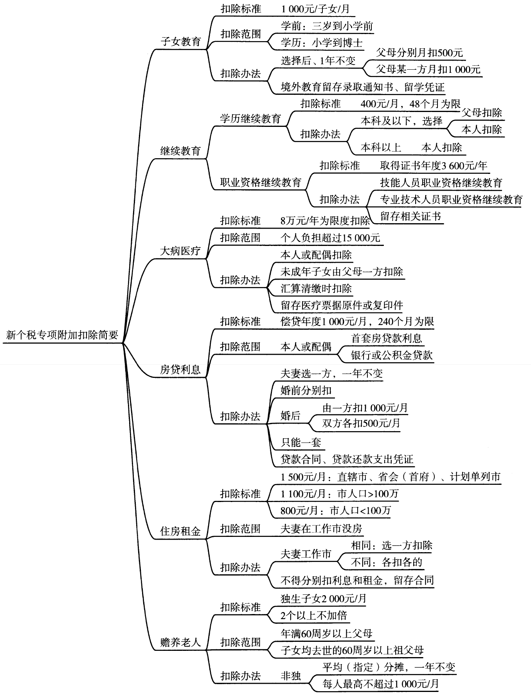

第五章企业所得税、个人所得税法律制度

# 1. 第一节企业所得税法律制度

企业所得税是对企业和其他取得收入的`组织`生产`经营所得`和`其他所得`征收的一种所得税。2007年3月16日第十届全国人大第五次会议通过、2017年2月24日第十二届全国人民代表大会常务委员会第二十六次会议修正、2018年12月29日第十三届全国人民代表大会常务委员会第七次会议决定修改的`《中华人民共和国企业所得税法》`（以下简称《企业所得税法》），2007年12月6日国务院发布、2019年4月23日国务院令第714号修订的`《中华人民共和国企业所得税法实施条例》`（以下简称《企业所得税法实施条例》），以及国家财政、税务主管部门制定、发布的一系列部门规章和规范性文件，构成了我国企业所得税法律制度的主要内容。

## 1.1. 一、企业所得税纳税人

在中华人民共和国`境内`，企业和其他取得收入的`组织`（以下统称企业）为企业所得税的纳税人，依照《企业所得税法》的规定缴纳企业所得税。企业所得税纳税人包括各类企业、事业单位、社会团体、民办非企业单位和从事经营活动的其他组织。依照中国法律、行政法规成立的`个人`独资企业、`合伙`企业，不属于企业所得税纳税人，不缴纳企业所得税。

企业所得税采取收入`来源地管辖`权和`居民管辖`权相结合的双重管辖权，把企业分为居民企业和非居民企业，分别确定不同的纳税义务。

### 1.1.1. （一）居民企业

居民企业，是指依法在中国`境内`成立，或者依照外国（地区）法律成立但实际`管理机构`在中国境内的企业。

实际管理机构，是指对企业的生产经营、人员、账务、财产等实施实质性全面管理和控制的机构。

### 1.1.2. （二）非居民企业

非居民企业，是指依照外国（地区）法律成立且实际管理机构不在中国境内，但在中国境内设立机构、场所的，或者在中国境内未设立机构、场所，但有`来源于`中国`境内所得`的企业。

非居民企业委托营业代理人在中国境内从事生产经营活动的，包括委托单位或者个人经常代其签订合同，或者储存、交付货物等，该营业代理人视为非居民企业在中国境内设立的机构、场所。

【例5-1】根据企业所得税法律制度的规定，下列关于非居民企业的表述中，正确的是（）。

A.在境外成立的企业均属于非居民企业

B.在境内成立但有来源于境外所得的企业属于非居民企业

C.依照外国法律成立，实际管理机构在中国境内的企业属于非居民企业

D.依照外国法律成立，实际管理机构不在中国境内但在中国境内设立机构、场所的企业属于非居民企业

【解析】答案为D。选项A在境外成立的企业，范围过于宽泛。选项B、选项C为居民企业。非居民企业是指依照外国（地区）法律成立且实际管理机构不在中国境内，但在中国境内设立机构、场所的，或者在中国境内未设立机构、场所，但有来源于中国境内所得的企业。

## 1.2. 二、企业所得税征税对象

### 1.2.3. （一）居民企业的征税对象

居民企业应当就其来源于中国境内、境外的所得缴纳企业所得税。包括销售货物所得、提供劳务所得、转让财产所得、股息红利等权益性投资所得、利息所得、租金所得、特许权使用费所得、接受捐赠所得和其他所得。

### 1.2.4. （二）非居民企业的征税对象

非居民企业在中国境内设立机构、场所的，应当就其所设机构、场所取得的来源于中国境内的所得，以及发生在中国境外但与其所设机构、场所有实际联系的所得，缴纳企业所得税。

非居民企业在中国境内未设立机构、场所的，或者虽设立机构、场所但取得的所得与其所设机构、场所没有实际联系的，应当就其来源于中国境内的所得缴纳企业所得税。

实际联系，是指非居民企业在中国境内设立的机构、场所拥有据以取得所得的股权、债权，以及拥有、管理、控制据以取得所得的财产等。

### 1.2.5. （三）来源于中国境内、境外所得的确定原则

来源于中国境内、境外的所得，按照以下原则确定：

1.销售货物所得，按照交易活动`发生地`确定；

2.提供劳务所得，按照劳务`发生地`确定；

3.转让财产所得，不动产转让所得按照`不动产所在地`确定，动产转让所得按照`转让动产的`企业或者机构、场所`所在地`确定，权益性投资资产转让所得按照`被投资企业所在地`确定；

4.股息、红利等权益性投资所得，按照`分配所得的`企业所在地确定；

5.利息所得、租金所得、特许权使用费所得，按照`负担、支付所得的`企业或者机构、场所所在地确定，或者按照负担、支付所得的个人的住所地确定；

6.其他所得，由国务院财政、税务主管部门确定。

## 1.3. 三、企业所得税税率

企业所得税实行`比例税率`。

居民企业以及在中国境内设立机构、场所且取得的所得与其所设机构、场所有实际联系的非居民企业，应当就其来源于中国境内、境外的所得缴纳企业所得税，适用税率为`25%`。

非居民企业在中国境内未设立机构、场所的，或者虽设立机构、场所但取得的所得与其所设机构、场所没有实际联系的，应当就其来源于中国境内的所得缴纳企业所得税，适用税率为`20%`。

## 1.4. 四、企业所得税应纳税所得额的计算

企业所得税的`计税依据`是应纳税所得额，即指企业每一纳税年度的`收入总额`，减除`不征`税收入、`免`税收入、各项`扣除`以及允许弥补的以前年度`亏损`后的余额。

应纳税所得额=收入总额-不征税收入-免税收入-各项扣除-以前年度亏损

企业应纳税所得额的计算，以`权责发生制`为原则，属于当期的收入和费用，不论款项是否收付，均作为当期的收入和费用；不属于当期的收入和费用，即使款项已经在当期收付，均不作为当期的收入和费用。在计算应纳税所得额时，企业财务、会计处理办法与税收法律法规的规定不一致的，应当依照税收法律法规的规定计算。

### 1.4.6. （一）收入总额

企业收入总额是指以货币形式和非货币形式从各种来源取得的收入。包括：`销售`货物收入，提供劳务收入，`转让`财产收入，股息、红利等权益性`投资收益`，利息收入，租金收入，特许权使用费收入，接受捐赠收入以及其他收入。

企业取得收入的货币形式，包括现金、存款、应收账款、应收票据、准备持有至到期的债券投资以及债务的豁免等。

企业取得收入的非货币形式，包括固定资产、生物资产、无形资产、股权投资、存货、不准备持有至到期的债券投资、劳务以及有关权益等。非货币形式收入应当按照`公允价值`确定收入额。

#### 1.4.6.1. 1.销售货物收入。

销售货物收入，是指企业销售商品、产品、原材料、包装物、低值易耗品以及其他存货取得的收入。

除法律法规另有规定外，企业销售货物收入的确认，必须遵循权责发生制原则和实质重于形式原则。

（1）符合收入确认条件，采取下列商品销售方式的，应按以下规定确认收入实现时间:

①销售商品采用托收承付方式的，在办妥托收`手续`时确认收入。

②销售商品采用预收款方式的，在`发出`商品时确认收入。

③销售商品需要安装和检验的，在购买方接受商品以及安装和检验`完毕`时确认收入。如果安装程序比较简单，可在发出商品时确认收入。

④销售商品釆用支付手续费方式委托代销的，在收到代销`清单`时确认收入。

（2）釆用售后回购方式销售商品的，销售的商品按`售价`确认收入，回购的商品作为购进商品处理。有证据表明不符合销售收入确认条件的，如以销售商品方式进行融资，收到的款项应确认为负债，回购价格大于原售价的，差额应在回购期间确认为`利息`费用。

（3）销售商品以旧换新的，销售商品应当按照`销售`商品收入确认条件确认收入，回收的商品作为`购进`商品处理。

（4）企业为促进商品销售而在商品价格上给予的价格扣除属于`商业折扣`，商品销售涉及商业折扣的，应当按照扣除商业折扣后的金额确定销售商品收入金额。

债权人为鼓励债务人在规定的期限内付款而向债务人提供的债务扣除属于`现金折扣`，销售商品涉及现金折扣的，应当按扣除现金折扣前的金额确定销售商品收入金额，现金折扣在实际发生时作为`财务费用`扣除。

企业因售出商品的质量不合格等原因而在售价上给予的减让属于销售折让；企业因售出商品质量、品种不符合要求等原因而发生的退货属于销售退回。企业已经确认销售收入的售出商品发生销售折让和销售退回，应当在发生当期`冲减`当期销售商品收入。

#### 1.4.6.2. 2.提供劳务收入。

提供劳务收入，是指企业从事建筑安装、修理修配、交通运输、仓储租赁、金融保险、邮电通信、咨询经纪、文化体育、科学研究、技术服务、教育培训、餐饮住宿、中介代理、卫生保健、社区服务、旅游、娱乐、加工以及其他劳务服务活动取得的收入。

企业在各个纳税期末，提供劳务交易的结果能够可靠估计的，应采用`完工进度`（百分比）法确认提供劳务收入。

企业应按照从接受劳务方已收或应收的合同或协议价款确定劳务收入总额，根据纳税期末提供劳务收入总额乘以完工进度扣除以前纳税年度累计已确认提供劳务收入后的金额，确认为当期劳务收入；同时，按照提供劳务估计总成本乘以完工进度扣除以前纳税期间累计已确认劳务成本后的金额，结转为当期劳务成本。

#### 1.4.6.3. 3.转让财产收入。

转让财产收入，是指企业转让固定资产、生物资产、无形资产、股权、债权等财产取得的收入。转让财产收入应当按照从财产受让方已收或应收的合同或协议价款确认收入。

#### 1.4.6.4. 4.股息、红利等权益性投资收益。

股息、红利等权益性投资收益，是指企业因`权益性投资`从被投资方取得的收入。股息、红利等权益性投资收益，除国务院财政、税务主管部门另有规定外，按照被投资方作出利润分配`决定的日期`确认收入的实现。

#### 1.4.6.5. 5.利息收入。

利息收入，是指企业将资金提供他人使用但不构成权益性投资，或者因他人占用本企业资金取得的收入，包括存款利息、贷款利息、债券利息、欠款利息等收入。利息收入，按照合同约定的债务人`应付利息的日期`确认收入的实现。

#### 1.4.6.6. 6.租金收入。

租金收入，是指企业提供固定资产、包装物或者其他有形资产的使用权取得的收入。租金收入，按照合同约定的承租人`应付租金的日期`确认收入的实现。如果交易合同或协议中规定租赁期限跨年度，且租金提前一次性支付的，出租人可对上述已确认的收入，在租赁期内，分期均匀计入相关年度收入。

#### 1.4.6.7. 7.特许权使用费收入。

特许权使用费收入，是指企业提供专利权、非专利技术、商标权、著作权以及其他特许权的使用权取得的收入。特许权使用费收入，按照合同约定的特许权使用人`应付`特许权使用费的`日期`确认收入的实现。

#### 1.4.6.8. 8.接受捐赠收入。

接受捐赠收入，是指企业接受的来自其他企业、组织或者个人`无偿给予`的货币性资产、非货币性资产。接受捐赠收入，按照`实际收到`捐赠资产的`日期`确认收入的实现。

#### 1.4.6.9. 9.其他收入。

其他收入，是指企业取得《企业所得税法》具体列举的收入外的其他收入，包括企业资产溢余收入、逾期未退包装物押金收入、确实无法偿付的应付款项、已作坏账损失处理后又收回的应收款项、债务重组收入、补贴收入、违约金收入、汇兑收益等。

#### 1.4.6.10. 10.特殊收入的确认。

（1）以分期收款方式销售货物的，按照合同约定的`收款日期`确认收入的实现。

（2）企业受托加工制造大型机械设备、船舶、飞机，以及从事建筑、安装、装配工程业务或者提供其他劳务等，持续时间超过12个月的，按照纳税年度内完工进度或者完成的工作量确认收入的实现。

（3）采取产品分成方式取得收入的，按照企业`分得`产品的`日期`确认收入的实现，其收入额按照产品的`公允价值`确定。

（4）企业发生非货币性资产交换，以及将货物、财产、劳务用于捐赠、偿债、赞助、集资、广告、样品、职工福利或者利润分配等用途的，应当`视同`销售货物、转让财产或者提供劳务，但国务院财政、税务主管部门另有规定的除外。

（5）企业以买一赠一等方式组合销售本企业商品的，不属于捐赠，应将总的销售金额按各项商品的公允价值的比例来`分摊`确认各项的销售收入。

### 1.4.7. （二）不征税收入

下列收入为不征税收入：

#### 1.4.7.11. 1.财政拨款。

`财政`拨款，是指各级人民政府对纳入`预算管理`的事业单位、社会团体等组织拨付的财政资金，但国务院和国务院财政、税务主管部门另有规定的除外。

#### 1.4.7.12. 2.依法收取并纳入财政管理的行政事业性收费、政府性基金。

`行政`事业性收费，是指依照法律法规等有关规定，按照国务院规定程序批准，在实施社会公共管理，以及在向公民、法人或者其他组织提供特定公共服务过程中，向特定对象收取并纳入财政管理的费用。政府性基金，是指企业依照法律、行政法规等有关规定，代政府收取的具有专项用途的财政资金。

#### 1.4.7.13. 3.国务院规定的其他不征税收入。

国务院规定的其他不征税收入，是指企业取得的，由国务院财政、税务主管部门规定专项用途并经国务院批准的`财政`性资金。

`县`级以上人民政府将国有资产无偿划入企业，凡指定专门用途并按规定进行管理的，企业可作为不征税收入进行企业所得税处理。其中，该项资产属于非货币性资产的，应按政府确定的接收价值计算不征税收入。

2018年9月20日起，对全国社会保障基金理事会及基本养老保险基金投资管理机构在国务院批准的投资范围内，运用养老基金投资取得的归属于`养老基金`的投资收入，作为企业所得税不征税收入。

2018年9月10日起，对全国`社会保障`基金取得的直接股权投资收益、股权投资基金收益，作为企业所得税不征税收入。

【例5-2】根据企业所得税法律制度的规定，企业的下列收入中，属于不征税收入的是（）。

A.财政拨款B.租金收入

C.产品销售收入D.国债利息收入

【解析】答案为A。企业所得税法律制度规定财政拨款和依法收取并纳入财政管理的行政事业性收费、政府性基金为不征税收入。选项B、选项C、选项D均不属于此范围。

### 1.4.8. （一）税前扣除项目

企业实际发生的与取得收入有关的、合理的支出，包括成本、费用、税金、损失和其他支出，准予在计算应纳税所得额时扣除。合理的支岀，是指符合生产经营活动常规，应当计入当期损益或者有关资产成本的必要和正常的支出。除另有规定外，企业实际发生的成本、费用、税金、损失和其他支出，不得重复扣除。

企业发生的支出应当区分收益性支出和资本性支出。收益性支出在发生当期直接扣除；资本性支出应当分期扣除或者计入有关资产成本，不得在发生当期直接扣除。

企业的不征税收入用于支出所形成的费用或者财产，不得扣除或者计算对应的折旧、摊销扣除。

1.`成本`，是指企业在生产经营活动中发生的销售成本、销货成本、业务支出以及其他耗费。即企业销售商品（产品、材料、下脚料、废料、废旧物资等）、提供劳务、转让固定资产、无形资产的成本。

2.`费用`，是指企业在生产经营活动中发生的销售费用、管理费用和财务费用。已经计入成本的有关费用除外。

（1）销售费用，是指应由企业负担的为销售商品而发生的费用。

（2）管理费用，是指企业的行政管理部门为管理组织经营活动提供各项支援性服务而发生的费用。

（3）财务费用，是指企业筹集经营性资金而发生的费用。

3.`税金`，是指企业发生的除企业所得税和允许抵扣的增值税以外的各项税金及其附加。即纳税人按照规定缴纳的消费税、资源税、土地增值税、关税、城市维护建设税、教育费附加及房产税、车船税、城镇土地使用税、印花税等。企业缴纳的增值税属于价外税，故不在扣除之列。

4.`损失`，是指企业在生产经营活动中发生的固定资产和存货的盘亏、毁损、报废损失，转让财产损失，呆账损失，坏账损失，自然灾害等不可抗力因素造成的损失以及其他损失。

企业发生的损失，减除责任人赔偿和保险赔款后的余额，依照国务院财政、税务主管部门的规定扣除。企业已经作为损失处理的资产，在以后纳税年度又全部收回或者部分收回时，应当计入当期收入。

5.`其他`支出，是指除成本、费用、税金、损失外，企业在生产经营活动中发生的与生产经营活动有关的、合理的支出。

### 1.4.9. （二）扣除标准

#### 1.4.9.14. 1.工资、薪金支出。

企业发生的`合理的工资、薪金`支出，准予扣除。工资、薪金，是指企业每一纳税年度支付给在本企业任职或者受雇的员工的所有现金形式或者非现金形式的劳动报酬，包括基本工资、奖金、津贴、补贴、年终加薪、加班工资，以及与员工任职或者受雇有关的其他支出。

#### 1.4.9.15. 2.职工福利费、工会经费、职工教育经费。

企业发生的职工福利费、工会经费、职工教育经费按`标准`扣除。未超过标准的按实际发生数额扣除，超过扣除标准的只能按标准扣除。

（1）企业发生的职工福利费支出，不超过工资薪金总额`14%`的部分，准予扣除。列入企业员工工资薪金制度、固定与工资薪金一起发放的福利性补贴，符合国家税务总局相关规定的，可作为企业发生的工资薪金支岀，按规定在税前扣除；不能同时符合上述条件的福利性补贴，应按规定计算限额税前扣除。

企业的职工福利费，包括以下内容：

①尚未实行分离办社会职能的企业，其内设福利部门所发生的设备、设施和人员费用，包括职工食堂、职工浴室、理发室、医务所、托儿所、疗养院等集体福利部门的设备、设施及维修保养费用和福利部门工作人员的工资薪金、社会保险费、住房公积金、劳务费等。

②为职工卫生保健、生活、住房、交通等所发放的各项补贴和非货币性福利，包括企业向职工发放的因公外地就医费用、未实行医疗统筹企业职工医疗费用、职工供养直系亲属医疗补贴、供暖费补贴、职工防暑降温费、职工困难补贴、救济费、职工食堂经费补贴、职工交通补贴等。

③按照其他规定发生的其他职工福利费，包括丧葬补助费、抚恤费、安家费、探亲假路费等。

企业发生的职工福利费，应该单独设置账册，进行准确核算。没有单独设置账册准确核算的，税务机关应责令企业在规定的期限内进行改正。逾期仍未改正的，税务机关可对企业发生的职工福利费进行合理的核定。

（2）企业拨缴的工会经费，不超过工资薪金总额`2%`的部分，准予扣除。

（3）企业发生的职工教育经费支出，不超过工资薪金总额`8%`的部分，准予在计算企业所得税应纳税所得额时扣除；超过部分，准予在以后纳税年度`结转`扣除。

#### 1.4.9.16. 3.社会保险费。

（1）企业依照国务院有关主管部门或者省级人民政府规定的范围和标准为职工缴纳的基本养老保险费、基本医疗保险费、失业保险费、工伤保险费等基本社会保险费和住房公积金，准予扣除。

（2）自2008年1月1日起，企业根据国家有关政策规定，为在本企业任职或者受雇的全体员工支付的补充养老保险费、补充医疗保险费，分别在不超过职工工资总额`5%`标准内的部分，在计算应纳税所得额时准予扣除；超过的部分，不予扣除。

#### 1.4.9.17. 4.借款费用。

（1）企业在生产经营活动中发生的合理的不需要资本化的借款费用，准予扣除。

（2）企业为购置、建造固定资产、无形资产和经过12个月以上的建造才能达到预定可销售状态的存货发生借款的，在有关资产购置、建造期间发生的合理的借款费用，应当作为资本性支出计入有关资产的成本，并依照《企业所得税法实施条例》的有关规定扣除。

#### 1.4.9.18. 5.利息费用。

企业在生产经营活动中发生的下列利息支出，准予扣除：

（1）非金融企业向金融企业借款的利息支出、金融企业的各项存款利息支出和同业拆借利息支出、企业经批准发行债券的利息支出可据实扣除。

（2）非金融企业向非金融企业借款的利息支出，不超过按照金融企业`同期同类贷款利率`计算的数额的部分可据实扣除，超过部分不许扣除。

金融企业，是指各类银行、保险公司及经中国人民银行批准从事金融业务的非银行金融机构。

（3）凡企业投资者在规定期限内未缴足其应缴资本额的，该企业对外借款所发生的利息，相当于投资者实缴资本额与在规定期限内应缴资本额的`差额`应计付的利息，其不属于企业合理的支出，应由企业`投资者`负担，不得在计算企业应纳税所得额时扣除。

（4）企业向股东或其他与企业有关联关系的自然人借款的利息支出，应根据《企业所得税法》及《财政部国家税务总局关于企业关联方利息支出税前扣除标准有关税收政策问题的通知》规定的条件，计算企业所得税扣除额。

企业向除股东或其他与企业有关联关系的自然人以外的内部职工或其他人员借款的利息支岀，其借款情况同时符合以下条件的，其利息支出在不超过按照金融企业`同期同类贷款利率`计算的数额的部分，准予扣除。

①企业与个人之间的借贷是`真实`、合法、有效的，并且不具有非法集资目的或其他违反法律、法规的行为；

②企业与个人之间签订了借款`合同`。

#### 1.4.9.19. 6.汇兑损失。

企业在货币交易中，以及纳税年度终了时将人民币以外的货币性资产、负债按照期末即期人民币汇率中间价折算为人民币时产生的汇兑损失，除已经计入有关资产成本以及与向所有者进行利润分配相关的部分外，准予扣除。

#### 1.4.9.20. 7.公益性捐赠。

公益性捐赠，是指企业通过公益性社会组织或者`县`级以上人民政府及其部门，用于符合法律规定的慈善活动、公益事业的捐赠。

企业当年`发生`以及以前年度`结转`的公益性捐赠支出，不超过年度利润总额`12%`的部分，在计算应纳税所得额时准予扣除；超过年度利润总额12%的部分，准予结转以后`三年内`在计算应纳税所得额时扣除。企业在对公益性捐赠支出计算扣除时，应先扣除以前年度结转的捐赠支出，再扣除当年发生的捐赠支出。

年度利润总额，是指企业依照国家统一会计制度的规定计算的年度`会计利润`。

公益性捐赠具体范围包括：

（1）救助灾害、救济贫困、扶助残疾人等困难的社会群体和个人的活动；

（2）教育、科学、文化、卫生、体育事业；

（3）环境保护、社会公共设施建设；

（4）促进社会发展和进步的其他社会公共和福利事业。

自2019年1月1日至2022年12月31日，企业通过公益性社会组织或者县级（含县级）以上人民政府及其组成部门，用于`目标脱贫地区`的扶贫捐赠支岀，准予在计算企业所得税应纳税所得额时据实扣除。在政策执行期限内，目标脱贫地区实现脱贫的，可继续适用上述政策。企业同时发生扶贫捐赠支出和其他公益性捐赠支出，在计算公益性捐赠支出年度扣除限额时，符合条件的扶贫捐赠支出不计算在内。

【例5-3】某企业2018年度实现利润总额100万元，在营业外支出账户列支了通过公益性社会团体向贫困地区的捐款10万元、直接向某小学捐款5万元。在计算该企业2018年度应纳税所得额时，允许扣除的捐款数额为（）万元。

A.5B.10C.12D.15

【解析】答案为B。企业发生的公益性捐赠支出，在年度利润总额12%以内的部分，准予在计算应纳税所得额时扣除；超过年度利润总额12%的部分，准予结转以后三年内在计算应纳税所得额时扣除。100x12%=12（万元），直接捐款5万元不允许扣除，10万元＜12万元，允许扣除10万元。

#### 1.4.9.21. 8.业务招待费。

企业发生的与生产经营活动有关的业务招待费支出，按照发生额的`60%`扣除，但最高不得超过当年销售（营业）收入的`5‰`。

企业在筹建期间，发生的与筹办活动有关的业务招待费支出，可按实际发生额的60%计入企业筹办费，并按有关规定在税前扣除。

对从事股权投资业务的企业（包括集团公司总部、创业投资企业等），其从被投资企业所分配的股息、红利以及股权转让收入，可以按规定的比例计算业务招待费扣除限额。

#### 1.4.9.22. 9.广告费和业务宣传费。

企业发生的符合条件的广告费和业务宣传费支出，除国务院财政、税务主管部门另有规定外，不超过当年销售（营业）收入`15%`的部分，准予扣除；超过部分，准予在以后纳税年度`结转`扣除。企业在筹建期间，发生的广告费和业务宣传费，可按实际`发生额`计入企业筹办费，并按有关规定在税前扣除。

自2016年1月1日至2020年12月31日，对化妆品制造或销售、医药制造和饮料制造（不含酒类制造）企业发生的广告费和业务宣传费支出，不超过当年销售（营业）收入`30%`的部分，准予扣除；超过部分，准予在以后纳税年度`结转`扣除。

`烟草企业`的烟草广告费和业务宣传费支岀，一律`不得`在计算应纳税所得额时扣除。

【例5-4】某机械设备制造企业2019年度实现销售收入3000万元，发生符合条件的广告费和业务宣传费支出350万元，上年度未在税前扣除完的符合条件的广告费和业务宣传费支出60万元。在计算该企业2019年度应纳税所得额时，允许扣除的广告费和业务宣传费支出为（）万元。

A，410B.350C.450D.360

【解析】答案为A。企业发生的符合条件的广告费和业务宣传费支出，除国务院财政、税务主管部门另有规定外，不超过当年销售（营业）收入15%的部分，准予扣除；超过部分，准予在以后纳税年度结转扣除。3000x15%=450（万元），350+60=410（万元），410万元＜450万元，允许扣除410万元。

#### 1.4.9.23. 10.环境保护专项资金。

企业依照法律、行政法规有关规定提取的用于`环境保护`、生态恢复等方面的`专项资金`，准予`扣除`。上述专项资金提取后改变用途的，不得扣除。

#### 1.4.9.24. 11.保险费。

企业参加`财产保险`，按照规定缴纳的保险费，准予`扣除`。

除企业依照国家有关规定为特殊工种职工支付的人身安全保险费和国务院财政、税务主管部门规定可以扣除的其他商业保险费外，企业为投资者或职工支付的商业保险费，不得扣除。

企业参加雇主责任险、公众责任险等`责任保险`，按照规定缴纳的保险费，准予在企业所得税税前`扣除`。该项规定适用于2018年度及以后年度企业所得税汇算清缴。

企业职工因公出差乘坐交通工具发生的人身意外保险费支出，准予企业在计算应纳税所得额时扣除。

#### 1.4.9.25. 12.租赁费。

企业根据生产经营活动的需要租入固定资产支付的租赁费，按照以下方法扣除：

（1）以经营租赁方式租入固定资产发生的租赁费支出，按照租赁期限`均匀`扣除。经营性租赁是指所有权不转移的租赁。

（2）以融资租赁方式租入固定资产发生的租赁费支出，按照规定构成融资租入固定资产价值的部分应当提取折旧费用`分期`扣除。融资租赁是指在实质上转移与一项资产所有权有关的全部风险和报酬的一种租赁。

#### 1.4.9.26. 13.劳动保护费。

企业发生的合理的劳动保护支出，准予`扣除`。

#### 1.4.9.27. 14.有关资产的费用。

企业转让各类固定资产发生的费用，允许扣除。企业按规定计算的固定资产折旧费、无形资产和递延资产的摊销费，准予扣除。

#### 1.4.9.28. 15.总机构分摊的费用。

非居民企业在中国境内设立的机构、场所，就其中国境外总机构发生的与该机构、场所生产经营有关的费用，能够提供总机构出具的费用汇集范围、定额、分配依据和方法等`证明`文件，并合理分摊的，准予`扣除`。

#### 1.4.9.29. 16.手续费及佣金支出。

①2019年1月1日起，保险企业发生与其经营活动有关的手续费及佣金支出，不超过当年全部保费收入扣除退保金等后余额的`18%`（含本数）的部分，在计算应纳税所得额时准予扣除；超过部分，允许`结转`以后年度扣除。

②其他企业：按与具有合法经营资格的中介服务机构或个人（不含交易双方及其雇员、代理人和代表人等）所签订服务协议或合同确认的收入金额的`5%`计算限额。

③从事代理服务、主营业务收入为手续费、佣金的企业（如证券、期货、保险代理等企业），其为取得该类收入而实际发生的营业成本（包括手续费及佣金支出），准予在企业所得税前据实扣除。

企业应与具有合法经营资格的中介服务企业或个人签订代办协议或合同，并按规定支付手续费及佣金。除委托个人代理外，企业以`现金`等非转账方式支付的手续费及佣金`不得`在税前扣除。企业为发行权益性`证券`支付给有关证券承销机构的`手续费`及佣金`不得`在税前扣除。企业`不得`将手续费及佣金支出计入回扣、业务提成、返利、进场费等费用。企业已计入固定资产、无形资产等相关资产的手续费及佣金支出，应当通过折旧、摊销等方式分期扣除，不得在发生当期直接扣除。企业支付的手续费及佣金`不得`直接冲减服务协议或合同金额，并如实入账。保险企业应建立健全手续费及佣金的相关管理制度，并加强手续费及佣金结转扣除的台账管理。

#### 1.4.9.30. 17.

国有企业（包括国有独资、全资和国有资本绝对控股、相对控股企业）纳入管理费用的`党组织`工作经费，实际支出不超过职工年度工资薪金总额`1%`的部分，可以据实在企业所得税前扣除。

非公有制企业`党组织`工作经费纳入企业管理费列支，不超过职工年度工资薪金总额`1%`的部分，可以据实在企业所得税前扣除。

#### 1.4.9.31. 18.

依照有关法律、行政法规和国家有关税法规定准予扣除的`其他`项目。如会员费、合理的会议费、差旅费、违约金、诉讼费用等。

### 1.4.10. （五）不得扣除项目

在计算应纳税所得额时，下列支出`不得`扣除：

1.向投资者支付的股息、红利等权益性投资收益款项。

2.企业所得税税款。

3.税收滞纳金。具体是指纳税人违反税收法规，被税务机关处以的滞纳金。

4.罚金、罚款和被没收财物的损失。是指纳税人违反国家有关法律、法规规定，被有关部门处以的罚款，以及被司法机关处以的罚金和被没收的财物。

5.超过规定标准的捐赠支出。

6.`赞助`支出。具体是指企业发生的与生产经营活动无关的各种非广告性质支出。

7.未经核定的准备金支出。具体是指不符合国务院财政、税务主管部门规定的各项资产减值准备、风险准备等准备金支出。

8.企业之间支付的管理费、企业内营业机构之间支付的租金和特许权使用费，以及非银行企业内营业机构之间支付的利息，不得扣除。

9.与取得收入无关的`其他`支出。

【例5-5】根据企业所得税法律制度的规定，下列各项中，在计算企业所得税应纳税所得额时不得扣除的有（）。

A.向投资者支付的红利

B.企业内部营业机构之间支付的租金

C.企业内部营业机构之间支付的特许权使用费

D.未经核定的准备金支出

【解析】答案为ABCD。企业所得税法律制度规定向投资者支付的股息、红利等权益性投资收益款项，企业内营业机构之间支付的租金和特许权使用费，不符合国务院财政、税务主管部门规定的各项资产减值准备、风险准备等准备金支出等，在计算企业所得税应纳税所得额时不得扣除。

### 1.4.11. （六）亏损弥补

亏损，是指企业将每一纳税年度的收入总额减除不征税收入、免税收入和各项扣除后小于零的数额。税法规定，企业某一纳税年度发生的亏损可以用下一年度的所得弥补，下一年度的所得不足以弥补的，可以逐年延续弥补，但最长不得超过`5年`。企业在汇总计算缴纳企业所得税时，其`境外`营业机构的亏损`不得`抵减`境内`营业机构的盈利。

自2018年1月1日起，当年具备`高`新技术企业或`科`技型中小企业资格的企业，其具备资格年度之前5个年度发生的尚未弥补完的亏损，准予结转以后年度弥补，最长结转年限由5年延长至`10年`。

### 1.4.12. （七）非居民企业的应纳税所得额

在中国境内未设立机构、场所的，或者虽设立机构、场所但取得的所得与其所设机构、场所没有实际联系的非居民企业，其取得的`来源于中国境内`的所得，按照下列方法计算其应纳税所得额：

1.股息、红利等权益性投资收益和利息、租金、特许权使用费所得，以收入`全额`为应纳税所得额；

2.转让财产所得，以收入全额减除财产净值后的`余额`为应纳税所得额；

财产净值，是指有关资产、财产的计税基础减除已经按照规定扣除的折旧、折耗、摊销、准备金等后的余额。

3.其他所得，参照前两项规定的方法计算应纳税所得额。

【例5-6】根据企业所得税法律制度的规定，在中国境内未设立机构、场所的非居民企业从中国境内取得的下列所得中，应以收入全额为应纳税所得额的有（）。

A.红利B.转让财产所得C.租金D.利息

【解析】答案为ACD。企业所得税法律制度规定股息、红利等权益性投资收益和利息、租金、特许权使用费所得，以收入全额为应纳税所得额。转让财产所得，以收入全额减除财产净值后的余额为应纳税所得额。

## 1.5. 五、资产的税务处理

企业的各项资产，包括固定资产、生产性生物资产、无形资产、长期待摊费用、投资资产、存货等，以`历史成本`为计税基础。历史成本，是指企业取得该项资产时实际发生的支出。企业持有各项资产期间资产增值或者减值，除国务院财政、税务主管部门规定可以确认损益外，不得调整该资产的计税基础。

企业转让资产，该项资产的净值，准予在计算应纳税所得额时扣除。资产的净值，是指有关资产、财产的计税基础减除已经按照规定扣除的折旧、折耗、摊销、准备金等后的余额。除另有规定外，企业在重组过程中，应当在交易发生时确认有关资产的转让所得或者损失，相关资产应当按照`交易价格`重新确定计税基础。

### 1.5.13. （一）固定资产

固定资产，是指企业为生产产品、提供劳务、出租或者经营管理而持有的、使用时间超过12个月的非货币性资产，包括房屋、建筑物、机器、机械、运输工具以及其他与生产经营活动有关的设备、器具、工具等。在计算应纳税所得额时，企业按照规定计算的固定资产折旧，准予扣除。

1.下列固定资产`不得`计算折旧扣除：

（1）房屋、建筑物以外`未投入使用`的固定资产；

（2）以经营租赁方式租入的固定资产；

（3）以融资租赁方式租出的固定资产；

（4）已足额提取折旧仍继续使用的固定资产；

（5）与经营活动无关的固定资产；

（6）`单独`估价作为固定资产入账的`土地`；

（7）`其他`不得计算折旧扣除的固定资产。

2.固定资产按照以下方法确定计税基础：

（1）外购的固定资产，以购买价款和支付的相关税费以及直接归属于使该资产达到预定用途发生的其他支出为计税基础；

（2）自行建造的固定资产，以竣工结算前发生的支出为计税基础；

（3）融资租入的固定资产，以租赁合同约定的付款总额和承租人在签订租赁合同过程中发生的相关费用为计税基础，租赁合同未约定付款总额的，以该资产的公允价值和承租人在签订租赁合同过程中发生的相关费用为计税基础；

（4）盘盈的固定资产，以同类固定资产的重置完全价值为计税基础；

（5）通过捐赠、投资、非货币性资产交换、债务重组等方式取得的固定资产，以该资产的公允价值和支付的相关税费为计税基础；

（6）改建的固定资产，除法定的支出外，以改建过程中发生的改建支出增加计税基础。

3.固定资产按照直线法计算的折旧，准予扣除。企业应当自固定资产投入使用月份的次月起计算折旧；停止使用的固定资产，应当自停止使用月份的次月起停止计算折旧。

企业应当根据固定资产的性质和使用情况，合理确定固定资产的预计净残值。固定资产的预计净残值一经确定，不得变更。

4.除国务院财政、税务主管部门另有规定外，固定资产计算折旧的最低年限如下：

（1）房屋、建筑物，为20年；

（2）飞机、火车、轮船、机器、机械和其他生产设备，为10年；

（3）与生产经营活动有关的器具、工具、家具等，为5年；

（4）飞机、火车、轮船以外的运输工具，为4年；

（5）电子设备，为3年。

【例5-7】根据企业所得税法律制度的规定，企业的下列资产或支出项目中，按规定应计提折旧的是（）。

A.已足额提取折旧仍继续使用的固定资产

B.单独估价作为固定资产入账的土地

C.以融资租赁方式租入的固定资产

D.未投入使用的机器设备

【解析】答案为C。企业所得税法律制度规定，已足额提取折旧仍继续使用的固定资产不计提折旧、单独估价作为固定资产的土地不计提折旧、未投入使用的机器设备不计提折旧。

### 1.5.14. （二）生产性生物资产

生产性生物资产，是指企业为生产农产品、提供劳务或者出租等而持有的生物资产，包括经济林、薪炭林、产畜和役畜等。

1.生产性生物资产按照以下方法确定计税基础：

（1）外购的生产性生物资产，以购买价款和支付的相关税费为计税基础；

（2）通过捐赠、投资、非货币性资产交换、债务重组等方式取得的生产性生物资产，以该资产的公允价值和支付的相关税费为计税基础。

2.生产性生物资产按照`直线法`计算的折旧，准予扣除。企业应当自生产性生物资产投入使用月份的`次月`起计算折旧；停止使用的生产性生物资产，应当自停止使用月份的`次月`起停止计算折旧。企业应当根据生产性生物资产的性质和使用情况，合理确定生产性生物资产的预计净残值。生产性生物资产的预计净残值一经确定，不得变更。

3.生产性生物资产计算折旧的最低年限如下：

（1）林木类生产性生物资产，为`10年`；

（2）畜类生产性生物资产，为`3年`。

### 1.5.15. （三）无形资产

无形资产，是指企业为生产产品、提供劳务、出租或者经营管理而持有的、没有实物形态的非货币性长期资产，包括专利权、商标权、著作权、土地使用权、非专利技术、商誉等。在计算应纳税所得额时，企业按照规定计算的无形资产`摊销`费用，准予扣除。

1.下列无形资产`不得`计算摊销费用扣除：

（1）自行开发的支出已在计算应纳税所得额时扣除的无形资产;

（2）自创商誉；

（3）与经营活动无关的无形资产；

（4）其他不得计算摊销费用扣除的无形资产。

2.无形资产按照以下方法确定计税基础：

（1）外购的无形资产，以购买价款和支付的相关税费以及直接归属于使该资产达到预定用途发生的其他支出为计税基础；

（2）自行开发的无形资产，以开发过程中该资产符合资本化条件后至达到预定用途前发生的支出为计税基础；

（3）通过捐赠、投资、非货币性资产交换、债务重组等方式取得的无形资产，以该资产的公允价值和支付的相关税费为计税基础。

3.无形资产按照`直线法`计算的摊销费用，准予扣除。无形资产的摊销年限不得低于`10年`。

作为投资或者受让的无形资产，有关法律规定或者合同约定了使用年限的，可以按照规定或者约定的使用年限分期摊销。外购`商誉`的支出，在企业`整体`转让或者清算时，准予`扣除`。

### 1.5.16. （四）长期待摊费用

长期待摊费用，是指企业发生的应在1个年度以上或几个年度进行摊销的费用。在计算应纳税所得额时，企业发生的下列支出作为长期待摊费用，按照规定`摊销`的，准予`扣除`：

1.已足额提取折旧的固定资产的改建支岀，按照固定资产预计尚可使用年限分期摊销。

2.租入固定资产的改建支出，按照合同约定的`剩余`租赁期限分期摊销。

所谓固定资产的改建支出，是指改变房屋或者建筑物结构、延长使用年限等发生的支出。

改建的固定资产延长使用年限的，除前述规定外，应当适当延长折旧年限。

3.固定资产的大修理支出，按照固定资产尚可使用年限分期摊销。

固定资产的大修理支出，是指同时符合下列条件的支出：

（1）修理支出达到取得固定资产时的计税基础`50%`以上；

（2）修理后固定资产的使用年限延长`2年`以上。

4.其他应当作为长期待摊费用的支出，自支出发生月份的`次月`起，分期摊销，摊销年限不得低于`3年`。

### 1.5.17. （五）投资资产

投资资产，是指企业对外进行权益性投资和债权性投资形成的资产。企业对外投资期间，投资资产的`成本`在计算应纳税所得额时`不得`扣除。企业在转让或者`处置`投资资产时，投资资产的成本，准予`扣除`。投资资产按照以下方式确定成本：

1.通过支付现金方式取得的投资资产，以购买价款为成本；

2.通过支付现金以外的方式取得的投资资产，以该资产的`公允价值`和支付的`相关税费`为成本。

### 1.5.18. （六）存货

存货，是指企业持有以备出售的产品或者商品、处在生产过程中的在产品、在生产或者提供劳务过程中耗用的材料和物料等。存货按照以下方法确定成本：

1.通过支付现金方式取得的存货，以购买价款和支付的相关税费为成本；

2.通过支付现金以外的方式取得的存货，以该存货的公允价值和支付的相关税费为成本;

3.生产性生物资产收获的农产品，以产出或者采收过程中发生的材料费、人工费和分摊的间接费用等必要支出为成本。

企业使用或者销售存货，按照规定计算的存货成本，准予在计算应纳税所得额时扣除。

企业使用或者销售的存货的成本计算方法，可以在先进先出法、加权平均法、个别计价法中选用一种。计价方法一经选用，不得随意变更。

### 1.5.19. （七）资产损失

资产损失，是指企业在生产经营活动中实际发生的、与取得应税收入有关的资产损失，包括现金损失，存款损失，坏账损失，贷款损失，股权投资损失，固定资产和存货的盘亏、毁损、报废、被盗损失，自然灾害等不可抗力因素造成的损失以及其他损失。企业发生上述资产损失，应在按税法规定实际确认或者实际发生的当年申报`扣除`。

企业以前年度发生的资产损失未能在当年税前扣除的，可以按照规定，向税务机关说明并进行专项申报扣除。其中，属于实际资产损失，准予追补至该项损失发生年度扣除，其追补确认期限一般不得超过`五年`。企业因以前年度实际资产损失未在税前扣除而多缴的企业所得税税款，可在追补确认年度企业所得税应纳税款中予以`抵扣`，不足抵扣的，向以后年度递延抵扣。

## 1.6. 六、企业所得税应纳税额的计算

企业所得税应纳税额的计算公式为：

应纳税额=应纳税所得额x适用税率-减免税额-抵免税额

其中的减免税额和抵免税额，是指依照《企业所得税法》和国务院的税收优惠规定减征、免征和抵免的应纳税额。

企业取得的下列所得已在`境外`缴纳的所得税税额，可以从其当期应纳税额中抵免，抵免限额为该项所得依照规定计算的应纳税额；超过抵免限额的部分，可以在以后`5个年度`内，用每年抵免限额抵免当年应抵税额后的余额进行抵补：

（1）居民企业来源于中国境外的应税所得；

（2）非居民企业在中国境内设立机构、场所，取得发生在中国境外但与该机构、场所有实际联系的应税所得。

已在境外缴纳的所得税税额，是指企业来源于中国境外的所得依照中国境外税收法律以及相关规定应当缴纳并已经实际缴纳的企业所得税性质的税款。

抵免限额，是指企业来源于中国境外的所得，依照规定计算的应纳税额。

5个年度，是指从企业取得的来源于中国境外的所得，已经在中国境外缴纳的企业所得税性质的税额超过抵免限额的当年的次年起连续5个纳税年度。

自2017年7月1日起，企业可以`选择`按国（地区）别分别计算【即“分国（地区）不分项”】，或者不按国（地区）别汇总计算【即“不分国（地区）不分项”】其来源于境外的应纳税所得额，按照规定的税率，分别计算其可抵免境外所得税税额和抵免限额。上述方式一经选择，`5年内`不得改变。

居民企业从其直接或间接控制的外国企业分得的来源于中国境外的股息、红利等权益性投资收益，外国企业在境外实际缴纳的所得税税额中属于该项所得负担的部分，可以作为该居民企业的可抵免境外所得税税额，在规定的抵免限额内抵免。

直接控制是指居民企业直接持有外国企业`20%`以上股份，间接控制是指居民企业以间接持股方式持有外国企业`20%`以上股份。在计算企业境外股息所得的可抵免所得税额和抵免限额时，由企业直接或者间接持有20%以上股份的外国企业，限于按照相关法规规定的持股方式确定的`五层外国企业`。企业按规定抵免企业所得税税额时，应当提供中国境外税务机关出具的税款所属年度的有关`纳税凭证`。

## 1.7. 七、企业所得税税收优惠

我国企业所得税的税收优惠包括`免`税收入、可以`减免`税的所得、优惠税`率`、民族自治地方的减免税、`加`计扣除、`抵`扣应纳税所得额、`加`速折旧、`减`计收入、`抵`免应纳税额和`其他`专项优惠政策。企业同时从事适用不同企业所得税待遇的项目的，其优惠项目应当`单独计算`所得，并合理`分摊`企业的期间费用；`没有`单独计算的，`不得`享受企业所得税优惠。

### 1.7.20. （一）免税收入

企业的`免`税收入包括：

1.`国债`利息收入。

国债利息收入，是指企业持有国务院财政部门发行的国债取得的利息收入。

2.符合条件的居民企业之间的股息、红利等权益性投资收益。

符合条件的居民企业之间的股息、红利等权益性投资收益，是指居民企业`直接投资`于其他居民企业取得的投资收益。

3.在中国境内设立机构、场所的非居民企业从居民企业取得与该机构、场所有实际联系的股息、红利等权益性投资收益。

股息、红利等权益性投资收益，不包括连续持有居民企业公开发行并上市流通的股票不足12个月取得的投资收益。

4.符合条件的`非营利组织`的收入。

符合条件的非营利组织的收入，不包括非营利组织从事营利性活动取得的收入，但国务院财政、税务主管部门另有规定的除外。对非营利组织从事非营利性活动取得的收入给予免税，但从事营利性活动取得的收入则要征税。

### 1.7.21. （二）减、免税所得

1.企业从事下列项目的所得，`免征`企业所得税：

（1）蔬菜、谷物、薯类、油料、豆类、棉花、麻类、糖料、水果、坚果的种植；

（2）农作物新品种的选育；

（3）中药材的种植；

（4）林木的培育和种植；

（5）牲畜、家禽的饲养；

（6）林产品的采集；

（7）灌溉、农产品初加工、兽医、农技推广、农机作业和维修等农、林、牧、渔服务业项目；

（8）远洋捕捞。

2.企业从事下列项目的所得，`减半`征收企业所得税：

（1）`花`卉、`茶`以及其他`饮`料作物和`香`料作物的种植；

（2）海水`养殖`、内陆`养殖`。

3.从事国家重点扶持的公共基础设施项目投资经营的所得。

国家重点扶持的公共基础设施项目，是指《公共基础设施项目企业所得税优惠目录》规定的港口码头、机场、铁路、公路、城市公共交通、电力、水利等项目。

（1）企业从事上述国家重点扶持的公共基础设施项目的投资经营的所得，自项目取得第1笔生产经营收入所属纳税年度起，第1年至第3年`免`征企业所得税，第4年至第6年`减半`征收企业所得税。

（2）企业承包经营、承包建设和内部自建自用上述项目，不得享受上述企业所得税优惠。

4.从事符合条件的环境保护、节能节水项目的所得。

符合条件的环境保护、节能节水项目，包括公共污水处理、公共垃圾处理、沼气综合开发利用、节能减排技术改造、海水淡化等。项目的具体条件和范围由国务院财政、税务主管部门会商国务院有关部门制定，报`国务院`批准后公布施行。

企业从事上述规定的符合条件的环境保护、节能节水项目的所得，自项目取得第1笔生产经营收入所属纳税年度起，第1年至第3年`免`征企业所得税，第4年至第6年`减半`征收企业所得税。

5.符合条件的技术转让所得。

符合条件的技术转让所得免征、减征企业所得税，是指一个纳税年度内，居民企业技术转让所得不超过`500万元`的部分，`免征`企业所得税；超过500万元的部分，`减半`征收企业所得税。其计算公式为：

技术转让所得=技术转让收入-技术转让成本-相关税费

6.非居民企业所得。

在中国境内未设立机构、场所的，或者虽设立机构、场所但取得的所得与其所设机构、场所没有实际联系的非居民企业，其取得的来源于中国境内的所得，`减按10%`的税率征收企业所得税。

下列所得可以`免征`企业所得税：

（1）外国`政府`向中国政府提供`贷款`取得的利息所得。

（2）国际金融组织向中国政府和居民企业提供`优惠贷款`取得的利息所得。

（3）经`国务院`批准的其他所得。

7.从2014年11月17日起，对合格境外机构投资者（QFII）、人民币合格境外机构投资者（RQFII）取得来源于中国境内的股票等权益性投资资产转让所得，`暂免`征收企业所得税。

### 1.7.22. （三）不同类型企业税收优惠

1.符合条件的`小`型`微`利企业，`减按20%`的税率征收企业所得税。

自2019年1月1日至2021年12月31日，对小型微利企业年应纳税所得额不超过`100万元`的部分，`减按25%`计入应纳税所得额，`按20%的税率`缴纳企业所得税；对年应纳税所得额超过100万元但不超过300万元的部分，`减按50%`计入应纳税所得额，`按20%的税率`缴纳企业所得税。

小型微利企业是指从事国家非限制和禁止行业，且同时符合年度应纳税所得额不超过`300万元`、从业人数不超过`300人`、资产总额不超过`5000万元`三个条件的企业。

从业人数，包括与企业建立劳动关系的职工人数和企业接受的劳务派遣用工人数。从业人数和资产总额指标，应按企业全年的`季度平均值`确定。具体计算公式如下：

季度平均值=（季初值+季末值）

全年季度平均值=全年各季度平均值之和

年度中间开业或者终止经营活动的，以其实际经营期作为一个纳税年度确定上述相关指标。

小型微利企业无论按`查账`征收方式还是按`核定`征收方式缴纳企业所得税，均可享受优惠政策。

2.国家需要重点扶持的`高新`技术企业，`减按15%的税率`征收企业所得税。

3.自2018年1月1日起，对经认定的`技`术先进型服务企业（服务贸易类），`减按15%`的税率征收企业所得税。

4.依法成立且符合条件的`集成电路`设计企业和`软件`企业，在2019年12月31日前自获利年度起计算优惠期，第一年至第二年免征企业所得税，第三年至第五年按照25%的法定税率减半征收企业所得税，并享受至期满为止。

5.2019年1月1日至2023年12月31日，经营性文化事业单位`转制`为企业，自转制注册之日起`五年内`免征企业所得税。2018年12月31日之前已完成转制的企业，自2019年1月1日起可继续免征`五年`企业所得税。经营性文化事业单位是指从事`新闻出版`、`广播影视`和`文化艺术`的事业单位。

### 1.7.23. （四）民族自治地方的减免税

民族自治地方的自治机关对本民族自治地方的企业应缴纳的企业所得税中属于`地方分享`的部分，可以决定减征或者免征。自治州、自治县决定减征或者免征的，须报`省`、自治区、直辖市人民政府`批准`。

对民族自治地方内国家限制和禁止行业的企业，`不得`减征或者免征企业所得税。

### 1.7.24. （五）加计扣除

企业的下列支出，可以在计算应纳税所得额时`加计`扣除：

1.研究开发费用。

研究开发费用的加计扣除，是指企业为开发新技术、新产品、新工艺发生的研究开发费用，未形成无形资产计入当期损益的，在按照规定据实扣除的基础上，按照研究开发费用的50%加计扣除；形成无形资产的，按照无形资产成本的150%摊销。

企业开展研发活动中实际发生的研发费用，未形成无形资产计入当期损益的，在按规定据实扣除的基础上，在2018年1月1日至2020年12月31日期间，再按照实际发生额的`75%`在税前加计扣除；形成无形资产的，在上述期间按照无形资产成本的`175%`在税前摊销。

下列行业不适用税前加计扣除政策：`烟草`制造业；`住宿`和`餐饮业`；`批发`和`零售业`；`房地产业`；租赁和商务服务业；娱乐业；财政部和国家税务总局规定的其他行业。

2.安置`残疾`人员及国家鼓励安置的其他就业人员所支付的工资。

企业安置残疾人员所支付的工资的加计扣除，是指企业安置残疾人员的，在按照支付给残疾职工工资据实扣除的基础上，按照支付给残疾职工工资的`100%`加计扣除。企业安置国家鼓励安置的其他就业人员所支付的工资的加计扣除办法，由`国务院`另行规定。

### 1.7.25. （六）应纳税所得额抵扣

创业投资企业采取股权投资方式投资于未上市的`中小高新技术企业`2年以上的，可以按照其投资额的`70%`在股权持有满2年的当年`抵扣`该创业投资企业的`应纳税所得额`；当年不足抵扣的，可以在以后纳税年度`结转`抵扣。

公司制创业投资企业采取股权投资方式直接投资于种子期、初创期科技型企业满2年（24个月）的，可以按照投资额的`70%`在股权持有满2年的当年`抵扣`该公司制创业投资企业的`应纳税所得额`；当年不足抵扣的，可以在以后纳税年度`结转`抵扣。

有限合伙制创业投资企业采取股权投资方式直接投资于初创科技型企业满2年的，该合伙创投企业的`法人合伙人`可以按照对初创科技型企业投资额的`70%`抵扣法人合伙人从合伙创投企业分得的所得；当年不足抵扣的，可以在以后纳税年度`结转`抵扣。

有限合伙制创业投资企业采取股权投资方式投资于未上市的中小高新技术企业满2年（24个月）的，其`法人合伙人`可按照对未上市中小高新技术企业投资额的`70%`抵扣该法人合伙人从该有限合伙制创业投资企业分得的`应纳税所得额`，当年不足抵扣的，可以在以后纳税年度`结转`抵扣。

### 1.7.26. （七）加速折旧和设备、器具一次性税前扣除

企业的固定资产由于技术进步等原因，确需加速折旧的，可以缩短折旧年限或者采取加速折旧的方法。可以釆取缩短折旧年限或者采取加速折旧的方法的固定资产，包括：

1.由于`技术进步`，产品更新换代较快的固定资产；

2.常年处于`强震动`、`高腐蚀`状态的固定资产。

采取缩短折旧年限方法的，最低折旧年限不得低于税法规定折旧年限的`60%`；采取加速折旧方法的，可以采取`双倍余额递减`法或者`年数总和`法。

对符合相关条件的生物药品制造业，专用设备制造业，铁路、船舶、航空航天和其他运输设备制造业，计算机、通信和其他电子设备制造业，仪器仪表制造业，信息传输、软件和信息技术服务业等行业企业，2014年1月1日后购进的固定资产（包括自行建造），对符合相关条件的轻工、纺织、机械、汽车等四个领域重点行业的企业，2015年1月1日后新购进的固定资产，允许按不低于企业所得税法规定折旧年限的`60%`缩短折旧年限，或选择采取双倍余额递减法或年数总和法进行加速折旧。上述重点行业企业是指以上述行业业务为主营业务，其固定资产投入使用当年的主营业务收入占企业收入总额50%（不含）以上的企业。

自2019年1月1日起，适用固定资产加速折旧优惠相关规定的行业范围，扩大至`全部制造业`领域。

企业在2018年1月1日至2020年12月31日期间新购进（包括自行建造）的设备、器具，单位价值不超过`500万元`的，允许一次性计入当期成本费用在计算应纳税所得额时扣除，不再分年度计算折旧。

### 1.7.27. （八）减计收入

1.企业以`《资源综合利用企业所得税优惠目录》`规定的资源作为主要`原材料`，生产国家非限制和禁止并符合国家和行业相关标准的产品取得的收入，减按`90%`计入收入总额。原材料占生产产品材料的比例不得低于优惠目录规定的`标准`。

2.自2019年6月1日起至2025年12月31日，社区提供养老、托育、家政等服务的机构，提供社区养老、托育、家政服务取得的收入，在计算应纳税所得额时，减按`90%`计入收入总额。社区包括城市社区和农村社区。

### 1.7.28. （九）应纳税额抵免

企业购置并实际使用`《环境保护专用设备企业所得税优惠目录》《节能节水专用设备企业所得税优惠目录》《安全生产专用设备企业所得税优惠目录》`规定的环境保护、节能节水、安全生产等专用设备的，该专用设备的`投资额的10%`可以从企业当年的`应纳税额`中抵免；当年不足抵免的，可以在以后`5个纳税年度`结转抵免。享受上述规定的企业所得税优惠的企业，应当实际购置并自身实际投入使用上述规定的专用设备；企业购置上述专用设备在5年内转让、出租的，应当停止享受企业所得税优惠，并`补缴`已经抵免的企业所得税税款。

购置并实际使用的环境保护、节能节水和安全生产专用设备，包括承租方企业以融资租赁方式租入的、并在融资租赁合同中约定租赁期届满时租赁设备`所有权转移`给承租方企业，且符合规定条件的上述专用设备。凡融资租赁期届满后租赁设备所有权未转移至承租方企业的，承租方企业应停止享受抵免企业所得税优惠，并补缴已经抵免的企业所得税税款。

### 1.7.29. （十）西部地区的减免税

对设在西部地区以`《西部地区鼓励类产业目录》`中新增鼓励类产业项目为主营业务，且其当年度主营业务收入占企业收入总额`70%`以上的企业，自2014年10月1日起，可减按`15%税率`缴纳企业所得税。

### 1.7.30. （十一）债券利息减免税

1.对企业取得的2012年及以后年度发行的`地方政府债券`利息收入，免征企业所得税。

2.自2018年11月7日起至2021年11月6日止，对境外机构投资境内债券市场取得的债券利息收入`暂免`征收企业所得税。暂免征收企业所得税的范围不包括境外机构在境内设立的机构、场所取得的与该机构、场所有实际联系的债券利息。

3.对企业投资者持有2019〜2023年发行的`铁路债券`取得的利息收入，`减半`征收企业所得税。铁路债券是指以中国铁路总公司为发行和偿还主体的债券，包括中国铁路建设债券、中期票据、短期融资券等债务融资工具。

【例5-8】某企业2018年度实现销售收入1000万元、利润总额200万元，全年发生的与生产经营活动有关的业务招待费支出10万元，持有国债取得的利息收入3万元，除上述两项外无其他纳税调整项目。已知企业所得税税率为25%°该企业2018年度企业所得税应纳税额为（）万元。

A.50B.50.5C.52D.51.75

【解析】答案为B。企业发生的业务招待费支出，按照发生额的60%扣除，但最高不得超过当年销售（营业）收入的5%。。10x60%=6（万元），1000x5%。=5（万元），6万元＞5万元，所以准予在计算应纳税所得额时扣除5万元，应调增10-5=5（万元）；企业持有国债取得的利息收入属于免税收入，应调减3万元。故该企业2018年度企业所得税应纳税额的计算过程为（200+5-3）x25%=50.5（万元）。

## 1.8. 八、企业所得税征收管理

### 1.8.31. （一）纳税地点

1.居民企业的纳税地点。

除税收法律、行政法规另有规定外，居民企业以企业`登记注册地`为纳税地点；但登记注册地在境外的，以实际`管理机构所在地`为纳税地点。

居民企业在中国境内设立不具有法人资格的营业机构的，应当`汇总`计算并缴纳企业所得税。除国务院另有规定外，企业之间不得合并缴纳企业所得税。

2.非居民企业的纳税地点。

非居民企业在中国境内设立机构、场所的，以`机构`、`场所所在地`为纳税地点。非居民企业在中国境内设立两个或者两个以上机构、场所的，符合国务院税务主管部门规定条件的，可以选择由其主要机构、场所汇总缴纳企业所得税。

在中国境内未设立机构、场所的，或者虽设立机构、场所但取得的所得与其所设机构、场所没有实际联系的非居民企业，以`扣缴义务人所在地`为纳税地点。

### 1.8.32. （二）纳税期限

企业所得税`按年计征`，分月或者分季`预缴`，年终`汇算清缴`，多退少补。纳税年度自公历1月1日起至12月31日止。

企业在一个纳税年度中间开业，或者终止经营活动，使该纳税年度的实际经营期不足12个月的，应当以其实际经营期为1个纳税年度。企业依法清算时，应当以清算期间作为1个纳税年度。

企业应当自年度终了之日起`5个月内`，向税务机关报送年度企业所得税纳税`申报表`，并汇算`清缴`，结清应缴应退税款。

企业在年度中间终止经营活动的，应当自实际经营终止之日起`60日`内，向税务机关办理当期企业所得税汇算`清缴`。

### 1.8.33. （三）纳税申报

按月或按季预缴的，应当自月份或者季度终了之日起`15日`内，向税务机关报送预缴企业所得税纳税申报表，预缴税款。

企业在报送企业所得税纳税申报表时，应当按照规定附送`财务会计报告`和其他有关资料。企业应当在办理注销登记前，就其`清算所得`向税务机关申报并依法缴纳企业所得税。企业分月或者分季预缴企业所得税时，应当按照月度或者季度的`实际利润额`预缴；按照月度或者季度的实际利润额预缴有困难的，可以按照上一纳税年度应纳税所得额的月度或者季度平均额预缴，或者按照经税务机关认可的其他方法预缴。预缴方法一经确定，该纳税年度内不得随意变更。

企业在纳税年度内无论盈利或者亏损，都应当依照规定期限，向税务机关`报送`预缴企业所得税纳税申报表、年度企业所得税纳税申报表、财务会计报告和税务机关规定应当报送的其他有关资料。

企业所得税以`人民币`计算。所得以人民币以外的货币计算的，应当折合成人民币计算并缴纳税款。

企业所得以人民币以外的货币计算的，预缴企业所得税时，应当按照月度或者季度`最后1日`的人民币汇率中间价，折合成人民币计算应纳税所得额。

年度终了汇算清缴时，对已经按照月度或者季度预缴税款的，不再重新折合计算，只就该纳税年度内未缴纳企业所得税的部分，按照纳税年度`最后一日`的人民币汇率中间价，折合成人民币计算应纳税所得额。

经税务机关检查确认，企业少计或者多计前述规定的所得的，应当按照检查确认补税或者退税时的上一个月`最后一日`的人民币汇率中间价，将少计或者多计的所得折合成人民币计算应纳税所得额，再计算应补缴或者应退的税款。

# 2. 第二节个人所得税法律制度

个人所得税是对个人（即`自然人`）取得的各项应税所得征收的一种所得税。1980年9月10日第五届全国人民代表大会第三次会议通过`《中华人民共和国个人所得税法》`（以下简称《个人所得税法》），此后全国人民代表大会常务委员会分别于1993年10月31日、1999年8月30日、2005年10月27日、2007年6月29日、2007年12月29日、2011年6月30日、2018年8月31日对`《中华人民共和国个人所得税法》`作出修正，1994年1月28日国务院公布`《中华人民共和国个人所得税法实施条例》`（以下简称《个人所得税法实施条例》），此后国务院分别于2005年12月19日、2008年2月18日、2011年7月19日、2018年12月18日作出修订，国家财政、税务主管部门又制定了一系列部门规章和规范性文件。这些法律法规、部门规章及规范性文件构成了我国的个人所得税法律制度。

## 2.9. 一、个人所得税纳税人和所得来源的确定

### 2.9.34. （一）个人所得税纳税人

个人所得税纳税人，包括中国公民（含香港、澳门、台湾同胞）、个体工商户、个人独资企业投资者和合伙企业自然人合伙人等。

个人所得税纳税人依据`住所`和居住`时间`两个标准，分为居民个人和非居民个人。

1.居民个人。

在中国境内有`住所`，或者无住所而一个`纳税年度`内在中国境内居住累计满`183天`的个人，为居民个人。

在中国境内有住所，是指因户籍、家庭、经济利益关系而在中国境内习惯性居住；纳税年度，自公历1月1日起至12月31日止。

无住所个人一个纳税年度内在中国境内累计居住天数，按照个人在中国境内累计停留的天数计算。在中国境内停留的当天满24小时的，计入中国境内居住天数，在中国境内停留的当天不足24小时的，不计入中国境内居住天数。

2.非居民个人。

在中国境内无住所又不居住，或者无住所而一个纳税年度内在中国境内居住累计不满183天的个人，为非居民个人。

### 2.9.35. （二）个人所得税纳税人的纳税义务

居民个人从中国`境内`和`境外`取得的所得，依照法律规定缴纳个人所得税。

非居民个人从中国`境内`取得的所得，依照法律规定缴纳个人所得税。

从中国境内和境外取得的所得，分别是指来源于中国境内的所得和来源于中国境外的所得。

在中国境内无住所的个人，在一个纳税年度内在中国境内居住累计不超过`90天`的，其来源于中国境内的所得，由`境外`雇主支付并且不由该雇主在中国境内的机构、场所负担的部分，`免予`缴纳个人所得税。

在中国境内无住所的个人，在中国境内居住累计满`183天`的年度连续不满六年的，经向主管税务机关备案，其来源于中国境外且由境外单位或者个人支付的所得，`免予`缴纳个人所得税；在中国境内居住累计满183天的任一年度中有一次离境超过`30天`的，其在中国境内居住累计满183天的年度的连续年限重新起算。

中国境内无住所的个人一个纳税年度在中国境内累计居住满183天的，如果此前六年在中国境内每年累计居住天数都满183天而且没有任何一年单次离境超过30天，该纳税年度来源于中国境内、境外所得应当缴纳个人所得税；如果此前六年的任一年在中国境内累计居住天数不满183天或者单次离境超过30天，该纳税年度来源于中国境外且由境外单位或者个人支付的所得，免予缴纳个人所得税。

此前六年，是指该纳税年度的前一年至前六年的连续六个年度，此前六年的起始年度自2019年（含）以后年度开始计算。

### 2.9.36. （三）所得来源的确定

除国务院财政、税务主管部门另有规定外，下列所得，不论支付地点是否在中国境内，均为来源于中国境内的所得：

1.因任职、受雇、履约等在中国`境内`提供劳务取得的所得；

2.将财产出租给承租人在中国`境内`使用而取得的所得；

3.许可各种特许权在中国`境内`使用而取得的所得；

4.转让中国境内的`不动产`等财产或者在中国`境内`转让其他财产取得的所得；

5.从中国`境内`企业、事业单位、其他组织以及居民个人取得的利息、股息、红利所得。

## 2.10. 二、个人所得税应税所得项目

按应纳税所得的`来源`划分，现行个人所得税共分为9个应税项目。

### 2.10.37. （一）工资、薪金所得

工资、薪金所得，是指个人因任职或者`受雇`而取得的工资、薪金、奖金、年终加薪、劳动分红、津贴、补贴以及与任职或者受雇有关的其他所得。

下列项目不属于工资、薪金性质的补贴、津贴，不予征收个人所得税。这些项目包括：（1）独生子女补贴；（2）执行公务员工资制度未纳入基本工资总额的补贴、津贴差额和家属成员的副食补贴；（3）托儿补助费；（4）差旅费津贴、误餐补助。误餐补助是指按照财政部规定，个人因公在城区、郊区工作，不能在工作单位或返回就餐的，根据实际误餐顿数，按规定的标准领取的误餐费。单位以误餐补助名义发给职工的补助、津贴不包括在内，应当并入当月工资、薪金所得计征个人所得税。

### 2.10.38. （二）劳务报酬所得

劳务报酬所得，是指个人从事劳务取得的所得，包括从事设计、装潢、安装、制图、化验、测试、医疗、法律、会计、咨询、讲学、翻译、审稿、书画、雕刻、影视、录音、录像、演出、表演、广告、展览、技术服务、介绍服务、经纪服务、代办服务以及其他劳务取得的所得。

区分“劳务报酬所得”和“工资、薪金所得”，主要看是否存在雇佣与被雇佣的关系。“工资、薪金所得”是个人从事非独立劳动，从所在单位（雇主）领取的报酬，存在雇佣与被雇佣的关系，即在机关、团体、学校、部队、企事业单位及其他组织中任职、受雇而得到的报酬。而“劳务报酬所得”则是指个人`独立从事`某种技艺，独立提供某种劳务而取得的报酬，一般不存在雇佣关系。个人所得税所列各项“劳务报酬所得”一般属于个人独立从事自由职业取得的所得或属于独立个人劳动所得。如果从事某项劳务活动取得的报酬是以工资、薪金形式体现的，如演员从其所属单位领取工资，教师从学校领取工资，就属于“工资、薪金所得”，而不属于“劳务报酬所得”。如果从事某项劳务活动取得的报酬不是来自聘用、雇佣或工作单位，如演员“走穴”演岀取得的报酬，教师自行举办学习班、培训班等取得的收入，就属于“劳务报酬所得”或“经营所得”。

1.个人兼职取得的收入应按照“劳务报酬所得”项目缴纳个人所得税。

2.律师以个人名义再聘请其他人员为其工作而支付的报酬，应由该律师按“劳务报酬所得”项目负责代扣代缴个人所得税。为了便于操作，税款可由其任职的律师事务所代为缴入国库。

### 2.10.39. （三）稿酬所得

稿酬所得，是指个人因其作品以`图书`、`报刊`形式出版、发表而取得的所得。作品包括文学作品、书画作品、摄影作品，以及其他作品。作者去世后，财产继承人取得的遗作稿酬，也应按“稿酬所得”征收个人所得税。

### 2.10.40. （四）特许权使用费所得

特许权使用费所得，是指个人提供专利权、商标权、著作权、非专利技术以及其他特许权的`使用权`取得的所得；提供著作权的使用权取得的所得，不包括稿酬所得。

1.作者将自己的文字作品手稿原件或复印件拍卖取得的所得，按照“特许权使用费所得”项目缴纳个人所得税。

2.个人取得专利赔偿所得，应按“特许权使用费所得”项目缴纳个人所得税。

3.对于剧本作者从电影、电视剧的制作单位取得的剧本使用费，不再区分剧本的使用方是否为其任职单位，统一按“特许权使用费所得”项目计征个人所得税。

### 2.10.41. （五）经营所得

经营所得，是指：

1.`个体工商户`从事生产、经营活动取得的所得，个人独资企业投资人、合伙企业的个人合伙人来源于境内注册的个人独资企业、合伙企业生产、经营的所得；

2.个人依法从事办学、医疗、咨询以及其他有偿服务活动取得的所得；

3.个人对企业、事业单位承包经营、承租经营以及转包、转租取得的所得；

4.个人从事其他生产、经营活动取得的所得。

### 2.10.42. （六）利息、股息、红利所得

利息、股息、红利所得，是指个人拥有债权、股权而取得的利息、股息、红利所得。其中，利息一般是指存款、贷款和债券的利息。股息、红利是指个人拥有股权取得的公司、企业分红。按照一定的比率派发的每股息金，称为股息。根据公司、企业应分配的超过股息部分的利润，按股派发的红股，称为红利。

### 2.10.43. （七）财产租赁所得

财产租赁所得，是指个人`出租`不动产、机器设备、车船以及其他财产取得的所得。

1.个人取得的房屋转租收入，属于“财产租赁所得”项目。

2.房地产开发企业与商店购买者个人签订协议，以优惠价格出售其商店给购买者个人，购买者个人在一定期限内必须将购买的商店无偿提供给房地产开发企业对外出租使用。该行为实质上是购买者个人以所购商店交由房地产开发企业出租而取得的房屋租赁收入支付了部分购房价款。对购买者个人少支出的购房价款，应视同个人财产租赁所得，按照“财产租赁所得”项目征收个人所得税。每次财产租赁所得的收入额，按照少支出的购房价款和协议规定的租赁月份数平均计算确定。

### 2.10.44. （八）财产转让所得

财产转让所得，是指个人转让有价证券、股权、合伙企业中的财产份额、不动产、机器设备、车船以及其他财产取得的所得。

1.个人将投资于在中国境内成立的企业或组织（不包括个人独资企业和合伙企业）的股权或股份，转让给其他个人或法人的行为，按照“财产转让所得”项目，依法计算缴纳个人所得税，具体包括以下情形：

（1）出售股权；

（2）公司回购股权；

（3）发行人首次公开发行新股时，被投资企业股东将其持有的股份以公开发行方式一并向投资者发售；

（4）股权被司法或行政机关强制过户；

（5）以股权对外投资或进行其他非货币性交易；

（6）以股权抵偿债务；

（7）其他股权转移行为。

2.个人因各种原因终止投资、联营、经营合作等行为，从被投资企业或合作项目、被投资企业的其他投资者以及合作项目的经营合作人取得股权转让收入、违约金、补偿金、赔偿金及以其他名目收回的款项等，均属于个人所得税应税收入，应按照“财产转让所得”项目适用的规定计算缴纳个人所得税。

3.个人以非货币性资产投资，属于个人转让非货币性资产和投资同时发生。对个人转让非货币性资产的所得，应按照“财产转让所得”项目，依法计算缴纳个人所得税。

4.纳税人收回转让的股权征收个人所得税的方法。

（1）股权转让合同履行完毕、股权已作变更登记，且所得已经实现的，转让人取得的股权转让收入应当依法缴纳个人所得税。转让行为结束后，当事人双方签订并执行解除原股权转让合同、退回股权的协议，是另一次股权转让行为，对前次转让行为征收的个人所得税款不予退回。

（2）股权转让合同未履行完毕，因执行仲裁委员会作出的解除股权转让合同及补充协议的裁决、停止执行原股权转让合同，并原价收回已转让股权的，由于其股权转让行为尚未完成、收入未完全实现，随着股权转让关系的解除，股权收益不复存在，纳税人不应缴纳个人所得税。

5.对个人转让新三板挂牌公司`原始股`取得的所得，按照“财产转让所得”，适用20%的比例税率征收个人所得税。原始股是指个人在新三板挂牌公司挂牌前取得的股票，以及在该公司挂牌前和挂牌后由上述股票孳生的送、转股。

6.个人通过招标、竞拍或其他方式购置债权以后，通过相关司法或行政程序主张债权而取得的所得，应按照“财产转让所得”项目缴纳个人所得税。

7.个人通过网络收购玩家的虚拟货币，加价后向他人出售取得的收入，应按照“财产转让所得”项目计算缴纳个人所得税。

### 2.10.45. （九）偶然所得

偶然所得，是指个人得奖、中奖、`中彩`以及其他`偶然性质`的所得。得奖是指参加各种有奖竞赛活动，取得名次得到的奖金；中奖、中彩是指参加各种有奖活动，如有奖储蓄、购买彩票，经过规定程序，抽中、摇中号码而取得的奖金。

1.企业对累积消费达到一定额度的顾客，给予`额外抽奖`机会，个人的获奖所得，按照“偶然所得”项目，全额缴纳个人所得税。

2.个人取得单张有奖发票奖金所得超过`800元`的，应全额按照“偶然所得”项目征收个人所得税。税务机关或其指定的有奖发票兑奖机构，是有奖发票奖金所得个人所得税的扣缴义务人。

3.个人为单位或他人提供`担保`获得收入，按照“偶然所得”项目计算缴纳个人所得税。

4.房屋产权所有人将`房屋产权`无偿赠与他人的，受赠人因无偿受赠房屋取得的受赠收入，按照“偶然所得”项目计算缴纳个人所得税。

5.企业在业务宣传、广告等活动中，`随机`向本单位以外的个人`赠送`礼品（包括网络红包，下同），以及企业在年会、座谈会、庆典以及其他活动中向本单位以外的个人赠送礼品，个人取得的礼品收入，按照“偶然所得”项目计算缴纳个人所得税，但企业赠送的具有价格折扣或折让性质的消费券、代金券、抵用券、优惠券等礼品除外。

个人取得的所得，难以界定应纳税所得项目的，由国务院税务主管部门确定。

居民个人取得上述（一）至（四）项所得（综合所得），按纳税年度`合并`计算个人所得税；非居民个人取得上述（一）至（四）项所得，按`月`或者按`次`分项计算个人所得税。纳税人取得上述（五）至（九）项所得，依照法律规定`分别`计算个人所得税。

## 2.11. 三、个人所得税税率

### 2.11.46. （一）综合所得

居民个人每一纳税年度内取得的综合所得包括：工资、薪金所得；劳务报酬所得；稿酬所得；特许权使用费所得。

综合所得适用3%〜45%的`超额累进`税率。具体税率见表5-1。

表5-1个人所得税税率表（综合所得适用）

| 级数 | 全年应纳税所得额             | 税率（侪） |
|------|------------------------------|------------|
| 1    | 不超过36000元的              | 3          |
| 2    | 超过36000元至144000元的部分  | 10         |
| 3    | 超过144000元至300000元的部分 | 20         |
| 4    | 超过300000元至420000元的部分 | 25         |
| 5    | 超过420000元至660000元的部分 | 30         |
| 6    | 超过660000元至960000元的部分 | 35         |
| 7    | 超过960000元的部分           | 45         |

注：①本表所称全年应纳税所得额是指依照法律规定，`居民个人`取得综合所得以每一纳税年度收入额减除费用`6万元`以及`专项`扣除、专项`附加`扣除和依法确定的`其他`扣除后的余额。②非居民个人取得工资、薪金所得，劳务报酬所得，稿酬所得和特许权使用费所得，依照本表按`月`换算后计算应纳税额。

### 2.11.47. （二）经营所得

经营所得适用5%〜35%的超额累进税率。具体税率见表5-2。

表5-2个人所得税税率表（经营所得适用）

| 级数 | 全年应纳税所得额             | 税率（%） |
|------|------------------------------|-----------|
| 1    | 不超过30000元的              | 5         |
| 2    | 超过30000元至90000元的部分   | 10        |
| 3    | 超过90000元至300000元的部分  | 20        |
| 4    | 超过300000元至500000元的部分 | 30        |
| 5    | 超过500000元的部分           | 35        |

注：本表所称全年应纳税所得额是指依照法律规定，以每一纳税年度的收入总额减除成本、费用以及损失后的余额。

### 2.11.48. （三）利息、股息、红利所得，财产租赁所得，财产转让所得和偶然所得

利息、股息、红利所得，财产租赁所得，财产转让所得和偶然所得适用比例税率，税率为`20%`。

自2001年1月1日起，对个人`出租住房`取得的所得暂`减按10%的税率`征收个人所得税。

## 2.12. 四、个人所得税应纳税所得额的确定

个人所得税的`计税依据`是纳税人取得的应纳税所得额。应纳税所得额为个人取得的各项收入减去税法规定的费用扣除金额和减免税收入后的余额。由于个人所得税的应税项目不同，扣除费用标准也各不相同，需要按不同应税项目分项计算。

### 2.12.49. （一）个人所得的形式

个人所得的形式，包括现金、实物、有价证券和其他形式的经济利益；所得为实物的，应当按照取得的凭证上所注明的价格计算应纳税所得额，无凭证的实物或者凭证上所注明的价格明显偏低的，参照市场价格核定应纳税所得额；所得为有价证券的，根据票面价格和市场价格核定应纳税所得额；所得为其他形式的经济利益的，参照市场价格核定应纳税所得额。

### 2.12.50. （二）应纳税所得额确定方式

1.居民个人的综合所得，以每一纳税年度的`收入额`减除费用`6万元`以及`专项`扣除、专项`附加`扣除和依法确定的`其他`扣除后的余额，为应纳税所得额。

综合所得，包括工资、薪金所得，劳务报酬所得，稿酬所得，特许权使用费所得四项。劳务报酬所得、稿酬所得、特许权使用费所得以收入减除`20%的费用`后的余额为收入额。稿酬所得的收入额`减按70%`计算。

（1）专项扣除，包括居民个人按照国家规定的范围和标准缴纳的基本`养老`保险、基本`医疗`保险、`失业`保险等社会保险费和住房`公积金`等；

（2）专项附加扣除，包括子女`教育`、继续教育、大病`医疗`、住房`贷款`利息或者住房`租金`、`赡养`老人等支出。

①子女教育。

纳税人的子女接受`全日制`学历教育的相关支出、年满3岁至小学入学前处于学前教育阶段的子女，按照每个子女每月`1000元`的标准定额扣除。

学历教育包括`义务教育`（小学、初中教育）、`高中`阶段教育（普通高中、中等职业、技工教育）、`高等教育`（大学专科、大学本科、硕士研究生、博士研究生教育）。

父母可以选择由其中一方按扣除标准的100%扣除，也可以选择由双方分别按扣除标准的50%扣除，具体扣除方式在一个纳税年度内不能变更。

纳税人子女在中国`境外`接受教育的，纳税人应当留存境外学校录取通知书、留学签证等相关教育的证明资料备查。

②继续教育。

纳税人在中国境内接受`学历`（学位）继续教育的支出，在学历（学位）教育期间按照每月`400元`定额扣除。同一学历（学位）继续教育的扣除期限不能超过`48个月`。纳税人接受技能人员职业资格继续教育、专业技术人员职业资格继续教育的支出，在取得相关`证书`的`当年`，按照`3600元`定额扣除。

个人接受`本科`及以下学历（学位）继续教育，符合本办法规定扣除条件的，可以选择由其`父母`扣除，也可以选择由`本人`扣除。

纳税人接受技能人员职业资格继续教育、专业技术人员职业资格继续教育的，应当留存相关证书等资料备查。

③`大病`医疗。

在一个纳税年度内，纳税人发生的与`基本医保`相关的医药费用支出，扣除医保报销后个人负担（指医保目录范围内的自付部分）累计超过`15000元`的部分，由纳税人在办理年度汇算清缴时，在`80000元限额`内据实扣除。纳税人及其配偶、未成年子女发生的医药费用支出，按上述规定分别计算扣除额。

纳税人发生的医药费用支出可以选择由本人或者其配偶扣除；未成年子女发生的医药费用支出可以选择由其父母一方扣除。

纳税人应当留存医药服务收费及医保报销相关票据原件（或者复印件）等资料备查。医疗保障部门应当向患者提供在医疗保障信息系统记录的本人年度医药费用信息查询服务。

④住房`贷款`利息。

纳税人本人或者配偶单独或者共同使用商业银行或者住房公积金个人住房贷款为本人或者其配偶购买中国境内住房，发生的`首套住房贷款`利息支出，在实际发生贷款利息的年度，按照每月`1000元`的标准定额扣除，扣除期限最长不超过`240个月`。纳税人只能享受一次首套住房贷款的利息扣除。

首套住房贷款是指购买住房享受首套住房贷款利率的住房贷款。

经夫妻双方约定，可以选择由其中一方扣除，具体扣除方式在一个纳税年度内不能变更。

夫妻双方婚前分别购买住房发生的首套住房贷款，其贷款利息支出，婚后可以选择其中一套购买的住房，由购买方按扣除标准的100%扣除，也可以由夫妻双方对各自购买的住房分别按扣除标准的50%扣除，具体扣除方式在一个纳税年度内不能变更。

纳税人应当留存住房贷款合同、贷款还款支出凭证备查。

⑤住房租金。

纳税人在`主要工作城市`没有自有住房而发生的住房租金支出，可以按照以下标准定额扣除：

a.直辖市、`省`会（首府）城市、计划单列市以及国务院确定的其他城市，扣除标准为每月`1500元`；

b.除上述所列城市以外，市辖区`户籍人口`超过100万的城市，扣除标准为每月`1100元`；市辖区户籍人口不超过100万的城市，扣除标准为每月`800元`。

纳税人的`配偶`在纳税人的主要工作城市有自有住房的，`视同`纳税人在主要工作城市有自有住房。

市辖区户籍人口，以国家统计局公布的数据为准。

主要工作城市是指纳税人`任职受雇`的直辖市、计划单列市、副省级城市、地级市（地区、州、盟）全部行政区域范围；纳税人无任职受雇单位的，为受理其`综合`所得汇算`清缴`的`税务机关`所在城市。

夫妻双方主要工作城市相同的，只能由`一方`扣除住房租金支出。

住房租金支出由签订租赁住房合同的`承租人`扣除。

纳税人及其配偶在一个纳税年度内不能同时分别享受住房贷款利息和住房租金专项附加扣除。

纳税人应当留存住房租赁合同、协议等有关资料备查。

⑥赡养老人。

纳税人赡养一位及以上被赡养人的赡养支出，统一按照以下标准定额扣除：

a.纳税人为`独生子女`的，按照每月`2000元`的标准定额扣除；

b.纳税人为`非`独生子女的，由其与兄弟姐妹`分摊`每月2000元的扣除额度，每人分摊的额度不能超过每月1000元。可以由赡养人均摊或者约定分摊，也可以由被赡养人指定分摊。约定或者指定分摊的须签订书面分摊`协议`，指定分摊优先于约定分摊。具体分摊方式和额度在一个纳税年度内不能变更。

被赡养人是指年满`60岁`的父母，以及子女均已去世的年满60岁的祖父母、外祖父母。

个人所得税专项附加扣除暂行办法所称父母，是指生父母、继父母、养父母。所称子女，是指婚生子女、非婚生子女、继子女、养子女。父母之外的其他人担任未成年人的监护人的，比照个人所得税专项附加扣除暂行办法规定执行。

个人所得税专项附加扣除内容如图5-1所示。

图5-1个人所得税专项咐加扣除内容

（3）`其他`扣除。

包括个人缴付符合国家规定的企业`年金`、职业`年金`，个人购买符合国家规定的商业健康`保险`、税收递延型商业养老`保险`的支出，以及国务院规定可以扣除的`其他`项目。

专项扣除、专项附加扣除和依法确定的其他扣除，以居民个人一个纳税年度的应纳税所得额为限额；一个纳税年度扣除不完的，不结转以后年度扣除。

2.非居民个人的工资、薪金所得，以每月收入额减除费用`5000元`后的余额为应纳税所得额；劳务报酬所得、稿酬所得、特许权使用费所得，以每`次`收入额为应纳税所得额。

3.经营所得，以每一纳税年度的收入总额减除成本、费用以及损失后的余额，为应纳税所得额。

成本、费用，是指生产、经营活动中发生的各项直接支出和分配计入成本的间接费用以及销售费用、管理费用、财务费用；损失，是指生产、经营活动中发生的固定资产和存货的盘亏、毁损、报废损失，转让财产损失，坏账损失，自然灾害等不可抗力因素造成的损失以及其他损失。

取得经营所得的个人，没有综合所得的，计算其每一纳税年度的应纳税所得额时，应当减除费用`6万元`、`专项`扣除、专项`附加`扣除以及依法确定的`其他`扣除。专项附加扣除在办理汇算清缴时减除。

从事生产、经营活动，未提供完整、准确的纳税资料，不能正确计算应纳税所得额的，由主管税务机关`核定`应纳税所得额或者应纳税额。

个体工商户的生产、经营所得个人所得税法律具体规定如下：

个体工商户的生产、经营所得，以每一纳税年度的收入总额，减除成本、费用、税金、损失、其他支岀以及允许弥补的以前年度亏损后的`余额`，为应纳税所得额。

成本是指个体工商户在生产经营活动中发生的销售成本、销货成本、业务支出以及其他耗费。

费用是指个体工商户在生产经营活动中发生的销售费用、管理费用和财务费用，已经计入成本的有关费用除外。

税金是指个体工商户在生产经营活动中发生的除个人所得税和允许抵扣的增值税以外的各项税金及其附加。

损失是指个体工商户在生产经营活动中发生的固定资产和存货的盘亏、毁损、报废损失，转让财产损失，坏账损失，自然灾害等不可抗力因素造成的损失以及其他损失。个体工商户发生的损失，减除责任人赔偿和保险赔款后的余额，参照财政部、国家税务总局有关企业资产损失税前扣除的规定扣除。

其他支出是指除成本、费用、税金、损失外，个体工商户在生产经营活动中发生的与生产经营活动有关的、合理的支出。

允许弥补的以前年度亏损，是指个体工商户依照规定计算的应纳税所得额小于零的数额。

个体工商户已经作为损失处理的资产，在以后纳税年度又全部收回或者部分收回时，应当计入收回当期的收入。

（1）个体工商户下列支出不得扣除：

①个人所得税税款；

②税收滞纳金；

③罚金、罚款和被没收财物的损失；

④不符合扣除规定的捐赠支出；

⑤`赞助`支出；

⑥用于个人和家庭的支出；

⑦与取得生产经营收入无关的其他支出；

⑧国家税务总局规定不准扣除的支出。

（2）个体工商户生产经营活动中，应当分别核算生产经营费用和个人、家庭费用。对于生产经营与个人、家庭生活混用难以分清的费用，其`40%`视为与生产经营有关的费用，准予`扣除`。

（3）个体工商户纳税年度发生的亏损，准予向以后年度结转，用以后年度的生产经营所得弥补，但结转年限最长不得超过`5年`。

（4）个体工商户实际支付给从业人员的、合理的`工资`薪金支出，准予`扣除`。

个体工商户业主的工资薪金支岀不得税前扣除。

（5）个体工商户按照国务院有关主管部门或者省级人民政府规定的范围和标准为其业主和从业人员缴纳的基本`养老`保险费、基本`医疗`保险费、`失业`保险费、`工伤`保险费和住房`公积金`，准予`扣除`。

个体工商户为从业人员缴纳的`补充`养老保险费、`补充`医疗保险费，分别在不超过从业人员工资总额`5%`标准内的部分据实扣除；超过部分，不得扣除。

个体工商户业主本人缴纳的`补充`养老保险费、`补充`医疗保险费，以当地（地级市）上年度社会平均工资的`3倍`为计算基数，分别在不超过该计算基数`5%`标准内的部分据实扣除；超过部分，不得扣除。

除个体工商户依照国家有关规定为特殊工种从业人员支付的人身安全保险费和财政部、国家税务总局规定可以扣除的其他商业保险费外，个体工商户业主本人或者为从业人员支付的商业保险费，不得扣除。

（6）个体工商户在生产经营活动中发生的合理的不需要资本化的`借款`费用，准予`扣除`。

（7）个体工商户在生产经营活动中发生的下列`利息`支出，准予`扣除`：

①向金融企业`借款`的利息支出；

②向非金融企业和个人借款的利息支出，不超过按照金融企业`同期同类贷款利率`计算的数额的部分。

（8）个体工商户向当地工会组织拨缴的工会经费、实际发生的职工福利费支出、职工教育经费支出分别在工资薪金总额的`2%`、`14%`、`2.5%`的标准内据实扣除。

工资薪金总额是指允许在当期税前扣除的工资薪金支出数额。

职工教育经费的实际发生数额超出规定比例当期不能扣除的数额，准予在以后纳税年度`结转`扣除。

个体工商户业主`本人`向当地工会组织缴纳的工会经费、实际发生的职工福利费支出、职工教育经费支出，以当地（地级市）上年度社会平均工资的`3倍`为计算基数，在规定比例内据实扣除。

（9）个体工商户发生的与生产经营活动有关的业务招待费，按照实际发生额的`60%`扣除，但最高不得超过当年销售（营业）收入的`5‰`。

业主自申请营业执照之日起至开始生产经营之日止所发生的业务招待费，按照实际发生额的`60%`计入个体工商户的`开办费`。

（10）个体工商户每一纳税年度发生的与其生产经营活动直接相关的广告费和业务宣传费不超过当年销售（营业）收入`15%`的部分，可以据实`扣除`；超过部分，准予在以后纳税年度`结转`扣除。

（11）个体工商户代其从业人员或者他人负担的税款，不得税前扣除。

（12）个体工商户按照规定缴纳的摊位费、行政性收费、协会会费等，按实际发生数额`扣除`。

（13）个体工商户参加`财产保险`，按照规定缴纳的保险费，准予`扣除`。

（14）个体工商户发生的合理的劳动保护支出，准予扣除。

（15）个体工商户自申请营业执照之日起至开始生产经营之日止所发生符合规定的费用，除为取得固定资产、无形资产的支出，以及应计入资产价值的汇兑损益、利息支出外，作为开办费，个体工商户可以选择在开始生产经营的当年一次性扣除，也可以自生产经营月份起在不短于`3年`期限内摊销扣除，但一经选定，不得改变。

开始生产经营之日为个体工商户取得`第一笔`销售（营业）收入的日期。

（16）个体工商户通过公益性社会团体或者`县`级以上人民政府及其部门，用于《中华人民共和国公益事业捐赠法》规定的公益事业的捐赠，捐赠额不超过其应纳税所得额`30%`的部分可以据实扣除。

财政部、国家税务总局规定可以全额在税前扣除的捐赠支出项目，按有关规定执行。个体工商户直接对受益人的捐赠不得扣除。

（17）个体工商户研究开发新产品、新技术、新工艺所发生的开发费用，以及研究开发新产品、新技术而购置单台价值在10万元以下的测试仪器和试验性装置的购置费准予直接扣除；单台价值在10万元以上（含10万元）的测试仪器和试验性装置，按固定资产管理，不得在当期直接扣除。

个人独资企业的投资者以`全部生产经营所得`为应纳税所得额；合伙企业的`投资者`按照合伙企业的`全部生产经营所得`和合伙协议约定的`分配比例`确定应纳税所得额，合伙协议没有约定分配比例的，以全部生产经营所得和合伙人数量平均计算每个投资者的应纳税所得额。生产经营所得，包括企业分配给投资者个人的所得和企业当年留存的所得（利润）。

`查账`征收的个人独资企业和合伙企业的扣除项目比照`《个体工商户个人所得税计税办法》`的规定确定。

投资者兴办两个或两个以上企业，并且企业性质全部是`个人独资`的，年度终了后汇算清缴时，应汇总其投资兴办的所有企业的经营所得作为`应纳税所得额`，以此确定适用`税率`，计算出全年经营所得的应纳税额，再根据每个企业的经营所得占所有企业经营所得的比例，分别计算出每个企业的应纳税额和应补缴税额。

投资者兴办两个或两个以上企业的，其投资者个人费用扣除标准由投资者`选择`在其中`一个`企业的生产经营所得中扣除。

计提的各种准备金`不得`扣除。

企业与其关联企业之间的业务往来，应当按照独立企业之间的业务往来收取或者支付价款、费用。不按照独立企业之间的业务往来收取或者支付价款、费用，而减少其应纳税所得额的，主管税务机关有权进行合理调整。

国家对下列情形的个人独资企业和合伙企业实行`核定`征收个人所得税，具体包括：依照国家有关规定应当设置但未设置账簿的；虽设置账簿，但账目混乱或者成本资料、收入凭证、费用凭证残缺不全，难以查账的；纳税人发生纳税义务，未按照规定的期限办理纳税申报，经税务机关责令限期申报，逾期仍不申报的。

核定征收方式包括定额征收、核定应税所得率征收以及其他合理的征收方式。

4.财产租赁所得，每次收入不超过4000元的，减除费用`800元`；4000元以上的，减除`20%`的费用，其余额为应纳税所得额。

5.财产转让所得，以转让财产的收入额减除财产原值和合理费用后的余额，为应纳税所得额。

财产原值，按照下列方法计算：

（1）有价证券，为买入价以及买入时按照规定交纳的有关费用；

（2）建筑物，为建造费或者购进价格以及其他有关费用；

（3）土地使用权，为取得土地使用权所支付的金额、开发土地的费用以及其他有关费用；

（4）机器设备、车船，为购进价格、运输费、安装费以及其他有关费用。

其他财产，参照前款规定的方法确定财产原值。

纳税人未提供完整、准确的财产原值凭证，不能按照规定的方法确定财产原值的，由主管税务机关`核定`财产原值。

合理费用，是指卖出财产时按照规定支付的有关税费。

6.利息、股息、红利所得和偶然所得，以每次`收入额`为应纳税所得额。

### 2.12.51. （三）其他费用扣除规定

1.个人将其所得对教育、扶贫、济困等公益慈善事业进行捐赠，捐赠额未超过纳税人申报的应纳税所得额`30%`的部分，可以从其应纳税所得额中扣除；国务院规定对公益慈善事业捐赠实行全额税前扣除的，从其规定。个人将其所得对教育、扶贫、济困等公益慈善事业进行捐赠，是指个人将其所得通过中国境内的公益性社会组织、国家机关向教育、扶贫、济困等公益慈善事业的捐赠。应纳税所得额，是指计算扣除捐赠额之前的应纳税所得额。

2.个人通过非营利性的社会团体和国家机关向`红十字`事业的捐赠，在计算缴纳个人所得税时，准予在税前的所得额中`全额`扣除。

3.个人通过境内非营利的社会团体、国家机关向`教育`事业的捐赠，准予在个人所得税前`全部`扣除。

4.个人通过非营利的社会团体和国家机关向`农村义务教育`的捐赠，在计算缴纳个人所得税时，准予在税前的所得额中`全额`扣除。

农村义务教育的范围是指政府和社会力量举办的农村乡镇（不含县和县级市政府所在地的镇）、村的小学和初中以及属于这一阶段的特殊教育学校。纳税人对农村义务教育与高中在一起的学校的捐赠，也享受规定的所得税前扣除政策。

接受捐赠或办理转赠的非营利的社会团体和国家机关，应按照财务隶属关系分别使用由中央或省级财政部门统一印（监）制的捐赠票据，并加盖接受捐赠或转赠单位的财务专用印章。税务机关据此对捐赠个人进行税前扣除。

5.个人通过非营利性社会团体和国家机关对公益性`青少年活动场所`（其中包括新建）的捐赠，在计算缴纳个人所得税时，准予在税前的所得额中`全额`扣除。

公益性青少年活动场所，是指专门为青少年学生提供科技、文化、德育、爱国主义教育、体育活动的青少年宫、青少年活动中心等校外活动的公益性场所。

6.根据财政部、国家税务总局有关规定，个人通过宋庆龄基金会等6家单位，中国医药卫生事业发展基金会、中国教育发展基金会、中国老龄事业发展基金会等8家单位，中华健康快车基金会等5家单位用于`公益救济`性的捐赠，符合相关条件的，准予在缴纳个人所得税前`全额`扣除。

7.根据财政部、国家税务总局有关规定，个人通过非营利性的社会团体和政府部门向福利性、非营利性老年服务机构捐赠，符合相关条件的，准予在缴纳个人所得税前`全额`扣除。

8.对个人购买符合规定的`商业健康保险`产品的支出，允许在当年（月）计算应纳税所得额时予以税前扣除，扣除限额为`2400元/年（200元/月）`。单位统一为员工购买符合规定的商业健康保险产品的支出，应分别计入员工个人工资、薪金，视同个人购买，按上述限额予以扣除。2400元/年（200元/月）的限额扣除为个人所得税法规定减除费用标准之外的扣除。适用商业健康保险税收优惠政策的纳税人，是指取得工资薪金所得、连续性劳务报酬所得的个人，以及取得个体工商户生产经营所得、对企事业单位的承包承租经营所得的个体工商户业主、个人独资企业投资者、合伙企业合伙人和承包承租经营者。

### 2.12.52. （四）每次收入的确定

1.财产租赁所得，以`一个月`内取得的收入为一次；

2.利息、股息、红利所得，以`支付`利息、股息、红利时取得的收入为一次；

3.偶然所得，以`每次`取得该项收入为一次；

4.非居民个人取得的劳务报酬所得、稿酬所得、特许权使用费所得，属于`一次性`收入的，以取得该项收入为一次；属于`同一项目`连续性收入的，以`一个月`内取得的收入为—次。

## 2.13. 五、个人所得税应纳税额的计算

### 2.13.53. （一）应纳税额的计算

#### 2.13.53.32. 1.综合所得应纳税额的计算。

综合所得应纳税额的计算公式为：

应纳税额=应纳税所得额X适用税率-速算扣除数

=（每一纳税年度的收入额-费用`6万元`-`专项`扣除-专项`附加`扣除-依法确定的`其他`扣除）X适用`税率`-`速算`扣除数

#### 2.13.53.33. 2.扣缴义务人对居民个人工资、薪金所得，劳务报酬所得，稿酬所得，特许权使用费所得预扣预缴个人所得税的计算。

（1）扣缴义务人向居民个人支付工资、薪金所得时，应当按照`累计预扣法`计算预扣税款，并按月办理全员全额扣缴申报。累计预扣法，是指扣缴义务人在一个纳税年度内预扣预缴税款时，以纳税人在本单位截至当前月份工资、薪金所得累计收入减除累计免税收入、累计减除费用、累计专项扣除、累计专项附加扣除和累计依法确定的其他扣除后的`余额`为累计预扣预缴应纳税所得额，计算累计应预扣预缴税额，再减除累计减免税额和累计已预扣预缴税额，其余额为本期应预扣预缴税额。余额为负值时，暂不退税。纳税年度终了后余额仍为负值时，由纳税人通过办理综合所得年度汇算`清缴`，税款多退少补。

具体计算公式如下：

本期应预扣预缴税额=（累计预扣预缴应纳税所得额x预扣率-速算扣除数）-累计减免税额-累计已预扣预缴税额

累计预扣预缴应纳税所得额=累计收入-累计免税收入-累计减除费用-累计专项扣除-累计专项附加扣除-累计依法确定的其他扣除

其中：累计减除费用，按照5000元/月乘以纳税人当年截至本月在本单位的任职受雇月份数计算。

上述公式中，计算居民个人工资、薪金所得预扣预缴税额的预扣率、速算扣除数，按《个人所得税预扣率表一》（见表5-3）执行。

自2020年7月1日起，对一个纳税年度内首次取得工资、薪金所得的居民个人，扣缴义务人在预扣预缴个人所得税时，可按照5000元/月乘以纳税人当年截至本月月份数计算累计减除费用。首次取得工资、薪金所得的居民个人，是指自纳税年度首月起至新入职时，未取得工资、薪金所得或者未按照累计预扣法预扣预缴过连续性劳务报酬所得个人所得税的居民个人。

（2）扣缴义务人向居民个人支付劳务报酬所得、稿酬所得、特许权使用费所得，按次或者按月预扣预缴个人所得税。劳务报酬所得、稿酬所得、特许权使用费所得，属于一次性收入的，以取得该项收入为一次；属于同一项目连续性收入的，以一个月内取得的收入为一次。具体预扣预缴方法如下：

劳务报酬所得、稿酬所得、特许权使用费所得以收入减除费用后的余额为收入额。其中，稿酬所得的收入额减按70%计算。

减除费用：劳务报酬所得、稿酬所得、特许权使用费所得每次收入不超过4000元的，减除费用按800元计算；每次收入4000元以上的，减除费用按20%计算。

应纳税所得额：劳务报酬所得、稿酬所得、特许权使用费所得，以每次收入额为预扣预缴应纳税所得额。

劳务报酬所得适用20%〜40%的超额累进预扣率（《个人所得税预扣率表二》见表5-4），稿酬所得、特许权使用费所得适用20%的比例预扣率。

劳务报酬所得应预扣预缴税额=预扣预缴应纳税所得额x预扣率-速算扣除数

稿酬所得、特许权使用费所得应预扣预缴税额=预扣预缴应纳税所得额x20%

表5-3个人所得税预扣率表一（居民个人工资、薪金所得预扣预缴适用）

| 级数 | 累计预扣预缴应纳税所得额     | 预扣率（%） | 速算扣除数 |
|------|------------------------------|-------------|------------|
| 1    | 不超过36000元的部分          | 3           | 0          |
| 2    | 超过36000元至144000元的部分  | 10          | 2520       |
| 3    | 超过144000元至300000元的部分 | 20          | 16920      |
| 4    | 超过300000元至420000元的部分 | 25          | 31920      |
| 5    | 超过420000元至660000元的部分 | 30          | 52920      |
| 6    | 超过660000元至960000元的部分 | 35          | 85920      |
| 7    | 超过960000元的部分           | 45          | 181920     |

表5-4个人所得税预扣率表二（居民个人劳务报酬所得预扣预缴适用）

| 级数 | 预扣预缴应纳税所得额       | 预扣率（%） | 速算扣除数 |
|------|----------------------------|-------------|------------|
| 1    | 不超过20000元的部分        | 20          | 0          |
| 2    | 超过20000元至50000元的部分 | 30          | 2000       |
| 3    | 超过50000元的部分          | 40          | 7000       |

居民个人工资、薪金所得，劳务报酬所得，稿酬所得，特许权使用费所得年度预扣预缴税额与年度应纳税额不一致的，由居民个人于`次年`3月1日至6月30日向主管税务机关办理综合所得年度汇算清缴，税款多退少补。

#### 2.13.53.34. 3.扣缴义务人对非居民个人工资、薪金所得，劳务报酬所得，稿酬所得，特许权使用费所得扣缴个人所得税的计算。

扣缴义务人向非居民个人支付工资、薪金所得，劳务报酬所得，稿酬所得和特许权使用费所得时，应当按以下方法按月或者按次代扣代缴个人所得税：

非居民个人的工资、薪金所得，以每月收入额减除费用`5000元`后的余额为应纳税所得额；劳务报酬所得、稿酬所得、特许权使用费所得，以每次`收入额`为应纳税所得额，适用按月换算后的非居民个人月度税率表（《个人所得税税率表三》见表5-5）计算应纳税额。其中，劳务报酬所得、稿酬所得、特许权使用费所得以收入减除`20%`的费用后的余额为收入额。稿酬所得的收入额减按`70%`计算。

非居民个人工资、薪金所得，劳务报酬所得，稿酬所得，特许权使用费所得应纳税额=应纳税所得额x税率-速算扣除数

表5-5个人所得税税率表三（非居民个人工资、薪金所得，劳务报酬所得，稿酬所得，特许权使用费所得适用）

| 级数 | 应纳税所得额               | 税率（%） | 速算扣除数 |
|------|----------------------------|-----------|------------|
| 1    | 不超过3000元的部分         | 3         | 0          |
| 2    | 超过3000元至12000元的部分  | 10        | 210        |
| 3    | 超过12000元至25000元的部分 | 20        | 1410       |
| 4    | 超过25000元至35000元的部分 | 25        | 2660       |
| 5    | 超过35000元至55000元的部分 | 30        | 4410       |
| 6    | 超过55000元至80000元的部分 | 35        | 7160       |
| 7    | 超过80000元的部分          | 45        | 15160      |

#### 2.13.53.35. 4.经营所得应纳税额的计算。

个体工商户的生产、经营所得应纳税额的计算公式为：

应纳税额=应纳税所得额x适用税率-速算扣除数

=（全年收入总额-成本、费用、税金、损失、其他支出及以前年度亏损）X适用税率-速算扣除数

#### 2.13.53.36. 5.利息、股息、红利所得应纳税额的计算。

利息、股息、红利所得应纳税额的计算公式为：

应纳税额=应纳税所得额X适用税率=每次收入额X适用税率

#### 2.13.53.37. 6.财产租赁所得应纳税额的计算。

财产租赁所得应纳税额的计算公式为：

（1）每次（月）收入不足4000元的：

应纳税额=【每次（月）收入额-财产租赁过程中缴纳的税费-由纳税人负担的租赁财产实际开支的修缮费用（800元为限）-800元】x20%

（2）每次（月）收入在4000元以上的：

应纳税额=【每次（月）收入额-财产租赁过程中缴纳的税费-由纳税人负担的租赁财产实际开支的修缮费用（800元为限）】x（1-20%）x20%

个人出租房屋的个人所得税应税收入不含增值税，计算房屋出租所得可扣除的税费不包括本次出租缴纳的增值税。个人转租房屋的，其向房屋出租方支付的租金及增值税额，在计算转租所得时予以扣除。

#### 2.13.53.38. 7.财产转让所得应纳税额的计算。

财产转让所得应按照一次转让财产的收入额减除财产原值和合理费用后的`余额`计算纳税。

财产转让所得应纳税额的计算公式为：

应纳税额=应纳税所得额x适用税率=（收入总额-财产原值-合理费用）x20%

个人转让房屋的个人所得税应税收入不含增值税，其取得房屋时所支付价款中包含的增值税计入财产原值，计算转让所得时可扣除的税费不包括本次转让缴纳的增值税。

受赠人转让受赠房屋的，以其转让受赠房屋的收入减除原捐赠人取得该房屋的实际购置成本以及赠与和转让过程中受赠人支付的相关税费后的余额，为受赠人的应纳税所得额，依法计征个人所得税。受赠人转让受赠房屋价格明显偏低且无正当理由的，税务机关可以依据该房屋的市场评估价格或其他合理方式确定的价格核定其转让收入。

#### 2.13.53.39. 8.偶然所得应纳税额的计算。

偶然所得应纳税额的计算公式为：

应纳税额=应纳税所得额x适用税率=每次收入额x`20%`

### 2.13.54. （二）应纳税额计算的其他规定

#### 2.13.54.40. 1.全年一次性奖金的征税规定。

居民个人取得全年一次性奖金，符合相关规定的，在2021年12月31日前，不并入当年综合所得，以全年一次性奖金收入除以12个月得到的数额，按照按月换算后的综合所得税率表，确定适用税率和速算扣除数，`单独计算`纳税。计算公式为：

应纳税额=全年一次性奖金收入x适用税率-速算扣除数

居民个人取得全年一次性奖金，也可以`选择`并入当年综合所得计算纳税。

自2022年1月1日起，居民个人取得全年一次性奖金，应`并入`当年综合所得计算缴纳个人所得税。

#### 2.13.54.41. 2.上市公司股权激励的征税规定。

居民个人取得股票期权、股票增值权、限制性股票、股权奖励等股权激励，符合规定的相关条件的，在2021年12月31日前，不并入当年综合所得，全额`单独`适用综合所得税率表，计算纳税。计算公式为：

应纳税额=股权激励收入x适用税率-速算扣除数

居民个人一个纳税年度内取得两次以上（含两次）股权激励的，应`合并`计算纳税。

#### 2.13.54.42. 3.个人领取企业年金、职业年金的征税规定。

个人达到国家规定的退休年龄，领取的企业年金、职业年金，符合相关规定的，不并入综合所得，全额`单独计算`应纳税款。其中按月领取的，适用月度税率表计算纳税；按季领取的，平均分摊计入各月，按每月领取额适用月度税率表计算纳税；按年领取的，适用综合所得税率表计算纳税。

个人因出境定居而`一次性领取`的年金个人账户资金，或个人死亡后，其指定的受益人或法定继承人`一次性领取`的年金个人账户余额，适用`综合所得税率表`计算纳税。对个人除上述特殊原因外一次性领取年金个人账户资金或余额的，适用`月度税率表`计算纳税。

#### 2.13.54.43. 4.解除劳动关系一次性补偿收入的征税规定。

个人与用人单位解除劳动关系取得一次性补偿收入（包括用人单位发放的经济补偿金、生活补助费和其他补助费），在当地上年职工平均工资`3倍数额以内`的部分，`免征`个人所得税；超过3倍数额的部分，不并入当年综合所得，`单独`适用综合所得税率表，计算纳税。

#### 2.13.54.44. 5.提前退休一次性补贴收入的征税规定。

个人办理提前退休手续而取得的一次性补贴收入，应按照办理提前退休手续至法定离退休年龄之间实际年度数平均`分摊`，确定适用税率和速算扣除数，`单独`适用综合所得税率表，计算纳税。计算公式为：

应纳税额=｛[（一次性补贴收入/办理提前退休手续至法定退休年龄的实际年度数）-费用扣除标准]x适用税率-速算扣除数｝x办理提前退休手续至法定退休年龄的实际年度数

#### 2.13.54.45. 6.内部退养一次性补贴收入的征税规定。

实行内部退养的个人在其办理内部退养手续后至法定离退休年龄之间从原任职单位取得的工资、薪金，不属于离退休工资，应按“工资、薪金所得”项目计征个人所得税。个人在办理内部退养手续后从原任职单位取得的一次性收入，应按办理内部退养手续后至法定离退休年龄之间的所属`月份`进行平均，并与领取当月的工资、薪金所得合并后减除当月费用扣除标准，以余额为基数确定适用`税率`，再将当月工资、薪金加上取得的一次性收入，减去费用扣除标准，按适用税率计征个人所得税。

个人在办理内部退养手续后至法定离退休年龄之间重新就业取得的工资、薪金所得，应与其从原任职单位取得的同一月份的工资、薪金所得合并，并依法自行向主管税务机关申报缴纳个人所得税。

#### 2.13.54.46. 7.单位低价向职工售房的征税规定。

单位按低于购置或建造成本价格出售住房给职工，职工因此而少支出的`差价`部分，符合相关规定的，不并入当年综合所得，以差价收入除以12个月得到的数额，按照`月度税率表`确定适用税率和速算扣除数，`单独`计算纳税。计算公式为：

应纳税额=职工实际支付的购房价款低于该房屋的购置或建造成本价格的差额x适用税率-速算扣除数

#### 2.13.54.47. 8.个人取得公务交通、通讯补贴收入的征税规定。

个人因公务用车和通讯制度改革而取得的公务用车、通讯补贴收入，扣除一定标准的公务费用后，按照“`工资`、`薪金所得`”项目计征个人所得税。

#### 2.13.54.48. 9.退休人员再任职取得收入的征税规定。

退休人员再任职取得的收入，在减除按个人所得税法规定的费用扣除标准后，按“`工资`、`薪金所得`”应税项目缴纳个人所得税。

#### 2.13.54.49. 10.离退休人员从原任职单位取得各类补贴、奖金、实物的征税规定。

离退休人员除按规定领取离退休工资或养老金外，另从原任职单位取得的各类补贴、奖金、实物，不属于免税的退休工资、离休工资、离休生活补助费，应在减除费用扣除标准后，按“`工资`、`薪金所得`”应税项目缴纳个人所得税。

#### 2.13.54.50. 11.基本养老保险费、基本医疗保险费、失业保险费、住房公积金的征税规定。

企事业单位和个人超过规定的`比例`和`标准`缴付的基本养老保险费、基本医疗保险费和失业保险费，应将`超过部分`并入个人当期的`工资、薪金收入`，计征个人所得税。

单位和个人分别在不超过职工本人`上一年度月平均工资12%`的幅度内，其实际缴存的住房公积金，允许在个人应纳税所得额中扣除。单位和职工个人缴存住房公积金的月平均工资不得超过职工工作地所在设区城市上一年度职工月平均工资的`3倍`，具体标准按照各地有关规定执行。单位和个人超过规定比例和标准缴付的住房公积金，应将超过部分并入个人当期的`工资、薪金收入`，计征个人所得税。

#### 2.13.54.51. 12.企业为员工支付保险金的征税规定。

对企业为员工支付各项免税之外的保险金，应在企业向保险公司缴付时并入员工当期的工资收入，按“`工资、薪金所得`”项目计征个人所得税，税款由企业负责`代扣代缴`。

#### 2.13.54.52. 13.兼职律师从律师事务所取得工资、薪金性质所得的征税规定。

兼职律师从律师事务所取得工资、薪金性质的所得，律师事务所在代扣代缴其个人所得税时，不再减除个人所得税法规定的费用扣除标准，以`收入全额`（取得分成收入的为扣除办理案件支出费用后的余额）直接确定适用税率，计算扣缴个人所得税。兼职律师应自行向主管税务机关申报两处或两处以上取得的工资、薪金所得，合并计算缴纳个人所得税。

兼职律师是指取得律师资格和律师执业证书，不脱离本职工作从事律师职业的人员。

#### 2.13.54.53. 14.从职务科技成果转化收入中给予科技人员的现金奖励的征税规定。

依法批准设立的非营利性研究开发机构和高等学校根据`《中华人民共和国促进科技成果转化法》`规定，从职务科技成果转化收入中给予科技人员的现金奖励，可`减按50%`计入科技人员当月`工资、薪金所得`，依法缴纳个人所得税。

非营利性科研机构和高校包括国家设立的科研机构和高校、民办非营利性科研机构和高校。

#### 2.13.54.54. 15.

保险营销员、证券经纪人取得的佣金收入，属于“劳务报酬所得”，以不含增值税的收入减除`20%的费用`后的`余额`为收入额，收入额减去`展业成本以及附加税费`后，`并入`当年`综合`所得，计算缴纳个人所得税。保险营销员、证券经纪人展业成本按照收入额的`25%`计算。

扣缴义务人向保险营销员、证券经纪人支付佣金收入时，应按照规定的`累计预扣法`计算预扣税款。

#### 2.13.54.55. 16.个人投资者收购企业股权后，将企业原有盈余积累转增股本的个人所得税规定。

一名或多名个人投资者以股权收购方式取得被收购企业`100%股权`，股权收购前，被收购企业原账面金额中的“资本公积、盈余公积、未分配利润”等盈余积累未转增股本，而在股权交易时将其一并计入股权转让价格并履行了所得税纳税义务。股权收购后，企业将原账面金额中的盈余积累向个人投资者（以下称新股东）转增股本，有关个人所得税问题区分以下情形处理：

新股东以不低于`净资产`价格收购股权的，企业原盈余积累已全部计入股权交易价格，新股东取得盈余积累转增股本的部分，不征收个人所得税。

新股东以低于`净资产`价格收购股权的，企业原盈余积累中，对于股权收购价格减去原股本的差额部分已经计入股权交易价格，新股东取得盈余积累转增股本的部分，不征收个人所得税；对于股权收购价格低于原所有者权益的`差额`部分未计入股权交易价格，新股东取得盈余积累转增股本的部分，应按照“利息、股息、红利所得”项目征收个人所得税。

新股东以低于`净资产`价格收购企业股权后转增股本，应按照下列顺序进行，即：先转增应税的盈余积累部分，然后再转增免税的盈余积累部分。

#### 2.13.54.56. 17.

个人从公开发行和转让市场取得的`上市公司股票`，持股期限在1个月以内（含1个月）的，其股息红利所得全额计入应纳税所得额；持股期限在1个月以上至1年（含1年）的，暂减按50%计入应纳税所得额；上述所得统一适用20%的税率计征个人所得税。

对个人持有的上市公司`限售股`，解禁后取得的股息红利，按照上市公司股息红利差别化个人所得税政策规定计算纳税，持股时间自`解禁日`起计算；`解禁前`取得的股息红利继续暂减按`50%`计入应纳税所得额，适用20%的税率计征个人所得税。

个人从公开发行和转让市场取得的上市公司股票包括：

（1）通过`证券交易所`集中交易系统或大宗交易系统取得的股票；

（2）通过`协议`转让取得的股票；

（3）因`司法`扣划取得的股票；

（4）因`依法`继承或家庭财产分割取得的股票；

（5）通过`收购`取得的股票；

（6）`权证`行权取得的股票；

（7）使用`可转换公司债券`转换的股票；

（8）取得发行的股票、配股、股份股利及公积金转增`股本`；

（9）持有从`代办股份转让系统`转到主板市场（或中小板、创业板市场）的股票；

（10）上市公司`合并`，个人持有的被合并公司股票转换的合并后公司股票；

（11）上市公司`分立`，个人持有的被分立公司股票转换的分立后公司股票；

（12）`其他`从公开发行和转让市场取得的股票。

自2019年7月1日起至2024年6月30日，个人持有全国中小企业股份转让系统挂牌公司的股票，持股期限在1个月以内（含1个月）的，其股息红利所得全额计入应纳税所得额；持股期限在1个月以上至1年（含1年）的，其股息红利所得暂减按50%计入应纳税所得额；上述所得统一适用20%的税率计征个人所得税。

对`证券投资基金`从挂牌公司取得的股息红利所得，按照前述规定计征个人所得税。

#### 2.13.54.57. 18.

房屋买受人在未办理房屋产权证的情况下，按照与房地产公司约定条件（如对房屋的占有、使用、收益和处分权进行限制）在一定时期后无条件退房而取得的`补偿款`，应按照“利息、股息、红利所得”项目缴纳个人所得税，税款由支付补偿款的房地产公司代扣代缴。

#### 2.13.54.58. 19.自2010年1月1日起，对个人转让限售股取得的所得，按照“财产转让所得”项目征收个人所得税。

个人转让`限售股`，以每次限售股转让收入，`减除`股票原值和合理税费后的余额，为应纳税所得额。即：

应纳税所得额=限售股转让收入-（限售股原值+合理税费）

应纳税额=应纳税所得额x20%

限售股转让收入，是指转让限售股股票实际取得的收入。限售股原值，是指限售股买入时的买入价及按照规定缴纳的有关费用。合理税费，是指转让限售股过程中发生的印花税、佣金、过户费等与交易相关的税费。

#### 2.13.54.59. 20.

两个以上的个人共同取得同一项目收入的，应当对每个人取得的收入`分别`按照个人所得税法的规定计算纳税。

#### 2.13.54.60. 21.

居民个人从中国境内和境外取得的`综合`所得、`经营`所得，应当分别`合并`计算应纳税额；从中国境内和境外取得的`其他`所得，应当分别`单独`计算应纳税额。

居民个人从中国`境外`取得的所得，可以从其应纳税额中`抵免`已在`境外`缴纳的个人所得税税额，但抵免额不得超过该纳税人境外所得依照个人所得税法规定计算的应纳税额。

已在境外缴纳的个人所得税税额，是指居民个人来源于中国境外的所得，依照该所得来源国家（地区）的法律应当缴纳并且实际已经缴纳的所得税税额。

纳税人境外所得依照个人所得税法规定计算的应纳税额，是居民个人抵免已在境外缴纳的综合所得、经营所得以及其他所得的所得税税额的限额（以下简称“抵免限额”）。除国务院财政、税务主管部门另有规定外，来源于中国境外一个国家（地区）的综合所得抵免限额、经营所得抵免限额以及其他所得抵免限额之和，为来源于该国家（地区）所得的抵免限额。

居民个人在中国境外一个国家（地区）实际已经缴纳的个人所得税税额，低于依照规定计算出的来源于该国家（地区）所得的抵免限额的，应当在中国缴纳`差额部分`的税款；超过来源于该国家（地区）所得的抵免限额的，其超过部分不得在本纳税年度的应纳税额中抵免，但是可以在以后纳税年度来源于`该国家`（地区）所得的抵免限额的余额中`补扣`。补扣期限最长不得超过`5年`。

居民个人申请抵免已在境外缴纳的个人所得税税额，应当提供境外税务机关出具的税款所属年度的有关`纳税凭证`。

#### 2.13.54.61. 22.

出租汽车经营单位对出租车驾驶员采取`单车承包`或`承租`方式运营，岀租车驾驶员从事客货营运取得的收入，按“`工资、薪金所得`”项目征税。

出租车属于`个人所`有，但`挂靠`出租汽车经营单位或企事业单位，驾驶员向挂靠单位缴纳管理费的，或出租汽车经营单位将出租车`所有权`转移给驾驶员的，出租车驾驶员从事客货运营取得的收入，比照`“经营所得”`项目征税。

从事个体出租车运营的出租车驾驶员取得的收入，按`“经营所得”`项目缴纳个人所得税。

#### 2.13.54.62. 23.

关于`企业改组改制`过程中个人取得的`量化资产`征税问题。

根据国家有关规定，集体所有制企业在`改制`为股份合作制企业时，可以将有关资产量化给职工个人。为了支持企业改组改制的顺利进行，对于企业在改制过程中个人取得量化资产的征税问题，税法作出了如下规定：

对职工个人以股份形式取得的仅作为分红依据，不拥有所有权的企业量化资产，不征收个人所得税。

对职工个人以股份形式取得的拥有所有权的企业量化资产，`暂缓`征收个人所得税；待个人将股份转让时，就其转让收入额，减除个人取得该股份时实际支付的费用支出和合理转让费用后的余额，按“财产转让所得”项目计征个人所得税。

对职工个人以股份形式取得的企业量化资产参与企业分配而获得的股息、红利，应按“利息、股息、红利所得”项目征收个人所得税。

#### 2.13.54.63. 24.符合以下情形的房屋或其他财产，不论所有权人是否将财产无偿或有偿交付企业使用，其实质均为企业对个人进行了实物性质的分配，应依法计征个人所得税。

（1）企业出资购买房屋及其他财产，将所有权`登记`为投资者个人、投资者家庭成员或企业其他人员的。

（2）企业投资者个人、投资者家庭成员或企业其他人员向企业`借款`用于购买房屋及其他财产，将所有权登记为投资者、投资者家庭成员或企业其他人员，且借款`年度终了后未归还`借款的。

（3）对个人独资企业、合伙企业的个人投资者或其家庭成员取得的上述所得，视为企业对个人投资者的`利润分配`，按照“经营所得”项目计征个人所得税；对除个人独资企业、合伙企业以外其他企业的个人投资者或其家庭成员取得的上述所得，视为企业对个人投资者的红利分配，按照“利息、股息、红利所得”项目计征个人所得税；对企业其他人员取得的上述所得，按照“综合所得”项目计征个人所得税。

【例5-9】中国某公司职员王某2019年1\~3月每月取得工资、薪金收入均为10000元。当地规定的社会保险和住房公积金个人缴存比例为：基本养老保险8%，基本医疗保险2%，失业保险0.5%，住房公积金12%。社保部门核定的王某2019年社会保险费的缴费工资基数为8000元。王某1〜2月累计已预扣预缴个人所得税税额为192元。计算王某3月应预扣预缴的个人所得税税额。

【解析】（1）累计收入=10000x3=30000（元）

（2）累计`减除`费用=5000x3=15000（元）

（3）累计`专项`扣除=8000x（8%+2%+0.5%+12%）x3=5400（元）

（4）累计`预扣预缴`应纳税所得额=30000-15000-5400=9600（元）

（5）应预扣预缴税额=9600x3%-192=96（元）

【例5-10】甲公司职员李某2019年全年取得工资、薪金收入180000元。当地规定的社会保险和住房公积金个人缴存比例为：基本养老保险8%，基本医疗保险2%，失业保险0.5%，住房公积金12%。社保部门核定的李某2019年社会保险费的缴费工资基数为10000元。李某正在偿还首套住房`贷款`及利息；李某为独生女，其`独生子`正就读大学3年级；李某`父母`均已年过60岁。李某夫妻约定由李某扣除贷款利息和子女教育费。计算李某2019年应缴纳的个人所得税税额。

【解析】（1）全年`减除`费用60000元

（2）`专项`扣除=10000x（8%+2%+0.5%+12%）x12=27000（元）

（3）专项`附加`扣除：

`子女`教育每年扣除12000元

住房`贷款`利息每年扣除12000元

赡养`老人`每年扣除24000元

专项附加扣除合计=12000+12000+24000=48000（元）

（4）扣除项合计=60000+27000+48000=135000（元）

（5）应纳税所得额=180000-135000=45000（元）

（6）应纳个人所得税额=36000x3%+（45000-36000）x10%=1980（元）

【例5-11】2019年8月王某为某公司提供设计服务，取得劳务报酬所得5000元。计算王某当月该笔劳务报酬所得应预扣预缴的个人所得税税额。

【解析】劳务报酬所得每次收入不超过4000元的，减除费用按800元计算；每次收入4000元以上的，减除费用按20%计算。预扣预缴应纳税所得额不超过20000元的，预扣率为20%。

应预扣预缴的个人所得税税额=5000x（1-20%）x20%=800（元）

【例5-12】2019年10月张某所写的一部小说出版，取得稿酬所得30000元。计算张某该笔稿酬所得应预扣预缴的个人所得税税额。

【解析】稿酬所得每次收入不超过4000元的，减除费用按800元计算；每次收入4000元以上的，减除费用按20%计算。稿酬所得的收入额减按70%计算。预扣率为20%。

应预扣预缴的个人所得税税额=30000x（1-20%）x70%x20%=3360（元）

## 2.14. 六、个人所得税税收优惠

### 2.14.55. （一）免税项目

1.`省`级人民政府、国务院部委和中国人民解放军`军`以上单位，以及`外国`组织、国际组织颁发的科学、教育、技术、文化、卫生、体育、环境保护等方面的`奖金`。

2.`国债`和国家发行的金融债券利息。其中，国债利息，是指个人持有中华人民共和国财政部发行的债券而取得的利息；国家发行的金融债券利息，是指个人持有经国务院批准发行的金融债券而取得的利息。

3.按照`国家`统一规定发给的`补贴`、`津贴`。是指按照国务院规定发给的政府特殊津贴、院士津贴，以及国务院规定免纳个人所得税的其他补贴、津贴。

4.`福`利费、`抚`恤金、`救`济金。其中，福利费是指根据国家有关规定，从企业、事业单位、国家机关、社会组织提留的福利费或者工会经费中支付给个人的生活补助费；救济金，是指各级人民政府民政部门支付给个人的生活困难补助费。

5.`保险`赔款。

6.`军人`的转业费、复员费、退役金。

7.按照国家统一规定发给干部、职工的`安家费`、`退职费`、`基本养老金`或者`退休费`、`离休费`、`离休生活补助费`。

8.依照有关法律规定应予免税的各国驻华`使馆`、领事馆的外交代表、领事官员和其他人员的所得。该所得是指依照`《中华人民共和国外交特权与豁免条例》`和`《中华人民共和国领事特权与豁免条例》`规定免税的所得。

9.中国政府参加的`国际公约`、签订的协议中规定免税的所得。

10.国务院规定的`其他`免税所得。该项免税规定，由国务院报全国人民代表大会常务委员会`备案`。

### 2.14.56. （二）减税项目

1.`残疾`、`孤老`人员和`烈属`的所得。

2.因`自然灾害`造成重大损失的。

上述减税项目的减征幅度和期限，由`省`、自治区、直辖市人民政府规定，并报同级人民代表大会常务委员会`备案`。

`国务院`可以规定其他减税情形，报全国人民代表大会常务委员会`备案`。

### 2.14.57. （三）其他免税和暂免征税项目

1.下列所得，`暂免`征收个人所得税。

（1）外籍个人以非现金形式或实报实销形式取得的住房补贴、伙食补贴、搬迁费、洗衣费。

（2）外籍个人按合理标准取得的境内、外出差补贴。

（3）外籍个人取得的探亲费、语言训练费、子女教育费等，经当地税务机关审核批准为合理的部分。

（4）`外籍`个人从`外商`投资企业取得的股息、红利所得。

（5）凡符合下列条件之一的`外籍专家`取得的工资、薪金所得可`免征`个人所得税：

①根据世界银行专项贷款协议由`世界银行`直接派往我国工作的外国专家；

②`联合国`组织直接派往我国工作的专家；

③为联合国`援助项目`来华工作的专家；

④`援助国`派往我国专为该国无偿援助项目工作的专家；

⑤根据两国`政府`签订文化交流项目来华工作`两年`以内的`文教专家`，其工资、薪金所得由`该国`负担的；

⑥根据我国`大专院校`国际交流项目来华工作`两年`以内的`文教专家`，其工资、薪金所得由`该国`负担的；

⑦通过民间科研协定来华工作的`专家`，其工资、薪金所得由`该国`政府机构负担的。

2019年1月1日至2021年12月31日期间，外籍个人符合居民个人条件的，可以`选择`享受个人所得税专项附加扣除，也可以`选择`按照规定，享受住房补贴、语言训练费、子女教育费等津补贴免税优惠政策，但不得同时享受。外籍个人一经选择，在`一个纳税年度`内不得变更。自2022年1月1日起，外籍个人`不再`享受住房补贴、语言训练费、子女教育费津补贴免税优惠政策，应按规定享受专项`附加`扣除。

2.个人在上海、深圳证券交易所`转让`从上市公司公开发行和转让市场取得的`股票`，转让所得`暂不`征收个人所得税。

3.自2018年11月1日（含）起，对个人`转让`全国中小企业股份转让系统（新三板）挂牌公司`非原始股`取得的所得，`暂免`征收个人所得税。非原始股是指个人在新三板挂牌公司挂牌后取得的股票，以及由上述股票孳生的送、转股。

4.个人举报、协查各种违法、犯罪行为而获得的`奖金`暂免征收个人所得税。

5.个人办理代扣代缴手续，按规定取得的扣缴`手续费`暂免征收个人所得税。

6.个人转让自用达`5年`以上，并且是`唯一`的家庭生活用房取得的所得，`暂免`征收个人所得税。

7.对个人购买福利彩票、体育彩票，一次中奖收入在`1万元以下（含1万元）`的暂免征收个人所得税，超过1万元的，`全额`征收个人所得税。

8.个人取得单张有奖发票奖金所得不超过`800元（含800元）`的，`暂免`征收个人所得税。

9.达到离休、退休年龄，但确因工作需要，适当延长离休、退休年龄的高级专家（指享受国家发放的政府特殊津贴的专家、学者），其在延长离休、退休期间的工资、薪金所得，`视同`离休、退休工资免征个人所得税。

10.个人`领取`原提存的住房公积金、基本医疗保险金、基本养老保险金，以及失业保险金，`免`予征收个人所得税。

11.对`工伤`职工及其近亲属按照`《工伤保险条例》`规定取得的工伤保险待遇，`免征`个人所得税。

12.企事业单位按照国家或省（自治区、直辖市）人民政府规定的缴费比例或办法实际缴付的基本`养老`保险费、基本`医疗`保险费和`失业`保险费，`免征`个人所得税；个人按照国家或省（自治区、直辖市）人民政府规定的缴费比例或办法实际缴付的基本`养老`保险费、基本`医疗`保险费和`失业`保险费，允许在个人应纳税所得额中`扣除`。

13.企业和事业单位根据国家有关政策规定的办法和标准，为在本单位任职或者受雇的全体职工缴付的企业`年金`或职业`年金`单位缴费部分，在计入个人账户时，个人`暂不`缴纳个人所得税。

个人根据国家有关政策规定缴付的年金个人缴费部分，在不超过本人缴费工资计税基数的`4%标准`内的部分，暂从个人当期的应纳税所得额中`扣除`。

`年金`基金投资运营`收益`分配计入个人账户时，个人`暂不`缴纳个人所得税。

14.企业依照国家有关法律规定宣告破产，企业职工从该破产企业取得的一次性`安置费`收入，`免征`个人所得税。

15.自2008年10月9日（含）起，对`储蓄存款利息`所得暂免征收个人所得税。

16.自2015年9月8日起，个人从公开发行和转让市场取得的上市公司股票，持股期限超过`1年`的，股息红利所得`暂免`征收个人所得税。

17.自2019年7月1日起至`2024年6月30日`，个人持有全国中小企业股份转让系统挂牌公司的股票，持股期限超过`1年`的，对股息红利所得`暂免`征收个人所得税。

18.对`被拆迁人`按照国家有关城镇房屋拆迁管理办法规定的标准取得的`拆迁补偿款`，`免征`个人所得税。

19.以下情形的房屋产权`无偿赠与`的，对当事双方不征收个人所得税：

（1）房屋产权所有人将房屋产权无偿赠与配偶、父母、子女、祖父母、外祖父母、孙子女、外孙子女、兄弟姐妹；

（2）房屋产权所有人将房屋产权无偿赠与对其承担直接抚养或者赡养义务的抚养人或者赡养人；

（3）房屋产权所有人死亡，依法取得房屋产权的法定继承人、遗嘱继承人或者受遗赠人。

20.个体工商户、个人独资企业和合伙企业或个人从事`种植业`、`养殖业`、`饲养`业、`捕捞业`取得的所得，`暂不`征收个人所得税。

21.企业在销售商品（产品）和提供服务过程中向个人赠送礼品，属于下列情形之一的，不征收个人所得税：

（1）企业通过价格折扣、折让方式向个人销售商品（产品）和提供服务；

（2）企业在向个人销售商品（产品）和提供服务的同时给予赠品，如通信企业对个人购买手机赠话费、入网费，或者购话费赠手机等；

（3）企业对累积消费达到一定额度的个人按消费积分反馈礼品。

税收法律、行政法规、部门规章和规范性文件中未明确规定纳税人享受减免税必须经税务机关审批，且纳税人取得的所得完全符合减免税条件的，无须经主管税务机关审核，纳税人可自行享受减免税。

税收法律、行政法规、部门规章和规范性文件中明确规定纳税人享受减免税必须经税务机关审批的，或者纳税人无法准确判断其取得的所得是否应享受个人所得税减免的，必须经主管税务机关按照有关规定审核或批准后，方可减免个人所得税。

【例5-13】李某2018年10月取得如下收入：

（1）到期`国债`利息收入986元。

（2）购买福利`彩票`支出500元，取得一次性中奖收入15000元。

（3）境内上市公司股票`转让`所得10000元。

（4）转让自用住房一套，取得转让收入500万元，该套住房购买价为200万元，购买时一间为2007年并且是唯一的家庭生活用房。

要求：计算李某当月应缴纳的个人所得税税额。

【解析】国债利息收入免征个人所得税，股票转让所得暂不征收个人所得税，转让自用5年以上并且是唯一的家庭生活用房取得的所得暂免征个人所得税，福利彩票收入15000元（超过`1万元`）应缴纳个人所得税，且不得扣除购买彩票支出。

中奖收入应缴纳个人所得税税额=15000x20%=3000（元）

李某当月应缴纳的个人所得税税额为3000元。

## 2.15. 七、个人所得税征收管理

### 2.15.58. （一）纳税申报

1.个人所得税以所得人为纳税人，以支付所得的单位或者个人为扣缴义务人。扣缴义务人向个人支付应税款项时，应当依照个人所得税法规定预扣或代扣税款，按时缴库，并专项记载备查。支付，包括现金支付、汇拨支付、转账支付和以有价证券、实物以及其他形式的支付。

税务机关对扣缴义务人按照所扣缴的税款，付给`2%的手续费`。

扣缴义务人应当按照国家规定办理`全员全额扣缴申报`，并向纳税人提供其个人所得和已扣缴税款等信息。全员全额扣缴申报，是指扣缴义务人在代扣税款的`次月15日内`，向主管税务机关报送其支付所得的所有个人的有关信息、支付所得数额、扣除事项和数额、扣缴税款的具体数额和总额以及其他相关涉税信息资料。

2.有下列情形之一的，`纳税人`应当依法办理纳税申报：

（1）取得`综合所得`需要办理汇算`清缴`。

需要办理汇算清缴的情形包括：

①在`两处`或者两处以上取得`综合`所得，且综合所得年收入额减去专项扣除的余额超过6万元。

②取得劳务报酬所得、稿酬所得、特许权使用费所得中一项或者多项所得，且综合所得年收入额减去专项扣除的余额超过6万元。

③纳税年度内预缴税额`低于`应纳税额的。

④纳税人申请`退税`。纳税人申请退税，应当提供其在中国境内开设的银行账户，并在汇算清缴地`就地`办理税款退库。

（2）取得应税所得没有扣缴义务人。

（3）取得应税所得，扣缴义务人未扣缴税款。

（4）取得`境外`所得。

（5）因移居境外`注销`中国`户籍`。

（6）非居民个人在中国境内从`两处`以上取得工资、薪金所得。

（7）国务院规定的其他情形。

3.居民个人取得工资、薪金所得时，可以向扣缴义务人提供专项`附加`扣除有关信息，由扣缴义务人扣缴税款时减除专项附加扣除。纳税人同时从两处以上取得工资、薪金所得，并由扣缴义务人减除专项附加扣除的，对同一专项附加扣除项目，在一个纳税年度内只能选择从一处取得的所得中减除。

居民个人取得劳务报酬所得、稿酬所得、特许权使用费所得，应当在汇算清缴时向税务机关提供有关信息，减除专项`附加`扣除。

4.纳税人可以委托扣缴义务人或者其他单位和个人办理汇算清缴。

纳税人发现扣缴义务人提供或者扣缴申报的个人信息、所得、扣缴税款等与实际情况不符的，有权要求扣缴义务人修改。扣缴义务人拒绝修改的，纳税人应当报告税务机关，税务机关应当及时处理。

纳税人、扣缴义务人应当按照规定保存与专项附加扣除相关的资料。税务机关可以对纳税人提供的专项附加扣除信息进行抽查，具体办法由国务院税务主管部门另行规定。税务机关发现纳税人提供虚假信息的，应当责令改正并通知扣缴义务人；情节严重的，有关部门应当依法予以处理，纳入信用信息系统并实施联合惩戒。

5.纳税人申请退税时提供的汇算清缴信息有错误的，税务机关应当告知其更正；纳税人更正的，税务机关应当及时办理退税。

扣缴义务人未将扣缴的税款解缴入库的，不影响纳税人按照规定申请退税，税务机关应、当凭纳税人提供的有关资料办理退税。

### 2.15.59. （二）纳税期限

1.居民个人取得`综合所得`，按`年`计算个人所得税；有扣缴义务人的，由扣缴义务人按`月`或者按`次`预扣预缴税款；需要办理汇算清缴的，应当在取得所得的`次年3月1日至6月30日`内办理汇算清缴。预扣预缴办法由国务院税务主管部门制定。

2.非居民个人取得工资、薪金所得，劳务报酬所得，稿酬所得和特许权使用费所得，有扣缴义务人的，由扣缴义务人按`月`或者按`次`代扣代缴税款，不办理汇算清缴。

3.纳税人取得经营所得，按`年`计算个人所得税，由纳税人在`月`度或者`季`度终了后`15日`内向税务机关报送纳税申报表，并预缴税款；在取得所得的`次年3月31日`前办理汇算清缴。

4.纳税人取得利息、股息、红利所得，财产租赁所得，财产转让所得和偶然所得，按`月`或者按`次`计算个人所得税，有扣缴义务人的，由扣缴义务人按月或者按次代扣代缴税款。

5.纳税人取得应税所得没有扣缴义务人的，应当在取得所得的`次月15日`内向税务机关报送纳税申报表，并缴纳税款。

6.纳税人取得应税所得，扣缴义务人未扣缴税款的，纳税人应当在取得所得的`次年6月30日`前，缴纳税款；税务机关通知限期缴纳的，纳税人应当按照期限缴纳税款。

7.居民个人从中国`境外`取得所得的，应当在取得所得的`次年3月1日至6月30日`内申报纳税。

8.非居民个人在中国境内从`两处`以上取得工资、薪金所得的，应当在取得所得的`次月15日`内申报纳税。

9.纳税人因移居境外注销中国户籍的，应当在`注销`中国户籍前办理税款清算。

10.扣缴义务人每月或者每次预扣、代扣的税款，应当在`次月15日`内缴入国库，并向税务机关报送扣缴个人所得税申报表。

各项所得的计算，以`人民币`为单位。所得为人民币以外货币的，按照办理纳税申报或扣缴申报的`上一月最后一日`人民币汇率中间价，折合成人民币计算应纳税所得额。年度终了后办理汇算清缴的，对已经按月、按季或者按次预缴税款的人民币以外货币所得，不再重新折算；对应当补缴税款的所得部分，按照`上一纳税年度最后一日`人民币汇率中间价，折合成人民币计算应纳税所得额。
