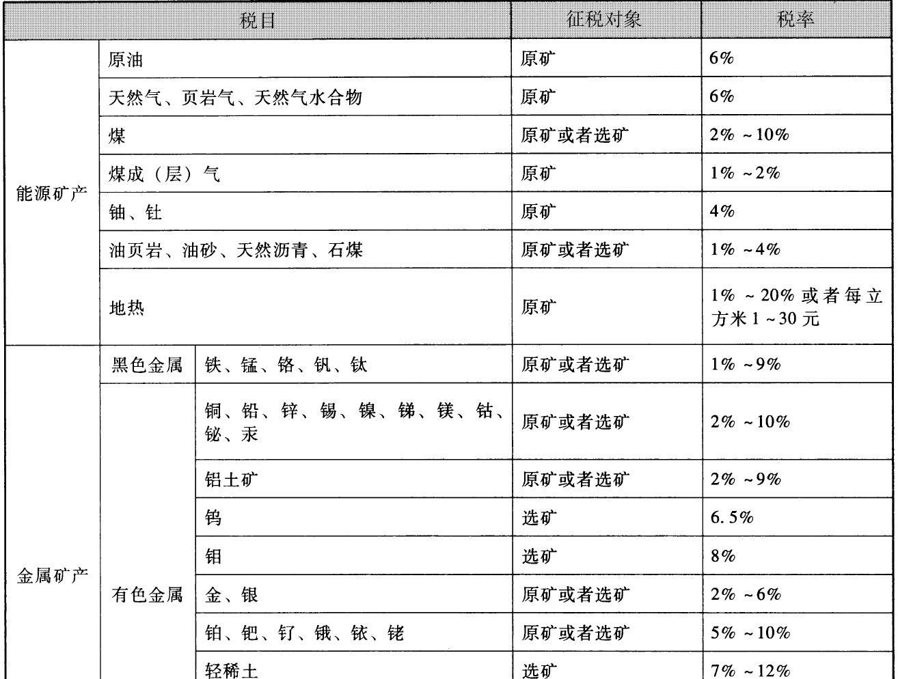
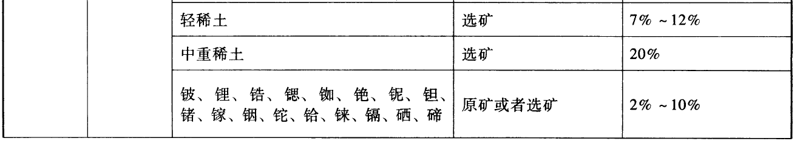
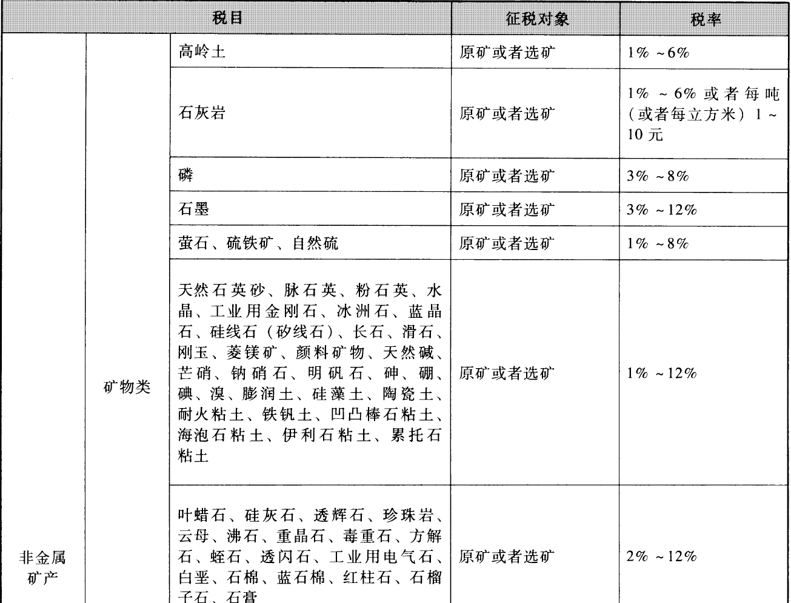
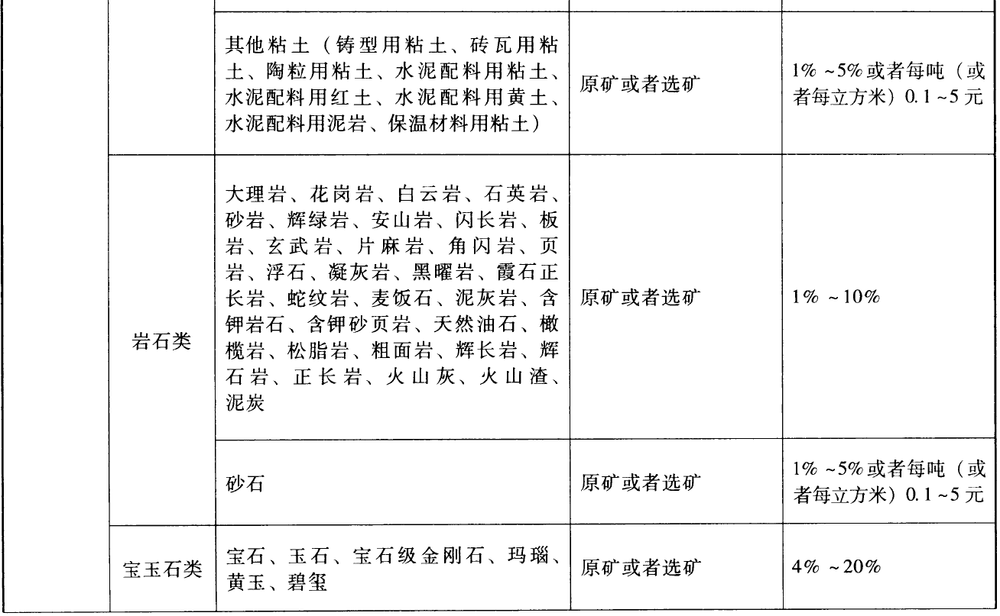
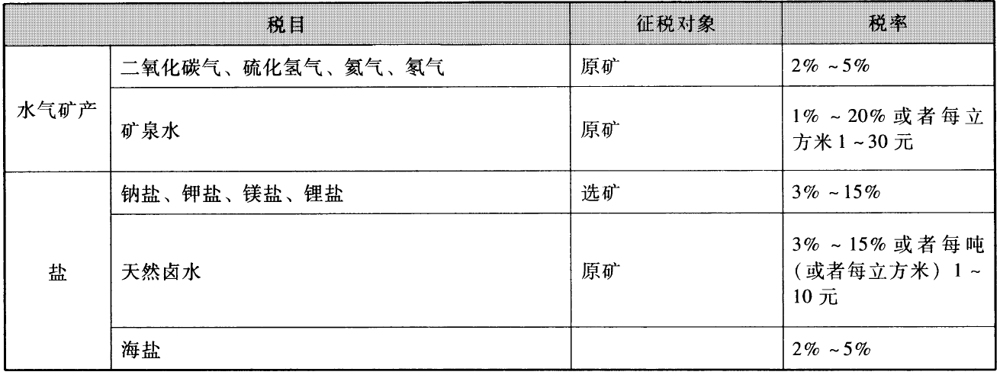

第六章其他税收法律制度

# 1. 第一节房产税法律制度

房产税，是以`房产`为征税对象，按照房产的`计税价值`或房产`租金收入`向产权所有人征收的一种税。1986年9月15日国务院颁布`《中华人民共和国房产税暂行条例》`（以下简称《房产税暂行条例》），同年9月25日财政部、国家税务总局印发`《关于房产税若干具体问题的解释和暂行规定》`。之后，国务院以及财政部、国家税务总局又陆续发布了一些有关房产税的规定、办法。这些构成了我国房产税法律制度。

## 1.1. 一、房产税纳税人

房产税的纳税人，是指在我国城`市`、`县`城、建制`镇`和`工矿区`内拥有`房屋产权`的单位和个人。具体包括产权所有人、承典人、房产代管人或者使用人。

房产税的征税对象是房屋。所谓房屋是指有屋面和围护结构（有墙或两边有柱），能够遮风避雨，可供人们在其中生产、工作、学习、娱乐、居住或储藏物资的场所。

1.产权属于国家所有的，其经营管理的单位为纳税人；产权属于集体和个人的，集体单位和个人为纳税人。

所称单位，包括国有企业、集体企业、私营企业、股份制企业、外商投资企业、外国企业、其他企事业单位、社会团体、国家机关、军队以及其他单位；所称个人，包括个体工商户以及其他个人。

2.产权出典的，`承典人`为纳税人。在房屋的管理和使用中，产权出典，是指产权所有人为了某种需要，将自己房屋的产权，在一定期限内转让（出典）给他人使用而取得出典价款的一种融资行为。产权所有人（房主）称为房屋出典人；支付现金或实物取得房屋支配权的人称为房屋的承典人。承典人向出典人交付一定的典价后，在质典期内获取抵押物品的支配权，并可转典。产权的典价一般要低于卖价。岀典人在规定期间内须归还典价的本金和利息，方可赎回出典房屋的产权。由于在房屋出典期间，产权所有人已无权支配房屋，因此，税法规定对房屋具有支配权的承典人为纳税人。

3.产权所有人、承典人均不在房产所在地的，房产`代管`人或者`使用`人为纳税人。

4.产权未确定以及租典纠纷未解决的，房产代管人或者使用人为纳税人。租典纠纷，是指产权所有人在房产出典和租赁关系上，与承典人、租赁人发生各种争议，特别是有关权利和义务的争议悬而未决的。此外，还有一些产权归属不清的问题，也都属于租典纠纷。

5.纳税单位和个人无租使用房产管理部门、免税单位及纳税单位的房产，由`使用`人代为缴纳房产税。

房地产开发企业建造的商品房，在出售前，不征收房产税，但对出售前房地产开发企业已使用或出租、出借的商品房应按规定征收房产税。

【例6-1】张某将个人拥有产权的房屋出典给李某，则李某为该房屋房产税的纳税人。判断是否正确。

【解析】正确。房产税法律制度规定，房屋出典的，承典人为房产税的纳税人。题中表述是正确的。

## 1.2. 二、房产税征税范围

房产税的征税范围为城市、县城、建制镇和工矿区的`房屋`。其中，城市是指国务院批准设立的市，其征税范围为市区、郊区和市辖县城，不包括`农村`；县城是指未设立建制镇的县人民政府所在地的地区；建制镇是指经省、自治区、直辖市人民政府批准设立的建制镇；工矿区是指工商业比较发达，人口比较集中，符合国务院规定的建制镇的标准，但尚未设立建制镇的大中型工矿企业所在地。在工矿区开征房产税必须经`省`、自治区、直辖市人民政府批准。

独立于房屋之外的建筑物，如围墙、烟囱、水塔、菜窖、室外游泳池等不属于房产税的征税范围。

## 1.3. 三、房产税税率

我国现行房产税采用`比例税率`。从价计征和从租计征实行不同标准的比例税率。

1.从价计征的，税率为`1.2%`。

2.从租计征的，税率为`12%`。

## 1.4. 四、房产税计税依据

房产税以房产的计税价值或房产租金收入为计税依据。按房产计税价值征税的，称为从价计征；按房产租金收入征税的，称为从租计征。

### 1.4.1. （一）从价计征的房产税的计税依据

从价计征的房产税，是以`房产余值`为计税依据。房产税依照房产原值一次减除10%〜30%后的`余值`计算缴纳。具体扣减比例由`省`、自治区、直辖市人民政府确定。

1.房产原值，是指纳税人按照会计制度规定，在账簿固定资产科目中记载的房屋原价。

自2009年1月1日起，对依照房产原值计税的房产，不论是否记载在会计账簿固定资产科目中，均应按照房屋原价计算缴纳房产税。房屋原价应根据国家有关会计制度规定进行核算。对纳税人未按国家会计制度核算并记载的，应按规定予以调整或重新评估。

2.房产余值，是房产的原值减除规定比例后的剩余价值。

3.房屋附属设备和配套设施的计税规定。

房产原值应包括与房屋不可分割的各种附属设备或一般不单独计算价值的配套设施。主要有：暖气、卫生、通风、照明、煤气等设备；各种管线，如蒸汽、压缩空气、石油、给水排水等管道及电力、电讯、电缆导线；电梯、升降机、过道、晒台等。

凡以房屋为载体，不可随意移动的附属设备和配套设施，如给排水、采暖、消防、中央空调、电气及智能化楼宇设备等，无论在会计核算中是否单独记账与核算，都应计入房产原值，计征房产税。

纳税人对原有房屋进行改建、扩建的，要相应增加房屋的原值。对更换房屋附属设备和配套设施的，在将其价值计入房产原值时，可扣减原来相应设备和设施的价值；对附属设备和配套设施中易损坏、需要经常更换的零配件，更新后不再计入房产原值。

4.对于投资联营的房产的计税规定。

（1）对以房产投资联营、投资者参与投资利润分红、共担风险的，按房产`余值`作为计税依据计缴房产税。

（2）对以房产投资收取固定收入、不承担经营风险的，实际上是以联营名义取得房屋`租金`，应以出租方取得的租金收入为计税依据计缴房产税。

此外，对融资租赁房屋的情况，由于租赁费包括购进房屋的价款、手续费、借款利息等，与一般房屋出租的“租金”内涵不同，且租赁期满后，当承租方偿还最后一笔租赁费时，房屋产权要转移到承租方。这实际上是一种变相的分期付款购买固定资产的形式，所以在计征房产税时应以房产`余值`计算征收。由承租人自融资租赁合同约定`开始日的次月`起依照房产余值缴纳房产税。合同未约定开始日的，由承租人自合同`签订的次月`起依照房产余值缴纳房产税。

5.居民住宅区内业主共有的经营性房产的计税规定。

从2007年1月1日起，对居民住宅区内业主共有的经营性房产，由实际经营（包括自营和出租）的`代管`人或`使用`人缴纳房产税。其中自营的依照房产原值减除10%-30%后的`余值`计征，没有房产原值或不能将业主共有房产与其他房产的原值准确划分开的，由房产所在地税务机关参照同类房产核定房产原值；出租房产的，按照`租金`收入计征。

### 1.4.2. （二）从租计征的房产税的计税依据

房产出租的，以房屋出租取得的`租金收入`为计税依据，计缴房产税。计征房产税的租金收入不含增值税。

房产的租金收入，是指房屋产权所有人出租房产使用权所取得的报酬，包括货币收入和实物收入。对以劳务或其他形式为报酬抵付房租收入的，应根据当地同类房产的租金水平，确定一个`标准`租金额从租计征。

纳税人对个人出租房屋的租金收入申报不实或申报数与同一地段同类房屋的租金收入相比明显不合理的，税务部门可以按照`《中华人民共和国税收征收管理法》`的有关规定，采取科学合理的方法`核定`其应纳税额。

## 1.5. 五、房产税应纳税额的计算

1.从价计征的房产税应纳税额的计算。从价计征是按房产的原值减除一定比例后的余值计征，其计算公式为：

从价计征的房产税应纳税额=应税房产原值x（1.扣除比例）x1.2%

公式中，扣除比例幅度为10%〜30%，具体减除幅度由省、自治区、直辖市人民政府规定。

2.从租计征的房产税应纳税额的计算。从租计征是按房产的租金收入计征，其计算公式为：

从租计征的房产税应纳税额=租金收入x12%（或4%）

【例6-2】某企业一幢房产原值为600000元，已知房产税税率为1.2%，当地规定的房产税扣除比例为30%，该房产年度应缴纳的房产税税额为（）元。

A.9360B.7200C.5040D.2160

【解析】答案为C。应纳房产税=600000x（1.30%）x1.2%=5040（元）。

## 1.6. 六、房产税税收优惠

1.国家机关、人民团体、军队自用的房产`免征`房产税。但上述免税单位的出租房产以及非自身业务使用的生产、营业用房，不属于免税范围。自2004年8月1日起，对军队空余房产租赁收入`暂免`征收房产税。

2.由国家财政部门拨付事业经费（全额或差额）的单位（学校、医疗卫生单位、托儿所、幼儿园、敬老院以及文化、体育、艺术类单位）所有的、本身业务范围内使用的房产`免征`房产税。

上述单位所属的附属工厂、商店、招待所等不属于单位公务、业务的用房，应照章纳税。

3.宗教寺庙、公园、名胜古迹自用的房产`免征`房产税。宗教寺庙自用的房产，是指举行宗教仪式等的房屋和宗教人员使用的生活用房屋。公园、名胜古迹自用的房产，是指供公共参观游览的房屋及其管理单位的办公用房屋。

宗教寺庙、公园、名胜古迹中附设的`营业单位`，如影剧院、饮食部、茶社、照相馆等所使用的房产及出租的房产，不属于免税范围，应照章`征税`。

4.个人所有`非营业用`的房产`免征`房产税。个人所有的非营业用房，主要是指居民住房，不分面积多少，一律免征房产税。对个人拥有的营业用房或者出租的房产，不属于免税房产，应照章征税。

5.经财政部批准免税的其他房产：

（1）毁损不堪居住的房屋和危险房屋，经有关部门鉴定，在停止使用后，可`免征`房产税。

（2）纳税人因房屋大修导致连续`停用半年以上`的，在房屋大修期间免征房产税，免征税额由纳税人在申报缴纳房产税时自行计算扣除，并在申报表附表或备注栏中作相应说明。

纳税人房屋大修停用半年以上需要免征房产税的，应在房屋大修`前`向主管税务机关报送相关的证明材料，包括大修房屋的名称、坐落地点、产权证编号、房产原值、用途、房屋大修的原因、大修合同及大修的起止时间等信息和资料，以备税务机关查验。具体报送材料由各省、自治区、直辖市和计划单列市税务局确定。

（3）在基建工地为基建工地服务的各种工棚、材料棚、休息棚和办公室、食堂、茶炉房、汽车房等临时性房屋，施工期间一律`免征`房产税。但工程结束后，施工企业将这种临时性房屋交还或估价转让给基建单位的，应从基建单位接收的次月起，照章纳税。

（4）对房管部门经租的居民住房，在房租调整改革之前收取租金偏低的，可暂缓征收房产税。对房管部门经租的其他非营业用房，是否给予照顾，由各省、自治区、直辖市根据当地具体情况按税收管理体制的规定办理。

（5）对高校学生公寓`免征`房产税。

（6）对非营利性医疗机构、疾病控制机构和妇幼保健机构等卫生机构自用的房产，免征房产税。

（7）老年服务机构自用的房产`免征`房产税。老年服务机构是指专门为老年人提供生活照料、文化、护理、健身等多方面服务的福利性、非营利性的机构，主要包括老年社会福利院、敬老院（养老院）、老年服务中心、老年公寓（含老年护理院、康复中心、托老所）等。

（8）对公共租赁住房`免征`房产税。公共租赁住房经营单位应单独核算公共租赁住房租金收入，未单独核算的，不得享受免征房产税优惠政策。

对廉租住房经营管理单位按照政府规定价格、向规定保障对象出租廉租住房的租金收入，`免征`房产税。

对个人出租`住房`，不区分用途，按`4%的税率`征收房产税；对企事业单位、社会团体以及其他组织按市场价格向个人出租用于居住的`住房`，`减按4%的税率`征收房产税。

（9）国家机关、军队、人民团体、财政补助事业单位、居民委员会、村民委员会拥有的`体育场馆`，用于体育活动的房产，`免征`房产税。

经费自理事业单位、体育社会团体、体育基金会、体育类民办非企业单位拥有并运营管理的体育场馆，符合相关条件的，其用于`体育活动`的房产，`免征`房产税。

`企业`拥有并运营管理的大型`体育场馆`，其用于体育活动的房产，`减半`征收房产税。

享受上述税收优惠体育场馆的运动场地，用于体育活动的`天数`不得低于全年自然天数的`70%`。

（10）自2019年1月1日至2021年12月31日，对农产品批发市场、农贸市场（包括自有和承租）专门用于经营农产品的房产、土地，`暂免`征收房产税。对同时经营其他产品的，按其他产品与农产品交易场地面积的`比例`确定征免房产税。

农产品批发市场、农贸市场的行政办公区、生活区，以及商业餐饮娱乐等`非直接`为农产品交易提供服务的房产、土地，应按规定`征收`房产税。

（11）自2019年1月1日至2021年12月310，对国家级、省级`科技`企业孵化器、大学科技园和国家备案众创空间自用以及无偿或通过出租等方式提供给在孵对象使用的房产、土地，`免征`房产税。

## 1.7. 七、房产税征收管理

### 1.7.3. （一）纳税义务发生时间

1.纳税人将原有房产用于生产经营，从`生产经营`之月起，缴纳房产税。

2.纳税人自行新建房屋用于生产经营，从`建成之次月`起，缴纳房产税。

3.纳税人委托施工企业建设的房屋，从办理`验收手续之次月`起，缴纳房产税。

4.纳税人购置新建商品房，自房屋`交付使用之次月`起，缴纳房产税。

5.纳税人购置存量房，自办理房屋权属转移、`变更登记`手续，房地产权属登记机关签发房屋权属证书之`次月`起，缴纳房产税。

6.纳税人出租、出借房产，自`交付`岀租、岀借本企业房产之`次月`起，缴纳房产税。

7.房地产开发企业自用、出租、出借本企业建造的商品房，自房屋使用或交付之`次月`起，缴纳房产税。

8.纳税人因房产的实物或权利状态发生变化而依法终止房产税纳税义务的，其应纳税款的计算截止到房产的实物或权利状态发生变化的`当月末`。

### 1.7.4. （二）纳税地点

房产税在房产`所在地`缴纳。房产不在同一地方的纳税人，应按房产的坐落地点`分别`向房产所在地的税务机关申报纳税。

### 1.7.5. （三）纳税期限

房产税实行按`年`计算、`分期`缴纳的征收方法，具体纳税期限由`省`、自治区、直辖市人民政府确定。

# 2. 第二节契税法律制度

契税，是指国家在`土地`、`房屋`权属转移时，按照当事人双方签订的`合同`（契约）以及所确定`价格`的一定比例，向权属承受人征收的一种税。1997年7月7日国务院颁布`《中华人民共和国契税暂行条例》`（以下简称《契税暂行条例》），同年10月28日财政部印发`《契税暂行条例实施细则》`。2020年8月11日第十三届全国人民代表大会常务委员会第二十一次会议通过`《中华人民共和国契税法》`。

## 2.8. 一、契税纳税人

契税的纳税人，是指在我国境内`承受`土地、房屋权属转移的单位和个人。

契税由权属的承受人缴纳。这里所说的“承受”，是指以受让、购买、受赠、互换等方式取得土地、房屋权属的行为。土地、房屋权属，是指土地使用权和房屋所有权；单位，是指企业单位、事业单位、国家机关、军事单位和社会团体以及其他组织；个人，是指个体经营者和其他个人。

## 2.9. 二、契税征税范围

契税以在我国境内转移土地、房屋权属的`行为`作为征税对象。土地、房屋权属未发生转移的，不征收契税。契税的征税范围主要包括：

1.土地使用权`出让`，是指土地使用者向国家交付土地使用权出让费用，国家将土地使用权在一定年限内让与土地使用者的行为。出让费用包括出让金等。

2.土地使用权`转让`，是指土地使用者以出售、赠与、互换或者其他方式将土地使用权转移给其他单位和个人的行为。土地使用权的转让不包括土地承包`经营权`和土地`经营权`的转移。

3.`房屋`买卖，是指房屋所有者将其房屋出售，由承受者交付货币、实物、无形资产或其他经济利益的行为。

4.`房屋`赠与，是指房屋所有者将其房屋无偿转让给受赠者的行为。

5.`房屋`互换，是指房屋所有者之间相互交换房屋的行为。

以作价投资（入股）、偿还债务、划转、奖励等方式转移土地、房屋权属的，应当依照税法规定征收`契税`。对于这些转移土地、房屋权属的形式，可以分别`视同`土地使用权转让、房屋买卖或者房屋赠与征收契税。土地使用权受让人通过完成土地使用权转让方约定的投资额度或投资特定项目，以此获取低价转让或无偿赠与的土地使用权的，属于契税征收范围，其计税价格由征收机关参照纳税义务发生时当地的`市场价格`核定。此外，公司增资扩股中，对以土地、房屋权属作价入股或作为出资投入企业的，征收契税；企业`破产`清算期间，对非债权人承受破产企业土地、房屋权属的，征收`契税`。

土地、房屋典当、分拆（分割）、抵押以及出租等行为，不属于契税的征税范围。

## 2.10. 三、契税税率

契税釆用比例税率，实行`3%〜5%的幅度税率`。具体适用税率由各`省`、自治区、直辖市人民政府在幅度税率规定范围内，按照本地区的实际情况提岀，报同级人民代表大会常务委员会`决定`，并报全国人民代表大会常务委员会和国务院`备案`。

同时，各省、自治区、直辖市可以依照税法规定的程序对不同主体、不同地区、不同类型的住房的权属转移确定差别税率。

## 2.11. 四、契税计税依据

按照土地、房屋权属转移的形式、定价方法的不同，契税的计税依据确定如下：

1.土地使用权出让、出售，房屋买卖，以`成交价格`作为计税依据。成交价格是指土地、房屋权属转移合同确定的价格，包括承受者应交付的货币、实物、无形资产或其他经济利益对应的价款。计征契税的成交价格不含增值税。

2.土地使用权赠与、房屋赠与以及其他没有价格的转移土地、房屋权属行为，为税务机关参照土地使用权出售、房屋买卖的`市场价格`依法核定的价格。

3.土地使用权互换、房屋互换，以所互换的土地使用权、房屋价格的`差额`为计税依据。计税依据只考虑其价格的差额，互换价格不相等的，由多交付货币、实物、无形资产或其他经济利益的一方缴纳契税；互换价格相等的，`免征`契税。土地使用权与房屋所有权之间相互交换，也应按照上述办法确定计税依据。

4.以划拨方式取得土地使用权，经批准转让房地产时应补交的`契税`，以补交的土地使用权出让费用或土地收益作为计税依据。

为了防止纳税人隐瞒、虚报成交价格以偷、逃税款，对纳税人申报的成交价格、互换价格差额明显偏低且无正当理由的，由税务机关依照`《中华人民共和国税收征收管理法》`的规定核定。

## 2.12. 五、契税应纳税额的计算

契税应纳税额依照`省`、自治区、直辖市人民政府确定的适用税率和税法规定的计税依据计算征收。其计算公式为：

应纳税额=计税依据x税率

【例6-3】2019年，王某获得单位奖励房屋一套。王某得到该房屋后又将其与李某拥有的一套房屋进行互换。经`房地产评估机构`评估王某获奖房屋价值30万元，李某房屋价值35万元。两人协商后，王某实际向李某支付房屋互换价格差额款5万元。`税务机关`核定奖励王某的房屋价值28万元。已知当地规定的契税税率为4%。计算王某应缴纳的契税税额。

【解析】以获奖方式取得房屋权属的应视同房屋赠与征收契税，计税依据为税务机关参照市场价格核定的价格，即28万元。房屋交换且互换价格不相等的，应由多支付货币的一方缴纳契税，计税依据为所互换的房屋价格的差额，即5万元。因此，王某应就其获奖承受该房屋权属行为和房屋互换行为分别缴纳契税。

（1）王某获奖承受房屋权属应缴纳的契税税额=280000x4%=11200（元）。

（2）王某交换房屋行为应缴纳的契税税额=50000x4%=2000（元）。

（3）王某实际应缴纳的契税税额=11200+2000=13200（元）。

## 2.13. 六、契税税收优惠

### 2.13.6. （一）有下列情形之一的，免征契税

1.国家机关、事业单位、社会团体、军事单位承受土地、房屋权属用于办公、教学、医疗、科研、军事设施；

2.`非营利性`的学校、医疗机构、社会福利机构承受土地、房屋权属用于办公、教学、医疗、科研、养老、救助；

3.承受荒山、荒地、荒滩土地使用权用于`农、林、牧、渔业`生产；

4.婚姻关系存续期间`夫妻`之间变更土地、房屋权属；

5.法定继承人通过`继承`承受土地、房屋权属；

6.依照法律规定应当予以免税的外国驻华`使馆`、领事馆和国际组织驻华代表机构承受土地、房屋权属。

根据国民经济和社会发展的需要，`国务院`对居民住房需求保障、企业改制重组、灾后重建等情形可以规定免征或者减征契税，报全国人民代表大会常务委员会`备案`。

### 2.13.7. （二）省、自治区、直辖市可以决定对下列情形免征或者减征契税

1.因土地、房屋被`县`级以上人民政府征收、征用，重新承受土地、房屋权属；

2.因`不可抗力`灭失住房，重新承受住房权属。

上述规定的免征或者减征契税的具体办法，由`省`、自治区、直辖市人民政府提出，报同级人民代表大会常务委员会`决定`，并报全国人民代表大会常务委员会和国务院`备案`。

经批准减征、免征契税的纳税人，改变有关土地、房屋的用途，或者有其他不再属于税法规定的减征、免征契税情形的，就不再属于减征、免征契税范围，并且应当补缴已经减征、免征的税款。

## 2.14. 七、契税征收管理

### 2.14.8. （一）纳税义务发生时间

契税的纳税义务发生时间是纳税人签订土地、房屋权属转移`合同`的当日，或者纳税人取得其他具有土地、房屋权属转移合同性质凭证的当日。纳税人应当在依法办理土地、房屋权属登记手续前申报缴纳契税。

纳税人办理纳税事宜后，税务机关应当开具契税完税凭证。纳税人办理土地、房屋权属登记，不动产登记机构应当`查验`契税完税、减免税凭证或者有关信息。未按照规定缴纳契税的，不动产登记机构不予办理土地、房屋权属登记。

在依法办理土地、房屋权属登记前，权属转移合同、权属转移合同性质凭证不生效、无效、被撤销或者被解除的，纳税人可以向税务机关申请`退还`已缴纳的税款，税务机关应当依法办理。

税务机关应当与相关部门建立契税涉税信息`共享`和工作配合机制。自然资源、住房城乡建设、民政、公安等相关部门应当及时向税务机关提供与转移土地、房屋权属有关的信息，协助税务机关加强契税征收管理。

税务机关及其工作人员对税收征收管理过程中知悉的纳税人的个人信息，应当依法予以`保密`，不得泄露或者非法向他人提供。

### 2.14.9. （二）纳税地点

契税实行`属地`征收管理。纳税人发生契税纳税义务时，应向土地、房屋所在地的税务征收机关申报纳税。

# 3. 第三节土地增值税法律制度

土地增值税是对转让国有土地使用权、地上建筑物及其附着物并取得收入的单位和个人，就其转让房地产所取得的增值额征收的一种税。1993年12月13日国务院颁布`《中华人民共和国土地增值税暂行条例》`（以下简称《土地增值税暂行条例》），1995年1月27日财政部印发`《中华人民共和国土地增值税暂行条例实施细则》`。之后，财政部、国家税务总局又陆续发布了一些有关土地增值税的规定、办法。这些构成了我国土地增值税法律制度。

## 3.15. 一、土地增值税纳税人

土地增值税的纳税人为`转让`国有土地使用权、地上建筑物及其附着物（以下简称转让房地产）并取得`收入`的单位和个人。这里所称单位包括各类企业单位、事业单位、国家机关和社会团体及其他组织。这里所称个人包括个体经营者和其他个人。此外，还包括外商投资企业、外国企业、外国驻华机构及海外华侨、港澳台同胞和外国公民。

【例6-4】下列各项中，不属于土地增值税纳税人的是（）。

A.以房抵债的某工业企业

B，出租写字楼的某外资房地产开发公司

C.转让住房的某个人

D，转让国有土地使用权的某高等学校

【解析】答案为B。土地增值税法律制度规定，出租房地产，未发生房产产权、土地使用权的转让行为，不属于土地增值税征税范围，所以，出租写字楼的某外资房地产开发公司不是土地增值税的纳税人。

## 3.16. 二、土地增值税征税范围

### 3.16.10. （一）征税范围的一般规定

1.土地增值税只对转让国有土地使用权的行为征税，对出让国有土地的行为不征税。

所谓国有土地使用权，是指土地使用人根据国家法律、合同等规定，对国家所有的土地享有的使用权利。土地增值税只对企业、单位和个人转让国有土地使用权的行为征税。

国有土地出让，是指国家以土地所有者的身份将土地使用权在一定年限内让与土地使用者，并由土地使用者向国家支付土地出让金的行为。由于土地使用权的出让方是国家，出让收入在性质上属于政府凭借所有权在土地一级市场上收取的租金，所以，政府出让土地的行为及取得的收入也不在土地增值税的征税之列。

2.土地增值税既对转让国有土地使用权的行为征税，也对转让地上建筑物及其他附着物产权的行为征税。

所谓地上建筑物，是指建于土地上的一切建筑物，包括地上地下的各种附属设施。如厂房、仓库、商店、医院、住宅、地下室、围墙、烟囱、电梯、中央空调、管道等。所谓附着物是指附着于土地上、不能移动，一经移动即遭损坏的种植物、养植物及其他物品。上述建筑物和附着物的所有者对自己的财产依法享有占有、使用、收益和处置的权利，即拥有排他性的全部产权。

税法规定，纳税人转让地上建筑物和其他附着物的产权，取得的`增值额`，也应计算缴纳土地增值税。换言之，纳入土地增值税征税范围的增值额，是纳税人转让房地产所取得的全部增值额，而非仅仅是转让土地使用权的增值额。

3.土地增值税只对有偿转让的房地产征税，对以继承、赠与等方式无偿转让的房地产，不予征税。

不征土地增值税的房地产赠与行为包括以下两种情况：（1）房产所有人、土地使用权所有人将房屋产权、土地使用权`赠与`直系亲属或承担直接赡养义务人的行为。（2）房产所有人、土地使用权所有人通过中国境内非营利的社会团体、国家机关将房屋产权、土地使用权`赠与`教育、民政和其他社会福利、公益事业的行为。社会团体是指中国青少年发展基金会、希望工程基金会、宋庆龄基金会、减灾委员会、中国红十字会、中国残疾人联合会、全国老年基金会、老区促进会，以及经民政部门批准成立的其他非营利的公益性组织。

### 3.16.11. （二）征税范围的特殊规定

1.企业改制重组。

（1）按照`《中华人民共和国公司法》`的规定，非公司制企业整体改制为有限责任公司或者股份有限公司，有限责任公司（股份有限公司）整体改制为股份有限公司（有限责任公司），对改制前的企业将国有土地使用权、地上的建筑物及其附着物（以下简称“房地产”）转移、变更到改制后的企业，`暂不`征土地增值税。

整体改制是指不改变原企业的投资主体，并承继原企业权利、义务的行为。

（2）按照法律规定或者合同约定，两个或两个以上企业合并为一个企业，且原企业投资主体存续的，对原企业将房地产转移、变更到合并后的企业，`暂不`征土地增值税。

（3）按照法律规定或者合同约定，企业分设为两个或两个以上与原企业投资主体相同的企业，对原企业将房地产转移、变更到分立后的企业，`暂不`征土地增值税。

（4）单位、个人在改制重组时以房地产作价入股进行投资，对其将房地产转移、变更到被投资的企业，`暂不`征土地增值税。

（5）上述改制重组有关土地增值税政策不适用于房地产转移任意一方为`房地产开发企业`的情形。

2.房地产开发企业将开发的部分房地产转为企业自用或用于出租等商业用途时，如果产权未发生转移，`不征`收土地增值税。

3.房地产的交换，是指一方以房地产与另一方的房地产进行交换的行为。由于这种行为既发生了房产产权、土地使用权的转移，交换双方又取得了实物形态的收入，属于土地增值税的征税范围。但对`个人`之间互换自有`居住`用房地产的，经当地税务机关核实，可以`免征`土地增值税。

4.合作建房。对于一方出地，另一方出资金，双方合作建房，建成后按比例分房自用的，`暂免`征收土地增值税；建成后`转让`的，`应征`收土地增值税。

5.房地产的出租，是指房产所有者或土地使用者，将房产或土地使用权租赁给承租人使用，由承租人向出租人支付租金的行为。房地产岀租，出租人虽取得了收入，但没有发生房产产权、土地使用权的转让，因此，不属于土地增值税的征税范围。

6.房地产的抵押，是指房产所有者或土地使用者作为债务人或第三人向债权人提供不动产作为清偿债务的担保而不转移权属的法律行为。这种情况下房产的产权、土地使用权在抵押期间并没有发生权属的变更，因此，对房地产的抵押，在抵押期间不征收土地增值税。待抵押期满后，视该房地产是否转移而确定是否征收土地增值税。对于以房地产抵债而发生房地产权属转让的，应列入土地增值税的征税范围。

7.房地产的代建行为，是指房地产开发公司代客户进行房地产的开发，开发完成后向客户收取代建收入的行为。对于房地产开发公司而言，虽然取得了收入，但没有发生房地产权属的转移，其收入属于`劳务收入`性质，故`不属于`土地增值税的征税范围。

8.房地产的重新评估。国有企业在清产核资时对房地产进行重新评估而产生的评估增值，因其既没有发生房地产权属的转移，房产产权、土地使用权人也未取得收入，所以不属于土地增值税的征税范围。

9.土地使用者`处置`土地使用权。土地使用者转让、抵押或置换土地，无论其是否取得了该土地的使用权属证书，无论其在转让、抵押或置换土地过程中是否与对方当事人办理了土地使用权属证书变更登记手续，只要土地使用者享有占有、使用、收益或处分该土地的权利，且有合同等证据表明其`实质`转让、抵押或置换了土地并取得了相应的经济利益，土地使用者及其对方当事人就应当依照税法规定缴纳增值税、土地增值税和契税等。

## 3.17. 三、土地增值税税率

土地增值税实行四级`超率累进税率`：

1.增值额未超过扣除项目金额50%的部分，税率为30%。

2.增值额超过扣除项目金额50%、未超过扣除项目金额100%的部分，税率为40%。

3.增值额超过扣除项目金额100%、未超过扣除项目金额200%的部分，税率为50%。

4.增值额超过扣除项目金额200%的部分，税率为60%。

上述所列四级超率累进税率，每级“增值额未超过扣除项目金额”的比例，均包括本比例数。四级超率累进税率及速算扣除系数见表6-1。

表6-1土地增值税四级超率累进税率表

| 级数 | 增值额与扣除项目金额的比率 | 税率（%） | 速算扣除系数（%） |
|------|----------------------------|-----------|-------------------|
| 1    | 不超过50%的部分            | 30        | 0                 |
| 2    | 超过50%至100%的部分        | 40        | 5                 |
| 3    | 超过100%至200%的部分       | 50        | 15                |
| 4    | 超过200%的部分             | 60        | 35                |

## 3.18. 四、土地增值税计税依据

土地增值税的计税依据是纳税人转让房地产所取得的`增值额`。转让房地产的增值额，是纳税人转让房地产的`收入`减除税法规定的`扣除项目`金额后的`余额`。土地增值额的大小，取决于转让房地产的收入额和扣除项目金额两个因素。

### 3.18.12. （—）应税收入的确定

根据`《土地增值税暂行条例》`及其实施细则的规定，纳税人转让房地产取得的应税收入，应包括转让房地产的全部价款及有关的经济收益。从收入的形式来看，包括货币收入、实物收入和其他收入。纳税人转让房地产取得的收入为不含增值税收入。

1.货币收入，是指纳税人转让房地产而取得的现金、银行存款和国库券、金融债券、企业债券、股票等有价证券。

2.实物收入，是指纳税人转让房地产而取得的各种实物形态的收入，如钢材、水泥等建材，房屋、土地等不动产，等等。对于这些实物收入一般要按照公允价值确认应税收入。

3.其他收入，是指纳税人转让房地产而取得的无形资产收入或具有财产价值的权利，如专利权、商标权、著作权、专有技术使用权、土地使用权、商誉权等。对于这些无形资产收入一般要进行专门的评估，按照评估价确认应税收入。

纳税人取得的收入为外国货币的，应当以取得收入当天或当月1日国家公布的市场汇价折合成人民币，据以计算土地增值税税额。当月以分期收款方式取得的外币收入，也应按实际收款日或收款当月1日国家公布的市场汇价折合成人民币。

【例6-5】某工业企业利用一块闲置的土地使用权换取某房地产公司的新建商品房，作为本单位职工的居住用房，由于没有取得收入，所以，该企业不需要缴纳土地增值税。这种说法是否正确？

【解析】不正确。该企业以地换房，虽然没有取得货币收入，但是取得了实物收入并且发生了土地使用权转移，所以，该企业应该缴纳土地增值税。

### 3.18.13. （二）扣除项目及其金额

依照《土地增值税暂行条例》的规定，准予纳税人从房地产转让收入额减除的`扣除项目`金额具体包括以下内容：

#### 3.18.13.1. 1.取得土地使用权所支付的金额。

取得`土地使用权`所支付的金额包括以下两方面的内容：

（1）纳税人为取得土地使用权所支付的`地价款`。地价款的确定有三种方式：如果是以协议、招标、拍卖等出让方式取得土地使用权的，地价款为纳税人所支付的土地出让金；如果是以行政划拨方式取得土地使用权的，地价款为按照国家有关规定补交的土地出让金；如果是以转让方式取得土地使用权的，地价款为向原土地使用权人实际支付的地价款。

（2）纳税人在取得土地使用权时按国家统一规定缴纳的有关`费用`和`税金`。有关费用和税金是指纳税人在取得土地使用权过程中为办理有关手续，必须按国家统一规定缴纳的有关登记、过户`手续费`和`契税`。

#### 3.18.13.2. 2.房地产开发成本。

房地产开发成本，是指纳税人`开发`房地产项目实际发生的`成本`，包括土地的征用及拆迁补偿费、前期工程费、建筑安装工程费、基础设施费、公共配套设施费、开发间接费用等。

（1）土地征用及拆迁补偿费，包括土地征用费、耕地占用税、劳动力安置费及有关地上、地下附着物拆迁补偿的净支出、安置动迁用房支出等。

（2）前期工程费，包括规划、设计、项目可行性研究和水文、地质、勘察、测绘、“三通一平”等支出。

（3）建筑安装工程费，是指以出包方式支付给承包单位的建筑安装工程费，以自营方式发生的建筑安装工程费。

（4）基础设施费，包括开发小区内道路、供水、供电、供气、排污、排洪、通信、照明、环卫、绿化等工程发生的支出。

（5）公共配套设施费，包括不能有偿转让的开发小区内公共配套设施发生的支出。

（6）开发间接费用，是指直接组织、管理开发项目发生的费用，包括工资、职工福利费、折旧费、修理费、办公费、水电费、劳动保护费、周转房摊销等。

#### 3.18.13.3. 3.房地产开发费用。

房地产开发费用，是指与房地产`开发`项目有关的`销售费用`、`管理费用`和`财务费用`。根据现行财务会计制度的规定，这三项费用作为`期间费用`，按照实际发生额直接计入当期损益。但在计算土地增值税时，房地产开发费用并不是按照纳税人实际发生额进行扣除，应分别按以下两种情况扣除：

（1）财务费用中的利息支出，凡能够按转让房地产项目计算分摊并提供金融机构证明的，允许`据实`扣除，但最高不能超过按商业银行`同类同期贷款利率`计算的金额。其他房地产开发费用，按规定（即取得土地使用权所支付的金额和房地产开发成本，下同）计算的金额之和的`5%`以内计算扣除。计算扣除的具体比例，由各`省`、自治区、直辖市人民政府规定。计算公式为：

允许扣除的房地产开发费用=利息+（取得土地使用权所支付的金额+房地产开发成本）x省级政府确定的比例

（2）财务费用中的利息支出，凡不能按转让房地产项目计算分摊利息支出或不能提供金融机构证明的，房地产开发费用按规定计算的金额之和的`10%`以内计算扣除。计算扣除的具体比例，由各`省`、自治区、直辖市人民政府规定。计算公式为：

允许扣除的房地产开发费用=（取得土地使用权所支付的金额+房地产开发成本）x省级政府确定的比例

财政部、国家税务总局对扣除项目金额中利息支出的计算问题作了两点专门规定：一是利息的上浮幅度按国家的有关规定执行，超过上浮幅度的部分不允许扣除；二是对于超过贷款期限的利息部分和加罚的利息不允许扣除。

#### 3.18.13.4. 4.与转让房地产有关的税金。

与转让房地产有关的`税金`，是指在转让房地产时缴纳的`城市维护建设税`、`印花税`。因转让房地产缴纳的`教育费附加`，也可视同税金予以扣除。`《土地增值税暂行条例》`等规定的土地增值税扣除项目涉及的增值税进项税额，允许在销项税额中计算抵扣的，不计入扣除项目，不允许在销项税额中计算抵扣的，可以计入扣除项目。

房地产开发企业按照`《施工、房地产开发企业财务制度》`有关规定，其在转让时缴纳的`印花税`已列入管理费用中，故不允许单独再扣除。其他纳税人缴纳的印花税允许在此扣除。

#### 3.18.13.5. 5.财政部确定的其他扣除项目。

对从事房地产开发的纳税人可按规定计算的金额之和，加计`20%`的扣除。此条优惠只适用于从事房地产开发的纳税人，除此之外的其他纳税人不适用。

#### 3.18.13.6. 6.旧房及建筑物的扣除金额。

（1）按`评估价格`扣除。旧房及建筑物的评估价格是指在转让已使用的房屋及建筑物时，由政府批准设立的房地产评估机构评定的`重置成本价`乘以`成新度折扣率`后的价格。评估价格须经当地税务机关确认。

重置成本价的含义是：对旧房及建筑物，按转让时的建材价格及人工费用计算建造同样面积、同样层次、同样结构、同样建设标准的新房及建筑物所需花费的成本费用。成新度折扣率的含义是：按旧房的新旧程度作一定比例的折扣。

因此，转让旧房应按房屋及建筑物的评估价格、取得土地使用权所支付的地价款和按国家统一规定缴纳的有关费用，以及在转让环节缴纳的税金作为扣除项目金额计征土地增值税。对取得土地使用权时未支付地价款或不能提供已支付的地价款凭据的，在计征土地增值税时不允许扣除。

（2）按购房`发票`金额计算扣除。纳税人转让旧房及建筑物，凡不能取得评估价格，但能提供购房发票的，经当地税务部门确认，`《土地增值税暂行条例》`规定的扣除项目的金额，可按发票所载金额并从购买年度起至转让年度止每年加计`5%`计算。对于纳税人购房时缴纳的`契税`，凡能够提供契税完税凭证的，准予作为“与转让房地产有关的`税金`”予以扣除，但不作为加计5%的基数。

#### 3.18.13.7. 7.计税依据的特殊规定。

（1）隐瞒、虚报房地产成交价格的。隐瞒、虚报房地产成交价格，是指纳税人不报或有意低报转让土地使用权、地上建筑物及其附着物价款的行为。

对于纳税人隐瞒、虚报房地产成交价格的，应由评估机构参照同类房地产的市场交易价格进行评估，税务机关根据`评估价格`确定转让房地产的收入。

（2）提供扣除项目金额不实的。提供扣除项目金额不实，是指纳税人在纳税申报时，不据实提供扣除项目金额，而是虚增被转让房地产扣除项目的内容或金额，使税务机关无法从纳税人方面了解计征土地增值税所需的正确的扣除项目金额，以达到虚增成本偷税的目的。

对于纳税人申报扣除项目金额不实的，应由评估机构按照房屋重置成本价，乘以房屋的成新度折扣率，计算的房屋成本价和取得土地使用权时的基准地价进行评估。税务机关根据`评估价格`确定房产的扣除项目金额，并用该房产所坐落土地取得时的基准地价或标准地价来确定土地的扣除项目金额，房产和土地的扣除项目金额之和即为该房地产的扣除项目金额。

（3）转让房地产的成交价格低于房地产评估价格，又无正当理由的。转让房地产的成交价格低于房地产评估价格且无正当理由，是指纳税人申报的转让房地产的成交价低于房地产评估机构釆用市场比较法评估的正常市场交易价，纳税人又无正当理由进行解释的行为。对于这种情况，应按评估的`市场交易价`确定其实际成交价，并以此作为转让房地产的收入计算征收土地增值税。

（4）非直接销售和自用房地产收入的确定。房地产开发企业将开发产品用于职工福利、奖励、对外投资、分配给股东或投资人、抵偿债务、换取其他单位和个人的非货币性资产等，发生所有权转移时应`视同销售`房地产，其收入按下列方法和顺序确认：一是按本企业在同一地区、同一年度销售的`同类`房地产的`平均`价格确定；二是由主管税务机关参照当地当年、同类房地产的`市场价格`或`评估价值`确定。

【例6-6】纳税人转让旧房，在计算土地增值额时，允许扣除的项目有（）。

A.转让环节缴纳给国家的各项税费

B.经税务机关确认的房屋及建筑物的评估价格

C.当期发生的管理费用、财务费用和销售费用

D.取得土地使用权所支付的价款和按国家规定缴纳的有关税费

【解析】答案为ABD。根据土地增值税法律制度的规定，纳税人转让旧房，不允许扣除管理费用等三项费用，只有转让新建商品房项目时，才允许按照房地产开发费用扣除。

## 3.19. 五、土地增值税应纳税额的计算

1.应纳税额的计算公式。土地增值税按照纳税人转让房地产所取得的`增值额`和规定的税率计算征收。土地增值税的计算公式是：

应纳税额=\>（每级距的增值额x适用税率）

由于分步计算比较烦琐，一般可以采用`速算扣除法`计算。即计算土地增值税税额，可按增值额乘以适用的税率减去扣除项目金额乘以速算扣除系数的简便方法计算。具体公式如下：

（1）增值额未超过扣除项目金额50%。

土地增值税应纳税额=增值额x30%

（2）增值额超过扣除项目金额50%，未超过100%。

土地增值税应纳税额=增值额x40%-扣除项目金额x5%

（3）增值额超过扣除项目金额100%，未超过200%。

土地增值税应纳税额=增值额x50%-扣除项目金额X15%

（4）增值额超过扣除项目金额200%。

土地增值税应纳税额=增值额x60%-扣除项目金额x35%

2.应纳税额的计算步骤。根据上述计算公式，土地增值税应纳税额的计算可分为以下四步：

（1）计算增值额。

增值额二房地产转让收入—扣除项目金额

（2）计算增值率。

增值率=增值额/扣除项目金额X100%

（3）确定适用`税率`。按照计算出的增值率，从土地增值税税率表中确定适用税率。

（4）计算应纳税额。

土地增值税应纳税额=增值额X适用税率-扣除项目金额X速算扣除系数

【例6-7】2019年某国有商业企业利用库房空地进行住宅商品房开发，按照国家有关规定补交土地出让金2840万元，缴纳相关税费160万元；住宅开发成本2800万元，其中含装修费用500万元；房地产开发费用中的利息支出为300万元（不能提供金融机构证明）；当年住宅全部销售完毕，取得不含增值税销售收入共计9000万元；缴纳城市维护建设税和教育费附加45万元；缴纳印花税4.5万元。已知：该公司所在省人民政府规定的房地产开发费用的计算扣除比例为10%。计算该企业销售住宅应缴纳的土地增值税税额。

【解析】非房地产开发企业缴纳的印花税允许作为税金扣除；非房地产开发企业不允许按照取得土地使用权所支付金额和房地产开发成本合计数的20%加计扣除。

（1）住宅销售收入为9000万元。

（2）确定转让房地产的扣除项目金额包括：

①取得土地使用权所支付的金额=2840+160=3000（万元）。

②住宅开发成本为2800万元。

③房地产开发费用=（3000+2800）X10%=580（万元）。

④与转让房地产有关的税金=45+4.5=49.5（万元）。

⑤转让房地产的扣除项目金额=2840+160+2800+（2840+160+2800）x10%+49.5=6429.5（万元）。

（3）转让房地产的增值额=9000-6429.5=2570.5（万元）。

（4）增值额与扣除项目金额的比率=2570.54-6429.5=39.98%。

增值额与扣除项目金额的比率未超过50%，适用税率为30%。

（5）应纳土地增值税税额=2570.5x30%=771.15（万元）。

## 3.20. 六、土地增值税税收优惠

1.纳税人建造普通标准`住宅`出售，增值额未超过扣除项目金额`20%`的，予以`免税`；超过20%的，应按全部增值额缴纳土地增值税。

所称的普通标准住宅，是指按所在地一般民用住宅标准建造的居住用住宅。高级公寓、别墅、度假村等不属于普通标准住宅。普通标准住宅与其他住宅的具体划分界限，2005年5月31日以前由各`省`、自治区、直辖市人民政府规定。2005年6月1日起，普通标准住宅应同时满足：住宅小区建筑`容积率`在1.0以上；单套建筑面积在`120平方米`以下；实际成交价格低于同级别土地上住房平均交易价格`1.2倍`以下。各省、自治区、直辖市根据实际情况，制定本地区享受优惠政策普通住房具体标准。允许单套建筑面积和价格标准适当浮动，但向上浮动的比例不得超过上述`标准的20%`。

对于纳税人既建普通标准住宅又进行其他房地产开发的，应分别核算增值额。不分别核算增值额或不能准确核算增值额的，其建造的普通标准住宅不能适用这一免税规定。

2.因`国家`建设需要依法`征用`、`收回`的房地产，免征土地增值税。

因国家建设需要依法征用、收回的房地产，是指因城市实施规划、国家建设的需要而被政府批准征用的房产或收回的土地使用权。

因城市实施规划、国家建设的需要而搬迁，由纳税人自行转让原房地产的，免征土地增值税。

3.企事业单位、社会团体以及其他组织转让旧房作为`公共租赁住房`房源且增值额未超过扣除项目金额`20%`的，免征土地增值税。

4.自2008年11月1日起，对`个人`转让`住房`暂免征收土地增值税。

【例6-8】根据土地增值税法律制度的规定，下列各项中，可以免征土地增值税的有（）。

A.国家机关转让自用房产

B.工业企业在改制重组时以不动产作价入股投资非房地产企业

C.房地产公司以不动产作价入股进行投资

D.某商场因城市实施规划、国家建设的需要而自行转让原房产

【解析】答案为BD。对于以土地（房地产）作价入股进行投资或联营的，凡所投资、联营的企业从事房地产开发的，或者房地产开发企业以其建造的商品房进行投资和联营的，不免征土地增值税；工业企业以不动产作价入股进行投资和某商场因城市实施规划、国家建设的需要而自行转让原房产属于免征土地增值税的情形；国家机关转让自用房产属于土地增值税的征税范围。

## 3.21. 七、土地增值税征收管理

### 3.21.14. （一）纳税申报

纳税人应在转让房地产`合同`签订后`7日内`，到房地产所在地主管税务机关办理纳税申报，并向税务机关提交房屋及建筑物产权、土地使用权证书，土地转让、房产买卖合同、房地产评估报告及其他与转让房地产有关的资料，然后在税务机关规定的期限内缴纳土地增值税。

纳税人因经常发生房地产转让而难以在每次转让后申报的，经税务机关审核同意后，可以`定期`进行纳税申报，具体期限由主管税务机关根据情况确定。

纳税人采取`预售`方式销售房地产的，对在项目全部竣工结算前转让房地产取得的收入，税务机关可以`预征`土地增值税。具体办法由各`省`、自治区、直辖市税务局根据当地情况制定。

对于纳税人`预售`房地产所取得的收入，凡当地税务机关规定预征土地增值税的，纳税人应当到主管税务机关办理纳税申报，并按规定比例预交，待办理完纳税清算后，多退少补。

### 3.21.15. （二）纳税清算

#### 3.21.15.8. 1.土地增值税的清算单位。

土地增值税以国家有关部门审批的`房地产开发项目`为单位进行清算，对于分期开发的项目，以`分期项目`为单位清算。

开发项目中同时包含普通住宅和非普通住宅的，应`分别`计算增值额。

#### 3.21.15.9. 2.土地增值税的清算条件。

（1）符合下列情形之一的，纳税人应进行土地增值税的清算：

①房地产开发项目`全部`竣工、完成销售的。

②`整体转让`未竣工决算房地产开发项目的。

③`直接转让土地使用权`的。

（2）符合下列情形之一的，主管税务机关可要求纳税人进行土地增值税清算：

①已`竣工验收`的房地产开发项目，已转让的房地产建筑面积占整个项目可售建筑面积的比例在`85%`以上，或该比例虽未超过85%，但剩余的可售建筑面积已经`出租`或`自用`的。

②取得销售（预售）许可证`满3年`仍未销售完毕的。

③纳税人申请`注销`税务登记但未办理土地增值税清算手续的。

④省级税务机关规定的`其他`情况。

#### 3.21.15.10. 3.土地增值税清算应报送的资料。

纳税人办理土地增值税清算应报送以下资料：

（1）房地产开发企业清算土地增值税书面申请、土地增值税`纳税申报表`。

（2）项目竣工决算`报表`、取得土地使用权所支付的地价款`凭证`、国有土地使用权出让`合同`、`银行贷款`利息结算通知单、项目工程`合同`结算单、商品房购销合同`统计表`等与转让房地产的收入、成本和费用有关的证明资料。

（3）主管税务机关要求报送的`其他`与土地增值税清算有关的证明资料等。

纳税人委托税务中介机构审核鉴证的清算项目，还应报送`中介机构`出具的《`土地增值税清算税款鉴证报告`》。

#### 3.21.15.11. 4.清算后再转让房地产的处理。

在土地增值税清算时未转让的房地产，清算后销售或有偿转让的，纳税人应按规定进行土地增值税的纳税申报，扣除项目金额按清算时的`单位建筑面积`成本费用乘以销售或转让面积计算。

单位建筑面积成本费用=清算时的扣除项目总金额/清算的总建筑面积

#### 3.21.15.12. 5.土地增值税的核定征收。

房地产开发企业有下列情形之一的，税务机关可以实行`核定`征收土地增值税：

（1）依照法律、行政法规的规定应当设置但未设置`账簿`的。

（2）擅自销毁`账簿`或者拒不提供纳税资料的。

（3）虽设置`账簿`，但账目混乱或者成本资料、收入凭证、费用凭证残缺不全，难以确定转让收入或扣除项目金额的。

（4）符合土地增值税清算条件，未按照规定的期限办理清算手续，经税务机关责令限期清算，`逾期`仍不清算的。

（5）申报的计税依据`明显偏低`，又无正当理由的。

### 3.21.16. （三）纳税地点

土地增值税纳税人发生应税行为应向`房地产所在地`主管税务机关缴纳税款。

这里所称的房地产所在地，是指房地产的坐落地。纳税人转让的房地产坐落在两个或两个以上地区的，应按房地产所在地`分别`申报纳税。

# 4. 第四节城镇土地使用税法律制度

城镇土地使用税是国家在城市、县城、建制镇和工矿区范围内，对`使用土地`的单位和个人，以其实际占用的`土地面积`为计税依据，按照规定的税额计算征收的一种税。1988年9月27日国务院颁布`《中华人民共和国城镇土地使用税暂行条例》`（以下简称《城镇土地使用税暂行条例》），自1988年11月1日起施行。2006年12月31日、2011年1月8日、2013年12月7日国务院对`《城镇土地使用税暂行条例》`进行了修订。之后，财政部、国家税务总局也陆续发布了一些有关城镇土地使用税的规定、办法。这些构成了我国城镇土地使用税法律制度。

## 4.22. 一、城镇土地使用税纳税人

城镇土地使用税的纳税人，是指在税法规定的征税范围内`使用土地`的单位和个人。所谓单位包括国有企业、集体企业、私营企业、股份制企业、外商投资企业、外国企业以及其他企业和事业单位、社会团体、国家机关、军队以及其他单位。个人，包括个体工商户以及其他个人。

城镇土地使用税的纳税人，根据用地者的不同情况分别确定为：

1.城镇土地使用税由拥有`土地使用权`的单位或个人缴纳。

2.拥有土地使用权的纳税人不在土地所在地的，由`代管`人或`实际`使用人缴纳。

3.土地使用权未确定或权属纠纷未解决的，由`实际`使用人纳税。

4.土地使用权共有的，共有`各方`均为纳税人，由共有各方分别纳税。

土地使用权共有的，以共有各方实际使用土地的面积占总面积的比例，分别计算缴纳城镇土地使用税。

## 4.23. 二、城镇土地使用税征税范围

城镇土地使用税的征税范围是税法规定的纳税区域内的`土地`。凡在城市、县城、建制镇、工矿区范围内的土地，不论是属于`国家所有`的土地，还是`集体所有`的土地，都属于城镇土地使用税的征税范围。

城市，是指国务院批准设立的市。城市的征税范围包括市区和郊区。县城，是指县人民政府所在地，县城的征税范围为县人民政府所在地的城镇。建制镇，是经省级人民政府批准设立的建制镇，建制镇的征税范围为镇人民政府所在地的地区，但不包括镇政府所在地所辖行政村。工矿区，是指工商业比较发达，人口比较集中，符合国务院规定的建制镇标准，但尚未设立建制镇的大中型工矿企业所在地。工矿区的设立必须经省级人民政府批准。城市、县城、建制镇和工矿区虽然有行政区域和城建区域之分，但区域中的不同地方，其自然条件和经济繁荣程度各不相同，各省级人民政府可根据税法的规定，具体划定本地城市、县城、建制镇和工矿区的具体征税范围。

建立在城市、县城、建制镇和工矿区以外的工矿企业则不需缴纳城镇土地使用税。

公园、名胜古迹内的`索道公司`经营用地，应按规定`缴纳`城镇土地使用税。

## 4.24. 三、城镇土地使用税税率

城镇土地使用税采用`定额税率`，按大、中、小城市和县城、建制镇、工矿区分别规定每平方米城镇土地使用税年应纳税额。大、中、小城市以公安部门登记在册的非农业正式户口人数为依据，按照国务院颁布的`《城市规划条例》`中规定的标准划分。人口在50万以上的为大城市；人口在20万〜50万的为中等城市；人口在20万以下的为小城市。

城镇土地使用税每平方米年税额标准具体规定如下：大城市1.5〜30元；中等城市1.2〜24元；小城市0.9〜18元；县城、建制镇、工矿区0.6〜12元。

城镇土地使用税规定幅度税额，而且每个幅度税额的差距为`20倍`。这主要考虑我国各地存在着悬殊的土地级差收益，同一地区内不同地段的市政建设情况和经济发展程度也有较大的差别。省、自治区、直辖市人民政府，在上述规定的税额幅度内，根据市政建设情况、经济繁荣程度等条件，确定所辖地区的适用税额幅度。经济落后地区，城镇土地使用税的适用税额标准可适当降低，但降低幅度不得超过上述规定`最低税额的30%`。经济发达地区，城镇土地使用税的适用税额可以适当提高，但须报经`财政部`批准。这样，各地在确定不同地段的等级和适用税额时，就有选择余地，尽可能做到平衡税负。

## 4.25. 四、城镇土地使用税计税依据

城镇土地使用税的计税依据是纳税人实际占用的土地面积。土地面积以`平方米`为计量标准。具体按以下办法确定：

1.凡由`省`级人民政府确定的单位组织测定土地面积的，以测定的土地面积为准。

2.尚未组织测定，但纳税人持有政府部门核发的`土地使用证书`的，以证书确定的土地面积为准。

3.尚未核发土地使用证书的，应由纳税人据实`申报`土地面积，并据以纳税，待核发土地使用证书后再作`调整`。

## 4.26. 五、城镇土地使用税应纳税额的计算

城镇土地使用税是以纳税人实际占用的土地面积为计税依据，按照规定的适用税额计算征收。其应纳税额计算公式为：

年应纳税额=实际占用应税土地面积（平方米）x适用税额

【例6-9】某企业实际占地面积为25000平方米，经税务机关核定，该企业所在地段适用城镇土地使用税税率每平方米税额为2元。计算该企业全年应缴纳的城镇土地使用税税额。

【解析】该企业年应缴纳的城镇土地使用税税额=实际占用应税土地面积（平方米）x适用税额=25000x2=50000（元）。

## 4.27. 六、城镇土地使用税税收优惠

### 4.27.17. （一）下列用地免征城镇土地使用税

1.国家机关、人民团体、军队自用的土地。

2.由国家财政部门拨付事业经费的单位自用的土地。

3.宗教寺庙、公园、名胜古迹自用的土地。

4.市政街道、广场、绿化地带等公共用地。

5.直接用于农、林、牧、渔业的生产用地。

6.经批准开山填海整治的土地和改造的废弃土地，从使用的月份起免缴土地使用税`5\~10年`。

7.由财政部另行规定免税的能源、交通、水利设施用地和其他用地。

### 4.27.18. （二）税收优惠的特殊规定

1.城镇土地使用税与耕地占用税的征税范围衔接。

为避免对一块土地同时征收耕地占用税和城镇土地使用税，凡是缴纳了耕地占用税的，从批准征用之日起`满1年`后征收城镇土地使用税；征用非耕地因不需要缴纳耕地占用税，应从批准征用之`次月起`征收城镇土地使用税。

2.免税单位与纳税单位之间无偿使用的土地。

对免税单位无偿使用纳税单位的土地（如公安、海关等单位使用铁路、民航等单位的土地），`免征`城镇土地使用税；对纳税单位无偿使用免税单位的土地，`纳税`单位应照章缴纳城镇土地使用税。

3.房地产开发公司开发建造商品房的用地。

房地产开发公司开发建造商品房的用地，除经批准开发建设`经济适用房`的用地外，对各类房地产开发用地一律不得减免城镇土地使用税。

4.防火、防爆、防毒等`安全防范`用地。

对于各类危险品仓库、厂房所需的防火、防爆、防毒等安全防范用地，可由各`省`、自治区、直辖市税务局确定，`暂免`征收城镇土地使用税；对仓库库区、厂房本身用地，应依法征收城镇土地使用税。

5.搬迁企业的用地。

（1）企业搬迁后原场地不使用的、企业范围内荒山等尚未利用的土地，`免征`城镇土地使用税。免征税额由企业在申报缴纳城镇土地使用税时自行计算扣除，并在申报表附表或备注栏中作相应说明。

（2）对搬迁后原场地不使用的和企业范围内荒山等尚未利用的土地，凡企业申报暂免征收城镇土地使用税的，应事先向土地所在地的主管税务机关报送有关部门的批准文件或认定书等相关证明材料，以备税务机关`查验`。具体报送材料由各省、自治区、直辖市和计划单列市税务局确定。

（3）企业按上述规定暂免征收城镇土地使用税的土地开始使用时，应从使用的`次月`起自行计算和申报缴纳城镇土地使用税。

6.企业的铁路专用线、公路等用地。

对企业的铁路专用线、公路等用地除另有规定者外，在企业厂区（包括生产、办公及生活区）以内的，应照章征收城镇土地使用税；在厂区以外、与社会公用地段未加隔离的，`暂免`征收城镇土地使用税。

7.企业范围内的荒山、林地、湖泊等占地。

对2014年以前已按规定`免征`城镇土地使用税的企业范围内荒山、林地、湖泊等占地，自2014年1月1日至2015年12月31日，按应纳税额`减半`征收城镇土地使用税；自2016年1月1日起，`全额`征收城镇土地使用税。

8.石油天然气（含页岩气、煤层气）生产企业用地。

（1）下列石油天然气生产建设用地`暂免`征收城镇土地使用税：

①地质勘探、钻并、并下作业、油气田地面工程等施工临时用地；

②企业厂区以外的铁路专用线、公路及输油（气、水）管道用地；

③油气长输管线用地。

（2）在城市、县城、建制镇以外工矿区内的消防、防洪排涝、防风、防沙设施用地，`暂免`征收城镇土地使用税。

（3）除上述列举免税的土地外，其他油气生产及办公、生活区用地，依照规定征收城镇土地使用税。享受上述税收优惠的用地，用于非税收优惠用途的，不得享受税收优惠。

9.林业系统用地。

（1）对`林区`的育林地、运材道、防火道、防火设施用地，`免征`城镇土地使用税。

（2）林业系统的`森林公园`、自然保护区可比照公园`免征`城镇土地使用税。

（3）除上述列举免税的土地外，对林业系统的其他生产用地及办公、生活区用地，均应征收城镇土地使用税。

10.盐场、盐矿用地。

（1）对盐场、盐矿的生产厂房、办公、生活区用地，应照章征收城镇土地使用税。

（2）盐场的盐滩、盐矿的矿并用地，`暂免`征收城镇土地使用税。

（3）对盐场、盐矿的其他用地，由各`省`、自治区、直辖市税务局根据实际情况，确定征收城镇土地使用税或给予定期减征、免征的照顾。

11.矿山企业用地。

矿山的釆矿场、排土场、尾矿库、炸药库的安全区，以及运矿运岩公路、尾矿输送管道及回水系统用地，`免征`城镇土地使用税。

12.电力行业用地。

（1）火电厂厂区围墙`内`的用地均应`征收`城镇土地使用税。对厂区围墙`外`的灰场、输灰管、输油（气）管道、铁路专用线用地，`免征`城镇土地使用税；厂区围墙外的其他用地，应照章征税。

（2）水电站的发电厂房用地（包括坝内、坝外式厂房），生产、办公、生活用地，应征收城镇土地使用税；对其他用地给予免税照顾。

（3）对供电部门的输电线路用地、变电站用地，免征城镇土地使用税。

13.水利设施用地。

（1）水利设施及其管护用地（如水库库区、大坝、堤防、灌渠、泵站等用地），`免征`城镇土地使用税；其他用地，如生产、办公、生活用地，应照章征税。

（2）对兼有发电的水利设施用地城镇土地使用税的征免，具体办法比照电力行业征免城镇土地使用税的有关规定办理。

14.交通部门港口用地。

对港口的码头（即泊位，包括岸边码头、伸入水中的浮码头、堤岸、堤坝、校桥等）用地，`免征`城镇土地使用税。

15.民航机场用地。

（1）机场飞行区（包括跑道、滑行道、停机坪、安全带、夜航灯光区）用地、场内外通信导航设施用地和飞行区四周排水防洪设施用地，`免征`城镇土地使用税。

（2）在机场道路中，场外道路用地`免征`城镇土地使用税；场内道路用地依照规定征收城镇土地使用税。

（3）机场工作区（包括办公、生产和维修用地及候机楼、停车场）用地、生活区用地、绿化用地，均须依照规定征收城镇土地使用税。

16.老年服务机构自用的土地。

老年服务机构是指专门为老年人提供生活照料、文化、护理、健身等多方面服务的福利性、非营利性的机构，主要包括老年社会福利院、敬老院（养老院）、老年服务中心、老年公寓（含老年护理院、康复中心、托老所）等老年服务机构自用土地`免征`城镇土地使用税。

17.国家机关、军队、人民团体、财政补助事业单位、居民委员会、村民委员会拥有的`体育场馆`，用于体育活动的土地，`免征`城镇土地使用税。

经费自理事业单位、体育社会团体、体育基金会、体育类民办非企业单位拥有并运营管理的`体育场馆`，符合相关条件的，其用于体育活动的土地，`免征`城镇土地使用税。

企业拥有并运营管理的大型`体育场馆`，其用于体育活动的土地，`减半`征收城镇土地使用税。

享受上述税收优惠体育场馆的运动场地用于体育活动的天数不得低于全年自然天数的`70%`。

18.自2019年1月1日至2021年12月31日，对农产品批发市场、农贸市场（包括自有和承租）专门用于经营农产品的房产、土地，`暂免`征收城镇土地使用税。对同时经营其他产品的，按其他产品与农产品交易场地面积的`比例`确定征免城镇土地使用税。

农产品批发市场、农贸市场的行政办公区、生活区，以及商业餐饮娱乐等非直接为农产品交易提供服务的房产、土地，应按规定征收城镇土地使用税。

19.自2019年1月1日至2021年12月31日，对国家级、省级`科技`企业孵化器、大学科技园和国家备案众创空间自用以及无偿或通过出租等方式提供给在孵对象使用的房产、土地，`免征`城镇土地使用税。

## 4.28. 七、城镇土地使用税征收管理

### 4.28.19. （一）纳税义务发生时间

1.纳税人购置新建商品房，自房屋交付使用之`次月`起，缴纳城镇土地使用税。

2.纳税人购置存量房，自办理房屋权属转移、变更登记手续，房地产权属登记机关签发房屋权属证书之`次月`起，缴纳城镇土地使用税。

3.纳税人出租、出借房产，自交付出租、出借房产之`次月`起，缴纳城镇土地使用税。

4.以出让或转让方式有偿取得土地使用权的，应由受让方从合同约定交付土地时间之`次月`起缴纳城镇土地使用税；合同未约定交付土地时间的，由受让方从合同签订之`次月`起缴纳城镇土地使用税。

5.纳税人新征用的耕地，自批准征用之日起`满1年`时开始缴纳城镇土地使用税。

6.纳税人新征用的非耕地，自批准征用`次月`起缴纳城镇土地使用税。

### 4.28.20. （二）纳税地点

城镇土地使用税在`土地所在地`缴纳。

纳税人使用的土地不属于同一省、自治区、直辖市管辖的，由纳税人`分别`向土地所在地税务机关缴纳城镇土地使用税；在同一省、自治区、直辖市管辖范围内，纳税人跨地区使用的土地，其纳税地点由各`省`、自治区、直辖市税务局确定。

### 4.28.21. （三）纳税期限

城镇土地使用税按`年`计算、`分期`缴纳，具体纳税期限由`省`、自治区、直辖市人民政府确定。

# 5. 第五节车船税法律制度

车船税，是依照法律规定对在中华人民共和国境内的`车辆`、`船舶`，按照规定税目和税额计算征收的一种税。2011年2月250，第十一届全国人民代表大会常务委员会第十九次会议通过、2019年4月23日第十三届全国人民代表大会常务委员会第十次会议修订`《中华人民共和国车船税法》`（以下简称《车船税法》）。2011年12月5日`国务院`发布、2019年3月2日修订`《中华人民共和国车船税法实施条例》`。

## 5.29. 一、车船税纳税人

车船税的纳税人，是指在中华人民共和国境内属于《车船税法》所附《车船税税目税额表》规定的车辆、船舶（以下简称“车船”）的`所有人`或者`管理人`。

从事机动车第三者责任强制保险业务的`保险机构`为机动车车船税的扣缴义务人。

## 5.30. 二、车船税征收范围

车船税的征税范围是指在中华人民共和国境内属于车船税法所规定的应税车辆和船舶。具体包括：

1.依法应当在车船登记管理部门`登记`的机动车辆和船舶。

2.依法不需要在车船登记管理部门登记的在`单位内部场所`行驶或者作业的机动车辆和船舶。

## 5.31. 三、车船税税目

车船税的税目分为六大类，包括乘用车、商用车、挂车、其他车辆、摩托车和船舶。

具体含义如下：

`乘用车`，是指在设计和技术特性上主要用于载运乘客及随身行李，核定载客人数包括驾驶员在内不超过`9人`的汽车。

`商用车`，是指除乘用车外，在设计和技术特性上用于载运乘客、货物的汽车，划分为客车和货车。客车是指核定载客人数`9人以上`的汽车，包括电车。货车包括半挂牵引车、三轮汽车和低速载货汽车。

半挂牵引车，是指装备有特殊装置用于牵引半挂车的商用车。

三轮汽车，是指最高设计车速不超过每小时50公里，具有3个车轮的货车。

低速载货汽车，是指以柴油机为动力，最高设计车速不超过每小时70公里，具有4个车轮的货车。

挂车，是指就其设计和技术特性需由汽车或者拖拉机牵引，才能正常使用的一种无动力的道路车辆。

其他车辆，是指专用作业车和轮式专用机械车。

专用作业车，是指在其设计和技术特性上用于特殊工作的车辆。

轮式专用机械车，是指有特殊结构和专门功能，装有橡胶车轮可以自行行驶，最高设计车速大于每小时20公里的轮式工程机械车。

摩托车，是指无论采用何种驱动方式，最高设计车速`大于每小时50公里`，或者使用内燃机，其排量`大于50毫升`的两轮或者三轮车辆。

船舶，是指各类机动、非机动船舶以及其他水上移动装置，包括机动船舶和游艇，但是船舶上装备的救生艇筏和长度小于5米的艇筏除外。其中，机动船舶是指用`机器`推进的船舶；拖船是指专门用于拖（推）动运输船舶的专业作业船舶；非机动驳船，是指在船舶登记管理部门登记为驳船的非机动船舶；游艇是指具备内置机械推进动力装置，长度在`90米以下`，主要用于游览观光、休闲娱乐、水上体育运动等活动，并应当具有船舶检验证书和适航证书的船舶。

## 5.32. 四、车船税税率

车船税采用`定额税率`，又称固定税额。根据《车船税法》的规定，对应税车船实行有幅度的定额税率，即对各类车船分别规定一个最低到最高限度的年税额。车船的适用税额依照《车船税税目税额表》执行。

车辆的具体适用税额由`省`、自治区、直辖市人民政府依照《车船税法》所附《车船税税目税额表》规定的税额幅度和国务院的规定确定并报国务院备案。省、自治区、直辖市人民政府确定车辆具体适用税额应当遵循以下两条原则：

第一，乘用车依排气量从小到大递增税额；第二，客车按照核定载客人数`20人以下`和20人（含）以上两档划分，递增税额。

船舶的具体适用税额由国务院在《车船税法》所附《车船税税目税额表》规定的税额幅度内确定。

车船税税目税额表见表6-2。

表6-2车船税税目税额表

| 税目                                     | 计税单位                 | 年基准税额(元) | 备注                |                                               |
|------------------------------------------|--------------------------|----------------|---------------------|-----------------------------------------------|
| 乘用车【按发动机汽缸容量（排气量）分档】 | 1.0升（含）以下的        | 每辆           | 60〜360             | 核定载客人数9人（含）以下                     |
|                                          | 1.0升以上至1.6升（含）的 |                | 300〜540            |                                               |
|                                          | 1.6升以上至2.0升（含）的 |                | 360〜660            |                                               |
|                                          | 2.0升以上至2.5升（含）的 |                | 660〜1200           |                                               |
|                                          | 2.5升以上至3.0升（含）的 |                | 1200\~2400          |                                               |
|                                          | 3.0升以上至4.0升（含）的 |                | 2400\~3600          |                                               |
|                                          | 4.0升以上的              |                | 3600\~5400          |                                               |
| 商用车                                   | 客车                     | 每辆           | 480〜1440           | 核定载客人数9人以上，包括电车                 |
|                                          | 货车                     | 整备质量每吨   | 16\~120             | 包括半挂牵引车、三轮汽车和低速载货汽车等      |
| 挂车                                     |                          | 整备质量每吨   | 按照货车税的50%计算 |                                               |
| 其他车辆                                 | 专用作业车               | 整备质量每吨   | 16-120              | 不包括拖拉机                                  |
|                                          | 轮式专用机械车           | 整备质量每吨   | 16〜120             |                                               |
| 摩托车                                   |                          | 每辆           | 36-180              |                                               |
| 船舶                                     | 机动船舶                 | 净吨位每吨     | 3\~6                | 拖船、非机动驳船分别按照机动船舶税额的50%计算 |
|                                          | 游艇                     | 艇身长度每米   | 600〜2000           |                                               |

1.机动船舶具体适用税额为：

（1）净吨位不超过200吨的，每吨3元；

（2）净吨位超过200吨但不超过2000吨的，每吨4元；

（3）净吨位超过2000吨但不超过10000吨的，每吨5元；

（4）净吨位超过10000吨的，每吨6元。

拖船按照发动机功率每1千瓦折合净吨位0.67吨计算征收车船税。

2.游艇具体适用税额为：

（1）艇身长度不超过10米的，每米600元；

（2）艇身长度超过10米但不超过18米的，每米900元；

（3）艇身长度超过18米但不超过30米的，每米1300元；

（4）艇身长度超过30米的，每米2000元；

（5）辅助动力帆艇，每米600元。

3.排气量、整备质量、核定载客人数、净吨位、千瓦、艇身长度，以车船登记管理部门核发的车船登记证书或者行驶证所载数据为准。

依法不需要办理登记的车船和依法应当登记而未办理登记或者不能提供车船登记证书、行驶证的车船，以车船岀厂合格证明或者进口凭证标注的技术参数、数据为准；不能提供车船出厂合格证明或者进口凭证的，由主管税务机关参照国家相关标准核定，没有国家相关标准的参照同类车船核定。

## 5.33. 五、车船税计税依据

车船税以车船的计税单位数量为计税依据。《车船税法》按车船的种类和性能，分别确定每辆、整备质量每吨、净吨位每吨和艇身长度每米为计税单位。具体如下：

1.乘用车、商用客车和摩托车，以辆数为计税依据。

2.商用货车、挂车、专用作业车和轮式专用机械车，以整备质量吨位数为计税依据。

3.机动船舶，以净吨位数为计税依据。

4.游艇以艇身长度为计税依据。

【例6-10】根据车船税法律制度的规定，下列各项中，属于商用货车计税依据的是（）。

A.辆数B.整备质量吨位数

C.净吨位数D.购置价格

【解析】答案为B。商用货车、挂车、专用作业车、轮式专用机械车，按整备质量吨位数为计税依据。

## 5.34. 六、车船税应纳税额的计算

1.车船税各税目应纳税额的计算公式为：

乘用车、客车和摩托车的应纳税额=辆数x适用年基准税额

货车、挂车、专用作业车和轮式专用机械车的应纳税额=整备质量吨位数x适用年基准税额

机动船舶的应纳税额=净吨位数X适用年基准税额

拖船和非机动驳船的应纳税额=净吨位数X适用年基准税额`x50%`

游艇的应纳税额=艇身长度x适用年基准税额

2.购置的新车船，购置当年的应纳税额自纳税义务发生的`当月`起按月计算。计算公式为：

应纳税额=适用年基准税额/12x应纳税月份数

3.保险机构代收代缴车船税和滞纳金的计算。

（1）购买短期交强险的车辆。

对于境外机动车临时入境、机动车临时上道路行驶、机动车距规定的报废期限不足1年而购买短期交强险的车辆，保单中“当年应缴”项目的计算公式为：

当年应缴=计税单位x年单位税额x应纳税月份数/12

其中，应纳税月份数为“交强险”有效期起始日期的`当月`至截止日期当月的月份数。

（2）已向税务机关缴税的车辆或税务机关已批准减免税的车辆。

对于已向税务机关缴税或税务机关已经批准免税的车辆，保单中“当年应缴”项目应为`零`。对于税务机关已批准减税的机动车，保单中“当年应缴”项目应根据减税前的应纳税额扣除依据减税证明中注明的减税幅度计算的减税额确定，计算公式为：

减税车辆应纳税额=减税前应纳税额X（1.减税幅度）

（3）对于2007年1月1日前购置的车辆或者曾经缴纳过车船税的车辆，保单中“往年补缴”项目的计算公式为：

往年补缴=计税单位x年单位税额x（本次缴税年度-前次缴税年度-1）

其中，对于2007年1月1日前购置的车辆，纳税人从未缴纳车船税的，前次缴税年度设定为2006年。

（4）对于2007年1月1日以后购置的车辆，纳税人从购置时起一直未缴纳车船税的，保单中“往年补缴”项目的计算公式为：

往年补缴二购置当年欠缴的税款+购置年度以后欠缴税款

其中，购置当年欠缴的税款=计税单位x年单位税额x应纳税月份数/12。应纳税月份数为车辆登记日期的当月起至该年度终了的月份数。若车辆尚未到车船管理部门登记，则应纳税月份数为购置日期的当月起至该年度终了的月份数。

购置年度以后欠缴税款=计税单位年单位税额X（本次缴税年度-车辆登记年度-1）

（5）滞纳金计算。

对于纳税人在应购买“交强险”截止日期以后购买“交强险”的，或以前年度没有缴纳车船税的，保险机构在代收代缴税款的同时，还应代收代缴欠缴税款的滞纳金。

保单中“滞纳金”项目为各年度欠税应加收滞纳金之和。

每一年度欠税应加收的滞纳金=欠税金额x滞纳天数x0.5‰。

滞纳天数的计算自应购买“交强险”截止日期的次日起到纳税人购买“交强险”当日止。纳税人连续两年以上欠缴车船税的，应分别计算每一年度欠税应加收的滞纳金。

【例6-11】张某2019年4月12日购买1辆发动机汽缸容量为1.6升的乘用车，已知适用年基准税额480元。

要求：计算张某2019年应缴纳车船税税额。

【解析】购置的新车船，购置当年的应纳税额自纳税义务发生的当月起按月计算。

张某2019年应缴纳车船税税额=480x9/12=360（元）

## 5.35. 七、车船税税收优惠

### 5.35.22. （一）下列车船免征车船税

1.捕捞、养殖渔船，是指在渔业船舶登记管理部门登记为捕捞船或者养殖船的船舶。

2.军队、武装警察部队专用的车船，是指按照规定在军队、武装警察部队车船登记管理部门登记，并领取军队、武警牌照的车船。

3.警用车船，是指公安机关、国家安全机关、监狱、劳动教养管理机关和人民法院、人民检察院领取警用牌照的车辆和执行警务的专用船舶。

4.悬挂应急救援专用号牌的国家综合性消防救援车辆和国家综合性消防救援船舶。

5.依照法律规定应当予以免税的外国驻华使领馆、国际组织驻华代表机构及其有关人员的车船。

6.对使用`新能源`车船，免征车船税。免征车船税的使用新能源汽车是指纯电动商用车、插电式（含增程式）混合动力汽车、燃料电池商用车。纯电动乘用车和燃料电池乘用车不属于车船税征税范围，对其不征车船税。

免征车船税的使用新能源汽车（不含纯电动乘用车和燃料电池乘用车），必须符合国家有关标准。

7.`临时`入境的外国车船和香港特别行政区、澳门特别行政区、台湾地区的车船，不征收车船税。

8.按照规定缴纳船舶吨税的`机动船舶`，自《车船税法》实施之日起`5年内`免征车船税。

9.依法不需要在车船登记管理部门登记的机场、港口、铁路站场内部行驶或者作业的车船，自《车船税法》实施之日起`5年内`免征车船税。

### 5.35.23. （二）车船税其他税收优惠

1.对`节约能源`车船，`减半`征收车船税。减半征收车船税的节约能源乘用车应同时符合以下标准：（1）获得许可在中国境内销售的排量为1.6升以下（含1.6升）的燃用汽油、柴油的乘用车（含非插电式混合动力、双燃料和两用燃料乘用车）；（2）综合工况燃料消耗量应符合标准。

减半征收车船税的节约能源商用车应同时符合下列标准：（1）获得许可在中国境内销售的燃用天然气、汽油、柴油的轻型和重型商用车（含非插电式混合动力、双燃料和两用燃料轻型和重型商用车）；（2）燃用汽油、柴油的轻型和重型商用车综合工况燃料消耗量应符合标准。

2.对受地震、洪涝等严重自然灾害影响纳税困难以及其他特殊原因确需减免税的车船，可以在一定期限内减征或者免征车船税。具体减免期限和数额由`省`、自治区、直辖市人民政府确定，报国务院备案。

3.`省`、自治区、直辖市人民政府根据当地实际情况，可以对`公共`交通车船，农村居民拥有并主要在农村地区使用的摩托车、三轮汽车和低速载货汽车定期减征或者免征车船税。

## 5.36. 八、车船税征收管理

### 5.36.24. （一）纳税义务发生时间

车船税纳税义务发生时间为`取得`车船所有权或者管理权的`当月`。以购买车船的发票或其他证明文件所载日期的当月为准。

### 5.36.25. （二）纳税地点

车船税的纳税地点为车船的`登记地`或者车船税扣缴义务人所在地。

扣缴义务人代收代缴车船税的，纳税地点为扣缴义务人所在地。

纳税人自行申报缴纳车船税的，纳税地点为车船登记地的主管税务机关所在地。

依法不需要办理登记的车船，其车船税的纳税地点为车船的所有人或者管理人所在地。

### 5.36.26. （三）纳税申报

车船税按`年`申报，分`月`计算，`一次性`缴纳。纳税年度为公历1月1日至12月31日。具体申报纳税期限由省、自治区、直辖市人民政府规定。

1.从事机动车第三者责任强制保险业务的保险机构为机动车车船税的扣缴义务人，应当在收取保险费时依法代收车船税，并出具代收税款凭证。

机动车车船税扣缴义务人在代收车船税时，应当在机动车交通事故责任强制保险的保险单以及保费发票上注明已收税款的信息，作为代收税款凭证。

2.已完税或者依法减免税的车辆，纳税人应当向扣缴义务人提供登记地的主管税务机关出具的完税凭证或者减免税证明。

3.纳税人没有按照规定期限缴纳车船税的，扣缴义务人在代收代缴税款时，可以一并代收代缴欠缴税款的滞纳金。

4.扣缴义务人已代收代缴车船税的，纳税人不再向车辆登记地的主管税务机关申报缴纳车船税。

没有扣缴义务人的，纳税人应当向主管税务机关自行申报缴纳车船税。

5.纳税人缴纳车船税时，应当提供反映排气量、整备质量、核定载客人数、净吨位、千瓦、艇身长度等与纳税相关信息的相应凭证以及税务机关根据实际需要要求提供的其他资料。

纳税人以前年度已经提供前款所列资料信息的，可以不再提供。

6.已缴纳车船税的车船在同一纳税年度内办理转让过户的，不另纳税，也不退税。

### 5.36.27. （四）其他管理规定

1.公安、交通运输、农业、渔业等车船登记管理部门、船舶检验机构和车船税扣缴义务人的行业主管部门应当在提供车船有关信息等方面，协助税务机关加强车船税的征收管理。

车辆所有人或者管理人在申请办理车辆相关登记、定期检验手续时，应当向公安机关交通管理部门提交依法纳税或者免税证明。公安机关交通管理部门核查后办理相关手续。

公安机关交通管理部门在办理车辆相关登记和定期检验手续时，经核查，对没有提供依法纳税或者免税证明的，不予办理相关手续。

2.扣缴义务人应当及时解缴代收代缴的税款和滞纳金，并向主管税务机关申报。扣缴义务人向税务机关解缴税款和滞纳金时，应当同时报送明细的税款和滞纳金扣缴报告。扣缴义务人解缴税款和滞纳金的具体期限，由省、自治区、直辖市税务机关依照法律、行政法规的规定确定。

3.购置的新车船，购置当年的应纳税额自纳税义务发生的`当月`起按月计算。应纳税额为年应纳税额除以12再乘以应纳税月份数。

4.在一个纳税年度内，已完税的车船被盗抢、报废、灭失的，纳税人可以凭有关管理机关出具的证明和完税凭证，向纳税所在地的主管税务机关申请`退还`自被盗抢、报废、灭失月份起至该纳税年度终了期间的税款。

已办理退税的被盗抢车船失而复得的，纳税人应当从公安机关出具相关证明的`当月`起计算缴纳车船税。

# 6. 第六节印花税法律制度

印花税是对经济活动和经济交往中书立、领受、使用的应税`经济凭证`征收的一种税。因纳税人主要是通过在应税凭证上粘贴印花税票来完成纳税义务，故名印花税。

1950年1月政务院发布`《全国税政实施要则》`，规定印花税为全国统一开征的14个税种之一。1958年简化税制时，将印花税并入工商统一税，印花税不再单独征收。1988年8月6日，国务院公布了`《中华人民共和国印花税暂行条例》`，于同年10月1日起恢复征收印花税。同年9月29日，财政部印发`《印花税暂行条例实施细则》`，12月12日，原国家税务局印发`《关于印花税若干具体问题的规定》`，之后，财政部、国家税务总局又陆续发布了一些有关印花税的规定、办法，这些构成了我国印花税法律制度。随着我国股票交易制度的建立，国务院决定自1992年1月1日起将股票交易纳入印花税的征收范围。目前，`《中华人民共和国印花税法》`正在制定过程中，本节按照《中华人民共和国印花税法》（征求意见稿）相关内容进行了部分修订。

## 6.37. 一、印花税纳税人

订立、领受在中华人民共和国境内具有法律效力的应税`凭证`，或者在中华人民共和国境内进行`证券交易`的单位和个人，为印花税的纳税人，应当依法缴纳印花税。

应税凭证，是指`《印花税税目税率表》`规定的书面形式的`合同`、产权转移`书据`、营业`账簿`和`权利`、`许可证照`。证券交易，是指在依法设立的证券交易所上市交易或者在国务院批准的其他证券交易场所转让公司股票和以股票为基础发行的存托凭证。

单位是指企业、行政单位、事业单位、军事单位、社会团体及其他单位，个人是指个体工商户和其他个人。

如果一份合同或应税凭证由两方或两方以上当事人共同签订，签订合同或应税凭证的各方都是纳税人，应各就其所持合同或应税凭证的`计税金额`履行纳税义务。

根据书立、领受、使用应税凭证的不同，纳税人可分为立合同人、立账簿人、立据人、领受人和使用人等。

1.立合同人，是指合同的当事人，即对凭证有直接权利义务关系的单位和个人，但不包括合同的担保人、证人、鉴定人。所谓合同，是指根据《合同法》的规定订立的各类合同，包括买卖、借款、融资租赁、租赁、承揽、建设工程、运输、技术、保管、仓储、财产保险共11类合同。当事人的代理人有代理纳税义务。

2.立账簿人，是指开立并使用营业账簿的单位和个人。如某企业因生产需要，设立了若干营业账簿，该企业即为印花税的纳税人。

3.立据人，是指书立产权转移书据的单位和个人。

4.领受人，是指领取并持有权利、许可证照的单位和个人。如领取房屋产权证的单位和个人，即为印花税的纳税人。

5.使用人，是指在国外书立、领受，但在国内使用应税凭证的单位和个人。

【例6-12】根据印花税法律制度的规定，下列各项中，属于印花税纳税人的是（）。

A.合同的双方当事人B.合同的担保人

C.合同的证人D.合同的鉴定人

【解析】答案为A。合同的当事人是印花税的纳税人，不包括合同的担保人、证人、鉴定人。

## 6.38. 二、印花税征税范围

我国经济活动中发生的经济凭证种类繁多、数量巨大，现行印花税采取正列举形式，只对法律规定中列举的凭证征收，没有列举的凭证不征税。列举的凭证分为五类，即合同类，产权转移书据类，营业账簿类，权利、许可证照类和证券交易类。

### 6.38.28. （一）合同

合同是指`平等主体`的自然人、法人、其他组织之间设立、变更、终止民事权利义务关系的协议。印花税税目中的合同按照《合同法》的规定进行分类，在税目税率表中列举了如下11大类合同。

1.`买卖`合同，包括供应、预购、采购、购销结合及协作、调剂、补偿、易货等合同；还包括各出版单位与发行单位（不包括订阅单位和个人）之间订立的图书、报刊、音像征订凭证。

对于工业、商业、物资、外贸等部门经销和调拨商品、物资供应的调拨单（或其他名称的单、卡、书、表等），应当区分其性质和用途，即看其是作为部门内执行计划使用的，还是代替合同使用的，以确定是否贴花。凡属于明确双方供需关系，据以供货和结算，具有合同性质的凭证，应按规定缴纳印花税。

对纳税人以电子形式签订的各类应税凭证按规定征收印花税。

对发电厂与电网之间、电网与电网之间（国家电网公司系统、南方电网公司系统内部各级电网互供电量除外）签订的购售电合同，按购销合同征收印花税。`电网`与`用户`之间签订的供用电合同`不`征印花税。

2.`借款`合同，包括银行及其他金融组织和借款人（不包括银行同业拆借）所签订的借款合同。

3.`融资租赁`合同。

4.`租赁合同`，包括租赁房屋、船舶、飞机、机动车辆、机械、器具、设备等合同；还包括企业、个人出租门店、柜台等所签订的合同，但不包括企业与主管部门签订的租赁承包合同。

5.`承揽`合同，包括加工、定做、修缮、修理、印刷、广告、测绘、测试等合同。

6.`建设工程`合同，包括勘察、设计、建筑、安装工程合同的总包合同、分包合同和转包合同。

7.`运输`合同，包括民用航空运输、铁路运输、海上运输、内河运输、公路运输和联运合同。

8.`技术`合同，包括技术开发、转让、咨询、服务等合同。

技术转让合同包括专利申请转让、非专利技术转让所书立的合同，但不包括专利权转让、专利实施许可所书立的合同。后者适用于“产权转移书据”合同。

技术咨询合同是合同当事人就有关项目的分析、论证、评价、预测和调查订立的技术合同，而一般的法律、会计、审计等方面的咨询不属于技术咨询，其所立合同不贴印花。

技术服务合同的征税范围包括技术服务合同、技术培训合同和技术中介合同。

9.`保管`合同，包括保管合同或作为合同使用的仓单、栈单（或称入库单）。对某些使用不规范的凭证不便计税的，可就其结算单据作为计税贴花的凭证。

10.`仓储`合同。

11.`财产保险`合同，包括财产、责任、保证、信用等保险合同。

### 6.38.29. （二）产权转移书据

产权转移即`财产`权利关系的变更行为，表现为产权主体发生变更。产权转移书据是在产权的买卖、交换、继承、赠与、分割等产权主体变更过程中，由产权出让人与受让人之间所订立的民事法律文书。

我国印花税税目中的产权转移书据包括土地使用权出让和转让书据；房屋等建筑物、构筑物所有权、股权（不包括上市和挂牌公司股票）、商标专用权、著作权、专利权、专有技术使用权转让书据。

### 6.38.30. （三）营业账簿

印花税税目中的营业账簿归属于财务会计账簿，是按照财务会计制度的要求设置的，反映生产经营活动的账册。按照营业账簿反映的内容不同，在税目中分为记载`资金`的账簿（以下简称资金账簿）和`其他`营业账簿两类，对记载资金的营业账簿征收印花税，对其他营业账簿`不`征收印花税。

1.资金账簿，是反映生产经营单位`“实收资本”`和`“资本公积”`金额增减变化的账簿。

2.其他营业账簿，是反映除资金资产以外的其他生产经营活动内容的账簿，即除资金账簿以外的，归属于财务会计体系的其他生产经营用账册。

### 6.38.31. （四）权利、许可证照

权利、许可证照是`政府`授予单位、个人某种法定权利和准予从事特定经济活动的各种证照的统称。我国印花税税目中的权利、许可证照包括政府部门发放的`不动产权证书`、`营业执照`、`商标注册证`、`专利证书`。

### 6.38.32. （五）证券交易

证券交易是指在依法设立的证券交易所上市交易或者在国务院批准的其他证券交易场所转让公司股票和以股票为基础发行的存托凭证。

【例6-13】根据印花税法律制度的规定，下列各项中，属于印花税征税范围的有（）。

A.土地使用权出让合同B.土地使用权转让合同

C.商品房销售合同D.房屋产权证

【解析】答案为ABCD。以上四项均属于印花税征税范围。土地使用权的出让和转让合同按照“产权转移书据”贴花。

## 6.39. 三、印花税税率

印花税的税率有`比例`税率和`定额`税率两种形式。

### 6.39.33. （一）比例税率

对载有`金额`的凭证，如各类合同以及具有合同性质的凭证（包括电子形式）、产权转移书据、资金账簿等，采用`比例`税率。按照凭证所标明的确定的金额按比例计算应纳税额，既能保证财政收入，又能体现合理负担的原则。在印花税15个税目中，各类合同以及具有合同性质的凭证、产权转移书据、营业账簿、证券交易，适用比例税率。

1.借款合同、融资租赁合同，适用税率为0.5/万分之。

2.营业账簿，适用税率为2.5/万分之。

3.买卖合同、承揽合同、建设工程合同、运输合同、技术合同等，适用税率为3/万分之。

4.土地使用权出让和转让书据；房屋等建筑物、构筑物所有权、股权（不包括上市和挂牌公司股票）、商标专用权、著作权、专利权、专有技术使用权转让书据，适用税率为5/万分之。

5.租赁合同、保管合同、仓储合同、财产保险合同、证券交易，适用税率为10/万分之。

### 6.39.34. （二）定额税率

为了简化征管手续，便于操作，对无法计算金额的凭证，采用定额税率，以`件`为单位缴纳一定数额的税款。不动产权证书、营业执照、商标注册证、专利证书，均为按件贴花，单位税额为`每件5元`。

印花税税目税率表见表6-3。

| `税目`       | `税率`                                                                                                                                   | 备注                                             |                                                              |
|----------------|--------------------------------------------------------------------------------------------------------------------------------------------|--------------------------------------------------|--------------------------------------------------------------|
| 合同           | 买卖合同                                                                                                                                   | 支付价款的3%。。                                 | 指动产买卖合同                                               |
|                | 借款合同                                                                                                                                   | 借款金额的0.5%。。                               | 指银行业金融机构和借款人（不包括银行同业拆借）订立的借款合同 |
|                | 融资租赁合同                                                                                                                               | 租金的0.                                         |                                                              |
|                | 租赁合同                                                                                                                                   | 租金的1%。                                       |                                                              |
| 合同           | 承揽合同                                                                                                                                   | 支付报酬的3%m                                    |                                                              |
|                | 建设工程合同                                                                                                                               | 支付价款的3%。。                                 |                                                              |
|                | 运输合同                                                                                                                                   | 运输费用的3%。。                                 | 指货运合同和多式联运合同（不包括管道运输合同）               |
|                | 技术合同                                                                                                                                   | 支付价款、报酬或者使用费的 3%cc                  |                                                              |
|                | 保管合同                                                                                                                                   | 保管费的1%。                                     |                                                              |
|                | 仓储合同                                                                                                                                   | 仓储费的1%。                                     |                                                              |
|                | 财产保险合同                                                                                                                               | 保险费的1%。                                     | 不包括再保险合同                                             |
| 产权转移书据   | 土地使用权出让和转让书据；房屋等建筑物、构筑物所有权、股权（不包括上市和挂牌公司股票）、商标专用权、著作权、专利权、专有技术使用权转让书据 | 支付价款的5%cc                                   |                                                              |
| 权利、许可证照 | 不动产权证书、营业执照、商标注册证、专利证书                                                                                               | 每件5元                                          |                                                              |
| 营业账簿       | 实收资本（股本）、资本公积合计金额的2.5%。。                                                                                               |                                                  |                                                              |
| 证券交易       | 成交金额的1%。                                                                                                                             | 对证券交易的出让方征收，不对证券交易的受让方征收 |                                                              |

## 6.40. 四、印花税计税依据

印花税的计税依据，按照下列方法确定：

1.应税合同的计税依据，为合同列明的`价款`或者报酬，不包括增值税税款；合同中价款或者报酬与增值税税款未分开列明的，按照合计金额确定。具体包括买卖合同和建设工程合同中的支付价款、承揽合同中的支付报酬、租赁合同和融资租赁合同中的租金、运输合同中的运输费用、保管合同中的保管费、仓储合同中的仓储费、借款合同中的借款金额、财产保险合同中的保险费以及技术合同中的支付价款、报酬或者使用费等。

2.应税产权转移书据的计税依据，为产权转移书据列明的`价款`，不包括增值税税款；产权转移书据中价款与增值税税款未分开列明的，按照合计金额确定。

应税合同、产权转移书据未列明价款或者报酬的，按照下列方法确定计税依据：

（1）按照订立合同、产权转移书据时`市场价格`确定；依法应当执行政府定价的，按照其规定确定。

（2）不能按照上述规定的方法确定的，按照`实际`结算的价款或者报酬确定。

3.应税营业账簿的计税依据，为营业账簿记载的实收资本（股本）、资本公积`合计`金额。

4.应税权利、许可证照的计税依据，按`件`确定。

5.证券交易的计税依据，为`成交金额`。以非集中交易方式转让证券时无转让价格的，按照办理过户`登记手续`前一个交易日`收盘价`计算确定计税依据；办理过户登记手续前一个交易日无收盘价的，按照`证券面值`计算确定计税依据。

同一应税凭证载有两个或者两个以上经济事项并分别列明价款或者报酬的，按照各自适用税目税率计算应纳税额；未分别列明价款或者报酬的，按税率`高`的计算应纳税额。

同一应税凭证由两方或者两方以上当事人订立的，应当按照各自涉及的价款或者报酬分别计算应纳税额。

纳税人有以下情形的，税务机关可以`核定`纳税人印花税计税依据：

（1）未按规定建立印花税应税凭证`登记簿`，或未如实登记和完整保存应税凭证的。

（2）拒不提供应税凭证或不如实提供应税凭证致使计税依据明显`偏低`的。

（3）采用按期汇总缴纳办法的，未按税务机关规定的期限报送汇总缴纳印花税情况报告，经税务机关责令限期报告，`逾期`仍不报告的或者税务机关在检查中发现纳税人有未按规定汇总缴纳印花税情况的。

## 6.41. 五、印花税应纳税额的计算

印花税应纳税额按照下列方法计算：

1.应税合同的应纳税额计算公式为：

应纳税额=价款或者报酬x适用税率

2.应税产权转移书据的应纳税额计算公式为：

应纳税额=价款x适用税率

3.应税营业账簿的应纳税额计算公式为：

应纳税额=实收资本（股本）、资本公积合计金额x适用税率

4.证券交易的应纳税额计算公式为：

应纳税额=成交金额或者依法确定的计税依据x适用税率

5.应税权利、许可证照的应纳税额计算公式为：

应纳税额=应税凭证件数x定额税率

【例6-14】某电厂与某运输公司签订了两份运输保管合同：第一份合同载明的金额合计50万元（运费和保管费并未分别记载）；第二份合同中注明运费30万元、保管费10万元。分别计算该电厂第一份、第二份合同应缴纳的印花税税额。

【解析】

（1）第一份合同应缴纳印花税税额=500000x1‰=500（元）。

（2）第二份合同应缴纳印花税税额=300000x0.3‰+100000x1‰=190（元）。

## 6.42. 六、印花税税收优惠

1.法定凭证免税。下列凭证，免征印花税：

（1）应税凭证的`副本`或者抄本，免征印花税。

（2）农民、农民专业合作社、农村集体经济组织、村民委员会购买`农业`生产资料或者销售自产农产品订立的买卖合同和农业保险合同，免征印花税。

（3）`无息`或者贴息借款合同、`国际`金融组织向我国提供`优惠`贷款订立的借款合同、金融机构与`小型微型企业`订立的借款合同，免征印花税。

（4）财产所有权人将财产`赠与`政府、学校、社会福利机构订立的产权转移书据，免征印花税。

（5）`军队`、`武警`部队订立、领受的应税凭证，免征印花税。

（6）转让、租赁`住房`订立的应税凭证，免征个人（不包括个体工商户）应当缴纳的印花税。

（7）国务院规定免征或者减征印花税的其他情形。

2.免税额。应纳税额`不足1角`的，免征印花税。

3.特定情形免税。有下列情形之一的，免征印花税：

（1）对商店、门市部的`零星`加工修理业务开具的修理单，不贴印花。

（2）对铁路、公路、航运、水路`承运`快件行李、包裹开具的托运单据，暂免贴花。

（3）对企业车间、门市部、仓库设置的不属于会计核算范围的账簿，不贴印花。

4.`单据`免税。对运输、仓储、保管、财产保险、银行借款等，办理一项业务，既书立合同，又开立单据的，只就合同贴花。所开立的各类单据，不再贴花。

5.企业`兼并`并入资金免税。对企业兼并的并入资金，凡已按资金总额贴花的，接收单位对并入的资金，不再补贴印花。

6.租赁承包经营合同免税。企业与主管部门等签订的`租赁承包经营`合同，不属于租赁合同，不征收印花税。

7.特殊情形免税。纳税人已履行并贴花的合同，发现实际结算金额与合同所载金额不一致的，一般不再补贴印花。

8.书、报、刊合同`免税`。书、报、刊发行单位之间，发行单位与订阅单位或个人之间书立的凭证，免征印花税。

9.`外国运输企业`免税。由外国运输企业运输进口货物的，外国运输企业所持有的一份结算凭证，免征印花税。

10.`特殊货运`凭证免税。下列特殊货运凭证，免征印花税：

（1）`抢险`救灾物资运输结算凭证。

（2）为新建铁路运输施工所属物料，使用`工程临管线`专用运费结算凭证。

11.物资`调拨单`免税。对工业、商业、物资、外贸等部门调拨商品物资，作为内部执行计划使用的调拨单，不作为结算凭证，不属于合同性质的凭证，不征收印花税。

12.`同业拆借`合同免税。银行、非银行金融机构之间相互融通短期资金，按照规定的同业拆借期限和利率签订的同业拆借合同，不征收印花税。

13.借款`展期`合同免税。对办理借款展期业务使用借款展期合同或其他凭证，按规定仅载明延期还款事项的，可暂不贴花。

14.合同、书据免税。`出版`合同，不属于印花税列举征税的凭证，免征印花税。

15.`国库`业务账簿免税。中国人民银行各级机构经理国库业务及委托各专业银行各级机构代理国库业务设置的账簿，免征印花税。

16.`委托代理`合同免税。代理单位与委托单位之间签订的委托代理合同，不征收印花税。

17.`日拆性贷款`合同免税。对中国人民银行向各商业银行提供的日拆性贷款（20日以内的贷款）所签订的合同或借据，暂免征印花税。

18.`铁道企业`特定凭证免税。铁路总公司所属单位的下列凭证，不征收印花税：

（1）铁路总公司层层下达的`基建计划`，不贴花。

（2）企业内部签订的有关铁路生产经营设施基建、更新改造、大修、维修的`协议`或责任书，不贴花。

（3）在铁路内部无偿`调拨`固定资产的调拨单据，不贴花。

（4）由铁路总公司全额`拨付`事业费的单位，其营业账簿不贴花。

19.电话和`联网购货`免税。对在供需经济活动中使用电话、计算机联网订货，没有开具书面凭证的，暂不贴花。

20.股权转让免税。对国务院和省级人民政府批准进行政企脱钩、对企业进行改组和改变管理体制、变更企业隶属关系，以及国有企业改制、盘活国有资产，而发生的国有股权`无偿转让`划转行为，暂不征收证券交易印花税；对`上市`公司国有股权无偿转让，需要免征证券交易印花税的，须由企业提出申请，报证券交易所所在地税务局`审批`，并报国家税务总局`备案`。

## 6.43. 七、印花税征收管理

### 6.43.35. （一）纳税义务发生时间

印花税纳税义务发生时间为纳税人订立、领受应税凭证或者完成证券交易的当日。如果合同是在国外签订，并且不便在国外贴花的，应在将合同带入境时办理贴花纳税手续。

证券交易印花税扣缴义务发生时间为证券交易完成的`当日`。证券登记`结算机构`为证券交易印花税的扣缴义务人。

### 6.43.36. （二）纳税地点

单位纳税人应当向其`机构所在地`的主管税务机关申报缴纳印花税；个人纳税人应当向应税凭证订立、领受地或者居住地的税务机关申报缴纳印花税。

纳税人出让或者转让不动产产权的，应当向`不动产所在地`的税务机关申报缴纳印花税。

证券交易印花税的扣缴义务人应当向其`机构所在地`的主管税务机关申报缴纳扣缴的税款。

### 6.43.37. （三）纳税期限

印花税按`季`、按`年`或者按`次`计征。实行按季、按年计征的，纳税人应当于季度、年度终了之日起`15日`内申报并缴纳税款。实行按次计征的，纳税人应当于纳税义务发生之日起`15日`内申报并缴纳税款。

证券交易印花税按`周`解缴。证券交易印花税的扣缴义务人应当于每周终了之日起`5日`内申报解缴税款及孳息。

已缴纳印花税的凭证所载价款或者报酬增加的，纳税人应当补缴印花税；已缴纳印花税的凭证所载价款或者报酬减少的，纳税人可以向主管税务机关申请退还印花税税款。

# 7. 第七节资源税法律制度

资源税是对在我国领域或管辖的其他海域开发`应税资源`的单位和个人征收的一种税。1984年9月18日国务院发布`《中华人民共和国资源税条例（草案）》`，自同年10月1日起施行。随后，国家又陆续对资源税进行了修订和调整。2019年8月26日，第十三届全国人民代表大会常务委员会第十二次会议通过了`《中华人民共和国资源税法》`，自2020年9月1日起施行。

## 7.44. 一、资源税纳税人

资源税的纳税人，是指在中华人民共和国领域和中华人民共和国管辖的其他海域开发应税资源的单位和个人。这里所称单位，是指国有企业、集体企业、私营企业、股份制企业、其他企业和行政单位、事业单位、军事单位、社会团体及其他单位；这里所称个人，是指个体经营者和其他个人。

中外合作开采陆上、海上石油资源的企业依法缴纳资源税。

2011年11月1日前已依法订立中外合作开采陆上、海上石油资源合同的，在该合同有效期内，继续依照国家有关规定缴纳矿区使用费，不缴纳资源税；合同期满后，依法缴纳资源税。

【例6-15】根据资源税法律制度的规定，下列单位和个人的生产经营行为应缴纳资源税的有（）。

A.冶炼企业进口铁矿石B.个体经营者开采煤矿

C.国有企业开采石油D.中外合作开采天然气

【解析】答案为BCD。根据资源税纳税人的规定，在我国领域和管辖的其他海域开发应税矿产品的单位和个人征收资源税，`进口`资源产品`不征`收资源税。

## 7.45. 二、资源税征税范围和税目

我国资源税的征税范围由《资源税法》所附`《资源税税目税率表》`（以下简称《税目税率表》）确定，包括`能源`矿产、`金属`矿产、`非金属`矿产、`水气`矿产、`盐`类，共计5大类，各税目的征税对象包括原矿或选矿。具体包括：

1.能源矿产。包括原油；天然气、页岩气、天然气水合物；煤；煤成（层）气；铀、针；油页岩、油砂、天然沥青、石煤；地热。

2.金属矿产。包括黑色金属和有色金属。

黑色金属包括铁、镒、铭、钥、钛。有色金属包括铜、铅、锌、锡、镣、锐、镁、钻、铉、汞、铝土矿、鸨、钥、金、银、铝、钳、钉、饿、铉、车老、轻稀土、中重稀土、锻、锂、错、飆、钏、饱、锯、铤、错、镣、锢、從、鈴、铢、镉、硒、嘛。

3.非金属矿产。包括矿物类、岩石类、宝玉石类。

矿物类包括高岭土、石灰岩、磷、石墨、萤石、硫铁矿、自然硫、天然石英砂、脉石英、粉石英、水晶、工业用金刚石、冰洲石、蓝晶石、硅线石（矽线石）、长石、滑石、刚玉、菱镁矿、颜料矿物、天然碱、芒硝、钠硝石、明矶石、碑、硼、碘、漠、膨润土、硅藻土、陶瓷土、耐火粘土、铁矶土、凹凸棒石粘土、海泡石粘土、伊利石粘土、累托石粘土、叶蜡石、硅灰石、透辉石、珍珠岩、云母、沸石、重晶石、毒重石、方解石、蛭石、透闪石、工业用电气石、白垩、石棉、蓝石棉、红柱石、石榴子石、石膏、其他粘土。

岩石类包括大理岩、花岗岩、白云岩、石英岩、砂岩、辉绿岩、安山岩、闪长岩、板岩、玄武岩、片麻岩、角闪岩、页岩、浮石、凝灰岩、黑曜岩、霞石正长岩、蛇纹岩、麦饭石、泥灰岩、含钾岩石、含钾砂页岩、天然油石、橄榄岩、松脂岩、粗面岩、辉长岩、辉石岩、正长岩、火山灰、火山渣、泥炭、砂石。

宝玉石类包括宝石、玉石、宝石级金刚石、玛瑙、黄玉、碧玺。

4.水气矿产。包括二氧化碳气、硫化氢气、氮气、氨气、矿泉水。

5.盐类。包括钠盐、钾盐、镁盐、锂盐、天然卤水、海盐。

纳税人开采或者生产应税产品自用的，视同销售，应当按规定缴纳资源税；但是，自用于连续生产应税产品的，不缴纳资源税。纳税人自用应税产品应当缴纳资源税的情形，包括纳税人以应税产品用于非货币性资产交换、捐赠、偿债、赞助、集资、投资、广告、样品、职工福利、利润分配或者连续生产非应税产品等。

国务院根据国民经济和社会发展需要，依照《资源税法》原则，对取用地表水或者地下水的单位和个人试点征收`水资源税`。征收水资源税的，停止征收水资源费。

水资源税试点实施办法由`国务院`规定，报全国人民代表大会常务委员会备案。

【例6-16】下列各项中，属于资源税征税范围的有（

A.花岗岩B.人造石油

C.海盐D.煤成（层）气

【解析】答案为ACD。按照现行资源税征税范围规定，人造石油不属于资源税征税

范围，不征收资源税，而花岗岩、海盐和煤成（层）气均属于资源税征收范围。

## 7.46. 三、资源税税率

资源税采用`比例税率`或者`定额税率`两种形式。税目、税率，依照《税目税率表》执行。其中对地热、石灰岩、其他粘土、砂石、矿泉水和天然卤水6种应税资源采用比例税率或定额税率，其他应税资源均采用比例税率。

《税目税率表》中规定实行幅度税率的，其具体适用税率由`省`、自治区、直辖市人民政府统筹考虑该应税资源的品位、开釆条件以及对生态环境的影响等情况，在《税目税率表》规定的税率幅度内提出，报同级人民代表大会常务委员会`决定`，并报全国人民代表大会常务委员会和国务院`备案`。《税目税率表》中规定征税对象为原矿或者选矿的，应当分别确定具体适用税率。资源税税目税率表见表6-4。

水资源税根据当地水资源状况、取用水类型和经济发展等情况实行`差别税率`。

表6-4资源税税目税率表

## 7.47. 四、资源税计税依据

资源税按照《税目税率表》实行从价计征或者从量计征。以纳税人开发应税资源产品的`销售额`或者`销售数量`为计税依据。

《税目税率表》中规定可以选择实行从价计征或者从量计征的，具体计征方式由`省`、自治区、直辖市人民政府提出，报同级人民代表大会常务委员会`决定`，并报全国人民代表大会常务委员会和国务院`备案`。

实行从价计征的，应纳税额按照应税资源产品（以下简称应税产品）的销售额乘以具体适用税率计算。实行从量计征的，应纳税额按照应税产品的销售数量乘以具体适用税率计算。

应税产品为矿产品的，包括原矿和选矿产品。

纳税人开釆或者生产不同税目应税产品的，应当`分别核算`不同税目应税产品的销售额或者销售数量；未分别核算或者不能准确提供不同税目应税产品的销售额或者销售数量的，从`高`适用税率。

### 7.47.38. （一）销售额

1.资源税应税产品销售额是指纳税人销售应税产品向购买方收取的`全部价款`，但不包括收取的增值税税款。计入销售额中的相关运杂费用，凡取得增值税发票或者其他合法有效凭据的，准予从销售额中扣除。相关运杂费用是指应税产品从坑口或者洗选（加工）地到车站、码头或者购买方指定地点的运输费用、建设基金以及随运销产生的装卸、仓储、港杂费用。

2.纳税人申报的应税产品销售额明显偏低且无正当理由的，或者有自用应税产品行为而无销售额的，主管税务机关可以按下列方法和顺序确定其应税产品销售额：

（1）按纳税人最近时期`同类`产品的`平均`销售价格确定。

（2）按`其他`纳税人最近时期同类产品的平均销售价格确定。

（3）按后续加工非应税产品销售价格，减去后续加工环节的成本利润后确定。

（4）按应税产品组成计税价格确定。

组成计税价格=成本x（1+成本利润率）-（1-资源税税率）

上述公式中的成本利润率由省、自治区、直辖市税务机关确定。

（5）按其他合理方法确定。

### 7.47.39. （二）销售数量

应税产品的销售数量，包括纳税人开采或者生产应税产品的实际`销售数量`和`自用`于应当缴纳资源税情形的应税产品数量。

### 7.47.40. （三）计税依据的特殊规定

1.纳税人外购应税产品与自釆应税产品混合销售或者混合加工为应税产品销售的，在计算应税产品销售额或者销售数量时，准予`扣减`外购应税产品的购进金额或者购进数量；当期不足扣减的，可`结转`下期扣减。纳税人应当`准确核算`外购应税产品的购进金额或者购进数量，未准确核算的，一并计算缴纳资源税。

纳税人核算并扣减当期外购应税产品购进金额、购进数量，应当依据外购应税产品的增值税发票、海关进口增值税专用缴款书或者其他合法有效`凭据`。

2.纳税人以外购原矿与自采原矿混合为原矿销售，或者以外购选矿产品与自产选矿产品混合为选矿产品销售的，在计算应税产品销售额或者销售数量时，直接`扣减`外购原矿或者外购选矿产品的购进金额或者购进数量。

纳税人以外购原矿与自采原矿混合洗选加工为选矿产品销售的，在计算应税产品销售额或者销售数量时，按照下列方法进行扣减：

准予扣减的外购应税产品购进金额（数量）=外购原矿购进金额（数量）x（本地区原矿适用税率/本地区选矿产品适用税率）

不能按照上述方法计算扣减的，按照主管税务机关确定的其他合理方法进行扣减。

3.纳税人开釆或者生产同一税目下适用不同税率应税产品的，应当`分别核算`不同税率应税产品的销售额或者销售数量；未分别核算或者不能准确提供不同税率应税产品的销售额或者销售数量的，从`高`适用税率。

4.纳税人以自釆原矿（经过釆矿过程采出后未进行选矿或者加工的矿石）直接销售，或者自用于应当缴纳资源税情形的，按照原矿计征资源税。

纳税人以自采原矿洗选加工为选矿产品（通过破碎、切割、洗选、筛分、磨矿、分级、提纯、脱水、干燥等过程形成的产品，包括富集的精矿和研磨成粉、粒级成型、切割成型的原矿加工品）销售，或者将选矿产品自用于应当缴纳资源税情形的，按照`选矿`产品计征资源税，在原矿移送环节不缴纳资源税。对于无法区分原生岩石矿种的粒级成型砂石颗粒，按照砂石税目征收资源税。

5.纳税人开釆或者生产同一应税产品，其中既有享受减免税政策的，又有不享受减免税政策的，按照免税、减税项目的产量占比等方法`分别核算`确定免税、减税项目的销售额或者销售数量。

## 7.48. 五、资源税应纳税额的计算

资源税的应纳税额，按照从价定率或者从量定额的办法，分别以应税产品的销售额乘以纳税人具体适用的比例税率或者以应税产品的销售数量乘以纳税人具体适用的定额税率计算。计算公式如下：

1.实行从价定率计征办法的应税产品，资源税应纳税额按销售额和比例税率计算：

应纳税额=应税产品的销售额x适用的比例税率

2.实行从量定额计征办法的应税产品，资源税应纳税额按销售数量和定额税率计算：

应纳税额=应税产品的销售数量x适用的定额税率

3.扣缴义务人代扣代缴资源税应纳税额的计算：

代扣代缴应纳税额=收购未税产品的数量x适用定额税率

【例6-17】某铜矿2020年10月销售铜矿石原矿收取价款合计600万元，其中从坑口到车站的运输费用20万元，随运销产生的装卸、仓储费用10万元，均取得增值税发票。已知：该矿山铜矿石原矿适用的资源税税率为6%。计算该铜矿10月份应纳资源税税额。

【解析】因为铜矿征税对象为原矿或选矿，本题计税依据应为原矿销售额，减除运输费用和装卸、仓储费用。

（1）该铜矿当月应税产品销售额=600-（20+10）=570（万元）。

（2）该铜矿10月份应纳资源税税额=570x6%=34.2（万元）。

## 7.49. 六、资源税税收优惠

### 7.49.41. （一）有下列情形之一的，免征资源税

1.开釆原油以及在油田范围内运输原油过程中用于`加热`的原油、天然气。

2.煤炭开采企业因安全生产需要`抽采`的`煤成（层）气`。

### 7.49.42. （二）有下列情形之一的，减征资源税

1.从`低丰度`油气田开采的原油、天然气，`减征20%`资源税。低丰度油气田，包括陆上低丰度油田、陆上低丰度气田、海上低丰度油田、海上低丰度气田。陆上低丰度油田是指每平方公里原油可开采储量丰度低于25万立方米的油田；陆上低丰度气田是指每平方公里天然气可开采储量丰度低于2.5亿立方米的气田；海上低丰度油田是指每平方公里原油可开采储量丰度低于60万立方米的油田；海上低丰度气田是指每平方公里天然气可开采储量丰度低于6亿立方米的气田。

2.`高含硫天然气、三次采油和从深水油气田开釆的原油、天然气`，`减征30%`资源税。高含硫天然气，是指硫化氢含量在每立方米30克以上的天然气。三次采油，是指二次采油后继续以聚合物驱、复合驱、泡沫驱、气水交替驱、二氧化碳驱、微生物驱等方式进行采油。深水油气田，是指水深超过300米的油气田。

3.`稠油、高凝油减征40%`资源税。稠油，是指地层原油粘度大于或等于每秒50毫帕或原油密度大于或等于每立方厘米0.92克的原油。高凝油，是指凝固点高于40Y的原油。

4.从`衰竭期矿山`开采的矿产品，`减征30%`资源税。衰竭期矿山，是指设计开釆年限超过15年，且剩余可开采储量下降到原设计可开采储量的20%以下或者剩余开釆年限不超过5年的矿山。衰竭期矿山以开釆企业下属的单个矿山为单位确定。

5.为促进页岩气开发利用，有效增加天然气供给，经国务院同意，自2018年4月1日至2021年3月31日，对`页岩气资源税（按6%的规定税率）减征30%`。

6.自2019年1月1日至2021年12月31日，对增值税小规模纳税人可以在`50%的税额幅度`内减征资源税。

7.自2014年12月1日至2023年8月31日，对`充填开采置换出来的煤炭`，资源税`减征50%`。

根据国民经济和社会发展需要，`国务院`对有利于促进资源节约集约利用、保护环境等情形可以规定免征或者减征资源税，报全国人民代表大会常务委员会`备案`。

### 7.49.43. （三）有下列情形之一的，省、自治区、直辖市可以决定免征或者减征资源税

1.纳税人开采或者生产应税产品过程中，因`意外事故或者自然灾害`等原因遭受重大损失；

2.纳税人开采`共伴生矿、低品位矿、尾矿`。

上述规定的免征或者减征资源税的具体办法，由`省`、自治区、直辖市人民政府`提出`，报同级人民代表大会常务委员会`决定`，并报全国人民代表大会常务委员会和国务院`备案`。

纳税人开釆或者生产同一应税产品同时符合两项或者两项以上减征资源税优惠政策的，除另有规定外，只能`选择`其中一项执行。

纳税人的免税、减税项目，应当`单独核算`销售额或者销售数量；未单独核算或者不能准确提供销售额或者销售数量的，不予免税或者减税。

## 7.50. 七、资源税征收管理

### 7.50.44. （一）纳税义务发生时间

纳税人销售应税产品，纳税义务发生时间为收讫销售款或者取得索取销售款凭据的`当日`；自用应税产品的，纳税义务发生时间为`移送`应税产品的当日。

资源税由税务机关征收管理。海上开采的原油和天然气资源税由`海洋石油税务管理机构`征收管理。

### 7.50.45. （二）纳税地点

纳税人应当在矿产品的`开采地`或者海盐的`生产地`缴纳资源税。

### 7.50.46. （三）纳税期限

资源税按`月`或者按`季`申报缴纳；不能按固定期限计算缴纳的，可以按`次`申报缴纳。纳税人申报资源税时，应当填报`《资源税纳税申报表》`。纳税人享受资源税优惠政策，实行“自行判别、申报享受、有关资料留存备查”的办理方式，另有规定的除外。纳税人对资源税优惠事项留存材料的真实性和合法性承担法律责任。

纳税人按`月`或者按`季`申报缴纳的，应当自月度或者季度终了之日起`15日内`，向税务机关办理纳税申报并缴纳税款；按次申报缴纳的，应当自纳税义务发生之日起`15日内`，向税务机关办理纳税申报并缴纳税款。

# 8. 第八节其他相关税收法律制度

## 8.51. 一、城市维护建设税和教育费附加法律制度

城市维护建设税是以纳税人`实际缴纳的`增值税、消费税税额为计税依据所征收的一种税，主要目的是筹集`城镇设施`建设和维护资金。1985年2月8日国务院发布了`《中华人民共和国城市维护建设税暂行条例》`，2020年8月11日第十三届全国人民代表大会常务委员会第二十一次会议通过了`《中华人民共和国城市维护建设税法》`。

教育费附加是以各单位和个人实际缴纳的增值税、消费税的税额为计征依据而征收的一种费用，其目的是加快`发展教育`事业，扩大教育经费资金来源。1986年4月28日国务院发布了`《征收教育费附加的暂行规定》`，自1986年7月1日起施行。

### 8.51.47. （一）城市维护建设税

#### 8.51.47.13. 1.纳税人。

城市维护建设税的纳税人，是指在中华人民共和国境内缴纳增值税、消费税的单位和个人，包括各类企业（含外商投资企业、外国企业）、行政单位、事业单位、军事单位、社会团体及其他单位，以及个体工商户和其他个人（含外籍个人）。

城市维护建设税扣缴义务人为负有增值税、消费税扣缴义务的单位和个人，在扣缴增值税、消费税的`同时`扣缴城市维护建设税。

#### 8.51.47.14. 2.税率。

（1）税率的具体规定。

城市维护建设税实行差别比例税率。按照纳税人所在地区的不同，设置了3档比例税率，即：

①纳税人所在地在`市`区的，税率为`7%`；

②纳税人所在地在`县`城、镇的，税率为`5%`；

③纳税人所在地不在市区、县城或者镇的，税率为`1%`。

纳税人所在地，是指纳税人住所地或者与纳税人生产经营活动相关的其他地点，具体地点由`省`、自治区、直辖市确定。

（2）适用税率的确定。

由受托方代扣代缴、代收代缴增值税、消费税的单位和个人，其代扣代缴、代收代缴的城市维护建设税按`受托方所在地`适用税率执行。

流动经营等无固定纳税地点的单位和个人，在`经营地`缴纳增值税、消费税的，其城市维护建设税的缴纳按经营地适用税率执行。

#### 8.51.47.15. 3.计税依据。

城市维护建设税的计税依据为纳税人实际缴纳的增值税、消费税税额。在计算计税依据时，应当按照规定`扣除`期末留抵退税`退还`的增值税税额。

#### 8.51.47.16. 4.应纳税额的计算。

城市维护建设税的应纳税额按照纳税人实际缴纳的增值税、消费税税额乘以适用税率计算。其计算公式为：

应纳税额=实际缴纳的增值税、消费税税额x适用税率

对实行增值税期末留抵退税的纳税人，允许其从城市维护建设税的计税依据中扣除退还的增值税税额。

【例6-18】甲公司为国有企业，位于某`市`东城区，2018年11月应缴增值税90000元，`实际`缴纳增值税80000元；应缴消费税70000元，`实际`缴纳消费税60000元。已知适用的城市维护建设税税率为7%，计算该公司当月应纳城市维护建设税税额。

【解析】根据城市维护建设税法律制度规定，城市维护建设税以纳税人实际缴纳的增值税、消费税税额为计税依据。

应纳城市维护建设税税额=（80000+60000）x7%=140000x7%=9800（元）

#### 8.51.47.17. 5.税收优惠。

城市维护建设税属于增值税、消费税的一种`附加税`，原则上不单独规定税收减免条款。如果税法规定减免增值税、消费税，也就相应地减免了城市维护建设税。现行城市维护建设税的减免规定主要有：

（1）对`进口货物`或者`境外`单位和个人向境内销售劳务、服务、无形资产缴纳的增值税、消费税税额，`不征`收城市维护建设税。

（2）对出口货物、劳务和跨境销售服务、无形资产以及因优惠政策退还增值税、消费税的，`不退还`已缴纳的城市维护建设税。

（3）对增值税、消费税实行先征后返、先征后退、即征即退办法的，除另有规定外，对随增值税、消费税附征的城市维护建设税，一律不予退（返）还。

（4）根据国民经济和社会发展的需要，`国务院`对重大公共基础设施建设、特殊产业和群体以及重大突发事件应对等情形可以规定减征或者免征城市维护建设税，报全国人民代表大会常务委员会`备案`。

#### 8.51.47.18. 6.征收管理。

（1）纳税义务发生时间。

城市维护建设税纳税义务发生时间与缴纳增值税、消费税的纳税义务发生时间一致，分别与增值税、消费税`同时`缴纳。

（2）纳税地点。

城市维护建设税纳税地点为`实际缴纳`增值税、消费税的地点。扣缴义务人应当向其机构所在地或者居住地的主管税务机关申报缴纳其扣缴的税款。有特殊情况的，按下列原则和办法确定纳税地点：

代扣代缴、代收代缴增值税、消费税的单位和个人，同时也是城市维护建设税的代扣代缴、代收代缴义务人，其纳税地点为代扣代收地。

对流动经营等无固定纳税地点的单位和个人，应随同增值税、消费税在经营地纳税。

（3）纳税期限。

城市维护建设税按`月`或者按`季`计征。不能按固定期限计征的，可以按`次`计征。

实行按月或者按季计征的，纳税人应当于月度或者季度终了之日起`15日`内申报并缴纳税款。实行按次计征的，纳税人应当于纳税义务发生之日起`15日`内申报并缴纳税款。

扣缴义务人解缴税款的期限，依照上述规定执行。

### 8.51.48. （二）教育费附加

1.征收范围。

教育费附加的征收范围为税法规定征收增值税、消费税的单位和个人。包括外商投资企业、外国企业及外籍个人。

2.计征依据。

教育费附加以纳税人`实际缴纳`的增值税、消费税税额之和为计征依据。

3.征收比率。

按照1994年2月7日《国务院关于教育费附加征收问题的紧急通知》的规定，现行教育费附加征收比率为`3%`。

4.计算与缴纳。

（1）计算公式：

应纳教育费附加=实际缴纳增值税、消费税税额之和x征收比率

【例6-19】某大型国有商场2018年12月应缴纳增值税260000元，实际缴纳增值税200000元；实际缴纳消费税100000元。计算该商场当月应纳教育费附加。

【解析】应纳教育费附加=（200000+100000）x3%=300000x3%=9000（元）。

（2）费用缴纳。

教育费附加分别与增值税、消费税税款`同时`缴纳。

5.减免规定。

教育费附加的减免，原则上比照增值税、消费税的减免规定。如果税法规定增值税、消费税减免，则教育费附加也就相应的减免。主要的减免规定有：

（1）对海关`进口`产品征收的增值税、消费税，`不征收`教育费附加。

（2）对由于减免增值税、消费税而发生退税的，可`同时退还`已征收的教育费附加。但对`出口`产品退还增值税、消费税的，`不退还`已征的教育费附加。

## 8.52. 二、关税法律制度

关税是对进出国境或关境的货物、物品征收的一种税。

关境又称税境，是指一国海关法规可以全面实施的境域。国境是一个主权国家的领土范围。在通常情况下，一国的关境与其国境的范围是一致的，关境即国境。但由于自由港、自由区和关税同盟的存在，关境与国境有时不完全一致。

关税一般分为`进口`关税、`出口`关税和`过境`关税。我国目前对进出境货物征收的关税分为`进口`关税和`出口`关税两类。

我国关税的相关法律、法规主要包括国务院颁布的`《中华人民共和国进出口关税条例》`（以下简称《进出口关税条例》）、`《中华人民共和国海关进出口税则》`（以下简称《海关进出口税则》）以及1987年1月22日第六届全国人民代表大会常务委员会第十九次会议通过，2017年11月4日第十二届全国人民代表大会常务委员会第三十次会议第五次修正的`《中华人民共和国海关法》`（以下简称《海关法》）。

### 8.52.49. （一）关税纳税人

贸易性商品的纳税人是经营进出口货物的`收、发货人`。具体包括：（1）外贸进出口公司；（2）工贸或农贸结合的进出口公司；（3）其他经批准经营进出口商品的企业。

物品的纳税人包括：（1）入境旅客随身携带的行李、物品的持有人；（2）各种运输工具上服务人员入境时携带自用物品的持有人；（3）馈赠物品以及其他方式入境个人物品的所有人；（4）个人邮递物品的收件人。

接受纳税人委托办理货物报关等有关手续的代理人，可以代办纳税手续。

### 8.52.50. （二）关税课税对象和税目

关税的课税对象是`进出境的货物、物品`。凡准许进出口的货物，除国家另有规定的以外，均应由海关征收进口关税或出口关税。对从境外采购进口的原产于中国境内的货物，也应按规定征收进口关税。

关税的税目、税率都由《海关进出口税则》规定。它包括三个主要部分：归类总规则、进口税率表、出口税率表，其中归类总规则是进出口货物分类的具有法律效力的原则和方法。

进出口税则中的商品分类目录为关税税目。按照税则归类总规则及其归类方法，每―种商品都能找到一个最适合的对应税目。

### 8.52.51. （三）关税税率

1.税率的种类。

关税的税率分为进口税率和出口税率两种。其中，进口税率又分为普通税率、最惠国税率、协定税率、特惠税率、关税配额税率和暂定税率。进口货物适用何种关税税率是以进口货物的`原产地`为标准的。进口关税一般采用比例税率，实行从价计征的办法，但对啤酒、原油等少数货物则实行从量计征。对广播用录像机、放像机、摄像机等实行从价加从量的复合税率。

（1）普通税率。对原产于未与我国共同适用最惠国条款的世界贸易组织成员，未与我国订有相互给予最惠国待遇、关税优惠条款贸易协定和特殊关税优惠条款贸易协定的国家或者地区的进口货物，以及原产地不明的货物，按照普通税率征税。

（2）最惠国税率。对原产于与我国共同适用最惠国条款的世界贸易组织成员的进口货物，原产于与我国签订含有相互给予最惠国待遇的双边贸易协定的国家或者地区的进口货物，以及原产于我国的进口货物，按照最惠国税率征税。

（3）协定税率。对原产于与我国签订含有关税优惠条款的区域性贸易协定的国家或地区的进口货物，按协定税率征税。

（4）特惠税率。对原产于与我国签订含有特殊关税优惠条款的贸易协定的国家或地区的进口货物，按特惠税率征收。

（5）关税配额税率，是指关税配额限度内的税率。关税配额是进口国限制进口货物数量的措施，把征收关税和进口配额相结合以限制进口。对于在配额内进口的货物可以适用较低的关税配额税率，对于配额之外的则适用较高税率。

（6）暂定税率，是在最惠国税率的基础上，对于一些国内需要降低进口关税的货物，以及出于国际双边关系的考虑需要个别安排的进口货物，可以实行暂定税率。

2.税率的确定。

进出口货物应当依照`《海关进出口税则》`规定的归类原则归入合适的`税号`，按照适用的税率征税。其中：

（1）进出口货物，应当按照收发货人或者他们的代理人`申报`进口或者出口`之日`实施的税率征税。

（2）进口货物到达前，经海关核准先行申报的，应当按照装载此货物的运输工具`申报`进境`之日`实施的税率征税。

（3）进出口货物的补税和退税，适用该进出口货物原`申报`进口或者出口`之日`所实施的税率，但下列情况除外：

①按照特定减免税办法批准予以减免税的进口货物，后因情况改变经海关批准转让或出售需予补税的，应按其`原进口之日`实施的税率征税。

②加工贸易进口料、件等属于保税性质的进口货物，如经批准转为内销，应按向海关申报转为内销`当日`实施的税率征税；如未经批准擅自转为内销的，则按海关`查获`日期所施行的税率征税。

③对经批准缓税进口的货物以后交税时，不论是分期或一次交清税款，都应按货物`原进口之日`实施的税率计征税款。

④分期支付租金的租赁进口货物，分期付税时，都应按该项货物`原进口之日`实施的税率征税。

⑤溢卸、误卸货物事后确定需予征税时，应按其`原运输工具申报进口日期`所实施的税率征税。如原进口日期无法查明的，可按确定`补税当天`实施的税率征税。

⑥对由于《海关进出口税则》归类的改变、完税价格的审定或其他工作差错而需补征税款的，应按`原征税日期`实施的税率征税。

⑦查获的走私进口货物需予补税时，应按`查获日期`实施的税率征税。

⑧暂时进口货物转为正式进口需予补税时，应按其`转为正式进口之日`实施的税率征税。

### 8.52.52. （四）关税计税依据

我国对进出口货物征收关税，主要采取从价计征的办法，以商品价格为标准征收关税。因此，关税主要以进岀口货物的完税价格为计税依据。

#### 8.52.52.19. 1.进口货物的完税价格。

（1）一般贸易项下进口的货物以海关审定的成交价格为基础的`到岸价格`作为完税价格。所谓成交价格是一般贸易项下进口货物的买方为购买该项货物向卖方实际支付或应当支付的价格。在货物成交过程中，进口人在成交价格外另支付给卖方的佣金，应计入成交价格，而向境外采购代理人支付的买方佣金则不能列入，如已包括在成交价格中应予以扣除；卖方付给进口人的正常回扣，应从成交价格中扣除。卖方违反合同规定延期交货的罚款，卖方在货价中冲减时，罚款则不能从成交价格中扣除。

到岸价格是指包括货价以及货物运抵我国关境内输入地点起卸前的包装费、运费、保险费和其他劳务费等费用构成的一种价格，其中还应包括为了在境内生产、制造、使用或出版、发行的目的而向境外支付的与该进口货物有关的专利、商标、著作权，以及专有技术、计算机软件和资料等费用。

为避免低报、瞒报价格偷逃关税，进口货物的到岸价格不能确定时，本着公正、合理原则，海关应当按照规定`估定`完税价格。

（2）特殊贸易项下进口货物的完税价格。对于某些特殊、灵活的贸易方式（如寄售等）下进口的货物，在进口时没有“成交价格”可作依据，为此，《进出口关税条例》对这些进口货物制定了确定其完税价格的方法，主要有：

①运往境外加工的货物的完税价格。出境时已向海关报明，并在海关规定期限内复运进境的，以境外加工费和料件费以及复运进境的运输及其相关费用和保险费`审查`确定完税价格。

②运往境外修理的机械器具、运输工具或者其他货物的完税价格。出境时已向海关报明并在海关规定期限内复运进境的，以经海关`审定`的修理费和料件费作为完税价格。

③租借和租赁进口货物的完税价格。租借、租赁方式进境的货物，以海关`审查`确定的货物租金作为完税价格。

④对于国内单位留购的进口货样、展览品和广告陈列品，以留购价格作为完税价格。但对于留购货样、展览品和广告陈列品的买方，除按留购价格付款外，又直接或间接给卖方一定利益的，海关可以另行确定上述货物的完税价格。

⑤逾期未出境的暂进口货物的完税价格。对于经海关批准暂时进口的施工机械、工程车辆、供安装使用的仪器和工具、电视或电影摄制机械，以及盛装货物的容器等，如入境超过半年仍留在国内使用的，应自第7个月起，按`月`征收进口关税，其完税价格按原货进口时的到岸价格确定，每月的税额计算公式为：

每月关税=货物原到岸价格x关税税率x1.48

⑥转让出售进口减免税货物的完税价格。按照特定减免税办法批准予以减免税进口的货物，在转让或出售而需补税时，可按这些货物`原进口时的到岸价格`来确定其完税价格。其计算公式为：

完税价格=原入境到岸价格X[1-实际使用月份/（管理年限X12）】

管理年限是指海关对减免税进口的货物监督管理的年限。

#### 8.52.52.20. 2.出口货物的完税价格。

出口货物应当以海关审定的货物售予境外的`离岸价格`，扣除出口关税后作为完税价格。计算公式为：

出口货物完税价格=离岸价格-（1+出口税率）

离岸价格应以该项货物运离关境前的最后一个口岸的离岸价格为实际离岸价格。若该项货物从内地起运，则从内地口岸至最后出境口岸所支付的国内段运输费用应予扣除。离岸价格不包括装船以后发生的费用。出口货物在成交价格以外支付给国外的佣金应予扣除，未单独列明的则不予扣除。出口货物在成交价格以外，买方还另行支付的货物包装费，应计入成交价格。当离岸价格不能确定时，完税价格由海关估定。

#### 8.52.52.21. 3.进出口货物完税价格的审定。

对于进出口货物的收发货人或其代理人向海关申报进出口货物的成交价格明显偏低，而又不能提供合法证据和正当理由的；申报价格明显低于海关掌握的相同或类似货物的国际市场上公开成交货物的价格，而又不能提供合法证据和正当理由的；申报价格经海关调查认定买卖双方之间有特殊经济关系或对货物的使用、转让互相订有特殊条件或特殊安排，影响成交价格的，以及其他特殊成交情况，海关认为需要估价的，则按以下方法依次估定完税价格：

（1）相同货物成交价格法。即以从同一出口国家或者地区购进的`相同`货物的成交价格作为该被估货物完税价格的价格依据。

（2）类似货物成交价格法。即以从同一出口国家或者地区购进的`类似`货物的成交价格作为被估货物的完税价格的依据。

（3）国际市场价格法。即以进口货物的相同或类似货物在`国际市场`上公开的成交价格为该进口货物的完税价格。

（4）国内市场价格倒扣法。即以进口货物的相同或类似货物在`国内市场`上的批发价格，扣除合理的税、费、利润后的价格。

（5）`合理方`\``法`估定的价格。如果按照上述几种方法顺序估价仍不能确定其完税价格时，则可由海关按照合理方法估定。

### 8.52.53. （五）关税应纳税额的计算

1.从价税计算方法。从价税是最普遍的关税计征方法，它以进（出）口货物的完税价格作为计税依据。进（出）口货物应纳关税税额的计算公式为：

应纳税额=应税进（出）口货物数量x单位完税价格x适用税率

2.从量税计算方法。从量税是以进口商品的数量为计税依据的一种关税计征方法。其应纳关税税额的计算公式为：

应纳税额=应税进口货物数量x关税单位税额

3.复合税计算方法。复合税是对某种进口货物同时使用从价和从量计征的一种关税计征方法。其应纳关税税额的计算公式为：

应纳税额=应税进口货物数量X关税单位税额+应税进口货物数量X单位完税价格X适用税率

4.滑准税计算方法。滑准税是指关税的税率随着进口商品价格的变动而反方向变动的一种税率形式，即价格越高，税率越低，税率为比例税率。因此，对实行滑准税率的进口商品应纳关税税额的计算方法与从价税的计算方法相同。

### 8.52.54. （六）关税税收优惠

关税的减税、免税分为`法定性`减免税、`政策性`减免税和`临时性`减免税。

《海关法》和《进出口关税条例》中规定的减免税，称为法定性减免税。主要有下列情形：（1）一票货物关税税额、进口环节增值税或者消费税税额在人民币`50元以下`的；（2）无商业价值的广告品及货样；（3）国际组织、外国政府`无偿`赠送的物资；（4）进出境运输工具装载的`途中必需`的燃料、物料和饮食用品；（5）因故`退还`的中国出口货物，可以免征进口关税，但已征收的出口关税，不予退还；（6）因故`退还`的境外进口货物，可以免征出口关税，但已征收的进口关税不予退还。

对有上述情况的货物，经海关审查无误后可以免税。

有下列情形之一的进口货物，海关可以`酌情减免`税：（1）在境外运输途中或者在起卸时，遭受到`损坏`或者损失的；（2）起卸后海关放行前，因`不可抗力`遭受损坏或者损失的；（3）海关查验时已经破漏、`损坏`或者腐烂，经证明不是保管不慎造成的。

为境外厂商加工、装配成品和为制造`外销`产品而`进口`的原材料、辅料、零件、部件、配套件和包装物料，海关按照实际加工出口的成品数量免征进口关税；或者对进口料、件先征进口关税，再按照实际加工出口的成品数量予以`退税`。

中国缔结或参加的`国际条约`规定减征、免征关税的货物、物品，海关应当按照规定减免关税。

### 8.52.55. （七）关税征收管理

关税是在货物实际进出境时，即在纳税人按进出口货物通关规定向海关申报后、海关放行前`一次性`缴纳。进岀口货物的收发货人或其代理人应当在海关填发税款缴款书之日起`15日内`（星期日和法定节假日除外），向指定银行缴纳税款。逾期不缴的，除依法追缴外，由海关自到期次日起至缴清税款之日止，按日征收欠缴税额`0.5‰`的滞纳金。

自2016年6月1日起，旅客携运进出境的行李物品有下列情形之一的，海关暂不予放行：（1）旅客不能当场缴纳进境物品税款的；（2）进出境的物品属于许可证件管理的范围，但旅客不能当场提交的；（3）进出境的物品超出自用合理数量，按规定应当办理货物报关手续或其他海关手续，其尚未办理的；（4）对进出境物品的属性、内容存疑，需要由有关主管部门进行认定、鉴定、验核的；（5）按规定暂不予以放行的其他行李物品。

对由于海关误征、多缴纳税款的；海关核准免验的进口货物在完税后，发现有短卸情况，经海关审查认可的；已征出口关税的货物，因故未装运出口申报退关，经海关查验属实的，纳税人可以从缴纳税款之日起的`1年内`，书面声明理由，连同纳税收据向海关申请退税，逾期不予受理。海关应当自受理退税申请之日起`30日`内作出书面答复，并通知退税申请人。进岀口货物完税后，如发现少征或漏征税款，海关有权在`1年`内予以补征；如因收发货人或其代理人违反规定而造成少征或漏征税款的，海关在`3年`内可以追缴。

## 8.53. 三、环境保护税

环境保护税是为了`保护`和`改善环境`，减少污染物排放，推进生态文明建设而征收的一种税。环境保护税的法律规范是于2016年12月25日第十二届全国人民代表大会常务委员会第二十五次会议通过的`《中华人民共和国环境保护税法》`（以下简称《环境保护税法》）。

### 8.53.56. （一）环境保护税纳税人

环境保护税的纳税人为在中华人民共和国`领域`和中华人民共和国管辖的其他`海域`，直接向环境`排放应税污染物`的`企业事业单位`和其他生产`经营者`。按照规定征收环境保护税，不再征收`排污费`。

### 8.53.57. （二）环境保护税征税范围

环境保护税的征税范围是《环境保护税法》所附`《环境保护税税目税额表》`《应税污染物和当量值表》规定的`大气污染`物、`水污染`物、`固体废物`和`噪声`等应税污染物。

有下列情形之一的，`不属于`直接向环境排放污染物，不缴纳相应污染物的环境保护税：

1.企业事业单位和其他生产经营者向依法设立的污水集中处理、生活垃圾`集中处理场所`排放应税污染物的。

2.企业事业单位和其他生产经营者在符合国家和地方环境保护`标准`的设施、场所储存或者处置固体废物的。

依法设立的城乡污水集中处理、生活垃圾集中处理场所超过国家和地方规定的`排放标准`向环境排放应税污染物的，`应当`缴纳环境保护税。

企业事业单位和其他生产经营者储存或者处置固体废物不符合国家和地方环境保护`标准`的，`应当`缴纳环境保护税。

### 8.53.58. （三）环境保护税税率

环境保护税实行定额税率。税目、税额依照《环境保护税税目税额表》执行，见表6—5。

表6-5环境保护税税目税额表

| 税1丨      | 计阳卩位                                                 | 税额           | 冷'i•:      |                                                                                                                                                                                                                                                                                                                                                                                                                   |
|------------|----------------------------------------------------------|----------------|-------------|-------------------------------------------------------------------------------------------------------------------------------------------------------------------------------------------------------------------------------------------------------------------------------------------------------------------------------------------------------------------------------------------------------------------|
| 大气污染物 | 每污染当量                                               | 1.2-12元       |             |                                                                                                                                                                                                                                                                                                                                                                                                                   |
| 水污染物   | 每污染当量                                               | 1.4-14元       |             |                                                                                                                                                                                                                                                                                                                                                                                                                   |
| 固体废物   | 煤砰石                                                   | 每吨           | 5元         |                                                                                                                                                                                                                                                                                                                                                                                                                   |
|            | 尾矿                                                     | 每吨           | 15元        |                                                                                                                                                                                                                                                                                                                                                                                                                   |
|            | 危险废物                                                 | 每吨           | 1000元      |                                                                                                                                                                                                                                                                                                                                                                                                                   |
|            | 冶炼渣、粉煤灰、炉渣、其他固体废物（含半固态、液态废物） | 每吨           | 25元        |                                                                                                                                                                                                                                                                                                                                                                                                                   |
| 噪声       | 工业噪声                                                 | 超标1〜3分贝   | 每月350元   | 一个单位边界上有多处噪声超标，根据最高一处超标声级计算应纳税额；当沿边界长度超过100米有两个以上噪声超标，按照两个单位计算应纳税额。 一个单位有不同地点作业场所的，应当分别计算应纳税额，合并计征。 昼、夜均超标的环境噪声，昼、夜分别计算应纳税额，累计计征。 声源一个月内超标不足15天的，减半计算应纳税额。 夜间频繁突发和夜间偶然突发厂界超标噪声，按等效声级和峰值噪声两种指标中超标分贝值高的一项计算应纳税额 |
|            |                                                          | 超标4〜6分贝   | 每月700元   |                                                                                                                                                                                                                                                                                                                                                                                                                   |
|            |                                                          | 超标7\~9分贝   | 每月1400元  |                                                                                                                                                                                                                                                                                                                                                                                                                   |
|            |                                                          | 超标10\~12分贝 | 每月2800元  |                                                                                                                                                                                                                                                                                                                                                                                                                   |
|            |                                                          | 超标13〜15分贝 | 每月5600元  |                                                                                                                                                                                                                                                                                                                                                                                                                   |
|            |                                                          | 超标16分贝以上 | 每月11200元 |                                                                                                                                                                                                                                                                                                                                                                                                                   |

应税大气污染物和水污染物的具体适用税额的确定和调整，由`省`、自治区、直辖市人民政府统筹考虑本地区环境承载能力、污染物排放现状和经济社会生态发展目标要求，在《环境保护税税目税额表》规定的税额幅度内提出，报同级人民代表大会常务委员会`决定`，并报全国人民代表大会常务委员会和国务院`备案`。

### 8.53.59. （四）环境保护税计税依据

应税污染物的计税依据，按照下列方法确定：

1.应税大气污染物按照污染物排放量折合的污染`当量`数确定。

2.应税水污染物按照污染物排放量折合的污染`当量`数确定。

3.应税固体废物按照固体废物的`排放量`确定。

4.应税噪声按照超过国家规定标准的`分贝`数确定。

### 8.53.60. （五）环境保护税应纳税额的计算

环境保护税应纳税额按照下列方法计算：

应税大气污染物的应纳税额=污染当量数x具体适用税额

应税水污染物的应纳税额=污染当量数x具体适用税额

应税固体废物的应纳税额=固体废物排放量X具体适用税额

应税噪声的应纳税额=超过国家规定标准的分贝数对应的具体适用税额

应税大气污染物、水污染物、固体废物的排放量和噪声的分贝数，按照下列方法和顺序计算：

1.纳税人安装使用符合国家规定和监测规范的污染物自动监测设备的，按照污染物`自动监测`数据计算。

2.纳税人未安装使用污染物自动监测设备的，按照`监测机构`出具的符合国家有关规定和监测规范的监测数据计算。

3.因排放污染物种类多等原因不具备监测条件的，按照国务院环境保护主管部门规定的排污`系数`、物料衡算方法计算。

4.不能按上述第1项至第3项规定的方法计算的，按照`省`、自治区、直辖市人民政府环境保护主管部门规定的`抽样测算`的方法核定计算。

### 8.53.61. （六）环境保护税税收优惠

下列情形中，`暂予免征`环境保护税：

1.`农业`生产（不包括规模化养殖）排放应税污染物的。

2.机动车、铁路机车、非道路移动机械、船舶和航空器等`流动污染源`排放应税污染物的。

3.依法设立的城乡污水集中处理、生活垃圾集中处理场所排放相应应税污染物，不超过国家和地方规定的`排放标准`的。

4.纳税人综合利用的固体废物，符合国家和地方环境保护`标准`的。

5.国务院批准免税的其他情形。

纳税人排放应税大气污染物或者水污染物的浓度值低于国家和地方规定的污染物排放标准`30%`的，减按`75%`征收环境保护税。纳税人排放应税大气污染物或者水污染物的浓度值低于国家和地方规定的污染物排放标准`50%`的，减按`50%`征收环境保护税。

### 8.53.62. （七）环境保护税征收管理

1.环境保护税由税务机关依照《中华人民共和国税收征收管理法》和《环境保护税法》的有关规定征收管理。

环境保护主管部门应当将排污单位的排污许可、污染物排放数据、环境违法和受行政处罚情况等环境保护相关信息，定期交送税务机关。税务机关应当将纳税人的纳税申报、税款入库、减免税额、欠缴税款以及风险疑点等环境保护税涉税信息，定期交送环境保护主管部门。

2.纳税义务发生时间为纳税人`排放`应税污染物的`当日`。纳税人应当向应税污染物排放地的税务机关申报缴纳环境保护税。

3.环境保护税按`月`计算，按`季`申报缴纳。不能按固定期限计算缴纳的，可以按`次`申报缴纳。

纳税人按季申报缴纳的，应当自季度终了之日起`15日`内，向税务机关办理纳税申报并缴纳税款。纳税人按次申报缴纳的，应当自纳税义务发生之日起`15日`内，向税务机关办理纳税申报并缴纳税款。

## 8.54. 四、车辆购置税

车辆购置税，是对在中国境内`购置`应税车辆的单位和个人征收的一种税。它由车辆购置附加费演变而来。2000年10月22日国务院颁布`《中华人民共和国车辆购置税暂行条例》`。2001年1月1日起开征车辆购置税。2018年12月29日第十三届全国人民代表大会常务委员会第七次会议通过了`《中华人民共和国车辆购置税法》`，自2019年7月1日起施行。

### 8.54.63. （一）车辆购置税纳税人

在中华人民共和国境内购置汽车、有轨电车、汽车挂车、排气量超过150毫升的摩托车（以下统称应税车辆）的单位和个人，为车辆购置税的纳税人。

购置，是指以购买、进口、自产、受赠、获奖或者其他方式`取得并自用`应税车辆的行为。

### 8.54.64. （二）车辆购置税征收范围

车辆购置税的征收范围包括汽车、有轨电车、汽车挂车、排气量超过150毫升的摩托车。

### 8.54.65. （三）车辆购置税税率

车辆购置税采用`比例税率`，税率为`10%`。

### 8.54.66. （四）车辆购置税计税依据

车辆购置税的计税依据为应税车辆的`计税价格`。计税价格根据不同情况，按照下列规定确定：

1.纳税人`购买`自用应税车辆的计税价格，为纳税人实际支付给销售者的`全部价款`，不包括增值税税款。

2.纳税人`进口`自用应税车辆的计税价格，为关税完税价格加上关税和消费税。计算公式为：

计税价格=关税完税`价格`+`关税`+`消费税`

3.纳税人`自产`自用应税车辆的计税价格，按照纳税人生产的同类应税车辆的`销售价格`确定，不包括增值税税款。

4.纳税人以`受赠`、获奖或者其他方式取得自用应税车辆的计税价格，按照购置应税车辆时相关凭证载明的`价格`确定，不包括增值税税款。

5.纳税人申报的应税车辆计税价格明显偏低，又无正当理由的，由税务机关依照《中华人民共和国税收征收管理法》的规定`核定`其应纳税额。

纳税人以外汇结算应税车辆价款的，按照`申报纳税之日`的人民币汇率中间价折合成人民币计算缴纳税款。

### 8.54.67. （五）车辆购置税应纳税额的计算

车辆购置税实行从价定率的方法计算应纳税额。计算公式如下：

应纳税额=计税依据x税率

进口应税车辆应纳税额=（关税完税价格+关税+消费税）x税率

### 8.54.68. （六）车辆购置税税收优惠

下列车辆`免征`车辆购置税：

1.依照法律规定应当予以免税的外国驻华`使馆`、领事馆和国际组织驻华机构及其有关人员自用的车辆。

2.`中国人民解放军`和中国人民`武装警察`部队列入装备订货计划的车辆。

3.悬挂`应急救援`专用号牌的国家综合性消防救援车辆。

4.设有固定装置的非运输`专用作业`车辆。

5.城市公交企业购置的`公共`汽电车辆。

根据国民经济和社会发展的需要，`国务院`可以规定减征或者其他免征车辆购置税的情形，报全国人民代表大会常务委员会`备案`。

### 8.54.69. （七）车辆购置税征收管理

#### 8.54.69.22. 1.纳税申报。

车辆购置税实行`一次性`征收。购置已征车辆购置税的车辆，不再征收车辆购置税。车辆购置税由税务机关负责征收。车辆购置税的纳税义务发生时间为纳税人`购置`应税车辆的`当日`。纳税人应当自纳税义务发生之日起`60日`内申报缴纳车辆购置税。

#### 8.54.69.23. 2.纳税环节。

纳税人应当在向公安机关交通管理部门办理车辆注册登记`前`，缴纳车辆购置税。

纳税人应当持主管税务机关出具的完税证明或者免税证明，向公安机关车辆管理机构办理车辆登记注册手续；没有完税证明或者免税证明的，公安机关车辆管理机构不得办理车辆登记注册手续。

公安机关交通管理部门办理车辆注册登记，应当根据税务机关提供的应税车辆完税或者免税电子信息对纳税人申请登记的车辆信息进行核对，核对无误后依法办理车辆注册登记。

免税、减税车辆因转让、改变用途等原因不再属于免税、减税范围的，纳税人应当在办理车辆转移登记或者变更登记前缴纳车辆购置税。计税价格以免税、减税车辆初次办理纳税申报时确定的计税价格为基准，`每满1年扣减10%`。

纳税人将已征车辆购置税的车辆退回车辆生产企业或者销售企业的，可以向主管税务机关申请`退还`车辆购置税。退税额以已缴税款为基准，自缴纳税款之日至申请退税之日，`每满1年扣减10%`。

#### 8.54.69.24. 3.纳税地点。

纳税人购置应税车辆，应当向`车辆登记地`的主管税务机关申报缴纳车辆购置税；购置不需要办理车辆登记的应税车辆的，应当向`纳税人所在地`的主管税务机关申报缴纳车辆购置税。

## 8.55. 五、耕地占用税

耕地占用税是为了合理利用`土地资源`，加强土地管理，`保护耕地`，对占用耕地建设建筑物、构筑物或者从事非农业建设的单位和个人征收的一种税。1987年4月1日国务院颁布`《中华人民共和国耕地占用税暂行条例》`。2018年12月29日第十三届全国人民代表大会常务委员会第七次会议通过了`《中华人民共和国耕地占用税法》`，自2019年9月1日起施行。

### 8.55.70. （一）耕地占用税纳税人

耕地占用税的纳税人为在我国境内`占用耕地`建设建筑物、构筑物或者从事非农业建设的单位和个人。单位，包括企业、事业单位、社会团体、国家机关、部队以及其他单位；个人，包括个体工商户、农村承包经营户以及其他个人。

经申请批准占用耕地的，纳税人为农用地转用审批文件中标明的建设用地人；农用地转用审批文件中未标明建设用地人的，纳税人为用地申请人，其中用地申请人为各级人民政府的，由同级土地储备中心、自然资源主管部门或政府委托的其他部门、单位履行耕地占用税申报纳税义务。未经批准占用耕地的，纳税人为实际用地人。

### 8.55.71. （二）耕地占用税征税范围

耕地占用税的征税范围包括纳税人为建设建筑物、构筑物或从事其他非农业建设而占用的国家所有和集体所有的`耕地`。

耕地，是指用于种植农作物的土地。占用园地、林地、草地、农田水利用地、养殖水面、渔业水域滩涂以及其他农用地建设建筑物、构筑物或者从事非农业建设的，按规定缴纳耕地占用税。

园地，包括果园、茶园、橡胶园以及种植桑树、可可、咖啡、油棕、胡椒、药材等其他多年生作物的园地。

林地，包括乔木林地、竹林地、红树林地、森林沼泽、灌木林地、灌丛沼泽以及疏林地、未成林地、迹地、苗圃等林地。不包括城镇村庄范围内的绿化林木用地，铁路、公路征地范围内的林木用地，以及河流、沟渠的护堤林用地。

草地，包括天然牧草地、沼泽草地、人工牧草地，以及用于农业生产并已由相关行政主管部门发放使用权证的草地。

农田水利用地，包括农田排灌沟渠及相应附属设施用地。

养殖水面，包括人工开挖或者天然形成的用于水产养殖的河流水面、湖泊水面、水库水面、坑塘水面及相应附属设施用地。

渔业水域滩涂，包括专门用于种植或者养殖水生动植物的海水潮浸地带和滩地，以及用于种植芦苇并定期进行人工养护管理的苇田。

建设直接为农业生产服务的生产设施占用上述农用地的，不缴纳耕地占用税。直接为农业生产服务的生产设施，是指直接为农业生产服务而建设的建筑物和构筑物。具体包括：储存农用机具和种子、苗木、木材等农业产品的仓储设施；培育、生产种子、种苗的设施；畜禽养殖设施；木材集材道、运材道；农业科研、试验、示范基地；野生动植物保护、护林、森林病虫害防治、森林防火、木材检疫的设施；专为农业生产服务的灌溉排水、供水、供电、供热、供气、通信基础设施；农业生产者从事农业生产必需的食宿和管理设施；其他直接为农业生产服务的生产设施。

### 8.55.72. （三）耕地占用税税率

耕地占用税实行`定额税率`。根据不同地区的`人均耕地面积`和经济发展情况实行有地区差别的幅度税额标准，税率具体标准如下：

1.人均耕地不超过1亩的地区（以县、自治县、不设区的市、市辖区为单位，下同），每平方米为10〜50元；

2.人均耕地超过1亩但不超过2亩的地区，每平方米为8〜40元；

3.人均耕地超过2亩但不超过3亩的地区，每平方米为6〜30元；

4.人均耕地超过3亩的地区，每平方米为5〜25元。

各地区耕地占用税的适用税额，由`省`、自治区、直辖市人民政府根据人均耕地面积和经济发展等情况，在规定的税额幅度内提出，报同级人民代表大会常务委员会`决定`，并报全国人民代表大会常务委员会和国务院`备案`。各省、自治区、直辖市耕地占用税适用税额的`平均水平`，不得低于《各省、自治区、直辖市耕地占用税平均税额表》（见表6-6）规定的`平均税额`。

表6-6各省、自治区、直辖市耕地占用税平均税额表

| `省、自治区、直辖市`                   | `平均税额（元/平方米）` |
|------------------------------------------|---------------------------|
| 上海                                     | 45                        |
| 北京                                     | 40                        |
| 天津                                     | 35                        |
| 江苏、浙江、福建、广东                   | 30                        |
| 辽宁、湖北、湖南                         | 25                        |
| 河北、安徽、江西、山东、河南、重庆、四川 | 22.5                      |
| 广西、海南、贵州、云南、陕西             | 20                        |
| 山西、吉林、黑龙江                       | 17.5                      |
| 内蒙古、西藏、甘肃、青海、宁夏、新疆     | 12.5                      |

在人均耕地低于0.5亩的地区，`省`、自治区、直辖市可以根据当地经济发展情况，适当提高耕地占用税的适用税额，但提高的部分不得超过确定的`适用税额的50%`。

占用`基本农田`的，应当按照当地适用税额，`加按150%`征收。

占用园地、林地、草地、农田水利用地、养殖水面、渔业水域滩涂以及其他农用地建设建筑物、构筑物或者从事非农业建设的，适用税额可以适当低于本地区确定的适用税额，但降低的部分`不得超过50%`。具体适用税额由`省`、自治区、直辖市人民政府`提出`，报同级人民代表大会常务委员会`决定`，并报全国人民代表大会常务委员会和国务院`备案`。

### 8.55.73. （四）耕地占用税计税依据

耕地占用税以纳税人实际占用的`耕地面积`为计税依据，按照规定的适用税额标准计算应纳税额，一次性缴纳。实际占用的耕地面积，包括经批准占用的耕地面积和未经批准占用的耕地面积。

纳税人实际占用耕地面积的核定以农用地转用审批文件为主要依据，必要的时候应当实地勘测。

### 8.55.74. （五）耕地占用税应纳税额的计算

耕地占用税应纳税额的计算公式为：

应纳税额=实际占用耕地面积（平方米）X适用税率

### 8.55.75. （六）耕地占用税税收优惠

1.军事设施、学校、幼儿园、社会福利机构、医疗机构占用耕地，`免征`耕地占用税。

（1）免税的军事设施，具体范围为`《中华人民共和国军事设施保护法》`规定的军事设施。

（2）免税的学校，具体范围包括`县`级以上人民政府教育行政部门批准成立的大学、中学、小学、学历性职业教育学校以及特殊教育学校，以及经`省`级人民政府或其人力资源社会保障行政部门批准成立的技工院校。

学校内经营性场所和教职工住房占用耕地的，按照当地适用税额缴纳耕地占用税。

（3）免税的幼儿园，具体范围限于`县`级以上人民政府教育行政部门批准成立的幼儿园内专门用于幼儿保育、教育的场所。

（4）免税的社会福利机构，具体范围限于依法登记的养老服务机构、残疾人服务机构、儿童福利机构、救助管理机构、未成年人救助保护机构内专门为老年人、残疾人、未成年人、生活无着落的流浪乞讨人员提供养护、康复、托管等服务的场所。

（5）免税的医疗机构，具体范围限于`县`级以上人民政府卫生健康行政部门批准设立的医疗机构内专门从事疾病诊断、治疗活动的场所及其配套设施。

医疗机构内职工住房占用耕地的，按照当地适用税额缴纳耕地占用税。

2.农村居民在规定用地标准以内占用耕地新建`自用住宅`，按照当地适用税额`减半`征收耕地占用税；其中农村居民经批准搬迁，新建自用住宅占用耕地不超过原宅基地面积的部分，`免征`耕地占用税。

3.农村烈士遗属、因公牺牲军人遗属、残疾军人以及符合农村最低生活保障条件的农村居民，在规定用地标准以内新建自用住宅，`免征`耕地占用税。

4.铁路线路、公路线路、飞机场跑道、停机坪、港口、航道、水利工程占用耕地，`减按每平方米2元`的税额征收耕地占用税。

（1）减税的铁路线路，具体范围限于铁路路基、桥梁、涵洞、隧道及其按照规定两侧留地、防火隔离带。专用铁路和铁路专用线占用耕地的，按照当地适用税额缴纳耕地占用税。

（2）减税的公路线路，具体范围限于经批准建设的国道、省道、县道、乡道和属于农村公路的村道的主体工程以及两侧边沟或者截水沟。专用公路和城区内机动车道占用耕地的，按照当地适用税额缴纳耕地占用税。

（3）减税的飞机场跑道、停机坪，具体范围限于经批准建设的民用机场专门用于民用航空器起降、滑行、停放的场所。

（4）减税的港口，具体范围限于经批准建设的港口内供船舶进出、停靠以及旅客上下、货物装卸的场所。

（5）减税的航道，具体范围限于在江、河、湖泊、港湾等水域内供船舶安全航行的通道。

（6）减税的水利工程，具体范围限于经县级以上人民政府水行政主管部门批准建设的防洪、排涝、灌溉、引（供）水、滩涂治理、水土保持、水资源保护等各类工程及其配套和附属工程建（构）筑物占压地和经批准的管理范围用地。

在农用地转用环节，用地申请人能举证建设用地人使用耕地用途符合上述规定的免税情形的，免征用地申请人的耕地占用税；在供地环节，建设用地人使用耕地用途符合上述规定的免税情形的，由用地申请人和建设用地人共同申请，按退税管理的规定退还用地申请人已经缴纳的耕地占用税。

5.根据国民经济和社会发展的需要，`国务院`可以规定免征或者减征耕地占用税的其他情形，报全国人民代表大会常务委员会`备案`。

按规定免征或者减征耕地占用税后，纳税人改变原占地用途，不再属于免征或者减征耕地占用税情形的，应当按照当地适用税额`补缴`耕地占用税。

### 8.55.76. （七）耕地占用税征收管理

#### 8.55.76.25. 1.纳税义务发生时间。

耕地占用税的纳税义务发生时间为纳税人收到自然资源主管部门办理占用耕地手续的书面`通知`的`当日`。纳税人应当自纳税义务发生之日起`30日内`申报缴纳耕地占用税。

自然资源主管部门凭耕地占用税完税凭证或者免税凭证和其他有关文件发放建设用地批准书。

未经批准占用耕地的，耕地占用税纳税义务发生时间为自然资源主管部门`认定`的纳税人`实际`占用耕地的`当日`。

因挖损、采矿塌陷、压占、污染等损毁耕地的纳税义务发生时间为自然资源、农业农村等相关部门`认定损毁`耕地的`当日`。

纳税人占地类型、占地面积和占地时间等纳税申报数据材料以自然资源等相关部门提供的相关材料为准；未提供相关材料或者材料信息不完整的，经主管税务机关提出申请，由自然资源等相关部门自收到申请之日起`30日`内出具认定意见。

#### 8.55.76.26. 2.纳税申报。

纳税人占用耕地或其他农用地，应当在耕地或其他农用地`所在地`申报纳税。

耕地占用税由税务机关负责征收。税务机关应当与相关部门建立耕地占用税涉税信息共享机制和工作配合机制。`县`级以上地方人民政府自然资源、农业农村、水利等相关部门应当定期向税务机关提供农用地转用、临时占地等信息，协助税务机关加强耕地占用税征收管理。

税务机关发现纳税人的纳税申报数据资料异常或者纳税人未按照规定期限申报纳税的，可以提请相关部门进行复核，相关部门应当自收到税务机关复核申请之日起`30日`内向税务机关出具复核意见。

纳税人的纳税申报数据资料异常或者纳税人未按照规定期限申报纳税的，包括下列情形：

（1）纳税人改变原占地用途，不再属于免征或者减征耕地占用税情形，未按照规定进行申报的。

（2）纳税人已申请用地但尚未获得批准先行占地开工，未按照规定进行申报的。

（3）纳税人实际占用耕地面积大于批准占用耕地面积，未按照规定进行申报的。

（4）纳税人未履行报批程序擅自占用耕地，未按照规定进行申报的。

（5）其他应提请相关部门复核的情形。

`县`级以上地方人民政府自然资源、农业农村、水利、生态环境等相关部门向税务机关提供的农用地转用、临时占地等信息，包括农用地转用信息、城市和村庄集镇按批次建设用地转而未供信息、经批准临时占地信息、改变原占地用途信息、未批先占农用地查处信息、土地损毁信息、土壤污染信息、土地复垦信息、草场使用和渔业养殖权证发放信息等。各`省`、自治区、直辖市人民政府应当建立健全本地区跨部门耕地占用税部门协作和信息交换工作机制。

纳税人因建设项目施工或者地质勘查`临时`占用耕地，应当按照规定`缴纳`耕地占用税。纳税人在批准临时占用耕地期满之日起`一年内`依法复垦，恢复种植条件的，全额`退还`已经缴纳的耕地占用税。临时占用耕地，是指经自然资源主管部门批准，在一般不超过`2年内`临时使用耕地并且没有修建永久性建筑物的行为。

因挖损、采矿塌陷、压占、污染等损毁耕地属于税法所称的非农业建设，应依照税法规定缴纳耕地占用税；自自然资源、农业农村等相关部门认定损毁耕地之日起`3年内`依法复垦或修复，恢复种植条件的，按规定办理退税。

纳税人改变占地用途，不再属于免征或减征情形的，应自改变用途之日起`30日`内申报补缴税款，补缴税款按改变用途的实际占用耕地面积和改变用途时当地适用税额计算。

纳税人占地类型和面积以自然资源等相关部门提供的相关材料为准；未提供相关材料或者材料信息不完整的，经主管税务机关提请，由自然资源等相关部门出具认定意见。

## 8.56. 六、烟叶税

烟叶税是向`收购烟叶的单位`征收的一种税。2006年4月28日国务院颁布`《中华人民共和国烟叶税暂行条例》`，2006年5月18日财政部、国家税务总局印发`《关于烟叶税若干具体问题的规定》`。2017年12月27日第十二届全国人民代表大会常务委员会第三十一次会议通过了`《中华人民共和国烟叶税法》`，自2018年7月1日起施行。

### 8.56.77. （一）烟叶税纳税人

烟叶税的纳税人为在中华人民共和国境内收购烟叶的单位。因为我国实行`烟草专卖`制度，因此烟叶税的纳税人具有特定性，一般是有权收购烟叶的烟草公司或者受其委托收购烟叶的单位。

### 8.56.78. （二）烟叶税征税范围

烟叶税的征税范围包括`晾晒烟叶`、`烤烟叶`。

### 8.56.79. （三）烟叶税税率

烟叶税实行比例税率，税率为`20%`。

### 8.56.80. （四）烟叶税计税依据

烟叶税的计税依据是纳税人收购烟叶实际支付的`价款总额`，包括纳税人支付给烟叶生产销售单位和个人的烟叶收购价款和价外补贴。其中，价外补贴统一按烟叶收购价款的10%计算。

价款总额的计算公式为：

价款总额=收购价款x（1+10%）

### 8.56.81. （五）烟叶税应纳税额的计算

烟叶税应纳税额的计算公式为：

应纳税额=价款总额x税率=收购价款X（1+10%）X税率

### 8.56.82. （六）烟叶税征收管理

烟叶税的纳税义务发生时间为纳税人`收购烟叶的当日`。烟叶税在烟叶收购环节征收。纳税人收购烟叶即发生纳税义务。

烟叶税按月计征，纳税人应当于纳税义务发生月终了之日起15日内申报并缴纳税款。

纳税人收购烟叶，应当向烟叶收购地的主管税务机关申报纳税。

## 8.57. 七、船舶吨税

船舶吨税是对自中国`境外港口`进入`境内港口`的船舶征收的一种税。1952年9月29日经政务院财经委员会批准、海关总署发布了`《中华人民共和国海关船舶吨税暂行办法》`。2011年11月23日，国务院第182次常务会议通过了`《中华人民共和国船舶吨税暂行条例》`，2017年12月27日第十二届全国人民代表大会常务委员会第三十一次会议通过了`《中华人民共和国船舶吨税法》`，自2018年7月1日起施行。

### 8.57.83. （一）船舶吨税纳税人

对自中国境外港口进入中国境内港口的船舶（以下简称应税船舶）征收船舶吨税（以下简称吨税），以应税船舶`负责人`为纳税人。

### 8.57.84. （二）船舶吨税税目税率

吨税税目按船舶`净吨位`的大小分等级设置为4个税目。税率采用`定额税率`，分为30日、90日和1年三种不同的税率，具体分为两类：普通税率和优惠税率。我国国籍的应税船舶，船籍国（地区）与我国签订含有互相给予船舶税费最惠国待遇条款的条约或者协定的应税船舶，适用优惠税率；其他应税船舶，适用普通税率。我国现行吨税税目税率表见表6-7。

表6-7吨税税目税率表

| 税目（按船舶净吨位划分）          | 税率（元/净吨）            |                            |      |      |      |     |
|-----------------------------------|----------------------------|----------------------------|------|------|------|-----|
|                                   | 普通税率（按执照期限划分） | 优惠税率（按执照期限划分） |      |      |      |     |
|                                   | 1年                        | 90日                       | 30日 | 1年  | 90日 | 30H |
| 不超过2000净吨                    | 12.6                       | 4.2                        | 2.1  | 9.0  | 3.0  | 1.5 |
| 超过2000净吨，但不 超过10000净吨  | 24.0                       | 8.0                        | 4.0  | 17.4 | 5.8  | 2.9 |
| 超过10000净吨，但不 超过50000净吨 | 27.6                       | 9.2                        | 4.6  | 19.8 | 6.6  | 3.3 |
| 超过50000净吨                     | 31.8                       | 10.6                       | 5.3  | 22.8 | 7.6  | 3.8 |

### 8.57.85. （三）船舶吨税计税依据

吨税以船舶`净吨位`为计税依据。拖船按照`发动机`功率每千瓦折合净吨位。.67吨，无法提供净吨位证明文件的游艇按照发动机功率每千瓦折合净吨位0.05吨，`拖船`和`非机动驳船`分别按相同净吨位船舶税率的`50%计征`。

### 8.57.86. （四）船舶吨税应纳税额的计算

吨税按照船舶净吨位和吨税执照期限征收，应税船舶负责人在每次申报纳税时，可以按照`《吨税税目税率表》`选择申领一种期限的吨税执照。应纳税额的计算公式为：

应纳税额=应税船舶净吨位x适用税率

海关根据船舶负责人的申报，审核其申报吨位与其提供的船舶吨位证明和船舶国籍证书或者海事部门签发的船舶国籍证书收存证明相符后，按其申报执照的期限计征吨税，并填发缴款凭证交船舶负责人缴纳税款。

### 8.57.87. （五）船舶吨税税收优惠

下列船舶免征吨税：

1.应纳税额在人民币`50元以下`的船舶。

2.自境外以购买、受赠、继承等方式取得船舶所有权的`初次进口`到港的空载船舶。

3.吨税执照期满后`24小时内`不上下客货的船舶。

4.`非机动`船舶（不包括非机动驳船）。

5.`捕捞`、`养殖`渔船。

6.`避难`、防疫隔离、`修理`、`终止`运营或者`拆解`，并不上下客货的船舶。

7.`军`队、武装警察部队专用或者征用的船舶。

8.`警`用船舶。

9.依照法律规定应当予以免税的外国驻华`使领馆`、国际组织驻华代表机构及其有关人员的船舶。

10.国务院规定的`其他`船舶。

### 8.57.88. （六）船舶吨税征收管理

#### 8.57.88.27. 1.纳税义务发生时间。

吨税纳税义务发生时间为应税船舶`进入境内港口的当日`，应税船舶在吨税执照期满后尚未离开港口的，应当申领新的吨税执照，自上一执照期满的`次日起`续缴吨税。

应税船舶在进入港口办理入境手续时，应当向海关申报纳税领取`吨税执照`，或者交验吨税执照（或者申请核验吨税执照电子信息）。应税船舶在离开港口办理出境手续时，应当交验吨税执照（或者申请核验吨税执照电子信息）。

应税船舶负责人申领吨税执照时，应当向海关提供下列文件：

（1）船舶`国籍证书`或者海事部门签发的船舶国籍证书收存证明。

（2）船舶`吨位`证明。

#### 8.57.88.28. 2.纳税期限。

应税船舶负责人应当自海关填发吨税缴款凭证之日起`15日内`缴清税款。未按期缴清税款的，自滞纳税款之日起至缴清税款之日止，按日加收滞纳税款`万分之五`的税款滞纳金。

应税船舶到达港口前，经海关核准先行申报并办结出入境手续的，应税船舶负责人应当向海关提供与其依法履行吨税缴纳义务相适应的`担保`；应税船舶到达港口后，按规定向海关申报纳税。

人民币、可自由兑换货币；汇票、本票、支票、债券、存单；银行、非银行金融机构的保函和海关依法认可的其他财产、权利，可以用于担保。

#### 8.57.88.29. 3.其他相关规定。

船舶吨税由`海关`负责征收。海关征收吨税应当制发缴款凭证。

海关发现少征或者漏征税款的，应当自应税船舶应当缴纳税款之日起`1年内`，补征税款。但因应税船舶违反规定造成少征或者漏征税款的，海关可以自应当缴纳税款之日起`3年内`追征税款，并自应当缴纳税款之日起按日加征少征或者漏征税款`万分之五`的税款滞纳金。

海关发现多征税款的，应当在`24小时内`通知应税船舶办理`退还`手续，并加算银行同期`活期存款`利息。

应税船舶发现多缴税款的，可以自缴纳税款之日起`3年内`以书面形式要求海关退还多缴的税款并加算银行同期活期存款利息；海关应当自受理退税申请之日起`30日`内查实并通知应税船舶办理退还手续。
